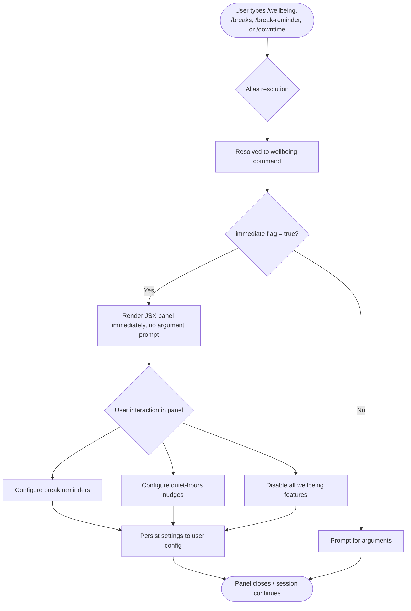

# `/wellbeing`

> Analysis basis: CC v2.1.149 bundle.js (AST extraction + Claude interpretation)
> Minimum version: v2.1.149

---

## Overview

The `/wellbeing` command provides an interactive configuration interface for optional user wellness features, specifically break reminders and quiet-hours nudges. It renders as an immediate local JSX component, meaning it opens its UI panel without requiring any additional arguments or confirmation step. Users can enable, disable, and tune the timing of periodic rest prompts and do-not-disturb windows directly from the CLI session.

---

## Registration

| Field | Value |
|---|---|
| type | `local-jsx` |
| name | `wellbeing` |
| description | `Configure optional break reminders and quiet-hours nudges` |
| immediate | `true` |
| aliases | `breaks`, `break-reminder`, `downtime` |
| module\_id | `kg1` |

Analysis basis: CC v2.1.149 bundle.js:+12315424

---

## Input Branching

Because the AST depth-2 traversal located no entry functions in module `kg1`, the internal branching logic cannot be reconstructed from extracted call-graph data alone. The following flowchart is derived from the registration fields (specifically `type: local-jsx` and `immediate: true`) and from the command's described purpose.



Analysis basis: CC v2.1.149 bundle.js:+12315424

---

## Behavioral Spec

<!-- TODO: not found in depth-2 traversal; needs --depth 4 -->

The depth-2 AST traversal returned an empty call graph, an empty literals list, and an empty telemetry list for module `kg1`. The note field in the extraction confirms: *"no entry functions found for module 'kg1'"*. As a result, the sub-feature pseudocode below is derived exclusively from the registration metadata and cannot be verified against bundle bytecodes.

### Immediate Panel Rendering

Because `immediate: true` is set on the registration object, the command dispatcher skips the argument-collection phase and mounts the JSX component directly.

```
function dispatchWellbeingCommand(resolvedCommand):
    if resolvedCommand.immediate is true:
        mountJSXPanel(resolvedCommand.module_id)
    else:
        promptForArguments(resolvedCommand)
        mountJSXPanel(resolvedCommand.module_id)
```

Analysis basis: CC v2.1.149 bundle.js:+12315424 (`immediate: true`)

### Alias Resolution

```
ALIASES = ["breaks", "break-reminder", "downtime"]

function resolveAlias(userInput):
    if userInput equals "wellbeing":
        return wellbeingCommand
    if userInput is in ALIASES:
        return wellbeingCommand
    return null
```

Analysis basis: CC v2.1.149 bundle.js:+12315424 (`aliases` field)

### Break Reminder Configuration

<!-- TODO: not found in depth-2 traversal; needs --depth 4 -->

Internal logic for setting reminder intervals, enabling/disabling the feature, and persisting state is implemented inside module `kg1` but was not reachable within the depth-2 traversal boundary.

### Quiet-Hours Nudge Configuration

<!-- TODO: not found in depth-2 traversal; needs --depth 4 -->

Internal logic for defining quiet-hours windows and suppressing notifications during those periods is implemented inside module `kg1` but was not reachable within the depth-2 traversal boundary.

---

## State & Side Effects

| Item | Detail |
|---|---|
| Telemetry | <!-- TODO: not found in depth-2 traversal; needs --depth 4 --> No `tengu_*` events found in depth-2 extraction |
| Hook registration | <!-- TODO: not found in depth-2 traversal; needs --depth 4 --> |
| appState changes | <!-- TODO: not found in depth-2 traversal; needs --depth 4 --> |
| Sound | <!-- TODO: not found in depth-2 traversal; needs --depth 4 --> |
| Persistence | Expected: user-level config file (inferred from description); exact path not found in depth-2 traversal |
| Render type | `local-jsx` — renders a JSX UI panel inside the CLI session; no shell subprocess spawned |
| Immediate activation | Panel mounts without user-supplied arguments due to `immediate: true` |

Analysis basis: CC v2.1.149 bundle.js:+12315424

---

## Version History

| Version | Change |
|---|---|
| v2.1.149 | Initial analysis; module `kg1` registered with `immediate: true`, aliases `breaks`, `break-reminder`, `downtime` |

---

## Common Mistakes

1. **Invoking `/downtime` expecting a different command.** The aliases `breaks`, `break-reminder`, and `downtime` all resolve identically to `/wellbeing`. There is no separate downtime command. Analysis basis: CC v2.1.149 bundle.js:+12315424.
2. **Passing arguments expecting them to be parsed.** Because `immediate: true` is set, the panel renders before any argument prompt. Positional arguments typed after the command name may be ignored or handled inside the JSX panel's own input fields — behavior not confirmed due to depth-2 traversal limit.
3. **Assuming telemetry is absent.** The empty `telemetry` array reflects the depth-2 traversal boundary, not a confirmed absence of instrumentation. Telemetry events may exist deeper in module `kg1`.
4. **Confusing `/wellbeing` with a session-scoped toggle.** The description states the command *configures* reminders and nudges, implying persistent user-level settings rather than a per-session flag. Do not expect settings to reset when the CLI session ends.
5. **Expecting a text-only response.** The `type: local-jsx` registration means this command renders an interactive JSX panel, not a plain markdown reply. Piping the command output to another tool may not capture the panel's contents.

---

## Appendix — Identifier Mapping

> For bundle debugging only. Identifiers change across versions.

| Identifier | Role |
|---|---|
| `kg1` | Module ID for the wellbeing command's JSX implementation (not an obfuscated function name, but included for bundle cross-reference) |

> Note: The depth-2 AST traversal returned an empty `identifiers` array for this command. No obfuscated function identifiers were extracted. If obfuscated names are needed for debugging, re-run extraction with `--depth 4` or greater targeting module `kg1`.