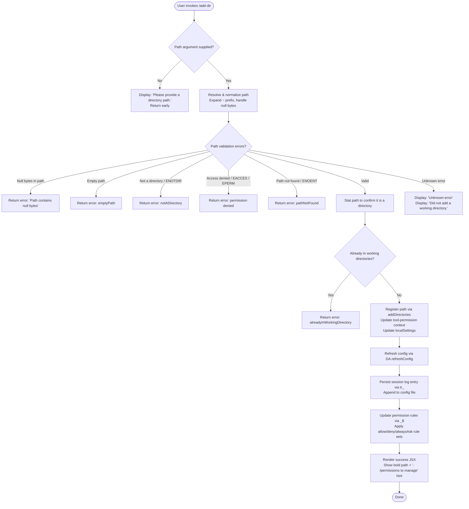

# `/add-dir`

> Analysis basis: CC v2.1.157 bundle.js (AST extraction + Claude interpretation)
> Minimum version: v2.1.157

---

## Overview

`/add-dir` adds a new working directory to the active Claude Code session, expanding the set of filesystem paths the agent is permitted to access. It resolves and validates the supplied path, registers it in the session's tool-permission context and local settings, and refreshes the configuration so the change takes effect immediately without restarting the session.

---

## Registration

| Field | Value |
|---|---|
| type | `local-jsx` |
| name | `add-dir` |
| description | `Add a new working directory` |
| argumentHint | `<path>` |
| module_id | `kV1` |
| load_inline | `true` |
| loc_byte | `10682260` |
| loc_byte_end | `10682408` |
| loc_line | `6574` |
| arbor_handler.name | `ylL` |
| arbor_handler.fqn | `claude-2.1.157::ylL` |
| arbor_handler.kind | `AsyncFunction` |
| arbor_handler.resolution_path | `module_id` |
| arbor_handler.n_hits | `0` |

Analysis basis: CC v2.1.157 bundle.js:+10682260

---

## Input Branching

Seven or more distinct outcome branches exist, so a Mermaid flowchart is used.



---

## Behavioral Spec

### 1. Handler Entry — `addDirHandler` (`ylL`)

The main handler is an `AsyncFunction` resolved via `module_id` → `kV1`.

```
async function addDirHandler(userInput, appContext):
    rawPath = userInput.trim()
    if rawPath is empty:
        return renderError("Please provide a directory path.")

    resolvedPath = resolvePath(rawPath)          // see §2
    validationResult = validateAndStatPath(resolvedPath)  // see §3

    match validationResult.kind:
        "emptyPath"              → return renderError(emptyPath message)
        "notADirectory"          → return renderError(notADirectory message)
        "pathNotFound"           → return renderError(pathNotFound message)
        "accessDenied"           → return renderError(access denied message)
        "alreadyInWorkingDirectory" → return renderError(already tracked message)
        "success"                → continue

    // Register the new directory
    currentDirs = getAppState().workingDirectories       // via V_
    appState.addDirectories([resolvedPath])              // literal "addDirectories" :+10681077

    // Update tool-permission context
    setToolPermissionContext(localSettings)              // :+10681151  literal "localSettings" :+10681124

    // Apply permission rule updates
    applyPermissionRules(appContext)                     // via _$ :+10681183

    // Refresh persisted config
    DA.refreshConfig()                                   // :+10681235

    // Persist to session log / config file
    persistSessionEntry(resolvedPath)                    // via tr_ :+10681254

    // Reload MCP/plugin state
    reloadPluginState()                                  // via m89 :+10681261

    // Build JSX result
    return renderSuccess(resolvedPath)                   // via q8H :+10681295
```

Analysis basis: CC v2.1.157 bundle.js:+10681041

---

### 2. Path Resolution — `resolvePath` (`Pq`)

Handles `~`-expansion, Windows-style paths, null-byte detection, and normalization.

```
function resolvePath(rawPath):
    if rawPath contains null bytes:
        throw PathError("Path contains null bytes")   // :+1007828

    path = rawPath.trim()                             // :+1007862

    if path starts with "~/":                         // :+1007982
        homeDir = os.homedir()                        // via qF6.homedir :+1007935
        path = homeDir + path.slice(2)               // :+1008017

    if platform is "windows":                         // :+1008064
        path = normalizeWindowsDriveLetter(path)      // via wj :+12943669

    path = JN.normalize(path)                         // :+1007884

    if not JN.isAbsolute(path):
        path = JN.resolve(currentWorkingDir, path)   // :+1008188

    return path
```

Analysis basis: CC v2.1.157 bundle.js:+1007575

---

### 3. Path Validation — `validateAndStatPath` (`YcH`)

```
async function validateAndStatPath(resolvedPath):
    if resolvedPath is empty:
        return { kind: "emptyPath" }                 // :+3775566

    try:
        stats = await Lsq.stat(resolvedPath)         // :+3775619
    catch err:
        if err.code == "ENOTDIR":                    // :+3775754
            return { kind: "notADirectory" }         // :+3775664
        if err.code in ["EACCES", "EPERM"]:          // :+3775769, :+3775783
            return { kind: "accessDenied" }
        return { kind: "pathNotFound" }              // :+3775809

    if not stats.isDirectory():
        return { kind: "notADirectory" }

    existingDirs = currentWorkingDirectories()        // via tN :+3775894
    if resolvedPath in existingDirs:
        return { kind: "alreadyInWorkingDirectory" } // :+3775920

    return { kind: "success" }                       // :+3775996
```

Analysis basis: CC v2.1.157 bundle.js:+3775585

---

### 4. Session-State Snapshot — `getSessionSnapshot` (`V_`)

Before registration, the handler reads the existing session state to determine the current set of working directories and tool permission filters.

```
function getSessionSnapshot(appState):
    snapshot = H.getAppState()                        // :+10679373
    lastWorkingDir = snapshot.workingDirectories
                        .findLast(d => d.type == "working_directory")  // :+10679453, literal :+10679478
    allowedTools    = filterByKey(snapshot, "allowed_tools")           // :+10679533
    disallowedTools = filterByKey(snapshot, "disallowed_tools")        // :+10679588
    avoidPrompts    = filterByKey(snapshot, "avoid_prompts")           // :+10679649
    return { lastWorkingDir, allowedTools, disallowedTools, avoidPrompts }
```

Analysis basis: CC v2.1.157 bundle.js:+10679373

---

### 5. Permission Rule Application — `applyPermissionRules` (`_$`)

```
function applyPermissionRules(context):
    // Attempt to set bypass-permissions mode
    result = setMode("bypassPermissions")              // literal :+4666789, :+4666811
    if result is rejected:
        log("Ignoring permission update: setMode 'bypassPermissions' rejected…")
        // :+4666877

    // Process allow rules
    addRules(context, "allow",  "alwaysAllowRules")   // :+4667153, :+4667338, :+4667346
    addRules(context, "deny",   "alwaysDenyRules")    // :+4667378, :+4667385
    addRules(context, "ask",    "alwaysAskRules")     // :+4667403

    // Replace or append rule sets as needed
    replaceRules(context)                              // :+4667501
    removeRules(context)                               // :+4668158

    // Sync directory lists
    applyDirectoryRemoval(context, "removeDirectories") // :+4668542

    ruleSet = context.rules.filter(r => !existingRules.has(r))  // :+4668468, :+4668483
    existingRules.delete(staleEntries)                           // :+4668770
```

Analysis basis: CC v2.1.157 bundle.js:+4666875

---

### 6. Config Persistence — `persistSessionEntry` (`tr_`)

```
async function persistSessionEntry(dirPath):
    env = getEnvironment()                            // via U2H :+12879048
    if env == "production":                           // :+12879014
        realPath = await M7.realpath(dirPath,         // :+12879349
                       { encoding: "NFC" })           // :+12879375

    configDir  = yD.dirname(configFilePath)           // :+12879658
    configPath = yD.join(configDir, configFileName)   // :+12879524
    existing   = await M7.readFile(configPath,        // :+12879553
                    { encoding: "utf8" })             // :+12879567

    await M7.mkdir(configDir,                         // :+12879649
        { recursive: true, mode: 0o700 })             // literal 448 = 0o700 :+12879691
    await M7.appendFile(configPath, serialized,       // :+12879730
        { mode: 0o600 })                              // literal 384 = 0o600 :+12879758

    updateInMemoryLog(serialized)                     // via SH :+12879626
```

Analysis basis: CC v2.1.157 bundle.js:+12879315

---

### 7. Plugin/MCP State Reload — `reloadPluginState` (`m89`)

```
async function reloadPluginState():
    clearStaleCache()                                 // via $j :+4092630
    await reindexFiles()                              // via t9 :+4092648
    persistUpdatedIndex()                             // via ff :+4092813
    if error during any step:
        handleError(P8)                               // :+4092918
        logToSession(SH)                              // :+4092924
```

The CLI flag `--add-dir` (literal at :+10681265) is passed through this path to signal the daemon that a directory was programmatically appended.

Analysis basis: CC v2.1.157 bundle.js:+4092630

---

### 8. Success / Error Rendering — `renderResult` (`q8H`) and `renderSuccess` (`DcH`)

```
function renderResult(outcome, resolvedPath):
    match outcome:
        error variant → return JSX with error message text
        "success"     →
            headline = bold(resolvedPath)             // via j6.bold :+10681313
            hint     = dim("· /permissions to manage") // :+10681606, j6.dim :+10681599
            return JSX(headline, hint)

function renderSuccessPanel(resolvedPath):            // DcH :+10681837
    title     = j6.bold(friendlyLabel)               // :+3776149
    parentDir = tq8.dirname(resolvedPath)             // :+3776217
    return JSX panel with title and parent path

// Error fallback strings observed in literals:
//   "Unknown error"                     :+10681498
//   "Did not add a working directory."  :+10681742
```

Analysis basis: CC v2.1.157 bundle.js:+10681295

---

## State & Side Effects

| Item | Detail |
|---|---|
| Telemetry | `tengu_daemon_config_reload` fired after config refresh (bundle.js:+15481439) |
| appState changes | `addDirectories` key updated with new path (:+10681077); `working_directory`, `allowed_tools`, `disallowed_tools`, `avoid_prompts` keys read during snapshot (:+10679478–:+10679649) |
| Tool-permission context | `setToolPermissionContext` called with `localSettings` (:+10681151, :+10681124) |
| Permission rules | `alwaysAllowRules`, `alwaysDenyRules`, `alwaysAskRules` updated; `bypassPermissions` mode attempted (:+4666789) |
| Config file | Appended via `M7.appendFile` with mode `0o600` (384) (:+12879730, :+12879758); parent directory created with `0o700` (448) if absent (:+12879649, :+12879691) |
| Session log | In-memory log updated via `SH` / `X_4` queue mechanism (:+12879626) |
| Plugin index | Stale cache cleared, file index reloaded, index file atomically rewritten via `fK_.randomBytes` + `LHH.rename` (:+2233497, :+2233598) |
| Hook registration | `_OA.register` called during log-rotation setup (:+58858) |
| Sound | None observed |

---

## Version History

| Version | Change |
|---|---|
| v2.1.157 | Initial analysis |

---

## Common Mistakes

1. **Forgetting the argument** — `/add-dir` without a path argument returns "Please provide a directory path." immediately and does nothing. Always supply `<path>`.
2. **Supplying a file path instead of a directory** — If the path points to a file (or a FIFO/socket/device), the command returns `notADirectory` and aborts. Ensure the target is an actual directory.
3. **Path already registered** — If the resolved path is already present in the session's working directories, the command returns `alreadyInWorkingDirectory` silently. Check `/status` before adding.
4. **Tilde expansion scope** — `~/` is expanded relative to the OS home directory of the process running Claude Code, not necessarily the project root. Verify expansion when running in containers or remote environments.
5. **Permissions not updated in-session** — After `/add-dir` succeeds, tool permissions for the new directory are immediately active; however, MCP plugins that cache directory lists may need a session restart to fully pick up the new path.
6. **Relative paths** — Relative paths are resolved against the current working directory of the Claude Code process, not the directory currently displayed in the UI. Use absolute paths to avoid ambiguity.

---

## Appendix — Identifier Mapping

> For bundle debugging only. Identifiers change across versions.

| Identifier | Role |
|---|---|
| `ylL` | Main async handler for `/add-dir` (arbor_handler) |
| `V_` | Session-state snapshot reader (reads appState working directories and tool filters) |
| `H` | App-state / utility object (getAppState, Math.random, setTimeout, etc.) |
| `A` | Array utility / secondary collection (findLast, toLowerCase, etc.) |
| `f` | File handle / stream abstraction (close, padEnd, get, delete, set) |
| `q` | Secondary file handle / set (close, write, trim, filter, has) |
| `L` | Write-queue manager (add, finally, delete, push, join) |
| `_V8` | Permission-context builder (calls `aA`) |
| `aA` | Permission-context factory |
| `AV8` | Secondary permission-context builder (calls `aA`) |
| `_` | Tool-permission context setter (setToolPermissionContext, toUpperCase) |
| `_$` | Permission-rule application orchestrator |
| `N` | Rule-serialization / config-write helper |
| `QCK` | Rule-category router (calls QI, gCK, qOA) |
| `qOA` | Ask-rule sub-handler (calls QhK, dhK) |
| `RH` | JSON serializer wrapper (JSON.stringify) |
| `v4` | Path-abbreviation / display formatter (uYA, replace, at, lastIndexOf, slice) |
| `uYA` | Character-map builder for display (mCK.map) |
| `EuH` | File-write helper (VYA → H.write) |
| `VYA` | Low-level write wrapper (H.write) |
| `lCK` | Config-file write pipeline (mkdir, appendFile, rotate, buffer) |
| `rxH` | Async write-queue / throttle scheduler (clearTimeout, setTimeout, setImmediate) |
| `M$H` | Config rotation helper (BYA, N0H.join, F8, k6) |
| `g6` | Path utility (used across multiple callers) |
| `qK6` | Config-key lookup helper (j8) |
| `dYA` | Path-join + key helper (N0H.join, k6) |
| `QYA` | File rotation helper (stat, endsWith, rename, unlink) |
| `cCK` | Config-append-and-rotate executor (mkdir, appendFile, qK6, dYA, QYA) |
| `K9` | Log-rotation hook registrar (_OA.register) |
| `vM` | String replacement utility (Z14 → replaceAll) |
| `Z14` | replaceAll wrapper |
| `K` | Rule-column formatter (L.map, f.padEnd) |
| `UI` | UI state accessor |
| `Y` | Supervisor / terminal writer (u2H, q.write, Re1, f.get, G.stop, etc.) |
| `u2H` | Terminal state reader (s9, j8, TAA, EH, V9, GAA, Object.keys, K.has) |
| `s9` | AsyncLocalStorage store reader ($J7.getStore) |
| `j8` | Low-level error code checker |
| `TAA` | Terminal state helper (GAA) |
| `EH` | String coercion helper |
| `Re1` | Column-width calculator (Object.keys, Math.max, sY) |
| `G` | Input event handler (preventDefault, h0, Y, H) |
| `b` | Browser/ink event object |
| `h0` | Key-press dispatcher (U_) |
| `U_` | Settings loader / config orchestrator (ZO, g6, nGH.dirname, Ga8, …) |
| `E` | Watcher/renderer (stop, updateConfig, start) |
| `FVK` | Heartbeat initiator (oHH) |
| `oHH` | Heartbeat emitter |
| `V` | Secondary watcher (start) |
| `d` | Cleanup / teardown callback |
| `L16` | UI layout helper |
| `tr_` | Config-persistence and session-log writer (U2H, M7.realpath, M7.readFile, M7.appendFile) |
| `U2H` | Environment detector (CH, s8K, Zb) |
| `CH` | Environment-string normalizer (String) |
| `s8K` | Environment-flag reader |
| `Zb` | Secondary environment helper |
| `P8` | Error-type checker (j8) |
| `RS` | Async-result helper (AN) |
| `AN` | Promise resolution utility |
| `O_` | Error re-thrower (AN) |
| `SH` | In-memory session-log updater (F_, CH, L1, X_4, YpH.push, Vi.logError) |
| `F_` | Error message formatter (Error, String) |
| `L1` | Log-entry builder (fVA) |
| `fVA` | Log-line formatter (CH) |
| `X_4` | Circular-log queue manager (BB6.shift, BB6.push) |
| `m89` | Plugin/MCP state reload orchestrator ($j, t9, ff, P8, SH) |
| `$j` | Stale-cache cleaner (sYH.delete) |
| `t9` | File index re-builder (oP.stat, oP.readFile, aX7, p6, sYH) |
| `p6` | JSON parse wrapper |
| `ff` | Index file atomic writer (B3, aP.join, RH, $j) |
| `B3` | Atomic file write utility (randomBytes, writeFile, rename, copyFile, unlink) |
| `q8H` | Result-JSX renderer (E0_, N, Y49, I8, U_, vM, aO) |
| `E0_` | JSX element factory helper |
| `Y49` | Working-directory list renderer (jj6, I8, cE7, iE7, aO, U_, N, String) |
| `jj6` | Directory-entry formatter (I8) |
| `I8` | Path display helper (Ng6, $Q) |
| `cE7` | Directory-entry validator/resolver (ZO, F$, g6, wP, q.trim, V9) |
| `ZO` | Path canonicalization (E3H, $Q) |
| `F$` | Filesystem type checker (lstatSync, isFIFO, isSocket, isCharacterDevice, isBlockDevice, realpathSync) |
| `wP` | Path normalization helper (Ni) |
| `iE7` | Directory-entry secondary formatter |
| `aO` | Display-string builder (V14, VZ, v14, H.substring, E14) |
| `V14` | Display template helper |
| `VZ` | Object.hasOwn wrapper |
| `v14` | Display value formatter |
| `E14` | String replaceAll display helper |
| `M` | Permission-set membership checker (cS6, f.has, A0.rm) |
| `cS6` | Plugin-name resolver / path-safety checker (RI.join, RI.relative, RI.isAbsolute, L.startsWith) |
| `YcH` | Path validation and stat orchestrator (Pq, Lsq.stat, Mo, tN) |
| `Pq` | Path resolver (tilde expansion, null-byte check, normalize, homedir) |
| `h6` | AsyncLocalStorage context reader (lB6, O_) |
| `lB6` | Store-context reader (cB6.getStore, dn) |
| `Mo` | Error-kind extractor (O_) |
| `tN` | Existing-directory list builder (Pq, A.replace, q.replace, wj, J_K, HQ) |
| `wj` | Case-normalizer for path comparison (H.toLowerCase) |
| `J_K` | Platform-specific path helper (i6, t2) |
| `HQ` | Directory-list finalizer |
| `DcH` | Success-panel JSX renderer (j6.bold, tq8.dirname) |

---

Note: index built via Arbor fallback; some signals (telemetry, literals) may be missing — see arbor-fallback.js.