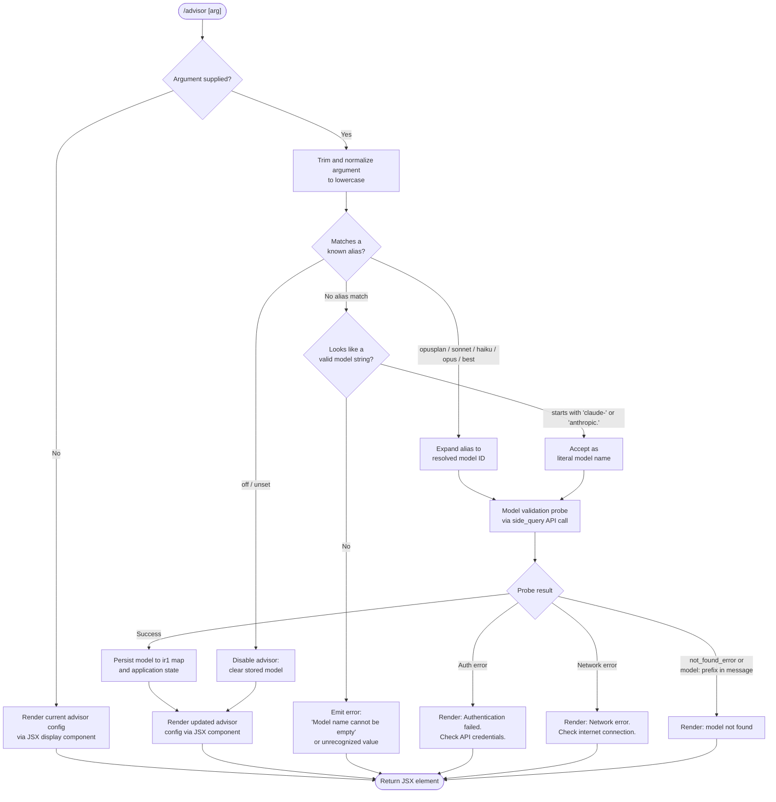

# `/advisor`

> Analysis basis: CC v2.1.159 bundle.js (AST extraction + Claude interpretation)
> Minimum version: v2.1.159

---

## Overview

`/advisor` is a configuration command that manages the **Advisor Tool** — a facility that consults a stronger model (e.g., a larger or more capable Claude variant) at key decision points during a task. Invoking the command either displays the current advisor configuration or, when arguments are supplied, validates and applies a new advisor model setting. The handler is an async JSX-rendering function that ultimately invokes the full API stack (model validation probe, side-query dispatch) before persisting the new selection to application state.

---

## Registration

| Field | Value |
|---|---|
| type | `local-jsx` |
| name | `advisor` |
| description | `Configure the Advisor Tool to consult a stronger model for guidance at key moments during a task` |
| loc_byte | `12362856` |
| loc_byte_end | `12363143` |
| loc_line | `8258` |
| argumentHint | `null` |
| isHidden | `null` |
| module_id | `tr1` |
| load_inline | `true` |
| arbor_handler.name | `q$5` |
| arbor_handler.fqn | `claude-2.1.159::q$5` |
| arbor_handler.kind | `AsyncFunction` |
| arbor_handler.resolution_path | `module_id` |
| arbor_handler.n_hits | `1` |

Analysis basis: CC v2.1.159 bundle.js:+12362856

---

## Input Branching

The command exhibits four or more distinct input paths (no argument / known alias / fully-qualified model name / invalid value), warranting a Mermaid flowchart.



---

## Behavioral Spec

### 1. Entry Point — Handler Dispatch (`q$5`)

The top-level async handler (`q$5`) is reached via the `module_id` → `tr1` → inline load resolution path.

```
async function advisorHandler(commandInput, appContext):
    rawArg = commandInput.trim()          // A.trim, loc:+12362312
    if rawArg is empty:
        return renderCurrentConfig(appContext)
    normalizedArg = rawArg.toLowerCase()  // implicit via downstream calls
    result = await resolveAndValidateModel(normalizedArg, appContext)
    return createElement(AdvisorConfigUI, result)  // FJ.createElement, loc:+12362348
```

Analysis basis: CC v2.1.159 bundle.js:+12362312, +12362348

---

### 2. Argument Parsing — Alias Expansion (`A1`)

The alias-expansion helper normalizes the raw argument string and maps well-known short names to canonical model identifiers.

```
function expandModelAlias(rawArg):
    lowered = rawArg.toLowerCase()        // _.toLowerCase, loc:+2192764
    lowered = lowered.replace(...)        // A.replace, loc:+2192792

    // Recognized aliases (literals, loc:+2192849 – +2193005):
    switch lowered:
        case "opusplan":  return resolveOpusPlanModel()
        case "sonnet":    return resolveFamilyLatest("sonnet")
        case "haiku":     return resolveFamilyLatest("haiku")
        case "opus":      return resolveFamilyLatest("opus")
        case "best":      return resolveBestAvailableModel()
        default:
            // Pass through to format validator
            return validateLiteralModelName(lowered)
```

Known alias string constants found in implementation:
- `"opusplan"` (bundle.js:+2192849)
- `"[1m]"` formatting marker (bundle.js:+2192875)
- `"sonnet"` (bundle.js:+2192890)
- `"haiku"` (bundle.js:+2192929)
- `"opus"` (bundle.js:+2192968)
- `"best"` (bundle.js:+2193005)

Analysis basis: CC v2.1.159 bundle.js:+2192753, +2192764, +2192782

---

### 3. Model Name Format Validation (`Ck8`, `CQ`)

Before issuing the API validation probe, the model string is subjected to format checks.

```
function validateModelInput(modelString, context):
    if modelString.trim() is empty:
        throw Error("Model name cannot be empty")  // loc:+12354571

    lowered = modelString.toLowerCase()            // Ck8→_.toLowerCase, loc:+12354694

    // Prefix allowlist check (CQ path):
    if not (lowered.startsWith("claude-")          // loc:+2186445
            or lowered.startsWith("anthropic.")    // loc:+2186824
            or lowered contains "claude-"):
        if not passesProviderPrefixCheck(lowered):
            return { valid: false, reason: "unrecognized prefix" }

    // Disable sentinels:
    if lowered in ["off", "unset"]:                // loc:+12362388, +12362399
        return { valid: true, action: "disable" }

    // Check known unsupported / reserved model IDs:
    isUnsupported = Q1H.includes(lowered)          // loc:+12354713
    if isUnsupported:
        return { valid: false, reason: "unsupported model" }

    return { valid: true, action: "set", model: modelString }
```

Analysis basis: CC v2.1.159 bundle.js:+12354534, +12354605, +12354694, +12354713

---

### 4. Model Validation Probe (`ku`, `OU`)

When format validation passes, the handler issues a lightweight "side query" API call to verify the model exists and is accessible.

```
async function runModelValidationProbe(modelId, appContext):
    // Emits telemetry label "model_validation" (loc:+12354910)
    // Uses side_query dispatch type (loc:+13166528)

    probeRequest = buildMinimalRequest(
        model   = modelId,
        content = "Hi",            // loc:+12354979
        caching = "ephemeral"      // loc:+12355004
    )

    try:
        response = await apiClient.dispatch(probeRequest, appContext)
        // On success → update ir1 model registry
        ir1.set(modelId, validatedEntry)          // loc:+12355023
        return { success: true, model: modelId }

    catch authError:
        return { success: false,
                 message: "Authentication failed. Please check your API credentials." }
                 // loc:+12355270

    catch networkError:
        return { success: false,
                 message: "Network error. Please check your internet connection." }
                 // loc:+12355372

    catch apiError where type == "not_found_error"
                      or message.startsWith("model:"):
        // loc:+12355491, +12355510, +12355573
        return { success: false,
                 message: "Model not found: " + modelId }
```

API request path: `ku` → `OU` → authentication/header assembly → `iIH` (prompt cache config, emits `tengu_prompt_cache_1h_config`) → `MDH` (request build) → API call.

Analysis basis: CC v2.1.159 bundle.js:+12354860, +12354910, +12354979, +12355004, +12355023, +13166528

---

### 5. Model ID State Persistence (`nM5`, `iM5`)

After a successful probe, the resolved model identifier is normalized and written to the in-memory advisor registry.

```
function persistAdvisorModel(rawModelId):
    // Normalize variant suffixes (opus-4-8 ↔ opus_4_8 etc.)
    // Known variant pairs tracked (loc:+12355840 – +12356217):
    //   opus-4-8/opus_4_8, opus-4-7/opus_4_7, opus-4-6/opus_4_6,
    //   opus-4-5/opus_4_5, sonnet-4-6/sonnet_4_6, sonnet-4-5/sonnet_4_5

    normalized = String(normalizeVariantId(rawModelId))  // nM5→String, loc:+12355760
    includesFlag = normalized.toLowerCase()               // iM5→H.toLowerCase, loc:+12355810

    // Write to advisor model slot in app state
    advisorModelRegistry.set(normalized)
    updateAppStateAdvisorField(normalized)
```

Analysis basis: CC v2.1.159 bundle.js:+12355064, +12355119, +12355760, +12355792

---

### 6. JSX Rendering and Output Joining (`q$5` tail)

After resolution completes, the handler assembles the final JSX output.

```
function buildAdvisorOutput(resolvedConfig, availableModels):
    // LP6: checks whether a model id includes certain substrings
    modelDisplayInfo = filterDisplayModels(availableModels,
                           fn = LP6)               // loc:+12362554
    // LP6 internally: H.toLowerCase + _.includes  // loc:+5350396, +5350419

    parts = [
        headerElement,
        statusElement(resolvedConfig),
        modelListElement(modelDisplayInfo)
    ]
    return parts.join(", ")                        // diH.join, loc:+12362623
```

Analysis basis: CC v2.1.159 bundle.js:+12362554, +12362623

---

## State & Side Effects

| Item | Detail |
|---|---|
| Telemetry — `tengu_prompt_cache_1h_config` | Fired when the model validation probe is assembled with 1-hour prompt cache configuration (bundle.js:+13127319) |
| Telemetry — `tengu_api_success` | Fired upon successful API response from the validation probe (bundle.js:+13167979) |
| Telemetry — `tengu_bg_*` series | Background daemon lifecycle events fired transitively through the API dispatch stack (e.g., `tengu_bg_spare_enable`, `tengu_bg_attach`); not advisor-specific but reachable via callGraph depth-2 |
| Model registry write | `ir1.set(modelId, entry)` persists the validated advisor model into the session-scoped model registry (bundle.js:+12355023) |
| Advisor state update | Application state advisor field is updated via `iM5` / `z5` path after successful validation (bundle.js:+12355883) |
| JSX render | Returns a `local-jsx` element; no side effect on file system or persistent config beyond in-memory state unless the calling UI layer flushes to settings |
| Sound | None detected in depth-2 traversal |
| Hook registration | None detected in depth-2 traversal |

---

## Version History

| Version | Change |
|---|---|
| v2.1.159 | Initial analysis |

---

## Common Mistakes

1. **Passing an unsupported model alias**: Aliases like `"best"`, `"sonnet"`, `"opus"` are expanded internally. Passing a raw versioned model ID (e.g., `claude-opus-4-8`) is valid but will trigger a live API probe — expect a brief network round-trip before the setting is applied.
2. **Using `off` vs `unset` interchangeably without understanding semantics**: Both string literals (`"off"` at bundle.js:+12362388 and `"unset"` at bundle.js:+12362399) disable the advisor, but the downstream state update may differ — prefer `off` unless explicitly needing `unset`.
3. **Assuming instant confirmation**: The advisor command issues a live model-validation side query. In offline or restricted-network environments it will return a network-error message rather than silently storing the value.
4. **Hyphen vs. underscore variant IDs**: Internally the command normalizes `opus-4-8` and `opus_4_8` as equivalent; however, the string passed to external API calls uses the hyphenated canonical form — using underscored forms in other API contexts may fail.
5. **Expecting the command to work without credentials**: The validation probe path runs through the full OAuth/API-key auth stack (`rc6`, `IY`). If credentials are not configured, the command returns an authentication-failure message rather than storing the model.

---

## Appendix — Identifier Mapping

> For bundle debugging only. Identifiers change across versions.

| Identifier | Role |
|---|---|
| `q$5` | Top-level async handler for `/advisor` command (Arbor-resolved entry point) |
| `A1` | Model alias expansion / argument normalization helper |
| `Ck8` | Model name format validation and probe orchestrator |
| `CQ` | Model string prefix and provider format checker |
| `ku` | API side-query dispatch function (model validation probe driver) |
| `OU` | Core API client request builder and executor |
| `nM5` | Advisor model persistence wrapper (calls `iM5`) |
| `iM5` | Inner model normalization and registry write function |
| `LP6` | Display-model filter (checks model id substrings for UI list) |
| `T0` | Model family resolution helper (used by alias expander) |
| `l1H` | Sub-helper reached from `T0` for model string canonicalization |
| `CH` | String coercion / formatting utility (used widely) |
| `d1H` | Provider/model-class inclusion checker |
| `mN` | Model node constructor / descriptor builder |
| `nM` | Base model record factory |
| `GA` | Shared state accessor / getter utility |
| `z5` | Model configuration state updater |
| `BxH` | Model descriptor field builder |
| `bC4` | Extended model config builder (calls `GA`, `l96`, `Hr6`, `KKq`) |
| `qKq` | Object-entry iterator for model config maps |
| `Hr6` | Model family lookup (searches `wq_` registry) |
| `MFH` | Model field merge helper |
| `QG` | Model query/get helper combining `nM`, `z5`, `GA` |
| `$Oq` | Model query wrapper delegating to `QG` |
| `uo6` | Inclusion check for model id in `Xm4` set |
| `$FH` | String construction utility (delegates to `CH`) |
| `_r6` | Object-entries-based model map builder |
| `B_` | Base model record primitive |
| `fFH` | Model class inclusion check against `Dm4` |
| `MOq` | Model index-of / ordering helper |
| `wm4` | Model string composite checker (`d1H` + `A1`) |
| `jm4` | Model string multi-validator (`fOq`, `A1`) |
| `fOq` | Model string prefix validator (`startsWith`) |
| `iIH` | Prompt-cache configuration builder (emits `tengu_prompt_cache_1h_config`) |
| `TA` | Sub-helper combining `IY`, `WR`, `Bq` for request params |
| `up8` | Request metadata builder |
| `G6` | Token/cache state accessor |
| `mp8` | Auxiliary request field assembler |
| `JV` | Request compliance / HIPAA flag handler |
| `z3_` | Compliance state accessor |
| `ZEH` | Compliance field builder (`CH`, `V1_`) |
| `MDH` | Final request object assembler |
| `RH` | JSON serialization helper |
| `wU` | Nonce / request ID generator (uses `BFq.randomBytes`) |
| `s4` | Request context combiner (`IY`, `h6`) |
| `BJ6` | Prompt cache segment builder |
| `kM9` | Cache node constructor |
| `UJ6` | Cache entry builder |
| `Dc` | Agent/thread identity resolver |
| `lk7` | Agent prefix parser (`agent:builtin:`, `agent:custom:`) |
| `q8H` | Thread-type classifier (`repl_main_thread`, `hook_agent`, etc.) |
| `SH` | Structured log/error handler with push to `wpH` |
| `B96` | Unknown auxiliary reached at tail of `ku` (needs --depth 4) |
| `QMH` | Unknown helper in `ku` tail (needs --depth 4) |
| `sw` | Model ID string sanitizer (`H.replace`) |
| `iH8` | Temperature / parameter injector for side queries |
| `IP` | Message array mapper |
| `o9A` | SHA-256 hash builder for cache keys |
| `Uo6` | Session context / cache-header builder |
| `P1` | String coercion primitive |
| `mo6` | Async store accessor (`wOq.getStore`) |
| `Z_8` | Unknown auxiliary (GA-delegating); needs --depth 4 |
| `EEH` | Model class / prefix filter for API routing |
| `nq` | Model-string route selector (`_r6`, `fw`, `Bp8`, `sw`) |
| `PR` | Provider gateway flag checker |
| `T25` | Model list find helper |
| `T` | Transport-type registry (stdio/sdk/http/sse/dynamic) |
| `Tv6` | Transport enum value (stdio-type) |
| `zx8` | Transport enum value (sdk-type) |
| `CqK` | Unknown request combiner; needs --depth 4 |
| `ZFH` | Response provider/header extractor |
| `Ja6` | OAuth / WIF credential resolver and token fetcher |
| `G` | OAuth token manager |
| `X` | IPC/daemon socket frame reader |
| `J` | IPC message bus |
| `w` | Background daemon worker lifecycle manager |
| `Ff` | Stream end/RH flush helper |
| `oB5` | Daemon protocol message dispatcher (large, many sub-ops) |
| `EH` | String coercion wrapper |
| `N9` | Background app-type resolver (returns `"bg"`) |
| `Gr` | Error reporting / issue URL helper |
| `I6` | Internal name resolver (`_N`) |
| `u1_` | URL encoder for request paths |
| `N` | Request header assembler (debug, User-Agent, auth headers) |
| `yO` | Unknown; delegates to `G3_` |
| `jOq` | Boolean coercion helper |
| `IY` | Auth/credential orchestrator (API key, OAuth, proxy) |
| `u3` | Unknown shared utility (reached from multiple call sites) |
| `kH7` | Model context window / token-limit resolver |
| `S_` | Unknown shared state ref |
| `rc6` | Proxy auth helper executor (with 30000 ms timeout, loc:+1778738) |
| `uH7` | HTTP response stream handler and chunk processor |
| `Lw` | Provider classifier (`bedrock`, `vertex`, `foundry`, etc.) |
| `NH7` | Unknown numeric helper |
| `Cz` | Auth error classifier and retry logic |
| `yH7` | Streaming event parser and token counter |
| `nOH` | Idle/polling helper with `Date.now` and `Promise.resolve` |
| `Ap8` | Timestamp utility (`Date.now`) |
| `rO6` | Header key normalizer (`toLowerCase`) |
| `uzH` | SDK error logger (`console.error`) |
| `pH8` | Stream parser (`hP`, `O9`, `nq`, `KN`) |
| `S` | File supervisor / mtime watcher |
| `h` | Focus/blur idle timeout manager (3600000 ms threshold) |
| `I` | Away-summary generator with cache staleness checks |
| `E` | Unknown response processor in `OU` tail |
| `Y0H` | `HSK` registry lookup with startsWith check |
| `s2` | Session state helper (`F3`) |
| `pP` | Profile / auth-mode selector (OAuth, API key, proxy) |

---

Note: index built via Arbor fallback; some signals (telemetry, literals) may be missing — see arbor-fallback.js.