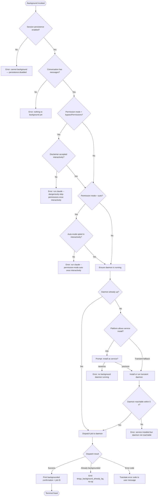

# `/background`

> Analysis basis: CC v2.1.159 bundle.js (AST extraction + Claude interpretation)
> Minimum version: v2.1.159

---

## Overview

The `/background` command (alias: `/bg`) detaches the current interactive Claude Code session from the terminal, hands it off to a background daemon process, and optionally injects a follow-up prompt into the backgrounded job. When no daemon is running, the command attempts to start one (either as a persistent service or as a transient spawn). The command is a `local-jsx` type, meaning its UI is rendered via JSX within the CLI rather than through a simple text response.

---

## Registration

| Field | Value |
|---|---|
| type | `local-jsx` |
| name | `background` |
| description | `Send this session to the background and free the terminal` |
| aliases | `["bg"]` |
| argumentHint | `[prompt]` |
| immediate | `null` |
| module_id | `q8K` |
| load_inline | `true` |
| loc_byte | `12786775` |
| loc_byte_end | `12787015` |
| loc_line | `9020` |
| arbor_handler.name | `Pj5` |
| arbor_handler.fqn | `claude-2.1.159::Pj5` |
| arbor_handler.kind | `AsyncFunction` |
| arbor_handler.resolution_path | `module_id` |
| arbor_handler.n_hits | `0` |

Analysis basis: CC v2.1.159 bundle.js:+12786775

---

## Input Branching

The command has more than three distinct branches based on pre-dispatch validation, daemon availability, and permission-mode checks.



Analysis basis: CC v2.1.159 bundle.js:+12782112 (handler entry `sy8`), +12786116 (`Pj5` guard checks), +12786197 (persistence-disabled literal), +12786373 (no-messages literal), +12779611 (bypassPermissions gate literal), +12779773 (auto-mode gate literal)

---

## Behavioral Spec

### Handler Entry Point (`Pj5`)

The Arbor-resolved handler is `Pj5` (AsyncFunction, resolved via `module_id` → `q8K`).

```
async function backgroundCommandHandler(args, appState):
    # Guard 1 — session persistence
    if not sessionPersistenceEnabled(appState):
        return errorMessage("Cannot background — session persistence is disabled…")

    # Guard 2 — conversation non-empty
    if conversationIsEmpty(appState):
        return errorMessage("Nothing to background yet — send a message first.")

    # Guard 3 — bypassPermissions check
    if permissionMode == "bypassPermissions":
        if not disclaimerAcceptedInteractively():
            return errorMessage("--bg with bypassPermissions requires accepting the disclaimer first…")

    # Guard 4 — auto mode check
    if permissionMode == "auto":
        if not autoModeOptedInInteractively():
            return errorMessage("--bg with auto mode requires opting in first…")

    # Build child-process argv
    argv = buildDaemonArgv(args, appState)  # see below

    # Ensure daemon is alive, possibly spawning it
    daemonStatus = ensureDaemonRunning(appState)

    # Dispatch job
    result = dispatchJobToDaemon(argv, daemonStatus)
    handleDispatchResult(result)
```

Analysis basis: CC v2.1.159 bundle.js:+12786116 (`Pj5`→`N9`), +12786128 (`Pj5`→`d`), +12786182 (`Pj5`→`B2H`)

---

### Argument Vector Construction (`buildBackgroundArgv` / `Kj5`)

The function `Kj5` assembles the full argument vector that will be passed to the backgrounded worker process. It is called from `zn`, which is itself reached from the main handler `sy8`.

```
function buildBackgroundArgv(sessionState, userArgs):
    argv = []

    # Resolve shell
    if platform == "windows":
        argv += ["cmd.exe", "/d", "/s", "/c"]
    else:
        argv += ["/bin/sh"]

    # Identity flags
    argv += ["--agent"]
    if sessionName:
        argv += ["--name", sessionName]   # or "-n"

    # Resume / fork flags
    if resumeId:
        argv += ["--resume=" + resumeId]  # or "-r="
    if shouldFork:
        argv += ["--fork-session"]

    # Session-id
    if sessionId:
        argv += ["--session-id=" + sessionId]

    # Context / continuation flags
    if continuing:
        argv += ["-c"]   # --continue

    # Permission forwarding
    if permissionMode == "bypassPermissions":
        argv += ["--permission-mode", "bypassPermissions"]
        argv += ["--dangerously-skip-permissions"]
        argv += ["--allow-dangerously-skip-permissions"]

    # Tool lists
    if allowedTools:
        argv += ["--allowed-tools", joinedAllowedTools]
    if disallowedTools:
        argv += ["--disallowed-tools", joinedDisallowedTools]

    # Model / effort
    if model:
        argv += ["--model", model]
    if effort:
        argv += ["--effort", effort]

    # Extra directories
    for dir in extraDirs:
        argv += ["--add-dir", dir]

    # Environment passthrough (CLAUDE_CONFIG_DIR, AWS_*, GOOGLE_*)
    env = inheritSelectedEnvVars()

    # Prompt injection
    if userArgs.prompt:
        argv += ["--", userArgs.prompt]   # positional prompt

    # Reply-on-resume flag (from --reply-on-resume parsing)
    if replyOnResume:
        argv += ["--reply-on-resume"]

    return { argv, env }
```

Analysis basis: CC v2.1.159 bundle.js:+12762991 (`--agent`), +12763018/+12763034 (`--name`/`-n`), +12778595 (`--resume=`), +12763232 (`--fork-session`), +12778949 (`--session-id=`), +12763121/+12763131 (`-c`/`--continue`), +12779411/+12779442 (`--permission-mode`/`bypassPermissions`), +12782614 (`--allowed-tools`), +12782655 (`--disallowed-tools`), +12782686 (`--model`), +12782708 (`--effort`), +12782579 (`--add-dir`), +12782527 (`--reply-on-resume`), +12761694 (`cmd.exe`), +12761734 (`/bin/sh`)

---

### Daemon Ensure-Running (`ensureDaemonRunning` / `gF`)

`gF` is the core function that ensures a daemon process exists before dispatching.

```
async function ensureDaemonRunning(appState):
    status = getDaemonStatus()   # checks "daemon.status.json"

    if status == "up":
        emit telemetry "tengu_daemon_ensure_running" with status="up"
        return status

    # Stale service exec detected (binary deleted)
    if serviceExecPathIsStale():
        emit telemetry "tengu_bg_daemon_service_stale_exec"
        log warning "daemon service exec path is stale — falling back to transient spawn…"

    if daemonMode == "ask":
        response = promptUser("Install as a service now? [y/N/never, or 'once' just for now] ")
        emit telemetry "tengu_bg_daemon_cold_start_ask"
        record answer → emit "tengu_bg_daemon_cold_start_ask_answer"

        if response in ["yes", "once"]:
            installOrSpawnDaemon(response)
        elif response in ["never", "no"]:
            return errorMessage("No background daemon is running. Run 'claude daemon install'…")

    elif daemonMode == "run":
        spawnTransientDaemon(origin="transient")

    # Poll for reachability (timeout 5000 ms)
    reachable = waitForDaemon(timeoutMs=5000)
    if not reachable:
        return errorMessage("service installed but the daemon did not become reachable within 5s…")

    return currentDaemonStatus()
```

Analysis basis: CC v2.1.159 bundle.js:+12722257 (`Uw5` status check), +12722300 (`daemon_ensure_running` literal), +12722418 (stale exec warning literal), +12723265 (`ask` literal), +12729844 (install prompt literal), +12723714/+12723720/+12723731 (`run`/`--origin`/`transient`), +12730375 (5000 ms timeout), +12723388 (no-daemon error literal)

---

### Job Dispatch (`dispatchJobToDaemon` / `EqA`)

`EqA` (reached via `zn` → `Kj5` → `EqA`) handles the actual IPC dispatch over a Unix domain socket to the daemon.

```
async function dispatchJobToDaemon(argv, sessionState):
    dispatchId = generateRandomId(8 bytes)   # c6K.randomBytes(8)
    socketPath = buildSocketPath()           # uRH → h3.join + dispatch suffix

    # Write dispatch file
    dispatchFile = buildDispatchFilePath(dispatchId)
    writeDispatchFile(dispatchFile, { argv, env, sessionSnapshot })

    # Connect to daemon socket
    socket = connectDaemonSocket(socketPath, timeoutMs=6000)

    if connectionFailed:
        code = classifyConnectionError()
        emit telemetry "tengu_bg_dispatch" with failure code
        return { error: translateErrorCode(code) }

    # Await acknowledgement
    ack = awaitAck(socket, timeoutMs=200)
    if not ack:
        emit "tengu_bg_dispatch" → "no ack"
        return { error: "timed out" }

    if ack.code == "EALIVE":
        emit "tengu_background_already_bg"
        return { alreadyBackgrounded: true }

    if ack.code == "ESTALE":
        # short-alive or stale-short recovery
        handleStaleSession()

    emit telemetry "tengu_background"
    return { success: true, jobId: dispatchId }
```

Analysis basis: CC v2.1.159 bundle.js:+12758196 (`cli-bg-dispatch`), +12758292 (`c6K.randomBytes`), +12758437 (6000 ms timeout), +12758281 (`no ack`), +12758539 (`EALIVE`), +12758669 (`ESTALE`), +12783151 (`tengu_background`), +12783088 (`tengu_background_spawn_failed`)

---

### Dispatch Error Code Translation

The literals reveal a complete mapping from internal error codes to user-facing strings:

| Internal Code | User-Facing Message |
|---|---|
| `daemon-unreachable` | `not running` |
| `ack-timeout` | `timed out` |
| `dispatch-write` | `couldn't write dispatch file` |
| `enoconn` | `socket missing` |
| `estarting` | `service still starting` |
| `stale-short` / `stale_short` | `id collision with a prior job` or shutdown-in-progress |
| `short-alive` / `short_alive` | `Previous session is still shutting down — try again in a moment` |
| `daemon_unavailable` | `status` → no-op display |

Analysis basis: CC v2.1.159 bundle.js:+12769195, +12769233, +12769272, +12769323, +12769362, +12769411, +12766844, +12766782, +12766922

---

### Session Fork & State Snapshot (`zn`)

Before dispatch, `zn` creates a temporary directory, writes the session snapshot, and prepares the handoff directory structure.

```
async function prepareSessionHandoff(sessionState):
    sessionId = crypto.randomUUID().slice(0, 8)   # 8-char prefix
    tmpDir = join(configDir, "tmp", sessionId)
    await mkdir(tmpDir, { recursive: true })

    # Write daemon.status.json
    statusFile = join(tmpDir, "daemon.status.json")
    writeStatusFile(statusFile, { sessionId, timestamp: Date.now() })

    # Write jobs directory entry
    jobsDir = buildJobsPath()   # gK → aP.join(…, "jobs")
    await writeJobEntry(jobsDir, sessionId, sessionState)

    # Handle gate_blocked state
    if sessionState.gateBlocked:
        markGateBlocked(sessionId)

    return { tmpDir, sessionId }
```

Analysis basis: CC v2.1.159 bundle.js:+12762492 (`randomUUID`), +12762524 (slice length `8`), +12762552 (`mkdir`), +12762562 (`vqA.join` → tmp path), +12762467 (`gate_blocked`), +12450463 (`daemon.status.json`), +4089676 (`jobs`)

---

### Pre-Flight Validation (`jj5`)

`jj5` (called from `zn`) validates permission-mode constraints before any daemon interaction.

```
function validatePermissionPreFlight(sessionState, argv):
    args = parseArgv(argv)

    # Check --dangerously-skip-permissions / bypassPermissions gate
    hasBypass = args.includes("--dangerously-skip-permissions") or
                args.includes("--allow-dangerously-skip-permissions") or
                permissionMode == "bypassPermissions"
    if hasBypass and not disclaimerAccepted:
        throw "--bg with bypassPermissions requires accepting the disclaimer first…"

    # Check auto mode gate
    if permissionMode == "auto" and not autoModeOptedIn:
        throw "--bg with auto mode requires opting in first…"

    return true
```

Analysis basis: CC v2.1.159 bundle.js:+12779368 (`H.indexOf`), +12779378 (`--` separator), +12779411 (`--permission-mode`), +12779442 (`bypassPermissions`), +12779474 (`--dangerously-skip-permissions`), +12779520 (`--allow-dangerously-skip-permissions`), +12779611 (bypass error literal), +12779753 (`auto`), +12779773 (auto-mode error literal)

---

### Session Flush Before Backgrounding (`sL` / flush-wait)

Before handing off to the daemon, the CLI flushes pending output with a 2000 ms timeout.

```
async function flushBeforeBackground():
    try:
        await Promise.race([
            flushPendingOutput(),
            timeout(2000, "flush timeout")
        ])
    finally:
        clearTimeout(flushTimer)
```

Flush timeout: **2000 ms** (bundle.js:+12782407). Timeout label: `"flush timeout"` (bundle.js:+12782412).

---

### JSX Render (`ty8`)

After the dispatch completes, `ty8` renders the final UI output. It constructs a JSX element (via `UfH.createElement`) showing the backgrounded status string `"(backgrounded)"`.

```
function renderBackgroundResult(result):
    if result.alreadyBackgrounded:
        return renderNothing()

    label = "(backgrounded)"           # literal at bundle.js:+12783835
    return createElement(StatusBadge, { label, jobId: result.jobId })
```

Wait timeout for render: **120 seconds** (bundle.js:+12783605).

Analysis basis: CC v2.1.159 bundle.js:+12786334 (`Pj5`→`ty8`), +12786443 (`UfH.createElement`), +12783835 (`(backgrounded)` literal)

---

## State & Side Effects

| Item | Detail |
|---|---|
| Telemetry — primary | `tengu_background` (success path, bundle.js:+12783151) |
| Telemetry — already bg | `tengu_background_already_bg` (bundle.js:+12786130) |
| Telemetry — spawn failed | `tengu_background_spawn_failed` (bundle.js:+12783088) |
| Telemetry — daemon ensure | `tengu_bg_daemon_cold_start_ask`, `tengu_bg_daemon_cold_start_ask_answer`, `tengu_bg_daemon_install`, `tengu_bg_daemon_spawn_failed`, `tengu_bg_daemon_service_stale_exec`, `tengu_bg_daemon_service_poll_fallthrough` |
| Telemetry — dispatch | `tengu_bg_dispatch`, `tengu_bg_dispatch_fallback`, `tengu_bg_dispatch_rescued`, `tengu_bg_dispatch_sigkill_escalate`, `tengu_bg_dispatch_low_mem`, `tengu_bg_dispatch_stale_drop` |
| Telemetry — daemon spare | `tengu_bg_spare_enable`, `tengu_bg_spare_claim`, `tengu_bg_spare_claim_fail`, `tengu_bg_spare_spawn` |
| Telemetry — attach | `tengu_bg_attach`, `tengu_bg_attach_kick`, `tengu_bg_attach_stall_ms`, `tengu_bg_attach_stall_gave_up`, `tengu_bg_attach_stall_respawn`, `tengu_bg_attach_legacy_autorespawn` |
| Telemetry — config | `tengu_config_parse_error`, `tengu_daemon_config_reload` |
| Telemetry — other | `tengu_amber_anchor`, `tengu_bg_low_mem_mb`, `tengu_daemon_control`, `tengu_daemon_idle_exit`, `tengu_bg_proto_mismatch` |
| Filesystem — tmp dir | Creates `<config_dir>/tmp/<8-char-id>/` for session handoff |
| Filesystem — status file | Writes `daemon.status.json` inside tmp dir |
| Filesystem — jobs dir | Writes an entry under `<config_dir>/jobs/` |
| Filesystem — dispatch file | Writes a dispatch file; removed on cleanup via `VqH.rm` |
| Daemon socket IPC | Connects to Unix domain socket; sends dispatch message; awaits ACK |
| Terminal | Frees the terminal after successful backgrounding (session detached) |
| appState changes | Session state transitions to `"backgrounded"`; `(backgrounded)` label shown |
| Process spawn | May spawn a transient daemon via `Bun.spawn` if no persistent service is installed |
| Sound | None detected |

---

## Version History

| Version | Change |
|---|---|
| v2.1.159 | Initial analysis |

---

## Common Mistakes

1. **Running `/background` before sending any message** — the command requires at least one conversation turn. It will reject with `"Nothing to background yet — send a message first."` (bundle.js:+12786373).
2. **Using `bypassPermissions` mode without prior interactive acceptance** — if you've never run `claude --dangerously-skip-permissions` interactively, backgrounding will fail even if the flag appears in your config (bundle.js:+12779611).
3. **Using `auto` permission mode without prior interactive opt-in** — same gate: must have opted in at least once in an interactive session (bundle.js:+12779773).
4. **No daemon installed and choosing `never` at the install prompt** — the command cannot background without any running daemon; it will report `"No background daemon is running."` (bundle.js:+12723388).
5. **Attempting to re-background an already-backgrounded session** — the daemon returns `EALIVE`; the CLI emits `tengu_background_already_bg` and silently no-ops instead of printing an error (bundle.js:+12758539, +12786130).
6. **Dispatch timeout (6000 ms)** — if the daemon socket does not respond within 6 seconds, the dispatch is abandoned with error code `ack-timeout` → user sees `"timed out"` (bundle.js:+12758437, +12769233).
7. **Session persistence disabled** — if the CLI was launched with persistence disabled, `/background` immediately rejects with a clear error (bundle.js:+12786197).

---

## Appendix — Identifier Mapping

> For bundle debugging only. Identifiers change across versions.

| Identifier | Role |
|---|---|
| `Pj5` | Main async handler for `/background` command (Arbor-resolved) |
| `sy8` | Top-level background feature orchestrator (calls daemon ensure + dispatch) |
| `zn` | Session handoff preparation (tmp dir, snapshot, job entry) |
| `jj5` | Pre-flight permission-mode validator |
| `Kj5` | Argument vector builder for daemon worker process |
| `EqA` | Job dispatch over IPC socket to daemon |
| `gF` | Daemon ensure-running (checks status, spawns if needed) |
| `Xy6` | Daemon cold-start / service-install flow |
| `TqA` | Dispatch error-code classifier and message builder |
| `vv8` | Daemon socket connect (lease-based IPC connector) |
| `dO` | Low-level socket write/read for dispatch protocol |
| `uRH` | Dispatch socket path builder |
| `d6K` | Dispatch result state machine |
| `sL` | Pre-background flush with 2000 ms timeout |
| `UT` | Post-flush state update helper |
| `RqA` | Session-state reader used during pre-flight |
| `ty8` | JSX renderer for background result UI |
| `B2H` | Environment / build-variant guard (production vs. test) |
| `a5H` | Detach-request sender (sends `"detach-request"` to worker) |
| `yN1` | Worker task-type handler (`"task"` mode) |
| `Rs` | Stdout writer for backgrounded confirmation |
| `N9` | Guard helper: checks for `"daemon-worker"` context |
| `HO` | Compact-boundary helper used in UI render |
| `HDH` | State-file reader for job status (reads order/stateOrder) |
| `oB5` | Supervisor IPC message dispatcher (handles all supervisor message types) |
| `TfA` | Daemon spare-session refill manager |
| `D` | Background session lifecycle manager (flatMap over sessions) |
| `X` | PTY buffer reader / supervisor stream handler |
| `Y` | Supervisor session map manager |
| `G` | Remote-control-at-startup handler |
| `sVK` | Heartbeat emitter for supervisor |
| `w` | Background session worker lifecycle (spawn, kill, retire) |
| `a` | Session allow-mode wrapper |
| `c` | Session cleanup helper (`hS8`) |
| `G6` | Feature-gate / experiment evaluator |
| `K_8` | Feature-flag lookup with caching |
| `cz_` | Experiment registration (GrowthBook) |
| `Hz` | Background service status emitter (`tengu_amber_anchor`) |
| `nHH` | Daemon-control signal dispatcher |
| `gM` | Error formatter (`w8`) |
| `SH` | Log-queue manager (error log push) |
| `EH` | String coercer utility |
| `RH` | JSON serializer wrapper |
| `U6` | JSON parser wrapper |
| `P8` | Filesystem write utility (`w8`) |
| `N` | Log-level normalizer / message formatter |
| `H1` | Job-state-file reader (reads order/stateOrder, parses JSON) |
| `Lf` | Job-state-file writer (atomic rename via `B3`) |
| `B3` | Atomic file writer (random bytes temp name, rename) |
| `h6H` | Job state label mapper (working/active/daemon) |
| `E4` | Path sanitizer / last-component extractor |
| `tzH` | Config file reader (utf-8, ENOENT handling, backup on error) |
| `l17` | Config file watcher (watchFile/unwatchFile) |
| `h6` | Config snapshot helper (fY_/tzH combo) |
| `sf` | Session-list reader (`Array.from(K.values(…))`) |
| `AN` | Session count / index helper |
| `K9` | Signal/event registrar (`zOA.register`) |
| `Yn` | Argument slicer / permission-set checker (`Aj5.has`) |
| `bp` | Settings merger (userSettings / localSettings / flagSettings / policySettings) |
| `y8` | Settings reader (yg6 + MQ) |
| `Xs1` | Daemon status file writer (`daemon.status.json`) |
| `gk6` | Status file path builder (`Js1.join`) |
| `gK` | Jobs directory path builder (`aP.join(…, "jobs")`) |
| `zT` | Jobs path variant builder |
| `t6K` | `--resume=` / `-r=` flag parser |
| `Xj5` | Tool-name prefix checker (`K.startsWith`, `hqA.has`) |
| `Dj5` | `--session-id=` flag parser |
| `e6K` | Environment variable name classifier |
| `H8K` | Worktree argument handler |
| `g6K` | Session list formatter (`, ` join) |
| `qj5` | Shell command builder (cmd.exe / /bin/sh) |
| `HF6` | Platform shell selector (windows check) |
| `wj5` | Prompt argument extractor (after `--`) |
| `YE` | Fleet-mode flag handler |
| `R6` | Logger context reader (`rB6` + `O_`) |
| `rB6` | AsyncLocalStorage store getter for log context |
| `O_` | Log output writer (`_N`) |
| `fo_` | Daemon health-check poller with timestamp |
| `hq5` | Agent-query executor (abort-signal, flatMap tools) |
| `F0` | Full agent run loop (setAppState, turns, streaming) |
| `t08` | App-state setter / subagent lifecycle |
| `Gh` | Random-bytes ID generator |
| `GAH` | Background gate checker (`m4` + `xSH`) |
| `wm` | Subagent exit-reason classifier |
| `pv6` | Tombstone / tool-use-summary checker |
| `E8` | Abort-signal-with-UUID factory |
| `Ip1` | Tool-use normalizer (`v9` + `KR`) |
| `KR` | String trimmer utility |
| `iN8` | Message-array builder (isMeta / origin / human) |
| `Kh` | Session context builder (ZK + XZ8 + PCH + hP + LT) |
| `XZ8` | Conversation-history serializer (hash, readFile, writeFile) |
| `TT` | Tool-schema builder (large multi-step function) |
| `BuL` | Content-block array mapper |
| `HP1` | History cache helper (`guL`) |
| `PCH` | Query executor (Jl_ + RqK) |
| `Jl_` | Conversation loader (JZ8 + XZ8) |
| `RqK` | Main API query function (tool schema, normalize, stream, retry) |
| `hP` | Auth provider selector (GA + m5 + b1_ + O9 + MFH) |
| `GA` | API client factory (CH) |
| `m5` | Model string formatter |
| `b1_` | Login managed-key detector |
| `O9` | Auth token resolver (ie + A1 + WX) |
| `MFH` | Auth header builder (z5) |
| `LT` | Late-binding tool resolver |
| `jK` | Tool-list filter |
| `HO` | Compact-boundary extractor |
| `CE8` | Compact-boundary classifier (`Ej`) |
| `Ej` | Message-type classifier |
| `ty8` | Background result JSX renderer (also parses `--reply-on-resume`, `yE8`, `Eh`, `QAH`) |
| `XB` | Array-type guard (`Array.isArray`) |
| `yE8` | Tool-use-summary presence checker |
| `Eh` | Tool-list normalizer (`hl`) |
| `hl` | Tool array flattener |
| `QAH` | Argument prefix checker (`H.startsWith`) |
| `y$` | Settings writer (`I6` + `m4`) |
| `I6` | Config dir resolver (`_N`) |
| `wF` | Settings updater (`I6` + `m4`) |
| `N9` | Daemon-worker context guard (`QOH`) |
| `QOH` | Worker-mode string checker |
| `a5H` | Worker detach-request sender (no6 + yN1 + Rs + rAH) |
| `no6` | Worker message-type router |
| `yN1` | Task-mode worker handler (VPH + k8) |
| `VPH` | Task result formatter |
| `Rs` | Stdout confirmation writer (Ss.write + RH) |
| `B2H` | Build-variant guard (production/test, CH + $_K + Ib) |
| `$_K` | Build-flag reader |
| `Ib` | Build-variant verifier |
| `A_6` | Full agent invocation wrapper (fo_ + hq5 + iN8 + Kh + jK + Ip1) |
| `iN8` | Message metadata annotator |
| `ZK` | Session-context finalizer |
| `oB5` | Supervisor socket message handler (all IPC message types) |
| `rB5` | Supervisor attach-phase handler (H1 + gK + j0 + n$ + s$H) |
| `iB5` | Stall-detection helper (G6 + Math.max) |
| `LR6` | Supervisor write-stream wrapper |
| `RVK` | Rate-limited flush scheduler (Date.now + Math.min + g8) |
| `Ff` | Socket end/serializer (H.end + RH) |
| `P` | PTY repaint scheduler (SH + F_ + Dm + UAH + Kc) |
| `I` | Away-summary scheduler (W08 + Yx5 + Ff8 + TZ1) |
| `W08` | Global app-state getter (G5H.getState) |
| `Yx5` | Away-summary eligibility checker (BLA) |
| `Ff8` | Away-summary generator (b8H + F0 + E8 + jP9) |
| `TZ1` | UUID generator (vv.randomUUID) |
| `o` | PTY input forwarder (W.current + Q.setTimeout + N + a) |
| `W` | PTY ref (DL) |
| `Q` | PTY timeout manager (QN6 + Th1) |
| `x` | PTY write scheduler (R + setTimeout + z.write + Math.round) |
| `r` | PTY output forwarder (T.current + Q.setTimeout + N + a) |
| `T` | Output ref (Tv6 + zx8) |
| `B` | MCP tool permission filter (VH + dH) |
| `VH` | MCP plugin manifest reader (LB + $x1.readFile + U6 + v6) |
| `dH` | Orphaned-permission tracker (E) |
| `l` | Terminal session filter (t.filter) |
| `t` | Terminal session lifecycle (voice, recording, PTY, stream) |
| `cm` | Daemon stop sequencer (Promise.race + fd + zd + g8 + process.exit) |
| `z` | Daemon stop state (hH + bH + xy + cm) |
| `xy` | Daemon stop event emitter (Nx + Ld.push + dEH + dz_) |
| `g8` | Abortable timer (K + Error + setTimeout + clearTimeout) |
| `SH` | Log-queue processor (F_ + CH + L1 + I_4 + wpH.push + ki.logError) |
| `F_` | Error/string formatter |
| `L1` | Log entry formatter (JVA) |
| `JVA` | Log line builder (CH) |
| `I_4` | Log queue shift/push |
| `TfA` | Spare-session spawner (G1 + NVK.randomBytes + Sh1 + Rh1 + Rk + QB5 + gT + Bun.spawn + UB5 + M) |
| `G1` | Memory snapshot (hH + bH) |
| `hH` | Heap-used getter (d) |
| `bH` | Heap-total getter (d) |
| `Sh1` | PTY-pid socket path builder |
| `al` | Base socket path builder (h3.join + ms) |
| `Rh1` | Spare-session socket path builder |
| `QB5` | Spare-session initializer (i$) |
| `i$` | Array-type guard for spare sessions |
| `gT` | PTY handshake reader (i6 + h3.join + mRH + H.split) |
| `mRH` | PTY-pid file path builder (h3.join + xRH) |
| `UB5` | Spare-session config builder (i6 + Object.assign) |
| `M` | Plugin staging manager (aS6 + f.has + aW.rm) |
| `aS6` | Plugin path resolver (H.replace + _.toLowerCase + Sk.join/relative/isAbsolute) |

---

Note: index built via Arbor fallback; some signals (telemetry, literals) may be missing — see arbor-fallback.js.