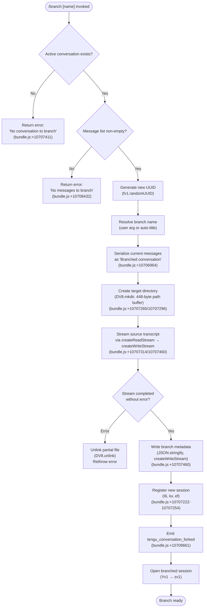

# `/branch`

> Analysis basis: CC v2.1.159 bundle.js (AST extraction + Claude interpretation)
> Minimum version: v2.1.159

---

## Overview

The `/branch` command (also available as `/fork`) creates a divergent copy of the current conversation up to the point it is invoked, allowing independent exploration from any message in the history. It serializes the existing message thread into a new conversation record, persists it to disk under a new UUID, and then opens the branched session for continued use. If no conversation or messages are present the command fails with an informative error.

---

## Registration

| Field | Value |
|---|---|
| type | `local-jsx` |
| name | `branch` |
| description | `Create a branch of the current conversation at this point` |
| argumentHint | `[name]` |
| aliases | `["fork"]` |
| module_id | `Jo_` |
| load_inline | `true` |
| loc_byte | `12205846` |
| loc_byte_end | `12206040` |
| loc_line | `8114` |
| arbor_handler.name | `fnL` |
| arbor_handler.fqn | `claude-2.1.159::fnL` |
| arbor_handler.kind | `AsyncFunction` |
| arbor_handler.resolution_path | `module_id` |
| arbor_handler.n_hits | `0` |

Analysis basis: CC v2.1.159 bundle.js:+12205846

---

## Input Branching

Four distinct code paths exist based on session and message state, requiring a flowchart.



---

## Behavioral Spec

### Entry Point — `fnL` (async branch handler)

The Arbor-resolved handler `fnL` is an `AsyncFunction` reached via `module_id → Jo_`.

```
async function branchHandler(args, context):
    sessionData = getCurrentSession(context)          // I6
    if sessionData is null or undefined:
        return errorMessage("No conversation to branch")   // bundle.js:+10707411

    messageList = getMessages(sessionData)
    if messageList is empty:
        return errorMessage("No messages to branch")       // bundle.js:+10708432

    branchId   = crypto.randomUUID()                  // fv1.randomUUID, bundle.js:+10707203
    branchName = resolveBranchName(args, sessionData) // see below

    sourceTranscript = buildTranscriptPayload(
        messageList,
        label = "Branched conversation",              // bundle.js:+10706964
        format = "text"                               // bundle.js:+10707037
    )

    targetDir = computeTargetDir(branchId)            // path buffer ≤ 448 bytes, bundle.js:+10707296
    await fs.mkdir(targetDir, { recursive: true })    // DV8.mkdir, bundle.js:+10707265

    await streamTranscript(sourceTranscript, targetDir)  // see below
    await writeBranchMetadata(branchId, branchName, sessionData)

    registerBranchSession(branchId, sessionData)      // I6, kv, ef, bundle.js:+10707222-10707254

    emit("tengu_conversation_forked")                 // bundle.js:+10709661

    openBranchSession(branchId)                       // Yv1 → zv1
```

Analysis basis: CC v2.1.159 bundle.js:+10710446

---

### Branch Name Resolution

```
function resolveBranchName(args, sessionData):
    if args contains a non-empty string:
        return sanitizeName(args.trim())    // Ov1 → A.replace, bundle.js:+10707094
    else:
        return autoGenerateTitle(sessionData)  // titleMode = "auto", bundle.js:+10709615
```

The name sanitizer (`Ov1`) calls `_.find` to locate a forbidden-character pattern and then `A.replace` to strip it.
Analysis basis: CC v2.1.159 bundle.js:+10707016, +10707094

---

### Transcript Streaming — `zv1`

```
async function streamTranscript(source, targetDir):
    readStream  = fs.createReadStream(source, { encoding: "utf8" })   // bundle.js:+10707314, +10707347
    writeStream = fs.createWriteStream(targetPath, { flags: "open" }) // bundle.js:+10707460, +10707373

    // wait for read-stream "open" event before piping
    await once(readStream, "open")                   // jo_.once, bundle.js:+10707362

    readStream.pipe(writeStream)

    try:
        await streamFinished(writeStream)            // $v1.finished, bundle.js:+10708842
    catch err:
        await fs.unlink(targetPath)                  // DV8.unlink, bundle.js:+10707674
        throw err

    readStream.destroy()                             // O.destroy, bundle.js:+10707656
    writeStream.end()                                // O.end, bundle.js:+10708828
```

Analysis basis: CC v2.1.159 bundle.js:+10707314

---

### Session Registration — `Yv1` / `zv1`

After the transcript is persisted, `Yv1` (session initializer) calls `zv1` (session constructor) to build the new session record:

```
function initBranchSession(branchId, messages, name):
    sessionRecord = constructSession(            // zv1
        id       = branchId,
        messages = messages,
        title    = name,
        origin   = "fork"                        // bundle.js:+10710182
    )
    registerWithAppState(sessionRecord)          // I6, kv, ef
    attachWorktreeIfPresent(sessionRecord)       // dl → LCH → G_K (worktree detection)
    writeSessionLog(sessionRecord)               // qS → FfH → A.appendFileSync
    emitSessionEvent(sessionRecord)              // i5H → M9A.emit
    return sessionRecord
```

Analysis basis: CC v2.1.159 bundle.js:+10709465, +10710182

---

### Worktree Detection — `dl`

During session construction the branch inherits the current working tree metadata:

```
function detectWorktree(cwd):
    rawOutput = execGit(["worktree", "--porcelain"], cwd)   // bundle.js:+11906199, +11906217
    entries   = parseWorktreePorcelain(rawOutput)           // LCH
    for each entry:
        if entry.path startsWith "worktree ":               // bundle.js:+11906418
            record entry path, HEAD, branch
    emit("tengu_worktree_detection")                        // bundle.js:+11906299
    return entries filtered and sorted by localeCompare     // LCH → L.filter, $.localeCompare
```

Analysis basis: CC v2.1.159 bundle.js:+12915154

---

### Error Paths

| Condition | Literal | Location |
|---|---|---|
| No active conversation | `"No conversation to branch"` | bundle.js:+10707411 |
| Message list empty | `"No messages to branch"` | bundle.js:+10708432 |
| Unknown runtime error | `"Unknown error occurred"` | bundle.js:+10710330 |

---

## State & Side Effects

| Item | Detail |
|---|---|
| Telemetry | `tengu_conversation_forked` (bundle.js:+10709661); indirectly: `tengu_worktree_detection` (+11906299), `tengu_session_renamed` (+12908740), `tengu_agent_name_set` (+12911769) |
| New file I/O | Creates target directory via `DV8.mkdir`; streams transcript via `createReadStream`/`createWriteStream`; writes branch metadata via `JSON.stringify` + `writeFile`; deletes partial file on error via `DV8.unlink` |
| App-state changes | New session registered in the session map (`w.set`, bundle.js:+10708016); old read-stream and write-stream closed/destroyed after transfer |
| Session log | `FfH → A.appendFileSync` appends branch creation entry; `A.mkdirSync` ensures log directory exists |
| Event emission | `Uy6.emit` (session event bus) fired by `qS`; `M9A.emit` fired by `i5H` |
| UUID generation | `fv1.randomUUID` (bundle.js:+10707203) for new branch ID |
| Encoding | Transcript read/written as `"utf8"` (bundle.js:+10707347) |
| Path buffer limit | Target path constructed within a 448-byte buffer (bundle.js:+10707296) |
| Content-replacement marker | String `"content-replacement"` written to output stream (bundle.js:+10707891) indicating message type substitution in branch payload |
| Drain wait | Write stream `"drain"` event awaited before subsequent writes (bundle.js:+10707771) |
| Progress signal | `"progress"` message type emitted during copy (bundle.js:+10708350) |

---

## Version History

| Version | Change |
|---|---|
| v2.1.159 | Initial analysis |

---

## Common Mistakes

1. **Invoking `/branch` before any messages exist.** The command checks that the message list is non-empty and immediately returns `"No messages to branch"` — sending a preliminary prompt first is required.
2. **Invoking `/branch` outside of an active session.** If no conversation object is available the command returns `"No conversation to branch"` with no further action.
3. **Expecting the source conversation to be modified.** `/branch` only reads the source transcript; the original session is left intact.
4. **Using `/branch` with a name containing special characters.** The name is sanitized via `Ov1` (find + replace); forbidden characters are stripped silently.
5. **Confusing `/branch` and `/fork`.** Both names invoke the identical handler; `"fork"` is a registered alias with no behavioral difference (bundle.js:+10710182 records `origin = "fork"` only as an origin tag).
6. **Assuming the branch inherits MCP tool connections.** Background-session and daemon infrastructure (the `yfA`/`ZfA`/`oB5` call chain) is not wired up during `/branch` execution at depth-2; tool connections are re-established independently by the new session on first use.

---

## Appendix — Identifier Mapping

> For bundle debugging only. Identifiers change across versions.

| Identifier | Role |
|---|---|
| `fnL` | Async branch command handler (Arbor-resolved entry point) |
| `Yv1` | Session initializer called by `fnL`; orchestrates branch creation |
| `zv1` | Session constructor; builds the new session record and performs file I/O |
| `Ov1` | Branch-name sanitizer; strips forbidden characters from user-supplied name |
| `LnL` | Supplementary session initializer helper; handles title/ID assignments |
| `qS` | Session rename helper; appends log entry and emits session event |
| `i5H` | Agent-name setter; emits `M9A.emit` and `tengu_agent_name_set` |
| `dl` | Worktree detection orchestrator |
| `LCH` | Worktree porcelain output parser |
| `G_K` | Filesystem directory expander used during worktree resolution |
| `UCH` | Buffer builder for worktree data serialization |
| `FfH` | Session log file writer (`appendFileSync` + `mkdirSync`) |
| `MN` | String-escape utility (replaces special chars with `\$&`) |
| `f9` | Substring utility (indexOf + slice) |
| `I6` | App-state session registry accessor (get/set) |
| `kv` | Session metadata builder (calls `I6`, `fk`, `ef`) |
| `ef` | Session path resolver (calls `US`, `xO`, `O_`, `vjH.join`, `I6`) |
| `US` | Working-directory resolver |
| `O_` | Project-root resolver |
| `xO` | Configuration accessor |
| `fk` | Session flags/feature resolver |
| `P8` | Error-categorization utility |
| `w8` | Error-wrapping utility |
| `SH` | Structured error logger (queues messages, calls `ki.logError`) |
| `F_` | Low-level error formatter |
| `CH` | String coercion helper |
| `L1` | Error log formatter |
| `JVA` | Log entry constructor |
| `I_4` | Ring-buffer manager for error log (shift/push) |
| `U6` | Safe JSON parser |
| `RH` | JSON serializer wrapper |
| `EH` | String identity wrapper |
| `gM` | Error message extractor |
| `uQ` | Session-state persistence helper (read/write JSON via `tM6`) |
| `tM6` | File-backed state manager (readFile/writeFile) |
| `y$` | Session-record schema builder |
| `m4` | Session-record type registrar |
| `K9` | Schema registration caller (`zOA.register`) |
| `yfA` | Background session lifecycle manager |
| `ZfA` | Background session claim/spawn coordinator |
| `oB5` | IPC protocol dispatcher (handles ping, nudge, yield, lease, reply, etc.) |
| `TfA` | Spare-worker spawner (`Bun.spawn`) |
| `w` | Active-session map manager |
| `D` | Session disposal and resource cleanup helper |
| `Fy8` | Memory-usage sampler |
| `G6` | Memory guard / low-memory gating logic |
| `Yw6` | `pins.json` / project-pins reader |
| `NP_` | Pins file path resolver |
| `OP7` | Directory-based project file scanner |
| `H1` | Conversation-history file reader and cache manager |
| `gK` | Conversation storage path resolver |
| `Lf` | Conversation file path builder |
| `jD` | Session roster entry builder |
| `E86` | Auto-title generator (async, calls `UtL`) |
| `qfH` | Conversation directory path builder |
| `gT` | Message-line parser |
| `GF` | Conversation-metadata reader |
| `iN6` | Conversation-directory initializer (`mkdir` + `Js_`) |
| `B` | Session retirement checker (`retireIfSettled`) |
| `VH` | Orphaned-permission checker |
| `dH` | Permission-state tracker |
| `Y` | Terminal multiplexer session controller |
| `j` | Active-process registry iterator |
| `y` | Background-process write/kill helper |
| `S` | Process supervision entry (wraps `HvK`, `Iz`, `N`, `SH`, `DF5`) |
| `HvK` | Process identity verifier (`realpath` + `stat`) |
| `N` | Shell command executor / environment builder |
| `DF5` | Process mtime change detector |
| `z` | PTY output stream (writes `hH`, `bH`, `xy`, `cm`) |
| `hH` | Output good-path handler |
| `bH` | Output error-path handler |
| `J` | Process kill orchestrator |
| `d` | Shared app-state / context object |
| `FC` | Forked-conversation flag setter |
| `W` | Push-notification dispatcher |
| `DL` | Notification formatter |
| `X` | IPC socket frame reader |
| `Ff` | IPC frame serializer |
| `oB5` | Full IPC message handler (see above) |
| `RVK` | Request-timeout and retry scheduler |
| `g8` | Promise-with-timeout utility |
| `Hz` | Background-service context builder |
| `ozH` | Background-service label resolver |
| `P` | Terminal repaint controller |
| `iB5` | Terminal column-width calculator |
| `rB5` | Session re-attach state machine |
| `I` | Away-summary scheduler |
| `W08` | Global app state reader |
| `Yx5` | Away-summary generation entry |
| `Ff8` | API fetch wrapper (abort-signal aware) |
| `TZ1` | Request UUID generator |
| `g` | Message history accessor |
| `o` | Voice toggle handler |
| `Q` | PTY resize scheduler |
| `a` | Permission-decision applier |
| `x` | Idle-exit timer |
| `r` | Voice focus handler |
| `T` | Terminal-view reference holder |
| `l` | Screen-repaint trigger |
| `t` | Voice session controller (start/stop/stream) |
| `c` | Permission-response sender |
| `hS8` | Permission UI helper |
| `LR6` | IPC write-with-destroy helper |
| `Iz` | Process exit-code inspector |
| `O$` | Worktree entry deduplicator |
| `O` | Read-stream wrapper |
| `k8` | Stream event router |

---

Note: index built via Arbor fallback; some signals (telemetry, literals) may be missing — see arbor-fallback.js.