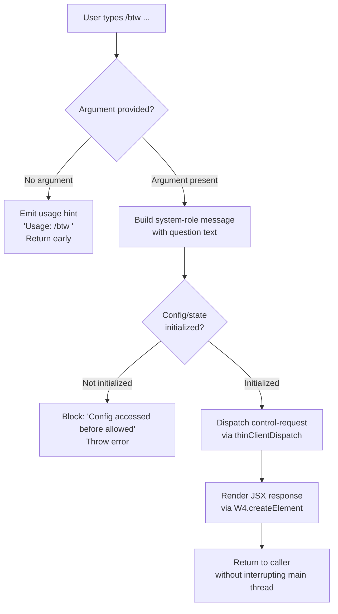

# `/btw`

> Analysis basis: CC v2.1.159 bundle.js (AST extraction + Claude interpretation)
> Minimum version: v2.1.159

---

## Overview

`/btw` ("by the way") allows the user to ask a quick side question or inject a brief aside into the session without disrupting the main conversation thread. It is typed as a `local-jsx` command that dispatches a `control-request` immediately to the thin-client layer, appending the user's question as a system-role message so the agent receives it out-of-band from the primary dialogue.

---

## Registration

| Field | Value |
|---|---|
| type | `local-jsx` |
| name | `btw` |
| description | Ask a quick side question without interrupting the main conversation |
| argumentHint | `<question>` |
| immediate | `true` |
| thinClientDispatch | `control-request` |
| module_id | `jv1` |
| load_inline | `true` |
| loc_byte | `10716242` |
| loc_byte_end | `10716481` |
| loc_line | `6610` |
| arbor_handler.name | `JnL` |
| arbor_handler.fqn | `claude-2.1.159::JnL` |
| arbor_handler.kind | `AsyncFunction` |
| arbor_handler.resolution_path | `module_id` |
| arbor_handler.n_hits | `0` |

Analysis basis: CC v2.1.159 bundle.js:+10716242

---

## Input Branching

Three distinct paths exist based on argument presence and question content:



Analysis basis: CC v2.1.159 bundle.js:+10715837, +10715839, +10715878, +10715947

---

## Behavioral Spec

### 1. Argument Validation

When `/btw` is invoked, the handler (`JnL`) first checks whether a non-empty argument string was supplied by the user.

```
async function btwHandler(userInput, appContext):
    if userInput is empty or missing:
        display "Usage: /btw <your question>"
        return early (no dispatch)
    proceed to buildSystemMessage(userInput, appContext)
```

Analysis basis: CC v2.1.159 bundle.js:+10715837, +10715839

---

### 2. System Message Construction

The question is wrapped in a `system`-role message payload before dispatch. This keeps the aside semantically separate from user-turn messages in the conversation history.

```
function buildSystemMessage(questionText):
    message = {
        role: "system",
        content: questionText
    }
    return message
```

Analysis basis: CC v2.1.159 bundle.js:+10715878

---

### 3. Jitter / Delay Utility

A helper function (mapped to `H` in the bundle) introduces a small randomised delay. It uses `Math.random` scaled between 1 and 2 (constants at bundle.js:+13425530 and +13425514), then calls `setTimeout` to yield before continuing. This is consistent with debounce or back-off patterns used by immediate-dispatch commands.

```
function jitteredDelay():
    factor = 1 + Math.random()   // range [1, 2)
    await setTimeout(baseDuration * factor)
```

Analysis basis: CC v2.1.159 bundle.js:+13425514, +13425516, +13425530, +13425553

---

### 4. Config Read-Write Pipeline

The handler calls into the global config subsystem (`z8`) before dispatching. This pipeline:

1. Acquires a filesystem lock (via `YY_`) using `L.mkdirSync`; if lock contention is detected, emits `tengu_config_lock_contention` and logs `"Lock acquisition took longer than expected — another Claude instance may be running"`.
2. Reads the current config file with `q.readFileSync` (encoding `utf-8`).
3. Parses JSON via `U6` / `JSON.parse`; on parse failure emits `tengu_config_parse_error`.
4. Guards against auth loss: if re-read config is missing auth that the cache holds, emits `tengu_config_auth_loss_prevented` and refuses to write (see literal at bundle.js:+3209384).
5. Applies the system message update via `tOq` / `Object.assign`.
6. Writes atomically through `CL6` (temp file → `cM.fchmodSync` → `cM.fsyncSync` → `q.renameSync`).

```
async function configReadWritePipeline(updatePayload):
    acquireLock()                         // mkdirSync-based
    raw = readFile(configPath, "utf-8")
    parsed = JSON.parse(raw)
    if cacheHasAuth and parsedMissingAuth:
        emit("tengu_config_auth_loss_prevented")
        abort write
    merged = Object.assign(parsed, updatePayload)
    atomicWrite(merged, configPath)
    releaseLock()
```

Analysis basis: CC v2.1.159 bundle.js:+3205990, +3206171, +3208757, +3208784, +3208968, +3209057, +3209193, +3211001, +3211084, +3211632

---

### 5. Background Dispatch and Spare-Session Management

After the config step the handler proceeds through the background-session manager (`w`). Key behaviours:

- **SIGKILL escalation**: if a background process is unresponsive after 30 s (constant at +15469448), a SIGKILL is issued after a 15 s grace period (+15469459); emits `tengu_bg_dispatch_sigkill_escalate`.
- **Low-memory guard**: monitors `hfA.freemem()` against a 1 024-unit threshold (+15469966); emits `tengu_bg_dispatch_low_mem` when crossed.
- **Spare session pre-warming**: when a spare slot is available (`"spare"` literal at +15470263) it is claimed; emits `tengu_bg_spare_claim`. On failure emits `tengu_bg_spare_claim_fail`. A new spare session is enabled via `tengu_bg_spare_enable`.
- **Session lifecycle**: uses `Date.now` for timestamps, `B.retireIfSettled` to clean up settled sessions, and `L` for the file-lock wrapper around session state writes.

```
async function backgroundDispatch(controlRequest, sessionContext):
    if freeMem() < THRESHOLD_1024:
        emit("tengu_bg_dispatch_low_mem")
    spareSession = claimSpare()
    if spareSession is null:
        emit("tengu_bg_spare_claim_fail")
        spareSession = spawnNew()
    else:
        emit("tengu_bg_spare_claim")
    emit("tengu_bg_spare_enable")
    dispatch(controlRequest, spareSession)
    scheduleRetirementCheck(spareSession)
```

Analysis basis: CC v2.1.159 bundle.js:+15469448, +15469459, +15469493, +15469541, +15469800, +15469803, +15469902, +15469918, +15469953, +15469966, +15470072, +15470128, +15470193, +15470204, +15470764, +15470767, +15470821, +15470850, +15470867, +15470882, +15471022, +15471048, +15471151, +15471191, +15471210

---

### 6. JSX Response Rendering

After dispatch, the handler calls `W4.createElement` to produce the JSX element that is surfaced in the CLI UI. This is consistent with `local-jsx` type commands that return a rendered React element rather than raw text.

```
function renderBtwResponse(dispatchResult):
    return W4.createElement(BtwResponseComponent, { result: dispatchResult })
```

Analysis basis: CC v2.1.159 bundle.js:+10715947

---

## State & Side Effects

| Item | Detail |
|---|---|
| Telemetry: `tengu_config_lock_contention` | Fired when config lock acquisition stalls (bundle.js:+3209057) |
| Telemetry: `tengu_config_stale_write` | Fired when a stale config write is detected (bundle.js:+3209193) |
| Telemetry: `tengu_config_parse_error` | Fired when the config JSON cannot be parsed (bundle.js:+3211632) |
| Telemetry: `tengu_config_auth_loss_prevented` | Fired when a write would erase auth credentials (bundle.js:+3209536) |
| Telemetry: `tengu_bg_dispatch_sigkill_escalate` | Fired when a background process is force-killed (bundle.js:+15469493) |
| Telemetry: `tengu_bg_dispatch_low_mem` | Fired when free memory falls below threshold (bundle.js:+15470072) |
| Telemetry: `tengu_bg_spare_enable` | Fired when a spare background session slot is enabled (bundle.js:+15470767) |
| Telemetry: `tengu_bg_spare_claim` | Fired when a spare session is successfully claimed (bundle.js:+15470888) |
| Telemetry: `tengu_bg_spare_claim_fail` | Fired when spare-session claim fails (bundle.js:+15471151) |
| thinClientDispatch | `control-request` — dispatched immediately (`immediate: true`) |
| Config side effects | Acquires mkdirSync file lock; atomic write via temp-rename; backup rotation in `backups/` subdirectory |
| Background sessions | May spawn or claim a spare background session; retires settled sessions |
| appState changes | System-role message injected into session state without touching primary user-turn history |
| Sound | None detected in depth-2 traversal |

---

## Version History

| Version | Change |
|---|---|
| v2.1.159 | Initial analysis |

---

## Common Mistakes

1. **Omitting the argument** — invoking `/btw` with no text produces only a usage hint (`"Usage: /btw <your question>"`) and performs no dispatch. Always provide the question text.
2. **Expecting a user-turn message** — the aside is injected as a `system`-role message, so it will not appear in the visible conversation as a normal user message. Side-question context reaches the model differently from a regular chat turn.
3. **Confusing `/btw` with a blocking command** — `immediate: true` means the command fires without waiting for the current agent turn to finish. Running `/btw` while the model is mid-response is intentional and supported.
4. **Assuming the response is plain text** — the command type is `local-jsx`; the rendered output is a React element, not a raw string, so programmatic consumers must handle the JSX layer.
5. **Concurrent Claude instances** — if another Claude Code process holds the config lock, the command will log a warning about lock contention and emit `tengu_config_lock_contention`. This is not a fatal error but may introduce a short delay.

---

## Appendix — Identifier Mapping

> For bundle debugging only. Identifiers change across versions.

| Identifier | Role |
|---|---|
| `JnL` | Main async handler for `/btw` command (arbor_handler) |
| `H` | Jitter/delay utility (Math.random + setTimeout) |
| `z8` | Global config read-write orchestrator |
| `YY_` | Config file lock acquisition and atomic-save coordinator |
| `_` | Filesystem abstraction (readdirStringSync, statSync, etc.) |
| `g6` | Path existence / guard check helper |
| `L` | File-lock wrapper / fs sync operations (mkdirSync, statSync, etc.) |
| `q` | Secondary filesystem module (readFileSync, copyFileSync, renameSync, etc.) |
| `f` | Promise finalizer / file-handle close helper |
| `tOq` | Config object merge helper (wraps Object.assign) |
| `$K_` | Config schema or defaults initializer |
| `N` | Message/content formatter (handles role, trim, toUpperCase, redaction) |
| `tCK` | Content-block normalizer |
| `RH` | JSON serializer wrapper (JSON.stringify) |
| `E4` | Text-content extraction helper (slice, lastIndexOf, at) |
| `vuH` | Content validation helper |
| `_bK` | File write pipeline with byte-length check and promise chaining |
| `d` | Date/timestamp utility |
| `w8` | Error construction / error-code helper |
| `tzH` | Config file reader and backup manager |
| `U6` | JSON parser wrapper (JSON.parse) |
| `nb` | String prefix stripper (startsWith + slice) |
| `UFq` | Directory walker / backup file locator |
| `DY_` | Backup path builder (join + F8) |
| `w` | Background session process manager (spawn, SIGKILL, memory check) |
| `$Y6` | Auth-presence checker for config guard |
| `A` | Case-normalization helper (toLowerCase) |
| `V` | Prefix-filter helper (startsWith check on directory entries) |
| `P` | MCP/SDK connection manager (http, sse, dynamic transports) |
| `zx8` | SDK transport factory |
| `SH` | MCP server session handler |
| `F_` | Error wrapper / error-code extractor |
| `E` | Backup rotation array slicer |
| `CL6` | Atomic file writer (temp file, fchmod, fsync, rename) |
| `O` | File stat / symbolic-link checker |
| `P8` | Write error handler |
| `BQH` | Config cache accessor |
| `pFq` | Config entries iterator (Object.entries) |
| `FQH` | Config timestamp recorder (Date.now) |
| `zY_` | Config directory resolver and symlink-safe writer |

---

Note: index built via Arbor fallback; some signals (telemetry, literals) may be missing — see arbor-fallback.js.