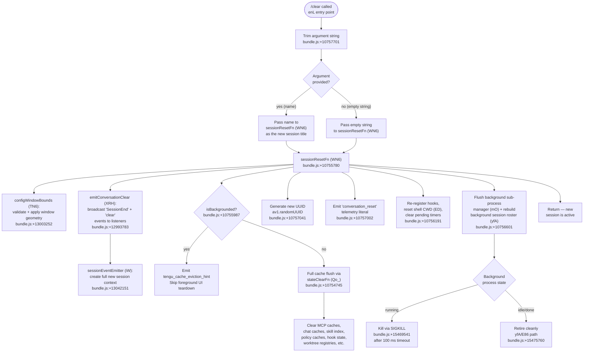

# `/clear`

> Analysis basis: CC v2.1.159 bundle.js (AST extraction + Claude interpretation)
> Minimum version: v2.1.159

---

## Overview

`/clear` (also invocable as `/reset` or `/new`) starts a fresh conversation session by discarding the in-memory context of the current session while preserving the session on disk so it remains accessible via `/resume`. The command generates a new session ID, flushes numerous caches, terminates running background sub-processes, and broadcasts a `conversation_clear` event before rebuilding a clean execution environment.

---

## Registration

| Field | Value |
|---|---|
| type | `local` |
| name | `clear` |
| description | `Start a new session with empty context; previous session stays on disk (resumable with /resume)` |
| aliases | `["reset", "new"]` |
| argumentHint | `[name]` |
| supportsNonInteractive | `true` |
| thinClientDispatch | `post-text` |
| module_id | `ev1` |
| load_inline | `true` |
| loc_byte | `10757875` |
| loc_byte_end | `10758166` |
| arbor_handler.name | `enL` |
| arbor_handler.fqn | `claude-2.1.159::enL` |
| arbor_handler.kind | `AsyncFunction` |
| arbor_handler.resolution_path | `module_id` |
| arbor_handler.n_hits | `0` |

Analysis basis: CC v2.1.159 bundle.js:+10757875

---

## Input Branching

The handler `enL` accepts an optional `[name]` argument and branches on several conditions: whether a name argument was provided, whether a background session is active (`isBackgrounded`), and whether the reset operation itself succeeds or fails. This gives 4+ distinct paths — Mermaid is used below.



---

## Behavioral Spec

### Top-level handler — `enL` (clearCommandHandler)

Analysis basis: CC v2.1.159 bundle.js:+10757701

```
async function clearCommandHandler(args, context):
    name = args.trim()          // bundle.js:+10757701; literal 0 checked at +10757716
    await sessionResetFn(name, context)
```

The handler is minimal: it strips whitespace from the optional name argument and delegates entirely to the session-reset subsystem (`WN6`).

### Session reset orchestrator — `WN6` (sessionResetFn)

Analysis basis: CC v2.1.159 bundle.js:+10755780

```
async function sessionResetFn(newTitle, context):
    // 1. Validate and apply window geometry
    configWindowBounds(context)                         // TN6, +10755780

    // 2. Broadcast session-end events to all listeners
    emitConversationClear(newTitle, context)            // XRH, +10755792

    // 3. Issue cache eviction hint telemetry
    emit("tengu_cache_eviction_hint")                  // +10755884

    // 4. If in backgrounded mode, skip full cache flush
    if context.isBackgrounded:                         // literal "isBackgrounded", +10755987
        // abbreviated teardown only
    else:
        stateClearFn()                                 // Qo_, +10754794

    // 5. Enumerate Object.values of running sub-process map
    //    and signal each                              // +10756050
    for proc in Object.values(processMap):
        killOrRetire(proc)                             // w / yfA paths

    // 6. Add new session to roster
    rosterAdd(newSession)                              // Y.add, +10756102

    // 7. Generate new session UUID
    newId = av1.randomUUID()                           // +10757041

    // 8. Emit conversation_reset literal
    emitEvent("conversation_reset")                    // literal, +10757002

    // 9. Reset AbortController registry
    clearAbortControllers()                            // literal "abortController", +10756536

    // 10. Clear pending clearTimeout handles            // +10756500
    clearAllTimers()

    // 11. Re-initialise hook system
    initHooks()                                        // JB, +10757481

    // 12. Reset shell CWD
    resetCwd(context)                                  // ED, +10756191

    // 13. Flush background session manager
    flushBgSessionManager()                            // mO, +10756601

    // 14. Rebuild background spare sessions
    rebuildSpares()                                    // yfA pipeline

    // 15. Emit conversation_clear literal to wire      // literal "conversation_clear", +10755919
    wire.emit("conversation_clear")
```

### Window-bounds validator — `TN6` (configWindowBounds)

Analysis basis: CC v2.1.159 bundle.js:+13003252

```
function configWindowBounds(context):
    raw = parseInt(context.windowParam, 10)           // +13003252; radix 10 literal, +13003263
    if not Number.isFinite(raw):                      // +13003274
        raw = defaultBoundsValue()                    // YD, +13003317
    bounded = Math.max(minBound,                      // +13003470
                Math.min(maxBound, raw))              // +13003483
    // Multiplier: 1000 ms scaling                    // literal 1000, +13003439
    applyBounds(bounded)                              // Mp/TU path
```

### Session-end event broadcaster — `XRH` (emitConversationClear)

Analysis basis: CC v2.1.159 bundle.js:+12993783

```
function emitConversationClear(title, context):
    // Emit "SessionEnd" lifecycle event
    sessionEventEmitter(title, context)               // Y7, +12993783; literal "SessionEnd", +12993810
    // Hand off to full session-context factory
    buildNewSessionContext(title, context)             // iW, +12993841
    // Emit I6 (inline logger)                        // I6, +12994038
    logSessionEvent()
    // Run session-name resolution helpers            // YhH, +12994043
    resolveSessionName(title)
```

### Full state clear — `Qo_` (stateClearFn)

Analysis basis: CC v2.1.159 bundle.js:+10754745

This function is only called in non-backgrounded mode. It performs a broad sweep of all runtime caches:

```
function stateClearFn():
    clearSkillIndex()           // bu / H.clearSkillIndexCache, +12868341
    clearVT8()                  // VT8, +12868393
    clearSessionCache()         // Yj1, +12868399
    clearSSH()                  // SSH, +12868405
    clearHookStateMap()         // zI9 → jB.clear, +6617690
    rebuildHookStateWriter()    // SIH, +6607620
    clearMCPToolCache()         // $a → eM8, +6665841
    clearVJ6PluginCache()       // vJ6, +6665894
    clearPluginRegistry()       // U8H, +6665909
    clearPolicyCache()          // _$8 → AT1.clear, +10377004
    clearRPCache()              // BI9 → rP6.clear, +6654190
    clearUISessionCache()       // uI9, +6654008
    clearNjH()                  // NjH, +6653098
    resetAutonomousLoopDelivered()  // Zr7, +6665953
    flushTokenOutputCounts()    // gw → outputTokens, +43073
    clearXTCache()              // fa → XT8.clear, +9718328
    clearKnowledgeBaseCache()   // EK1 → PhH.clear, +8836986
    clearGraphCaches()          // vt9 → tsH.clear + sG6.clear, +8140210
    clearHookProgressMap()      // Ho8 → RpH.clear, +1062947
    clearSmCache()              // rN9 → SM8.clear, +6606218
    clearHpCache()              // hp8, +54222
    clearDrCache()              // dr8 → SpH.clear, +1055726
    clearConversationIndex()    // JH1 → ca.clear + HXH.clear, +8206783
    // Resolve and await Promise.resolve() cleanup fence
    Promise.resolve()           // +10755108
    // Run additional cleanup helpers
    runCUCleanup()              // CU_, +10755138
    runQueueCleanup()           // q, +10755181
    runBGCleanup()              // BG8, +10755216
    runZzCleanup()              // $z, +10755307
    runSNHCleanup()             // sNH, +10755392
```

### Background sub-process manager flush — `mO` (flushBgSessionManager)

Analysis basis: CC v2.1.159 bundle.js:+12964442

```
function flushBgSessionManager():
    pendingFlush = yh8(pendingSet)    // track promise set, +12963035
    for each entry in Ih8:            // +12964463
        entry.flush()                 // _.flush, +12964485
        Ih8.delete(entry)             // +12964495
```

### Background session roster teardown — `yfA` (rebuildBgRoster)

Analysis basis: CC v2.1.159 bundle.js:+15474554

```
async function rebuildBgRoster(context):
    pendingSet.add(thisOp)          // q.add, +15474554
    try:
        for each session in roster:
            if session.state == "done" or "killed":
                rm(session.workdir)   // lY.rm, +15474780
                unlink(session.file)  // lY.unlink, +15475843
            elif session.state == "active":
                killWithTimeout(session)  // w / SIGKILL path
        updateRosterFile()            // L1A → yqH.writeFile, +13195551
        compactEntries()              // E86 path, +15475760
        ensureTaskDir()               // iN6, +15475957
        refillSpares()                // yfA recursive / TfA, +15475901
    finally:
        pendingSet.delete(thisOp)     // q.delete, +15474577
```

### CWD reset — `ED` (resetCwd)

Analysis basis: CC v2.1.159 bundle.js:+8192769

```
function resetCwd(context):
    if not SX8.isAbsolute(context.cwd):    // +8192769
        context.cwd = SX8.resolve(context.cwd)  // +8192789
    if not directoryExists(context.cwd):   // g6, +8192804
        throw Error("invalid cwd")         // +8192871
    normalise via ci8()                    // +8192911
    emit("tengu_shell_set_cwd")            // telemetry, +8192924
```

### Hook system re-initialisation — `JB` (initHooks)

Analysis basis: CC v2.1.159 bundle.js:+6629594

```
async function initHooks(context):
    // Validate permissions layer
    permissionsCheck()                    // UK, +6629594
    // Load settings state
    settingsState = readAppState()        // YD, +6629637
    // Apply per-event-type hook registrations
    applyHookEntries(settingsState)       // sEH, +6629643
    // Log plugin load telemetry
    emit("load_plugin_hooks")            // literal, +6629760
    // Validate network conditions for plugin fetch
    checkNetworkForPlugins()              // hpH, +6629756
    // Clone / update plugin repos for managed plugins
    clonePluginRepos()                    // p8H, +6629784
    // Execute session-start hooks
    runSessionStartHooks()               // cP6 → nX, +6630660
    // Emit session-start reload skills event
    emit("hook_session_start_reload_skills")  // literal, +6631008
    // Collect additional context from hooks
    gatherAdditionalContext()            // Vq, +6631127
    emit("hook_additional_context")      // literal, +6631136
```

---

## State & Side Effects

| Item | Detail |
|---|---|
| Telemetry — `tengu_cache_eviction_hint` | Emitted at the top of `sessionResetFn` (bundle.js:+10755884) |
| Telemetry — `tengu_run_hook` | Emitted during hook dispatch phase (bundle.js:+13042572) |
| Telemetry — `tengu_feature_bad` / `tengu_feature_ok` | Feature-flag probe during reset (bundle.js:+966091, +966033) |
| Telemetry — `tengu_hook_plugin_metrics` | Plugin hook metrics gathered during hook re-init (bundle.js:+13021010) |
| Telemetry — `tengu_shell_set_cwd` | CWD validated and set during reset (bundle.js:+8192924) |
| Telemetry — `tengu_session_renamed` | Fires if a new name argument is provided (bundle.js:+12908740) |
| Telemetry — `tengu_repl_hook_finished` | Session-start hook completion (bundle.js:+13026459) |
| Telemetry — `tengu_hook_plugin_injected` | Plugin hook injection during session start (bundle.js:+13040912) |
| Telemetry — `tengu_bg_*` family | Various background-session lifecycle events emitted during roster teardown/refill (`tengu_bg_spare_enable`, `tengu_bg_spare_claim`, `tengu_bg_spare_spawn`, `tengu_bg_dispatch_sigkill_escalate`, etc.) |
| Telemetry — `tengu_daemon_control` | Emitted when daemon background sessions are stopped (bundle.js:+15505330) |
| Wire event — `conversation_clear` | Broadcast to all registered listeners (literal at bundle.js:+10755919) |
| Wire event — `conversation_reset` | Internal reset marker (literal at bundle.js:+10757002) |
| Wire event — `SessionEnd` | Lifecycle hook trigger (literal at bundle.js:+12993810) |
| Wire event — `SessionStart` | Fired by hook re-init (literal at bundle.js:+13022084) |
| Cache flush | All MCP tool caches, skill index, policy cache, knowledge-base graph caches, conversation index, hook progress map, plugin registry, compact caches — cleared in `stateClearFn` (non-backgrounded path only) |
| Hook registration | Session-start hooks re-registered; plugin repos cloned/updated if managed hooks configured |
| appState changes | New UUID assigned to session; session title updated if `[name]` argument supplied; AbortController registry cleared |
| Background processes | All roster entries examined; running processes sent SIGKILL after 100 ms (bundle.js:+15469541, +15469565); spare session pool refilled |
| Disk persistence | Previous session JSON remains on disk unmodified (resumable via `/resume`); new session roster entry written via `L1A → yqH.writeFile` (bundle.js:+13195551) |
| Sound | <!-- TODO: not found in depth-2 traversal; needs --depth 4 --> |

---

## Version History

| Version | Change |
|---|---|
| v2.1.159 | Initial analysis |

---

## Common Mistakes

1. **Expecting history to be gone permanently** — `/clear` preserves the previous session on disk. It is still fully resumable with `/resume`. Only the in-memory context is discarded.
2. **Using `/clear` to change the working directory** — the command resets and re-validates the current CWD but does not change it to a new directory. Use `cd` inside the shell tool for that.
3. **Providing a name with leading/trailing spaces** — the argument is `.trim()`-ed before use (bundle.js:+10757701), so `"/clear  my session  "` becomes `"my session"` as the new title.
4. **Running `/clear` in a thin-client / non-interactive context expecting full teardown** — the `thinClientDispatch: "post-text"` flag means thin clients forward the command as a text message; the full cache-flush branch (`Qo_`) may not execute if the session is flagged as backgrounded (`isBackgrounded`, bundle.js:+10755987).
5. **Confusing `/clear` with `/reset` or `/new`** — all three aliases resolve to the exact same `enL` handler. There is no behavioral difference between them.
6. **Expecting instant background process termination** — background sessions are sent SIGKILL only after a 100 ms delay (bundle.js:+15469565). Very briefly after `/clear` returns, old sub-processes may still appear in the OS process table.

---

## Appendix — Identifier Mapping

> For bundle debugging only. Identifiers change across versions.

| Identifier | Role |
|---|---|
| `enL` | Top-level async handler for `/clear` (clearCommandHandler) |
| `H` | Generic utility / string-helper module (used for `.trim`, `.includes`, etc.) |
| `WN6` | Session-reset orchestrator (sessionResetFn) |
| `TN6` | Window-bounds configuration validator (configWindowBounds) |
| `YD` | Default-bounds supplier / app-state reader |
| `y8` | Core app-state accessor |
| `yY_` | Policy-settings cache accessor |
| `Mp` | Bounds-apply helper |
| `_N` | Low-level logger / noop sentinel |
| `TU` | Bounds-application driver |
| `vz` | Dual-cache clear helper (`hC6.clear` + `Uu8.clear`) |
| `hY_` | Hook-settings applier |
| `XRH` | Session-end event broadcaster (emitConversationClear) |
| `Y7` | Session-event dispatch core |
| `I6` | Inline structured logger |
| `QS` | Secondary logger |
| `zW` | Model-capability resolver (checks claude-3-/opus/sonnet/haiku prefixes) |
| `CV` | Extended capability resolver |
| `kv` | Context-key builder |
| `R6` | Route/output helper |
| `iW` | Full new-session-context factory (buildNewSessionContext) |
| `CH` | String coercion helper |
| `GU` | App-state getter (read path) |
| `N` | Hook-configuration normaliser |
| `gfH` | Hook-metadata aggregator |
| `S9A` | Hook-definition loader (reads hook types from config) |
| `O` | Observation/event-filter helper |
| `xAK` | Hook-watch-paths extractor |
| `h9A` | Third-party hook filter |
| `mAK` | Hook-metadata merger |
| `d` | Async-safe deferred / debounce utility |
| `RH` | JSON-stringify wrapper |
| `SH` | Hook-execution runner (spawns hooks, logs errors) |
| `bH` | Deferred callback helper |
| `GGH` | Callback-group helper |
| `Kv` | AbortController registry manager |
| `J` | Callback/callback-set container |
| `u8H` | Unknown signal broadcast helper |
| `Hv` | Hook-event context builder |
| `Fh8` | Hook-type dispatcher |
| `N9A` | MCP-tool hook executor |
| `dh8` | Hook output parser (JSON vs. plain-text detection) |
| `IAH` | Hook-input transformer (Object.entries/fromEntries) |
| `v9A` | HTTP hook executor |
| `bAK` | Hook-body builder |
| `VfH` | Verbose-flag reader |
| `ch8` | Shell-command hook executor (spawns bash/powershell) |
| `pyH` | Hook-progress broadcaster |
| `hH` | Deferred callback flusher |
| `YhH` | Session-name resolver |
| `p96` | Abort-signal helper |
| `L` | Promise-tracking set helper |
| `q` | File-unlink queue |
| `f` | Stream/socket handle |
| `A` | Array/collection helper |
| `w` | Background sub-process dispatch manager |
| `S` | Sub-process wrapper (write/kill/monitor) |
| `HvK` | Realpath/stat helper |
| `Iz` | Process-kill helper |
| `DF5` | Supervisor-write helper |
| `z` | Output-stream writer |
| `Fy8` | Free-memory reporter (macOS) |
| `G6` | Memory-pressure gauge |
| `Yw6` | Session-pins file reader (`pins.json`) |
| `NP_` | Path joiner for data directory |
| `U6` | JSON.parse wrapper |
| `P8` | Error-code classifier (ENOENT etc.) |
| `OP7` | Session-directory walker |
| `B` | Background-session retire helper |
| `VH` | MCP-tool-use result validator |
| `dH` | Orphaned-permission cleaner |
| `ZfA` | Daemon-claim sender |
| `L1A` | Session roster file writer |
| `FB5` | Claim-timeout enforcer (5000 ms) |
| `BB5` | Claim-frame builder |
| `gM` | Generic wait/backoff helper |
| `EH` | String coercion (toString) |
| `DF` | Binary frame builder (Buffer.allocUnsafe + writeUInt32BE) |
| `yfA` | Background session roster teardown/rebuild |
| `K` | Column-padding helper |
| `gK` | Data-directory path resolver |
| `H1` | Session file reader/cache (tYH map) |
| `jD` | Active-session detector |
| `Lf` | Session-path builder |
| `E86` | Session-compaction helper |
| `qfH` | Task-directory path helper |
| `gT` | Task-file path builder |
| `GF` | Task-state file writer |
| `iN6` | Task-directory initialiser |
| `Y` | Session-lifecycle manager (start/stop/updateConfig) |
| `D` | Sub-process lifecycle orchestrator |
| `$` | Disposable-resource helper |
| `TfA` | Spare-session spawner (Bun.spawn) |
| `w8` | Generic warning emitter |
| `R` | Resource-disposal wrapper |
| `iX` | Session-index helper |
| `Zj` | Session-register helper |
| `Qo_` | Full state-clear orchestrator (stateClearFn) |
| `po_` | Pre-clear hook |
| `IC` | Skill-index invalidator |
| `bu` | Skill-cache clearer |
| `VT8` | VT-cache clearer |
| `Yj1` | Session-cache clearer |
| `SSH` | SSH-config cache clearer |
| `zI9` | Hook-state map clearer |
| `SIH` | Hook-state file writer |
| `$16` | Ephemeral-state reset |
| `$a` | Multi-cache clear coordinator |
| `MNH` | Main-queue cache clearer |
| `eM8` | MCP-tool-ready-state cleaner |
| `vJ6` | Plugin-session-start emitter |
| `U8H` | Plugin-registry clearer |
| `_$8` | Policy-cache clearer (AT1) |
| `BI9` | Permission-cache clearer (rP6 + xI_) |
| `uI9` | UI-session-cache clearer |
| `NjH` | NjH-namespace clearer |
| `gw` | Output-token-count flusher |
| `QI_` | QI-namespace reset |
| `fa` | XT8-cache clearer |
| `EK1` | Knowledge-base graph cache clearer (PhH + $B_) |
| `vt9` | Time-series/graph cache clearer (tsH + sG6) |
| `Ho8` | Hook-progress map clearer (RpH) |
| `TA9` | TA9-namespace reset |
| `rN9` | SM8-cache clearer |
| `hp8` | H-has sentinel check |
| `dr8` | SpH-cache clearer |
| `zX1` | zX1-namespace reset |
| `JH1` | Conversation-index clearer (ca + HXH) |
| `ED` | CWD validator and setter (resetCwd) |
| `g6` | Directory-existence checker |
| `ci8` | CWD normaliser (NFC) |
| `w9H` | Path-normalise helper |
| `O_` | Structured-log emitter |
| `JvH` | Journal-view helper |
| `JE` | Journal-event dispatcher |
| `mO` | Background-session flush manager |
| `yh8` | Pending-promise-set tracker |
| `aiH` | CLI-context accessor (IP9) |
| `IP9` | CLI-app instance holder |
| `tv1` | Timer/cMH-session helper |
| `cMH` | cMH-cache helper |
| `y$` | In-process reset helper |
| `m4` | Session-model accessor |
| `K9` | zOA-register caller |
| `fk` | fk-namespace helper |
| `ef` | Sub-agent registry reset |
| `US` | Sub-agent path builder |
| `GN6` | GN6-model reset |
| `du8` | UUID + event-emitter helper (mC6) |
| `cl` | cl-model reset |
| `qS` | Session-rename emitter |
| `FfH` | Append-file logger (appendFileSync) |
| `jSH` | Worktree symlink manager |
| `G9A` | Worktree mkdir helper |
| `$tH` | Worktree path builder |
| `S$` | Worktree secondary path builder |
| `feH` | Worktree-file opener |
| `jE` | Sub-agent-file path resolver (yI_ map) |
| `SM` | SM-namespace reset |
| `G_` | gWH / module-export initialiser |
| `lR6` | lR6-bind helper |
| `W` | DL-dispatch wrapper |
| `DL` | DL-level dispatcher |
| `G` | remoteControl / keyboard-event interceptor |
| `b` | Key-event source |
| `I0` | Remote-control initialiser |
| `U_` | Settings-file loader (flagSettings / userSettings / projectSettings / localSettings) |
| `sf` | sf-namespace reset |
| `Wm` | Worktree-state emitter |
| `nAH` | Isolation-latch log writer |
| `X_K` | Append-file log helper (q7) |
| `JB` | Hook-system re-initialiser (initHooks) |
| `UK` | Permission-layer validator |
| `sEH` | Per-event-type hook registrar |
| `hpH` | Plugin-network-check helper |
| `Y8` | Append-file log writer (L.appendFileSync) |
| `cP6` | Session-start hook runner |
| `CX` | CX-context helper |
| `nX` | Full hook-execution engine (REPL context) |
| `M` | Plugin-staging directory manager (aW.rm) |
| `aS6` | Plugin-path resolver + staging helper |
| `Vq` | Additional-context aggregator (uw1.randomUUID) |

---

Note: index built via Arbor fallback; some signals (telemetry, literals) may be missing — see arbor-fallback.js.