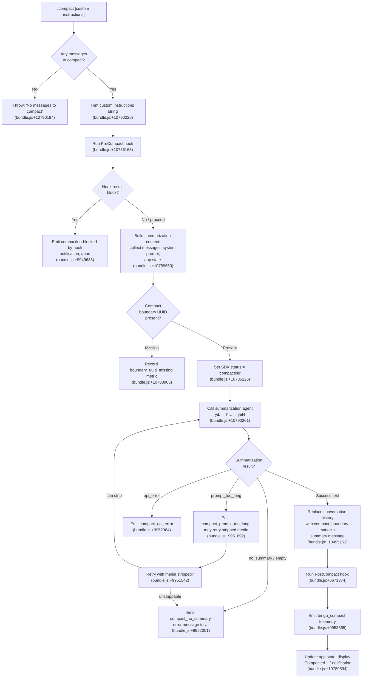

# `/compact`

> Analysis basis: CC v2.1.159 bundle.js (AST extraction + Claude interpretation)
> Minimum version: v2.1.159

---

## Overview

`/compact` frees up context window space by summarizing the current conversation into a single dense summary message, replacing the full message history with that summary. It accepts an optional custom instructions argument that guides the summarization style or focus. The command works both interactively (REPL mode) and in non-interactive/SDK contexts via `thinClientDispatch: "post-text"`.

---

## Registration

| Field | Value |
|---|---|
| type | `local` |
| name | `compact` |
| description | `Free up context by summarizing the conversation so far` |
| argumentHint | `<optional custom summarization instructions>` |
| supportsNonInteractive | `true` |
| thinClientDispatch | `"post-text"` |
| module_id | `oN1` |
| load_inline | `true` |
| loc_byte | `10791132` |
| loc_byte_end | `10791445` |
| arbor_handler.name | `yiL` |
| arbor_handler.kind | `AsyncFunction` |
| arbor_handler.fqn | `claude-2.1.159::yiL` |
| arbor_handler.resolution_path | `module_id` |
| arbor_handler.n_hits | `0` |

Analysis basis: CC v2.1.159 bundle.js:+10791132

---

## Input Branching

The command has more than 3 distinct branches (empty message list guard, PreCompact hook block, missing boundary UUID, summarization error paths, successful compaction path), so a Mermaid flowchart is used.



---

## Behavioral Spec

### Top-Level Handler (`yiL`)

```
async function compactCommandHandler(args, context):
    // args.userInput is the raw argument string
    // bundle.js:+10790163
    conversationState = getConversationSlice(context)  // HO

    if conversationState is empty:
        throw Error("No messages to compact")           // bundle.js:+10790194

    customInstructions = args.userInput.trim()          // bundle.js:+10790226

    // Invoke the inner compaction orchestrator
    result = await runCompaction(customInstructions, context)  // uc, bundle.js:+10790243

    // Build system prompt context
    systemContext = buildSystemPromptContext(context)    // hiL → rN1, bundle.js:+10790298

    // Post-compact state cleanup
    resetConversationState(context)                      // $a, bundle.js:+10790453
    updateUIState(context)                               // bIH, bundle.js:+10790428
    startNewTurn(context)                                // iN1, bundle.js:+10790525

    if result.canceled:
        display("Compaction canceled.")                 // bundle.js:+10790734

    emitLogEntry(result)                                // SH, bundle.js:+10790884
```

Analysis basis: CC v2.1.159 bundle.js:+10790163

---

### Compaction Orchestrator (`hiL`)

```
async function compactionOrchestrator(customInstructions, context):
    startTime = performance.now()                        // bundle.js:+10786246

    // Emit compact_progress status marker
    emitStatus("compact_progress")                       // bundle.js:+10786109

    // Run hooks_start / pre_compact lifecycle
    emitLifecycle("hooks_start")                         // bundle.js:+10786140
    emitLifecycle("pre_compact")                         // bundle.js:+10786163

    // Mark sdk_status = "compacting"
    setSDKStatus("compacting")                           // bundle.js:+10786225

    // Run PreCompact hook (may block)
    hookResult = await runPreCompactHook(context)        // bundle.js:+10786385 (rN1)

    if hookResult.blocked:
        emitNotification("compaction-blocked-by-hook")   // bundle.js:+9949633
        return { canceled: true }

    // Set stream_mode = "requesting"
    setStreamMode("requesting")                          // bundle.js:+10786544

    // Start compaction span for tracing
    startSpan("claude_code.compaction", {               // bundle.js:+9950484
        type: isManual ? "compact_manual" : "compact_auto"
    })

    // Run the actual summarization (yeH)
    summaryResult = await generateSummary(customInstructions, context)  // bundle.js:+10786700 (SiL → yeH)

    if summaryResult.error:
        handleCompactionError(summaryResult.error)       // bundle.js:+10787040 (SH), +10787075 (EH)
        return { canceled: false, error: summaryResult.error }

    // Apply summary to conversation history
    applyCompactionResult(summaryResult)                 // $a, bundle.js:+10787590

    // Emit compact_end lifecycle
    emitLifecycle("compact_end")                         // bundle.js:+10788081

    endTime = performance.now()
    emitTelemetry("tengu_compact", { duration: endTime - startTime })  // bundle.js:+9953665

    return { canceled: false, summary: summaryResult.text }
```

Analysis basis: CC v2.1.159 bundle.js:+10786246

---

### Summary Generation (`yeH`)

```
async function generateSummary(customInstructions, context):
    startTime = performance.now()                        // bundle.js:+9950460

    // Collect conversation messages
    messages = collectMessages(context)                  // mc, bundle.js:+9950883

    // Check for existing compaction boundary
    boundaryInfo = findCompactBoundary(messages)         // bundle.js:+10495595 "compact_boundary"

    if boundaryInfo.uuid is missing:
        recordMetric("boundary_uuid_missing")            // bundle.js:+10788905
        // Proceed, but note the miss

    // Build summarization prompt using the context collector
    contextPayload = buildContextPayload(messages, customInstructions)  // bundle.js:+9951355 (UX1)

    // Submit to summarization API
    // System prompt: "You are a helpful AI assistant tasked with summarizing conversations."
    // (bundle.js:+9963533)
    apiResult = await callSummarizationAPI(contextPayload)

    if apiResult.promptTooLong:
        emitTelemetry("tengu_compact_ptl_retry")         // bundle.js:+9951732
        strippedPayload = stripMediaFromPayload(contextPayload)  // uX1, bundle.js:+9951542
        if strippedPayload.isEmpty:
            emitTelemetry("tengu_compact_failed")        // bundle.js:+9964812
            return { error: "prompt_too_long", unstrippable: true }
        apiResult = await callSummarizationAPI(strippedPayload)

    if apiResult.noSummary or apiResult.text is empty:
        emitTelemetry("tengu_compact", { result: "no_summary" })  // bundle.js:+9952001
        return { error: "compact_no_summary" }

    if apiResult.apiError:
        emitTelemetry("tengu_compact_api_error")         // bundle.js:+9952364
        return { error: "compact_api_error" }

    // Success: emit full compaction telemetry
    emitTelemetry("tengu_compact", { result: "compact_full" })    // bundle.js:+9952823

    return { text: apiResult.text }
```

Analysis basis: CC v2.1.159 bundle.js:+9950460

---

### Conversation History Replacement (`getConversationSlice` / `HO`)

```
function getConversationSlice(context):
    // Locates the compact boundary marker in message history
    // Marker string: "compact_boundary" (bundle.js:+10495595)
    // Returns slice starting after last compact_boundary, or full history
    //
    // Boundary is identified by type "system" with subtype "compact_boundary"
    // (bundle.js:+10495573, +10495595)

    allMessages = context.getMessages()
    boundaryIndex = findLastIndex(allMessages,
        msg => msg.type == "system" && msg.subtype == "compact_boundary"
    )
    // Returns [1, 0] slice indices (bundle.js:+10495649, +10495654)
    return allMessages.slice(boundaryIndex + 1)
```

Analysis basis: CC v2.1.159 bundle.js:+10495573

---

### Post-Compaction State Reset (`$a`)

```
function resetAfterCompaction(context):
    // Clears in-flight state trackers
    clearPendingMessages()               // eM8, bundle.js:+10787590
    clearPostCompactFileRestore()        // vJ6, bundle.js:+6665894
    resetToolStateCache()                // U8H, bundle.js:+6665909
    clearToolTrackingSet()               // _$8, bundle.js:+6665915
    clearCacheControlMaps()              // BI9, bundle.js:+6665921
    resetAutonomousLoopDelivered()       // bundle.js:+6665953 (Zr7.resetAutonomousLoopDelivered)
    resetOutputTokenCounters()           // gw, bundle.js:+6666003

    // Injects "Conversation compacted" marker into message list
    // Literal: "Conversation compacted" (bundle.js:+10495151)
    insertCompactionMarker(context)
```

Analysis basis: CC v2.1.159 bundle.js:+6665831

---

### Error Display

```
function displayCompactionError(errorKind):
    switch errorKind:
        case "prompt_too_long":
            showError("Compaction failed · conversation could not be reduced below the context limit")
            // bundle.js:+10787207
        case "media_too_large":
            showError("Compaction failed · attached media exceeds size limits")
            // bundle.js:+10787329
        default:
            showError("unknown error")                   // bundle.js:+10787453
```

Analysis basis: CC v2.1.159 bundle.js:+10787207

---

### Reactive Compaction (Auto-Triggered Path, `cI_`)

The reactive compact path (`cI_`) is triggered automatically when the context window approaches its limit, distinct from the user-invoked `/compact` command but sharing the same core summarization engine.

```
async function reactiveCompact(context):
    // Emits: tengu_reactive_compact_attempt (bundle.js:+6651379)

    groups = groupMessagesForSummarization(context)      // iM8, bundle.js:+6670202

    if groups.length < 2:
        log("Reactive compact: fewer than 2 groups, nothing to compact")
        // bundle.js:+6650656
        emit("too_few_groups")                           // bundle.js:+6650746
        return

    // Minimum group count for seeded compaction: 3 (bundle.js:+6650893)
    summarizeSet = selectSummarizeSet(groups)

    if summarizeSet has no assistant messages:
        log("Reactive compact: no assistant messages in summarize set, bailing")
        // bundle.js:+6651218
        return

    result = await callSummarizationAPI(summarizeSet)

    if result.mediaSizeError:
        log("Reactive compact: summarize hit media-size error, retrying stripped")
        // bundle.js:+6652102
        strippedResult = await callSummarizationAPI(stripped(summarizeSet))
        if strippedResult.failed:
            emit("media_unstrippable")                   // bundle.js:+6652217
            emit("tengu_reactive_compact_failed")        // telemetry
            return

    if result.success:
        emit("tengu_reactive_compact_succeeded")         // bundle.js:+6671970
        applyReactiveCompactionResult(result)
    else:
        emit("tengu_reactive_compact_failed")
```

Analysis basis: CC v2.1.159 bundle.js:+6651379

---

## State & Side Effects

| Item | Detail |
|---|---|
| Telemetry — primary | `tengu_compact` (bundle.js:+9953665) — fires on every compaction attempt with result field (`compact_full`, `no_summary`, etc.) |
| Telemetry — errors | `tengu_compact_failed` (+9964812), `tengu_compact_ptl_retry` (+9951732), `tengu_compact_api_error` (+9952364), `tengu_compact_no_summary` (+9952072) |
| Telemetry — reactive path | `tengu_reactive_compact_attempt` (+6651379), `tengu_reactive_compact_succeeded` (+6671970), `tengu_reactive_compact_failed` (+6669589) |
| Telemetry — cache | `tengu_compact_cache_prefix` (+9951260), `tengu_compact_cache_sharing_success` (+9962091), `tengu_compact_cache_sharing_fallback` (+9962721) |
| Telemetry — post-compact hooks | `tengu_post_compact_file_restore_success` (+9965294), `tengu_post_compact_file_restore_error` (+9965336) |
| Telemetry — precomputed compact | `tengu_precomputed_compact_consumed` (+6664647), `tengu_precomputed_compact_discarded` (+6665266) |
| Hook: PreCompact | Runs before summarization; if it returns `block`, compaction is aborted with notification `"compaction-blocked-by-hook"` (bundle.js:+9949633) |
| Hook: PostCompact | Runs after successful summary application; literal `"PostCompact"` hook type (bundle.js:+13022167) |
| appState changes | SDK status set to `"compacting"` during execution (bundle.js:+10786225); reset via `bIH.iP6.setState` (bundle.js:+6652694) after completion |
| Conversation history | All messages before current compact boundary are discarded; a new `compact_boundary` system message is inserted (bundle.js:+10495595), followed by the summary text |
| UI notification | Displays `"Compacted <N>"` on success (bundle.js:+10789594); registers keybinding `ctrl+o` for `app:toggleTranscript` (bundle.js:+10789487) |
| Tracing span | Opens `claude_code.compaction` OTel span (bundle.js:+9950484) |
| Sound | <!-- TODO: not found in depth-2 traversal; needs --depth 4 --> |

---

## Version History

| Version | Change |
|---|---|
| v2.1.159 | Initial analysis |

---

## Common Mistakes

1. **Running `/compact` on an empty session**: The handler throws `"No messages to compact"` immediately if no messages exist (bundle.js:+10790194). Always ensure at least one exchange has taken place.
2. **Expecting tool use during compaction**: Tool use is explicitly denied during the compaction agent's turn — any tool call returns `"Tool use is not allowed during compaction"` (bundle.js:+9961214).
3. **Assuming custom instructions are always honored in reactive compact**: The auto-triggered reactive path (`cI_`) does not accept user-supplied custom instructions; only the manual `/compact [instructions]` path passes them to the summarization agent.
4. **Confusing the compact boundary with a regular message**: The boundary marker has `type: "system"` and `subtype: "compact_boundary"` (bundle.js:+10495573, +10495595) — it is invisible in the UI but affects how the history slice is computed.
5. **Expecting identical behavior in non-interactive mode**: `thinClientDispatch: "post-text"` means that in SDK/non-interactive contexts, the result is dispatched as a post-text event rather than the full REPL flow; some side-effects (e.g., keybinding registration) are skipped.

---

## Appendix — Identifier Mapping

> For bundle debugging only. Identifiers change across versions.

| Identifier | Role |
|---|---|
| `yiL` | Top-level `/compact` command handler (AsyncFunction, Arbor-resolved) |
| `hiL` | Compaction orchestrator: manages lifecycle events, hooks, span, and error routing |
| `yeH` | Summary generation: builds context payload, calls API, handles retries |
| `SiL` | Inner summarization agent runner (calls `yeH`, manages boundary UUID miss) |
| `cI_` | Reactive (auto-triggered) compaction entry point |
| `iM8` | Message group builder for reactive compaction |
| `Dr7` | Reactive compaction API call + error handler |
| `wr7` | Gap calculation helper for reactive compaction |
| `UX1` | Context payload assembler / summarization turn runner |
| `rN1` | Pre-compact context collector: app state, system prompt, hook payload |
| `CT` | Full system prompt builder (called by `rN1`) |
| `$a` | Post-compaction state reset: clears in-flight state and inserts compaction marker |
| `bIH` | UI state updater after compaction (`iP6.setState`) |
| `iN1` | New-turn initiator after compaction |
| `HO` | Conversation slice extractor (finds compact boundary) |
| `CE8` | Compact boundary tag helper |
| `Ej` | Message type checker utility |
| `uc` | Compaction inner orchestrator (calls `S_`, `G6`) |
| `G6` | Session/agent message queue manager |
| `mc` | Context message collector (calls `Y7`, `iW`, etc.) |
| `q$8` | Compaction run loop: assembles turn, calls API, records metrics |
| `SjH` | Summarization sub-turn runner |
| `lI_` | Message role/content normalizer for compaction input |
| `xSH` | Message content filter (strips non-summarizable blocks) |
| `FI_` | Boundary index finder in message list |
| `tM8` | Compaction timing metric recorder |
| `yrH` | Precomputed compact consumer |
| `aM8` | Precomputed compact applicator |
| `eM8` | In-flight pending message cleaner |
| `VrH` | App state reader for summary generation |
| `E_` | App state field extractor (working directory, allowed tools, etc.) |
| `fV8` | `working_directory` extractor |
| `MV8` | `allowed_tools` / `disallowed_tools` extractor |
| `jm` | System prompt + memory loader for compaction context |
| `wwH` | OTEL metric emitter for compaction |
| `Y4` | Metric/span attribute builder |
| `ENH` | OTel metric recorder |
| `LZ8` | Log/notification message formatter |
| `ac_` | Compact progress notification emitter |
| `oP6` | Random UUID generator for compaction event IDs |
| `B8H` | Compaction message block builder |
| `uM8` | Token count rounding helper |
| `xM8` | Per-message metric recorder |
| `Ar7` | Token usage aggregator |
| `TT` | Full message serializer for API submission |
| `Gl_` | Message-to-API-payload normalizer |
| `cuL` | Context builder entry point (assistant/user/api_system roles) |
| `iDH` | Role classifier for context messages |
| `hf` | Token count helper |
| `ME` | Model selector / context window calculator |
| `Vr7` | Session start hook and post-compact hook runner |
| `JB` | Plugin/session hook loader and executor |
| `L$8` | Post-compact file restore helper |
| `O$8` | Session state validator for compact |
| `f$8` | Compact result merger |
| `$$8` | Pre-compact state snapshot |
| `M$8` | Memory update applier after compact |
| `i7H` | Session status checker |
| `mIH` | Compact turn message builder |
| `pIH` | Post-compact turn initializer |
| `dIH` | Status message setter (`H.setStatus`) |
| `QI_` | Post-compact cleanup finalizer |
| `Ll_` | Compact mode string builder |
| `VY6` | Memory/CLAUDE.md loader for system prompt |
| `Ugq` | Memory path helper |
| `UzH` | AWS/Bedrock config helper |
| `foH` | Model selector for compaction (opus/sonnet) |
| `Ms7` | Model display name resolver |
| `kX` | Keybinding registrar for `ctrl+o` / `app:toggleTranscript` |
| `J98` | Action registry lookup |
| `X98` | Keybinding conflict resolver |
| `N` | String normalizer / formatter utility |
| `RH` | JSON stringifier wrapper |
| `SH` | Log entry writer |
| `EH` | String coercion utility |
| `d` | Debug logger |
| `hH` | Success notification emitter |
| `bH` | Error notification emitter |
| `CH` | String utility (char code operations) |
| `Nx` | Session ID normalizer |
| `S_` | Message queue accessor |
| `Ix` | Context window threshold checker |
| `K_8` | Session cache manager |
| `cz_` | GrowthBook experiment event emitter |
| `oz_` | Session state updater |
| `h6` | Config file watcher/loader |
| `tzH` | Config file reader with migration |
| `l17` | File watch registrar |
| `g6` | Config path resolver |
| `fY_` | Config schema validator |
| `CE8` | Boundary marker constructor |

---

Note: index built via Arbor fallback; some signals (telemetry, literals) may be missing — see arbor-fallback.js.