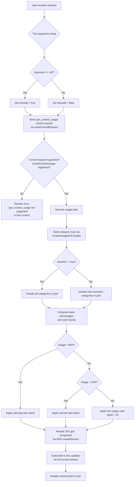

# `/context`

> Analysis basis: CC v2.1.159 bundle.js (AST extraction + Claude interpretation)
> Minimum version: v2.1.159

---

## Overview

The `/context` command renders a visual, colored grid representation of the current context window usage. It dispatches a `get_context_usage` control request to retrieve live token-usage data, then constructs a JSX UI showing token categories (system prompt, tools, memory files, messages, etc.) as colored grid cells, along with percentage and token-count annotations. The optional `[all]` argument toggles display of all context categories rather than the default summary view.

---

## Registration

| Field | Value |
|---|---|
| type | `local-jsx` |
| name | `context` |
| description | `Visualize current context usage as a colored grid` |
| argumentHint | `[all]` |
| thinClientDispatch | `control-request` |
| module_id | `hy1` |
| load_inline | `true` |
| loc_byte | `11192073` |
| loc_byte_end | `11192299` |
| loc_line | `6812` |
| arbor_handler.name | `CsL` |
| arbor_handler.fqn | `claude-2.1.159::CsL` |
| arbor_handler.kind | `AsyncFunction` |
| arbor_handler.resolution_path | `module_id` |
| arbor_handler.n_hits | `0` |

Analysis basis: CC v2.1.159 bundle.js:+11192073

---

## Input Branching

The command has 3+ distinct branches based on the argument string, the `all` flag, and the availability of context-usage data returned by the control request.



Analysis basis: CC v2.1.159 bundle.js:+11190767, +11190798, +11190833, +11190863, +11191003

---

## Behavioral Spec

### Handler Entry Point — contextCommandHandler

```
async function contextCommandHandler(args, appState):
    trimmedArg = args.trim()                      // +11190773
    showAll = (trimmedArg == "all")               // +11190798

    // Dispatch control request to retrieve live context usage
    response = await sendControlRequest(          // +11190833
        type = "get_context_usage"                // +11190863
    )

    if response indicates unsupported:
        return renderErrorMessage(
            "get_context_usage is not supported in this context"
        )

    usageData = response.data

    // Build JSX grid component
    gridComponent = buildContextUsageDisplay(usageData, showAll)  // +11191003

    // Register live-update listener
    subscribeToDataEvents(gridComponent)          // +11190893

    return createElement(gridComponent)           // +11190897
```

Analysis basis: CC v2.1.159 bundle.js:+11190767

---

### Context Usage Grid Builder — contextUsageGridBuilder

```
function contextUsageGridBuilder(usageData, showAll):
    // Filter categories based on showAll flag
    categories = usageData.filter(                // +11188871
        category => showAll OR category.isSummary
    )

    // Find the active model entry and context limit
    modelEntry = categories.find(                 // +11189189
        entry => entry.type == "system"           // +11190980
    )

    // Compute percentages for each category
    for each category in categories:
        pct = computePercentage(category.tokens, totalTokens)  // it, +11190606

        // Assign color band based on usage thresholds
        if pct >= 80:                             // +11191209
            band = "warning"                      // high usage
        elif pct >= 20:                           // +210005, +210047
            band = "normal"
        else:
            band = "low"                          // "< 20" literal +210014

        // Format percentage string with locale formatting
        pctString = formatNumber(pct, "en-US", "compact")  // +211984, +212002

    // Build category label rows
    labelRows = [
        { label: "Free space",          color: "Free space"         },  // +11188906
        { label: "Autocompact buffer",  color: "Autocompact buffer" },  // +11188929
        { label: "Project",    key: "projectSettings"  },               // +11189875
        { label: "User",       key: "userSettings"     },               // +11189912
        { label: "Local",      key: "localSettings"    },               // +11189947
        { label: "Flag",                               },               // +11189982
        { label: "Policy",                             },               // +11190018
        { label: "Plugin",     key: "plugin"           },               // +11190048
        { label: "Built-in",   key: "built-in"         },               // +11190080
        { label: "System prompt",   color: "promptBorder"   },          // +9982954, +9982985
        { label: "System tools",    color: "inactive"        },         // +9983033, +9983063
        { label: "MCP tools",       color: "cyan_FOR_SUBAGENTS_ONLY" }, // +9983097, +9983124
        { label: "MCP tools (deferred)",  color: ...         },         // +9983173
        { label: "System tools (deferred)", ...              },         // +9983259
        { label: "Custom agents",   color: "permission"      },         // +9983348, +9983379
        { label: "Memory files",    color: "claude"           },        // +9983415, +9983445
        { label: "Skills",          color: "warning"          },        // +9983477, +9983501
        { label: "Messages",        color: "purple_FOR_SUBAGENTS_ONLY" },// +9983979, +9984005
    ]

    // Pad cell display with two-space separator
    cellSeparator = "  "                          // +15493257, padEnd +15493236

    return assembleGrid(labelRows, pctString, cellSeparator)
```

Analysis basis: CC v2.1.159 bundle.js:+11188830, +11188871, +11188929, +11190107

---

### Percentage Formatter — formatPercentage

```
function formatPercentage(value):
    // Round to nearest integer, format with locale "en-US" / "compact"
    rounded = Math.round(value * 100)             // it → Math.round, +210034
    formatted = toLocaleString(rounded, "en-US", "compact")  // AK → wK, +209962
    if formatted ends with ".0":
        strip trailing ".0"                       // ".0" literal +209976
    return formatted + "%"
```

Analysis basis: CC v2.1.159 bundle.js:+210034, +209976

---

### Compact Boundary Marker — compactBoundaryMarker

```
function compactBoundaryMarker(usageData):
    // Locate the compact_boundary marker in the usage data
    boundaryEntry = usageData.find(               // HO → CE8 → Ej, +11190729
        e => e.key == "compact_boundary"          // +10495595
    )
    if boundaryEntry exists:
        return sliceAt(boundaryEntry.offset)      // HO.slice, +10495748
    return null
```

Analysis basis: CC v2.1.159 bundle.js:+11190729, +10495595

---

### Live-Update Event Subscription — subscribeToContextEvents

```
function subscribeToContextEvents(component):
    // Register a listener on the "data" event channel
    emitter.on("data", handler)                   // KsH → K.on, +7833559
    // Convert event buffer to string for display
    rawString = buffer.toString(...)              // KsH → f.toString, +7833596
    // Create UI element for each update via JSX createElement
    element = createElement(bU, props)            // KsH → p_H.createElement, +7833626
```

Analysis basis: CC v2.1.159 bundle.js:+7833559

---

### Control Request Dispatch — sendControlRequest

```
async function sendControlRequest(payload):
    // Dispatches a control-request message to the thin-client bridge
    // Message type: "control_request"             // +12377100
    // Expects response of type: "control_response" // +12376990
    // Identified by uuid field in payload         // +12377851
    // If onGetContextUsage callback not registered,
    // returns error: "get_context_usage is not supported
    //                in this context ..."         // +12382086
    return await sendAndAwait(payload)
```

Analysis basis: CC v2.1.159 bundle.js:+11190833, +12377100, +12382086

---

## State & Side Effects

| Item | Detail |
|---|---|
| Telemetry | `tengu_amber_creek` (+3378550), `tengu_pewter_brook` (+3378458), `tengu_marlin_porch` (+3745177), `tengu_amber_redwood2` (+9969347), `tengu_amber_redwood3` (+9969232), `tengu_sparrow_ledger` (+13100104), `tengu_heron_brook` (+13082712) — all reachable within the depth-2 call graph from the handler |
| Control request | Sends a `get_context_usage` control-request message over the thin-client bridge; the response contains live token counts per category |
| Event listener | Registers a `"data"` event listener via `KsH` / `K.on` (+7833559) for live UI updates while the panel is open |
| JSX rendering | Constructs a React-compatible element tree via `BN6.createElement` (+11190897) and `p_H.createElement` (+7833626); renders inside the CLI's Ink-based terminal UI |
| appState changes | Reads context-usage data from the bridge response; no persistent write to appState detected in depth-2 traversal |
| Sound | None detected |
| Argument `"all"` | Enables display of all context categories (literal `"all"` at +11190798); default (no argument) shows summary categories only |
| `compact_boundary` | Marks the autocompact boundary in the grid using the key `"compact_boundary"` (+10495595) |

---

## Version History

| Version | Change |
|---|---|
| v2.1.159 | Initial analysis |

---

## Common Mistakes

1. **Omitting the `[all]` argument**: Without `all`, only summary context categories are shown. If you want to see the full breakdown including deferred tools, MCP tools, and sub-agent message threads, you must pass `/context all`.
2. **Running in an environment where `onGetContextUsage` is not registered**: In certain thin-client or headless configurations the control-request callback is not wired up, causing the command to return an error message rather than a grid. The error text is "get_context_usage is not supported in this context" (bundle.js:+12382086).
3. **Expecting persistent output**: The grid is a live JSX panel, not a static text dump. The display subscribes to `data` events and updates as new token-usage events arrive. Redirecting output may not capture updates.
4. **Confusing color bands**: The 80% threshold triggers a warning color (+11191209). Below 20% is the `"< 20"` band (+210014). Between 20% and 80% is the normal band. These thresholds are hardcoded and cannot be configured by the user.
5. **Subagent color labels**: Labels such as `"cyan_FOR_SUBAGENTS_ONLY"` (+9983124) and `"purple_FOR_SUBAGENTS_ONLY"` (+9984005) appear in the grid for MCP tool rows only when running inside a subagent context. In a normal interactive session those rows may be absent or styled differently.

---

## Appendix — Identifier Mapping

> For bundle debugging only. Identifiers change across versions.

| Identifier | Role |
|---|---|
| `CsL` | Main async handler for `/context` command (arbor_handler) |
| `qq` | Fullscreen/terminal-mode detection helper, called from context rendering path |
| `B$H` | Terminal capability check (checks a known-terminals Set via `isK.has`) |
| `RD_` | Terminal color/background detection helper |
| `P1` | Color string converter (uses `String`) |
| `CH` | ANSI/color code string builder |
| `Fr` | Fullscreen disable detection helper |
| `k77` | Terminal type probe (checks for iTerm.app, screen, tmux) |
| `I77` | Terminal `startsWith` check for `iTerm.app` |
| `N` | Debug/log writer (writes to stream, uses `JSON.stringify` via `RH`) |
| `tCK` | Settings/config composite loader |
| `DOA` | Settings subsystem initializer |
| `RH` | JSON serialization utility |
| `E4` | Path normalization / last-segment extractor |
| `cYA` | Map-based string transform utility |
| `vuH` | Write helper using `CYA` |
| `CYA` | Stream write wrapper |
| `_bK` | Conversation-log / transcript writer |
| `axH` | Async write-batch scheduler (uses `clearTimeout`, `setTimeout`, `setImmediate`) |
| `M$H` | Log-rotation and rollup helper |
| `MK6` | File-write metadata tracker (calls `w8`) |
| `tYA` | Log-path builder (`y0H.join`) |
| `sYA` | Log-file rotation helper (`nk.stat`, `nk.rename`, `nk.unlink`) |
| `HbK` | Append-file-with-mkdir helper |
| `K9` | Hook registrar (`zOA.register`) |
| `SD_` | Windows/SSH fullscreen-disable detection |
| `B_` | Settings loader / policy resolver |
| `Cp` | Settings load orchestrator |
| `E9` | Memory-usage tracker (calls `process.memoryUsage`) |
| `ka8` | Settings-from-disk loader (logs `settings_load_started` / `settings_load_completed`) |
| `MQ` | Settings aggregator (merges multiple setting sources) |
| `y77` | Context display entry point (renders the grid component) |
| `G6` | Token-count aggregator / context partition mapper |
| `K_8` | Context partition cache updater |
| `h6` | Context usage data fetcher (calls `g6`, `AT`, `Date.now`) |
| `v$` | Argument parser / dispatcher |
| `O0H` | Command argument tokenizer |
| `KsH` | Live-update event subscriber (`K.on` "data") |
| `bU` | JSX element factory wrapper |
| `RJ_` | React element creator |
| `T4H` | Color-band style applicator |
| `qcH` | Context display component core |
| `UN6` | Context category row builder / grid layout |
| `AK` | Locale number formatter |
| `wK` | Number-to-string with locale options |
| `KbK` | Number format helper internals |
| `BpH` | Grid cell renderer |
| `it` | Percentage computation helper (uses `AK`, `Math.round`) |
| `EH` | String-from-value utility |
| `RsL` | Compact-boundary locator |
| `HO` | Compact-boundary slice helper |
| `CE8` | Boundary marker extractor (uses `Ej`) |
| `Ej` | Compact boundary key resolver |
| `$Z8` | Full context-data assembly pipeline |
| `RZ` | System-prompt builder |
| `ie` | Prompt section assembler |
| `CQ` | Model-context attribute parser |
| `QG` | Model-context aggregator |
| `nM` | First-party model resolver |
| `z5` | Model variant router |
| `GA` | Model provider mapper |
| `mN` | Model string normalizer |
| `ZT` | Context-window size resolver |
| `B4` | Config legacy migration helper |
| `AV` | Legacy global config migrator |
| `y8` | Settings sub-store accessor |
| `Cl` | Auto-compact window calculator |
| `nq` | Tool/content string normalizer |
| `_r6` | Built-in tool entry builder |
| `fw` | String include/replace normalizer |
| `sw` | String replace utility |
| `jV` | Context limit validator |
| `T0` | Context limit lookup |
| `ap` | Context limit resolver for claude-3 models |
| `re` | Context limit resolver with fallback |
| `FH8` | Context limit parser (finite check) |
| `Y8H` | Token-limit integer parser |
| `nX1` | Auto-compact window builder |
| `_l_` | Auto-compact value parser (parseFloat/parseInt) |
| `CT` | System-prompt assembler (large orchestrator) |
| `d9A` | Base system prompt text composer |
| `R6` | App-state context store accessor |
| `rB6` | AsyncLocalStorage store getter |
| `O_` | Null/default value helper |
| `TT8` | Warn-log entry formatter |
| `_v` | System prompt variant selector |
| `zP5` | Code-style guideline injector |
| `YP5` | Code-style system-prompt segment |
| `Da6` | Task-continuity prompt segment |
| `DP5` | SDK context injector |
| `i9A` | Additive system-prompt builder |
| `BP5` | Additive prompt wrapper |
| `VP5` | SDK/tool-context prompt segment |
| `vg` | Feature-flag gate |
| `mX` | SDK string lookup |
| `EP5` | SDK tool schema builder |
| `RV_` | SDK reference resolver |
| `LE` | Feature-disabled sentinel |
| `DL` | Tool deduplication set |
| `CF` | Tool descriptor builder |
| `$F` | Tool flat-mapper |
| `VY6` | Memory-prompt builder |
| `z4` | Config base resolver |
| `A4H` | Memory directory creator |
| `Rr` | Path type prober (isFile/isDirectory) |
| `hH` | Filesystem stat helper |
| `zw` | Memory path builder |
| `hgq` | Memory path joiner |
| `ygq` | Auto-memory file loader |
| `kgq` | Memory file loader |
| `gY_` | Memory content formatter |
| `SP5` | Shell/environment prompt segment |
| `aw` | Shell-name normalizer |
| `c9A` | Shell context builder |
| `hP5` | Environment info builder |
| `n9A` | OS version/type reader |
| `l9A` | Shell detection helper |
| `JP5` | Language prompt segment |
| `XP5` | Output-style prompt segment |
| `CP5` | Background-session prompt segment |
| `Em_` | Worktree-type prompt builder |
| `bP5` | Scratchpad prompt segment |
| `kqH` | Scratchpad G6 fetcher |
| `d2H` | Scratchpad path builder |
| `uP5` | Brief-mode prompt segment |
| `UP5` | Focus prompt segment |
| `IP5` | Heron-brook experiment segment |
| `jP5` | Reproduce-verify prompt segment |
| `hI9` | MCP-server context loader |
| `NP5` | NP5 prompt segment (<!-- TODO: not found in depth-2 traversal; needs --depth 4 -->) |
| `PP5` | PP5 prompt segment (<!-- TODO: not found in depth-2 traversal; needs --depth 4 -->) |
| `WP5` | Context-window compression reminder segment |
| `wP5` | Compression text builder |
| `GP5` | Verified-vs-assumed tools prompt segment |
| `TP5` | TP5 prompt segment using `i9A` |
| `ZP5` | Tool-list prompt segment |
| `R0` | CLI/remote context mode resolver |
| `vP5` | vP5 tool-list segment |
| `Ugq` | Memory+config unified prompt segment |
| `pgq` | Memory config page builder |
| `UzH` | Conversation-state formatter |
| `JV` | Conversation-state resolver |
| `jm` | Agent memory and main-thread loader |
| `ZK` | Session-key builder |
| `YC` | Chat-history formatter |
| `G_` | Module loader bootstrap |
| `M` | Plugin/file path resolver |
| `aS6` | Plugin name sanitizer |
| `GD` | Agent-memory getter |
| `PuL` | Context-data collector (main pipeline stage) |
| `XuL` | Token-match / split helper |
| `zZ8` | Context assembly sub-pipeline |
| `RP5` | Context environment info sub-builder |
| `Bgq` | Memory+config row builder |
| `oAK` | Context-block header parser |
| `K66` | Token counter + category labeler |
| `mSH` | Token-count API caller |
| `SH` | Token-count result handler |
| `oX1` | Per-category token count aggregator |
| `WuL` | Context rows builder (per-session) |
| `NJ6` | Auto-memory filter |
| `GuL` | Context messages builder |
| `OPH` | MCP tool-prompt assembler |
| `YZ8` | Tool-prompt row generator |
| `z` | Background-session stop helper |
| `bH` | Filesystem `d` helper |
| `xy` | Daemon control dispatcher |
| `cm` | Process exit orchestrator |
| `T` | App state container |
| `X` | Daemon bridge socket |
| `J` | Bridge socket helper |
| `w` | Background-session worker manager |
| `Ff` | Bridge framing writer |
| `oB5` | Main daemon IPC message handler |
| `EuL` | Context-token row builder with percentages |
| `hf` | `Math.round` percentage helper |
| `O` | Sub-process exit handler |
| `D` | Background-session lifecycle manager |
| `Fy8` | Low-memory telemetry helper |
| `TfA` | Background-session spawner |
| `VuL` | Additional context row builder |
| `TuL` | Tool-use context row builder |
| `UV_` | Feature-flag + tool-use filter |
| `h8H` | Tool-use filter helper |
| `rX1` | Context row accumulator |
| `TK` | Context row cache accessor |
| `kuL` | Context-usage map builder |
| `vuL` | Usage percentage formatter helper |
| `NuL` | Usage row normalizer |
| `IuL` | Usage row token formatter |
| `TT` | Message-list normalizer (large) |
| `NQL` | Tool-use array builder |
| `RQL` | Tool-result row resolver |
| `SQL` | Content-block type classifier |
| `CQL` | Content-array validator |
| `h` | Rate-limit / focus state |
| `yE8` | Some-predicate for tool-use blocks |
| `cQL` | UUID generator for tool use |
| `E8` | Tool-use id/type creator |
| `pT` | Tool-use placeholder |
| `ag_` | Tool-use result aggregator |
| `hE8` | Tool-use pair resolver |
| `II` | Standard context-window info builder |
| `Kr_` | Content-block rewriter |
| `IQL` | Tool-use sanitizer |
| `kQL` | Tool-use `some` validator |
| `dQL` | MCP tool-call content rewriter |
| `I4` | Tool ID extractor |
| `hZ1` | Tool-use history entry helper |
| `xQL` | Message filter helper |
| `zZ1` | Message reorder helper |
| `Gl_` | Full message-list renderer / formatter |
| `lQL` | Tool-result join helper |
| `bQL` | Tool-use block pair builder |
| `kZ6` | Orphaned-thinking filter |
| `eQL` | Trailing-thinking block filter |
| `IZ6` | Whitespace-only assistant filter |
| `HdL` | Empty-assistant-content fixer |
| `uQL` | Message slice/at helper |
| `OZ1` | Message findLastIndex helper |
| `YZ1` | Last message entry helper |
| `hQL` | Message every/filter helper |
| `ZuL` | Context-segment row builder (combined) |
| `BV_` | Feature-flag + h8H filter (alternate) |
| `dG` | Prompt injection / language-norm helper |
| `A1` | Full prompt attribute normalizer |
| `uV6` | Usage percentage tracker |
| `Uc_` | Token-usage cache |
| `F_` | Error string builder |
| `NAH` | Context limit boundary calculator |
| `n7H` | Max-output-tokens resolver |
| `mzH` | Context window with output-token headroom |
| `HH` | Recording / voice transcript array |
| `Q` | Voice / file I/O scheduler |
| `QN6` | File read helper |
| `Th1` | File unlink helper |
| `a` | App-level permission allow handler |
| `c` | hS8 caller |
| `t78` | Usage-stats gate helper |
| `D8H` | Usage-stats `InH.has` gate |
| `uc` | Context-grid `S_` / `G6` entry-point |
| `nH` | MCP bridge connection handler (large) |
| `LH` | MCP bridge write/read manager |
| `AH` | MCP abort/cleanup handler |
| `L8` | MCP debug log emitter |
| `eV6` | MCP connection setup |
| `yEK` | MCP queue helper |
| `Hv6` | MCP message dispatcher |
| `Dl` | MCP notification handler |
| `y` | MCP write-queue enqueuer |
| `I6` | AsyncLocalStorage `_N` wrapper |
| `Y8` | File-append logger |
| `K94` | Log timestamp formatter |
| `B` | MCP tool filter helper |
| `VH` | Plugin marketplace file reader |
| `dH` | Orphaned-permission tracker |
| `k6` | Bridge message batcher |
| `m6` | Message UI component |
| `uH` | Write-messages-to-stream helper |
| `$6` | Bridge end/close handler |
| `zH` | Bridge stream ender |
| `_H` | MCP server lifecycle manager |
| `ko1` | Bridge ingress message parser |
| `U6` | JSON.parse wrapper |
| `yo1` | Bridge control-request dispatcher |
| `Y` | MCP server config updater |
| `j` | Background process killer |
| `I` | Away-summary generator |
| `Z6` | Plugin: prefix router |
| `mq` | Plugin route "z6" entry |
| `r4` | Plugin route "oH/HH" entry |
| `g9` | Plugin "vH/nH" route |
| `Nq` | Plugin "h/vH" route |
| `BA` | CLI fatal error handler |
| `wH` | App state find/filter helper |
| `WH` | Context-grid G6 wrapper |
| `IH` | Context-grid O/V/_H wrapper |
| `oH` | Headless plugin install manager |
| `hpH` | Headless settings wait helper |
| `d38` | Headless settings getter |
| `Fc` | Plugin MCP config loader |
| `M26` | Plugin Ph/O1H helper |
| `c8H` | Plugin config parser (enterprise/project/local) |
| `Bc` | Plugin config entry builder |
| `h$8` | Plugin color-code error logger |
| `f26` | Plugin config merger |
| `WEK` | Headless plugin install orchestrator |
| `fB` | CH wrapper for headless |
| `hT8` | Marketplace token/entry tracker |
| `HPH` | Marketplace cache clearer |
| `p0` | Marketplace reconciler |
| `Lj9` | Plugin zip-cache path builder |
| `fj9` | Plugin zip-cache error builder |
| `Tm` | Marketplace entry processor |
| `bb8` | Plugin install/update differ |
| `Oj9` | Plugin Oj9 helper (<!-- TODO: not found in depth-2 traversal; needs --depth 4 -->) |
| `XEK` | Marketplace ZI/EU5/TU5/ZU5 processor |
| `GS8` | GrowthBook feature reconciler |
| `v6` | MCP server state aggregator |
| `$$H` | Object.assign wrapper |
| `mH` | MCP server config applicator |
| `rT` | Math.round timing helper |
| `BH` | Context-usage Map (get/set/entries) |
| `dU_` | Context-usage row serializer (uses `RH`) |

---

Note: index built via Arbor fallback; some signals (telemetry, literals) may be missing — see arbor-fallback.js.