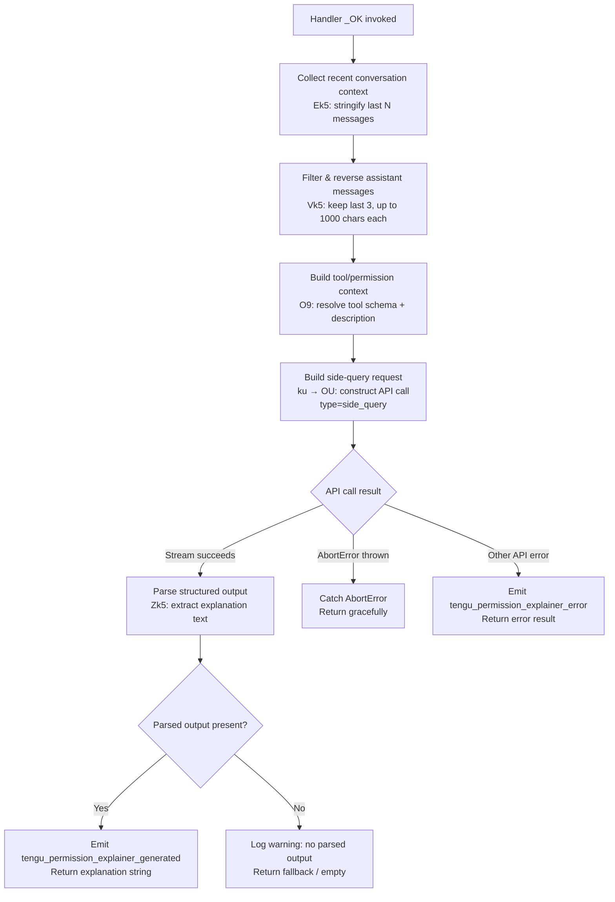

# `/explain_command`

> Analysis basis: CC v2.1.159 bundle.js (AST extraction + Claude interpretation)
> Minimum version: v2.1.159

---

## Overview

`/explain_command` is an internal **tool-type** slash command that generates human-readable explanations for why a particular tool or MCP tool invocation requires specific permissions. It issues a side-query API call to a language model, parses the structured response, and returns the explanation text, primarily supporting the permission-approval UI flow in Claude Code.

---

## Registration

| Field | Value |
|---|---|
| type | `tool` |
| name | `explain_command` |
| description | `null` (not surfaced to users directly) |
| loc_byte | `13915042` |
| loc_byte_end | `13915078` |
| loc_line | `10597` |
| arbor_handler.name | `_OK` |
| arbor_handler.fqn | `claude-2.1.159::_OK` |
| arbor_handler.kind | `AsyncFunction` |
| arbor_handler.resolution_path | `direct` |
| arbor_handler.n_hits | `1` |

Analysis basis: CC v2.1.159 bundle.js:+13915042

---

## Input Branching

The handler has four or more distinct execution paths (success, no parsed output, abort, API error), so a Mermaid flowchart is used.



Analysis basis: CC v2.1.159 bundle.js:+13914737, +13914800, +13914947, +13914960, +13915367, +13915523, +13915575, +13915624, +13915819, +13916076, +13916195, +13916266

---

## Behavioral Spec

### 1. Entry Point — Permission Explainer Handler

The async handler `_OK` (resolved via Arbor direct resolution against the registration byte range) is the sole entry point for this command.

```
async function permissionExplainerHandler(toolName, toolInput, context):
    startTime = Date.now()                        // timestamp for telemetry
    recentMessages = buildRecentContext(context)  // Ek5
    filteredHistory = filterAssistantHistory(context.messages)  // Vk5
    toolContext = resolveToolContext(toolName, toolInput, context)  // O9
    result = await runSideQuery(recentMessages, filteredHistory, toolContext)  // ku
    parsedOutput = extractStructuredOutput(result)  // Zk5
    if parsedOutput is null or missing:
        log("Permission explainer: no parsed output in response")
        return fallbackResult()
    emit("tengu_permission_explainer_generated")
    return parsedOutput
```

Analysis basis: CC v2.1.159 bundle.js:+13914737, +13914761, +13914782, +13914800, +13914947, +13914960, +13915367, +13915523, +13915525, +13915627, +13915872

### 2. Recent Context Builder — `Ek5`

Collects a compact string representation of recent conversation context to inject into the explanation prompt.

```
function buildRecentContext(messages):
    // Stringify using RH (JSON.stringify wrapper)
    // Limit to last 2 messages (literal: 2 at +13914257)
    // Truncate each message text to 1000 characters (literal: 1000 at +13914301)
    return compactString
```

Analysis basis: CC v2.1.159 bundle.js:+13914782, +13914247, +13914257, +13914273, +13914301

### 3. Assistant History Filter — `Vk5`

Filters the message history to assistant-role messages only, reverses chronological order, slices the most recent entries, and joins them for context.

```
function filterAssistantHistory(messages):
    assistantMessages = messages.filter(m => m.role == "assistant")  // literal "assistant" at +13914336
    reversed = assistantMessages.reverse()
    recent = reversed.slice(0, 3)   // literal 3 at +13914356
    textParts = recent.flatMap(extractTextBlocks)  // kind "text" at +13914439
    truncated = textParts.map(t => t.slice(0, ...))
    result = ["..."] + truncated    // ellipsis literal "..." at +13914537
    result.unshift(header)
    return result.join(separator)
```

Analysis basis: CC v2.1.159 bundle.js:+13914313, +13914336, +13914356, +13914381, +13914439, +13914524, +13914537, +13914545, +13914578

### 4. Tool Context Resolution — `O9`

Resolves the tool's schema, description, and permission requirements. Delegates to the language model normalisation pipeline (`ie`, `CQ`, `A1`) and optionally appends MCP tool metadata.

```
function resolveToolContext(toolName, toolInput, context):
    normalized = normalizeTool(toolName, context)        // ie
    schema = buildToolSchema(normalized, toolInput)      // CQ
    toolLabel = deriveToolLabel(normalized)              // A1
    // MCP tool check: d9 checks Object.hasOwn + "mcp_tool" starts-with prefix
    if isMcpTool(toolName):
        appendMcpMetadata(schema)
    return { toolLabel, schema }
```

Analysis basis: CC v2.1.159 bundle.js:+13914947, +2188841, +13915575, +3160832, +3160884, +3160912

### 5. Side-Query API Dispatch — `ku` → `OU`

Constructs and dispatches a non-interactive side-query API request (type `"side_query"` at +13166528). The request is an authenticated HTTP call using the same credential pipeline as regular API calls but tagged to avoid polluting the main conversation.

Key parameters observed in the literal set:
- Query type: `"side_query"` (bundle.js:+13166528)
- Cache control hint: `"cache_control"` / `"1h"` (bundle.js:+13168470, +13167378)
- Model selection: resolved via the standard model-alias pipeline (`A1`, `iIH`)
- Maximum token budget: bounded by `Math.min` (bundle.js:+13167336)
- Authentication: OAuth / API key pipeline (`IY`, `F3`, `pP`), with credential headers including `"authorization"`, `"anthropic-beta"`, `"x-anthropic-"` prefix headers, and `"X-Claude-Code-Session-Id"`

```
async function runSideQuery(recentContext, history, toolContext):
    request = buildRequest(
        type = "side_query",
        messages = [systemPrompt, ...history, toolContext],
        cacheControl = "1h",
        temperature = (from Tr/iH8 pipeline)
    )
    headers = buildAuthHeaders()     // OU credential pipeline
    response = await fetch(request, headers)
    parsed = streamAndParse(response)
    return parsed
```

Analysis basis: CC v2.1.159 bundle.js:+13166496, +13166528, +13166577, +13166613, +13167336, +13167378, +13167403, +13167446, +13167748, +13167838, +13167951, +13168385, +13168403, +13168438, +13168470

### 6. Output Extraction — `Zk5`

Extracts the explanation string from the model's structured response. If the response is missing or malformed, the function returns `null` and the handler logs the literal message `"Permission explainer: no parsed output in response"`.

```
function extractStructuredOutput(apiResponse):
    if apiResponse is null or empty:
        return null
    textBlock = findFirstTextBlock(apiResponse)
    if textBlock is absent:
        return null
    return textBlock.text
```

Analysis basis: CC v2.1.159 bundle.js:+13915367, +13915872

### 7. Telemetry Emission

Two command-specific telemetry events are emitted by the handler:

| Condition | Event | Location |
|---|---|---|
| Successful generation | `tengu_permission_explainer_generated` | +13915525 |
| Any error during generation | `tengu_permission_explainer_error` | +13915737 |

The `"permission_explainer_generate"` literal at +13915627 is used as the event label for duration tracking.

### 8. Error Handling

```
try:
    result = await runSideQuery(...)
    parsedOutput = extractStructuredOutput(result)
    ...
catch error if error.name == "AbortError":   // literal "AbortError" at +13916195
    return graceful empty result
catch error (other):
    emit("tengu_permission_explainer_error")
    // literal "api_error" at +13916266
    return error result
```

Analysis basis: CC v2.1.159 bundle.js:+13916076, +13916195, +13916231, +13916266

---

## State & Side Effects

| Item | Detail |
|---|---|
| Telemetry — success | `tengu_permission_explainer_generated` (bundle.js:+13915525) |
| Telemetry — error | `tengu_permission_explainer_error` (bundle.js:+13915737) |
| Telemetry — duration label | `"permission_explainer_generate"` (bundle.js:+13915627) |
| Side-query API call | One non-interactive HTTP request to the Anthropic API (or configured provider), tagged `"side_query"` |
| Conversation state | Read-only — does not append messages to the main conversation history |
| appState changes | None observed in depth-2 traversal |
| Hook registration | None observed in depth-2 traversal |
| Sound | None observed in depth-2 traversal |
| Config access | Reads global config via the standard config-read pipeline (`tzH`, `h6`); throws `"Config accessed before allowed."` if accessed too early (bundle.js:+3211001) |
| Auth headers emitted | `"authorization"`, `"X-Claude-Code-Session-Id"`, `"anthropic-beta"`, `"x-anthropic-"` prefix (bundle.js:+2924364, +2914989, +2924475, +2924506) |

---

## Version History

| Version | Change |
|---|---|
| v2.1.159 | Initial analysis |

---

## Common Mistakes

1. **Invoking as a user-facing slash command**: `explain_command` is registered as type `tool`, not `prompt`. It is called programmatically by the permission-approval subsystem, not by users typing `/explain_command` in the REPL.
2. **Expecting a conversation turn**: The command dispatches a `"side_query"` API call, which is separate from the main conversation. It does not append any message to the active session transcript.
3. **Assuming synchronous output**: The handler is `async` and involves a full API round-trip with streaming; callers must `await` the result.
4. **Missing abort signal**: If no `AbortSignal` is threaded through, long-running explanation requests will not be cancellable when the user dismisses the permission dialog.
5. **Treating a `null` parsed output as an error**: The handler explicitly handles absent structured output as a non-fatal case; callers should gracefully degrade to showing the raw tool name and inputs rather than surfacing an error to the user.

---

## Appendix — Identifier Mapping

> For bundle debugging only. Identifiers change across versions.

| Identifier | Role |
|---|---|
| `_OK` | Main async handler for `explain_command` (Arbor-resolved, direct) |
| `j7A` | Config / context initialisation helper called by handler |
| `h6` | Config read utility (reads and validates global config from disk) |
| `g6` | Config schema/object constructor |
| `fY_` | Config field accessor / formatter |
| `tzH` | Core config file reader (reads UTF-8 JSON, handles ENOENT, backups) |
| `U6` | JSON parse wrapper |
| `nb` | String prefix normaliser (startsWith / slice) |
| `w8` | Config write / update helper |
| `UFq` | Directory scanning utility (readdirStringSync, path resolution) |
| `N` | Log/debug emission function |
| `d` | General error/warning logger |
| `DY_` | Backup directory path builder |
| `w` | Background daemon session manager |
| `l17` | File watch registration helper |
| `kr` | File watch event debounce handler |
| `K9` | Hook registrar (zOA.register) |
| `Ek5` | Recent context stringifier (last N messages → compact string) |
| `RH` | JSON.stringify wrapper |
| `Vk5` | Assistant-message history filter and slicer |
| `H` | Random delay / setTimeout wrapper |
| `A` | Case-normalisation utility (toLowerCase) |
| `f` | Stream/connection lifecycle helper |
| `L` | Promise cleanup / set membership tracker |
| `O9` | Tool context resolver (delegates to `ie`, `A1`) |
| `ie` | Tool normalisation pipeline entry |
| `AN` | Tool name validator |
| `J9H` | Tool schema builder |
| `CQ` | Tool schema composer (maps, trims, annotates) |
| `M` | File/set membership helper |
| `K` | Padding / map utility |
| `_r6` | Object.entries iteration helper |
| `fFH` | Model-capability inclusion checker |
| `MOq` | Model index-of lookup |
| `wm4` | Model string inclusion helper |
| `d1H` | Model capability flag checker |
| `A1` | Tool label / model alias deriver (normalise + lowercase + replace) |
| `jm4` | Tool schema type classifier |
| `WX` | Tool context wrapper |
| `G0` | Tool context compound builder |
| `TA` | Tool type classifier (max/team/enterprise) |
| `te` | Max-tier tool handler |
| `FOH` | Team-tier tool handler |
| `OFH` | Enterprise-tier tool handler |
| `QG` | Tool group label builder |
| `yP` | Tool prompt builder |
| `nM` | Tool name mapper |
| `GA` | API provider classifier |
| `z5` | Tool schema field builder |
| `mN` | Tool metadata normaliser |
| `ku` | Side-query dispatcher (top-level API call orchestrator) |
| `OU` | HTTP request builder and sender (auth headers, streaming) |
| `Mw` | AsyncLocalStorage store getter (request context) |
| `hH7` | Header split/trim/slice utility |
| `N9` | Context mode checker (bg/daemon/daemon-worker) |
| `QOH` | Background-mode header selector |
| `Gr` | Store reader for request metadata |
| `mo6` | AsyncLocalStorage store getter (secondary) |
| `I6` | Settings loader (_N) |
| `_N` | User/global settings access function |
| `u1_` | URL encoding helper (replace + encodeURIComponent) |
| `CH` | String coercion helper |
| `yO` | OAuth token retrieval orchestrator |
| `G3_` | OAuth token lock/refresh cycle manager |
| `jOq` | Boolean coercion wrapper |
| `IY` | Auth profile resolver (OAuth / API key selector) |
| `UK` | Auth string constructor |
| `pP` | OAuth profile builder (implicit/user_oauth modes) |
| `kO` | API-key provider resolver |
| `KX` | Credential cache key builder |
| `F3` | Full auth header composer (handles all auth modes) |
| `Kz6` | Auth header helper (agH caller) |
| `agH` | Auth header value formatter |
| `u3` | Async utility / context runner |
| `kH7` | Streaming request initialiser |
| `lgH` | Stream lifecycle tracker (cN, Date.now, timeouts) |
| `S_` | Session-state accessor |
| `rc6` | Proxy-auth helper runner (with trust check) |
| `ZTH` | Proxy header builder |
| `nrA` | Proxy URL normaliser |
| `FW4` | Integer parser with NaN guard |
| `Jy` | Request finaliser / cleanup |
| `XP` | xGH (proxy settings) accessor |
| `uH7` | HTTP request sender (fetch wrapper with watchdog + streaming) |
| `m5` | Request deduplication helper |
| `lC6` | Request ID generator helper |
| `hzq` | Config re-read helper (calls h6) |
| `mH7` | Response header inspector |
| `xH7` | Response phase tracker |
| `CH7` | Token/rate-limit calculator |
| `bH7` | Byte-stream watchdog and reader |
| `Lw` | Provider type resolver |
| `ti6` | Provider tag builder |
| `RC4` | Provider prefix matcher |
| `si6` | Provider string normaliser (toLowerCase) |
| `Cz` | Proxy configuration resolver |
| `VQ` | URL parser/validator |
| `AUH` | Proxy credential helper ($R, up) |
| `irA` | Proxy exclusion checker |
| `U6_` | IP/host proxy-bypass evaluator |
| `g6_` | Proxy settings object builder |
| `yH7` | Request retry / model-selection logic |
| `pH8` | Per-request context builder |
| `KN` | Model name normaliser |
| `HuH` | Request header merger |
| `Y0H` | HSK (approved endpoint list) finder |
| `kq` | Custom OAuth URL validator |
| `nOH` | Gateway JWT refresh orchestrator |
| `qp8` | Gateway refresh condition checker |
| `Dp4` | Gateway token exchange (fetch + error handling) |
| `_b6` | Gateway token cache accessor |
| `Ap8` | Request timestamp helper |
| `rO6` | Response header case-normaliser |
| `uzH` | SDK error/warning logger |
| `S` | Supervisor / daemon socket writer |
| `HvK` | File realpath / stat helper |
| `Iz` | Daemon identity verifier |
| `SH` | Feature flag checker / logger |
| `DF5` | sW8 (socket write buffer) helper |
| `z` | Daemon socket stream (hH, bH, xy, cm) |
| `h` | Away-summary idle handler |
| `Jd` | Away-summary cache accessor |
| `I` | Away-summary generation orchestrator |
| `V` | Away-summary rate-limit checker |
| `_PK` | Away-summary draft-input checker |
| `E` | Away-summary stream writer |
| `s2` | Session auth re-checker (F3 caller) |
| `ZFH` | WIF credential resolver and token exchanger |
| `Ja6` | WIF token exchange HTTP caller |
| `hH` | Success event emitter (d wrapper) |
| `bH` | Failure event emitter (d wrapper) |
| `Tp4` | WIF response validator |
| `G` | Remote-control / session config handler |
| `b` | Input event handler |
| `I0` | User settings loader |
| `Y` | Terminal session manager |
| `X` | IPC socket reader (Buffer concat, subarray) |
| `J` | Worker process reference |
| `Ff` | Socket end/write helper |
| `oB5` | Main IPC message dispatcher |
| `aB5` | IPC message ack helper |
| `$` | Socket write/destroy/event interface |
| `Hz` | Background service client (ozH) |
| `vfA` | Rate-limit token bucket |
| `RVK` | Rate-limit window calculator |
| `g8` | Async semaphore / timeout queue |
| `P` | Repaint/resize orchestrator |
| `j0` | Working directory resolver |
| `n$` | Realpath normaliser (Vp.realpath + H.normalize) |
| `s$H` | Conversation file reader (readline interface) |
| `iB5` | Scroll / viewport geometry helper |
| `p` | Deferred write scheduler |
| `rAH` | IPC reconnect helper |
| `gK` | Temp path builder |
| `rB5` | Worker lifecycle manager (kill, phase, readdir) |
| `o` | Voice toggle silence timer |
| `x` | Idle-exit timer (clearTimeout / setTimeout) |
| `r` | Voice focus silence timer |
| `W` | DL (display list) push wrapper |
| `B` | MCP tool-use filter |
| `g` | MCP tool-use renderer ($, B) |
| `l` | Tool filter (t.filter) |
| `a` | Terminal write stream (w, c) |
| `c` | hS8 (terminal escape handler) |
| `LR6` | Socket write+destroy helper |
| `T` | Terminal/session handle (Tv6, zx8) |
| `EH` | String coercion event emitter |
| `EEH` | Model-class normaliser (nq, Lw, PR) |
| `nq` | Model string cleaner (_r6, fw) |
| `fw` | Model string transformer (toLowerCase, includes, replace) |
| `Bp8` | Model prefix stripper |
| `sw` | Model alias replacer |
| `PR` | Provider alias resolver (GA) |
| `T25` | Model find helper (H.find, A.find) |
| `o9A` | SHA-256 hash builder (qqK.createHash) |
| `Uo6` | Context message builder (P1, GA, mo6) |
| `P1` | String converter (String wrapper) |
| `Z_8` | System prompt generator (GA) |
| `iIH` | Prompt cache config loader (repl_main_thread*, auto_mode, memdir_relevance) |
| `up8` | Cache config flag reader |
| `G6` | Tool registration / cache store manager |
| `AY6` | Tool registry entry builder |
| `qY6` | Tool registry lookup |
| `Ix` | Tool slot allocator (CH, Nx) |
| `K_8` | Cache-slot manager (lz_.has/add, rzH.get, cz_/oz_) |
| `mp8` | Tool name suffix checker |
| `JV` | WIF hint builder (z3_, ZEH) |
| `z3_` | GA-based hint normaliser |
| `ZEH` | HIPAA compliance flag builder (CH, V1_) |
| `V1_` | E1_ inclusion checker |
| `CqK` | Request context tagger |
| `iH8` | Temperature resolver (Tr, nq) |
| `IP` | H.map (message array mapper) |
| `MDH` | Message content dispatcher (v9, Array.isArray, RH, wU, s4) |
| `wU` | Multipart / binary content builder (h6, BFq.randomBytes, z8) |
| `z8` | MIME type detector and config reader |
| `s4` | Content block dispatcher (IY, h6) |
| `QMH` | <!-- TODO: not found in depth-2 traversal; needs --depth 4 --> |
| `BJ6` | Agent thread ID builder (kM9, BnH, UJ6) |
| `kM9` | Thread ID factory (nk7, SH) |
| `nk7` | Thread name validator (vM9.has, FK, VL8.has) |
| `BnH` | Thread ID string builder |
| `UJ6` | Thread ID cache manager (BnH, ZL8) |
| `ZL8` | Thread ID hasher (EM9.createHash) |
| `Dc` | Agent prefix classifier (lk7, q8H, SH) |
| `lk7` | Agent-type string parser (startsWith, slice, EL8, xG_) |
| `EL8` | Custom-agent prefix handler (xG_) |
| `xG_` | String index/slice utility |
| `q8H` | Agent name prefix checker |
| `B96` | <!-- TODO: not found in depth-2 traversal; needs --depth 4 --> |
| `d9` | MCP tool name validator (Object.hasOwn + startsWith "mcp_tool") |
| `t6` | Error/debug log wrapper (d) |
| `Zk5` | Structured output extractor from API response |

---

Note: index built via Arbor fallback; some signals (telemetry, literals) may be missing — see arbor-fallback.js.