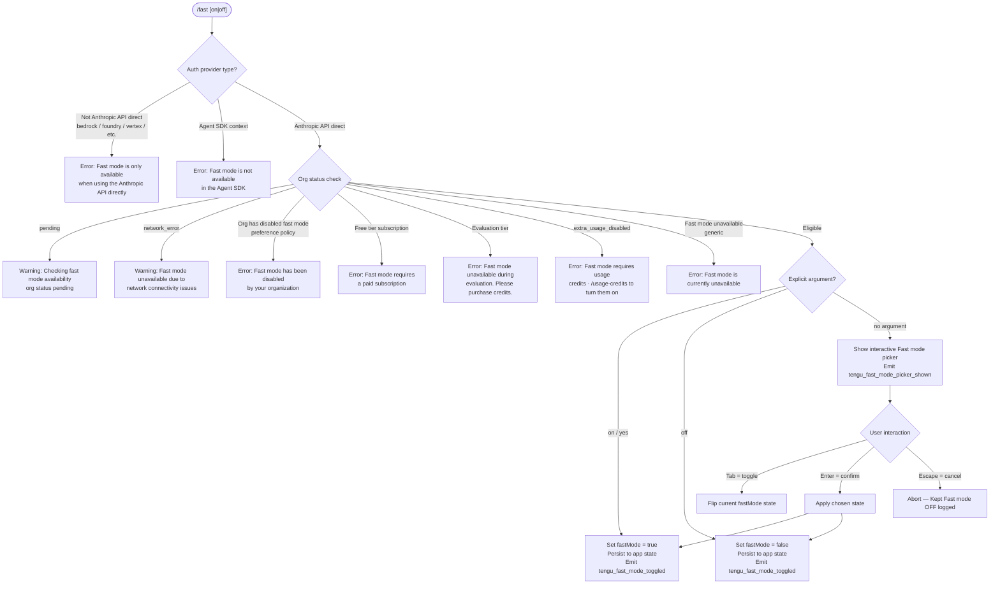

# `/fast`

> Analysis basis: CC v2.1.157 bundle.js (AST extraction + Claude interpretation)
> Minimum version: v2.1.157

---

## Overview

`/fast` toggles **Fast mode** — a research-preview feature that enables a higher-throughput inference path using specific Opus model variants. When invoked, the command checks eligibility against the current authentication context, subscription tier, and organization policy before presenting an interactive JSX picker or applying the state change directly. The final state (`on` or `off`) is persisted to application state and optionally logged via telemetry.

---

## Registration

| Field | Value |
|---|---|
| type | `local-jsx` |
| name | `fast` |
| description | `Toggle fast mode ( ... )` |
| argumentHint | `[on\|off]` |
| loc_byte | 12146987 |
| loc_byte_end | 12147259 |
| loc_line | 8016 |
| immediate | `null` |
| thinClientDispatch | `control-request` |
| isHidden | `null` |
| module_id | `Rc1` |
| load_inline | `true` |
| arbor_handler.name | `QL5` |
| arbor_handler.fqn | `claude-2.1.157::QL5` |
| arbor_handler.kind | `AsyncFunction` |
| arbor_handler.resolution_path | `module_id` |
| arbor_handler.n_hits | 3 |

Analysis basis: CC v2.1.157 bundle.js:+12146987

---

## Input Branching

The command has more than three distinct eligibility paths (API-direct restriction, Agent SDK restriction, subscription tier, org policy, usage credits, network error, pending org status, and the toggle state itself), so a Mermaid flowchart is used.



Analysis basis: CC v2.1.157 bundle.js:+12146025, +2177853, +2178118, +2178249, +2177347, +2177414, +2177505, +2177560, +2177686, +2177765, +12142435, +12146248

---

## Behavioral Spec

### Handler Entry Point (`fastCommandHandler`)

The async handler `QL5` is the authoritative entry point, resolved via `module_id` → `Rc1`.

```
async function fastCommandHandler(commandArgs, context):
    provider = resolveAuthProvider(context)          // uK → TA → CH
    eligibility = checkFastModeEligibility(provider) // re → G6, N, I8, R_, gxH, Gb, yo6
    if eligibility.blocked:
        return renderErrorMessage(eligibility.reason)

    prefetchResult = await prefetchFastModeStatus()  // qFH
    if prefetchResult.error and not prefetchResult.cached:
        emit telemetry: tengu_org_penguin_mode_fetch_failed
        return renderErrorMessage("disabled (network_error)")

    normalizedArg = normalizeArgument(commandArgs)   // "on"/"yes"/true → true; "off" → false

    if normalizedArg is explicit:
        applyFastModeState(normalizedArg)
        emit telemetry: tengu_fast_mode_toggled
        return renderConfirmation(normalizedArg)
    else:
        emit telemetry: tengu_fast_mode_picker_shown
        return renderFastModePicker(currentState)
```

Analysis basis: CC v2.1.157 bundle.js:+12146025

---

### Provider / Eligibility Guard (`checkFastModeEligibility`)

The eligibility function `re` inspects the resolved authentication provider against a known set of provider strings and org policy flags.

```
function checkFastModeEligibility(authContext):
    // Non-direct API providers are blocked outright
    nonDirectProviders = ["bedrock", "foundry", "anthropicAws", "mantle", "vertex"]
    if authContext.provider in nonDirectProviders or not authContext.isFirstParty:
        return { blocked: true,
                 reason: "Fast mode is only available when using the Anthropic API directly" }

    // Agent SDK context
    if context.isAgentSDK:
        return { blocked: true,
                 reason: "Fast mode is not available in the Agent SDK" }

    orgStatus = fetchOrgStatus()

    if orgStatus == "pending":
        return { blocked: false,
                 warning: "Checking fast mode availability (org status pending)" }

    if orgStatus == "network_error":
        return { blocked: false,
                 warning: "Fast mode unavailable due to network connectivity issues" }

    // Subscription / policy checks
    if orgStatus.preference == "disabled_by_org":
        return { blocked: true,
                 reason: "Fast mode has been disabled by your organization" }

    if orgStatus.tier == "free":
        return { blocked: true,
                 reason: "Fast mode requires a paid subscription" }

    if orgStatus.tier == "evaluation":
        return { blocked: true,
                 reason: "Fast mode unavailable during evaluation. Please purchase credits." }

    if orgStatus.extraUsage == "extra_usage_disabled":
        return { blocked: true,
                 reason: "Fast mode requires usage credits · /usage-credits to turn them on" }

    return { blocked: false }
```

Analysis basis: CC v2.1.157 bundle.js:+2177853, +2177921, +2178118, +2177347, +2177414, +2177505, +2177560, +2177686, +2177765, +2046248, +2046354, +2046456

---

### Fast Mode Prefetch (`prefetchFastModeStatus`)

The function `qFH` drives an asynchronous prefetch cycle that avoids redundant network calls.

```
async function prefetchFastModeStatus():
    if inFlightPromise exists:
        log "Fast mode prefetch in progress, returning in-flight promise"
        return inFlightPromise

    elapsed = Date.now() - lastFetchTimestamp
    if elapsed < RECENT_FETCH_THRESHOLD:
        log "Skipping fast mode prefetch, fetched recently"
        return cachedResult

    inFlightPromise = fetchOrgPenguinStatus()
        .then(result => {
            cacheResult(result)
            return result
        })
        .catch(err => {
            if isAxiosError(err) and err.status in [401, 403]:
                handleOAuthRecovery(err)   // rp → OAuth refresh paths
            emit E1_.emit (status update event)
            return { error: true, status: "disabled (network_error)" }
        })
        .finally(() => {
            inFlightPromise = null
            lastFetchTimestamp = Date.now()
        })

    return inFlightPromise
```

Analysis basis: CC v2.1.157 bundle.js:+2181722, +2181942, +2181969, +2182145, +2182238, +2182280, +2182306, +2182685, +2182772

---

### Interactive Picker Component (`fastModePickerComponent` / `MI8`)

When no explicit argument is supplied, the command renders a JSX component (`MI8`) that provides an interactive two-state toggle UI.

```
function fastModePickerComponent(props):
    [currentFastMode, setFastMode] = useState(appState.fastMode)
    eligibility = useComputedEligibility()

    // Keyboard bindings
    on keypress "tab"    → dispatch "toggle"   (flip current state)
    on keypress "enter"  → dispatch "confirm"  (apply and close picker)
    on keypress "escape" → dispatch "cancel"   (abort, log "Kept Fast mode OFF")

    // Status display strings
    statusText = currentFastMode ? "ON " : "OFF"

    // Overload / limit warnings
    if eligibility.status == "overloaded":
        showWarning("Fast mode overloaded and is temporarily unavailable")
    if eligibility.hitLimit:
        showWarning("You've hit your fast limit · resets in " + formatCountdown())

    // Doc link always rendered
    renderLink("https://code.claude.com/docs/en/fast-mode")

    // Confirmation interaction keys
    confirmKeys = [
        "confirm:yes", "confirm:nextField", "confirm:next",
        "confirm:previous", "confirm:cycleMode", "confirm:toggle"
    ]

    return renderColumn([
        renderHeader(" Fast mode (research preview)"),
        renderRow(["Fast mode", statusText]),
        renderWarningsIfAny(),
        renderDocLink(),
        renderKeyBindingHints()
    ])
```

Analysis basis: CC v2.1.157 bundle.js:+12142660, +12144286, +12144993, +12145062, +12145068, +12145199, +12145234, +12145288, +12145317, +12145508, +12144479, +12144558, +12144609, +12143681

---

### Cooldown / Re-enable Logic (`fastModeCooldownWatcher` / `Z1_`)

A cooldown monitor fires when a previously rate-limited Fast mode session becomes eligible again.

```
function fastModeCooldownWatcher():
    if currentTime >= cooldownExpiry:
        log "Fast mode cooldown expired, re-enabling fast mode"
        updateAppState({ fastMode: true, fastModeStatus: "active" })
        emit F3q.emit (state-changed event)
```

Analysis basis: CC v2.1.157 bundle.js:+2179222, +2179275, +2179234, +2179680

---

### Argument Normalisation (inline in `fI8`)

```
function normalizeArg(raw):
    trimmed = raw.trim().toLowerCase()
    if trimmed in ["on", "yes"]:
        return true
    if trimmed == "off":
        return false
    return null   // no explicit argument → show picker
```

Analysis basis: CC v2.1.157 bundle.js:+26948, +26954, +12146139

---

### Countdown Formatter (`countdownFormatter` / `aq`)

Displayed in the picker when a rate-limit reset time is known.

```
function formatCountdown(msRemaining):
    if msRemaining >= 86400000:
        return floor(msRemaining / 86400000) + "d"
    if msRemaining >= 3600000:
        return floor(msRemaining / 3600000) + "h"
    if msRemaining >= 60000:
        return round(msRemaining / 60000) + "m"
    if msRemaining > 0:
        return round(msRemaining / 1000) + "s"
    return "0s"
```

Analysis basis: CC v2.1.157 bundle.js:+208980, +208927, +209032, +209066, +209139

---

## State & Side Effects

| Item | Detail |
|---|---|
| Telemetry: `tengu_fast_mode_toggled` | Fired when the user explicitly sets fast mode on or off (bundle.js:+12142435) |
| Telemetry: `tengu_fast_mode_picker_shown` | Fired when the interactive picker is rendered (bundle.js:+12146248) |
| Telemetry: `tengu_org_penguin_mode_fetch_failed` | Fired when the org-status network fetch fails (bundle.js:+2183141) |
| Telemetry: `tengu_penguins_off` | Fired inside eligibility evaluation (bundle.js:+2177959) |
| Telemetry: `tengu_config_parse_error` | Fired if the config file is malformed during prefetch (bundle.js:+3210553) |
| Telemetry: `tengu_config_lock_contention` | Fired when config-write lock is contested (bundle.js:+3207978) |
| Telemetry: `tengu_config_stale_write` | Fired when a stale config write is detected (bundle.js:+3208114) |
| Telemetry: `tengu_config_auth_loss_prevented` | Fired to record a blocked auth-wiping write (bundle.js:+3208457) |
| Telemetry: `tengu_oauth_401_sdk_callback_refreshed` | OAuth 401 recovery via SDK callback (bundle.js:+2956541) |
| Telemetry: `tengu_oauth_401_recovered_from_disk` | OAuth 401 recovery from disk token (bundle.js:+2957249) |
| Telemetry: `tengu_oauth_401_recovered_from_keychain` | OAuth 401 recovery from keychain (bundle.js:+2957602) |
| Telemetry: `tengu_feature_ok` / `tengu_feature_bad` / `tengu_feature_sad` | Feature flag evaluation outcomes (bundle.js:+966033, +966091, +966168) |
| appState changes | `fastMode` boolean, `fastModeStatus` string (`"active"`, `"cooldown"`, `"overloaded"`, etc.) |
| Config persistence | Global config written via locked write cycle (`z8` / `AY_`); backup files retained (bundle.js:+3207750, +3208267) |
| thinClientDispatch | `control-request` — the command is dispatched as a control request in thin-client mode |
| Sound | None found in depth-2 traversal |
| Hook registration | `K9` → `_OA.register` (bundle.js:+58858); `MA` → `K.registerHandler` (bundle.js:+4021849) |
| Doc URL rendered | `https://code.claude.com/docs/en/fast-mode` (bundle.js:+12145508) |

---

## Version History

| Version | Change |
|---|---|
| v2.1.157 | Initial analysis |

---

## Common Mistakes

1. **Using `/fast` on a non-Anthropic-API provider (Bedrock, Vertex, etc.)** — The command will return a hard error immediately; Fast mode is locked to direct Anthropic API usage only.
2. **Expecting `/fast` to work in Agent SDK sessions** — The SDK context triggers a distinct block path with message "Fast mode is not available in the Agent SDK".
3. **Forgetting the `[on|off]` argument** — Omitting the argument opens the interactive picker; users who want a scriptable toggle must pass `on` or `off` explicitly.
4. **Confusing "overloaded" with "unavailable"** — An overloaded state is temporary and includes a reset countdown; the user should wait rather than changing subscription settings.
5. **Missing the `extra_usage_disabled` block** — Organizations with extra usage credits disabled will see a different error from free-tier users; the fix path is `/usage-credits`, not a subscription upgrade.

---

## Appendix — Identifier Mapping

> For bundle debugging only. Identifiers change across versions.

| Identifier | Role |
|---|---|
| `QL5` | `fastCommandHandler` — async main handler for `/fast` (arbor_handler) |
| `uK` | `resolveAuthProvider` — resolves current auth provider type |
| `TA` | `providerClassifier` — classifies provider string into canonical type |
| `CH` | `providerStringNormalizer` — normalizes provider name strings |
| `H` | `randomDelayUtil` — utility using `Math.random` / `setTimeout` |
| `re` | `checkFastModeEligibility` — multi-path eligibility guard |
| `G6` | `orgStatusEvaluator` — evaluates org-level fast mode policy |
| `az6` | `orgStatusHelperA` — org status sub-helper |
| `sz6` | `orgStatusHelperB` — org status sub-helper |
| `Ex` | `providerContextExtractor` — extracts provider context |
| `Zx` | `contextNormalizer` — normalizes context object |
| `e88` | `experimentFlagResolver` — resolves Growthbook experiment flags |
| `uz_` | `growthbookExperimentEmitter` — emits `GrowthbookExperimentEvent` |
| `Fz_` | `featureFlagApplier` — applies flag settings to context |
| `S6` | `configAccessor` — reads project / global config |
| `g6` | `configPathResolver` — resolves config file paths |
| `sz_` | `configSchemaValidator` — validates config schema |
| `szH` | `configFileReader` — reads config file from disk |
| `b17` | `configFileWatcher` — watches config file for changes |
| `N` | `debugLogger` — structured debug logger |
| `QCK` | `logDispatcher` — dispatches log entries |
| `qOA` | `logFormatter` — formats log lines |
| `RH` | `jsonStringifyHelper` — wraps `JSON.stringify` |
| `v4` | `pathRedactor` — redacts sensitive paths in log output |
| `uYA` | `pathMapper` — maps paths through redaction list |
| `EuH` | `terminalWriter` — writes output to terminal |
| `VYA` | `stdoutFlusher` — flushes stdout |
| `lCK` | `conversationPersister` — persists conversation to disk |
| `rxH` | `debouncedFlushWriter` — batched async file writer with debounce |
| `M$H` | `conversationSnapshotWriter` — writes conversation snapshot |
| `qK6` | `jsonSerialiser` — serialises data to JSON |
| `dYA` | `outputPathBuilder` — builds output file paths |
| `QYA` | `atomicFileRenamer` — renames files atomically |
| `cCK` | `appendPersistenceWriter` — appends to persistence file |
| `K9` | `hookRegistrar` — registers lifecycle hooks via `_OA.register` |
| `I8` | `settingsLoader` — loads user/project/local settings |
| `Ng6` | `settingsCacheLookup` — checks settings cache |
| `h3A` | `cacheHasCheck` — checks `kC6` cache for key |
| `Ga8` | `settingsMerger` — merges policy, flag, and user settings |
| `S3A` | `cacheSetEntry` — sets entry in `kC6` cache |
| `$Q` | `settingsObjectBuilder` — constructs merged settings object |
| `O_` | `appNodeResolverAN` — resolves app node identifier |
| `qFH` | `prefetchFastModeStatus` — async prefetch / cache for org fast-mode status |
| `V1_` | `prefetchDependencyLoader` — loads dependencies for prefetch |
| `L1` | `fVALoader` — loads CH-based value helper |
| `fVA` | `valueHelperCH` — value helper wrapping CH |
| `qW` | `apiClientFactory` — builds the API client |
| `F3` | `anthropicApiClientBuilder` — constructs Anthropic API client |
| `BK` | `apiBaseUrlBuilder` — builds base API URL |
| `lN` | `apiRequestHandler` — handles API request dispatch |
| `pP` | `authHeaderBuilder` — builds auth headers |
| `DR` | `requestSliceHelper` — slices request data |
| `YV` | `arrayIncludesChecker` — checks array membership |
| `iu4` | `authTokenRetriever` — retrieves current auth token |
| `Iq` | `oauthTokenValidator` — validates OAuth token format |
| `rp` | `oauthTokenRefreshManager` — manages OAuth 401 recovery |
| `_67` | `oauthRecoveryOrchestrator` — orchestrates OAuth recovery paths |
| `BzH` | `yyTokenHelper` — helper for token via `Yy` |
| `hH` | `featureCheckOk` — emits `tengu_feature_ok` |
| `bH` | `featureCheckBad` — emits `tengu_feature_bad` |
| `di` | `contextTokenEmitter` — emits context token events |
| `aK` | `aOqCaller` — calls `aOq` helper |
| `SH` | `streamResponseHandler` — handles streaming API responses |
| `kO` | `z3ConnectionManager` — manages connection via `z3_` |
| `U_` | `fullConversationRunner` — orchestrates full conversation turn |
| `ZO` | `settingsPairLoader` — loads E3H + $Q pair |
| `E3H` | `settingsPathResolver` — resolves settings file paths |
| `wP` | `contextFileLoader` — loads context files |
| `Ni` | `fileContentReader` — reads file content from disk |
| `P8` | `j8JsonHelper` — JSON helper wrapping `j8` |
| `j8` | `jsonParseHelper` — safe JSON parse utility |
| `Jo8` | `sessionTimestampWriter` — writes session timestamp to `BF6` |
| `iGH` | `vg6SettingsHelper` — resolves settings via `vg6` |
| `vg6` | `settingsPathNormalizer` — normalizes settings paths |
| `yL6` | `atomicSymlinkSafeWriter` — atomic file write with symlink safety |
| `O` | `symlinkStatChecker` — checks if path is symbolic link |
| `f` | `fileCloser` — closes file handles |
| `vz` | `cacheClearer` — clears `kC6` and `Ru8` caches |
| `bF6` | `gitignoreWriter` — writes gitignore entries for config files |
| `h6` | `lB6OReader` — helper loading `lB6` + `O_` |
| `tr8` | `I4Wrapper` — wraps `I4` utility |
| `CF6` | `gitIgnoreChecker` — checks if path is git-ignored |
| `Z94` | `excludesFileResolver` — resolves git global excludes file |
| `lkA` | `lsFilesTracker` — tracks files via `git ls-files` |
| `nkA` | `gitIgnoreAppender` — appends entries to gitignore |
| `cb` | `vNPathJoiner` — joins paths via `vN.join` |
| `t6` | `featureCheckSad` — emits `tengu_feature_sad` |
| `Cp` | `conversationContextBuilder` — builds conversation context |
| `YZ` | `contextHelperYZ` — context sub-helper |
| `Z9` | `memoryUsageTracker` — tracks `process.memoryUsage` |
| `Ta8` | `settingsLoadOrchestrator` — orchestrates settings load with telemetry |
| `IC6` | `contextFinalizer` — finalizes conversation context |
| `z8` | `globalConfigSaver` — saves global config with locking |
| `AY_` | `lockedConfigWriter` — writes config under file lock |
| `L` | `asyncQueueManager` — manages async operation queue |
| `dOq` | `configObjectMerger` — merges config objects via `Object.assign` |
| `AY6` | `configVersionHelper` — handles config version field |
| `qY_` | `backupPathBuilder` — builds backup file paths |
| `pQH` | `configPreprocessor` — preprocesses config before write |
| `IFq` | `configEntriesIterator` — iterates config via `Object.entries` |
| `UQH` | `configTimestampUpdater` — updates config timestamp via `Date.now` |
| `_Y_` | `legacyConfigFallbackWriter` — writes legacy global config fallback |
| `K` | `columnPaddingHelper` — pads columns in table output |
| `fI8` | `fastModeJsxRenderer` — top-level JSX renderer for `/fast` |
| `LI8` | `flagSettingsApplier` — applies flag settings to command context |
| `pOH` | `contextStateLoader` — loads context state |
| `ty` | `V$Loader` — loads `V$` / CCR context |
| `V$` | `ccrContextProvider` — provides CCR context via `f0H` |
| `AFH` | `ciIPRenderer` — renders `ci` + `IP` interactive components |
| `ci` | `ciComponent` — inline component wrapping `CH` |
| `IP` | `interactivePromptComponent` — full interactive prompt wrapper |
| `G2H` | `flagValueCoercer` — coerces flag values (String/Number/Boolean) |
| `TY` | `modelPickerComponent` — renders model picker |
| `T0` | `modelSelectorComponent` — full model selector component |
| `_1` | `modelStringNormalizer` — normalizes model name strings |
| `W2H` | `themeAwareRenderer` — theme-aware output renderer |
| `vx` | `themeResolver` — resolves current UI theme |
| `kY6` | `t47ThemeHelper` — dark/auto theme helper |
| `AA8` | `themeInclusionChecker` — checks supported theme list |
| `AYH` | `themePrefixStripper` — strips theme prefix from string |
| `iQq` | `themeExtraHelper` — additional theme helper |
| `Q4` | `commandContextBuilder` — builds command execution context |
| `qV` | `s96SetManager` — manages context set via `s96` |
| `$A` | `colorStringParser` — parses color strings for terminal output |
| `OYH` | `ansiColorMapper` — maps color names to ANSI/chalk codes |
| `Jd` | `colorFallbackHelper` — fallback for unrecognised color strings |
| `ip` | `ciWrapper` — wraps `ci` component for picker |
| `J9` | `keyboardInputHandler` — handles keyboard input in picker |
| `se` | `inputEventRouter` — routes input events to handlers |
| `qN` | `qNInputHelper` — sub-handler for input events |
| `G9H` | `G9HInputHelper` — sub-handler for input events |
| `bQ` | `inputEventParser` — parses raw input events into commands |
| `XX` | `confirmActionDispatcher` — dispatches confirm actions |
| `f9` | `tiContextFetcher` — fetches `ti6` context for picker |
| `ti6` | `B_ContextProvider` — provides `B_` / `Cp` context |
| `B_` | `CpContextLoader` — loads `Cp` conversation context |
| `fw` | `filterTextSearcher` — text search/filter helper |
| `Cp8` | `cp8PickerHelper` — picker sub-helper |
| `yP` | `yPTextReplacer` — text replacement helper |
| `wV` | `numericFormatterWrapper` — wraps `a3q` numeric formatter |
| `a3q` | `floatFormatter` — formats floats with `toFixed` |
| `UTH` | `uKf9Combiner` — combines `uK` and `f9` for picker |
| `MI8` | `fastModePickerComponent` — main interactive Fast mode picker JSX component |
| `J6` | `appStateSyncReader` — reads app state via `useSyncExternalStore` |
| `kJ_` | `appStateContextAccessor` — accesses `AppStateProvider` context |
| `fA` | `fAStateBinder` — binds state to `kJ_` |
| `Z1_` | `fastModeCooldownWatcher` — monitors cooldown expiry, re-enables fast mode |
| `$` | `Ls1Wrapper` — wraps `Ls1` telemetry logger |
| `Ls1` | `telemetryEventLogger` — logs telemetry events with timestamp |
| `ii` | `s1HProcessor` — processes `s1H` telemetry items |
| `s1H` | `telemetryItemBuilder` — builds telemetry item with `Pe` |
| `s9` | `asyncStoreGetter` — gets async store via `$J7.getStore` |
| `uI6` | `daemonStatusPathBuilder` — builds path for `daemon.status.json` |
| `MA` | `globalKeyHandlerRegistrar` — registers global keyboard handler |
| `Lj` | `lYHContextAccessor` — accesses `lYH` context |
| `M` | `cS6FilesystemHelper` — manages plugin/staging filesystem paths |
| `cS6` | `pluginPathValidator` — validates plugin paths against reserved names |
| `lS6` | `pluginsDirResolver` — resolves `plugins/synced` directory |
| `aq` | `countdownFormatter` — formats a millisecond duration into human-readable countdown |

---

Note: index built via Arbor fallback; some signals (telemetry, literals) may be missing — see arbor-fallback.js.