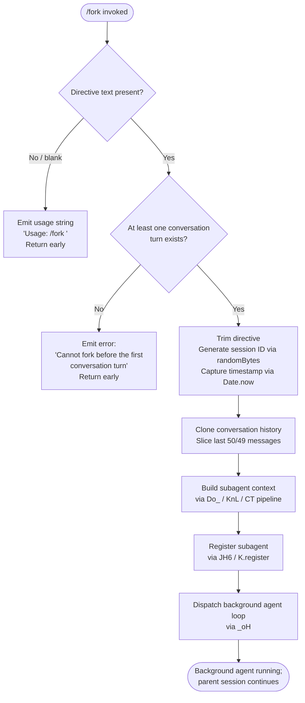

# `/fork`

> Analysis basis: CC v2.1.159 bundle.js (AST extraction + Claude interpretation)
> Minimum version: v2.1.159

---

## Overview

`/fork` spawns a detached background agent that inherits the full current conversation history and then executes a caller-supplied directive independently. The command copies the existing conversation context into a new subagent process, generates a unique session identity for it, and dispatches it asynchronously — leaving the parent session fully interactive. Guard rails are in place to prevent forking before any conversation turn has occurred.

---

## Registration

| Field | Value |
|---|---|
| type | `local-jsx` |
| name | `fork` |
| description | Spawn a background agent that inherits the full conversation |
| argumentHint | `<directive>` |
| module_id | `D8K` |
| load_inline | `true` |
| loc_byte | `12788813` |
| loc_byte_end | `12789009` |
| loc_line | `9020` |
| arbor_handler.name | `xj5` |
| arbor_handler.kind | `AsyncFunction` |
| arbor_handler.resolution_path | `module_id` |
| arbor_handler.fqn | `claude-2.1.159::xj5` |
| arbor_handler.n_hits | `0` |

Analysis basis: CC v2.1.159 bundle.js:+12788813

---

## Input Branching

There are three distinct execution paths based on the directive argument and conversation state:



Analysis basis: CC v2.1.159 bundle.js:+12788417, +12788441, +12788550

---

## Behavioral Spec

### 1. Argument Validation (handler entry point — `xj5`)

```
async function forkCommandHandler(userInput, context):
    directive = userInput.trim()                   // A.trim at +12788417
    if directive is empty:
        emit "Usage: /fork <directive>"            // literal at +12788441
        return

    if no prior conversation turns exist:
        emit "Cannot fork before the first conversation turn"  // literal at +12788550
        return

    proceed to subagent launch via subagentLaunch()
```

Analysis basis: CC v2.1.159 bundle.js:+12788417, +12788439, +12788509

---

### 2. Subagent Launch Orchestration (`Do_`)

`Do_` is the main fork orchestration routine. It performs the following steps in sequence:

```
async function subagentLaunch(directive, parentContext):
    emit telemetry "subagent_launch"               // literal at +10704597
    emit telemetry "subagent_fork_prompt_missing"  // conditional, literal at +10704615

    conversationHistory = buildConversationSnapshot(parentContext)
    // KnL at +10704577: calls getAppState, Array.from, buildSystemPrompt(CT)

    trimmedHistory = conversationHistory.slice(0, 50)   // literal 50 at +10704849
                     // last 49 messages retained        // literal 49 at +10704862

    sessionId = generateRandomHex(8)               // Gh → Fy9.randomBytes, 8 bytes hex +6753624
    timestamp  = Date.now()                        // +10704906

    spawnType  = "fork"                            // literal at +10704664
    agentKind  = "subagent"                        // literal at +10705324
    launchMode = "spawn"                           // literal at +10705389

    agentContext = buildSubagentContext(
        conversationHistory  = trimmedHistory,
        directive            = directive,
        sessionId            = sessionId,
        timestamp            = timestamp,
        systemPrompt         = getSystemPrompt(jm),    // jm at +10706363
        replContexts         = getReplContexts(_),     // +10704704
        staleMessageGuard    = Kv1,                    // +10704831
    )

    agentRecord = registerSubagent(JH6, agentContext)  // +10704919
    // JH6 orchestrates: jSH (filesystem symlinks/dirs), jE (URL/path setup),
    //                   SM, fh (abort controller), p1 (listener), Z2 (timestamp sync),
    //                   K.register (+10252401)

    startAgentEventLoop(_oH, agentRecord)              // +10705423
    // _oH is the primary async agent supervisor loop

    emit telemetry "subagent_complete" or "subagent_stall_timeout" on completion
```

Analysis basis: CC v2.1.159 bundle.js:+10704577, +10704594, +10704799, +10704831, +10704849, +10704906, +10704919

---

### 3. System Prompt Assembly (`KnL` → `CT` pipeline)

`KnL` assembles the complete system prompt for the forked agent by composing many sub-builders from the `CT` system-prompt pipeline. The forked agent receives:

```
function buildForkSystemPrompt(parentState):
    sections = []

    sections += coreAgentInstructions(d9A, CH)            // +13099089
    sections += toolBehaviorBlock(R6, BDH, W$)            // +13100287
    sections += pluginSystemPrompts(TT8)                   // +10429006
    sections += memoryBlock(VY6)                           // +3298332
      // VY6 reads CLAUDE.md, team-memory if enabled,
      // calls sK7.buildCombinedMemoryPrompt             // +3299294
    sections += environmentInfoBlock(SP5, hP5)             // +13100793
      // includes worktree notice if applicable           // literal +13102594
      // "Additional working directories:" if present    // literal +13102792
      // "You have been invoked in the following environment:" // literal +13103519
    sections += languageStyleBlock(jP5)                    // +13101127
    sections += bgSessionContextBlock(CP5)                 // +13100928
      // sets output_style="bg", worktree/tmp            // literals +13107120, +13107455
    sections += contextManagementBlock(WP5)                // +13100955
      // includes auto-compaction notice                 // literal +13085068
    sections += briefBlock(uP5)  // isBriefEnabled check  // +13109376
    sections += reproduceVerifyBlock(UP5)                  // +13101047
    sections += hooksBlock(IP5, GP5)                       // +13101090
    sections += todoScratchpadBlock(bP5)                   // +13100955
    sections += customMemoryBlock(Ugq)                     // +13101287
    sections += modelConfigBlock(UzH)                      // +13101301

    return joinSections(sections)
```

Key note: the forked agent receives the `bg-session` output-style context (literal `"bg-session"` at +13100911) and the system prompt explicitly notes `"Agent threads always have their cwd reset between bash calls…use absolute file paths."` (literal at +13106209).

Analysis basis: CC v2.1.159 bundle.js:+10704577, +10706148, +13100236, +13100793, +13100928

---

### 4. Subagent Registration & Filesystem Setup (`JH6`)

```
function registerSubagentSession(agentContext):
    // jSH: filesystem layout
    mkdir(agentDir)                               // G9A → ft.mkdir at +12962929
    createSymlink(sessionPath)                    // ft.symlink at +12965247
    openLogFile(feH → ft.open)                    // +12965072
    // error codes handled: EEXIST, ENOSPC, EDQUOT  // literals at +12965283, +12965378, +12965392

    // jE: URL/path configuration
    setupSubagentPaths(US, xO, O_, I6)            // +6632407

    // SM: session metadata recorded
    // fh: AbortController wired for cancellation  // "abort" literal at +4712129
    // p1: listener max set (L79.setMaxListeners)
    // Z2: timestamp sync (Date.now + S$ path join)

    // K.register: insert into live-session registry
    agentRecord.status = "pending"                // literal at +12966277
    agentRecord.type   = "local_agent"            // literal at +10252090
    agentRecord.kind   = "general-purpose"        // literal at +10252209
    return agentRecord
```

Analysis basis: CC v2.1.159 bundle.js:+10252043, +10252085, +12965194, +12965247, +12966277

---

### 5. Background Agent Event Loop (`_oH`)

`_oH` is the asynchronous supervisor that runs the forked agent. Simplified outline:

```
async function agentEventLoop(agentRecord, directive):
    stall_timeout_ms = 600000  // 600 seconds     // literal at +6843346
    poll_interval    = 10      // ticks            // literal at +6843341
    progress_pct     = 0.1     // progress step    // literal at +6844676

    set agent status = "running"                   // literal at +10252135

    loop:
        if abort signal received:
            status = "cancelled" / "user_kill_async"   // literals at +6846141, +6846335
            break

        result = await agentQueryStep(klL, directive)
        // klL is the core agent query/model-call loop

        emit progress "query_progress"             // literal at +6844736

        on completion:
            status = "subagent_complete"           // literal at +6844474
            emit tengu_async_agent_stall_timeout if stalled
            // W26: update task state +10251678
            // $LH: notify parent session +10249364
            break

        on stall timeout (600 s):
            status = "subagent_stall_timeout"      // literal at +6844494
            log "watchdog_stall"                   // literal at +6843832
            break

        on API error:
            record "api_error"                     // literal at +6845336
            break

    SM8.delete(agentId)                            // UP6 cleanup at +6606189
    emit telemetry "subagent_end"                  // literal at +6840914

    if safety classifier unavailable:
        warn user with safety notice               // literal at +6842501
```

Key limits:
- Stall timeout: **600 000 ms (10 minutes)** (bundle.js:+6843346)
- Status width padding: **40** characters (bundle.js:+15495228)
- Async error threshold: **80** (bundle.js:+6846565)

Analysis basis: CC v2.1.159 bundle.js:+6843341, +6843346, +6844237, +6844474, +6844494, +6845336

---

### 6. Conversation History Cloning (`SG8`)

```
function buildConversationSnapshot(messages):
    // Filters message roles for subagent context
    // LyL: assistant messages          // +9448690 "assistant"
    // fyL: user messages               // +9448712 "user"
    // KyL: tool_use messages           // +9448020 "tool_use"
    // MyL: tool_result messages        // +9448179 "tool_result"
    //      error / ok result codes     // literals "err"/"ok" at +9448224, +9448295
    //      handles "code" blocks       // literal at +9447868

    filtered = messages
        .filter(isRelevantRole)
        .slice(0, 50)                   // literals 50, 49 at +10704849, +10704862

    return filtered
```

Analysis basis: CC v2.1.159 bundle.js:+9448602, +9448765, +9448861, +9448937, +9449064

---

### 7. Agent Summary & Handoff (`G26` / `ph` completion path)

When the forked agent completes, the parent receives a summary via the `agent_summary` event (literal at +9354718). The parent-side display pipeline (`ph`) handles:

- `ja`: renders tool result rows in the UI
- `wm` → `klL`: the full model query loop used inside the fork
- `YH6`: writes `.meta.json` and `.jsonl` transcript files
- `GAH` / `_Q_` / `m4`: context-ref management (`"fork-context-ref"` literal at +12895713)

Analysis basis: CC v2.1.159 bundle.js:+9354718, +9348561, +9348637, +12895713

---

## State & Side Effects

| Item | Detail |
|---|---|
| Telemetry — subagent launch | `tengu_forked_agent_default_turns_exceeded` (+10680210), `tengu_async_agent_stall_timeout` (+6844237), `tengu_agent_tool_completed` (+6840336), `tengu_agent_tool_terminated` (+6846165) |
| Telemetry — agent lifecycle | `tengu_slim_subagent_claudemd` (+9343658), `tengu_agent_memory_loaded` (+9355853), `tengu_agent_summary_skipped` (+9354297), `tengu_shale_finch` (+6837117) |
| Telemetry — query/model loop | `tengu_query_error` (+10647914), `tengu_refusal_fallback_triggered` (+10643984), `tengu_model_fallback_triggered` (+10647250), `tengu_auto_mode_decision` (+6841979) |
| Telemetry — hooks | `tengu_run_hook` (+13026110), `tengu_repl_hook_finished` (+13026459), `tengu_hook_plugin_injected` (+13040912) |
| Telemetry — background dispatch | `tengu_bg_spare_enable` (+15468826), `tengu_bg_spare_spawn` (+15469186), `tengu_bg_spare_claim` (+15470888), `tengu_bg_dispatch_sigkill_escalate` (+15469493) |
| Filesystem side effects | Creates agent directory (`ft.mkdir`), symlinks (`ft.symlink`), opens log file (`ft.open`), writes `.meta.json` and `.jsonl` transcript; cleans up via `ft.unlink` on completion |
| AbortController | Wired at `fh`; "abort" event propagates cancellation to the background agent process |
| Session registry | Agent inserted as `"local_agent"` / `"general-purpose"` / `"pending"` at registration; transitions to `"running"` → `"subagent_complete"` or error state |
| appState changes | `H.getAppState` / `G.setAppState` called throughout `klL`; parent session state is read-only from the fork's perspective at launch |
| Hook registration | `K.register` at +10252401 wires subagent into session registry; `SubagentStart` / `SubagentStop` hook events emitted |
| Sound | <!-- TODO: not found in depth-2 traversal; needs --depth 4 --> |
| Safety classifier | If unavailable during handoff, a warning is surfaced to the user (literal at +6842501); telemetry `tengu_auto_mode_decision` fires with `"unavailable"` / `"blocked"` states |

---

## Version History

| Version | Change |
|---|---|
| v2.1.159 | Initial analysis |

---

## Common Mistakes

1. **Invoking `/fork` with no argument.** The command requires a non-empty `<directive>`. Without one, it emits `"Usage: /fork <directive>"` and does nothing. The argument hint in the registration is `<directive>`.
2. **Invoking `/fork` at the very start of a session.** The guard `"Cannot fork before the first conversation turn"` will block the command if no assistant message exists yet. Start a conversation first.
3. **Expecting the forked agent to see subsequent parent messages.** The conversation is cloned at fork time (up to 50 messages). Messages added to the parent session after `/fork` is issued are not visible to the background agent.
4. **Assuming the forked agent shares working directory state with the parent.** The system prompt explicitly tells the fork to use absolute paths because `cwd` is reset between bash calls inside agent threads.
5. **Cancelling the fork immediately.** The abort signal is wired synchronously; cancelling before the agent has registered may leave orphaned filesystem artefacts (symlinks, log files). The `ft.unlink` cleanup path only runs if the agent reaches its completion handler.

---

## Appendix — Identifier Mapping

> For bundle debugging only. Identifiers change across versions.

| Identifier | Role |
|---|---|
| `xj5` | Main fork command handler (AsyncFunction; arbor_handler) |
| `Do_` | Subagent launch orchestrator |
| `KnL` | Conversation snapshot + system-prompt builder entry |
| `CT` | System prompt component pipeline root |
| `E_` | Conversation message last-find / context extractor |
| `fV8` | Context field extractor — `working_directory` |
| `MV8` | Context field extractor — `allowed_tools` / `disallowed_tools` |
| `jm` | System prompt assembly — main-thread variant |
| `SG8` | Conversation history message filter/cloner |
| `LyL` | Assistant message filter predicate |
| `fyL` | User message filter predicate |
| `KyL` | Tool-use message filter predicate |
| `MyL` | Tool-result message filter predicate |
| `Kv1` | Stale-message guard / trim helper |
| `Gh` | Random session-ID generator (randomBytes hex) |
| `JH6` | Subagent session registration orchestrator |
| `jSH` | Filesystem session setup (mkdir, symlink, open) |
| `G9A` | Agent directory creator (ft.mkdir) |
| `S$` | Session path joiner |
| `yh8` | Active-session set tracker (p_K.add / delete) |
| `feH` | Log-file opener (ft.open) |
| `jE` | Subagent URL / path configurator |
| `fh` | AbortController factory |
| `Z2` | Timestamp synchroniser (Date.now + path) |
| `_oH` | Background agent async event/supervisor loop |
| `W26` | Task state updater (A.update + Date.now) |
| `$LH` | Parent session notifier (K.update, K.abortSpeculation) |
| `G26` | Agent query-result dispatcher |
| `F0` | Single-agent turn executor |
| `ph` | Parent-side REPL render loop for agent output |
| `klL` | Core model-query / agent-turn loop |
| `wm` | Query pipeline wrapper (klL + eM8) |
| `Ya` | Model resolution / API routing layer |
| `A1` | Model alias resolver (sonnet, opus, haiku, etc.) |
| `VY6` | Memory block builder (CLAUDE.md + team memory) |
| `SP5` | Environment info (static) block builder |
| `hP5` | Environment info (simple/worktree) block builder |
| `CP5` | Background-session context block builder |
| `WP5` | Context management / auto-compaction block builder |
| `uP5` | Brief-mode block builder |
| `UP5` | Reproduce-and-verify workflow block builder |
| `IP5` | Core system instructions block builder |
| `GP5` | General guidance block builder |
| `bP5` | Scratchpad / todo block builder |
| `Ugq` | Custom memory / pgq block builder |
| `UzH` | Model config (firstParty/anthropicAws) block builder |
| `TT8` | Plugin system-prompt collector |
| `VP5` | Schedule/routines system-prompt block builder |
| `jP5` | Language and style block builder |
| `YH6` | Transcript file writer (.meta.json, .jsonl) |
| `GAH` | Fork context-ref manager |
| `xSH` | Conversation history filter for fork context |
| `m4` | Session metadata accessor |
| `SH` | Error/log emission helper |
| `CH` | String conversion utility |
| `EH` | String coercion wrapper |
| `N` | Log / debug output emitter |
| `hH` | Telemetry / analytics logger |
| `bH` | Side-effect / notification helper |
| `d` | Core render / display primitive |
| `Do_` | (see above — subagent launch orchestrator) |
| `UP6` | SM8.delete cleanup handler |
| `eM8` | Subagent-exit / ready state handler |
| `OJ6` | Auxiliary fork-phase helper |
| `JjH` | Fork post-processing helper |

---

Note: index built via Arbor fallback; some signals (telemetry, literals) may be missing — see arbor-fallback.js.