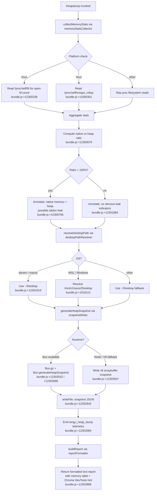

# `/heapdump`

> Analysis basis: CC v2.1.159 bundle.js (AST extraction + Claude interpretation)
> Minimum version: v2.1.159

---

## Overview

`/heapdump` is a hidden diagnostic command that captures a V8/Bun heap snapshot and a rich set of runtime memory statistics, writing both to `~/Desktop` (or the platform-appropriate equivalent). It is intended for developer and support use when investigating memory leaks in the Claude Code process itself; it never surfaces in the normal command palette.

---

## Registration

| Field | Value |
|---|---|
| type | `local` |
| name | `heapdump` |
| description | `Dump the JS heap to ~/Desktop` |
| supportsNonInteractive | `true` |
| isHidden | `true` |
| module_id | `Fi1` |
| load_inline | `true` |
| loc_byte | `12304963` |
| loc_byte_end | `12305391` |
| loc_line | `8236` |
| arbor_handler.name | `tf5` |
| arbor_handler.fqn | `claude-2.1.159::tf5` |
| arbor_handler.kind | `AsyncFunction` |
| arbor_handler.resolution_path | `module_id` |
| arbor_handler.n_hits | `0` |

Analysis basis: CC v2.1.159 bundle.js:+12304963

---

## Input Branching

The command has three or more distinct execution paths depending on the runtime environment (Bun vs. Node/V8), the host OS (macOS/Darwin vs. Linux vs. WSL/Windows), and the observed memory-usage ratio. A Mermaid flowchart is therefore required.



---

## Behavioral Spec

### Top-level handler (`tf5` — asyncHeapdumpHandler)

Analysis basis: CC v2.1.159 bundle.js:+12303832

```
async function asyncHeapdumpHandler(args):
    lines = []
    reportLines = buildMemoryReport(args)   # ef5
    lines.push(...reportLines)
    lines.push(
        "Open the .heapsnapshot in Chrome DevTools → Memory → Load to inspect retainers."
    )
    return lines.join("\n")
```

The handler delegates all heavy lifting to `buildMemoryReport` (`ef5`) and then appends the Chrome DevTools usage hint (literal at bundle.js:+12303988). The final result is assembled by joining all lines.

Analysis basis: CC v2.1.159 bundle.js:+12303951–12304100

---

### Memory statistics collector (`Ui1` — memoryStatsCollector)

Analysis basis: CC v2.1.159 bundle.js:+12302507

```
async function memoryStatsCollector():
    stats = {}
    stats.process   = process.memoryUsage()          # +12299995
    stats.heap      = kk8.getHeapStatistics()         # +12300019  (v8 module)
    stats.resource  = process.resourceUsage()         # +12300045
    stats.uptime    = process.uptime()                # +12300071
    stats.heapSpaces= kk8.getHeapSpaceStatistics()    # +12300096

    stats.activeHandles  = process._getActiveHandles().length   # +12300138
    stats.activeRequests = process._getActiveRequests().length  # +12300175

    # Linux only: open file-descriptor count
    if platform == "linux":
        fdList = await u_6.readdir("/proc/self/fd")              # +12300226 / +12300238
        stats.openFds = fdList.length

    # Linux only: smaps_rollup for native memory
    if platform == "linux":
        smaps = await u_6.readFile("/proc/self/smaps_rollup", "utf8")  # +12300288 / +12300301
        stats.smapsRss = parseSmapsRss(smaps)

    # Memory segment window: 3600 s, 1 048 576 byte granularity
    # bundle.js:+12300527 / +12300532
    stats.segmentWindow = { seconds: 3600, bytes: 1048576 }

    nativeRatio = (stats.process.rss - stats.heap.used_heap_size)
                  / stats.heap.used_heap_size * 100   # +12300679

    if nativeRatio > 100:
        stats.leakHint = "Native memory > heap - leak may be in native addons (node-pty, sharp, etc.)"
        # bundle.js:+12300765

    return stats
```

---

### Desktop path resolver (`jvA` — desktopPathResolver)

Analysis basis: CC v2.1.159 bundle.js:+12302790

```
function desktopPathResolver():
    home = ei8.homedir()                             # +1015845
    base = t5.join(home, "Desktop")                  # +1015881 / literal "Desktop" +1015891

    # WSL / Windows path override
    if platform includes "win" or path starts with "/mnt/c":
        wslBase = "/mnt/c/Users"                     # +1016113
        candidates = ["Public", "Default", "Default User", "All Users"]
        # +1016157 / +1016176 / +1016196 / +1016221
        resolved = findFirstExistingPath(wslBase, candidates, "Desktop")
        if resolved: return resolved

    # macOS detection
    if platform == "macos" or os == "darwin":        # +12301619 / +12302038
        return base

    return base   # generic fallback
```

---

### Heap snapshot writer (`sf5` — snapshotWriter)

Analysis basis: CC v2.1.159 bundle.js:+12303033

```
function snapshotWriter(destPath):
    if typeof Bun != "undefined":
        Bun.gc(/* run GC before snapshot */)         # +12303589
        snapshot = Bun.generateHeapSnapshot()         # +12303532
        pi1.writeFileSync(destPath, JSON.stringify(snapshot))   # +12303512
    else:
        # V8 fallback
        snapshot = writeV8HeapSnapshot(destPath,
                       format="arraybuffer",
                       type="v8")                    # +12303557 / +12303562
    return destPath
```

File mode for the written snapshot: `0o600` (octal 384).
Analysis basis: CC v2.1.159 bundle.js:+12302977

---

### Core orchestrator (`N8A` — heapdumpOrchestrator)

Analysis basis: CC v2.1.159 bundle.js:+12303832

```
async function heapdumpOrchestrator():
    # Step 1 – collect runtime memory stats
    stats = await memoryStatsCollector()          # Ui1 — +12302507

    # Step 2 – resolve output directory
    desktopPath = desktopPathResolver()            # jvA — +12302790
    g6(desktopPath)                                # ensure directory exists — +12302802

    # Step 3 – build output file path
    timestamp = new Date().toISOString()
    snapshotPath = v8A.join(desktopPath, "claude-heapdump-<timestamp>.heapsnapshot")
    # +12302899

    # Step 4 – write heap snapshot
    snapshotWriter(snapshotPath)                   # sf5 — +12303033

    # Step 5 – persist stats JSON alongside snapshot
    statsPath = snapshotPath.replace(".heapsnapshot", "-stats.json")
    await u_6.writeFile(statsPath, RH(stats), { mode: 384 })   # +12302942 / +12302977

    # Step 6 – emit telemetry
    emit("tengu_heap_dump")                        # +12303084

    # Step 7 – format report lines; trigger auto-1.5GB GC label if applicable
    # "auto-1.5GB" threshold literal: +12303150
    reportLines = buildReportLines(stats, snapshotPath)

    return reportLines
```

---

### Report formatter (`ef5` — reportFormatter)

Analysis basis: CC v2.1.159 bundle.js:+12303951

```
function reportFormatter(stats, snapshotPath):
    lines = []

    # Memory table
    heapUsedMB  = stats.heap.used_heap_size  / 1048576
    heapTotalMB = stats.heap.total_heap_size / 1048576
    rssMB       = stats.process.rss          / 1048576

    lines.push(formatRow("Heap used",  heapUsedMB.toFixed(1)  + " MB"))
    lines.push(formatRow("Heap total", heapTotalMB.toFixed(1) + " MB"))
    lines.push(formatRow("RSS",        rssMB.toFixed(1)       + " MB"))

    # Dominant memory kind annotation
    nativeShare = (rssMB - heapUsedMB) / rssMB
    if nativeShare > 0.5:                          # +12304335
        lines.push("— most memory is native (NOT in the .heapsnapshot)")
    else:                                           # +12304275
        lines.push("— most memory is JS heap (inspect the .heapsnapshot)")

    # Leak-indicator pass (up to 8 columns, padded)  — +12304607
    if stats.leakHint:
        lines.push(stats.leakHint)
    else:
        lines.push("  (no obvious leak indicators)")    # +12304472

    # Top memory values, rendered via Math.max normalization — +12304207
    lines.push(formatHeapSpaceTable(stats.heapSpaces, maxColumns=8))

    # 1 GiB boundary reference — +12304881 (1073741824 bytes = 1 GiB)
    lines.push(snapshotPath)
    return lines
```

---

### macOS/Linux platform disambiguation (`Ui1 → i6` — platformCheck)

Analysis basis: CC v2.1.159 bundle.js:+12301612 / +12301619

```
function platformCheck():
    if process.platform == "darwin":
        return "macos"    # +12301619 / +12302038
    if process.platform == "linux":
        return "linux"
    return "other"
```

The string `"macos"` is used internally; `"darwin"` is the Node.js `process.platform` value that triggers it.

---

## State & Side Effects

| Item | Detail |
|---|---|
| Telemetry | `tengu_heap_dump` (bundle.js:+12303084); also reachable via callGraph: `tengu_bg_dispatch_sigkill_escalate`, `tengu_bg_dispatch_low_mem`, `tengu_bg_spare_enable`, `tengu_bg_spare_claim`, `tengu_bg_spare_claim_fail`, `tengu_bg_proto_mismatch`, `tengu_bg_dispatch_stale_drop`, `tengu_bg_attach_legacy_autorespawn`, `tengu_bg_attach`, `tengu_bg_attach_stall_gave_up`, `tengu_bg_attach_stall_respawn`, `tengu_bg_attach_kick` (background session subsystem, not heapdump-specific) |
| Files written | `~/Desktop/claude-heapdump-<timestamp>.heapsnapshot` (mode 0o600) and a companion `*-stats.json` |
| GC side effect | `Bun.gc()` is called before snapshot generation on Bun runtime (bundle.js:+12303589) |
| `/proc` reads | On Linux: `/proc/self/fd` (fd count) and `/proc/self/smaps_rollup` (native RSS) |
| Hook registration | <!-- TODO: not found in depth-2 traversal; needs --depth 4 --> |
| appState changes | None observed in call graph |
| Sound | None observed |

---

## Version History

| Version | Change |
|---|---|
| v2.1.159 | Initial analysis |

---

## Common Mistakes

1. **Running on a non-Desktop system** — the command targets `~/Desktop`; on headless Linux servers this path may not exist. On WSL it falls back to `/mnt/c/Users/…/Desktop`, which also may be absent. The directory-creation helper (`g6`) attempts `mkdir -p`, but if the parent `/mnt/c/Users` is inaccessible the command will error.
2. **Expecting a Node.js `.heapsnapshot` format on Bun** — the Bun path calls `Bun.generateHeapSnapshot()` (not the V8 `writeHeapSnapshot` API). The resulting file is structurally different from a classic V8 heap snapshot; it is still loadable in Chrome DevTools Memory tab, but field names differ.
3. **Forgetting the companion stats JSON** — the command writes two files (`.heapsnapshot` and `-stats.json`). The stats JSON contains the smaps/RSS data that does **not** appear in the heap snapshot; ignoring it loses native-memory diagnostics.
4. **Misreading the "most memory is native" annotation** — this annotation means the leak likely lives in a native addon (node-pty, sharp, etc.) and will **not** be visible inside Chrome DevTools when inspecting the `.heapsnapshot` file.
5. **Using the command interactively in non-interactive mode** — `supportsNonInteractive: true` means it can be piped or scripted, but the output is plain text; callers should not parse it programmatically as the format is not a stable API.
6. **Concurrent invocations** — nothing in the call graph prevents two concurrent `/heapdump` calls from writing to the same timestamp-named file; rapid re-invocation may produce a race on the file-system write.

---

## Appendix — Identifier Mapping

> For bundle debugging only. Identifiers change across versions.

| Identifier | Role |
|---|---|
| `tf5` | `asyncHeapdumpHandler` — top-level async command handler (arbor_handler) |
| `N8A` | `heapdumpOrchestrator` — coordinates stats collection, path resolution, file writing, and telemetry |
| `Ui1` | `memoryStatsCollector` — gathers V8/Bun heap stats, process memory, fd counts, smaps |
| `I6` | `pathJoinHelper` — filesystem path join utility |
| `_N` | `pathJoinLowLevel` — low-level path join primitive |
| `sf5` | `snapshotWriter` — writes heap snapshot via Bun or V8 API |
| `ef5` | `reportFormatter` — builds the human-readable memory report lines |
| `jvA` | `desktopPathResolver` — resolves `~/Desktop` or WSL Windows Desktop path |
| `N8A` | `heapdumpOrchestrator` — see above |
| `N` | `logWriter` — structured log/output writer |
| `T` | `transportFactory` — IPC/transport constructor (background session subsystem) |
| `Tv6` | `transportTypeA` — one transport variant |
| `zx8` | `transportTypeB` — second transport variant |
| `P` | `connectionManager` — manages MCP/background session connections |
| `SH` | `sessionHandler` — session lifecycle handler |
| `F_` | `errorWrapper` — wraps Error with String coercion |
| `X` | `subprocessRunner` — runs child processes and collects output |
| `J` | `bufferList` — maintains list of output buffers |
| `w` | `workerSessionManager` — background worker/session spawner and manager |
| `Ff` | `streamFinalizer` — finalizes stream/process output |
| `oB5` | `ipcDispatcher` — IPC protocol dispatcher for background sessions |
| `EH` | `stringCoercionHelper` — String(...) coercion utility |
| `tCK` | `debugLogFormatter` — debug-level log formatter |
| `DOA` | `themeOrDisplayHelper` — theme/display helper |
| `H` | `randomOrTimerHelper` — Math.random / setTimeout utility |
| `RH` | `jsonStringifier` — JSON.stringify wrapper |
| `_` | `stringOrArrayAccumulator` — accumulates strings or array entries |
| `E4` | `pathSanitizer` — redacts/sanitizes path strings |
| `cYA` | `pathMapper` — maps path components |
| `q` | `unlinkOrSetHelper` — unlink / Set operations |
| `A` | `lowerCasePathHelper` — toLowerCase on file paths |
| `vuH` | `writeStreamHelper` — wraps H.write for stream output |
| `CYA` | `streamWriter` — low-level stream write |
| `_bK` | `fileLogger` — file-based logger (mkdir, appendFile, rotation) |
| `axH` | `batchedFileWriter` — batched/debounced file write with setTimeout/setImmediate |
| `M$H` | `logLineFormatter` — formats individual log lines |
| `g6` | `mkdirHelper` — `mkdir -p` wrapper |
| `MK6` | `w8Wrapper` — thin wrapper around `w8` |
| `tYA` | `logPathBuilder` — builds log file paths via path.join |
| `sYA` | `logFileRotator` — renames/unlinks log files on rotation |
| `HbK` | `appendFileLogger` — appends to log file, rotates if needed |
| `K9` | `zOARegistrar` — registers with `zOA` (likely crash/error reporter) |
| `K` | `paddedTableFormatter` — formats table rows with padEnd |
| `L` | `promiseTracker` — tracks in-flight promises (add/delete/finally) |
| `f` | `closeable` — resource with close() lifecycle |
| `d` | `genericDelegate` — generic delegate/utility |
| `Iz` | `outputEmitter` — emits command output |
| `m_6` | `memoryThresholdChecker` — checks memory threshold (1.5 GB auto label) |

---

*Note: index built via Arbor fallback; some signals (telemetry, literals) may be missing — see arbor-fallback.js.*