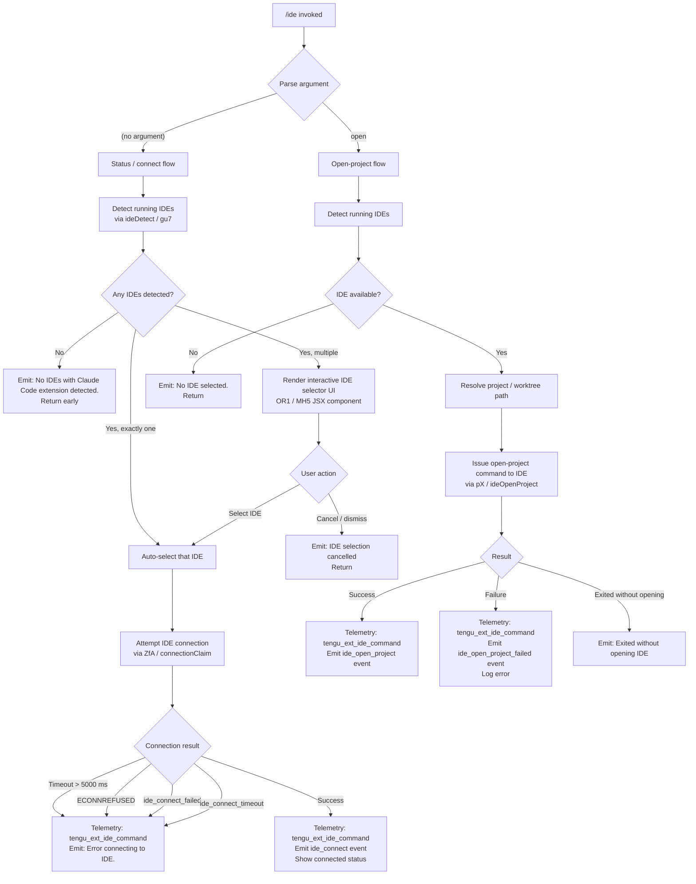

# `/ide`

> Analysis basis: CC v2.1.159 bundle.js (AST extraction + Claude interpretation)
> Minimum version: v2.1.159

---

## Overview

The `/ide` command manages IDE integrations for Claude Code, allowing the user to inspect currently detected IDEs (VS Code, Cursor, Windsurf, JetBrains family), initiate a connection to a selected IDE, and optionally open a project inside that IDE. When invoked with the `open` subcommand argument, it actively launches or focuses the IDE to the current project or worktree. The command renders an interactive JSX UI component to present status and allow IDE selection.

---

## Registration

| Field | Value |
|---|---|
| type | `local-jsx` |
| name | `ide` |
| description | `Manage IDE integrations and show status` |
| argumentHint | `[open]` |
| module_id | `zR1` |
| load_inline | `true` |
| loc_byte | `11313117` |
| loc_byte_end | `11313273` |
| loc_line | `6867` |
| arbor_handler.name | `MH5` |
| arbor_handler.fqn | `claude-2.1.159::MH5` |
| arbor_handler.kind | `AsyncFunction` |
| arbor_handler.resolution_path | `module_id` |
| arbor_handler.n_hits | `0` |

Analysis basis: CC v2.1.159 bundle.js:+11313117

---

## Input Branching

The command has five or more distinct runtime branches based on detected IDEs, argument presence, user selection, connection state, and error outcomes. A Mermaid flowchart is used.



Analysis basis: CC v2.1.159 bundle.js:+11309231 (handler entry `MH5`), +11309339 (`"open"` literal), +11309448 (no-IDEs message), +11309586 (no-selection message), +11309786 (`ide_open_project` event literal), +11311336 (`ide_connect` event literal)

---

## Behavioral Spec

### Top-level handler (`MH5`)

The Arbor-resolved handler is the async function `MH5` (fqn `claude-2.1.159::MH5`), reached via the `module_id` resolution path through module `zR1`.

```
async function ideCommandHandler(args, appState):
    // Emit telemetry for every invocation
    emit telemetry "tengu_ext_ide_command"

    subcommand = args[0]  // may be "open" or undefined

    // --- Branch A: open-project sub-command ---
    if subcommand == "open":
        ideList = await detectRunningIDEs()     // calls ideDetect (Vf8/Ef8/gu7)
        if ideList is empty:
            return renderMessage("No IDE selected.")

        selectedIDE = ideList[0]   // or previously persisted selection
        projectPath = resolveProjectPath(appState)   // worktree or project root

        try:
            result = await openProjectInIDE(selectedIDE, projectPath)   // pX
            if result == "exited_without_open":
                return renderMessage("Exited without opening IDE")
            emit telemetry "ide_open_project"  (ide type, worktree/project label)
        catch error:
            emit telemetry "ide_open_project_failed"
            logError(error)
        return

    // --- Branch B: status / connect flow ---
    ideList = await detectRunningIDEs()   // Vf8 -> Ef8 -> gu7

    if ideList is empty:
        return renderMessage("No IDEs with Claude Code extension detected.")

    selectedIDE = await presentIDESelectorUI(ideList)  // OR1 JSX component
    if selectedIDE == null:
        return renderMessage("IDE selection cancelled")

    // Connect to selected IDE
    renderMessage("Connecting to " + selectedIDE.label)
    connectionResult = await claimIDEConnection(selectedIDE)   // ZfA

    if connectionResult.error:
        emit telemetry "ide_connect_failed" or "ide_connect_timeout"
        return renderMessage("Error connecting to IDE.")

    emit telemetry "ide_connect"
    renderConnectedStatus(selectedIDE)
```

Analysis basis: CC v2.1.159 bundle.js:+11309231, +11309353, +11309377, +11309446, +11309759, +11309783, +11309847

---

### IDE Detection (`Vf8` / `Ef8` / `gu7`)

The detection subsystem discovers running IDE processes that have the Claude Code extension active. It combines OS-level process scanning with filesystem inspection of well-known IDE socket/config directories.

```
async function detectRunningIDEs():
    // Parse port from environment or config (parseInt used at +5329121)
    port = parseInt(envOrConfig)

    // Enumerate candidate IDE directories (gu7)
    candidates = gatherIDECandidatePaths()
    // Checks: homedir, ~/.claude, /mnt/c/Users (WSL), skips Public/Default/Default User/All Users
    // Follows symlinks; filters by isDirectory, isSymbolicLink
    // Resolves realpath; deduplicates via Set

    // For each candidate, check for IDE socket / extension presence (Ef8)
    results = await Promise.all(candidates.map(checkIDECandidate))

    // Each candidate yields an IDE record with:
    //   type: one of "vscode" | "cursor" | "windsurf" | "jetbrains"
    //   path: resolved workspace path
    //   label: display name

    // On Linux, also runs ps-aux grep for:
    //   "code|cursor|windsurf|idea|pycharm|webstorm|phpstorm|rubymine|clion|goland|rider|datagrip|dataspell|aqua|gateway|fleet|android-studio"
    //   (bundle.js:+5333997)

    // Emits telemetry "ide_detect" on success, "ide_detect_failed" on error

    return filteredIDEList
```

Analysis basis: CC v2.1.159 bundle.js:+5329121 (`parseInt`), +5326914 (`vI.join`), +5326991 (`HX9.homedir`), +5327212 (`/mnt/c/Users`), +5327050 (`wsl`), +5327459 (`oq`), +5327667 (`tJ9.realpath`), +5330464 (`ide_detect`), +5330528 (`ide_detect_failed`), +5333997 (Linux ps-aux command)

---

### IDE Selector UI (`OR1` / `MH5` JSX component)

When multiple IDEs are detected, an interactive React/Ink JSX component is rendered in the terminal to let the user choose.

```
function IDESelectorComponent(ideList, onSelect, onCancel):
    [selectedIndex, setSelectedIndex] = useState(0)
    ideStore = useIDEStore()       // J6 — synced external store
    appState = useAppState()       // OA

    useEffect(() => {
        // Watch for IDE connection state changes
        // Trigger re-render on ide_connect / ide_disconnect events
    }, [ideList])

    useCallback(handleKeyPress, [...deps]):
        if key == "escape" or "q":
            onCancel()
            return

        if key == "enter":
            onSelect(ideList[selectedIndex])
            return

        if key == "up" / "down":
            setSelectedIndex(clamp(selectedIndex ± 1))

    render:
        for each ide in ideList:
            bold(ide.type label)    // "vscode", "cursor", "windsurf", "jetbrains"
            statusLine(ide.connectionState)   // "pending" / "ide_connect" / "ide_connect_failed" / "ide_connect_timeout"

        if anyIDEHasMCPPrefix "mcp__ide__":
            showMCPToolRow()

        showConnectionErrors if any

        if selectedIDE starts with "ws:":
            showWebSocketInfo()
        else if selectedIDE is "dynamic":
            showDynamicConnectionInfo()
```

Analysis basis: CC v2.1.159 bundle.js:+11311119 (`useState`), +11311139 (`J6` store), +11311190 (`OA`), +11311197 (`useRef`), +11311211 (`useEffect`), +11311492 (`p5`), +11311618 (`useCallback`), +11311779 (`Lk`), +11311926 (`mcp__ide__`), +11312029 (`ide_disconnect`), +11312133 (`j.startsWith`), +11312146 (`ws:`), +11312263 (`dynamic`), +11312366 (`"Connecting to "`)

---

### IDE Connection Claim (`ZfA`)

Establishes or reclaims a named Unix/TCP socket connection to the IDE's Claude Code extension host.

```
async function claimIDEConnection(ideRecord):
    // cF.claim — attempts to claim the IPC socket
    claimResult = await socketClaim(ideRecord.socketPath)   // cF.claim at +15450066

    // Write auth frame (BB5 -> cF.buildClaimFrame at +15450523)
    authFrame = buildClaimFrame(sessionToken)

    // Open TCP/Unix connection (Tx8.connect at +15450369)
    socket = await Tx8.connect(ideRecord.socketPath)
    socket.on("data", onData)
    socket.once("error", onError)
    socket.write(authFrame)   // DF encodes as binary frame

    // Probe connection (FB5 / gB5)
    // Timeout: 5000 ms (bundle.js:+15450643)
    result = await Promise.race([
        awaitConnectionAck(socket),
        timeout(5000, new Error("send-claim timeout"))
    ])

    if result.error == "ECONNREFUSED":
        emit telemetry "tengu_bg_sendclaim_failed"
        throw ConnectionError

    return ClaimHandle { socket, ideRecord }
```

Analysis basis: CC v2.1.159 bundle.js:+15450066 (`cF.claim`), +15450181 (`FB5`), +15450197 (`BB5`), +15450369 (`Tx8.connect`), +15450523 (`cF.buildClaimFrame`), +15450643 (5000 ms timeout), +15450699 (`"send-claim timeout"`), +15450791 (`ECONNREFUSED`), +15450222 (`tengu_bg_sendclaim_failed`)

---

### Open Project in IDE (`pX` / `ideOpenProject`)

Dispatches an open-project command to the IDE process over the claimed connection.

```
async function openProjectInIDE(ideRecord, projectPath):
    // Normalise IDE type name to lowercase (H.toLowerCase at +5334872)
    ideTypeLower = ideRecord.type.toLowerCase()

    // Determine display label: "worktree" or "project" (literals at +11309820, +11309831)
    label = isWorktree(projectPath) ? "worktree" : "project"

    // Resolve basename for display (vI.basename at +5334930)
    baseName = path.basename(projectPath)

    // Send open-project IPC message
    response = await sendIDECommand(ideRecord, {
        command: "openProject",
        path: projectPath
    })

    // eNH handles response parsing
    if response.status == "exited_without_open":
        return "exited_without_open"

    return response
```

Analysis basis: CC v2.1.159 bundle.js:+11309786 (`ide_open_project`), +11309820 (`worktree`), +11309831 (`project`), +11309893 (`ide_open_project_failed`), +11310183 (`Exited without opening IDE`), +5334872 (`H.toLowerCase`), +5334930 (`vI.basename`)

---

### IDE Install Hint (`qv_` / `ru7`)

When no IDE with the Claude Code extension is detected, a structured hint listing supported IDEs and installation instructions is assembled.

```
function buildIDEInstallHint():
    supported = [
        { type: "vscode",     label: "VS Code" },
        { type: "cursor",     label: "Cursor" },
        { type: "windsurf",   label: "Windsurf" },
        { type: "jetbrains",  label: "JetBrains IDEs" }
    ]

    // ru7 iterates Object.entries of known IDE config map
    // Filters by platform (linux, macos, windows)
    // Appends "IDE" label string (bundle.js:+5334817)
    // Builds install instructions including "restart your IDE" hint (+11310451)

    return formattedHintText
```

Analysis basis: CC v2.1.159 bundle.js:+11310316 (`qv_`), +5334509 (`ru7`), +5334817 (`"IDE"`), +11310451 (`"restart your IDE"`), +11309646 (`vscode`), +11309687 (`cursor`), +11309728 (`windsurf`), +5325571 (`jetbrains`)

---

### Daemon / Background Session Interaction

The `/ide` handler interacts with Claude Code's background daemon to coordinate the connection session (`w` / background session manager).

```
function coordinateWithDaemon(connectionHandle):
    // Normalise path (A.normalize "NFC" at +11312704)
    normalizedPath = normalizePath(connectionHandle.path, "NFC")

    // List active background sessions (w.startsWith at +11312765)
    sessions = getActiveSessions()
    for session in sessions:
        if session.id.startsWith(connectionHandle.prefix):
            // Report to UI (w.slice at +11312791, D.slice at +11312850)
            sessionSummary = session.id.slice(0, 3)  // first 3 chars for display
                             + ", " + ...             // +11312873
                             + ", …" if truncated     // +11312887

    // Random spinner frame selection (Math.floor at +11312679, H.slice at +11312618)
    // Spinner advances through 100-step cycle (literal 100 at +11312575)
    // Starting offset 0 (literal 0 at +11312594)
    spinnerFrame = Math.floor(Math.random() * 100)
```

Analysis basis: CC v2.1.159 bundle.js:+11312575, +11312594, +11312618, +11312648 (step 3), +11312679, +11312704, +11312716 (`NFC`), +11312725, +11312743, +11312765, +11312791, +11312850, +11312873, +11312887

---

## State & Side Effects

| Item | Detail |
|---|---|
| Telemetry: `tengu_ext_ide_command` | Fired at handler entry (bundle.js:+11309233) |
| Telemetry: `ide_detect` | Fired when IDE detection succeeds (literal at +5330464) |
| Telemetry: `ide_detect_failed` | Fired when IDE detection errors (literal at +5330528) |
| Telemetry: `ide_open_project` | Fired on successful project open (literal at +11309786) |
| Telemetry: `ide_open_project_failed` | Fired on failed project open (literal at +11309893) |
| Telemetry: `ide_connect` | Fired on successful IDE connection (literal at +11311336) |
| Telemetry: `ide_connect_failed` | Fired when connection attempt fails (literal at +11311423) |
| Telemetry: `ide_connect_timeout` | Fired when connection times out (literal at +11311530) |
| Telemetry: `tengu_bg_sendclaim_failed` | Fired when socket claim fails (bundle.js:+15450222) |
| Telemetry: `tengu_config_parse_error` | Fired when config JSON cannot be parsed (bundle.js:+3211632) |
| Telemetry: `tengu_bg_spare_enable` | Background spare-PTY pool management side effect (bundle.js:+15468826) |
| Telemetry: `tengu_bg_spare_claim` | Spare PTY claimed during session setup (bundle.js:+15470888) |
| Telemetry: `tengu_bg_spare_claim_fail` | Spare PTY claim failed (bundle.js:+15471151) |
| Telemetry: `tengu_daemon_control` | Daemon lifecycle signal emitted (bundle.js:+15505330) |
| Telemetry: `tengu_daemon_yield` | Daemon yields to foreground process (bundle.js:+15488175) |
| Telemetry: `tengu_daemon_idle_exit` | Daemon exits when idle (bundle.js:+15489168) |
| Telemetry: `tengu_daemon_config_reload` | Daemon config reloaded (bundle.js:+15483981) |
| Telemetry: `tengu_bg_attach` | Background session attach attempt (bundle.js:+15461559) |
| Telemetry: `tengu_bg_attach_kick` | Background session kicked (bundle.js:+15463657) |
| Telemetry: `tengu_bg_attach_stall_ms` | Attach stall duration recorded (bundle.js:+15453412) |
| Telemetry: `tengu_bg_attach_stall_gave_up` | Attach gave up after stalling (bundle.js:+15462471) |
| Telemetry: `tengu_bg_attach_stall_respawn` | Attach respawned stalled worker (bundle.js:+15462740) |
| Telemetry: `tengu_bg_attach_legacy_autorespawn` | Legacy respawn triggered (bundle.js:+15461148) |
| Telemetry: `tengu_bg_dispatch_sigkill_escalate` | SIGKILL escalation in dispatch (bundle.js:+15469493) |
| Telemetry: `tengu_bg_dispatch_low_mem` | Low-memory dispatch condition (bundle.js:+15470072) |
| Telemetry: `tengu_bg_dispatch_stale_drop` | Stale dispatch dropped (bundle.js:+15459072) |
| Telemetry: `tengu_bg_proto_mismatch` | Background protocol version mismatch (bundle.js:+15457833) |
| Telemetry: `tengu_bg_roster_parse_failed` | Roster JSON parse failed (bundle.js:+11240497) |
| Telemetry: `tengu_bg_session_create` | New background session created (literal at +15469803, `daemon_bg_session_create`) |
| Telemetry: `tengu_bg_spare_spawn` | Background spare spawned (bundle.js:+15469186) |
| Telemetry: `tengu_bg_low_mem_mb` | Low-memory event with MB reading (bundle.js:+12731249) |
| Telemetry: `tengu_feature_ok` / `_bad` / `_sad` | Feature gate evaluation results (bundle.js:+966033, +966091, +966168) |
| Hook registration | `_.onInstallIDEExtension` hook is called (bundle.js:+11310360) to notify on IDE extension install events |
| appState changes | IDE selection and connection status written back into app state via `OA`/`J6` store; `mcp__ide__` tool entries added/removed |
| IPC socket | Unix/TCP socket opened to IDE extension host; written with binary claim frame (DF encoder); closed on dispose |
| File system | Reads `daemon.status.json`; reads/writes job roster files under jobs/pins directories; creates `~/.claude` dirs as needed |
| Background PTY pool | Spare PTY processes spawned via `--bg-pty-host` / `--bg-spare` flags; managed by `TfA`; pool size default target visible via `"200"` / `"50"` spawn args (bundle.js:+15448747, +15448753) |
| Sound | <!-- TODO: not found in depth-2 traversal; needs --depth 4 --> |

---

## Version History

| Version | Change |
|---|---|
| v2.1.159 | Initial analysis |

---

## Common Mistakes

1. **Running `/ide` without the extension installed** — The command will report "No IDEs with Claude Code extension detected." even if the IDE is running. The extension must be installed and active in VS Code, Cursor, Windsurf, or a JetBrains IDE first; then restart the IDE as prompted.
2. **Confusing `/ide` with `/ide open`** — `/ide` alone shows status and lets you connect; `/ide open` additionally opens the current project inside the IDE. The `[open]` argument hint is optional.
3. **Multiple IDEs detected, interaction cancelled** — If the IDE selector UI is dismissed (Escape/`q`), the command returns "IDE selection cancelled" without connecting. Re-run `/ide` to retry.
4. **Connection timeout** — If the IDE extension's socket is not ready within 5000 ms (bundle.js:+15450643), the command reports "Error connecting to IDE." This can occur if the extension is still starting up; waiting a few seconds and retrying usually resolves it.
5. **WSL path confusion** — The detection logic explicitly skips paths under `/mnt/c/Users/Public`, `/mnt/c/Users/Default`, and similar system accounts (bundle.js:+5327306–+5327370). Personal user directories are scanned correctly, but running Claude Code as a system account will yield no IDE detections.
6. **`mcp__ide__` tool prefix** — IDE-provided MCP tools are registered under the `mcp__ide__` prefix (bundle.js:+11311926). If MCP tool calls to the IDE are failing, verify the IDE connection is active via `/ide` before investigating tool configurations.

---

## Appendix — Identifier Mapping

> For bundle debugging only. Identifiers change across versions.

| Identifier | Role |
|---|---|
| `MH5` | Top-level `/ide` async command handler (Arbor-resolved, fqn `claude-2.1.159::MH5`) |
| `Qs_` | IDE status display / spinner / session-list renderer component |
| `OR1` | Interactive IDE selector JSX component (React/Ink) |
| `Vf8` | IDE detection orchestrator (dispatches candidate scan + process check) |
| `Ef8` | Per-candidate IDE filesystem/socket checker |
| `gu7` | IDE candidate path gatherer (homedir, WSL paths, symlink resolution) |
| `pX` | IDE open-project command dispatcher |
| `qv_` | IDE install hint builder |
| `ru7` | IDE hint text assembler (platform-aware, Object.entries iteration) |
| `ZfA` | IDE connection claim manager (socket open, auth frame write, ack wait) |
| `FB5` | Connection probe with 5000 ms timeout |
| `gB5` | Low-level TCP connect helper (Tx8.connect wrapper) |
| `BB5` | Claim frame builder (delegates to `cF.buildClaimFrame`) |
| `DF` | Binary IPC frame encoder (Buffer alloc, UInt32BE/UInt8 write) |
| `TfA` | Background daemon / spare PTY pool manager |
| `w` | Background session lifecycle manager (dispatch, kill, low-mem guard) |
| `yfA` | Background session create/retire cycle handler |
| `Y` | Background session state machine (stop/start/updateConfig) |
| `oB5` | Supervisor-side IPC message router (handles ping/nudge/yield/lease/dispatch/attach/resize/…) |
| `D` | Background session status aggregator (memory, platform, daemon info) |
| `G6` | IDE extension config normaliser |
| `K_8` | IDE extension state transition handler |
| `cz_` | Growthbook experiment event emitter |
| `oz_` | IDE extension connection state machine step |
| `h6` | IDE config file reader/watcher initialiser |
| `tzH` | IDE config file parser (readFileSync, statSync, mkdirSync, copyFileSync) |
| `l17` | IDE config file watcher (`J_8.watchFile` / `unwatchFile`) |
| `Xs1` | Daemon status JSON writer (writes `daemon.status.json`) |
| `Fy8` | macOS low-memory threshold checker (1024 MB threshold) |
| `G1` | Feature flag evaluator (ok/bad) |
| `hH` | Feature flag "ok" predicate |
| `bH` | Feature flag "bad" predicate |
| `t6` | Feature flag "sad" predicate |
| `SH` | Log/error sink with queue management |
| `F_` | Error/String coercer for logging |
| `L1` | Log entry formatter |
| `JVA` | Log entry channel helper |
| `I_4` | Log queue shift/push manager |
| `N` | Structured log message builder (debug/warn levels, redaction) |
| `tCK` | Log channel selector |
| `E4` | Log line formatter (lastIndexOf, slice, replace) |
| `vuH` | Log colour helper |
| `_bK` | File-based log writer (Buffer.byteLength, atomic rename) |
| `S` | Background worker supervisor connector |
| `HvK` | Worker identity verifier (realpath, stat) |
| `DF5` | Worker socket path resolver |
| `sW8` | Claude binary version path builder |
| `Yw6` | Jobs roster file reader |
| `NP_` | Roster file path builder |
| `zT` | Jobs directory path builder |
| `OP7` | Jobs directory scanner (readdir, parallel stat) |
| `l89` | Roster entry writer (mkdir, B3 atomic write) |
| `B` | Settled-job reaper |
| `VH` | Plugin/MCP server filter (reads `.claude-plugin` / `marketplace.json`) |
| `LB` | File extension checker (`.mcpb`, `.dxt`) |
| `GH` | Plugin detail resolver (MCPB file reader, `plugin-details`) |
| `v6` | MCP server config normaliser (stdio/sse/http/sdk types) |
| `dH` | Orphaned-permission cleaner |
| `L1A` | Daemon auth token writer (yqH.mkdir, yqH.writeFile, JSON.stringify) |
| `iN6` | Auth directory path builder |
| `Js_` | Auth file path builder |
| `FB5` | Send-claim timeout wrapper (5000 ms) |
| `gB5` | TCP connection helper (`Tx8.connect`, once/end) |
| `g8` | Abortable promise with timeout (clearTimeout, setTimeout) |
| `gM` | Error coercer (`w8`) |
| `EH` | String coercer |
| `Sh1` | Spare PTY socket path builder |
| `al` | PTY auth socket path helper |
| `Rh1` | Spare PTY host socket path builder |
| `QB5` | PTY process argument validator (`Array.isArray`) |
| `gT` | PTY PID file path builder |
| `mRH` | PTY PID directory path builder |
| `UB5` | Spawn option builder (`Object.assign`) |
| `M` | Plugin staging path resolver (`.staging`, path traversal guard) |
| `aS6` | Plugin path normaliser (relative path, `..` guard) |
| `z` | Daemon stop sequence (hH/bH state check, cm race) |
| `xy` | Daemon stop notification builder |
| `cm` | Daemon stop orchestrator (Promise.race/all, process.exit, 500 ms grace) |
| `X` | Supervisor IPC connection handler (Buffer concat, frame parser) |
| `oB5` | Supervisor IPC message dispatcher (full protocol handler) |
| `RVK` | Supervisor heartbeat / stale-detection timer |
| `Ff` | IPC write helper (`H.end`, RH) |
| `Hz` | Background service label resolver |
| `LR6` | IPC write-destroy helper |
| `rB5` | Background worker re-attach helper |
| `iB5` | Attach stall monitor |
| `p` | PTY write flush helper |
| `P` | Terminal repaint orchestrator (`zx8`, `sh`, `Dm`, `Promise.all`) |
| `T` | Terminal resize helper (`Tv6`, `zx8`) |
| `l` | Terminal filter helper |
| `a` | Terminal write dispatcher |
| `c` | Terminal input handler (`hS8`) |
| `x` | Idle-exit timer (`setTimeout`, `z.write`, `Math.round`) |
| `r` | Voice focus silence timeout handler |
| `o` | Voice toggle silence timeout handler |
| `I` | Away-summary gating logic (cache staleness, rate limit, draft check) |
| `m2H` | Background session metadata builder |
| `Qe1` | Session display layout calculator (`Math.max`, `PY`) |
| `G` | Remote-control startup handler |
| `sVK` | Heartbeat interval manager (`lHH`) |
| `j` | Active session killer |
| `y` | Background worker kill helper |
| `J6` | IDE store selector (useSyncExternalStore wrapper) |
| `uJ_` | App-state context accessor (throws ReferenceError outside provider) |
| `OA` | App-state reader hook |
| `p5` | IDE connection status hook (useMemo, useSyncExternalStore) |
| `Lk` | Stable-hash key generator for UI cleanup |
| `E66` | Hash computation helper |
| `UrH` | SHA-256 hash builder (Qk9.createHash, Object.keys, Array.isArray) |
| `O` | Background session list component (`k8`) |
| `k8` | Session list item renderer |
| `_H5` | IDE status summary formatter |
| `sf` | Argument pre-processor for `/ide` |
| `v8` | Platform / shell command runner (`T_`, `R6`) |
| `R6` | Context/store getter (`rB6`, `O_`) |
| `rB6` | Store retrieval helper (`iB6.getStore`, `rn`) |
| `O_` | App-state accessor (`_N`) |
| `Ix` | Config normaliser (`CH`, `Nx`) |
| `CH` | String coercer (to String) |
| `Nx` | Config value resolver (`RR`) |
| `RH` | JSON serialiser (`JSON.stringify`) |
| `U6` | JSON parser (`JSON.parse`) |
| `P8` | Error code wrapper (`w8`) |
| `w8` | Error enricher (errno, code fields) |
| `oq` | Permission error classifier (EACCES/EPERM/ENOTDIR/ELOOP/EROFS) |
| `Ds_` | Utility path helper (`utL`) |
| `T86` | PTY directory path builder (`ms`) |
| `GF` | PTY initialiser (`Ds_`, `h3.join`, `T86`) |
| `qfH` | PTY PID path resolver (`mRH`) |
| `E86` | Roster file updater (TF read + UtL write) |
| `TF` | Roster file reader/parser |
| `UtL` | Roster file atomic writer (`B3`, `Z86.mkdir`) |
| `jD` | Job state resolver (`RV`, `wvH`) |
| `RV` | Job activity state classifier (`wvH`) |
| `Lf` | Job pin writer (`B3`, `aP.join`, `$j`) |
| `B3` | Atomic file writer (randomBytes temp name, writeFile→rename, copyFile, unlink) |
| `$j` | Pin cache invalidator (`tYH.delete`) |
| `H1` | Job metadata file reader (stat, readFile, JSON parse, cache via tYH) |
| `gK` | Job directory path builder (`aP.join`, `zT`) |
| `_X9` | Process kill helper (`process.kill`) |
| `MH9` | Shell command line matcher (`H.match`) |
| `W` | Drive-letter upper-caser (`DL`) |
| `DL` | Drive letter formatter |
| `f9` | Command string slicer (indexOf, slice) |
| `Bu7` | IDE process record builder (`m1_`) |
| `m1_` | IDE process metadata parser (String, parseInt, isNaN, `T_`) |
| `T_` | Shell command executor (`sh -c`, 3000 ms timeout, `SH` error log) |
| `XP` | Platform-specific IDE socket finder (`xGH`) |
| `xGH` | IDE extension IPC socket enumerator (multi-platform) |
| `Aa` | IDE connection action dispatcher |
| `si` | Session-ID generator (`i1H`) |
| `e9` | Request-store accessor (`TJ7.getStore`) |
| `gk6` | Daemon status path builder (`Js1.join`, `F8`) |
| `d` | App config accessor |
| `Iz` | Error type checker |

---

Note: index built via Arbor fallback; some signals (telemetry, literals) may be missing — see arbor-fallback.js.