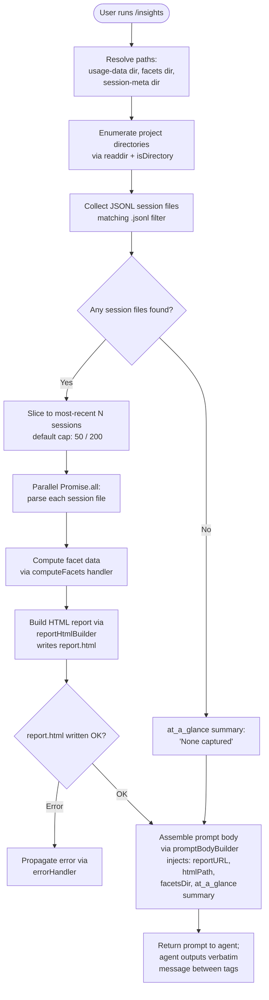

# `/insights`

> Analysis basis: CC v2.1.159 bundle.js (AST extraction + Claude interpretation)
> Minimum version: v2.1.159

---

## Overview

`/insights` generates a self-contained HTML usage-analytics report by reading the local session history and facet data directories, computing per-session metrics (token counts, tool use, response times, time-of-day distribution, error rates, etc.), writing `report.html` into the insights output directory, and then instructing the agent to deliver a fixed confirmation message that includes the report URL and file path. The command takes no user-supplied arguments; all data is gathered at invocation time from persisted JSONL session files.

---

## Registration

| Field | Value |
|---|---|
| type | `prompt` |
| name | `insights` |
| description | `Generate a report analyzing your Claude Code sessions` |
| loc_byte | `12863370` |
| loc_byte_end | `12864674` |
| loc_line | `9918` |
| handler_method | `getPromptForCommand` |
| handler_method_start | `12863544` |
| handler_method_end | `12864673` |
| prompt_body.length | `513` characters |
| prompt_body.trace | `call→V8K(...) (1 literals)` |
| arbor_handler.name | `getPromptForCommand` |
| arbor_handler.kind | `Method` |
| arbor_handler.resolution_path | `direct` |
| arbor_handler.fqn | `claude-2.1.159::getPromptForCommand` |
| arbor_handler.n_hits | `1` |

Analysis basis: CC v2.1.159 bundle.js:+12863370

---

## Input Branching

The handler has three or more distinct execution paths based on whether session data exists, whether prior insights cache is present, and whether the HTML generation step succeeds. A Mermaid flowchart is used.



Analysis basis: CC v2.1.159 bundle.js:+12863550, +12863643, +12851016, +12852411

---

## Behavioral Spec

### 1 — Path Resolution

When the handler fires, it resolves three filesystem roots from the application configuration:

```
function resolveInsightsPaths(appConfig):
    usageDataDir  = joinPath(configBase, "usage-data")   // literal "usage-data"
    sessionMetaDir = joinPath(configBase, "session-meta") // literal "session-meta"
    facetsDir     = joinPath(configBase, "facets")        // literal "facets"
    return { usageDataDir, sessionMetaDir, facetsDir }
```

Analysis basis: CC v2.1.159 bundle.js:+12789365, +12789461, +12789415

### 2 — Session File Discovery (`MJ5` → `sessionFileScanner`)

```
async function sessionFileScanner(usageDataDir):
    entries = await readdir(usageDataDir)
    dirs    = entries.filter(e => isDirectory(e))
    files   = []
    for dir in dirs:
        subEntries = await readdir(joinPath(usageDataDir, dir))
        jsonlFiles = subEntries.filter(e => isFile(e) AND e.endsWith(".jsonl"))
        files.push(...jsonlFiles mapped to absolute paths)
    // yield control periodically via setImmediate (batch size: 10 items, yield every 9)
    files.sort(byMtime descending)
    return files
```

- The `.jsonl` extension filter is literal `".jsonl"` (bundle.js:+12934108).
- `setImmediate` is used to avoid blocking the event loop; batch constants are `10` and `9` (bundle.js:+12850290, +12850295).
- Files are capped: the pipeline later slices to at most `50` files for warmup-minimal mode or `200` otherwise (bundle.js:+12850432, +12850437).

Analysis basis: CC v2.1.159 bundle.js:+12850021, +12850040, +12850094, +12850320, +12850344

### 3 — Per-Session Parsing (`E8K` → `sessionDataAggregator`)

```
async function sessionDataAggregator(sessionFiles, options):
    subset = sessionFiles.slice(0, cap)   // cap = 50 or 200
    results = await Promise.all(subset.map(f => parseSessionFile(f)))

    aggregated = {
        toolUsage:       Map<toolName, count>,
        errorCategories: Map<category, count>,
        responseTimes:   List<seconds>,
        timeOfDay:       Map<bucket, count>,   // Morning/Afternoon/Evening/Night
        tokenCounts:     Map<session, tokens>,
        commitActivity:  List,
    }

    for result in results:
        merge result into aggregated

    return aggregated
```

Response-time buckets are defined as: `"2-10s"`, `"10-30s"`, `"30s-1m"`, `"1-2m"`, `"2-5m"`, `"5-15m"`, `">15m"` (bundle.js:+12806583–+12806643).

Time-of-day buckets:
- Morning (6–12): hours 7, 11 (bundle.js:+12807431, +12807457, +12807466)
- Afternoon (12–18): hours 12–17 (bundle.js:+12807478–+12807520)
- Evening (18–24): hours 18–23 (bundle.js:+12807532–+12807572)
- Night (0–6): hours 0–4 (bundle.js:+12807584, +12807613)

Session stale threshold: `1800000` ms (30 minutes) (bundle.js:+12797838).

Analysis basis: CC v2.1.159 bundle.js:+12850486, +12850509, +12850521, +12851016

### 4 — Facet Data Collection (`GA6` → `facetDirectoryReader`)

```
async function facetDirectoryReader(facetsDir):
    entries = await readdir(facetsDir)
    facetFiles = entries.filter(e => isFile(e) AND matchesFacetPattern(e))
    basenames = facetFiles.map(e => basename(e))
    stats = await Promise.all(facetFiles.map(f => stat(f)))
    facetMap = {}
    for (file, stat) of zip(facetFiles, stats):
        facetMap[basename(file)] = { size: stat.size, mtime: stat.mtime, ... }
    return facetMap
```

The facet pattern matcher (`Da`) tests filenames against a compiled regex (bundle.js:+6753584).

Analysis basis: CC v2.1.159 bundle.js:+12934002, +12934079, +12934133, +12934136, +12934243

### 5 — HTML Report Generation (`LJ5` → `reportHtmlBuilder`)

```
function reportHtmlBuilder(aggregated, facetMap, paths):
    html = baseTemplate(aggregated)

    // Inject sections:
    html += toolUsageSection(aggregated.toolUsage)     // bar chart via BfH
    html += responseTimeSection(aggregated.responseTimes)  // buckets
    html += timeOfDaySection(aggregated.timeOfDay)         // qJ5
    html += errorSection(aggregated.errorCategories)       // color-coded
    html += tokenSection(aggregated.tokenCounts)

    // Escape HTML entities: &amp; &lt; &gt; &quot; &apos;
    // Bold markdown: replace **text** → <strong>text</strong>
    // List items: prefix with "• "
    // Line breaks: <br>

    outputPath = joinPath(paths.outputDir, "report.html")
    await mkdir(outputPath.parent, { recursive: true })
    await writeFile(outputPath, html, "utf-8")

    return { reportURL, htmlPath: outputPath }
```

Chart colors (hardcoded):
- `#2563eb`, `#0891b2`, `#10b981`, `#8b5cf6` (bundle.js:+12844248, +12844386, +12844558, +12844701)
- Error color: `#dc2626`; success: `#16a34a`; warning: `#eab308` (bundle.js:+12847964, +12848213, +12848706)

Maximum HTML section size: `8192` characters (bundle.js:+12805752).

Output filename: `"report.html"` (bundle.js:+12852670).

The "Add to CLAUDE.md" suggestion literal is present in the report HTML (bundle.js:+12811927).

Analysis basis: CC v2.1.159 bundle.js:+12808217, +12808262, +12808345, +12852411, +12852698

### 6 — Prompt Body Construction (`getPromptForCommand` / `V8K` → `promptBodyBuilder`)

```
function promptBodyBuilder(reportURL, htmlPath, facetsDir, atAGlanceSummary):
    // The method constructs the 513-character prompt string.
    // Key injected values (not quoted verbatim):
    //   - full insights data block
    //   - reportURL (shareable link)
    //   - htmlPath  (local file path)
    //   - facetsDir (directory reference)
    //   - atAGlanceSummary (agent-only context)
    //
    // The prompt instructs the agent to output ONLY the text
    // between <message> tags, verbatim, without omitting any line.
    // The message confirms the report is ready and prompts follow-up.
    //
    // Fallback when no data found: "_No insights generated_" literal
    //   (bundle.js:+12864441)

    if noDataFound:
        return "_No insights generated_"
    return assembledPromptString
```

The separator literal `" · "` is used to join summary facets (bundle.js:+12864002).

`Math.round` is applied to numeric summary values before injection (bundle.js:+12863931).

Analysis basis: CC v2.1.159 bundle.js:+12864576, +12864594, +12864640, +12863931, +12864441

### 7 — Conversation History Snapshot (`OAH` → `conversationSnapshotWriter`)

The call path `E8K → Ah8 → OAH` represents the deep machinery that reads and indexes transcript JSONL files. Key behaviors within depth-2 reach:

```
function conversationSnapshotWriter(sessionPath):
    // Opens JSONL via PS.openSync / PS.readSync / PS.closeSync
    // Parses attribution-snapshot, last-prompt, compact_boundary markers
    // Tracks metadata keys: summary, last-prompt, custom-title, ai-title,
    //   tag, agent-name, agent-color, agent-setting, mode, permission-mode,
    //   isolation-latch, worktree-state, pr-link, bridge-session,
    //   file-history-snapshot, attribution-snapshot, content-replacement,
    //   fork-context-ref, marble-origami-commit, marble-origami-snapshot
    // Buffer allocation: allocUnsafe(1048576) = 1 MiB (bundle.js:+12917683)
    // Minimum read unit: 65536 bytes (bundle.js:+12918996)
    return parsedSessionRecord
```

Analysis basis: CC v2.1.159 bundle.js:+12922844, +12917346, +12917664, +12917694, +12920265

---

## State & Side Effects

| Item | Detail |
|---|---|
| Filesystem writes | Creates output directory (recursive mkdir) and writes `report.html` at `<configBase>/insights/report.html`; also writes per-session facet JSON files (bundle.js:+12852411, +12852698) |
| Filesystem reads | Reads all `.jsonl` session files under `usage-data/`; reads facet files under `facets/`; reads `session-meta/` files (bundle.js:+12923025) |
| Prompt delivery | Returns a `prompt`-type result; the agent is instructed to output only the fixed `<message>…</message>` block verbatim |
| Telemetry | `tengu_transcript_phantom_parent` (bundle.js:+12919881); `tengu_transcript_parent_cycle` (bundle.js:+12923506); `tengu_chain_parent_cycle` (bundle.js:+12901389); `tengu_chain_timestamp_fallback` (bundle.js:+12901538); `tengu_chain_parallel_tr_recovered` (bundle.js:+12903404); `tengu_relink_walk_broken` (bundle.js:+12899620) — emitted from transcript-parsing sub-routines reached during session aggregation |
| appState changes | None observed in depth-2 traversal |
| Hook registration | None observed in depth-2 traversal |
| Sound | None observed in depth-2 traversal |
| No-data fallback | Agent response is `"_No insights generated_"` when session files yield no data (bundle.js:+12864441) |

---

## Version History

| Version | Change |
|---|---|
| v2.1.159 | Initial analysis |

---

## Common Mistakes

1. **Running `/insights` in a fresh environment with no session history** — If no `.jsonl` files exist under the `usage-data` directory, the command completes without error but the agent responds with `_No insights generated_` rather than a report URL.
2. **Expecting interactive argument support** — `/insights` accepts no arguments; all parameters are inferred from the local data directories. Passing text after the command has no effect.
3. **Assuming the report is streamed incrementally** — The HTML file is only written after all session files have been parsed and the full report assembled. On large histories (>200 sessions) the command may pause visibly before responding.
4. **Confusing the report URL with the local HTML path** — The prompt body injects both a `reportURL` (shareable) and an `htmlPath` (local file); these are distinct values. The local file is always at `<configBase>/insights/report.html`.
5. **Editing `report.html` manually between runs** — Each invocation of `/insights` overwrites `report.html` unconditionally via `writeFile`.

---

## Appendix — Identifier Mapping

> For bundle debugging only. Identifiers change across versions.

| Identifier | Role |
|---|---|
| `__handler_insights` | Synthetic BFS entry point for the `/insights` command handler |
| `E8K` | Session data aggregator — top-level orchestrator that drives session discovery, parsing, facet collection, and report writing |
| `MJ5` | Session file scanner — enumerates JSONL files under the usage-data directory tree |
| `xc` | Path join helper used during project directory traversal |
| `GA6` | Facet directory reader — reads and stats facet files |
| `Da` | Facet filename pattern tester (regex test wrapper) |
| `N` | Log/format utility used across multiple sub-systems |
| `VH` | Plugin/MCP session file loader (reached via session parsing path) |
| `LB` | File extension checker (`.mcpb`, `.dxt`) |
| `GH` | Plugin detail resolver used during session parsing |
| `U6` | JSON.parse wrapper / safe parser |
| `c6` | Session content type classifier |
| `v6` | MCP transport configuration resolver |
| `dH` | Orphaned-permission set manager |
| `E` | Orphaned-permission set entry |
| `oj5` | Usage-data file reader — reads individual session data files |
| `bqA` | Base path builder for usage-data subtree |
| `hy6` | Sub-path resolver within usage-data directory |
| `G8K` | Session data post-processor or validator |
| `M` | Plugin staging-path manager (resolves `.staging` paths) |
| `aS6` | Plugin path normaliser / staging path builder |
| `H` | General-purpose utility (Math.random / setTimeout shim) |
| `sS6` | Plugin synced-path builder |
| `g` | Session content classifier (includes `B` and `$` branches) |
| `Xs1` | Timestamp / date-now utility |
| `Ah8` | Conversation-history aggregator — calls snapshot writer and assembles per-session stats |
| `OAH` | Conversation snapshot writer — parses JSONL with low-level Buffer I/O |
| `NJ5` | Snapshot format version handler |
| `p` | Clearable write-timer map for snapshot writer |
| `FC` | Snapshot write finaliser |
| `pYA` | Recursive object-key normaliser used in snapshot parsing |
| `Ej` | Snapshot field serialiser |
| `O` | Background-session state tracker (`"stopped"`, `"background session"`) |
| `J` | Writable stream wrapper (uses `w` event emitter) |
| `X` | Buffer-accumulating stream reader |
| `P` | MCP connection manager (connected/failed states) |
| `T` | MCP transport layer helper |
| `z` | Daemon helper (hH/bH/xy/cm sub-calls) |
| `Y` | Supervisor / renderer config updater |
| `D` | Background-spare memory monitor |
| `w` | Background worker process manager (spawns, kills, monitors) |
| `j` | Worker-kill orchestrator |
| `W` | DL-based state dispatcher |
| `G` | Keyboard-interrupt / remote-control handler |
| `V` | Versioned state slot (get/set pair) |
| `Q` | Async task queue (QN6/Th1 callbacks) |
| `I` | Away-summary generator (rate-limit aware) |
| `h` | Away-summary scheduler (Math.min / date-based throttle) |
| `CH` | String coercion helper (wraps `String()`) |
| `sJ5` | Attribution-snapshot JSONL binary parser (low-level Buffer read) |
| `tJ5` | Compact JSONL header reader (openSync/readSync/closeSync) |
| `x` | Daemon idle-exit timer (setTimeout/clearTimeout) |
| `s8K` | Relink walker — repairs broken parent-chain references in transcript |
| `aJ5` | In-memory JSONL attribution parser (Buffer.from path) |
| `QGH` | Crypto/hash utility group (F94/g94/d94/Q94) |
| `R` | Timer/resource handle |
| `oq` | w8 wrapper (permission-mode helper) |
| `SH` | Structured error logger (ki.logError, wpH.push) |
| `e` | Notification manager (addNotification) |
| `t` | Voice-recording session controller |
| `d` | Async disposer / cleanup callback |
| `c` | hS8-backed permission set |
| `a` | Permission allow-set (wraps `w` and `c`) |
| `r` | Focus-silence timeout handler for voice |
| `j_K` | Parallel-transcript index updater |
| `z5H` | Conversation chain builder — assembles ordered message chain |
| `BJ5` | Chain NaN-guard and session deduplicator |
| `FJ5` | Chain facet filter and sorter |
| `pJ5` | Chain queue processor (shift/push loop) |
| `XeH` | Session header mapper |
| `A9A` | Text content sanitiser (replaceAll, slice) |
| `Kk6` | Message content renderer (array/text/command-args/bash-input) |
| `K9A` | Content-type gating wrapper |
| `gJ5` | Single-content-item type checker |
| `QJ5` | Array-content type checker |
| `Dh8` | Session delta tracker (get/set/push on maps) |
| `wh8` | Session-values flattener (Array.from + H.values) |
| `gj5` | NaN guard for numeric session fields |
| `uqA` | Metrics normaliser (Math.round, Array.isArray, trim) |
| `W8K` | Per-session record parser — extracts tool names, errors, timestamps, token counts |
| `S` | Stdio/SSE/HTTP output transport helper |
| `yy6` | Session time-zone or date offset helper |
| `Fj5` | File extension extractor (QF.extname) |
| `_jH` | Diff engine wrapper (EX9.diff) |
| `a4` | Array indexOf utility |
| `y` | Foreground-yield write helper |
| `C` | Case-fold transport selector |
| `O$` | Numeric overflow guard |
| `xqA` | <!-- TODO: not found in depth-2 traversal; needs --depth 4 --> |
| `aj5` | Facet JSON writer — mkdir + writeFile for per-session facet output |
| `RH` | JSON.stringify wrapper |
| `ij5` | Cached facet reader — readFile + optional unlink |
| `_h8` | Sub-path builder within facets directory |
| `v8K` | Facet cache validator |
| `sj5` | Report orchestrator — calls HTML builder, zone classifier, and file writer |
| `nj5` | Batch HTML section renderer (parallel Promise.all over section map) |
| `dj5` | Individual section data formatter (uqA + slice + join) |
| `oXH` | HTML template engine (ZK + XZ8 + E8 + PCH + LT) |
| `ZK` | HTML skeleton builder |
| `XZ8` | Section hash + file writer (dV6.createHash sha1, writeFile) |
| `E8` | UUID generator wrapper (vv.randomUUID) |
| `PCH` | HTML partial compiler (Jl_ + RqK) |
| `LT` | Layout template finaliser |
| `P8K` | Report path builder (QG sub-call) |
| `QG` | Base output directory resolver (nM/z5/GA providers) |
| `jK` | HTML filter / sanitiser (H.filter) |
| `F_` | Error/String throw wrapper |
| `rj5` | Facet data file writer (mkdir + writeFile) |
| `$J5` | Object key enumerator helper |
| `Z8K` | Analytics aggregator — computes percentiles, medians, time-distribution maps |
| `WA6` | Object.entries-based aggregation helper |
| `f9` | Array slice-at-index helper |
| `T8K` | Histogram bucket accumulator (sort, Set operations) |
| `ej5` | Final metrics assembler — Array.from + Promise.all over section builders |
| `X8K` | Per-section HTML generator (calls oXH, ZK, mj5, jK) |
| `mj5` | QG-based output path resolver for sections |
| `LJ5` | Main HTML report builder — splits, replaces, maps all section generators |
| `B5` | HTML entity escaper (YL wrapper) |
| `YL` | String replaceAll entity encoder |
| `Hh8` | Markdown-to-HTML inline converter |
| `KJ5` | RH-based template serialiser |
| `BfH` | Tool-usage bar-chart HTML generator |
| `AJ5` | Token-count chart generator (Math.max + Object.entries) |
| `qJ5` | Time-distribution chart builder (_.map + Math.max + q.map) |
| `V8K` | Prompt body builder — assembles the 513-char prompt string injected into the agent |

---

Note: index built via Arbor fallback; some signals (telemetry, literals) may be missing — see arbor-fallback.js.