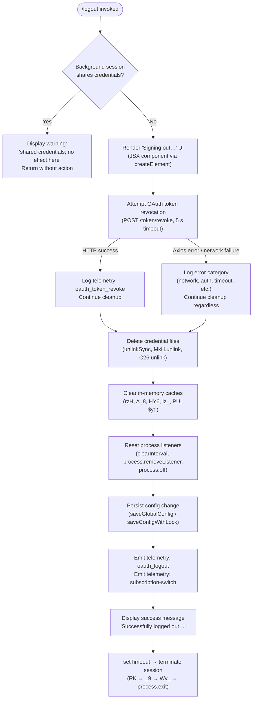

# `/logout`

> Analysis basis: CC v2.1.159 bundle.js (AST extraction + Claude interpretation)
> Minimum version: v2.1.159

---

## Overview

The `/logout` command signs the user out of their Anthropic account by revoking the active OAuth token with the server, removing all locally-cached credentials and credential files, and resetting in-memory application state. It provides a short UI confirmation sequence and then terminates the CLI session. Background (daemon/worker) sessions detect a shared-credential context and refuse to act, instructing the user to run `/logout` from the main terminal instead.

---

## Registration

| Field | Value |
|---|---|
| type | `local-jsx` |
| name | `logout` |
| description | Sign out from your Anthropic account |
| loc_byte | `11348599` |
| loc_byte_end | `11348896` |
| loc_line | `7351` |
| module_id | `db_` |
| load_inline | `true` |
| arbor_handler.name | `YzL` |
| arbor_handler.fqn | `claude-2.1.159::YzL` |
| arbor_handler.kind | `AsyncFunction` |
| arbor_handler.resolution_path | `module_id` |
| arbor_handler.n_hits | `0` |

Analysis basis: CC v2.1.159 bundle.js:+11348599

---

## Input Branching

Four distinct execution paths exist depending on session context and the outcome of token revocation, so a flowchart is used.



---

## Behavioral Spec

### 1. Background-Session Guard

Before any destructive work the handler (Arbor: `YzL`) checks the current process role against the string constants `"bg"`, `"daemon"`, and `"daemon-worker"` (Analysis basis: CC v2.1.159 bundle.js:+2202033 / +2202043 / +2202057).

```
function checkBackgroundSession(processRole):
    if processRole in ["bg", "daemon", "daemon-worker"]:
        display("This background session shares credentials with other sessions; "
                "/logout here has no effect. Run /logout from your main terminal to sign out.")
        return ABORT
    return CONTINUE
```

Analysis basis: CC v2.1.159 bundle.js:+7826358

### 2. Token Revocation Request

The token-revocation helper (`Zq_`) posts the current refresh token to the OAuth server with a 5 000 ms timeout. The literal `"refresh_token"` identifies the grant type; the literal `"oauth_token_revoke"` is the server-side action name sent in the request body. Content-Type is set to `"application/json"`.

```
async function revokeToken(oauthCredentials):
    payload = {
        action: "oauth_token_revoke",
        grant_type: "refresh_token",
        token: oauthCredentials.refreshToken
    }
    try:
        response = await httpPost(oauthEndpoint, payload,
                                  headers={"Content-Type": "application/json"},
                                  timeout=5000)
        return SUCCESS
    catch AxiosError as err:
        category = classifyError(err)   // "auth" | "network" | "timeout" | "http" | "other"
        logError(category)
        return FAILURE_TOLERATED        // cleanup continues regardless
```

Analysis basis: CC v2.1.159 bundle.js:+2057829 (Zq_), +2057889 (`"refresh_token"`), +2057997 (`"oauth_token_revoke"`), +2057987 (`5000` ms timeout), +2058034 (isAxiosError check)

### 3. Credential File Deletion

Three separate unlink operations remove credential artefacts from disk. The `q` helper calls `IVK.unlinkSync`; `mR9` calls `MkH.unlink`; `wy_` calls `C26.unlink`. Each is wrapped with an ENOENT-tolerant try/catch so a missing file is not fatal.

```
async function deleteCredentialFiles(paths):
    for each path in [primaryCredentialPath, oauthTokenPath, sessionCachePath]:
        try:
            unlinkSync(path)
        catch err:
            if err.code != "ENOENT": logError(err)
```

Analysis basis: CC v2.1.159 bundle.js:+15447547 (IVK.unlinkSync), +6925616 (MkH.unlink), +6885686 (C26.unlink), +3209323 (`"ENOENT"`)

Keychain entries (macOS Keychain / libsecret) are also cleared via `oK` → `Lzq`, which reads the existing entry and then calls `_.delete` or `H.delete` as appropriate. A failure emits `"Failed to delete keychain entry"` (bundle.js:+2070155) and is logged non-fatally.

### 4. In-Memory Cache Purge

The global state-reset helper (`CQH`) is invoked to clear every runtime cache before session teardown.

```
function clearRuntimeCaches():
    process.off("exit", exitListener)
    process.off("beforeExit", beforeExitListener)
    clearInterval(heartbeatInterval)
    process.removeListener("beforeExit", ...)
    for cache in [rzH, A_8, HY6, lz_, PU]:
        cache.clear()
    $yq.clear()                      // credential in-memory store
```

Analysis basis: CC v2.1.159 bundle.js:+3189098 (process.off), +3189217–+3189265 (map clears), +2938434 ($yq.clear), +3189813 (`"beforeExit"`), +3189156 (`"exit"`)

### 5. Config Persistence

After credential removal the configuration writer (`z8`) saves the updated global config. It acquires a file lock, checks that the cached config still contains auth data before writing (guarding against the known auth-loss race described in GH #3117), rotates backup files, and writes atomically via a temporary file + rename. If the lock acquisition takes too long the `tengu_config_lock_contention` event is emitted.

```
async function persistLogoutToConfig():
    acquire fileLock (timeout 60000 ms)
    if lockTookTooLong:
        emit telemetry("tengu_config_lock_contention")
    existingConfig = readConfigFileSync()
    if cacheHasAuth AND existingConfig lacks auth:
        logWarning("saveGlobalConfig fallback: re-read config is missing auth …")
        emit telemetry("tengu_config_auth_loss_prevented")
        return          // refuse write
    newConfig = mergeLogoutState(existingConfig)
    writeAtomic(configPath, newConfig)
    rotateBackups(maxBackups=5)
```

Analysis basis: CC v2.1.159 bundle.js:+3206437 (zY_), +3208968 (`"Lock acquisition took longer…"`), +3206197 (`"saveGlobalConfig fallback…"`), +3209738 (60 000 ms backup window), +3209987 (`5` backups max)

### 6. Telemetry Emission and Session Termination

After cleanup the handler emits two telemetry literals and then renders the success message, followed by a delayed `process.exit` via `setTimeout` (200 ms delay observed at bundle.js:+7826652).

```
async function finaliseLogout():
    emit telemetry("subscription-switch")    // bundle.js:+7825874
    emit telemetry("oauth_logout")           // bundle.js:+7826029
    displayMessage("Successfully logged out from your Anthropic account.")
    await delay(200)
    terminateSession()                        // Wv_ → process.exit
```

Analysis basis: CC v2.1.159 bundle.js:+7825874, +7826029, +7826557, +7826652

### 7. JSX Confirmation UI

The handler calls `Qb_.createElement` to mount a transient JSX component showing `"Signing out…"` (literal at bundle.js:+7826711). The component is unmounted by the exit path via `wIH` which calls `H.unmount` on the Ink renderer.

Analysis basis: CC v2.1.159 bundle.js:+7826532 (createElement), +5357049 (H.unmount), +7826711 (`"Signing out…"`)

---

## State & Side Effects

| Item | Detail |
|---|---|
| Telemetry — `oauth_token_revoke` | Fired when the revocation HTTP call is dispatched (bundle.js:+2057997) |
| Telemetry — `oauth_logout` | Fired after credential cleanup succeeds (bundle.js:+7826029) |
| Telemetry — `subscription-switch` | Fired as part of logout state broadcast (bundle.js:+7825874) |
| Telemetry — `tengu_config_lock_contention` | Fired if config file lock is slow (bundle.js:+3209057) |
| Telemetry — `tengu_config_stale_write` | Fired if config write detects stale state (bundle.js:+3209193) |
| Telemetry — `tengu_config_auth_loss_prevented` | Fired if auth-loss guard fires on write (bundle.js:+3209536) |
| Telemetry — `tengu_feature_ok` / `tengu_feature_sad` / `tengu_feature_bad` | General feature outcome events reachable from credential-store helpers (bundle.js:+966033, +966168, +966091) |
| Telemetry — `tengu_scroll_summary` | Emitted by scroll/render path during session teardown (bundle.js:+5358517) |
| Telemetry — `tengu_cache_eviction_hint` | Emitted during session-end teardown (bundle.js:+5359550) |
| Credential files deleted | OAuth token file, primary credential file, session cache file (via unlinkSync) |
| Keychain entry deleted | `"claude-code-user"` entry removed from OS keychain (bundle.js:+2069397) |
| In-memory caches cleared | `rzH`, `A_8`, `HY6`, `lz_`, `PU`, `$yq` all `.clear()`-ed |
| Process listeners removed | `exit`, `beforeExit` listeners removed; heartbeat interval cleared |
| Config file mutated | Auth fields removed and config written atomically to disk |
| Session terminated | `process.exit` called after 200 ms delay |
| Background session guard | No files or state are modified; only a warning message is displayed |

---

## Version History

| Version | Change |
|---|---|
| v2.1.159 | Initial analysis |

---

## Common Mistakes

1. **Running `/logout` from a background/daemon terminal** — the command detects the `"bg"`, `"daemon"`, or `"daemon-worker"` process role and refuses to act; it instructs the user to run the command from the main interactive terminal.
2. **Expecting instant termination** — the CLI waits approximately 200 ms after displaying the success message before calling `process.exit`, so a very brief delay is intentional.
3. **Assuming revocation failure prevents logout** — if the OAuth token-revocation HTTP call fails (network error, 401, timeout, etc.), the logout process still continues and all local credentials are removed; only the server-side token is not invalidated.
4. **Concurrent Claude instances** — the config write uses a file lock. If another Claude instance is running, the logout may emit `tengu_config_lock_contention` and could be delayed up to 60 000 ms before the lock is acquired.
5. **Stale keychain entries** — if `"Failed to delete keychain entry"` is logged (bundle.js:+2070155), the OS keychain entry for `"claude-code-user"` was not removed; manual keychain cleanup may be required.

---

## Appendix — Identifier Mapping

> For bundle debugging only. Identifiers change across versions.

| Identifier | Role |
|---|---|
| `YzL` | Main `/logout` async handler (Arbor-resolved) |
| `DzL` | Logout UI wrapper / rendering coordinator |
| `qsH` | Core logout execution function (credential cleanup orchestrator) |
| `c06` | State-reset dispatcher (calls cache clear, daemon stop, MCP cleanup) |
| `q` | Synchronous credential file unlinker (`IVK.unlinkSync`) |
| `N9` | Process role / session type checker (bg/daemon guard) |
| `QOH` | Session type reader used by N9 |
| `p26` | Sub-helper called during state reset |
| `BzH` | Sub-helper called during state reset |
| `aH8` | In-memory store clear helper (calls `$yq.clear`) |
| `dzH` | Sub-helper called during state reset |
| `dHH` | Full runtime teardown helper (clears listeners, caches, emits shutdown) |
| `Ix` | Process/event helper called by dHH |
| `CH` | String conversion / formatting utility |
| `Nx` | Helper called by Ix |
| `CQH` | Multi-cache clear helper (rzH, A_8, HY6, lz_, PU) |
| `sz_` | Interval/listener cleanup helper (clearInterval, process.removeListener) |
| `SH` | Log-writer / error-queue flush helper |
| `F_` | Error formatting helper |
| `L1` | Essential-traffic queue helper |
| `I_4` | Queue shift/push helper |
| `mR9` | OAuth token file unlinker (`MkH.unlink`) |
| `UR9` | Sub-helper of mR9 |
| `Uy_` | Sub-helper of mR9 |
| `$hA` | Sub-helper called by Uy_ |
| `$1H` | Path helper used in credential file operations |
| `P56` | Path join helper for credential files |
| `wy_` | Session cache file unlinker (`C26.unlink`) |
| `Yy_` | Sub-cleanup helper called by wy_ |
| `jy_` | Sub-helper called by Yy_ |
| `F4H` | MCP/socket cleanup helper |
| `ocH` | Path helper for socket cleanup |
| `GA` | Auth provider type checker (bedrock/foundry/vertex/firstParty) |
| `oK` | Keychain / secure-storage access helper |
| `Lzq` | Secure storage read/write/delete dispatcher |
| `H` | Primary keychain store object |
| `_` | Fallback plaintext credential store object |
| `tTH` | Storage write path helper |
| `Kp4` | Storage lock/run context helper |
| `hH` | `tengu_feature_ok` telemetry emitter |
| `d` | Base telemetry emit function |
| `t6` | `tengu_feature_sad` telemetry emitter |
| `bH` | `tengu_feature_bad` telemetry emitter |
| `Zq_` | OAuth token revocation HTTP caller |
| `kq` | OAuth endpoint URL builder |
| `MEA` | Sub-helper of kq |
| `P84` | Sub-helper of kq |
| `N` | HTTP request dispatcher / logger |
| `tCK` | HTTP transport helper |
| `DOA` | Low-level HTTP send helper |
| `RH` | JSON stringify wrapper |
| `E4` | URL/path manipulation helper |
| `cYA` | URL component mapper |
| `vuH` | Response write helper |
| `CYA` | Write flush helper |
| `_bK` | Logging / file-append helper |
| `axH` | Buffered output writer |
| `M$H` | Log file path builder |
| `g6` | Filesystem existence check |
| `MK6` | EISDIR error handler |
| `tYA` | Log path join helper |
| `sYA` | Log file rotation helper |
| `HbK` | Log file append helper (mkdir + appendFile) |
| `K9` | Output drain register helper (`zOA.register`) |
| `Ut` | Sub-step called during cleanup sequence |
| `u3_` | Global config writer coordinator |
| `Tyq` | Config persistence helper |
| `VKq` | Config path resolver |
| `bN` | Config path normaliser + SHA-256 hasher |
| `XP` | Sub-helper of VKq |
| `YV` | User-info / home-dir resolver |
| `EH` | String coercion helper |
| `z8` | Global config read/write/lock manager |
| `YY_` | Config write with backup rotation |
| `tOq` | Config object merger |
| `w8` | ENOENT-tolerant file reader |
| `tzH` | Config file parser and validator |
| `$Y6` | Config schema validator |
| `DY_` | Backup path builder |
| `V` | Sub-process or renderer object |
| `P` | Session/supervisor process manager |
| `E` | Renderer / display manager |
| `CL6` | Atomic file write helper (temp + rename) |
| `BQH` | Sub-helper of z8 |
| `pFq` | Config entry iterator |
| `FQH` | Timestamp helper for config writes |
| `zY_` | Config merge + write helper (fallback path) |
| `Ya6` | Sub-helper called by u3_ |
| `K` | Session/store mutate object |
| `L0H` | Sub-step called during cleanup |
| `VNH` | UI status renderer (shows "Signing out…") |
| `fX` | Sub-helper of VNH |
| `Y4` | Telemetry event emitter (event.name, event.timestamp) |
| `Rm8` | Sub-helper of Y4 |
| `ENH` | OpenTelemetry metrics initialiser |
| `wU` | Session-ID generator (randomBytes) |
| `I6` | `_N` / identity helper |
| `kL8` | Attribute key helper |
| `B$H` | Feature-flag checker (`isK.has`) |
| `s4` | Sub-helper (IY, h6) |
| `hM9` | Metrics batch helpers (ak7, ok7) |
| `IL8` | Metrics attribute freezer |
| `z16` | Sub-helper of Y4 |
| `RK` | Session exit orchestrator |
| `_9` | Main session shutdown function |
| `wIH` | Ink renderer unmount + final write helper |
| `mR` | Sub-step of wIH |
| `gq8` | Terminal restore helper (ESC-7/ESC-8 sequences) |
| `Pv_` | Final output flush / dim-text helper |
| `JZ` | Sub-helper of Pv_ |
| `Ib` | Sub-helper of Pv_ |
| `jP6` | Path existence checker (statSync) |
| `y$` | Sub-helper of Pv_ |
| `dX9` | Sub-helper of Pv_ |
| `Wv_` | Process kill helper (process.exit / process.kill SIGKILL) |
| `sxH` | Output drain helper (`zOA.drain`) |
| `Y` | Supervisor/renderer lifecycle manager |
| `m2H` | Render state snapshot helper |
| `Qe1` | Render column-width calculator |
| `G` | Input event stop helper |
| `sVK` | Heartbeat controller |
| `NK6` | Startup profiling writer |
| `xB8` | Sub-helper of NK6 |
| `wDA` | Profiling JSON writer |
| `bf8` | Scroll summary telemetry emitter |
| `QX9` | Sub-helper of bf8 |
| `gX9` | Scroll metric calculator |
| `qq` | Terminal environment detector (tmux-CC / Windows SSH) |
| `p96` | Sub-step of _9 |
| `xf8` | Parallel cleanup promise runner |
| `g8` | Abort-signal timeout helper |

---

*Note: index built via Arbor fallback; some signals (telemetry, literals) may be missing — see arbor-fallback.js.*