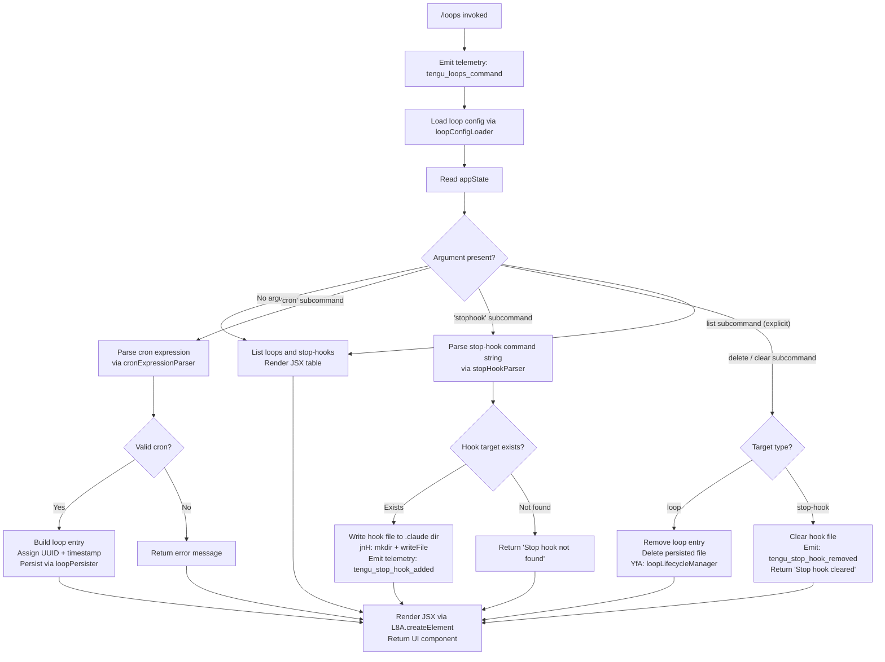

# `/loops`

> Analysis basis: CC v2.1.159 bundle.js (AST extraction + Claude interpretation)
> Minimum version: v2.1.159

---

## Overview

`/loops` is a management command for **recurring loops** and **stop-hooks** in Claude Code's background-agent system. It allows users to list existing loops and stop-hooks, create new recurring loops (using cron-style scheduling), and delete loops or clear stop-hooks. The command renders a JSX-based interactive UI, coordinates with the daemon process-management layer, and persists configuration changes to `.claude`-scoped JSON files on disk.

---

## Registration

| Field | Value |
|---|---|
| type | `local-jsx` |
| name | `loops` |
| description | `List, create, and delete recurring loops and stop-hooks` |
| loc_byte | `12205622` |
| loc_byte_end | `12205804` |
| loc_line | `8114` |
| immediate | `true` |
| module_id | `ml1` |
| load_inline | `true` |
| arbor_handler.name | `I55` |
| arbor_handler.fqn | `claude-2.1.159::I55` |
| arbor_handler.kind | `AsyncFunction` |
| arbor_handler.resolution_path | `module_id` |
| arbor_handler.n_hits | `0` |

Analysis basis: CC v2.1.159 bundle.js:+12205622

---

## Input Branching

The command handler (`I55`) exhibits more than three distinct top-level branches depending on subcommand arguments, loop type, and the presence of existing hooks. A Mermaid flowchart is used.



Analysis basis: CC v2.1.159 bundle.js:+12204577, +12204625, +12204657, +12204864, +12205003, +12205129, +12205227, +12205315

---

## Behavioral Spec

### Main Handler (`I55` — `loopsCommandHandler`)

```
async function loopsCommandHandler(context):
    emit telemetry("tengu_loops_command")
    config = await loopConfigLoader(context)         // L8H
    appState = context.getAppState()
    items = appState.map(...)                        // A.map at +12204657

    if subcommand == "cron":
        result = await cronScheduleBuilder(args)     // FV
        if result is valid:
            entry = createLoopEntry(result)          // JnH
            await persistLoop(entry)                 // jnH
        else:
            return errorMessage

    elif subcommand == "stophook":
        parsed = parseStopHookArgs(args)             // K8H → jnH
        await writeStopHookFile(parsed)
        emit telemetry("tengu_stop_hook_added")

    elif subcommand == "delete":
        await loopLifecycleManager("delete", target) // yfA
        if target was stop-hook:
            emit telemetry("tengu_stop_hook_removed")
            return "Stop hook cleared"

    elif subcommand == "list" or no subcommand:
        renderLoopList(appState, items)              // d66 / Q66

    return JSX via L8A.createElement(...)
```

Analysis basis: CC v2.1.159 bundle.js:+12204577

---

### Loop Configuration Loader (`L8H`)

```
async function loopConfigLoader(context):
    raw = await diskLoopReader(context)              // $NH
    parsed = parseLoopIndex(raw)                    // IG
    return parsed
```

The disk reader (`$NH`) calls:
- `_.readFile` with encoding `"utf-8"` (bundle.js:+4788948, +4788976)
- File-path resolver `M7H` → `C78.join` + `pK` → `_N`
- Error classifier `oq` → `w8` (handles `ENOENT`, `EACCES`, `EPERM`, `ENOTDIR`, `ELOOP`, `EROFS`)
- Loop-line parser `SH` which maintains an internal ring buffer via `I_4` (`QB6.shift` / `QB6.push`), appends errors via `wpH.push`, and logs via `ki.logError`

Analysis basis: CC v2.1.159 bundle.js:+4790936, +4788948, +4788976

---

### Cron Schedule Parser and Builder (`FV` — `cronScheduleBuilder`)

```
function cronScheduleBuilder(rawInput):
    trimmed = rawInput.trim()
    if trimmed matches minute-level pattern:
        return { description: "Every minute", ... }   // literal at +4786840
    if trimmed matches hour-level pattern:
        return { description: "Every hour", ... }     // literal at +4787057
    parse numeric fields:
        parseInt for minutes (limit 10, constants at +4785048)
        parseInt for hours
        validate ranges:
            minutes: 0..59    (+12204344)
            hours:   0..23    (+12204415)
            days:    0..31    (+12204468)
    compute next-run UTC timestamp using:
        J.getUTCDay, J.setUTCDate, J.getUTCDate,
        J.setUTCHours, J.getDay
    apply Math.max, Math.ceil, Math.round normalization (+12204287, +12204298, +12204371)
    return scheduledEntry
```

Range constants observed: minutes max `59` (+12204344), hours max `23` (+12204415), days max `31` (+12204468), seconds field max `60` (+12204310).

Analysis basis: CC v2.1.159 bundle.js:+12204708, +4786720

---

### Stop-Hook Parser (`jI` — `stopHookArgParser`)

```
function stopHookArgParser(input):
    trimmed = input.trim()
    fragments = splitIntoFragments(trimmed)          // Fv7: H.split
    for each fragment:
        match against hook pattern (L.match)
        parseInt numeric parts
        add to hookSet (K.add)
        limit: max 5 hooks per loop (+4785585, value=5)
        numeric parse radix 10 (+4785048)
        day-of-week indices: 3, 6, 7 supported (+4785210, +4785246, +4785252)
    return Array.from(hookSet)
```

Analysis basis: CC v2.1.159 bundle.js:+12204535, +4785549

---

### Loop Entry Creator (`JnH` — `loopEntryFactory`)

```
async function loopEntryFactory(schedule, context):
    id = CL9.randomUUID()                           // +4790276
    createdAt = Date.now()                          // +4790338
    meta = buildLoopMeta(schedule)                  // M0H
    persisted = await diskLoopReader($NH)            // re-reads current state
    entry = { id, createdAt, ...meta }
    entries.push(entry)                             // M.push
    await writeLoopFiles(entry)                     // jnH
    await renderConfirmation(entry)                 // I6, si
    return entry
```

The file-write helper `jnH` (loopFilePersister):
- Resolves the `.claude` directory path (`C78.join`, literal `".claude"` at +4790117)
- Creates directory: `R78.mkdir`
- Maps entries to file content: `H.map`
- Writes JSON file: `R78.writeFile`
- Re-reads via `M7H` for verification
- Serialises via `RH` (JSON.stringify wrapper)

Analysis basis: CC v2.1.159 bundle.js:+12205227, +4790276, +4790338

---

### Loop Lifecycle Manager (`yfA` — `loopLifecycleManager`)

This is the most complex sub-component, managing the full state-machine for a running or queued loop worker.

```
async function loopLifecycleManager(action, target):
    trackingSet.add(target)                         // q.add
    try:
        resolveLoopPath(target)                     // gK → aP.join + zT
        currentEntry = H1(loopPath)                 // H1: loop-state reader
        if action == "delete":
            lY.rm(loopPath)                         // file removal
            unlink pid file (lY.unlink)
            remove from roster (_.rosterEntry)
            Y.delete(target)
            H.delete(target)
            return
        // spawn / restart path:
        daemonSession = ZfA(target)                 // daemonSessionLauncher
        E86(daemonSession)                          // sessionEventWatcher
        gT / GF / iN6 called for state transitions
        jD(target)                                  // retireIfActive → state "active" (+4097334)
        Lf(target)                                  // logFrameWriter
        setTimeout(callback, 300000)               // idle timeout +15476257 (5 min)
    finally:
        trackingSet.delete(target)                  // q.delete
```

Loop state values observed in literals: `"done"` (+15474690), `"killed"` (+15474708), `"stopped"` (+15474717), `"failed"` (+15474727), `"active"` (+4097334), `"crashed"` (+15474874), `"blocked"` (+15474928), `"working"` (+15475035), `"bg"` (+15475199), `"daemon"` (+15475519), `"idle"` (+15475634), `"resuming"` (+15476471).

Analysis basis: CC v2.1.159 bundle.js:+15474839, +15475536, +15476207

---

### Daemon Session Launcher (`ZfA` — `daemonSessionLauncher`)

```
async function daemonSessionLauncher(loopId):
    cF.claim(loopId)                                // claim slot
    await writeSessionConfig(L1A)                   // yqH.mkdir + yqH.writeFile
        // JSON.stringify, max sizes: 448 (+13195539), 384 (+13195591)
    socket = Tx8.connect(socketPath)
    socket.on("connect", ...)
    sendClaimFrame(socket, DF)                      // DF: Buffer framing
        // Buffer.allocUnsafe, writeUInt32BE, writeUInt8, copy
    await withTimeout(5000ms, "send-claim timeout") // FB5, +15450643, +15450699
    on ECONNREFUSED: retry after 500ms              // +15450791, +15450847
    socket.once("kill") → send SIGTERM              // literals +15450449, +15450460
    return sessionHandle
```

Analysis basis: CC v2.1.159 bundle.js:+15450066, +15450152

---

### Daemon Background Worker Spawner (`TfA` — `daemonBgSpawner`)

```
async function daemonBgSpawner(config):
    emit telemetry("daemon_bg_spare_refill")        // literal +15448423
    id = i6 + G1
    bytes = NVK.randomBytes(n).toString("hex")      // +15448492
    Rk.mkdir(spawnDir)
    Rk.open(pidFile)
    gT(spawnDir)                                    // state dir setup
    proc = Bun.spawn([                              // +15448711
        "--bg-pty-host",                            // +15448729
        "200", "50", "--",                          // +15448747, +15448753, +15448758
        "--bg-spare"                                // +15448770
    ], { stdio: "ignore" })                         // +15448813
    proc.unref()
    deadline = Date.now() + 2000                    // +15449549
    loop until deadline:
        output = Rk.readFile(outputFile).slice(n)   // z.slice
        N(output)
    proc.kill on timeout                            // M.kill
    H.onExit / H.log
```

Analysis basis: CC v2.1.159 bundle.js:+15448384

---

### Loop List / UI Renderer (`d66`, `Q66` — `loopStateRenderer`, `stopHookRenderer`)

```
function loopStateRenderer(context):
    I6(context)                                     // contextValidator
    g66(context)                                    // tableFormatter
    appState = H.getAppState()
    for each loop in appState:
        if action == "set":
            H.setAppState(updated)
            H.applyMessageOp("append", ...)         // literal +10544084
            emit telemetry("tengu_stop_hook_removed" or "tengu_stop_hook_added")
            uuid = sZ1 → rZ1.randomUUID()
            d(result)
    return rendered

function stopHookRenderer(context):
    Vr_ → GU / YD / S_ / xL
        // GU: policySettings gate (+3234723, +3234726)
        // YD: trust_gate check (+10543314)
        // xL: hooks_gate check (+10543260)
    if gate == "hooks_gate":   emit telemetry logic
    if gate == "trust_gate":   enforce trust policies
    t6(context)                                     // output writer (d wrapper)
    I6 / g66 as above
    Date.now() timestamp (+10543613)
    gw → Object.values(xxH)                         // outputTokens accounting (+43073)
    H.setAppState / H.applyMessageOp
    sZ1 → UUID for new message
    hH(result)                                      // featureOk telemetry path
```

Observed string constants for message operations: `"append"` (+10544084), `"attachment"` (+10544190), `"goal"` (+10544149), `"goal_set"` (+10543392), `"goal_status"` (+10544277).

Analysis basis: CC v2.1.159 bundle.js:+12205003, +12205315, +10543364, +10543852

---

### Stop-Hook File Writer (`K8H` — `stopHookPersistenceManager`)

```
async function stopHookPersistenceManager(args):
    hasDuplicates = Ft(args)                        // _.has check at +51779
    currentLoops = await diskLoopReader($NH)
    filtered = q.filter(currentLoops)
    notAlreadyPresent = A.has check
    await loopFilePersister(jnH)                    // write to .claude dir
    return persistenceResult
```

Error strings:
- `"Stop hook not found"` (+12205021)
- `"Stop hook cleared"` (+12205043)
- `"Stop hook set"` (+12205339)

Analysis basis: CC v2.1.159 bundle.js:+12204864

---

### Cron-Based Schedule Normaliser (`N55` — `cronFieldNormaliser`)

```
function cronFieldNormaliser(rawCron):
    parts = rawCron.match(cronPattern)              // H.match at +12204165
    minutes = parseInt(parts[1])                    // +12204202
    // validate and clamp:
    //   max minutes: Math.max(0, min(59, val))
    //   max hours: clamped to 23
    //   max days: clamped to 31
    seconds = Math.ceil(val / 60)                   // +12204298
    rounded = Math.round(val)                       // +12204371
    // passes result to stopHookArgParser (jI) at +12204535
    return { minutes, hours, days, normalised }
```

Analysis basis: CC v2.1.159 bundle.js:+12205129

---

## State & Side Effects

| Item | Detail |
|---|---|
| Telemetry: `tengu_loops_command` | Fired immediately on command entry (+12204579) |
| Telemetry: `tengu_stop_hook_added` | Fired when a new stop-hook is written (+10543750) |
| Telemetry: `tengu_stop_hook_removed` | Fired when a stop-hook is cleared (+10544118) |
| Telemetry: `tengu_bg_dispatch_sigkill_escalate` | Fired when a background worker is SIGKILL-escalated (+15469493) |
| Telemetry: `tengu_daemon_control` | Fired on daemon start/stop control operations (+15505330) |
| Telemetry: `tengu_feature_bad` | Fired on feature error path (+966091) |
| Telemetry: `tengu_feature_ok` | Fired on feature success path (+966033) |
| Telemetry: `tengu_feature_sad` | Fired on feature partial-failure path (+966168) |
| Telemetry: `tengu_bg_low_mem_mb` | Fired when background memory is below threshold (+12731249) |
| Telemetry: `tengu_bg_dispatch_low_mem` | Fired on low-memory background dispatch (+15470072) |
| Telemetry: `tengu_bg_spare_enable` | Fired when spare slot is enabled (+15470767) |
| Telemetry: `tengu_bg_sendclaim_failed` | Fired when daemon claim send fails (+15450222) |
| Telemetry: `tengu_daemon_config_reload` | Fired when daemon config is reloaded (+15483981) |
| Telemetry: `tengu_bg_spare_claim` | Fired on successful spare-slot claim (+15470888) |
| Telemetry: `tengu_bg_spare_spawn` | Fired when a new spare worker is spawned (+15469186) |
| Telemetry: `tengu_bg_spare_claim_fail` | Fired on spare-slot claim failure (+15471151) |
| Telemetry: `tengu_daemon_yield` | Fired when daemon yields to foreground (+15488175) |
| File I/O | Reads/writes JSON loop config under `.claude/` directory; uses `readFile`, `writeFile`, `mkdir`, `unlink`, `rm` |
| appState changes | `H.getAppState` / `H.setAppState` / `H.applyMessageOp` called for UI message injection |
| Daemon socket | Connects via `Tx8.connect`; sends length-prefixed binary claim frames; timeout 5000 ms; retry on ECONNREFUSED after 500 ms |
| Process management | `Bun.spawn` used for background spare worker; SIGTERM / SIGKILL escalation; `proc.unref()` so process is non-blocking |
| Idle timeout | Background loop sessions have a 300 000 ms (5 min) idle timeout (+15476257) |
| Loop state machine | States: `done`, `killed`, `stopped`, `failed`, `active`, `crashed`, `blocked`, `working`, `bg`, `daemon`, `idle`, `resuming` |
| Sound | <!-- TODO: not found in depth-2 traversal; needs --depth 4 --> |

---

## Version History

| Version | Change |
|---|---|
| v2.1.159 | Initial analysis |

---

## Common Mistakes

1. **Omitting the subcommand**: Running `/loops` with no arguments shows the current list. To create a loop, a valid `cron` or `stophook` subcommand must be provided; otherwise the command silently falls through to the list view.
2. **Invalid cron range**: Minutes must be in 0–59, hours in 0–23, and days in 0–31. Values outside these ranges are clamped or rejected. The cron parser also expects specific string patterns (e.g. `"Every minute"`, `"Every hour"`) for common cases.
3. **Exceeding hook limit**: The stop-hook parser enforces a maximum of 5 hooks per loop (literal `5` at +4785585). Attempting to add more will be silently dropped.
4. **Missing `.claude` directory**: The persister creates the directory via `R78.mkdir` if absent, but the working directory must be within a project scope where `.claude` can be resolved.
5. **Daemon not running**: If the daemon socket is unreachable, the claim send will fail with `ECONNREFUSED`. The system retries once after 500 ms, then emits `tengu_bg_sendclaim_failed` and surfaces an error. Ensure the daemon is started before creating loops.
6. **Confusing `stophook` with stop-signal**: `stophook` in `/loops` refers to a scripted hook executed when a loop stops, not a POSIX signal. SIGTERM/SIGKILL escalation is managed internally by the daemon and cannot be configured via this command.

---

## Appendix — Identifier Mapping

> For bundle debugging only. Identifiers change across versions.

| Identifier | Role |
|---|---|
| `I55` | Main async handler for `/loops` command (`loopsCommandHandler`) |
| `L8H` | Loop configuration loader (`loopConfigLoader`) |
| `$NH` | Disk-based loop file reader (`diskLoopReader`) |
| `M7H` | Loop file path resolver |
| `pK` | Path join utility (wraps `_N`) |
| `oq` | File-error classifier (maps errno codes) |
| `w8` | Generic error wrapper / re-thrower |
| `SH` | Loop-line parser with ring-buffer state (`loopLineParser`) |
| `F_` | Error string formatter |
| `CH` | String normaliser |
| `L1` | Essential-traffic filter |
| `I_4` | Ring-buffer manager (`QB6.shift` / `QB6.push`) |
| `N` | Debug-level message builder |
| `tCK` | Message type classifier (`ik`, `sCK`, `DOA`) |
| `RH` | JSON.stringify wrapper |
| `E4` | Content redactor (replaces secrets with `"[REDACTED]"`) |
| `vuH` | Content sanitiser (`CYA`) |
| `_bK` | Byte-length-aware content chunker (`Buffer.byteLength`, limits 1000/100) |
| `jI` | Stop-hook argument parser (`stopHookArgParser`) |
| `Fv7` | Hook fragment splitter and set builder |
| `IG` | Loop index parser |
| `g66` | Table formatter / column padder |
| `ZXH` | Column-width calculator (`K.set`, `$K1`) |
| `$K1` | Row mapper for table display |
| `I6` | Context validator |
| `FV` | Cron schedule builder (`cronScheduleBuilder`) |
| `w` | Background worker process manager |
| `S` | Worker supervisor (mtime-change monitor) |
| `HvK` | Filesystem realpath + stat resolver |
| `Iz` | Worker identity resolver |
| `DF5` | sW8-based worker descriptor builder |
| `z` | Daemon I/O writer |
| `bH` | Feature-bad telemetry reporter |
| `hH` | Feature-ok telemetry reporter |
| `Fy8` | Memory-check dispatcher (macOS freemem gate) |
| `G6` | Background-spare pool manager |
| `Yw6` | Pins-file reader (`pins.json`) |
| `NP_` | Pins path resolver |
| `U6` | JSON.parse wrapper |
| `P8` | Error-suppression wrapper (`w8`) |
| `OP7` | Directory-scanning loop loader (reads subdirs for pinned loops) |
| `B` | Session-retirement checker (`retireIfSettled`) |
| `VH` | Plugin/MCP session filter (`mcp__` prefix, marketplace.json) |
| `dH` | Orphaned-permission tracker |
| `ZfA` | Daemon session launcher (`daemonSessionLauncher`) |
| `L1A` | Session config writer (`yqH.mkdir` + `yqH.writeFile`) |
| `FB5` | Claim-send timeout enforcer (5000 ms) |
| `BB5` | Claim-frame builder (`cF.buildClaimFrame`) |
| `gM` | Generic message emitter |
| `EH` | String-coercing error wrapper |
| `DF` | Binary framing encoder (`Buffer.allocUnsafe`, `writeUInt32BE`, `writeUInt8`) |
| `yfA` | Loop lifecycle manager (`loopLifecycleManager`) |
| `gK` | Loop directory path resolver |
| `H1` | Loop state file reader (parses order/stateOrder metadata) |
| `jD` | Active-state retirement handler |
| `Lf` | Log frame writer |
| `E86` | Session event watcher (timestamp + catch wrapper) |
| `qfH` | Path-joining helper for loop state directories |
| `gT` | State directory initialiser (`H.split`) |
| `GF` | Directory descriptor builder (`Ds_`, `T86`) |
| `iN6` | Directory creation helper (`Js_`) |
| `Y` | Loop session registry (get/set/delete/stop/updateConfig/start) |
| `D` | Spare-spawn dispatcher (orchestrates `TfA`) |
| `$` | Disposable resource manager (`Xs1`) |
| `TfA` | Daemon background worker spawner (`daemonBgSpawner`) |
| `R` | Disposable handle |
| `j` | Worker-kill iterator |
| `y` | Yielding worker (writes yield message then exits) |
| `J` | UTC date calculator for cron next-run |
| `K8H` | Stop-hook persistence manager (`stopHookPersistenceManager`) |
| `Ft` | Duplicate-hook detector (`_.has`) |
| `jnH` | Loop file persister (mkdir + writeFile under `.claude`) |
| `d66` | Loop-state UI renderer (`loopStateRenderer`) |
| `sZ1` | UUID generator wrapper (`rZ1.randomUUID`) |
| `N55` | Cron field normaliser (`cronFieldNormaliser`) |
| `JnH` | Loop entry factory (`loopEntryFactory`) |
| `M0H` | Loop metadata builder |
| `M` | Plugin path validator (`aS6`) |
| `aS6` | Plugin-name-to-path resolver (rejects `.staging` reserved paths) |
| `sS6` | Plugin directory path builder |
| `si` | Confirmation renderer (`i1H`) |
| `i1H` | Prompt trimmer and pipe-chunker |
| `we` | Pipe-based chunk reader (200-byte chunks, 1 000 000 byte max) |
| `Q66` | Stop-hook set/clear renderer (`stopHookRenderer`) |
| `Vr_` | Policy gate checker (`GU`/`YD`/`S_`/`xL`) |
| `GU` | Policy-settings accessor |
| `y8` | Policy value reader (`yg6`, `MQ`) |
| `YD` | Trust-gate evaluator |
| `S_` | Secondary policy evaluator |
| `xL` | Hooks-gate evaluator (`F17`) |
| `F17` | Hook permission renderer (CH, lxH, N9, h6, QQH, HQ, R6) |
| `t6` | Output writer (wraps `d`) |
| `gw` | Output-token counter (`Object.values(xxH)`) |