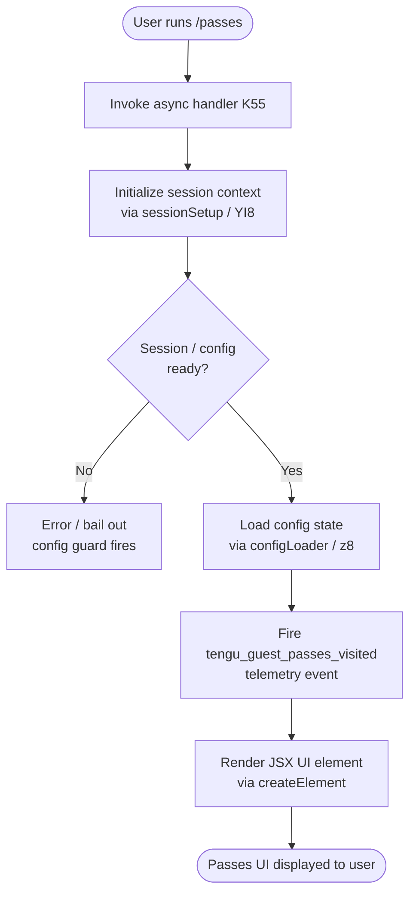

# `/passes`

> Analysis basis: CC v2.1.159 bundle.js (AST extraction + Claude interpretation)
> Minimum version: v2.1.159

---

## Overview

`/passes` is a referral-program command that allows the active user to share a free week of Claude Code with friends. When invoked, it triggers the guest-passes flow — an async handler (`K55`) that sets up the necessary session context, renders a JSX UI element, and fires a `tengu_guest_passes_visited` telemetry event. The command has no required arguments and is exposed as a top-level local-jsx command that renders interactive UI rather than producing plain text output.

---

## Registration

| Field | Value |
|---|---|
| type | `local-jsx` |
| name | `passes` |
| description | Share a free week of Claude Code with friends |
| loc_byte | `12154180` |
| loc_byte_end | `12154502` |
| loc_line | `8016` |
| isHidden | `null` (not hidden) |
| module_id | `ac1` |
| load_inline | `true` |
| arbor_handler.name | `K55` |
| arbor_handler.fqn | `claude-2.1.159::K55` |
| arbor_handler.kind | `AsyncFunction` |
| arbor_handler.resolution_path | `module_id` |
| arbor_handler.n_hits | `2` |

Analysis basis: CC v2.1.159 bundle.js:+12154180

---

## Input Branching

The command's top-level flow is relatively linear: there are no user-supplied arguments to branch on. The main handler (`K55`) does, however, compose several sub-systems that each have their own branching logic (config state, daemon/background session lifecycle, and UI rendering). The overall flow has three meaningful stages, represented below.



Analysis basis: CC v2.1.159 bundle.js:+12153863, +12153897, +12153903, +12154001, +12154003, +12154052

---

## Behavioral Spec

### Main Handler (K55)

The Arbor-resolved handler `K55` is an `AsyncFunction` reached via `module_id → ac1`. It orchestrates the full `/passes` command lifecycle.

```
async function guestPassesHandler(context):
    sessionSetup(context)                        // YI8 — initialise session layer
    configLoader(context)                        // z8  — load and validate config state
    recordVisit()                                // fires tengu_guest_passes_visited
    element = createElement(PassesUIComponent)  // a6A.createElement
    return element
```

Analysis basis: CC v2.1.159 bundle.js:+12153863 – +12154052

---

### Session Setup (YI8 / s4 / IY)

`YI8` sets up the session state required before any referral UI can be rendered. It calls `s4`, which in turn calls the session initialiser `IY`. `IY` orchestrates authentication profile resolution (`pP`), key/token validation (`UK`), and profile type routing (`F3`, `kO`, `Kz6`, `agH`).

```
function sessionSetup(context):
    sessionRoot = s4(context)           // entry into session subsystem
    IY(sessionRoot):
        authProfile = resolveProfile(pP, UK)
        if authProfile.type == "firstParty":
            kO → GA (first-party gate)
        elif authProfile.type == "apiKeyHelper":
            F3 → ... (api-key helper path)
        else:
            agH → ... (generic profile path)
    return sessionRoot
```

Authentication profile constants observed: `"profile-implicit"`, `"user_oauth"`, `"firstParty"`, `"apiKeyHelper"`, `"none"`, `"claude-desktop-3p"`.
Analysis basis: CC v2.1.159 bundle.js:+11788001, +2962349, +2943427, +2942042, +2046525, +2045359

---

### Config Loading (z8 / configLoader)

`z8` is the config-loading subsystem entered from the main handler. It reads and validates configuration state, applies locking semantics, and maps the raw config to a typed state record used by the UI layer.

```
function configLoader(context):
    raw = readConfigWithLock()           // tzH — locked file read
    if config not yet accessible:
        throw Error("Config accessed before allowed.")   // +3211001
    parsed = parseJSON(raw)              // U6 → JSON.parse
    state = mapConfigToState(parsed)     // produces status enum below
    return state
```

Config status values mapped by `z8` (from literals):

| Literal | Meaning |
|---|---|
| `"unknown"` | Status could not be determined |
| `"local"` | Locally configured |
| `"migrated"` | Configuration was migrated |
| `"native"` | Native installation |
| `"installed"` | Package installed |
| `"disabled"` | Feature disabled |
| `"enabled"` | Feature enabled |
| `"no_permissions"` | Insufficient permissions |
| `"not_configured"` | Not yet configured |
| `"global"` | Global configuration active |

Analysis basis: CC v2.1.159 bundle.js:+3206629 – +3206856, +3211001, +3211084

---

### Config Lock & Safe-Write Guard

The config subsystem (`tzH`, `YY_`) implements a safe-write protocol to prevent auth data loss. Lock contention is detected and telemetry is emitted if the lock takes longer than expected.

```
function lockedConfigWrite(newConfig, cachedConfig):
    acquireLock()
    reRead = readConfigFromDisk()
    if reRead is missing auth that cachedConfig has:
        emit("tengu_config_auth_loss_prevented")
        // Refuse to write — see GH #3117
        return
    if lockContentionDetected:
        emit("tengu_config_lock_contention")
        // warn: "Lock acquisition took longer than expected..."
    writeConfig(newConfig)
    releaseLock()
```

Analysis basis: CC v2.1.159 bundle.js:+3208968, +3209057, +3209193, +3209384, +3209536

---

### JSX Rendering

After telemetry is recorded, `K55` calls `a6A.createElement` to construct the Passes UI component. Because the command type is `local-jsx`, the returned element is rendered directly by the CLI's React-based UI layer — no agent turn or LLM call is involved.

```
function renderPassesUI():
    emit telemetry: "tengu_guest_passes_visited"
    element = createElement(PassesUIComponent, props)
    return element   // CLI renders this as interactive UI
```

Analysis basis: CC v2.1.159 bundle.js:+12154003, +12154052

---

### Background-Session / Daemon Layer (reached indirectly via h6 → w)

Although `/passes` itself is a UI command, the call graph traverses the background-session daemon subsystem (`w`, `ZfA`, `yfA`, `G6`, `D`) used by the broader session infrastructure. These functions manage spare daemon slots, IPC socket connections, and lifecycle state transitions.

Daemon session lifecycle states observed in literals:

| Literal | State |
|---|---|
| `"spare"` | Pre-warmed idle slot |
| `"working"` | Actively processing |
| `"active"` | Alive and connected |
| `"idle"` | Connected but not working |
| `"bg"` | Background session |
| `"daemon"` | Long-running daemon process |
| `"resuming"` | Re-attaching after pause |
| `"done"` | Session completed |
| `"killed"` | Terminated by signal |
| `"stopped"` | Gracefully stopped |
| `"failed"` | Error termination |
| `"crashed"` | Unexpected exit |
| `"blocked"` | Blocked waiting |

Background-session timeout constants:
- Idle check interval: 30 seconds (`loc_byte`: +15469448)
- Kill-escalation grace: 15 seconds (`loc_byte`: +15469459)
- Spare-session TTL: 300 000 ms / 5 minutes (`loc_byte`: +15476257)
- Reconnect retry delay: 2 000 ms (`loc_byte`: +15469119)

Analysis basis: CC v2.1.159 bundle.js:+15469448, +15469459, +15476257, +15469119

---

## State & Side Effects

| Item | Detail |
|---|---|
| Telemetry — `tengu_guest_passes_visited` | Fired on every invocation of `/passes` (bundle.js:+12154003) |
| Telemetry — `tengu_config_lock_contention` | Fired when config lock acquisition is slow (bundle.js:+3209057) |
| Telemetry — `tengu_config_stale_write` | Fired on attempted stale config write (bundle.js:+3209193) |
| Telemetry — `tengu_config_auth_loss_prevented` | Fired when safe-write guard blocks a write that would erase auth (bundle.js:+3209536) |
| Telemetry — `tengu_config_parse_error` | Fired if config JSON cannot be parsed (bundle.js:+3211632) |
| Telemetry — `tengu_bg_spare_enable` | Fired when a spare background session slot is enabled (bundle.js:+15470767) |
| Telemetry — `tengu_bg_spare_claim` | Fired when a spare slot is successfully claimed (bundle.js:+15470888) |
| Telemetry — `tengu_bg_spare_spawn` | Fired when a new spare slot is spawned (bundle.js:+15469186) |
| Telemetry — `tengu_bg_spare_claim_fail` | Fired when spare claim fails (bundle.js:+15471151) |
| Telemetry — `tengu_bg_dispatch_low_mem` | Fired on low-memory background dispatch (bundle.js:+15470072) |
| Telemetry — `tengu_bg_dispatch_sigkill_escalate` | Fired when SIGKILL is escalated to a bg session (bundle.js:+15469493) |
| Telemetry — `tengu_bg_sendclaim_failed` | Fired when send-claim IPC call fails (bundle.js:+15450222) |
| Telemetry — `tengu_bg_low_mem_mb` | Records free-memory reading on macOS (bundle.js:+12731249) |
| Telemetry — `tengu_feature_ok` | Fired on successful feature flag check (bundle.js:+966033) |
| Telemetry — `tengu_feature_bad` | Fired on failed feature flag check (bundle.js:+966091) |
| Hook registration | `K9 → zOA.register` — registers a watch/unwatch file hook (bundle.js:+58858) |
| appState changes | Config state updated through locked write path; auth-loss guard may prevent write (bundle.js:+3209536) |
| File I/O | Config read (`q.readFileSync`), write (`cM.writeFileSync`), backup rotation (`q.copyFileSync`, `YY_`, up to 5 backups — bundle.js:+3209987), directory creation (`q.mkdirSync`) |
| IPC / Daemon | Spare-session socket connected via `Tx8.connect`; SIGTERM/SIGKILL sent through daemon lifecycle manager (bundle.js:+15450460, +15469541) |
| Sound | None observed in depth-2 traversal |

---

## Version History

| Version | Change |
|---|---|
| v2.1.159 | Initial analysis |

---

## Common Mistakes

1. **Expecting text output** — `/passes` is a `local-jsx` command; it renders an interactive UI component, not plain text. Scripting or piping its output will not yield parseable content.
2. **Passing arguments** — the command takes no arguments. Any trailing tokens after `/passes` are ignored by the handler.
3. **Invoking without an authenticated session** — `K55` calls the session initialiser before rendering. If no valid auth credential (`ANTHROPIC_API_KEY`, `ANTHROPIC_AUTH_TOKEN`, `CLAUDE_CODE_OAUTH_TOKEN`, or WIF env vars) is present, the session setup will fail before the UI is ever shown.
4. **Assuming the pass is immediately issued** — the command opens the referral UI; the actual pass issuance depends on further user interaction within that UI.
5. **Confusing config-write failures with command failure** — if the safe-write guard fires (auth-loss prevention), the config write is silently skipped. The UI may still render, but the config state may be stale.

---

## Appendix — Identifier Mapping

> For bundle debugging only. Identifiers change across versions.

| Identifier | Role |
|---|---|
| `K55` | Main async handler for `/passes` (guestPassesHandler) |
| `h6` | Session file-watch setup helper |
| `g6` | General-purpose logging / debug utility |
| `fY_` | Session state accessor |
| `tzH` | Locked config file reader |
| `q` | Filesystem utilities (readFileSync, statSync, mkdirSync, etc.) |
| `U6` | JSON parser wrapper |
| `nb` | String prefix/slice normaliser |
| `H` | Random/timeout utility (Math.random, setTimeout) |
| `_` | Filesystem extended utilities (readdirStringSync, statSync, toUpperCase) |
| `w8` | State/flag writer |
| `UFq` | Backup directory scanner |
| `DY_` | Backup path builder (path.join) |
| `M` | Module/session registry entry manager |
| `$` | Path prefix checker (startsWith) |
| `N` | HTTP/API request builder |
| `tCK` | Request formatter (ik, sCK, DOA) |
| `RH` | JSON stringifier wrapper |
| `E4` | String/content sanitiser (redaction, replacement) |
| `vuH` | Content validator (CYA) |
| `_bK` | File write helper with byte-length check |
| `d` | Diagnostic / debug emitter |
| `w` | Background daemon session manager |
| `A` | Session/process map (get, set, values, toLowerCase) |
| `S` | Process kill helper (S.kill) |
| `bH` | Feature-bad reporter |
| `hH` | Feature-ok reporter |
| `Fy8` | macOS memory check helper |
| `Yw6` | Background session config reader |
| `SH` | Session log/error handler |
| `B` | Retired-session filter |
| `G6` | Session acquisition dispatcher |
| `ZfA` | IPC socket connector (send-claim) |
| `yfA` | Session lifecycle finaliser |
| `L` | Session set utilities (q.add, f.finally, q.delete) |
| `D` | Daemon restart / reconnect loop |
| `R` | Disposable resource holder |
| `l17` | File-watch lifecycle manager |
| `kr` | Watch callback handler |
| `K9` | Hook registrar (zOA.register) |
| `YI8` | Session setup entry point |
| `s4` | Session root initialiser |
| `IY` | Session authenticator / profile router |
| `UK` | Auth channel constructor |
| `pP` | Auth profile resolver |
| `kO` | First-party gate checker |
| `KX` | Key-exchange helper |
| `F3` | API-key-helper session builder |
| `Kz6` | Profile wrapper (agH) |
| `agH` | Generic auth profile handler |
| `z8` | Config state loader (configLoader) |
| `YY_` | Config write-with-backup orchestrator |
| `tOq` | Object-assign config merger |
| `$K_` | Config field setter (sOq) |
| `$Y6` | Config field reader |
| `V` | Config key prefix checker |
| `P` | MCP/transport connection manager |
| `zx8` | Transport type resolver |
| `F_` | Error/string wrapper utility |
| `E` | Backup list slicer |
| `CL6` | Atomic file writer (temp + rename + fsync) |
| `O` | Symbolic link checker |
| `P8` | Permission/flag checker |
| `f` | File descriptor / stream manager |
| `BQH` | Config bundle resolver |
| `pFq` | Object.entries iterator helper |
| `FQH` | Timestamp helper (Date.now) |
| `zY_` | Config path resolver (dirname + CL6) |

---

Note: index built via Arbor fallback; some signals (telemetry, literals) may be missing — see arbor-fallback.js.