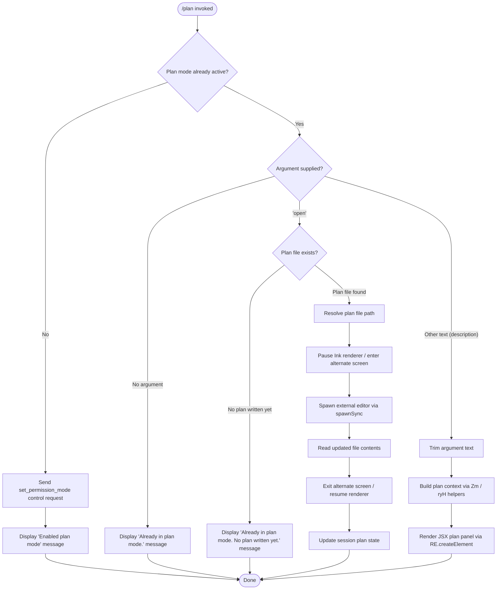

# `/plan`

> Analysis basis: CC v2.1.158 bundle.js (AST extraction + Claude interpretation)
> Minimum version: v2.1.158

---

## Overview

The `/plan` command enables **plan mode** for the current Claude Code session, or opens the existing session plan document for review. When plan mode is not yet active, the command sends a `set_permission_mode` control request to restrict the agent to read-only/planning behaviour; when plan mode is already active, it optionally opens the plan file in an external editor or reports the current plan state.

---

## Registration

| Field | Value |
|---|---|
| type | `local-jsx` |
| name | `plan` |
| description | Enable plan mode or view the current session plan |
| argumentHint | `[open\|<description>]` |
| module_id | `kc1` |
| load_inline | `true` |
| loc_byte | `12140792` |
| loc_byte_end | `12140991` |
| loc_line | `8016` |
| arbor_handler.name | `BL5` |
| arbor_handler.fqn | `claude-2.1.158::BL5` |
| arbor_handler.kind | `AsyncFunction` |
| arbor_handler.resolution_path | `module_id` |
| arbor_handler.n_hits | `0` |

Analysis basis: CC v2.1.158 bundle.js:+12140792

---

## Input Branching

Four distinct top-level branches exist based on the current plan-mode state and the argument supplied by the user.



Analysis basis: CC v2.1.158 bundle.js:+12139874 (control request), +12139942 (enabled message), +12139970 (already-active message), +12140191 (open branch), +12140350 (no-plan-yet message), +12140301 (open-file branch entry)

---

## Behavioral Spec

### 1. Handler Entry Point (`BL5` — `planCommandHandler`)

The async handler `BL5` is the resolved entry point for the `/plan` command (Arbor resolution via `module_id`).

```
async function planCommandHandler(context):
    currentMode = readCurrentPermissionMode(context)

    if currentMode is NOT plan/read-only:
        sendControlRequest(context, "set_permission_mode", planModePayload)
        displayMessage("Enabled plan mode")
        return

    argument = trimWhitespace(context.rawArgument)

    if argument is empty:
        displayMessage("Already in plan mode.")
        return

    if argument == "open":
        planFilePath = resolvePlanFilePath(context)
        if planFilePath is null or missing:
            displayMessage("Already in plan mode. No plan written yet.")
            return
        openPlanInEditor(context, planFilePath)
        return

    // argument is a free-text description
    planContext = buildPlanContext(context, argument)
    renderPlanPanel(planContext)
```

Analysis basis: CC v2.1.158 bundle.js:+12139874, +12139940, +12139970, +12140172, +12140191, +12140254, +12140301

---

### 2. Plan Mode Activation (`q` — `clearPlanStateFile`, `V$` — `readPermissionMode`, `nt` — `getPlanModeFlag`)

Before sending the control request, the handler checks whether plan mode is already active using a permission-mode reader and a plan-mode flag accessor.

```
function readCurrentPermissionMode(context):
    rawMode = permissionModeAccessor(context)       // V$  →  f0H
    return rawMode

function clearPlanStateFile(targetPath):            // q   →  WVK.unlinkSync
    filesystem.unlinkSync(targetPath)
```

The `set_permission_mode` control request is dispatched via `M.sendControlRequest` to switch the agent into plan (read-only) mode.

Analysis basis: CC v2.1.158 bundle.js:+12139666 (`q`), +12139699 (`V$`), +12139738 (`nt`), +12139874 (`M.sendControlRequest`), +12139904 (`"set_permission_mode"` literal)

---

### 3. Permission-Mode State Management (`_$` — `updatePermissionMode`)

The `_$` function handles the `setMode` control message that arrives after a mode change request. It guards against enabling `bypassPermissions` when the feature is disabled or the session was not started in that mode.

```
function updatePermissionMode(modeRequest, appState):
    if modeRequest.mode == "bypassPermissions":
        if bypassPermissionsUnavailable(appState):
            logWarning("Ignoring permission update: setMode 'bypassPermissions' rejected ...")
            return

    applyModeRules(modeRequest, appState)
    // Processes: addRules, replaceRules, removeRules,
    //            addDirectories, removeDirectories,
    //            alwaysAllowRules, alwaysDenyRules, alwaysAskRules
    updateAppStatePermissions(appState, newRules)
```

> Maximum ignore-warning string length observed: 170 characters (bundle.js:+4667212)

Analysis basis: CC v2.1.158 bundle.js:+4667124 (`"setMode"`), +4667146 (`"bypassPermissions"`), +4667212 (warning literal), +4667488 (`"addRules"`), +4667673 (`"allow"`), +4667836 (`"replaceRules"`), +4668147 (`"addDirectories"`), +4668493 (`"removeRules"`), +4668877 (`"removeDirectories"`)

---

### 4. Open Plan File in External Editor (`ZE` — `openPlanFileInEditor`, `EF` — `spawnEditorProcess`)

When the user passes `open` as the argument and a plan file exists, the handler suspends the Ink TUI renderer, spawns the configured external editor, then resumes.

```
async function openPlanFileInEditor(context, planFilePath):
    editorCmd = resolveEditorCommand(context)       // TE  →  sXH  reads config/env
    if editorCmd is null:
        reportError("editor not configured")        // SH  →  Vi.logError
        return

    inkInstance = getInkInstance()                  // N_6 →  I6 / cMH
    inkInstance.pause()                             // EF  →  A.pause
    inkInstance.suspendStdin()                      // EF  →  A.suspendStdin
    inkInstance.enterAlternateScreen()              // EF  →  A.enterAlternateScreen

    args = buildEditorArgs(editorCmd, planFilePath) // EF  →  L.split / f.slice
    result = child_process.spawnSync(               // EF  →  NS1.spawnSync
        editorCmd, args,
        { stdio: "inherit" }
    )

    updatedContent = fs.readFileSync(planFilePath, "utf-8")  // EF + literal +12941419

    inkInstance.exitAlternateScreen()               // EF  →  A.exitAlternateScreen
    inkInstance.resumeStdin()                       // EF  →  A.resumeStdin
    inkInstance.resume()                            // EF  →  A.resume

    updateSessionPlanState(updatedContent)
```

Analysis basis: CC v2.1.158 bundle.js:+12140254 (`N_6`), +12140301 (`ZE`), +12140308 (`TE`), +12140451 (`EF`), +11285365, +11285395, +11285405, +11285487, +11285789, +11285867, +11285896, +11285912, +12941419 (`"utf-8"`)

---

### 5. Editor Resolution (`TE` / `sXH` — `resolveEditorCommand`)

The editor command is resolved from session configuration and environment, with path sanitisation applied.

```
function resolveEditorCommand(context):
    configuredEditor = configStore.get(editorConfigKey)    // sXH  →  q.get
    if configuredEditor is null:
        return null
    sanitised = stripAnsiEscapes(configuredEditor)         // nz_  →  H.replace
    parts = splitByDelimiter(sanitised)                    // sXH  →  dF.join
    storeNormalisedCommand(parts)                          // sXH  →  q.set
    return parts
```

Analysis basis: CC v2.1.158 bundle.js:+12941262 (`sXH`), +12941372 (`TE`), +12941389, +12941441

---

### 6. Plan Context Construction (`ryH` — `buildPlanDisplayContext`, `Zm` — `collectPlanEntries`, `i5H` — `mapPermissionEntries`)

When a free-text description is supplied, the handler builds a rich plan context object for JSX rendering.

```
function buildPlanDisplayContext(context, description):
    toolEntries   = mapPermissionEntries(context)          // i5H  →  Object.entries + _$
    planEntries   = collectPlanEntries(context, toolEntries) // Zm  →  aO / bi_ / ZT1
    telemetryCtx  = getSessionInfo(context)                // uS
    return { description, planEntries, telemetryCtx }

function collectPlanEntries(context, toolEntries):
    results = []
    for each [key, value] in Object.entries(toolEntries):
        formatted = formatEntry(key, value)                // aO  →  I14 / vZ / k14
        results.push(formatted)
        if hasPlanFile(key):                               // bi_  →  sSH
            attachedFiles = resolveAttachedFiles(key)      // bi_  →  Ci_
    return results
```

Analysis basis: CC v2.1.158 bundle.js:+12139787 (`_$`), +12139790 (`ryH`), +10421198 (`uS`), +10421209 (`i5H`), +10421303 (`Zm`), +10411702, +10411775, +10411840, +10412163

---

### 7. JSX Rendering (`Pi9` — `renderPlanOutput`, `qsH` — `buildPlanComponent`)

The plan panel is rendered as a JSX component using Ink.

```
function renderPlanOutput(planContext):
    component = buildPlanComponent(planContext)     // qsH  →  g_H.createElement
    stripOutput = stripAnsiFromOutput              // P4   →  Bun.stripANSI
    return RE.createElement(component, planContext)

function buildPlanComponent(planContext):
    stream = attachDataListener(planContext)       // qsH  →  K.on("data", ...)
    raw    = stream.toString()                     // qsH  →  f.toString
    return renderInkElement(raw)                   // bU   →  NJ_ / v4H
```

Analysis basis: CC v2.1.158 bundle.js:+12140565 (`Pi9`), +12140569 (`RE.createElement`), +7832509 (`qsH`), +7832362 (`g_H.createElement`), +3771890 (`P4` / `Bun.stripANSI`)

---

### 8. Conversation Log / Session Persistence (`rCK` — `persistSessionLog`, `iCK` — `appendSessionChunk`)

The session transcript is persisted incrementally. Buffer byte-length is tracked before each append, and file rotation is performed when needed.

```
function persistSessionLog(logDir, chunk):
    chunkBytes = Buffer.byteLength(chunk)          // rCK  →  Buffer.byteLength
    logPath    = buildLogPath(logDir)              // rCK  →  lYA / N0H.join
    if logPath does not exist:
        fs.mkdir(logDir, { recursive: true })      // iCK  →  Qk.mkdir
    fs.appendFile(logPath, chunk)                  // iCK  →  Qk.appendFile
    if rotationNeeded:
        rotateLogs(logPath)                        // cYA  →  Qk.rename / Qk.unlink
    notifySubscribers()                            // q9   →  qOA.register
```

Analysis basis: CC v2.1.158 bundle.js:+203865 (`Buffer.byteLength`), +203863 (`rCK`), +203417 (`iCK`), +203476, +203563, +203017 (`cYA`)

---

## State & Side Effects

| Item | Detail |
|---|---|
| Telemetry | None detected in depth-2 traversal (`telemetry: []`) |
| Control request | `set_permission_mode` sent via `M.sendControlRequest` when plan mode is not yet active (bundle.js:+12139874) |
| Permission mode state | `_$` (`updatePermissionMode`) mutates `alwaysAllowRules`, `alwaysDenyRules`, `alwaysAskRules`, `addRules`, `replaceRules`, `removeRules`, `addDirectories`, `removeDirectories` in app state (bundle.js:+4667488–4668877) |
| Session log | `rCK` / `iCK` append session transcript chunks to disk; `cYA` performs log rotation via `Qk.rename` / `Qk.unlink` (bundle.js:+203726–203904) |
| Hook registration | `q9` calls `qOA.register` after log write (bundle.js:+204026) |
| Ink TUI renderer | Paused and resumed around external editor spawn via `A.pause` / `A.suspendStdin` / `A.enterAlternateScreen` → `A.exitAlternateScreen` / `A.resumeStdin` / `A.resume` (bundle.js:+11285365–11285912) |
| External editor | `NS1.spawnSync` with `stdio: "inherit"` (bundle.js:+11285487, +11285519) |
| File read after editor | `_.readFileSync` with encoding `"utf-8"` (bundle.js:+11285789, +12941419) |
| `bypassPermissions` guard | Mode change silently rejected with a logged warning when `disableBypassPermissionsMode` is set or session was not started in that mode (bundle.js:+4667212) |

---

## Version History

| Version | Change |
|---|---|
| v2.1.158 | Initial analysis |

---

## Common Mistakes

1. **Passing `open` before plan mode is enabled** — The `open` sub-command is only meaningful once plan mode is active. If plan mode is not yet enabled, invoking `/plan open` will first enable plan mode (not open an editor), because the handler checks mode status before inspecting the argument.

2. **Expecting an editor to open when no plan has been written yet** — If plan mode is active but the agent has not yet written a plan file, `/plan open` displays the message `"Already in plan mode. No plan written yet."` rather than launching an editor. A plan document must exist on disk first.

3. **Assuming `bypassPermissions` is always available** — The `setMode bypassPermissions` request is silently rejected (with a warning log) if `disableBypassPermissionsMode` is set or the session was not originally launched in bypass-permissions mode. No error is surfaced to the user.

4. **Providing a free-text description expecting it to set the plan title** — Passing any text other than `open` causes the handler to build a plan display context and render a JSX panel; it does not store the text as a plan title or persist it to disk in the same call.

5. **Relying on telemetry events for observability** — No `tengu_*` telemetry events are fired by this command at depth-2 traversal. External monitoring should use the control-request channel or session log hooks instead.

---

## Appendix — Identifier Mapping

> For bundle debugging only. Identifiers change across versions.

| Identifier | Role |
|---|---|
| `BL5` | `planCommandHandler` — async top-level handler for `/plan` |
| `q` | `clearPlanStateFile` — unlinks plan state file via `WVK.unlinkSync` |
| `V$` | `readPermissionMode` — reads current permission/plan mode; calls `f0H` |
| `f0H` | Permission mode store accessor (called by `V$`) |
| `nt` | `getPlanModeFlag` — retrieves plan-mode active flag |
| `K` | `formatConnectionList` — maps connection entries, calls `f.padEnd` with width 40 |
| `L` | `connectionSetManager` — manages a set of connections (`q.add`, `q.delete`, `f.finally`) |
| `f` | `connectionEntry` — individual connection; calls `A.close` / `q.close` / `L` |
| `A` | Generic string/connection object (context-dependent); calls `f.toLowerCase` |
| `_$` | `updatePermissionMode` — applies `setMode` control messages to app state |
| `N` | `sendTelemetryEvent` — dispatches telemetry via `jK6` / `lCK`; calls `RH`, `v4`, `gS`, `EuH`, `rCK` |
| `lCK` | `telemetryTransport` — routes telemetry to `dk` / `cCK` / `LOA` |
| `LOA` | `telemetryBatcher` — batches events via `lhK` / `nhK` |
| `H` | Generic context/string variable (context-dependent across call sites) |
| `RH` | `jsonStringifyHelper` — wraps `JSON.stringify` |
| `_` | Generic utility / fs module reference (context-dependent) |
| `v4` | `uuidV4Generator` — generates UUID v4 via `pYA` and string manipulation |
| `pYA` | `uuidByteMapper` — maps byte array for UUID via `BCK.map` |
| `EuH` | `telemetryWriter` — writes telemetry via `NYA` |
| `NYA` | `streamWriter` — writes to output stream via `H.write` |
| `rCK` | `persistSessionLog` — manages session transcript persistence |
| `rxH` | `chunkBatcher` — batches log chunks with `setTimeout` / `setImmediate` |
| `M$H` | `logRotationManager` — handles log rotation paths via `gYA` / `N0H.join` / `F8` / `I6` |
| `g6` | `getConfigValue` — retrieves configuration values |
| `KK6` | `fileIntegrityChecker` — checks file integrity via `J8` |
| `lYA` | `buildLogPath` — constructs log file path via `N0H.join` / `I6` |
| `cYA` | `rotateLogs` — renames/unlinks log files via `Qk.stat` / `Qk.rename` / `Qk.unlink` |
| `iCK` | `appendSessionChunk` — creates dir and appends chunk via `Qk.mkdir` / `Qk.appendFile` |
| `q9` | `registerLogHook` — registers log hook via `qOA.register` |
| `vM` | `escapeMarkdownPath` — escapes backslashes and parentheses via `v14` |
| `v14` | `replaceAllHelper` — performs `H.replaceAll` for path escaping |
| `ryH` | `buildPlanDisplayContext` — builds rich plan context for JSX rendering |
| `gi_` | `planContextInitialiser` — initialises plan context via `OQ` / `UT` / `Ra8` |
| `OQ` | `sessionContextAccessor` — accesses current session context |
| `UT` | `modelCapabilityResolver` — resolves model capabilities via `mi_` / `lgH` / `J9` |
| `mi_` | `extendedThinkingChecker` — checks extended-thinking support via `XA` |
| `lgH` | `modelFamilyClassifier` — classifies model family; checks for `claude-3-`, `claude-opus-4-*`, `claude-sonnet-4-*`, `claude-haiku-4-5` strings |
| `J9` | `modelProviderResolver` — resolves provider via `se` / `_1` / `PX` |
| `Ra8` | `settingsLayerReader` — reads `policySettings` / `flagSettings` / `userSettings` / `localSettings` via `y8` |
| `y8` | `settingsAccessor` — accesses settings store via `kg6` / `$Q` |
| `uS` | `getSessionMetadata` — retrieves session metadata |
| `i5H` | `mapPermissionEntries` — maps permission entries via `Object.entries` / `_$` / `K.map` |
| `Zm` | `collectPlanEntries` — iterates tool entries, formats and collects plan items |
| `aO` | `formatPlanEntry` — formats individual plan entry via `I14` / `vZ` / `k14` / `N14` |
| `I14` | `entryHeaderFormatter` — formats entry header text |
| `vZ` | `hasOwnPropertyChecker` — wraps `Object.hasOwn` |
| `k14` | `entryValueFormatter` — formats entry value for display |
| `N14` | `substringReplacer` — performs `H.replaceAll` for entry text cleanup |
| `bi_` | `planFileAttacher` — checks for plan file and resolves attached files via `sSH` / `Ci_` |
| `sSH` | `planFileCacheAccessor` — gets/sets plan file cache via `aG1.get` / `aG1.set` / `Zi_` / `Ei_` / `Vi_` |
| `Ci_` | `resolveAttachedFiles` — resolves relative file paths via `PT1.relative` / `ZO` / `h6` |
| `ZT1` | `toolSessionMapper` — maps tools to session entries via `tgL` / `q.get` / `q.set` / `_$` |
| `tgL` | `sessionEntryFilter` — filters session-scoped tool entries via `eS.includes` |
| `M` | `tempFileManager` — manages temp files via `nS6` / `f.has` / `q0.rm` |
| `N_6` | `getInkInstance` — retrieves Ink renderer instance via `cMH` / `I6` |
| `cMH` | `inkInstanceStore` — stores Ink renderer instances |
| `I6` | `configPathResolver` — resolves config paths via `qN` |
| `qN` | `pathNormaliser` — normalises file system paths |
| `ZE` | `openPlanFileInEditor` — orchestrates file-open flow via `TE` / `g6` / `P8` / `SH` |
| `TE` | `resolveEditorCommand` — resolves editor command from config via `sXH` / `I6` / `dF.join` / `HY` |
| `sXH` | `editorConfigReader` — reads editor config, sanitises via `nz_` / `CQH` / `f_8` |
| `nz_` | `stripAnsiEscapeSequences` — removes ANSI escape codes via `H.replace` |
| `CQH` | `ansiColorStripper` — strips ANSI colour codes via `ez6` |
| `f_8` | `ansiStyleStripper` — strips ANSI style codes via `ez6` |
| `P8` | `fileExistenceChecker` — checks file existence via `J8` |
| `J8` | `fsStatWrapper` — wraps filesystem stat operations |
| `SH` | `editorErrorReporter` — reports editor errors via `F_` / `CH` / `L1` / `G_4` / `Vi.logError` |
| `F_` | `errorConstructor` — constructs `Error` from `String` coercion |
| `CH` | `stringCoercer` — wraps `String(...)` |
| `L1` | `networkPolicyApplier` — applies `essential-traffic` / `no-telemetry` / `default` network policy via `$VA` |
| `$VA` | `networkPolicyMapper` — maps policy names to config values via `CH` |
| `G_4` | `errorQueueManager` — manages error queue via `gB6.shift` / `gB6.push` |
| `EF` | `spawnEditorProcess` — suspends TUI, spawns editor via `NS1.spawnSync`, resumes TUI |
| `Nm` | `editorCommandBuilder` — builds editor command args via `FD` / `veL` |
| `FD` | `editorArgFormatter` — formats editor arguments |
| `IeL` | `editorFilePathResolver` — resolves file path for editor via `Is_` |
| `Is_` | `fileTypeDetector` — detects file type via `xv8.basename` / `L9` / `TeL.find` |
| `L9` | `extensionExtractor` — extracts file extension via `H.indexOf` / `H.slice` |
| `mX` | `editorNameNormaliser` — normalises editor name via `H.toLowerCase` / `II.basename` / `aNH` |
| `Pi9` | `renderPlanOutput` — renders plan JSX output via `qsH` / `P4` |
| `qsH` | `buildPlanComponent` — builds Ink/JSX plan component via `K.on` / `g_H.createElement` / `bU` |
| `bU` | `inkOutputRenderer` — renders Ink output via `wJ_` / `NJ_` / `v4H` |
| `NJ_` | `createReactElement` — wraps `qsq.createElement` |
| `v4H` | `inkStyleApplier` — applies Ink styles via `CH` / `AcH` |
| `P4` | `ansiStripper` — strips ANSI from plan output via `Bun.stripANSI` |

---

Note: index built via Arbor fallback; some signals (telemetry, literals) may be missing — see arbor-fallback.js.