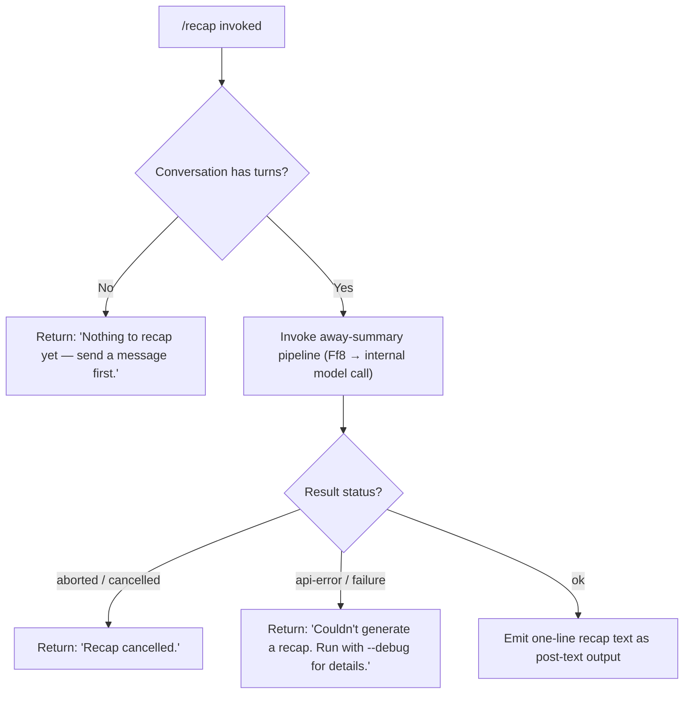

# `/recap`

> Analysis basis: CC v2.1.159 bundle.js (AST extraction + Claude interpretation)
> Minimum version: v2.1.159

---

## Overview

The `/recap` command triggers an on-demand, single-line summary of the current Claude Code session. It invokes the same away-summary pipeline used for automatic background recaps, then emits the result as a post-text message. If no conversation turns exist yet, or if the underlying model call fails or is cancelled, the command returns an appropriate short error message rather than producing a recap.

---

## Registration

| Field | Value |
|---|---|
| type | `local` |
| name | `recap` |
| description | `Generate a one-line session recap now` |
| loc_byte | `12676974` |
| loc_byte_end | `12677190` |
| loc_line | `8798` |
| supportsNonInteractive | `false` |
| thinClientDispatch | `post-text` |
| load_inline | `true` |
| load_ident | `ID5` |
| arbor_handler.name | `ID5` |
| arbor_handler.fqn | `claude-2.1.159::ID5` |
| arbor_handler.kind | `AsyncFunction` |
| arbor_handler.resolution_path | `load_ident` |
| arbor_handler.n_hits | `0` |

Analysis basis: CC v2.1.159 bundle.js:+12676974

---

## Input Branching

The handler presents four distinct outcome branches based on session state and the result of the model call.



Analysis basis: CC v2.1.159 bundle.js:+12676724, +12676816, +12676874, +5390522, +5390580, +5391040, +5391129, +5391190

---

## Behavioral Spec

### Top-level handler (`ID5`)

The handler is an `AsyncFunction` loaded via the `load_ident` shape (`Promise.resolve({call: ID5})`). It is the command's sole entry point.

```
async function recapHandler(context):
    turns = getConversationTurns(context)

    if turns is empty:
        return postText("Nothing to recap yet — send a message first.")

    result = await invokeAwaySummaryPipeline(context)

    switch result.status:
        case "aborted":
        case "no-turn":
            return postText("Recap cancelled.")

        case "api-error":
        case failure sentinel:
            return postText("Couldn't generate a recap. Run with --debug for details.")

        case "ok":
            return postText(result.summaryLine)
```

Analysis basis: CC v2.1.159 bundle.js:+12676582, +12676724, +12676816, +12676874, +5391190

---

### Away-summary pipeline (`awaySummaryDispatcher` — Ff8)

`awaySummaryDispatcher` is the shared helper that powers both automatic away-summaries and the explicit `/recap` command. It is called directly by `ID5`.

```
async function awaySummaryDispatcher(context, abortSignal):
    params = loadCacheSafeParams(context)   // b8H

    if params is null:
        log.debug("[awaySummary] no CacheSafeParams saved, skipping")
        return { status: "no-turn" }

    // Register abort listener so an in-flight recap can be cancelled
    abortSignal.addEventListener("abort", () => {
        internalAbortController.abort("abort")
    })

    // Launch the model turn via the main query loop (F0 → t08 → klL)
    turnResult = await runTurn(params, context)

    // Inspect any api-error or tool-deny outcomes
    deniedTools = findDeniedToolResults(turnResult)   // q.find → jP9

    if deniedTools contains "deny":
        log.warn("Away summary cannot use tools")

    switch turnResult.termination:
        case "aborted":   return { status: "aborted" }
        case "api-error": return { status: "api-error" }
        case "ok":        return { status: "ok", summaryLine: extractSummaryLine(turnResult) }
```

Analysis basis: CC v2.1.159 bundle.js:+5390501, +5390520, +5390522, +5390617, +5390636, +5390695, +5390813, +5390828, +5390881, +5390896, +5391057, +5391146

---

### Session-state guard (`sessionStateChecker` — N)

`N` is a shared helper called from multiple code paths to read, normalise, and write back the current session summary state. For `/recap`, it is invoked by `awaySummaryDispatcher` to confirm that at least one turn exists.

```
function sessionStateChecker(state):
    level = resolveDebugLevel(state)         // PK6, tCK
    label = state.label.toUpperCase()
    trimmed = state.text.trim()

    if trimmed is empty:
        return null

    filePath = buildFilePath(state, trimmed) // E4 — uses lastIndexOf, slice
    writeStateFile(filePath, trimmed)        // vuH → CYA → H.write
    scheduleRotation(filePath)               // _bK
    return filePath
```

Analysis basis: CC v2.1.159 bundle.js:+204175, +204193, +204215, +204233, +204277, +204297, +204300, +204316, +204322, +204336, +204151

---

### Transcript rotation / log flushing (`transcriptRotator` — `_bK`)

When a summary is written, `_bK` manages the on-disk recap log: it checks size, rotates if needed, and appends the new content.

```
async function transcriptRotator(filePath, content):
    dir = path.dirname(filePath)             // y0H.dirname

    ensureDirectory(dir)                     // ik
    byteLen = Buffer.byteLength(content)

    existingSize = await statFile(filePath)  // sYA → nk.stat
    if existingSize + byteLen > rotationThreshold:
        await rotateFile(filePath)           // sYA → nk.rename / nk.unlink

    await appendContent(filePath, content)   // HbK → nk.appendFile
    registerCompletionCallback(filePath)     // K9 → zOA.register
```

Analysis basis: CC v2.1.159 bundle.js:+203663, +203688, +203696, +203726, +203816, +203833, +203865, +203871, +203904, +203921, +203930, +204026

---

### Query / model-call loop (`queryLoop` — `klL`)

`klL` is the main agentic query loop reached transitively through `F0 → t08 → wm → klL`. For `/recap` the loop runs a constrained single-turn call with tools denied (the `"Away summary cannot use tools"` guard fires if any tool use is attempted).

Key lifecycle markers emitted by `klL` (as string constants observed in literals):

| Phase label | Value |
|---|---|
| Loop thread identifier | `repl_main_thread` |
| Stream request marker | `stream_request_start` |
| Query entry point | `query_fn_entry` |
| Query started | `query_started` |
| API streaming begins | `query_api_streaming_start` |
| API streaming ends | `query_api_streaming_end` |
| Tool execution begins | `query_tool_execution_start` |
| Tool execution ends | `query_tool_execution_end` |
| Setup start | `query_setup_start` |
| Setup end | `query_setup_end` |
| Autocompact start | `query_autocompact_start` |
| Autocompact end | `query_autocompact_end` |

Analysis basis: CC v2.1.159 bundle.js:+10636630, +10638028, +10638055, +10638087, +10641901, +10641995, +10640848, +10641044, +10638618, +10638912, +10654165, +10654771

---

### Output token recovery (inline within `klL`)

If the model hits its output token limit mid-recap, the loop injects a recovery continuation message:

- First fragment: begins with `"Output token limit hit. Resume directly — no apology, no recap of what you were doing. "` (bundle.js:+10651209)
- Second fragment: `"Pick up mid-thought if that is where the cut happened. Break remaining work into smaller pieces."` (bundle.js:+10651304)

This mechanism is tagged internally as `max_output_tokens_recovery` (bundle.js:+10651697).

---

## State & Side Effects

| Item | Detail |
|---|---|
| Telemetry — query errors | `tengu_query_error` (bundle.js:+10647914) |
| Telemetry — refusal fallback | `tengu_refusal_fallback_triggered` (bundle.js:+10643984) |
| Telemetry — model fallback | `tengu_model_fallback_triggered` (bundle.js:+10647250) |
| Telemetry — malformed tool use | `tengu_malformed_tool_use_response` (bundle.js:+10651906) |
| Telemetry — autocompact rapid-refill breaker | `tengu_auto_compact_rapid_refill_breaker` (bundle.js:+10638942) |
| Telemetry — autocompact succeeded | `tengu_auto_compact_succeeded` (bundle.js:+10639403) |
| Telemetry — PTL surfaced | `tengu_ptl_surfaced_to_user` (bundle.js:+10641370) |
| Telemetry — stop hook block | `tengu_stop_hook_block_count` (bundle.js:+10652860) |
| Telemetry — orphaned messages | `tengu_orphaned_messages_tombstoned` (bundle.js:+10644539) |
| Telemetry — keyword detected | `tengu_model_response_keyword_detected` (bundle.js:+10648558) |
| Telemetry — fork agent query | `tengu_fork_agent_query` (bundle.js:+10680653) |
| Telemetry — feature ok/bad | `tengu_feature_ok` / `tengu_feature_bad` (bundle.js:+966033, +966091) |
| Disk side-effect | Recap text appended to session log file via `nk.appendFile`; log rotated when byte limit is reached (bundle.js:+203476) |
| appState changes | `H.getAppState` / `H.setAppState` called during query turn (bundle.js:+10676189, +10676969); `G.getAppState` / `G.setAppState` called inside `klL` (bundle.js:+10640908, +10643648) |
| Abort / abort signal | `AbortController` created by `Ff8`; `abort` event listener attached (bundle.js:+5390617, +5390648) |
| Hook registration | `K9 → zOA.register` called after log append (bundle.js:+58858) |
| Sound | None detected in depth-2 traversal |
| Non-interactive support | `supportsNonInteractive: false` — command is interactive-only |
| Dispatch mode | `thinClientDispatch: "post-text"` — output returned as plain text |

---

## Version History

| Version | Change |
|---|---|
| v2.1.159 | Initial analysis |

---

## Common Mistakes

1. **Running `/recap` before any conversation turn** — the command immediately returns `"Nothing to recap yet — send a message first."` and does not invoke the model. You must send at least one message first.
2. **Expecting `/recap` in non-interactive mode** — `supportsNonInteractive` is `false`; attempting to invoke this command in a headless or `--no-interactive` session will not work as expected.
3. **Assuming rich multi-sentence output** — the command is designed to produce a single-line summary. The `"one-line"` constraint is in the command description itself; do not expect a detailed breakdown.
4. **Cancelling during the model call** — if the user or an external signal aborts while the model is generating, the command returns `"Recap cancelled."` rather than a partial summary.
5. **Interpreting a debug-hint failure message as a bug** — `"Couldn't generate a recap. Run with --debug for details."` means an API-level or transport-level error occurred; re-run with `--debug` to obtain the underlying error before filing a bug report.

---

## Appendix — Identifier Mapping

> For bundle debugging only. Identifiers change across versions.

| Identifier | Role |
|---|---|
| `ID5` | Top-level `/recap` async handler (Arbor-resolved entry point) |
| `Ff8` | Away-summary pipeline dispatcher (shared with automatic away-summaries) |
| `b8H` | Cache-safe params loader for away-summary |
| `N` | Session-state reader / normaliser / writer |
| `tCK` | Debug-level resolver helper |
| `DOA` | Sub-helper within debug-level resolution |
| `H` | General-purpose context / state accessor (overloaded across many call sites) |
| `RH` | JSON-stringify wrapper |
| `_` | String / array generic utility |
| `E4` | File-path builder (uses `lastIndexOf`, `slice`) |
| `cYA` | Turn-list mapper used in path construction |
| `q` | File-system utility (includes `unlinkSync`) |
| `A` | String normaliser (uses `toLowerCase`) |
| `vuH` | State-file writer coordinator |
| `CYA` | Low-level file write helper (`H.write`) |
| `_bK` | Transcript rotation / log-append coordinator |
| `axH` | Timer-based debounce / flush helper (`clearTimeout`, `setTimeout`, `setImmediate`) |
| `M$H` | Path-join and I/O helper called during rotation |
| `g6` | Unknown helper called during rotation setup |
| `MK6` | File-system error classifier (checks `EISDIR` — bundle.js:+174173) |
| `tYA` | Path-join + I/O helper (calls `y0H.join`, `I6`) |
| `sYA` | File-stat and rename/unlink helper for rotation |
| `HbK` | Directory-create and append-file executor |
| `K9` | Completion-callback registrar (`zOA.register`) |
| `F0` | Outer turn orchestrator (calls `Date.now`, `t08`, `N`, etc.) |
| `t08` | Inner turn executor (manages `appState`, `callModel`, UUID generation) |
| `fh` | Abort-controller factory / model-call initiator |
| `w7H` | State-load/dump helper |
| `ADH` | Auxiliary state helper within turn |
| `nf9` | Unknown sub-helper within `t08` |
| `f` | Stream-close helper (`A.close`, `q.close`) |
| `VE8` | Unknown helper within `t08` |
| `Gh` | Random-bytes generator (`Fy9.randomBytes`, 8 bytes, hex) |
| `e08` | Unknown helper called from `F0` |
| `GAH` | Agent/model selector coordinator |
| `m4` | Model registry lookup |
| `xSH` | Tool/model filter (filters by `"ant"` prefix) |
| `wm` | Turn-wrapper calling `klL` and `eM8` |
| `klL` | Main agentic query / model-call loop |
| `eM8` | Subagent-exit / ready-state handler |
| `hH` | Turn-success telemetry helper (`tengu_feature_ok`) |
| `bH` | Turn-failure telemetry helper (`tengu_feature_bad`) |
| `pv6` | Feature-flag / tool-use-summary check (`WQL.has`) |
| `cAH` | Unknown helper called from `F0` |
| `$V8` | Unknown helper called from `F0` |
| `BT1` | Feature-flag check wrapper (calls `pv6`) |
| `D` | Message-queue / process-pool manager |
| `G6` | Process-pool slot allocator |
| `$` | Disposable resource wrapper |
| `Fy8` | macOS-specific low-memory handler |
| `TfA` | Daemon background-spare spawner |
| `d` | Low-level async utility |
| `Iz` | Unknown helper within `D` |
| `w8` | File-system error handler |
| `SH` | Error-push / log-error coordinator |
| `o7H` | Tool-filter / in-progress tracker |
| `Ej` | Unknown helper within `o7H` |
| `vr7` | Tool-find helper (`H.find`) |
| `L` | Promise-lifecycle tracker (add/delete/finally) |
| `UlL` | Forked-agent query helper |
| `E8` | Streaming-turn initiator (uses `vv.randomUUID`) |
| `X` | Byte-stream processor / IPC framer |
| `J` | Stream buffer |
| `w` | Worker/process lifecycle manager |
| `Ff` | Stream-end / JSON-reply helper |
| `oB5` | PTY / terminal-session multiplexer (large function) |
| `EH` | String-coercion helper |
| `jP9` | Tool-result flat-mapper (scans for `"deny"` / `"away_summary"`) |

---

Note: index built via Arbor fallback; some signals (telemetry, literals) may be missing — see arbor-fallback.js.