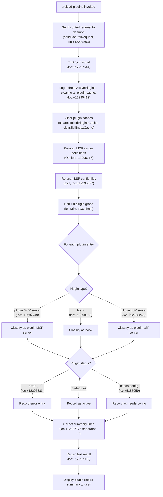

# `/reload-plugins`

> Analysis basis: CC v2.1.159 bundle.js (AST extraction + Claude interpretation)
> Minimum version: v2.1.159

---

## Overview

`/reload-plugins` activates pending plugin changes in the current session without requiring a full CLI restart. It does this by sending a control request to the daemon, flushing all cached plugin and skill state, re-scanning installed plugins and MCP server definitions, and then reporting the outcome — including any plugins that are now loaded, have errors, or require configuration.

---

## Registration

| Field | Value |
|---|---|
| type | `local` |
| name | `reload-plugins` |
| description | `Activate pending plugin changes in the current session` |
| loc_byte | `12298504` |
| loc_byte_end | `12298723` |
| loc_line | `8229` |
| supportsNonInteractive | `false` |
| thinClientDispatch | `control-request` |
| module_id | `yi1` |
| load_inline | `true` |
| arbor_handler.name | `lf5` |
| arbor_handler.fqn | `claude-2.1.159::lf5` |
| arbor_handler.kind | `AsyncFunction` |
| arbor_handler.resolution_path | `module_id` |
| arbor_handler.n_hits | `0` |

Analysis basis: CC v2.1.159 bundle.js:+12298504

---

## Input Branching

The handler follows five or more distinct paths depending on plugin state, errors, and plugin type. A Mermaid flowchart is used.



---

## Behavioral Spec

### 1. Control Request Dispatch

On invocation the handler (`lf5`) immediately signals the daemon via a control-request channel using the literal identifier `"ccr"`.

```
async function reloadPluginsHandler(context):
    sendControlRequest(context, "ccr")          // loc:+12297544, +12297563
    emitReloadPluginsEvent("reload_plugins")    // loc:+12297593
```

Analysis basis: CC v2.1.159 bundle.js:+12297526

---

### 2. Cache Invalidation (`refreshActivePlugins`)

The cache-clearing function (`k2H`) is the orchestrator for the reload operation. It logs a fixed diagnostic string (`"refreshActivePlugins: clearing all plugin caches"`) and then clears every plugin-related cache in sequence.

```
function refreshActivePlugins():
    log.debug("refreshActivePlugins: clearing all plugin caches")  // loc:+12295412
    clearInstalledPluginsCache()   // Cj1 → "Cleared installed plugins cache" loc:+9775601
    clearSkillIndexCache()         // k$ → bu → H.clearSkillIndexCache loc:+12868341
    clearMcpServerCache()          // fa → XT8.clear loc:+9718328
    await Promise.all([
        rescanMcpDefinitions(),    // Oa, loc:+12295716
        rescanLspConfigs(),        // gyH, loc:+12295877
    ])
    rebuildPluginGraph()           // k$, MfH, FX6, loc:+12295470
    emitBcEvent()                  // bc.emit, loc:+12296499
```

Analysis basis: CC v2.1.159 bundle.js:+12295410

---

### 3. MCP Definition Re-scan (`Oa`)

This step re-reads per-project MCP JSON files (`.mcp.json`, loc:+6676346) and built-in plugin root entries (key `"pluginRoot"`, loc:+6627681). It supports `.mcpb` and `.dxt` archive extensions (loc:+5178681, +5178702). For each plugin path it resolves a manifest (`manifest.json`, loc:+5184716) and computes an MD5 hash (loc:+5185553) over the archive contents as an integrity check.

```
async function rescanMcpDefinitions():
    for each configPath in [".mcp.json", project mcp paths]:
        entries = readJsonFile(configPath, encoding="utf-8")  // loc:+6677046
        for each entry in entries:
            if entry.type in [".mcpb", ".dxt"]:
                extractArchive(entry)                         // bX6
                manifest = readManifest("manifest.json")      // loc:+5184716
                hash = md5(archiveBytes)[:8]                  // loc:+5185553, +5185596
            plugins.push(entry)
    return plugins
```

Analysis basis: CC v2.1.159 bundle.js:+12295716

---

### 4. LSP Config Re-scan (`gyH`)

This step locates and re-reads `.lsp.json` files (loc:+8207490) within each plugin directory. Invalid JSON triggers a `"lsp-config-invalid"` warning (loc:+8207760). Relative paths that escape the plugin directory (`".."`, loc:+8207389) are rejected with the message `"Invalid path: must be relative and within plugin directory"` (loc:+8208690).

```
async function rescanLspConfigs():
    for each pluginDir in pluginRoots:
        lspConfigPath = path.join(pluginDir, ".lsp.json")  // loc:+8207490
        try:
            raw = readFile(lspConfigPath)
            config = parseJson(raw)                         // U6
        except ParseError:
            warn("lsp-config-invalid")                     // loc:+8207760
            continue
        for each entry in config:
            if isRelativePathEscape(entry.path, ".."):      // loc:+8207389
                error("Invalid path: must be relative and within plugin directory")
                continue
            lspConfigs.push(entry)
```

Analysis basis: CC v2.1.159 bundle.js:+12295877

---

### 5. Plugin Graph Rebuild and Classification (`MfH`, `FX6`)

After caches are cleared and re-scanned, the plugin resolution graph is rebuilt. Each plugin is classified by type and given a status.

**Plugin types** (string literals from bundle):
- `"plugin"` (loc:+12297658)
- `"skill"` (loc:+12297689)
- `"agent"` (loc:+12297717)
- `"plugin MCP server"` (loc:+12297749)
- `"hook"` (loc:+12298183)
- `"plugin LSP server"` (loc:+12298242)

**Error codes** resolved during graph construction include:
- `"dependency-unsatisfied"` (loc:+11468145)
- `"not-found"` (loc:+11468182)
- `"dependency-resolution"` (loc:+11469156)
- `"blocked-by-policy"` (loc:+5201475)
- `"marketplace-blocked-by-policy"` (loc:+5201567)
- `"generic-error"` (loc:+12297061)
- `"needs-config"` (loc:+5185059)
- `"installed-unsatisfied"` (loc:+5206723)
- `"resolution-failed"` (loc:+5202721)
- `"dependency-blocked-by-policy"` (loc:+5202840)

```
function rebuildPluginGraph(plugins):
    resolved = []
    for each plugin in plugins:
        result = resolvePlugin(plugin)       // FX6
        if result.status == "error":
            resolved.push({type: plugin.type, status: "error", detail: result.errorCode})
        elif result.status == "needs-config":
            resolved.push({type: plugin.type, status: "needs-config"})
        else:
            resolved.push({type: plugin.type, status: "ok"})
    return resolved
```

Analysis basis: CC v2.1.159 bundle.js:+12297966

---

### 6. Result Formatting and Output

The handler assembles a `"text"` content block (loc:+12297906) from a summary of all plugin entries. Entries within the summary are separated by `" · "` (loc:+12297776). Error entries are labelled with `"error"` (loc:+12297831). The text is passed back to the terminal renderer.

```
function formatReloadResult(resolvedPlugins):
    parts = []
    for each plugin in resolvedPlugins:
        if plugin.status == "error":
            parts.push(plugin.name + ": error")
        elif plugin.status == "needs-config":
            parts.push(plugin.name + ": needs-config")
        else:
            parts.push(plugin.name)
    summary = parts.join(" · ")             // loc:+12297776
    return {type: "text", content: summary} // loc:+12297906
```

Analysis basis: CC v2.1.159 bundle.js:+12297831, +12297906

---

### 7. Dependency Version Resolution (`FX6` → `cJ6`, `r58`, `bL8`)

When plugins declare version constraints, the resolver uses semver operations. Key behaviours:

- Validates ranges with `semver.validRange` (loc:+4986847)
- Computes minimum satisfying version with `semver.minVersion` (loc:+4987333)
- Finds maximum satisfying version with `semver.maxSatisfying` (loc:+5192878)
- Conflict codes: `"too-complex"` (loc:+4986655), `"invalid"` (loc:+4986896), `"disjoint"` (loc:+4987395), `"range-conflict"` (loc:+5205130)

For npm sources, resolves via `git ls-remote --tags -- <url>` (loc:+5192154, +5192166, +5192175). Yarn/pnpm lockfiles are unsupported; such plugins produce the warning: `"Skipped: yarn/pnpm lockfiles are not supported (resolution-time hooks bypass --ignore-scripts). Use bun or npm."` (loc:+4998763)

Analysis basis: CC v2.1.159 bundle.js:+5192036

---

## State & Side Effects

| Item | Detail |
|---|---|
| Telemetry | `tengu_feature_ok` (loc:+966033), `tengu_feature_bad` (loc:+966091), `tengu_feature_sad` (loc:+966168), `tengu_daemon_control` (loc:+15505330), `tengu_bg_dispatch_sigkill_escalate` (loc:+15469493), `tengu_bg_dispatch_low_mem` (loc:+15470072), `tengu_bg_spare_enable` (loc:+15470767), `tengu_bg_spare_claim` (loc:+15470888), `tengu_bg_spare_claim_fail` (loc:+15471151), `tengu_daemon_config_reload` (loc:+15483981), `tengu_daemon_idle_exit` (loc:+15489168), `tengu_voice_circuit_breaker_tripped`, `tengu_voice_recording_started`, `tengu_voice_stream_early_retry` |
| Control channel signal | Emits `"ccr"` signal over the `thinClientDispatch` control-request channel (loc:+12297544) |
| Cache invalidation | Clears installed-plugins cache, skill index cache, MCP server cache, and plugin root cache |
| Plugin event emission | Fires `"reload_plugins"` event on the plugin event bus (loc:+12297593) |
| bc event | Emits an event on the internal broadcast channel (`bc.emit`, loc:+12296499) after graph rebuild |
| Plugin install telemetry | When plugins are newly resolved, emits `"plugin_installed"` events with attributes `plugin.name`, `plugin.version`, `marketplace.name`, `marketplace.is_official`, `install.trigger`, `install.disabled_by_default` (loc:+5208916–5209133) |
| appState changes | Plugin graph map and MCP server registry are updated in-place |
| File system side effects | May rename/unlink temporary files during atomic config writes (loc:+1012961, +1013118). Archive extraction writes to temp directories that are subsequently renamed (loc:+5197386) |
| Sound | None observed |

---

## Version History

| Version | Change |
|---|---|
| v2.1.159 | Initial analysis |

---

## Common Mistakes

1. **Running `/reload-plugins` while another reload is in progress** — the command does not appear to debounce concurrent invocations; invoking it twice rapidly may result in a race between two cache-clear-and-rebuild cycles.
2. **Expecting it to pick up new plugin executables** — the command flushes configuration and manifest caches but delegates process lifecycle to the daemon; a plugin whose underlying binary changed may still use the old process until the daemon restarts it.
3. **Using yarn or pnpm lockfiles in npm-sourced plugins** — these are explicitly skipped (loc:+4998763); switch to bun or npm lockfiles for dependency resolution to succeed.
4. **Forgetting to configure required fields before reloading** — plugins in `"needs-config"` state will remain inactive after reload; run the plugin configuration flow first (the bundle contains the hint: `"Configuration saved. Run /reload-plugins for changes to take effect."`, loc:+11598216).
5. **Expecting the command to work in non-interactive mode** — `supportsNonInteractive: false` means the command is silently unavailable when stdin is not a TTY.
6. **Relative paths escaping the plugin directory in LSP configs** — any `.lsp.json` entry with a `".."` path segment is rejected (loc:+8207389, +8208690); all LSP resource paths must stay within the plugin root.

---

## Appendix — Identifier Mapping

> For bundle debugging only. Identifiers change across versions.

| Identifier | Role |
|---|---|
| `lf5` | Main handler (`AsyncFunction`) for `/reload-plugins`; Arbor FQN `claude-2.1.159::lf5` |
| `v$` | Helper called at entry of `lf5`; likely validates session/context |
| `O0H` | Called by `v$`; context or session state accessor |
| `qn` | Intermediate helper called from `lf5`; delegates to `k8` |
| `k8` | Low-level utility called by `qn` and `O` |
| `k2H` | `refreshActivePlugins` orchestrator — clears caches and triggers full re-scan |
| `N` | Shared logging / error-normalisation utility |
| `tCK` | Internal transport/channel helper called by `N` |
| `DOA` | Sub-helper of `tCK`; calls `thK` and `ehK` |
| `RH` | JSON serialisation helper (`JSON.stringify` wrapper) |
| `E4` | String formatting / redaction helper (emits `"[REDACTED]"`) |
| `cYA` | Maps `nCK`; part of string-building pipeline |
| `vuH` | Writes output via `CYA` |
| `CYA` | Low-level write helper (`H.write`) |
| `_bK` | File append/write pipeline (log flushing) |
| `axH` | Debounced batch writer with `clearTimeout`/`setTimeout`/`setImmediate` |
| `M$H` | Formats and joins log lines; calls `rYA`, `y0H.join`, `F8`, `I6` |
| `MK6` | Calls `w8`; file-system error classifier |
| `tYA` | Path join helper using `y0H.join` and `I6` |
| `sYA` | File rotate/rename helper (`nk.stat`, `nk.rename`, `nk.unlink`) |
| `HbK` | Append-file writer with directory creation |
| `K9` | Registers hook via `zOA.register` |
| `Cj1` | Clears installed plugins cache; logs `"Cleared installed plugins cache"` |
| `k$` | Plugin cache reset entry point; calls `ACL`, `IC`, `nX6`, `FV_`, `fa` |
| `ACL` | Plugin loader/registry accessor |
| `p0` | Plugin root resolver; calls `N`, `RC6`, `vz`, `n3A` |
| `VT8` | Plugin registry type token |
| `Mf8` | Plugin metadata field accessor |
| `gM8` | Plugin registry field |
| `VI_` | Enumerates plugin root entries; filters by `"pluginRoot"` key |
| `SH` | Error logging helper; pushes to `wpH`, calls `ki.logError` |
| `IC` | Plugin index cache refresher; calls `bu`, `VT8`, `Yj1`, `SSH` |
| `bu` | Skill index invalidation; calls `as_`, `H.clearSkillIndexCache` |
| `nX6` | Calls `Mf8`; plugin metadata access |
| `fa` | Clears `XT8` MCP server cache |
| `Oa` | MCP definition re-scanner; reads `.mcp.json`, resolves plugin roots |
| `ynH` | Plugin root path helper |
| `LB` | Checks `.mcpb` / `.dxt` extension endings |
| `eg` | Plugin entry normaliser |
| `nI_` | Reads and parses plugin config JSON file (`utf-8`) |
| `P8` | File-system error classifier (`ENOENT` → null, `EISDIR` warn) |
| `U6` | JSON parse wrapper |
| `rI9` | Plugin status resolver; classifies `"http"`, `"download"`, `"network"` sources |
| `bX6` | MCPB/DXT archive extractor; reads `manifest.json`, computes MD5 hash |
| `EH` | `String()` coercion helper |
| `gyH` | LSP config re-scanner; reads `.lsp.json` files per plugin |
| `sJL` | Validates and loads LSP config entries; enforces relative-path constraint |
| `aJL` | Resolves relative LSP resource paths; rejects `".."` traversal |
| `Xs1` | Daemon status file reader (`daemon.status.json`) |
| `si` | Status record constructor |
| `e9` | Async-local-storage store accessor |
| `gk6` | Builds daemon status path via `Js1.join` and `F8` |
| `O` | Background session map; calls `k8` |
| `df5` | Filters plugin list by set membership; calls `ki1` |
| `cf5` | Secondary plugin filter; similar to `df5` |
| `MfH` | Plugin graph builder; resolves plugin entries, builds dependency sets |
| `ZI` | Plugin config file reader entry point; calls `xf` |
| `xf` | Reads and validates individual plugin config file |
| `yT8` | Constructs path to `known_marketplaces.json` |
| `INH` | Iterates `Object.entries`; calls `y8` per entry |
| `y8` | Plugin type discriminator; calls `yg6` and `MQ` |
| `yg6` | Marketplace lookup; calls `U3A`, `Ia8`, `B3A` |
| `MQ` | Plugin metadata builder with many sub-fields |
| `$E` | Error constructor wrapper |
| `FA` | Scope classifier; checks for `"managed"` scope, `"project"` scope |
| `L2` | Plugin install URL parser; calls `uf9`, `hJ6`, `j8H` |
| `uf9` | Extracts protocol prefix from URL (`"://"`) |
| `hJ6` | Classifies URL type (`"git"`, `"file"`, `"directory"`) |
| `LL8` | Calls `y8`; used in URL policy check |
| `mf9` | Host-pattern policy matcher |
| `pf9` | Path-pattern policy matcher |
| `Gk7` | Policy rule evaluator; calls `fwH`, `Cf9` |
| `j8H` | Plugin source normaliser; calls `y8` |
| `Bf9` | Batched policy check; calls `mf9`, `pf9`, `xf9` |
| `xf9` | Checks `PY` policy flag |
| `to` | Reads per-plugin `marketplace.json` in `.claude-plugin` dir |
| `GV6` | Resolves marketplace file path; validates with `qc_` |
| `qc_` | JSON safe-parse helper for marketplace config |
| `w8` | Maps `ENOENT`/`EISDIR` error codes |
| `WT` | Workspace-scoped plugin reader; calls `vV_`, `xf`, `rV` |
| `vV_` | Reads plugin config from workspace scope |
| `f65` | Checks membership in plugin result set |
| `FX6` | Core plugin dependency resolver and installer |
| `PW` | Plugin scope accessor; calls `y8` |
| `s58` | Plugin source normaliser; calls `FA`, `L2` |
| `z56` | Checks for `"./"` local-source prefix |
| `z` | MCP server process manager map |
| `hH` | Daemon feature gate (ok path) |
| `bH` | Daemon feature gate (bad path) |
| `xy` | Daemon control dispatcher; uses `Nx`, `Ld.push`, `dEH`, `dz_` |
| `cm` | Process exit/race coordinator; calls `Promise.race`, `Promise.all` |
| `R6` | Async-local context accessor; calls `rB6`, `O_` |
| `rB6` | Store getter via `iB6.getStore` |
| `zE` | Plugin config writer; calls `Lc_`, `D56`, `Y56`, `fc_` |
| `Lc_` | Reads config file synchronously; calls `g6`, `EV6`, `H.readFileSync` |
| `fc_` | Iterates config entries; calls `TI` |
| `J` | MCP active-server set |
| `w` | MCP server process record manager |
| `T` | MCP server transport map; calls `Tv6`, `zx8` |
| `nV` | Plugin source validator; calls `FA`, `XI` |
| `XI` | Plugin source extension helper |
| `bL8` | Semver validation helper; `jc.valid`, `jc.coerce`, `jc.satisfies` |
| `G` | Keyboard/input event set |
| `I0` | User-settings accessor; retrieves `"userSettings"` |
| `Y` | Supervisor/daemon config updater |
| `UM9` | Plugin conflict detector; checks cross-marketplace and cycle conditions |
| `M` | Installed-plugin set with file-system cleanup (`aW.rm`) |
| `AV` | Flag-settings merger |
| `_16` | Flag-settings field accessor |
| `P` | MCP server connection manager; calls `zx8`, `sh`, `Dm`, `SH`, `F_` |
| `F_` | Error formatter; wraps `Error` and `String` |
| `C` | MCP server state holder; calls `S` |
| `S` | MCP server writer; calls `HvK`, `Iz`, `N`, `SH`, `DF5`, `z.write` |
| `p` | Timer/write helper with `clearTimeout` |
| `zj9` | Plugin dependency queue manager |
| `R` | MCP server handle |
| `x` | MCP server timeout manager with `setTimeout`/`clearTimeout` |
| `d` | Low-level feature flag dispatcher |
| `U_` | Settings persistence helper; reads/writes `settings.json`, `settings.local.json` |
| `VO` | Settings record builder; calls `E3H`, `MQ` |
| `Ia8` | Settings field resolver; calls `whA`, `E3H`, `fQ`, `zhA`, `yi` |
| `jP` | Settings helper; calls `hi` |
| `Eo8` | Timestamp recorder; `QF6.set`, `Date.now` |
| `aGH` | Settings aggregator; calls `kg6`, `MQ` |
| `CL6` | Atomic file writer with `openSync`/`fchmodSync`/`fsyncSync`/`renameSync`/`unlinkSync` |
| `vz` | Clears `hC6` and `Uu8` caches |
| `mF6` | Git-ignore tracking helper; reads/writes via `L3H` |
| `ob` | `.claude` directory path builder (`VN.join`) |
| `t6` | Calls `d`; feature dispatch |
| `Cp` | Settings-load orchestrator; calls `DZ`, `E9`, `ka8`, `MQ`, `SC6` |
| `UX6` | Plugin path security validator; resolves and checks `startsWith` |
| `l` | Active server filter |
| `t` | Voice/session component (large React-style component with recording state) |
| `fH` | Keyboard input handler for plugin/MCP UI; dispatches key events |
| `_bH` | Input buffer helper |
| `Xh6` | Input field helper |
| `wH` | Input state (`"done"` sentinel) |
| `HH` | Timeout-based UI helper |
| `H6` | MCP server list component; renders `"claudeai-proxy"`, `"claude/channel"` |
| `e` | Notification adder; calls `H.addNotification` |
| `OH` | Output enqueue helper; calls `_Z1`, `fx`, `x.push`, `y.enqueue`, `I6` |
| `mH` | MCP server list map renderer |
| `Ph6` | Plugin config form helper; calls `Xh6`, `PT5` |
| `_H` | MCP pending-server handler; calls `H.sendMcpMessage`, `lW1`, `Rp` |
| `SqH` | Plugin UI status helper |
| `rA6` | Plugin reload action trigger |
| `Wh6` | Plugin detail UI; calls `rA6`, `WT5` |
| `jH` | Plugin form state map |
| `QH` | Plugin list with timer |
| `W` | Plugin list wrapper; calls `DL` |
| `o` | Focus-timeout component |
| `KH` | MCP server render record; calls `e`, `OH`, `E`, `I` |
| `zH` | Session state map |
| `cJ6` | Semver range conflict resolver |
| `YZ_` | Too-complex range validator |
| `i58` | Git subdirectory helper; calls `Hj9` |
| `Hj9` | Git subdir path extractor; uses `XwH` |
| `r58` | Git remote tag resolver; uses `ls-remote --tags` |
| `qx7` | Git command executor |
| `v8` | Git runner; calls `T_`, `R6` |
| `j` | MCP process killer; `A.values`, `y.kill` |
| `BX6` | NPM/directory plugin installer |
| `IiH` | MCPB/DXT plugin installer; writes `plugin.json` |
| `e58` | Plugin archive helper; calls `QL6` |
| `wj9` | Plugin workspace helper |
| `v8H` | Plugin hash calculator; `sha256`, `_j9.createHash` |
| `TI` | Plugin type inspector; calls `qf8`, `x0` |
| `X` | MCP stdio stream reader with `ETOOLARGE` detection |
| `pL8` | NPM lockfile detector; checks for `yarn.lock`, `pnpm-lock.yaml` |
| `fB` | Plugin build helper; calls `CH` |
| `dwH` | Plugin type dispatcher; calls `TI` |
| `a58` | Plugin cleanup helper; calls `$x7`, `o58`, `PT.rm` |
| `PV_` | Plugin registry updater; emits `"Updated"` / `"Added"` |
| `Q` | Settings file reader/unlinker; calls `QN6`, `Th1` |
| `QN6` | Reads settings file via `ym.readFile` |
| `Th1` | Unlinks settings file via `ym.unlink` |
| `BH` | Plugin result accumulator; calls `dU_` |
| `dU_` | Serialises result via `RH` |
| `PH` | MCP server active-state checker |
| `wF` | MCP server writer helper; calls `I6`, `m4` |
| `I6` | Low-level output writer; calls `_N` |
| `a` | Permission store; calls `w`, `c` |
| `NH` | Full plugin list renderer; calls `vl`, `XCH`, `QS`, `DH.find`, `ja`, `GH.filter`, `I4`, `Kb6`, `ilH` |
| `vl` | Plugin list sorter; calls `Tv`, `ZAH`, `K.concat`, `K.sort`, `Xj` |
| `XCH` | MCP list sort with coordinator-mode support |
| `QS` | Output helper; calls `_N` |
| `DH` | Voice/session state component (mirrors `t`) |
| `ja` | Plugin discovery/classification; resolves built-in vs. installed |
| `GH` | Plugin list filter with MCPB support; checks `"No MCPB file found"`, `"plugin-details"` |
| `I4` | Plugin detail accessor |
| `Kb6` | Plugin status badge helper |
| `ilH` | Plugin cache getter/setter via `_79` |
| `IH` | MCP server list merger; calls `O`, `V`, `_H` |
| `V` | MCP server entry |
| `Ox7` | Plugin uninstall/update coordinator |
| `c` | Permission cache; calls `hS8` |
| `hS8` | Permission item builder |
| `r` | Focus-timeout component (variant) |
| `PI` | Plugin ID normaliser; lowercases, checks `Ee` set |
| `Z$` | Error class constructor helper; calls `CH` |
| `CH` | `String()` coercion (minimal) |
| `Y4` | Telemetry event emitter for plugin install; emits `"plugin_installed"` |
| `Rm8` | Plugin install event builder |
| `ENH` | OTEL metric attribute builder (`user.id`, `session.id`, `app.version`, etc.) |
| `z16` | Dependency version string helper |
| `qH` | Voice focus-gain component |
| `P8H` | Plugin summary formatter; joins up to 5 entries, uses `"dependency"` / `"dependencies"` labels |