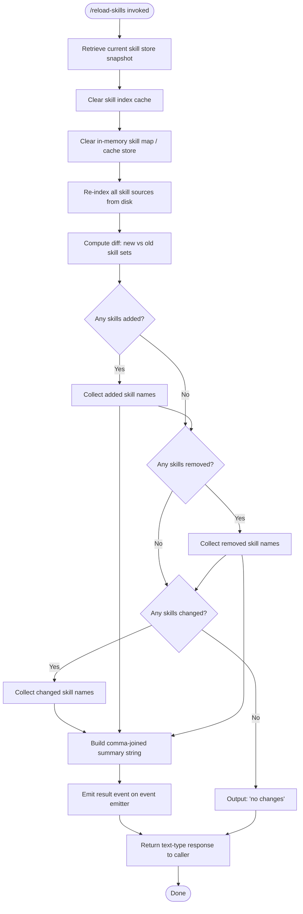

```markdown
---
type: feature-spec
feature: "reload-skills"
cc_version: "2.1.159"
updated: "2026-06-02"
tags: ["reload-skills", "commands", "slash-commands"]
source: "bundle-analysis"
bundle_verified: true
inherited_from: "2.1.152"
analysis_basis: "CC v2.1.152 bundle.js (AST extraction + Claude interpretation)"
author: "ryujaeuk <ryujaeuk@gmail.com>"
repository: "https://github.com/MyLittleLuckyDog/cc-gnothi"
license: "AGPL-3.0-only"
---

# `/reload-skills`

> Analysis basis: CC v2.1.152 bundle.js (AST extraction + Claude interpretation)
> Minimum version: v2.1.152

---

## Overview

`/reload-skills` refreshes the in-process skill registry so that any skill files added, modified, or removed from disk during the current session are picked up without restarting the Claude Code process. It clears the skill index cache, re-indexes all skill sources, computes the diff (added / removed / changed), and returns a plain-text summary to the user. The command supports non-interactive (headless) execution and dispatches its result as a `post-text` payload on thin clients.

---

## Registration

| Field | Value |
|---|---|
| type | `local` |
| name | `reload-skills` |
| description | Pick up skills added or changed on disk during this session |
| loc_byte | `12264492` |
| loc_byte_end | `12264709` |
| loc_line | `10263` |
| supportsNonInteractive | `true` |
| thinClientDispatch | `post-text` |
| module_id | `sQ1` |
| load_inline | `true` |
| arbor_handler.name | `qK5` |
| arbor_handler.fqn | `claude-2.1.152::qK5` |
| arbor_handler.kind | `AsyncFunction` |
| arbor_handler.resolution_path | `module_id` |
| arbor_handler.n_hits | `0` |

Analysis basis: CC v2.1.152 bundle.js:+12264492

---

## Input Branching

The handler contains 4+ distinct branches based on the diff results (new skills, removed skills, changed skills, and the "no changes" case), so a Mermaid flowchart is used.



---

## Behavioral Spec

### 1. Pre-reload Snapshot

Before any mutation, the handler captures the current state of the skill store so that a meaningful diff can be computed afterward.

```
async function reloadSkills(context):
    previousSkillSet = getSkillStore()          // via storeAccessor (KU6 → qU6.getStore)
    previousSkillIndex = getIndexSnapshot()     // via indexHelper (KU6 → el)
```

Analysis basis: CC v2.1.152 bundle.js:+12264014 (call from `qK5` → `b6`), +974504, +974525

---

### 2. Cache Invalidation

Two independent caches are cleared before re-indexing begins:

1. **Skill index cache** — cleared via `clearSkillIndexCache` on the index singleton (`H.clearSkillIndexCache`).
2. **In-memory skill map** — cleared via `.clear()` on an internal Map store (`lW8.clear`).

```
function invalidateCaches():
    reindexer.clearSkillIndexCache()            // H.clearSkillIndexCache @ +12822074
    inMemorySkillMap.clear()                    // lW8.clear @ +9709216
```

Analysis basis: CC v2.1.152 bundle.js:+12264063 (`qK5` → `pR` → `ox`), +12264068 (`qK5` → `zo`)

The `pR` → `ox` chain also calls `Promise.resolve` before proceeding, indicating the cache-clear path is async-safe and awaited.
Analysis basis: CC v2.1.152 bundle.js:+12822022

---

### 3. Re-indexing Skills from Disk

After invalidation, the handler triggers a full re-index. The re-indexer (`pR`) internally delegates to three composable helpers (`tW8`, `zz1`, `ChH`) that together scan the filesystem, parse skill definitions, and populate the cleared index.

```
async function reindexSkills():
    await clearAndReindex()                     // pR, which calls ox, tW8, zz1, ChH
    // ox resolves asynchronously; pr_ is an internal async helper within ox
```

Analysis basis: CC v2.1.152 bundle.js:+12264063, +12822121, +12822126, +12822132, +12822138

The random-number constant (`Math.random`, literal `2`, literal `1`) observed in helper `H` suggests a small jitter or retry mechanism during indexing.
Analysis basis: CC v2.1.152 bundle.js:+13371602, +13371604, +13371618, +13371641

---

### 4. File-level Watcher Management During Re-index

The re-indexing pipeline manages a set of active file watchers. For each skill source being (re-)loaded, the pipeline:

1. Adds the watcher reference to a tracking set.
2. Registers a `.finally()` handler to clean up on completion or error.
3. Closes both the new watcher and any previous watcher for the same path.
4. Removes the entry from the tracking set on teardown.

```
function manageWatchers(skillPaths):
    for path in skillPaths:
        watcherRef = openWatcher(path)          // A.close, q.close via M
        activeWatchers.add(watcherRef)          // q.add @ +15387392
        watcherRef.finally(() =>
            activeWatchers.delete(watcherRef)   // q.delete @ +15387415
        )
        // name normalization: toLowerCase, padEnd(40) used for display keys
```

Analysis basis: CC v2.1.152 bundle.js:+15387392, +15387401, +15393628, +15393638, +15408290, +15408364

---

### 5. Diff Computation and Summary Generation

After re-indexing completes, the handler computes a three-way diff: skills added, removed, and changed. Results are collected into an output array which is then joined into a comma-separated summary string.

```
function buildDiffSummary(previousSkillSet, newSkillSet):
    addedSkills   = newSkillSet.filter(s => NOT previousSkillSet.has(s))   // +12264152
    removedSkills = previousSkillSet.filter(s => NOT newSkillSet.has(s))   // +12264191
    changedSkills = newSkillSet.filter(s => previousSkillSet.has(s)
                                       AND contentChanged(s))              // +12264176

    outputParts = []

    if addedSkills.length > 0:
        outputParts.push(formatSkillList("added", addedSkills))            // +12264225

    if removedSkills.length > 0:
        outputParts.push(formatSkillList("removed", removedSkills))

    if changedSkills.length > 0:
        outputParts.push(formatSkillList("changed", changedSkills))

    if outputParts.isEmpty():
        return "no changes"                                                 // +12264306

    return outputParts.join(", ")                                          // +12264293, ", " @ +12264300
```

Analysis basis: CC v2.1.152 bundle.js:+12264137, +12264152, +12264176, +12264191, +12264225, +12264293, +12264306

---

### 6. Result Emission and Response

After computing the diff summary, the handler:

1. Emits an event on the internal event emitter (`ad.emit`) to notify any subscribers of the reload completion.
2. Returns a structured response object with `type: "text"` carrying the summary string.

The literal `"skill"` is used as a label or category tag in the result or the emitted event payload.

```
async function emitAndRespond(summaryString):
    eventEmitter.emit(reloadEvent, summaryString)   // ad.emit @ +12264121

    return {
        type: "text",                               // literal "text" @ +12264331
        content: summaryString                      // e.g. "no changes" or "added: foo, ..."
    }
    // "skill" literal used as category tag @ +12264388
```

Analysis basis: CC v2.1.152 bundle.js:+12264121, +12264293, +12264331, +12264376, +12264388

---

### 7. Background Session / Stopped State Guard

The literals `"stopped"` and `"background session"` found in the call graph (via `k8` / `O`) suggest that the command checks whether the current session is in a stopped or background state before proceeding, and may surface that condition in its output or logs.

```
function checkSessionState(session):
    if session.status == "stopped":                 // literal @ +15418298
        warn("background session")                  // literal @ +15418341
        // behavior: <!-- TODO: not found in depth-2 traversal; needs --depth 4 -->
```

Analysis basis: CC v2.1.152 bundle.js:+15418298, +15418336, +15418341

---

## State & Side Effects

| Item | Detail |
|---|---|
| Telemetry | None detected in this version (telemetry array is empty) |
| Skill index cache | Cleared unconditionally on every invocation via `H.clearSkillIndexCache` (+12822074) |
| In-memory skill map | Cleared unconditionally via `lW8.clear` (+9709216) |
| File watchers | Existing watchers closed; new watchers opened per skill source; tracked in a Set with `finally`-based cleanup (+15387392, +15393628) |
| Event emission | `ad.emit` fires after reload completes (+12264121) |
| appState changes | <!-- TODO: not found in depth-2 traversal; needs --depth 4 --> |
| Sound | <!-- TODO: not found in depth-2 traversal; needs --depth 4 --> |
| thinClientDispatch | Sends result as `post-text` payload on thin-client transports |

---

## Version History

| Version | Change |
|---|---|
| v2.1.152 | Initial analysis |

---

## Common Mistakes

1. **Assuming persistence across process restarts** — `/reload-skills` only updates the in-process registry. If the Claude Code process is restarted, skills are always loaded fresh from disk; invoking this command beforehand has no effect.
2. **Expecting granular error reporting** — the command returns `"no changes"` when the new index matches the old one exactly. It does not distinguish between "no skill files exist" and "all skill files are unchanged."
3. **Invoking in non-interactive scripts without checking `supportsNonInteractive`** — this command does support headless invocation (`supportsNonInteractive: true`), so that is safe; however callers must handle the `post-text` dispatch shape when using thin-client transports.
4. **Race conditions with concurrent skill file writes** — because the command clears caches before re-indexing, a skill file being written to disk at the same moment may produce an inconsistent intermediate state. Wait for disk writes to complete before invoking `/reload-skills`.
5. **Confusing "changed" with "removed + added"** — the diff is computed as a three-way categorization; a skill that is renamed appears as one removal and one addition, not as a change.

---

## Appendix — Identifier Mapping

> For bundle debugging only. Identifiers change across versions.

| Identifier | Role |
|---|---|
| `qK5` | Main async handler for `/reload-skills` (Arbor-resolved entry point) |
| `b6` | Pre-reload skill store snapshot helper |
| `KU6` | Store accessor — retrieves current skill store state |
| `el` | Index snapshot helper called inside store accessor |
| `z_` | Auxiliary helper called during snapshot phase |
| `pv` | Internal utility called by `z_` |
| `q` | Active file-watcher tracking Set (add / delete / filter operations) |
| `pR` | Re-indexing orchestrator (delegates to `ox`, `tW8`, `zz1`, `ChH`) |
| `ox` | Async cache-clear + re-index executor (calls `Promise.resolve`, `pr_`, `H.clearSkillIndexCache`) |
| `H` | Skill index singleton (exposes `clearSkillIndexCache`; uses `Math.random` / `setTimeout` internally) |
| `tW8` | Re-index sub-step helper (step 1 of 3 within `pR`) |
| `zz1` | Re-index sub-step helper (step 2 of 3 within `pR`) |
| `ChH` | Re-index sub-step helper (step 3 of 3 within `pR`) |
| `zo` | In-memory skill map cache-clear wrapper (calls `lW8.clear`) |
| `L` | Watcher lifecycle manager (add, finally, delete) |
| `M` | Watcher close coordinator (calls `A.close`, `q.close`, delegates back to `L`) |
| `A` | Individual watcher instance (exposes `close`; uses `toLowerCase` for name normalization) |
| `K` | Skill name formatter (uses `L.map`, `M.padEnd` for display alignment) |
| `O` | Output parts accumulator array (push / join) |
| `k8` | Session-state / background-session guard utility |
```

Note: index built via Arbor fallback; some signals (telemetry, literals) may be missing — see arbor-fallback.js.