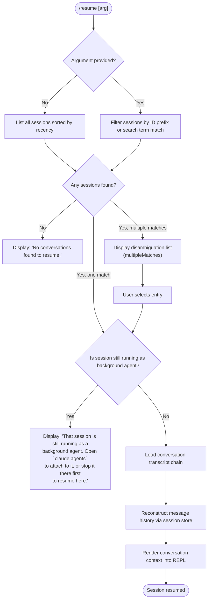

# `/resume`

> Analysis basis: CC v2.1.159 bundle.js (AST extraction + Claude interpretation)
> Minimum version: v2.1.159

---

## Overview

`/resume` (alias: `/continue`) allows the user to reattach to a previous Claude Code conversation by specifying a conversation ID or a search term. The command queries all live and persisted sessions, disambiguates among them, and restores the selected conversation's message chain into the current REPL context. If the target session is still running as a background agent, the user is redirected to `claude agents` instead of being allowed to resume directly.

---

## Registration

| Field | Value |
|---|---|
| type | `local-jsx` |
| name | `resume` |
| description | `Resume a previous conversation` |
| aliases | `["continue"]` |
| argumentHint | `[conversation id or search term]` |
| module_id | `rF1` |
| load_inline | `true` |
| loc_byte | `11910597` |
| loc_byte_end | `11910794` |
| loc_line | `7702` |
| arbor_handler.name | `eK5` |
| arbor_handler.fqn | `claude-2.1.159::eK5` |
| arbor_handler.kind | `AsyncFunction` |
| arbor_handler.resolution_path | `module_id` |
| arbor_handler.n_hits | `0` |

Analysis basis: CC v2.1.159 bundle.js:+11910597

---

## Input Branching

The command has four or more distinct resolution branches depending on argument presence, session liveness, and match count. A Mermaid flowchart is used.



Analysis basis: CC v2.1.159 bundle.js:+11909085, +11909199, +11909634, +11909199

---

## Behavioral Spec

### 1. Session Discovery (`listAllLiveSessions`)

When the command fires, the handler (`eK5`) first calls a session-listing helper (`$5H`) that:

1. Resolves a `Promise.resolve` baseline.
2. Calls `listAllLiveSessions` on the session manager (`A`) to enumerate every session tracked by the daemon.
3. Filters out sessions whose status indicates they are in a non-interactive mode.

The string `"interactive"` is used as a status discriminator when selecting sessions eligible for resume.

```
function discoverSessions():
    allSessions = sessionManager.listAllLiveSessions()
    return allSessions.filter(s => s.mode == "interactive")
```

Analysis basis: CC v2.1.159 bundle.js:+8844089, +8844180

---

### 2. Argument Matching / Search (`sessionFilter`)

After discovery, the handler (`eK5` → `iF1`) applies argument-based filtering:

```
function filterSessions(sessions, userArg):
    if userArg is empty:
        return sessions   // show all for picker

    normalized = userArg.toLowerCase()
    return sessions.filter(s =>
        s.id.startsWith(normalized) OR
        s.title.toLowerCase().includes(normalized) OR
        s.lastPrompt.toLowerCase().includes(normalized)
    )
```

The call graph shows `H.filter` and `A.toLowerCase` are both invoked during this phase.

Analysis basis: CC v2.1.159 bundle.js:+11909085, +11909115

---

### 3. Background-Agent Guard

If exactly one session matches (or the user selects one from a disambiguation list), the handler checks whether the session is currently running as a background agent. If so, it blocks the resume and surfaces the user-facing error message.

```
function checkIfResumable(session):
    if session.isBackgroundAgent == true AND session.status != "stopped":
        displayError(
            "That session is still running as a background agent. " +
            "Open `claude agents` to attach to it, or stop it there first to resume here."
        )
        return BLOCKED
    return ALLOWED
```

Analysis basis: CC v2.1.159 bundle.js:+11909199 (literal at +11909199)

---

### 4. Empty-Result Guard

When the filtered session list is empty (no sessions exist or no sessions match the search term), the handler displays a terminal message and exits:

```
function handleNoResults():
    display("No conversations found to resume.")
    return
```

Analysis basis: CC v2.1.159 bundle.js:+11909634

---

### 5. Worktree Detection (`worktreeDetect`)

Before reconstructing the message chain, the handler calls `LCH` (the worktree-detection helper), which:

1. Captures `Date.now()` as a reference timestamp.
2. Runs `git worktree list --porcelain` by invoking `T_` (the subprocess launcher).
3. Parses each output line; strips the `"worktree "` prefix (9 characters) from path lines.
4. Applies NFC Unicode normalization to the path.
5. Uses `localeCompare` to sort and identify the correct worktree for the session's working directory.

```
function detectWorktree(cwd):
    result = runSubprocess(["git", "worktree", "list", "--porcelain"])
    lines = result.split("\n")
    entries = parseWorktreeLines(lines)  // strips 9-char "worktree " prefix, NFC-normalizes
    return entries.find(e => e.path.startsWith(cwd)) ?? sort by localeCompare
```

Telemetry event `tengu_worktree_detection` is emitted during this step.

Analysis basis: CC v2.1.159 bundle.js:+11906193, +11906199, +11906217, +11906449, +11906462, +11906636

---

### 6. Conversation Transcript Reconstruction (`sessionStore` / `yZ6`, `Y5H`)

The session store (`yZ6` → `W_K` → `OAH`) reconstructs the full message chain:

1. Loads raw JSONL transcript from disk using file I/O (`q7.readFile`, `sJ5`).
2. Walks parent-UUID links to build a chronologically ordered message list.
3. Recognises well-known message type tags: `"assistant"`, `"user"`, `"system"`, `"attachment"`, `"progress"`, `"compact_boundary"`, `"summary"`, `"last-prompt"`, `"custom-title"`, `"ai-title"`, `"tag"`.
4. Resolves `"compact_boundary"` markers so compacted segments are omitted where applicable.
5. Applies `"skip"` disposition to messages that should not be replayed.

```
function reconstructChain(sessionId):
    raw = readTranscriptFile(sessionId)
    messages = parseJSONL(raw)
    ordered = walkParentLinks(messages)  // UUID chain walking
    filtered = ordered.filter(m => m.disposition != "skip")
    return filtered
```

Analysis basis: CC v2.1.159 bundle.js:+11909889, +11909402, +12921103, +12921170

---

### 7. UI Rendering (`lF1`, JSX)

After the chain is resolved, `eK5` calls `hw.createElement` to render a JSX component. The component:

- Displays a bold session heading (via `j6.bold`).
- Populates the REPL's conversation context with the reconstructed messages.
- Emits telemetry keys `slash_command_session_id` and `slash_command_title` for downstream analytics.

```
function renderResumedSession(session, messages):
    element = createElement(ResumedConversationComponent, {
        session: session,
        messages: messages,
    })
    telemetry.emit("slash_command_session_id", session.id)
    telemetry.emit("slash_command_title", session.title)
    renderToREPL(element)
```

Analysis basis: CC v2.1.159 bundle.js:+11909485, +11909895, +11910119, +11910169

---

### 8. Multi-Match Disambiguation

When more than one session matches the argument, the handler stores result metadata under the keys `"sessionNotFound"` and `"multipleMatches"` to drive the picker UI. The user selects an entry, and the flow proceeds to the background-agent guard.

Analysis basis: CC v2.1.159 bundle.js:+11906843, +11906914

---

## State & Side Effects

| Item | Detail |
|---|---|
| Telemetry — `tengu_worktree_detection` | Emitted during git worktree detection; includes timing metadata (bundle.js:+11906299) |
| Telemetry — `tengu_transcript_phantom_parent` | Emitted when a parent UUID referenced in the transcript is not found in the message store (bundle.js:+12919881) |
| Telemetry — `tengu_transcript_parent_cycle` | Emitted when a cycle is detected in the parent-UUID chain (bundle.js:+12923506) |
| Telemetry — `tengu_chain_parent_cycle` | Emitted at the chain-walk layer on cycle detection (bundle.js:+12901389) |
| Telemetry — `tengu_chain_timestamp_fallback` | Emitted when message ordering falls back to timestamp comparison (bundle.js:+12901538) |
| Telemetry — `tengu_chain_parallel_tr_recovered` | Emitted when a parallel transcript branch is recovered (bundle.js:+12903404) |
| Telemetry — `tengu_relink_walk_broken` | Emitted when a walk step finds a broken link in the relink graph (bundle.js:+12900899) |
| Telemetry — `slash_command_session_id` | String literal key emitted with the target session's UUID (bundle.js:+11909895) |
| Telemetry — `slash_command_title` | String literal key emitted with the resumed session title (bundle.js:+11910119) |
| appState changes | Conversation message history is replaced with the reconstructed chain; REPL prompt context is updated to reflect the resumed session |
| Background-agent block | When the target session is a running background agent, the resume is blocked; no state mutation occurs |
| File I/O | Transcript JSONL is read from disk synchronously (via `PS.openSync` / `PS.readSync`) during chain reconstruction |
| Sound | None detected in depth-2 traversal |

---

## Version History

| Version | Change |
|---|---|
| v2.1.159 | Initial analysis |

---

## Common Mistakes

1. **Trying to resume an active background-agent session directly** — The command will block with a clear error message directing the user to `claude agents`. The session must be stopped there before `/resume` can attach to it.
2. **Using a too-short search term** — Very short prefixes may match multiple sessions, triggering the disambiguation picker unexpectedly. Use a longer ID prefix or a more specific title fragment.
3. **Using `/resume` with no sessions persisted** — If no prior conversations exist, the command exits immediately with "No conversations found to resume." and does nothing.
4. **Expecting `/resume` to work across different working directories without worktree awareness** — The command runs git worktree detection to bind the resumed session to the correct directory; running from an unrelated directory may cause unexpected worktree resolution.
5. **Confusing the alias `/continue` with any LLM "continue" instruction** — `/continue` is a registered alias for `/resume` and behaves identically; it does not send a continuation prompt to the model.

---

## Appendix — Identifier Mapping

> For bundle debugging only. Identifiers change across versions.

| Identifier | Role |
|---|---|
| `eK5` | Main async handler for `/resume` (arbor_handler; AsyncFunction resolved via module_id path) |
| `iF1` | Session list filter helper; applies user argument against session metadata |
| `$5H` | Session discovery wrapper; calls `listAllLiveSessions` and filters by `"interactive"` mode |
| `LCH` | Worktree detection helper; runs `git worktree list --porcelain` and parses output |
| `T_` | Subprocess launcher used by worktree detection and other child-process operations |
| `xGH` | Low-level process/IPC execution engine (spawns subprocesses, manages streams) |
| `SH` | Error-reporting / logging utility invoked on failures throughout the call graph |
| `EH` | String coercion helper used during error formatting |
| `O_` | Home-directory or path-resolution helper |
| `_N` | Path normalization primitive called by `US` and `O_` |
| `RI8` | Context/project file reader used during session restoration |
| `Fy6` | Project file enumeration helper; joins paths and collects relevant files |
| `G_K` | Directory walker / file-collection engine used to gather project context |
| `UCH` | Buffer assembly helper for reading binary transcript segments |
| `MX5` | Token/chunk parser called by the buffer assembly helper |
| `yZ6` | Session store accessor; resolves and returns the full session record |
| `W_K` | Session store initializer; merges stored state via `Object.assign` |
| `OAH` | Session state manager; holds and updates all per-session metadata maps |
| `Y5H` | Conversation transcript loader; orchestrates reading and linking message entries |
| `z5H` | Message chain walker; builds ordered list from parent-UUID links |
| `FJ5` | Message deduplication and sorting helper within the chain walker |
| `pJ5` | Priority-queue helper used during transcript chain ordering |
| `j_K` | UUID-to-message index builder |
| `BJ5` | Validation helper checking for NaN timestamps during chain ordering |
| `sJ5` | Low-level JSONL transcript file reader using synchronous file descriptors |
| `aJ5` | Binary header parser for transcript files (reads UUID/timestamp prefix bytes) |
| `tJ5` | Alternate synchronous transcript segment reader |
| `mJ5` | Relink-walk helper; traverses and repairs broken parent links |
| `A_` | Internal relink-index structure accessor |
| `s8K` | Session registry map; tracks all known session records by ID |
| `XeH` | Message-array mapping utility |
| `Yh8` | Timestamp parser helper (calls `Date.parse`) |
| `A9A` | Content normalization helper for message bodies |
| `Kk6` | Markdown/text block tokenizer used during content normalization |
| `HK` | Regex-based text segment extractor |
| `K9A` | Filtering helper for image/document content blocks |
| `lqA` | Top-level message content accessor combining multiple sub-accessors |
| `Dh8` | Per-session metadata getter (reads from map by session ID) |
| `wh8` | Helper that converts map values to an array |
| `eJ5` | Working-directory stat helper; checks directory existence before restore |
| `US` | Home-directory resolver used in path construction |
| `TZ` | Directory-listing helper (calls `Vp.readdir`) |
| `dl` | Autocomplete / search index builder for session picker |
| `Da` | URL/pattern tester used during content classification |
| `Hs` | Display-string formatter for session list entries |
| `PfH` | Session picker UI component reference |
| `lF1` | JSX render helper for the resumed-conversation display (uses `j6.bold`) |
| `NJ5` | Session metadata extraction helper |
| `FC` | Callback used after session metadata is committed |
| `pYA` | JSONL record parser for conversation messages |
| `uYA` | Sub-parser for individual message fields |
| `mYA` | String-replacement helper within message parsing |
| `Ej` | Map-entry updater used by the session state manager |
| `oq` | Internal utility that calls `w8` (likely a queue/write primitive) |
| `QGH` | JSONL framing parser (handles BOM bytes 239/187/191, newline splitting) |
| `F94` | Outer JSONL frame scanner |
| `g94` | Inner JSONL token extractor |
| `d94` | JSONL record boundary detector |
| `Q94` | JSONL line parser that calls `JSON.parse` |
| `QN6` | File-read wrapper for session storage files |
| `Th1` | File-unlink wrapper for session storage cleanup |
| `oJ5` | Buffer comparison helper used in transcript binary format parsing |
| `P_K` | Byte-offset calculator for transcript binary records |
| `OH` | Streaming enqueue helper for transcript segments |
| `Xx6` | JSON.parse wrapper |
| `U6` | JSON.parse wrapper (alternate call site) |
| `HH` | Ref-based timer/scheduler (similar to `o`, `r`, `qH` family) |
| `qH` | Composite ref-and-timer structure |
| `hz` | String replace + slice utility used in path formatting |
| `OA4` | Sub-helper called by the string replace utility |
| `G6` | Background-spare session manager (tracks spare slots) |
| `Fy8` | Memory/spare session refill monitor |
| `TfA` | Background PTY host spawner (`--bg-pty-host` flag) |
| `D` | Main daemon dispatch loop |
| `w` | Worker-session lifecycle manager |
| `ZfA` | IPC socket connection helper (`Tx8.connect`) |
| `yfA` | Worker session teardown/roster-entry helper |
| `cm` | Shutdown coordination helper (`Promise.race` / `Promise.all`) |
| `xy` | Notification push helper |
| `hH` | Feature-flag "ok" state store |
| `bH` | Feature-flag "bad" state store |
| `B` | Active-session retirement checker |
| `S` | Per-worker IPC write handler |
| `Yw6` | Configuration file reader |
| `I` | Away-summary generator (checks cache freshness, rate-limit, draft state) |
| `Ff8` | Away-summary API call executor |
| `Yx5` | Away-summary cache loader |
| `W08` | Global app state getter (`G5H.getState`) |
| `TZ1` | UUID generator (`vv.randomUUID`) |
| `h` | Away-summary scheduling helper |
| `Jd` | Internal timer/interval helper |
| `t` | Voice-mode session controller |
| `yy8` | Voice-stream WebSocket manager |
| `DH` | Voice-session dispatch/state-machine handler |
| `u7A` | Voice audio-chunk accumulator |
| `pzK` | Voice jitter/backoff calculator |
| `LH` | Voice stream-processor (handles elicitation, enqueue, notifications) |
| `vH` | Voice audio-capture buffer helper |
| `x7A` | Voice tool/capability discovery helper |
| `wH` | Voice WebSocket wrapper |
| `uxH` | Language/locale tag normalizer |
| `LDA` | `Intl.DateTimeFormat` wrapper |
| `zH` | Voice state logger |
| `ey5` | Voice error formatter |
| `B_` | `Cp` (codec/pipeline) initializer |
| `a` | Voice session allow/deny decision helper |
| `c` | Voice capture device selector |
| `WH` | Voice session queue (shift/push) |
| `_94` | String-padding helper (pads to width 10) |
| `Iz` | Internal signal/event emitter |
| `w8` | Internal write queue primitive |
| `N` | Logging/debug output helper |
| `d` | Internal deferred/promise primitive |
| `n_` | Newline or separator constant helper |
| `CH` | String coercion utility |
| `L1` | Sub-logger or label formatter |
| `JVA` | Label-construction helper calling `CH` |
| `I_4` | Ring-buffer manager (shift/push on `QB6`) |
| `F_` | Error constructor wrapper |
| `SNA` | `Number.isFinite` guard / `TypeError` thrower |
| `xL6` | Promise-rejection handler with `Boolean` coercion |
| `EIA` | IPC message dispatcher (uses `tq4`, `TNA`, `_.unshift`) |
| `Rr8` | IPC read-side handler |
| `Cr8` | IPC write-side handler |
| `xr8` | IPC channel setup helper |
| `Sr8` | `Reflect.apply` / `Reflect.defineProperty` wrapper |
| `fIA` | Event emitter registration helper (`H.on`) |
| `hNA` | Timeout-race helper (`Promise.race`, `clearTimeout`) |
| `RNA` | Signal/kill helper (`H.kill`) |
| `kNA` | Bound process-control helper |
| `yNA` | Bound kill helper |
| `KIA` | Promise.all-based multi-task coordinator |
| `UL6` | Result aggregation helper (`zr8`) |
| `AIA` | Pipe-setup helper (`A.pipe`) |
| `qIA` | Child-process add helper (`eNA.default`) |
| `uNA` | Bound stream helper (`Tr8.bind`) |
| `MNA` | <!-- TODO: not found in depth-2 traversal; needs --depth 4 --> |
| `aS6` | Plugin path validator (checks `.staging`, `..`, absolute paths) |
| `M` | Plugin/MCP server mount manager |
| `k8` | Internal key lookup for plugin map |
| `O` | Plugin registry map |
| `z` | Session/worker state composite object |
| `cm` | Shutdown race coordinator |
| `R` | Disposable resource handle |
| `V` | Generic value/state holder |
| `Q` | Session-file queue |
| `p` | Write-buffer / timer map |
| `Cy6` | Lookup-table get/set/values helper |
| `g2H` | File-slicing and segment-push helper |
| `iqA` | Recursive directory reader with buffer allocation |
| `xc` | Projects-directory path builder |
| `xO` | <!-- TODO: not found in depth-2 traversal; needs --depth 4 --> |
| `aA` | <!-- TODO: not found in depth-2 traversal; needs --depth 4 --> |
| `hz` | String replace/slice path formatter |
| `G` | Keyboard/event handler (preventDefault, remoteControlAtStartup) |
| `Y` | Supervisor session write handler |
| `E` | MCP server lifecycle controller (stop/start/updateConfig) |
| `j` | Worker values/kill map |
| `X` | Data-chunk buffer with ETOOLARGE guard |
| `P` | MCP SDK connection manager |
| `J` | Flat-array accumulator |
| `T` | MCP transport manager |

---

Note: index built via Arbor fallback; some signals (telemetry, literals) may be missing — see arbor-fallback.js.