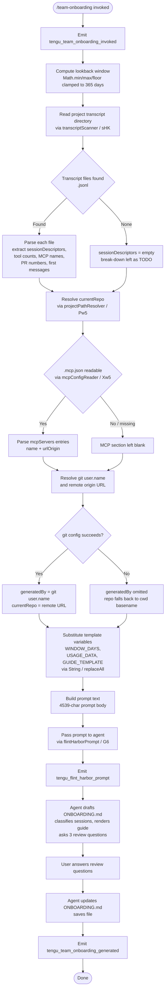

# `/team-onboarding`

> Analysis basis: CC v2.1.159 bundle.js (AST extraction + Claude interpretation)
> Minimum version: v2.1.159

---

## Overview

`/team-onboarding` is a `prompt`-type slash command that analyzes the invoking user's local Claude Code session transcripts (up to 365 days of history) and co-authors a reusable `ONBOARDING.md` guide for teammates who are new to Claude Code. The command scans transcript files from the project's history directory, assembles structured usage data (session descriptors, MCP server entries, tool counts, and repo context), then injects that data into a multi-step agent prompt that drafts the guide, renders it in a code block, and interactively solicits review from the guide creator before writing the file.

---

## Registration

| Field | Value |
|---|---|
| type | `prompt` |
| name | `team-onboarding` |
| description | `Help teammates ramp on Claude Code with a guide from your usage` |
| isHidden | `false` |
| handler_method | `getPromptForCommand` |
| handler_method_start (byte offset) | `12710760` |
| handler_method_end (byte offset) | `12711470` |
| loc_byte | `12710422` |
| loc_byte_end | `12711471` |
| loc_line | `8940` |
| prompt_body.length | `4539` characters |
| prompt_body.trace | `identifier→$ (local→1 ext vars)` |
| arbor_handler.name | `getPromptForCommand` |
| arbor_handler.kind | `Method` |
| arbor_handler.fqn | `claude-2.1.159::getPromptForCommand` |
| arbor_handler.resolution_path | `direct` |
| arbor_handler.n_hits | `2` |
| `handler_method_start` | `12710760` |
| `handler_method_end` | `12711470` |

Analysis basis: CC v2.1.159 bundle.js:+12710422

---

## Input Branching

The handler has four or more distinct execution paths depending on the availability of transcript data, the presence of a current repo, and whether MCP server configuration can be resolved. A Mermaid flowchart is used.



---

## Behavioral Spec

### 1. Handler Entry Point — `getPromptForCommand`

The Arbor-resolved handler is `getPromptForCommand` (`direct` resolution), which acts as an inline ObjectMethod on the registration object. The synthetic call-graph entry `__handler_team-onboarding` is BFS bookkeeping; `getPromptForCommand` is the real handler.

Analysis basis: CC v2.1.159 bundle.js:+12710760

```
function getPromptForCommand(context):
    emit telemetry("tengu_team_onboarding_invoked")

    windowDays = Math.floor(Math.min(Math.max(userArg ?? 365, 1), 365))
    # 365-day cap: bundle.js:+12711009

    usageData   = scanTranscripts(context, windowDays)   # sHK
    repoContext = resolveProjectPath(context)             # Pw5 → j0, wN, hz
    mcpConfig   = readMcpConfig(repoContext.projectDir)  # Pw5 → Xw5
    gitMeta     = resolveGitMeta(repoContext)             # Pw5 → T_ (git config user.name, remote get-url origin)

    promptText  = buildPrompt(windowDays, usageData, mcpConfig, gitMeta)  # replaceAll + String
    return { type: "text", content: promptText }         # literal "text": bundle.js:+12711454
```

Analysis basis: CC v2.1.159 bundle.js:+12710766

---

### 2. Transcript Scanner — `transcriptScanner` (`sHK`)

Reads `.jsonl` files from the project's transcript history directory. The lookback cutoff is `Date.now() - windowDays × 24 × 60 × 1000` ms (constants 24, 60, 1000 at bundle.js:+12699258–12699267).

```
async function transcriptScanner(historyDir, windowDays):
    cutoffMs = Date.now() - windowDays * 24 * 60 * 1000
    entries  = await fs.readdir(historyDir)
    jsonlFiles = entries.filter(e => path.extname(e) === ".jsonl")
    # ".jsonl" literal: bundle.js:+12699373

    results = await Promise.all(jsonlFiles.map(async file =>
        stat = await fs.stat(join(historyDir, file))
        if not stat.isFile(): return null

        raw = await fs.readFile(join(historyDir, file), "utf-8")
        lines = raw.split("\n")

        sessionDescriptors = []
        for line in lines:
            if line.includes('"name":"mcp__'):    # literal: bundle.js:+12699952
                record mcpToolCall
            if line.includes('"content":['):      # literal: bundle.js:+12700302
                extract first user message (up to 3 parts checked: bundle.js:+12700405)
            apply Yw5.exec / Dw5.exec / ww5.exec regex passes for prNumbers, titles

        return { sessionDescriptors, toolCounts, mcpNames }
    ))
    return aggregateResults(results.filter(Boolean))
```

Analysis basis: CC v2.1.159 bundle.js:+12701806

---

### 3. Project Path & MCP Config Resolution — `projectPathResolver` (`Pw5`) and `mcpConfigReader` (`Xw5`)

`projectPathResolver` locates the current working directory's project record using `projects/` path logic (literal `"projects"`: bundle.js:+1002360) and computes a human-readable relative path via `pathShortener` (`hz`).

`mcpConfigReader` reads `.mcp.json` (literal: bundle.js:+12701484) from the project directory, parses the `mcpServers` key (literal: bundle.js:+12701540), and returns an array of `{ name, urlOrigin }` entries. Parse errors are caught silently (falls back to empty array).

```
function projectPathResolver(context):
    projectsDir  = join(claudeDir, "projects")
    projectEntry = findProjectRecord(projectsDir, cwd)   # wN
    shortPath    = pathShortener(projectEntry.path)      # hz → OA4 (Math.abs, 36-char hash: bundle.js:+1002207)
    return { projectDir, shortPath }

async function mcpConfigReader(projectDir):
    try:
        raw     = await fs.readFile(join(projectDir, ".mcp.json"), "utf-8")
        parsed  = JSON.parse(raw)                        # U6
        servers = parsed.mcpServers ?? {}
        return Object.entries(servers).map(([name, cfg]) => ({ name, urlOrigin: cfg.url ?? null }))
    catch:
        return []
```

Analysis basis: CC v2.1.159 bundle.js:+12701785, +12701460

---

### 4. Git Metadata Resolution — `gitMetaResolver` (`T_` → `xGH`)

Spawns two sequential `git` subprocesses via the shell execution helper (`xGH`):

1. `git config user.name` — to populate `generatedBy` (literal `"user.name"`: bundle.js:+12702123)
2. `git remote get-url origin` — to populate `currentRepo` (literals `"remote"`, `"get-url"`, `"origin"`: bundle.js:+12702179–12702198)

Both invocations are guarded; on failure the corresponding field is omitted or falls back to `path.basename(cwd)`. The subprocess limit is 1 000 000 bytes stdout (literal: bundle.js:+1050128).

```
async function gitMetaResolver(cwd):
    userName   = await runGit(cwd, ["config", "user.name"])   catch → null
    remoteUrl  = await runGit(cwd, ["remote", "get-url", "origin"]) catch → path.basename(cwd)
    return { generatedBy: userName, currentRepo: remoteUrl }
```

Analysis basis: CC v2.1.159 bundle.js:+12702104

---

### 5. Prompt Assembly — Template Variable Substitution

Three placeholder strings are replaced in the prompt body before it is returned:

| Placeholder | Replacement source | Literal location |
|---|---|---|
| `{{WINDOW_DAYS}}` | computed `windowDays` integer | bundle.js:+12711220 |
| `{{GUIDE_TEMPLATE}}` | embedded guide template string | bundle.js:+12711260 |
| `{{USAGE_DATA}}` | JSON-serialized usage data object | bundle.js:+12711295 |

Replacement is performed via `String.replaceAll` (call edge `__handler_team-onboarding → _.replaceAll`: bundle.js:+12711207).

Analysis basis: CC v2.1.159 bundle.js:+12711207

---

### 6. Prompt Content Summary — `getPromptForCommand` body

The 4,539-character prompt instructs the agent to act as a collaborative co-author generating an `ONBOARDING.md` file. Key behavioral instructions extracted from the prompt body (cited by fragment only — never reproduced verbatim):

- **Acknowledgment-first rule**: The agent must emit a specific acknowledgment line (beginning `"> Looking at how you've used Claude..."`) as its very first visible output, before any extended thinking or classification. The spec explicitly states "Classification is step 2, not step 1."
- **Session classification**: The agent reads the `sessionDescriptors` array and classifies each into one of seven task-type buckets: `build_feature`, `debug_fix`, `improve_quality`, `analyze_data`, `plan_design`, `prototype`, `write_docs`. The top 3–5 by percentage are displayed in title-case with spaces.
- **Guide assembly**: The agent fills in the embedded `{{GUIDE_TEMPLATE}}` with real numbers, ASCII bar charts (filled `█` / empty `░`, 20 chars wide), and MCP server context. If `generatedBy` is absent, the name field is omitted.
- **Interactive review**: After rendering the guide in a code block, the agent appends a `---` rule and a `**Review**` heading with exactly three numbered questions covering team name, starter task, and team tips.
- **File save**: After the user responds, the agent updates `ONBOARDING.md` and closes with an exact closing line (specified verbatim in the prompt).
- **Zero-session guard**: If `sessionDescriptors` is empty (~0 sessions), the work-type breakdown is left as a TODO placeholder.

Analysis basis: CC v2.1.159 bundle.js:+12710760 (handler method start)

---

### 7. Flint Harbor Dispatch — `flintHarborPrompt` (`G6`)

After prompt construction, the handler dispatches via the Flint Harbor prompt subsystem (`G6`), which manages session deduplication (`rzH` map), feature-gate checks, and background session claiming. The call chain is:

```
function flintHarborPrompt(promptText, context):
    sessionKey = computeSessionKey(context)          # Ix → Nx → RR
    if sessionRegistry.has(sessionKey):              # rzH.has
        existing = sessionRegistry.get(sessionKey)   # rzH.get
        return reuseSession(existing)

    dedupeSet.add(sessionKey)                        # HY6.add
    sessionHandle = claimOrSpawnSession(context)     # K_8 → cz_ / oz_
    result = runInSession(sessionHandle, promptText) # h6
    emit telemetry("tengu_flint_harbor_prompt")
    return result
```

Analysis basis: CC v2.1.159 bundle.js:+12710794

---

### 8. Guide Template Output Format

The guide written to `ONBOARDING.md` follows an embedded template (placeholder `{{GUIDE_TEMPLATE}}`). Based on the prompt body description (not reproduced verbatim), it includes:

- Team name header
- Work-type breakdown with ASCII bar charts (20-char width, `█`/`░`)
- Repos section seeded from `currentRepo` and workspace sibling directories
- MCP server access instructions derived from `name` and `urlOrigin`
- `Team Tips` section — filled after review or left as TODO
- `Get Started` section — filled after review or left as TODO
- An HTML comment instruction at the bottom (preserved exactly as specified in the prompt)

---

## State & Side Effects

| Item | Detail |
|---|---|
| Telemetry — invocation | `tengu_team_onboarding_invoked` (bundle.js:+12711020) — fired once per invocation before data collection |
| Telemetry — prompt dispatch | `tengu_flint_harbor_prompt` (bundle.js:+12710797) — fired when prompt is sent to Flint Harbor |
| Telemetry — guide generated | `tengu_team_onboarding_generated` (bundle.js:+12711339) — fired after prompt assembly completes |
| Telemetry — harbor share | `tengu_flint_harbor_share` (bundle.js:+9592644) — fired by session-share subsystem (`xH6`) |
| Telemetry — config errors | `tengu_config_parse_error`, `tengu_config_lock_contention`, `tengu_config_stale_write`, `tengu_config_auth_loss_prevented` — fired by config subsystem during transcript path resolution |
| Telemetry — background session | `tengu_bg_dispatch_sigkill_escalate`, `tengu_bg_dispatch_low_mem`, `tengu_bg_spare_enable`, `tengu_bg_spare_claim`, `tengu_bg_spare_claim_fail`, `tengu_bg_spare_spawn`, `tengu_bg_low_mem_mb` — fired by daemon session management |
| File write | `ONBOARDING.md` written to the project working directory by the agent after review |
| Transcript reads | `.jsonl` files under the project's history directory are read (async, `Promise.all`) |
| MCP config read | `.mcp.json` in the project directory is read (async, silently ignored on error) |
| Git subprocess | Two `git` subprocesses spawned: `git config user.name` and `git remote get-url origin` |
| Session deduplication | Session key registered in `rzH` map; `HY6` set updated (Flint Harbor bookkeeping) |
| appState changes | Flint Harbor session handle stored in `PU` map (get/has/set pattern observed in `G6`) |
| Sound | <!-- TODO: not found in depth-2 traversal; needs --depth 4 --> |
| Hook registration | File-watch hook registered/unregistered via `l17` (`J_8.watchFile` / `J_8.unwatchFile`) during session lifetime |

---

## Version History

| Version | Change |
|---|---|
| v2.1.159 | Initial analysis |

---

## Common Mistakes

1. **Invoking without an active project directory**: The command reads `.jsonl` transcripts from the project history path. Running it outside a Claude Code project context (no valid `projects/` record) will result in an empty `sessionDescriptors` array and a guide with all sections as TODO placeholders.
2. **Expecting instant output without acknowledgment**: The prompt instructs the agent to emit the acknowledgment line _before_ any classification or tool use. If the agent skips directly to analysis (e.g., under high extended-thinking budget), the UX intent is broken — this is a known prompt-ordering constraint, not a bug.
3. **Assuming MCP server names are always resolved**: If `.mcp.json` is absent or malformed in the project directory, the MCP section of the guide will be empty. Place a valid `.mcp.json` at the project root before invoking.
4. **Re-running expecting fresh data**: The Flint Harbor session registry (`rzH`) deduplicates sessions by key. A second `/team-onboarding` call within the same session lifetime may reuse the prior session handle rather than re-scanning transcripts.
5. **Editing `ONBOARDING.md` before review questions are answered**: The agent writes the file in two passes — once after the initial draft and again after the review Q&A. Manual edits between passes may be overwritten when the agent applies the user's review answers.
6. **Misinterpreting the 365-day window**: The `windowDays` value is clamped via `Math.min`/`Math.max`/`Math.floor` to the range `[1, 365]`. Passing `0` or a negative value will be silently promoted to `1`. There is no way to request more than 365 days of history.

---

## Appendix — Identifier Mapping

> For bundle debugging only. Identifiers change across versions.

| Identifier | Role |
|---|---|
| `__handler_team-onboarding` | Synthetic BFS entry point for the `getPromptForCommand` handler (not a real bundle symbol) |
| `G6` | Flint Harbor prompt dispatcher — manages session registry, deduplication, and background session dispatch |
| `AY6` | Flint Harbor sub-helper A (called by `G6`) |
| `qY6` | Flint Harbor sub-helper B (called by `G6`) |
| `Ix` | Session key computation entry |
| `CH` | String conversion utility used in session key computation |
| `Nx` | Session record lookup / normalization |
| `RR` | Session record factory / composer |
| `K_8` | Session claim-or-create router |
| `cz_` | Background session creator (UUID, random bytes, event emission) |
| `dEH` | First-party session tagger |
| `wU` | Random-bytes session ID generator |
| `RH` | JSON serialization wrapper |
| `J17` | Session metadata writer |
| `oz_` | Session reuse / attach helper |
| `uyq` | Session queue probe |
| `B_` | Session capability checker |
| `vFq` | Session variant selector |
| `B$H` | Known-session set probe |
| `h6` | Session execution runner (main run loop entry) |
| `g6` | Logger / debug emitter |
| `fY_` | Session state accessor |
| `tzH` | Config file reader (reads, parses, backs up config JSON) |
| `q` | Filesystem module alias (sync operations) |
| `U6` | JSON.parse wrapper |
| `nb` | String prefix-strip utility |
| `_` | Filesystem module alias (async / mixed operations) |
| `w8` | Error constructor / wrapper |
| `UFq` | Sibling-repo directory scanner |
| `N` | Token / model name formatter |
| `d` | Logger (debug channel) |
| `DY_` | Backup directory path builder |
| `w` | Daemon background session manager |
| `l17` | File-watch registration helper |
| `kr` | Watch callback handler |
| `K9` | Signal/hook registrar |
| `z8` | Config read-with-lock entry (async) |
| `YY_` | Config write-with-lock (with backup, deduplication, auth-loss guard) |
| `L` | Async filesystem operations wrapper |
| `f` | Connection / stream lifecycle manager |
| `tOq` | Config object merger |
| `$K_` | Config schema validator |
| `$Y6` | Config diff / change detector |
| `A` | Process/session map manager |
| `V` | Path prefix checker |
| `P` | MCP server connection manager |
| `zx8` | MCP transport constructor |
| `SH` | MCP connection state machine |
| `F_` | Error string coercion |
| `E` | Config entry array (slice helper) |
| `CL6` | Atomic file write helper (temp + rename, fchmod, fsync) |
| `O` | `fs.Stats`-like object wrapper |
| `P8` | Permission/error code classifier |
| `H` | Misc utility (random, timeout, string ops) |
| `BQH` | Session status enum / map |
| `pFq` | Object-entries iterator for session options |
| `FQH` | Timestamp utility for sessions |
| `zY_` | Config global-save path builder |
| `Pw5` | Project path + repo context resolver (main) |
| `O_` | Claude home directory resolver |
| `_N` | Home directory utility |
| `j0` | Project record path builder |
| `wN` | Project directory path helper |
| `hz` | Path shortener / human-readable path formatter |
| `OA4` | Hash-based path abbreviation (Math.abs, base-36) |
| `sHK` | Transcript scanner (reads `.jsonl` files, extracts session descriptors) |
| `oq` | Error code normalizer |
| `K` | Array padding/formatting helper |
| `$` | Main process / event bus |
| `Xs1` | Session event emitter |
| `z` | Daemon control channel |
| `hH` | Daemon heartbeat sender |
| `bH` | Daemon heartbeat receiver |
| `xy` | Daemon connection state handler |
| `cm` | Daemon shutdown coordinator (Promise.race) |
| `D` | Background session dispatcher (spawn, memory checks, SH routing) |
| `Fy8` | Platform-specific background session logic (macOS) |
| `TfA` | Bun-based background PTY session spawner |
| `Iz` | Process environment accessor |
| `Xw5` | MCP config reader (reads `.mcp.json`, parses `mcpServers`) |
| `Jw5` | Additional project metadata helper |
| `T_` | Git metadata resolver (spawns `git config`, `git remote get-url`) |
| `xGH` | Shell command executor (main subprocess runner) |
| `EIA` | Process argument builder (win32 `.exe`/`cmd` handling) |
| `Rr8` | Stdout stream handler |
| `Cr8` | Stderr stream handler |
| `xr8` | Combined stream aggregator |
| `SNA` | Finite-number validator for process options |
| `xL6` | Process exit-code promise resolver |
| `Sr8` | Reflect-based process proxy |
| `fIA` | Process exit-event listener |
| `hNA` | Subprocess timeout wrapper (setTimeout + Promise.race) |
| `RNA` | Subprocess kill helper |
| `kNA` | Process stdin writer |
| `yNA` | Process kill-on-signal handler |
| `KIA` | Parallel stream reader (Promise.all) |
| `UL6` | Stream pipe helper |
| `AIA` | Stdout pipe setup |
| `qIA` | Stderr pipe setup |
| `uNA` | Stream-bind utility |
| `_94` | String coercion for subprocess args |
| `UGH` | Git URL parser (trims, matches, extracts git remote host) |
| `S94` | URL component extractor |
| `f9` | String index/slice helper |
| `xH6` | Flint Harbor session-share handler |
| `L1` | Traffic-tier resolver (`essential-traffic`, `no-telemetry`, `default`) |
| `JVA` | Traffic tier label mapper |
| `FZ` | Session share payload builder |