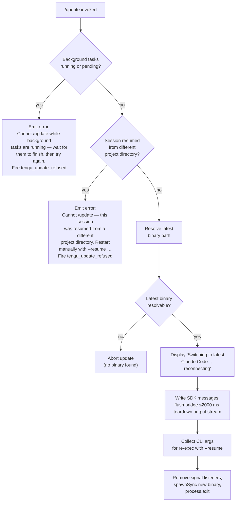

# `/update`

> Analysis basis: CC v2.1.159 bundle.js (AST extraction + Claude interpretation)
> Minimum version: v2.1.159

---

## Overview

`/update` upgrades Claude Code in-place to the latest installed version while keeping the current conversation session alive. It resolves the binary path, validates preconditions (no running background tasks, no cross-directory resume), tears down the current process cleanly, and re-executes the updated binary with `--resume` so the conversation continues seamlessly.

---

## Registration

| Field | Value |
|---|---|
| type | `local` |
| name | `update` |
| description | `Switch to the latest version (conversation continues)` |
| loc_byte | `12387359` |
| loc_byte_end | `12387600` |
| loc_line | `8264` |
| supportsNonInteractive | `false` |
| isHidden | `true` |
| module_id | `Ro1` |
| load_inline | `true` |
| arbor_handler.name | `N$5` |
| arbor_handler.fqn | `claude-2.1.159::N$5` |
| arbor_handler.kind | `AsyncFunction` |
| arbor_handler.resolution_path | `module_id` |
| arbor_handler.n_hits | `0` |

Analysis basis: CC v2.1.159 bundle.js:+12387359

> **Handler note:** The command's actual implementation is the async function `N$5` (see Appendix), reached via `module_id` → `Ro1` resolution. The Arbor symbol graph resolves this unambiguously; `N$5` is preferred over the BFS synthetic entry `Fk8` that appears as the first `callGraph` node.

---

## Input Branching

The handler has five distinct outcomes based on runtime state checks, necessitating a Mermaid flowchart.



Analysis basis: CC v2.1.159 bundle.js:+12385251 (handler entry), +12385526 (background task check), +12385629 (error literal), +12385870 (cross-directory error), +12386381 (status message), +12386448 (flush timeout), +12107905 (spawnSync)

---

## Behavioral Spec

### 1. Binary / Path Resolution

```
function resolveBinaryAndVersionsDir():
    claudeExecutable = locateExecutableOnPath("claude")   // Bun.which
    versionsDir = buildVersionsPath(
        homedir(),                    // os.homedir()
        ".local", "share", "versions"
    )
    binDir = buildBinPath(
        homedir(),
        ".local", "share", "bin"
    )
    return { claudeExecutable, versionsDir, binDir }
```

Analysis basis: CC v2.1.159 bundle.js:+12385165 (`Fk8`→`O3`→`dIA`→`Bun.which`), +7868084 (`.local`), +7868093 (`share`), +9115925 (`versions`), +7868164 (`bin`)

---

### 2. Precondition Guards

```
async function checkPreconditions(appState, sessionContext):
    // Guard 1: background tasks
    bgStatuses = Object.values(appState.backgroundTasks)
    if any task has status "running" or "pending":
        fire telemetry("tengu_update_refused")
        return Error(
          "Cannot /update while background tasks are running — wait for them to finish, then try again."
        )

    // Guard 2: cross-directory resume
    if sessionContext.resumedFromDifferentDirectory:
        fire telemetry("tengu_update_refused")
        return Error(
          "Cannot /update — this session was resumed from a different project directory. Restart manually with --resume to continue on the latest version."
        )

    return OK
```

Analysis basis: CC v2.1.159 bundle.js:+12385488 (`Object.values`), +12385526 (`"running"`), +12385548 (`"pending"`), +12385629 (error string), +12385870 (cross-directory error string), +12385265 (`tengu_update_refused`)

---

### 3. Conversation State Snapshot

```
function snapshotConversationState(conversationLog):
    // Identify the last assistant-prefixed message block
    lastAssistantEntry = conversationLog.findLast(
        entry => entry.role.startsWith("assistant-")
    )
    // Append a synthetic "last-prompt" entry to the conversation log
    appendEntry(log, "last-prompt", lastAssistantEntry)
    // Persist session state for --resume handoff
    persistAppState(currentAppState)
```

Analysis basis: CC v2.1.159 bundle.js:+12386171 (`"assistant-"`), +12895446 (`_.appendEntry`), +12895466 (`"last-prompt"`)

---

### 4. Update Notification Message

```
function emitUpdateNotification(outputStream):
    // Produce a text-type assistant message visible in the conversation
    writeSDKMessage(outputStream, {
        role: "assistant",
        type: "text",
        content: "Switching to latest Claude Code… reconnecting"
    })
    // Generate a fresh UUID for the message envelope
    messageId = randomUUID()
```

Analysis basis: CC v2.1.159 bundle.js:+12386357 (`O.writeSdkMessages`), +12386381 (`"Switching to latest Claude Code… reconnecting"`), +12384214 (`"assistant"`), +12385311 (`"text"`), +12384238 (`Bk8.randomUUID`)

---

### 5. Bridge Flush and Teardown

```
async function flushAndTeardown(outputStream):
    // Wait for bridge flush with 2000 ms ceiling
    result = await Promise.race([
        outputStream.flush(),
        timeout(2000, label="bridge flush")
    ])
    // Full teardown of the output stream
    await outputStream.teardown()
    // Flush analytics pipeline with 500 ms ceiling
    await flushAnalyticsWithTimeout(500, label="analytics flush timeout")
```

Analysis basis: CC v2.1.159 bundle.js:+12386451 (`O.flush`), +12386461 (`2000`), +12386466 (`"bridge flush"`), +12386502 (`O.teardown`), +12107346 (`30000` flush timeout for relaunch phase), +12107464 (`"analytics flush timeout"`)

---

### 6. Argument Assembly for Re-exec

```
function assembleRelaunchArgs(originalArgs, sessionId, workingDir, sdkSettings):
    args = Array.from(originalArgs)

    // Inject --resume flag so the conversation is picked up
    args.push("--resume", sessionId)

    // Propagate working directory if set
    if workingDir is set:
        args.push("--add-dir", workingDir)

    // Re-propagate permission flags if active
    if dangerouslySkipPermissions:
        args.push("--allow-dangerously-skip-permissions")
    if effort is set:
        args.push("--effort", effort)
    if permissionMode is set:
        args.push("--permission-mode", permissionMode)

    return args
```

Analysis basis: CC v2.1.159 bundle.js:+12107279 (`"--resume"`), +12108628 (`Array.from`), +12108703 (`"cliArg"`), +12108724 (`"session"`), +12108803 (`"--add-dir"`), +12108972 (`"--allow-dangerously-skip-permissions"`), +12109114 (`"--effort"`), +12109131 (`"--permission-mode"`)

---

### 7. Process Re-execution (execve / spawnSync)

```
async function relaunchProcess(binaryPath, args, env):
    // Tear down UI (unmount Ink renderer, clear interval animations)
    unmountRenderer()
    stopAnimations()

    // Remove all signal listeners to avoid interference
    process.removeAllListeners("SIGINT")
    process.removeAllListeners("SIGHUP")

    // Register beforeExit / exit safety handlers
    process.on("beforeExit", safetyHandler)
    process.on("exit", safetyHandler)

    // On macOS: use execve via FFI (libSystem.B.dylib / libc.so.6)
    // so the new binary replaces the current process image
    // Fallback: spawnSync with stdio: "inherit"
    try:
        execveViaFFI(binaryPath, args, env)   // replaces process image
    catch relaunch_spawn_error:
        logError("relaunch_spawn_error")
        process.exit(128)

    // Self-kill if still alive (edge case)
    process.kill(process.pid, "SIGKILL")
```

Analysis basis: CC v2.1.159 bundle.js:+12107848 (`process.removeAllListeners`), +12107878 (`process.on`), +12107905 (`td1.spawnSync`), +12107819 (`"SIGINT"`), +12107838 (`"SIGHUP"`), +12107994 (`"beforeExit"`), +12108035 (`"exit"`), +12108130 (`"relaunch_spawn_error"`), +12108154 (`process.exit`), +12108267 (`128`), +12108219 (`process.kill`), +12106406 (`f.dlopen`), +12106419 (`"macos"`), +12106427 (`"/usr/lib/libSystem.B.dylib"`), +12106456 (`"libc.so.6"`), +12107940 (`"inherit"`)

---

### 8. SDK Settings Propagation

```
function collectSDKSettings(appState):
    // Read session-level overrides that must survive the re-exec
    settings = appState.getAppState()
    lastEntry = settings.findLast(e => e.type == "working_directory")
    return {
        workingDirectory : extract(settings, "working_directory"),
        allowedTools     : extract(settings, "allowed_tools"),
        disallowedTools  : extract(settings, "disallowed_tools"),
        avoidPrompts     : extract(settings, "avoid_prompts"),
        effort           : extract(settings, "effort"),
        model            : extract(settings, "model"),
        flagSettings     : extract(settings, "flag_settings")
    }
```

Analysis basis: CC v2.1.159 bundle.js:+12386117 (`_.getAppState`), +10681437 (`"working_directory"`), +10681492 (`"allowed_tools"`), +10681547 (`"disallowed_tools"`), +10681608 (`"avoid_prompts"`), +10681932 (`"effort"`), +10681945 (`"model"`), +10681957 (`"flag_settings"`)

---

## State & Side Effects

| Item | Detail |
|---|---|
| Telemetry — `tengu_update_refused` | Fired when either precondition guard blocks the update (background tasks running, or cross-directory resume). CC v2.1.159 bundle.js:+12385265 |
| Telemetry — `tengu_scroll_summary` | Fired during terminal scroll/render teardown phase (via `bf8` → `gX9`). CC v2.1.159 bundle.js:+5358517 |
| Telemetry — `tengu_amber_creek` | Fired in fullscreen / terminal-mode detection path. CC v2.1.159 bundle.js:+3378550 |
| Telemetry — `tengu_pewter_brook` | Fired in fullscreen / terminal-mode detection path. CC v2.1.159 bundle.js:+3378458 |
| Telemetry — `tengu_config_parse_error` | Fired if config file read during relaunch arg assembly fails to parse. CC v2.1.159 bundle.js:+3211632 |
| appState changes | `_.getAppState` read before re-exec; `_.setAppState` written with updated session snapshot before bridge flush. CC v2.1.159 bundle.js:+12386117, +12386271 |
| Bridge flush | `O.flush()` called with 2000 ms timeout, then `O.teardown()`. CC v2.1.159 bundle.js:+12386451, +12386461, +12386502 |
| SDK message written | A text-role assistant message `"Switching to latest Claude Code… reconnecting"` is pushed to the output stream before flush. CC v2.1.159 bundle.js:+12386357, +12386381 |
| Signal handlers | All `SIGINT` and `SIGHUP` listeners removed before `spawnSync`. CC v2.1.159 bundle.js:+12107848 |
| FFI / execve | On macOS uses `libSystem.B.dylib` execve via Bun FFI; on Linux uses `libc.so.6`. CC v2.1.159 bundle.js:+12106419, +12106427, +12106456 |
| process.exit code | `128` on `relaunch_spawn_error`. CC v2.1.159 bundle.js:+12108267 |
| UI teardown | Ink renderer unmounted, interval animations cleared, terminal restored via escape sequences `ESC 7` / `ESC 8`. CC v2.1.159 bundle.js:+5357049, +3717278, +3717289 |
| Hook registration | `zOA.register` / `zOA.drain` called during session hook lifecycle around relaunch. CC v2.1.159 bundle.js:+58858, +58901 |
| Sound | <!-- TODO: not found in depth-2 traversal; needs --depth 4 --> |

---

## Version History

| Version | Change |
|---|---|
| v2.1.159 | Initial analysis |

---

## Common Mistakes

1. **Running `/update` with active background tasks.** The command refuses if any background task status is `"running"` or `"pending"`. Wait for all background tasks to complete before invoking `/update`.

2. **Expecting `/update` to work inside a cross-directory resumed session.** If the session was resumed from a project directory different from the current working directory, `/update` will refuse with an explicit error. Restart manually using `--resume` after upgrading.

3. **Using `/update` in non-interactive mode.** `supportsNonInteractive: false` means the command is intentionally unavailable in non-interactive/piped invocations; it will be silently skipped or error out.

4. **Assuming the command is discoverable via `/help`.** `isHidden: true` means `/update` does not appear in the command listing. It must be invoked explicitly.

5. **Expecting an immediate binary swap.** The update sequence includes bridge flush (up to 2000 ms), analytics flush (up to 500 ms), UI teardown, and signal handler cleanup before the new binary is exec'd — there is a deliberate delay.

6. **Not having the latest binary in `~/.local/share/versions/`.** `/update` resolves the target binary from the local versions directory. If the package manager has not downloaded a newer version, the command cannot switch to it.

---

## Appendix — Identifier Mapping

> For bundle debugging only. Identifiers change across versions.

| Identifier | Role |
|---|---|
| `N$5` | Main async handler for `/update` (arbor_handler) |
| `Fk8` | Binary/path resolution helper (callGraph BFS entry) |
| `O3` | Executable lookup wrapper (`Bun.which` for `"claude"`) |
| `dIA` | Inner helper calling `Bun.which` |
| `rh` | Versions-directory path builder |
| `sW8` | Path segment joiner for versions dir |
| `i$` | Array membership check helper |
| `pLH` | Local share path helper (`~/.local/share`) |
| `Qj8` | Home-directory resolver (`os.homedir`) |
| `U_H` | Bin-directory path builder (`~/.local/share/bin`) |
| `N9` | Process-role guard (filters `"bg"`, `"daemon"`, `"daemon-worker"`) |
| `QOH` | Inner role-check helper |
| `d` | General utility / deferred resolve |
| `Oj` | Basename + version extraction helper |
| `I6` | Rendering / message-emit helper |
| `_N` | Low-level write helper |
| `fk` | CLI-arg accumulator helper |
| `B6A` | Directory-based binary resolver |
| `O_` | Path write helper |
| `pK` | Path construction helper |
| `WqH` | Session context reader |
| `Ht` | Attachment / hook-type classifier |
| `zh8` | Hook-type lookup table |
| `M_A` | Conversation-log append / last-prompt helper |
| `m4` | Hook registration dispatcher |
| `K9` | Hook register call (`zOA.register`) |
| `_` | App-state accessor namespace |
| `SH` | Stream / output-queue writer |
| `F_` | Error formatter |
| `CH` | String coercion helper |
| `L1` | Queue-drain helper |
| `JVA` | Inner drain helper |
| `I_4` | Circular-queue shift/push manager |
| `bT` | App-state mutation helper |
| `O` | SDK output stream object |
| `k8` | SDK message writer |
| `ho1` | UUID generator wrapper (`crypto.randomUUID`) |
| `sL` | Timed promise helper (setTimeout + Promise.race + clearTimeout) |
| `eYH` | String coercion for message content |
| `X2H` | Full relaunch orchestrator (stat, unmount, spawnSync, exec) |
| `wP6` | Animation interval clearer |
| `Vv_` | `clearInterval` wrapper |
| `wIH` | Terminal/UI teardown helper |
| `H` | Ink renderer instance |
| `mR` | Renderer unmount helper |
| `gq8` | Terminal output restore helper |
| `yVH` | Terminal version check (Ghostty, iTerm2) |
| `EVH` | Terminal escape emitter |
| `KW` | tmux / screen escape sequence handler |
| `bf8` | Scroll-summary / render teardown sequencer |
| `JZ` | Scroll helper |
| `QX9` | Render-stats helper |
| `gX9` | Frame timing / scroll metrics calculator |
| `BX9` | Metrics aggregator |
| `qq` | Full terminal render pipeline |
| `B$H` | Local-agent feature gate check |
| `RD_` | Render dimension helper |
| `Fr` | Frame-rate helper |
| `N` | Fullscreen / terminal-mode detector |
| `SD_` | Windows/SSH detection helper |
| `B_` | Platform capability helper |
| `y77` | Terminal-mode selection helper |
| `G6` | Ink render dispatcher |
| `UT` | Hook drain helper |
| `sxH` | `zOA.drain` wrapper |
| `xf8` | Analytics flush with timeout |
| `g8` | Analytics flush core |
| `K` | Analytics batch formatter |
| `q` | Analytics temp-file unlink helper |
| `L` | Analytics promise tracker |
| `ad1` | execve / FFI re-exec helper |
| `f` | FFI library handle |
| `A` | Process map / registry |
| `$` | Pending-process set |
| `Xs1` | Startup telemetry helper |
| `w` | Worker/daemon process manager |
| `S` | Supervisor process object |
| `bH` | Feature-bad telemetry emitter |
| `hH` | Feature-ok telemetry emitter |
| `Fy8` | Background low-memory reporter |
| `Yw6` | MCP config reader |
| `B` | Background-session roster |
| `ZfA` | IPC socket connection helper |
| `yfA` | Worker lifecycle manager |
| `D` | Daemon dispatch loop |
| `w8` | Worker state machine helper |
| `R` | Resource handle |
| `M` | execve syscall wrapper |
| `aS6` | Plugin-path sanitiser |
| `z` | Daemon stop helper |
| `xy` | First-party daemon channel helper |
| `cm` | Daemon run-to-completion helper |
| `EH` | Error string coercion helper |
| `tj` | Relaunch-args file writer (`writeFileSync`) |
| `fk8` | Full CLI-argument assembler for re-exec |
| `g96` | Arg-filtering helper |
| `h6` | Config file watcher / updater |
| `g6` | Config path resolver |
| `fY_` | Config write helper |
| `tzH` | Config read / backup helper |
| `U6` | JSON.parse wrapper |
| `nb` | String prefix-strip helper |
| `UFq` | Config directory scanner |
| `DY_` | Backup-path builder |
| `l17` | File-watch subscription manager |
| `kr` | Watch callback helper |
| `E_` | SDK session-settings extractor |
| `fV8` | `allowed_tools` / `working_directory` extractor |
| `aA` | Settings-entry parser |
| `MV8` | `disallowed_tools` / `avoid_prompts` extractor |
| `h$` | App-state reader for re-exec settings |

---

Note: index built via Arbor fallback; some signals (telemetry, literals) may be missing — see arbor-fallback.js.