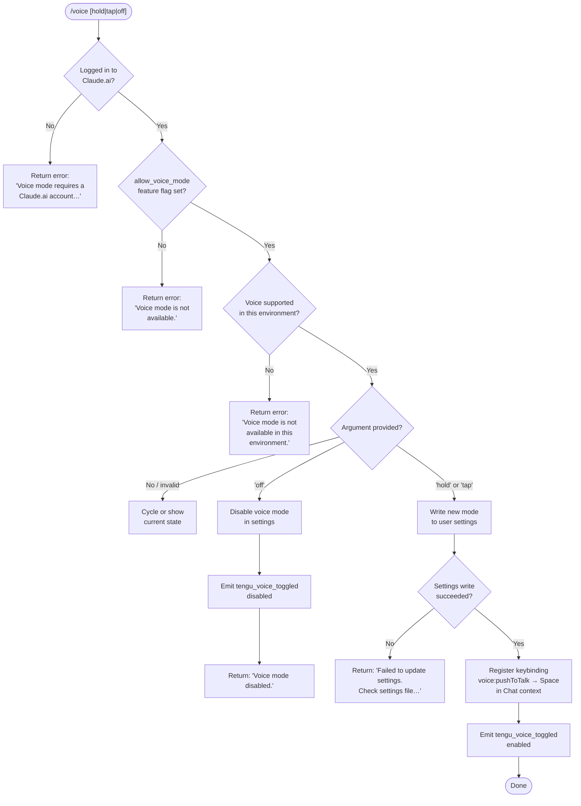

# `/voice`

> Analysis basis: CC v2.1.159 bundle.js (AST extraction + Claude interpretation)
> Minimum version: v2.1.159

---

## Overview

The `/voice` command toggles voice mode in Claude Code, allowing the user to switch between three sub-modes: `hold` (push-to-talk), `tap` (toggle-to-talk), and `off` (disabled). The command validates account eligibility (Claude.ai login and the `allow_voice_mode` feature flag) before persisting the new mode to user settings, and registers or removes the `voice:pushToTalk` keybinding in the `Chat` context accordingly.

---

## Registration

| Field | Value |
|---|---|
| type | `local` |
| name | `voice` |
| description | Toggle voice mode |
| argumentHint | `[hold\|tap\|off]` |
| supportsNonInteractive | `false` |
| isHidden | `null` |
| module_id | `THK` |
| load_inline | `true` |
| loc_byte | `12676259` |
| loc_byte_end | `12676501` |
| loc_line | `8798` |
| arbor_handler.name | `VD5` |
| arbor_handler.fqn | `claude-2.1.159::VD5` |
| arbor_handler.kind | `AsyncFunction` |
| arbor_handler.resolution_path | `module_id` |
| arbor_handler.n_hits | `1` |

Analysis basis: CC v2.1.159 bundle.js:+12676259

---

## Input Branching

The handler has six or more distinct paths (authentication failure, feature-flag denial, environment denial, `off`, `hold`/`tap` mode activation, and settings-write failure), so a Mermaid flowchart is used.



Analysis basis: CC v2.1.159 bundle.js:+12673713 (handler entry), +12673630–12673674 (mode literals), +12673741–12673853 (auth/flag error messages)

---

## Behavioral Spec

### 1. Handler entry — `voiceCommandHandler` (`VD5`)

The Arbor-resolved handler is the async function `VD5` in module `THK`. The call graph starts here.

```
async function voiceCommandHandler(args, context):
    appState  = getAppState()          // IY  — bundle.js:+12673724
    rawArg    = parseArgumentToken()   // ED5 — bundle.js:+12673938, trims input
    modeArg   = rawArg.trim()          // H.trim — bundle.js:+12674005

    // 1. Authentication gate
    if not isLoggedInToClaude(appState):
        return textMessage(
            "Voice mode requires a Claude.ai account. Please run /login to sign in."
        )
        // literal — bundle.js:+12673754

    // 2. Feature-flag gate
    if not featureFlagAllowed("allow_voice_mode", appState):
        // "allow_voice_mode" literal — bundle.js:+12664196
        return textMessage("Voice mode is not available.")
        // literal — bundle.js:+12673853

    // 3. Environment gate
    if not voiceSupportedInEnvironment():
        return textMessage("Voice mode is not available in this environment.")
        // literal — bundle.js:+12674554

    // 4. Mode dispatch
    if modeArg == "off":
        // literal — bundle.js:+12673653
        result = writeVoiceSetting(appState, "off")
        if result.error:
            return textMessage(
                "Failed to update settings. Check your settings file for syntax errors."
            )  // literal — bundle.js:+12674172
        emitTelemetry("tengu_voice_toggled", {mode: "off"})
        // bundle.js:+12674255
        return textMessage("Voice mode disabled.")
        // literal — bundle.js:+12674310

    else if modeArg in ["hold", "tap"]:
        // literals — bundle.js:+12673630, +12673642
        result = writeVoiceSetting(appState, modeArg)
        if result.error:
            return textMessage(
                "Failed to update settings. Check your settings file for syntax errors."
            )
        registerKeybinding("voice:pushToTalk", "Chat", "Space")
        // literals — bundle.js:+12675523, +12675542, +12675549
        emitTelemetry("tengu_voice_toggled", {mode: modeArg})
        return success()

    else:
        // "invalid" sentinel — bundle.js:+12673674
        // cycle or display current state (no argument / unrecognised token)
        ...
```

Analysis basis: CC v2.1.159 bundle.js:+12673713

---

### 2. Authentication and feature-flag check — `featureFlagCheck` (`UAA` → `I9`)

```
function checkVoiceFeatureFlag(appState):
    settings = loadSettingsFromDisk()  // Cp / ka8 — bundle.js:+12664193
    flags    = settings.flagSettings   // "flagSettings" — bundle.js:+1215869

    if "allow_voice_mode" not in flags:
        // literal — bundle.js:+12664196
        return false

    planType = getPlanType(appState)
    if planType in ["enterprise", "team"]:
        // literals — bundle.js:+4108470, +4108505
        return flags["allow_voice_mode"]

    return flags["allow_voice_mode"]
```

Analysis basis: CC v2.1.159 bundle.js:+12664193 (`UAA`), +12664196 (`allow_voice_mode`), +4108699 (`I9`)

---

### 3. Settings persistence — `writeVoiceSetting` (`U_`)

`U_` is the settings-write path that persists the new voice mode to the user settings file (`settings.json` in the `.claude` directory).

```
async function writeVoiceSetting(appState, mode):
    settingsPath = resolveSettingsPath(".claude/settings.json")
    // literals — bundle.js:+1219331, +1219341

    acquired = acquireConfigLock(settingsPath)
    // contention telemetry: tengu_config_lock_contention — bundle.js:+3209057

    current  = readSettingsFile(settingsPath)
    // safe-guard: abort if auth would be lost — bundle.js:+3209384

    current["voiceMode"] = mode
    writeAtomicWithBackup(settingsPath, current)
    // atomic write via temp file + rename — CL6 — bundle.js:+1228842
    // "Applied original permissions to temp file" — bundle.js:+1012788

    if gitignoreRuleNeeded(settingsPath):
        // "gitignore_global_rule" — bundle.js:+1229089
        updateGitignore()

    emitCacheClear()   // vz — bundle.js:+1228984
    emitSettingsEvent()  // spH.emit — bundle.js:+1229395
    return {error: null}
```

Analysis basis: CC v2.1.159 bundle.js:+1228239 (`U_`), +1228984 (`vz`), +1229395 (`spH.emit`)

---

### 4. Keybinding registration — `registerPushToTalkKeybinding` (`kX`)

When voice mode is set to `hold` or `tap`, the handler calls into the keybinding subsystem.

```
function registerPushToTalkKeybinding():
    action  = "voice:pushToTalk"  // bundle.js:+12675523
    context = "Chat"              // bundle.js:+12675542
    key     = "Space"             // bundle.js:+12675549

    config   = loadKeybindingsConfig()
    // reads "keybindings.json" — bundle.js:+3800501

    existing = findBinding(config, context, action)
    if existing != null and Usq.has(existing):
        // dedup guard — bundle.js:+3809416
        emitTelemetry("tengu_keybinding_fallback_used")
        // bundle.js:+3809440
        return

    registerBinding(context, action, key)
    emitTelemetry("tengu_keybinding_customization_release")
    // bundle.js:+3799987
```

Analysis basis: CC v2.1.159 bundle.js:+12675520 (`kX`), +3809358 (`J98`), +3802248 (`UD6`)

---

### 5. Environment availability check — `voiceEnvironmentCheck` (`gAA` / `uxH`)

```
function voiceSupportedInEnvironment():
    lang = getSystemLocale()           // uxH — bundle.js:+12675654
    lang = lang.toLowerCase()          // bundle.js:+27603
    supported = r3A.has(lang)          // bundle.js:+27653

    if not supported:
        return false

    if platform == "macos":
        // "macos" literal — bundle.js:+12731222
        checkMicrophonePermissions()
        // privacy path: "System Settings → Privacy & Security → Microphone"
        // bundle.js:+12675061

    return true
```

Analysis basis: CC v2.1.159 bundle.js:+12675654 (`uxH`), +27603–27718, +12675061

---

### 6. Argument token parsing — `parseVoiceArg` (`ED5`)

```
function parseVoiceArg(rawInput):
    trimmed = rawInput.trim()   // H.trim — bundle.js:+12673583
    if trimmed in ["hold", "tap", "off"]:
        return trimmed
    return "invalid"            // "invalid" literal — bundle.js:+12673674
```

Analysis basis: CC v2.1.159 bundle.js:+12673938 (`ED5`), +12673583

---

### 7. Voice availability via daemon status — `checkDaemonStatus` (`$` → `Xs1`)

The handler consults the background daemon to verify voice services are reachable.

```
function checkDaemonStatus():
    statusFile = joinPath(daemonDir, "daemon.status.json")
    // "daemon.status.json" literal — bundle.js:+12450463
    data       = readJson(statusFile)
    ts         = Date.now()           // bundle.js:+12450575
    requestId  = getRequestId()       // e9 — bundle.js:+12450607
    hash       = computePathHash()    // gk6 — bundle.js:+12450624
    return data
```

Analysis basis: CC v2.1.159 bundle.js:+12675041 (`$`), +12450560 (`Xs1`), +12450463

---

## State & Side Effects

| Item | Detail |
|---|---|
| Telemetry — `tengu_voice_toggled` | Fired on every successful mode change (enable or disable). bundle.js:+12674255 |
| Telemetry — `tengu_feature_ok` | Fired by the generic feature-gate helper on success. bundle.js:+966033 |
| Telemetry — `tengu_feature_sad` | Fired by the feature-gate helper on soft failure. bundle.js:+966168 |
| Telemetry — `tengu_feature_bad` | Fired by the feature-gate helper on hard failure. bundle.js:+966091 |
| Telemetry — `tengu_keybinding_customization_release` | Fired when a new keybinding is registered. bundle.js:+3799987 |
| Telemetry — `tengu_keybinding_fallback_used` | Fired when the action is not found and the fallback binding is applied. bundle.js:+3809440 |
| Telemetry — `tengu_custom_keybindings_loaded` | Fired after reading `keybindings.json`. bundle.js:+3800407 |
| Telemetry — `tengu_config_lock_contention` | Fired when the config file lock is contested. bundle.js:+3209057 |
| Telemetry — `tengu_config_stale_write` | Fired when a stale write is detected and aborted. bundle.js:+3209193 |
| Telemetry — `tengu_config_auth_loss_prevented` | Fired when a write is refused to prevent auth data loss. bundle.js:+3209536 |
| Telemetry — `tengu_config_parse_error` | Fired on JSON parse failure in the config file. bundle.js:+3211632 |
| Telemetry — `tengu_bg_*` (background daemon events) | Various daemon health events fired indirectly. bundle.js:+15469493, +15470072, +15470767, +15470888 |
| Settings file written | `~/.claude/settings.json` — `voiceMode` key updated atomically via temp file + rename. bundle.js:+1228842 |
| Keybinding registered | `voice:pushToTalk` → `Space` in the `Chat` context (when mode is `hold` or `tap`). bundle.js:+12675523 |
| Settings event emitted | `spH.emit` fires after a successful settings write to notify other subsystems. bundle.js:+1229395 |
| Cache cleared | `vz` clears `hC6` and `Uu8` caches after a settings write. bundle.js:+1228984 |
| Microphone permission prompt (macOS) | On macOS, the environment check may trigger a system microphone permission dialog. bundle.js:+12675061 |
| appState changes | `voiceMode` field updated in the in-memory app state via `IY`. bundle.js:+12673724 |

---

## Version History

| Version | Change |
|---|---|
| v2.1.159 | Initial analysis |

---

## Common Mistakes

1. **Running `/voice` without being logged in to Claude.ai** — the command requires a Claude.ai account (not just an API key). Using an `ANTHROPIC_API_KEY` alone will produce the "Voice mode requires a Claude.ai account. Please run /login to sign in." error (bundle.js:+12673754).

2. **Using an unsupported locale or environment** — voice mode is gated on a locale whitelist (`r3A`) and on macOS microphone permissions. If the system locale is not in the whitelist or permissions are denied, the command will return "Voice mode is not available in this environment." (bundle.js:+12674554).

3. **Corrupted `settings.json`** — if the settings file contains JSON syntax errors, the write will fail and the command will return "Failed to update settings. Check your settings file for syntax errors." (bundle.js:+12674172). Manually inspect `~/.claude/settings.json`.

4. **Expecting `/voice` to work non-interactively** — `supportsNonInteractive` is `false` (bundle.js:+12676259), so the command will not function in non-interactive (pipe/script) invocations.

5. **Providing an unrecognised argument** — only `hold`, `tap`, and `off` are accepted. Any other token resolves to the `"invalid"` sentinel (bundle.js:+12673674) and the command cycles to display the current state rather than setting a new mode.

6. **Expecting the keybinding to persist across config resets** — the `voice:pushToTalk` keybinding is written to `keybindings.json`; deleting or resetting that file will remove the push-to-talk binding even if voice mode remains enabled in `settings.json`.

---

## Appendix — Identifier Mapping

> For bundle debugging only. Identifiers change across versions.

| Identifier | Role |
|---|---|
| `VD5` | Main async voice command handler (`voiceCommandHandler`); Arbor-resolved entry point |
| `LA6` | Voice availability pre-check wrapper |
| `pAA` | Authentication state resolver |
| `IY` | App state accessor / context reader |
| `UK` | Low-level state getter |
| `pP` | Auth profile resolver (handles `profile-implicit`, `user_oauth`) |
| `kO` | First-party auth check (resolves `"firstParty"` literal) |
| `KX` | Auth token retrieval helper |
| `F3` | API key / auth environment validator (checks `ANTHROPIC_API_KEY`, `apiKeyHelper`, `none`) |
| `Kz6` | Auth helper initialiser |
| `agH` | Auth helper constructor (uses `CH`, `F$H`) |
| `FZ` | Feature flag accessor |
| `My6` | Voice mode state reader |
| `UAA` | Feature flag availability wrapper |
| `I9` | Feature flag evaluator (checks `allow_voice_mode`, plan type) |
| `A_9` | Plan-type helper |
| `rR` | Settings-aware flag resolver |
| `L1` | Generic async task runner |
| `pKH` | Permission check helper |
| `Ww6` | Flag evaluation dispatcher |
| `B_` | Telemetry / performance instrumentation wrapper |
| `Cp` | Telemetry span creator |
| `E9` | Memory usage sampler |
| `Sb` | `perf_hooks` `require` wrapper |
| `ka8` | Settings-load-from-disk orchestrator (`loadSettingsFromDisk_start`/`_end`) |
| `Y8` | Log-file writer (uses `appendFileSync`, `mkdirSync`) |
| `RC6` | Settings cache layer |
| `G56` | Flag-settings merger (uses `flagSettings`, `policySettings`) |
| `whA` | Settings watcher / change detector |
| `E3H` | Settings path builder (`userSettings`, `projectSettings`, `localSettings`) |
| `fQ` | Settings JSON reader (`Q3A`, `zP`, `Va8`, `d3A`) |
| `zhA` | SDK inline settings handler |
| `MQ` | Settings object assembler (composes platform, env, and file settings) |
| `O_` | Environment variable reader |
| `T56` | WSL detection helper |
| `SC6` | Settings change event emitter |
| `ED5` | Voice argument token parser (trims and validates `hold`/`tap`/`off`) |
| `H` | Random / timeout utility (uses `Math.random`, `setTimeout`) |
| `U_` | User-settings atomic writer (main write path) |
| `VO` | Settings output composer |
| `Ia8` | Settings aggregator (combines `whA`, `E3H`, `fQ`, `zhA`) |
| `jP` | File-path resolver entrypoint |
| `hi` | File reader with encoding detection (UTF-8 / UTF-16 / BOM) |
| `Q$` | File stat / type validator (FIFO, socket, char device, block device checks) |
| `N` | MIME / content-type classifier |
| `oB6` | File encoding probe |
| `aB6` | File content slicer |
| `P8` | Path existence checker |
| `w8` | ENOENT error handler |
| `Eo8` | Timestamp cache setter (`QF6.set`, `Date.now`) |
| `aGH` | Settings path resolver (uses `kg6`, `MQ`) |
| `kg6` | Config directory resolver (`VN.resolve`, `VN.dirname`) |
| `CL6` | Atomic file-write helper (temp file → rename, `fchmodSync`, `fsyncSync`) |
| `O` | Symbolic-link checker |
| `RH` | JSON stringifier wrapper |
| `vz` | Settings cache clearer (clears `hC6`, `Uu8`) |
| `mF6` | Gitignore-rule writer (git `check-ignore`, `ls-files`, `core.excludesfile`) |
| `R6` | AsyncLocalStorage context reader |
| `rB6` | Storage-store getter |
| `Lo8` | Gitignore-rule formatter |
| `A` | String utility (case conversion, `toLowerCase`) |
| `uF6` | Git-ignore check runner |
| `T_` | Git subprocess runner (`git check-ignore`, `git config --global`) |
| `R94` | Path normaliser (home-dir tilde expansion, `isAbsolute`) |
| `HkA` | Git `ls-files` tracker |
| `_kA` | Gitignore append helper |
| `ob` | Settings directory joiner (`VN.join`, `.claude`) |
| `hH` | Async read helper |
| `d` | Telemetry / feature-gate base (fires `tengu_feature_ok/sad/bad`) |
| `t6` | Async write helper |
| `bH` | Async error helper |
| `SH` | Event queue / log emitter |
| `F_` | Error string converter |
| `CH` | String coercion helper |
| `I_4` | Queue shift/push manager |
| `M` | Plugin/staging directory remover (`aW.rm`) |
| `aS6` | Plugin path resolver (validates `.staging`, `plugins/synced`) |
| `sS6` | Plugin base-path builder |
| `$` | Daemon status query entry point |
| `Xs1` | Daemon status file reader (`daemon.status.json`) |
| `si` | Status payload parser |
| `i1H` | Status field extractor (trims, `we`) |
| `e9` | Request-ID store getter (`TJ7.getStore`) |
| `gk6` | Daemon directory path builder |
| `kX` | Keybinding registration entry point |
| `J98` | Keybinding loader dispatcher |
| `UD6` | Keybindings-config file parser (`keybindings.json`) |
| `dJ_` | Keybinding entry normaliser |
| `uU` | Keybinding action dispatcher |
| `I4H` | Keybindings file path builder |
| `U6` | JSON parse wrapper |
| `D98` | Keybinding block structure validator |
| `O98` | Keybinding entries iterator |
| `hsq` | Keybinding telemetry helper (`tengu_custom_keybindings_loaded`) |
| `gJ_` | Duplicate-key detector in keybinding JSON |
| `QJ_` | Keybinding dedup set manager |
| `EH` | String-type error reporter |
| `X98` | Keybinding context matcher |
| `rJ_` | Context-string resolver |
| `iJ_` | Context lookup helper |
| `j6H` | Key-action mapper |
| `uxH` | Locale/language detector for voice environment check |
| `h6` | Config file state reader (reads config JSON, file-watch setup) |
| `fY_` | Config path helper |
| `tzH` | Config file reader/writer with backup rotation |
| `nb` | String prefix stripper |
| `UFq` | Config directory scanner |
| `DY_` | Config backup path builder |
| `w` | Background daemon process manager |
| `S` | Daemon subprocess supervisor |
| `Fy8` | macOS memory reporter (`macos`, 1024 MB threshold) |
| `Yw6` | Daemon process list reader |
| `B` | Active MCP session filter |
| `G6` | Daemon session resolver |
| `ZfA` | Daemon socket connector (`Tx8.connect`) |
| `yfA` | Background-job lifecycle manager (done/killed/failed/crashed/idle states) |
| `D` | Daemon dispatcher (low-mem, spawn, dispose) |
| `R` | Daemon resource handle |
| `l17` | File watcher (`J_8.watchFile`/`unwatchFile`) |
| `kr` | File-watch rate limiter |
| `K9` | Watch registration (`zOA.register`) |
| `z8` | Config state machine (local/migrated/native/installed/disabled/enabled/no_permissions/global/not_configured) |
| `YY_` | Config migration/backup manager (rotates `.backup.` files, limit 5) |
| `tOq` | Config object merger (`Object.assign`) |
| `$K_` | Config schema validator |
| `$Y6` | Config state emitter |
| `V` | Config version string checker |
| `P` | MCP server connection manager (http/sse/dynamic/sdk) |
| `BQH` | Config boot-state guard |
| `pFq` | Config entries enumerator |
| `FQH` | Config timestamp recorder |
| `zY_` | Config save helper (dirname, `CL6`) |