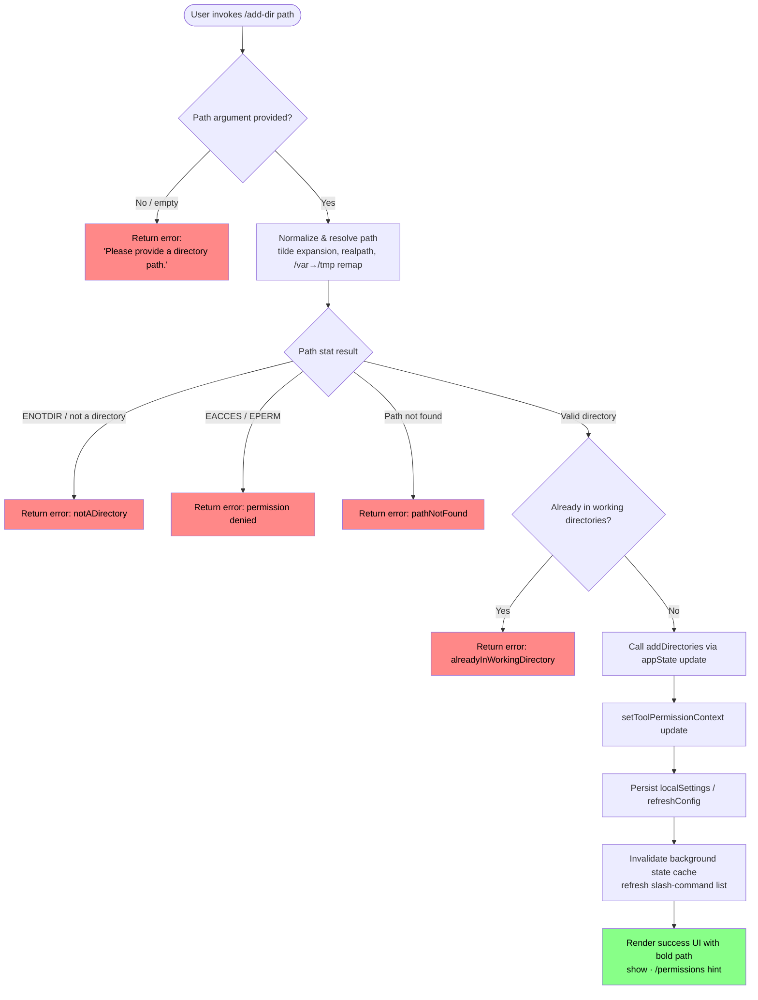

# `/add-dir`

> Analysis basis: CC v2.1.160 bundle.js (AST extraction + Claude interpretation)
> Minimum version: v2.1.160

---

## Overview

`/add-dir` adds a new working directory to the active Claude Code session. It accepts a filesystem path as its argument, validates and resolves the path, then registers it in the session's working-directory list while refreshing tool-permission context and persisting configuration changes. The command performs several layers of path normalization (tilde expansion, symlink resolution, macOS `/var`→`/tmp` remapping) before committing the directory.

---

## Registration

| Field | Value |
|---|---|
| type | `local-jsx` |
| name | `add-dir` |
| description | `Add a new working directory` |
| argumentHint | `<path>` |
| module_id | `$k1` |
| load_inline | `true` |
| loc_byte | `10795886` |
| loc_byte_end | `10796034` |
| loc_line | `7085` |
| arbor_handler.name | `m1f` |
| arbor_handler.fqn | `claude-2.1.160::m1f` |
| arbor_handler.kind | `AsyncFunction` |
| arbor_handler.resolution_path | `module_id` |
| arbor_handler.n_hits | `0` |

Analysis basis: CC v2.1.160 bundle.js:+10795886

---

## Input Branching

Five or more distinct outcome branches exist based on path validation and directory state, so a Mermaid flowchart is used.



Analysis basis: CC v2.1.160 bundle.js:+3813087, +3813185, +3813290, +3813304, +3813330, +3813455, +3813531, +3813616

---

## Behavioral Spec

### 1. Top-level handler (addDirHandler / `m1f`)

```
async function addDirHandler(commandInput, context):
    appState = getAppState(context)

    // Read existing config snapshots
    existingDirs    = appState.workingDirectories          // "working_directory" key
    allowedTools    = appState.allowedTools                // "allowed_tools" key
    disallowedTools = appState.disallowedTools             // "disallowed_tools" key
    avoidPrompts    = appState.avoidPrompts                // "avoid_prompts" key

    rawPath = commandInput.args.trim()

    // Validate and resolve the path
    resolveResult = resolveAndValidatePath(rawPath)        // LlH

    if resolveResult.kind == "emptyPath":
        return renderError("Please provide a directory path.")

    if resolveResult.kind == "notADirectory":
        return renderError(notADirectoryMessage)

    if resolveResult.kind == "pathNotFound":
        return renderError(pathNotFoundMessage)

    if resolveResult.kind == "alreadyInWorkingDirectory":
        return renderError(alreadyInWorkingDirectoryMessage)

    if resolveResult.kind != "success":
        return renderError("Unknown error")                // "Unknown error" literal

    resolvedPath = resolveResult.path

    // Update tool permission context
    setToolPermissionContext(resolvedPath)                 // _.setToolPermissionContext

    // Write addDirectories to persistent settings
    updateAppState("addDirectories", [resolvedPath])       // D$ / "addDirectories" key
    updateLocalSettings("localSettings")                  // "localSettings" key

    // Check --add-dir CLI flag consistency
    if commandLineArgs.includes("--add-dir"):             // "--add-dir" literal
        handleCliAddDirFlag(resolvedPath)

    // Refresh configuration and slash-command index
    XA.refreshConfig()

    // Invalidate background state and rebuild slash-command list
    refreshSlashCommandCache()                            // oa_ → qq9
    refreshSlashCommandIndex()                            // I8H

    // Render success output
    renderSuccess(resolvedPath)                           // bold path + dim "· /permissions to manage"
```

Analysis basis: CC v2.1.160 bundle.js:+10794667, +10794703, +10794750, +10794777, +10794809, +10794824, +10794833, +10794847, +10794861, +10794880, +10794887, +10794921, +10794939

---

### 2. Path resolution and validation (`resolveAndValidatePath` / `LlH`)

```
async function resolveAndValidatePath(rawPath):
    if rawPath is empty or null:
        return { kind: "emptyPath" }                      // "emptyPath" literal

    normalizedPath = normalizePath(rawPath)               // wq — tilde expansion,
                                                          //   null-byte check,
                                                          //   ~/  prefix expansion via os.homedir(),
                                                          //   ZN.resolve for relative paths,
                                                          //   windows path regex normalization

    try:
        stat = await Veq.stat(normalizedPath)
    catch error:
        if error.code == "ENOTDIR":
            return { kind: "notADirectory" }
        if error.code in ["EACCES", "EPERM"]:
            return { kind: "notADirectory" }              // permission errors mapped to notADirectory
        if error.code == "ENOENT" (path not found):
            return { kind: "pathNotFound" }
        return { kind: "pathNotFound" }                   // default fallback

    if not stat.isDirectory():
        return { kind: "notADirectory" }

    // Canonical path after macOS /var→/tmp remap (KI)
    canonicalPath = remapVarTmp(normalizedPath)           // /var/ → /tmp$1 replacement

    if canonicalPath already in existingWorkingDirectories:
        return { kind: "alreadyInWorkingDirectory" }

    return { kind: "success", path: canonicalPath }
```

Analysis basis: CC v2.1.160 bundle.js:+3813087, +3813106, +3813140, +3813185, +3813248, +3813275, +3813290, +3813304, +3813330, +3813391, +3813415, +3813455, +3813531

---

### 3. Path normalization detail (`normalizePath` / `wq`)

```
function normalizePath(rawPath):
    if rawPath contains null bytes:
        throw TypeError("Path contains null bytes")       // "Path contains null bytes" literal

    trimmed = rawPath.trim()
    normalized = RO(trimmed)                              // NFC unicode normalization

    if normalized starts with "~/":                       // "~/" literal
        homedir = os.homedir()
        normalized = join(homedir, normalized.slice(2))

    if platform == "windows":                             // "windows" literal
        normalized = applyWindowsPathRegex(normalized)

    if not ZN.isAbsolute(normalized):
        normalized = ZN.resolve(normalized)               // resolve relative to cwd

    return ZN.normalize(normalized)
```

Analysis basis: CC v2.1.160 bundle.js:+1008142, +1008188, +1008395, +1008429, +1008451, +1008492, +1008510, +1008523, +1008539, +1008561, +1008585, +1008592, +1008603, +1008632, +1008652, +1008706

---

### 4. macOS `/var` → `/tmp` path remapping (`KI`)

```
function remapVarTmp(path):
    // On macOS, /var/folders/... is a symlink to /private/var/...
    // and /tmp is a symlink to /private/tmp.
    // Normalize so both sides of the comparison use the same prefix.
    remapped = path.replace(/\/var\//, "/tmp$1")          // "/var/" → "/tmp$1" literals
    return remapped
```

Analysis basis: CC v2.1.160 bundle.js:+13066371, +13066401, +13066442

---

### 5. App-state update for new directories (`updateAppState` / `D$`)

```
function updateAppStateWithNewDirectory(resolvedPath, currentState):
    // bypassPermissions guard
    if mode == "bypassPermissions" and bypassPermissionsModeDisabled:
        log("Ignoring permission update: setMode 'bypassPermissions' rejected…")
        // short-circuits setMode; continues with addDirectories

    // Merge new path into addDirectories list
    newDirs = currentState.addDirectories ++ [resolvedPath]  // "addDirectories" key
    appState.set("addDirectories", newDirs)

    // Reconcile allow/deny rule sets
    processRuleSet("allow",  "alwaysAllowRules")          // "allow", "alwaysAllowRules" literals
    processRuleSet("deny",   "alwaysDenyRules")           // "deny",  "alwaysDenyRules"  literals
    processRuleSet("ask",    "alwaysAskRules")            //          "alwaysAskRules"   literal

    // Additional operations: addRules, replaceRules, removeRules, removeDirectories
    if "addRules"         in update: applyAddRules()      // "addRules" literal
    if "replaceRules"     in update: applyReplaceRules()  // "replaceRules" literal
    if "removeRules"      in update: applyRemoveRules()   // "removeRules" literal
    if "removeDirectories"in update: applyRemoveDirs()    // "removeDirectories" literal
```

Analysis basis: CC v2.1.160 bundle.js:+4711021, +4711085, +4711363, +4711520, +4711548, +4711556, +4711588, +4711595, +4711613, +4711711, +4712141, +4712368, +4712678, +4712752, +4712980

---

### 6. Slash-command cache invalidation and re-indexing (`oa_` / `qq9` / `I8H`)

```
async function refreshSlashCommandCache():
    // oa_: rewrite the CLAUDE.md / project settings file append
    existingContent = await YL.readFile(cY.join(...), "utf8")
    await YL.mkdir(cY.dirname(...), { recursive: true })
    await YL.appendFile(...)

async function invalidateAndRebuildIndex():
    // qq9: background state invalidation
    Nj()                                                   // OLH.delete — clear old map entry
    result = await rebuildSlashCommandEntries()            // _1 — stat each command file
    persist(result)                                        // z5 — atomic write via randomBytes tmp file

async function rebuildSlashCommandIndex():
    // I8H: rebuild the in-memory slash-command index
    // Filters, maps, and re-populates the command lookup structures
    // used for tab-completion and command routing
    filterActiveCommands()
    mapToIndexEntries()
    updateCommandSet()
```

Analysis basis: CC v2.1.160 bundle.js:+10794880, +10794887, +10794921, +12997461, +12997497, +12997684, +12997780, +12997861, +4130998, +4131016, +4131181, +4713219, +4713298

---

### 7. Background state reader with limits (`rmK`)

```
async function readBackgroundState():
    // Limit: 1000 maximum entries processed  (literal: 1000)
    // Limit: 100  items per batch             (literal: 100)
    entries = await QuH()                                  // enumerate state entries
    if entries.length > 1000:
        entries = entries.slice(0, 1000)
    batches = chunk(entries, 100)
    for batch in batches:
        partial = await R$H(batch)
        results.push(partial)
    byteLength = Buffer.byteLength(serialized)            // byte-length check before write
    if delta present:
        schedule(imK.bind(...), timeout)                   // debounced flush
    O9(results)                                            // emit final merged state
```

Analysis basis: CC v2.1.160 bundle.js:+203736, +203761, +203769, +203798, +203813, +203888, +203905, +203943, +203976, +203993, +204002, +204054, +204073, +204098

---

### 8. Success and error rendering

The success UI renders the resolved path in **bold** followed by a dim hint string `"· /permissions to manage"`. The error path renders one of several distinct messages:

| Outcome code | User-visible text (fragment only) |
|---|---|
| `emptyPath` | `"Please provide a directory path."` |
| `notADirectory` | path-specific not-a-directory message |
| `pathNotFound` | path-specific not-found message |
| `alreadyInWorkingDirectory` | already-registered message |
| generic | `"Did not add a working directory."` |
| unknown | `"Unknown error"` |

Analysis basis: CC v2.1.160 bundle.js:+10795124, +10795232, +10795368, +3813616, +10794939, +10795225

---

## State & Side Effects

| Item | Detail |
|---|---|
| Telemetry | `tengu_feature_sad` (bundle.js:+966258); `tengu_daemon_config_reload` (bundle.js:+15862022); `tengu_bg_state_read_transient` (bundle.js:+4127971) |
| appState changes | `addDirectories` list updated; tool-permission context refreshed via `_.setToolPermissionContext` |
| Config persistence | `XA.refreshConfig()` called; `localSettings` written; CLAUDE.md/project settings file may be appended |
| Slash-command index | Background cache invalidated (`OLH.delete`), entries re-statted and atomically rewritten; in-memory index rebuilt (`I8H`) |
| Daemon | Config-reload telemetry emitted (`tengu_daemon_config_reload`); supervisor loop updated via `Z.stop` / `Z.updateConfig` / `Z.start` |
| Sound | None detected |
| Hook registration | None detected |
| Path limits | Background state reader hard-capped at **1000** entries total, **100** per batch (bundle.js:+204054, +204073) |
| Atomic write | Temp file created with `randomBytes(4).toString("hex")` suffix before `rename` (bundle.js:+2273531, +2273547, +2273559) |

---

## Version History

| Version | Change |
|---|---|
| v2.1.160 | Initial analysis |

---

## Common Mistakes

1. **Providing a file path instead of a directory path** — the command calls `stat` and checks `isDirectory()`; a regular file returns the `notADirectory` error even if the path is otherwise valid.
2. **Providing a path that is already registered** — the command checks the resolved canonical path (after `/var`→`/tmp` remapping) against the existing working-directory list; duplicate additions are silently rejected with `alreadyInWorkingDirectory`.
3. **Using a relative path without a leading `./`** — relative paths are resolved against the current working directory via `path.resolve`, but tilde-only (`~`) without a trailing `/` may not expand as expected; use `~/subdir` form.
4. **Expecting instant slash-command availability** — after `/add-dir` succeeds, the slash-command index rebuild is async; new project-level slash commands from the added directory may take a moment to appear.
5. **Forgetting to check `/permissions`** — the success message explicitly hints `"· /permissions to manage"` (bundle.js:+10795232); tool allow/deny rules for the new directory are not automatically granted.

---

## Appendix — Identifier Mapping

> For bundle debugging only. Identifiers change across versions.

| Identifier | Role |
|---|---|
| `m1f` | Top-level async handler for `/add-dir` (arbor_handler) |
| `N_` | App-state snapshot reader; finds last-known state by key |
| `N` | Core app-state accessor / updater |
| `lmK` | App-state sub-field resolver |
| `SH` | JSON serialization utility |
| `x4` | Path string formatter / truncator |
| `PmH` | Path validation pre-check helper |
| `rmK` | Background state reader with 1000/100 entry limits |
| `o$` | Config object accessor |
| `Ce` | Feature-flag set checker |
| `wj` | String replacement utility |
| `gq` | Model name normalization entry point |
| `GHH` | Model alias expansion helper |
| `K1` | Model identifier canonicalization |
| `yP` | Model name resolution with fallback |
| `t6` | Async delay / timer utility |
| `d` | Low-level async sleep / deferred executor |
| `A` | Generic array/collection helper |
| `f` | File handle / stream abstraction |
| `q` | Secondary file handle / buffer |
| `L` | Set-based resource tracker |
| `Ov8` | Allowed-tools snapshot extractor |
| `zv8` | Disallowed-tools snapshot extractor |
| `eA` | Tool list accessor |
| `D$` | App-state mutation dispatcher (addDirectories, rules) |
| `hM` | Rule string escaper (backslash normalization) |
| `N74` | String replaceAll wrapper |
| `K` | Rule/tool list mapper and formatter |
| `sk` | Session state accessor |
| `D` | Supervisor / daemon process controller |
| `jWH` | Daemon write-config helper |
| `L1` | AsyncLocalStorage store reader |
| `G8` | Promise resolve shorthand |
| `P9A` | Config merge helper |
| `GH` | String coercion wrapper |
| `Z_K` | Config diff / max-length calculator |
| `E` | Keyboard / input event handler |
| `b` | Browser/terminal event object |
| `x0` | Event stop-propagation wrapper |
| `F_` | Full config persistence writer |
| `Z` | Watcher / supervisor lifecycle object |
| `ekK` | Heartbeat emitter |
| `W6H` | Heartbeat interval handler |
| `V` | Secondary watcher lifecycle object |
| `KK6` | Session metadata accessor |
| `oa_` | CLAUDE.md / project-settings file appender |
| `XWH` | Project settings path builder |
| `FH` | String normalization / coercion |
| `c9K` | Environment type checker (`production`/`test`) |
| `ub` | Settings path joiner |
| `RO` | NFC unicode path normalizer |
| `V8` | Promise.resolve shorthand variant |
| `iS` | Locale-aware string comparator |
| `zN` | String locale comparison primitive |
| `Y_` | Locale sort comparator |
| `yH` | Log / error-tracking sink |
| `d_` | Error message extractor |
| `n9` | Log buffer manager |
| `KNA` | Log entry formatter |
| `T14` | Rolling log buffer (shift/push) |
| `qq9` | Background slash-command cache invalidator |
| `Nj` | Cache map delete helper |
| `_1` | Slash-command entry re-stat and rebuild |
| `v5` | File existence / stat shorthand |
| `m6` | JSON.parse wrapper |
| `z5` | Atomic file write coordinator |
| `t3` | Atomic rename writer (randomBytes temp file) |
| `I8H` | In-memory slash-command index rebuilder |
| `AE_` | Command metadata extractor |
| `U79` | Command list builder / filter |
| `PJ6` | Single command entry constructor |
| `b8` | Command type resolver |
| `MUL` | Command path expander |
| `mO` | Command source classifier |
| `I$` | Symlink realpath resolver |
| `d6` | Directory existence check |
| `NX` | Filesystem access validator |
| `zUL` | Command deduplication helper |
| `o3` | Command description formatter |
| `k74` | Description truncation helper |
| `CG` | Object.hasOwn wrapper |
| `y74` | Description sanitizer |
| `I74` | Description replaceAll helper |
| `M` | Plugin / MCP path resolver and validator |
| `qC6` | Plugin name → path resolver with `.staging` check |
| `LlH` | Path validation and stat orchestrator (top-level) |
| `wq` | Path normalizer (tilde, null-byte, windows, resolve) |
| `S6` | AsyncLocalStorage context getter |
| `sF6` | Store-based context reader |
| `Zo` | Directory-already-exists checker |
| `KI` | macOS `/var`→`/tmp` path remapper |
| `AKA` | Path comparison helper |
| `BD` | Case-insensitive path comparator |
| `YQ` | Working-directory membership checker |
| `flH` | Success/error JSX renderer for `/add-dir` |

---

Note: index built via Arbor fallback; some signals (telemetry, literals) may be missing — see arbor-fallback.js.