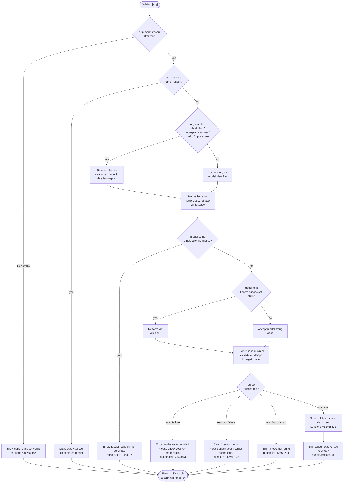

# `/advisor`

> Analysis basis: CC v2.1.160 bundle.js (AST extraction + Claude interpretation)
> Minimum version: v2.1.160

---

## Overview

The `/advisor` command configures the **Advisor Tool**, a feature that allows Claude Code to consult a stronger (typically larger) model at key decision points during a task. The user provides a model name argument; the command validates, normalizes, and stores the selection, then runs a lightweight probe query against the target model to confirm it is reachable before accepting the configuration. The result is rendered as a JSX component in the terminal UI.

---

## Registration

| Field | Value |
|---|---|
| type | `local-jsx` |
| name | `advisor` |
| description | Configure the Advisor Tool to consult a stronger model for guidance at key moments during a task |
| loc_byte | `12476659` |
| loc_byte_end | `12476946` |
| loc_line | `8770` |
| argumentHint | `null` |
| isHidden | `null` |
| module_id | `bt1` |
| load_inline | `true` |
| arbor_handler.name | `LGf` |
| arbor_handler.fqn | `claude-2.1.160::LGf` |
| arbor_handler.kind | `AsyncFunction` |
| arbor_handler.resolution_path | `module_id` |
| arbor_handler.n_hits | `1` |

Analysis basis: CC v2.1.160 bundle.js:+12476659

---

## Input Branching

The command has more than three distinct paths (empty argument, special alias keywords, known model shortcuts, unknown string, validation/network failure) and therefore requires a flowchart.



---

## Behavioral Spec

### 1 — Top-level handler (advisorCommandHandler / `LGf`)

The handler is an `AsyncFunction` resolved via `module_id` → `bt1` with Arbor symbol `LGf`.

```
async function advisorCommandHandler(rawArgument, appContext):
    trimmedArg = rawArgument.trim()                     // bundle.js:+12476115

    if trimmedArg is empty:
        return renderCurrentAdvisorStatus(appContext)   // JSX via _P.createElement  bundle.js:+12476151

    if trimmedArg == "off" or trimmedArg == "unset":    // bundle.js:+12476191, +12476202
        disableAdvisorTool(appContext)
        return renderDisabledConfirmation()

    resolvedModel = resolveModelAlias(trimmedArg)       // K1  bundle.js:+12476269

    validatedModel = runModelValidationProbe(           // Cy8 bundle.js:+12476283
                         resolvedModel, appContext)

    // On success, validatedModel is stored; on failure an error JSX is returned.
    return renderAdvisorResult(validatedModel)          // H  bundle.js:+12476309
```

Analysis basis: CC v2.1.160 bundle.js:+12476115

---

### 2 — Model alias resolution (`resolveModelAlias` / `K1`)

`K1` accepts a raw string and returns a canonical model identifier. It handles a fixed set of short keywords and normalises the string.

```
function resolveModelAlias(input):
    s = input.trim()                        // bundle.js:+2233677
    s = s.toLowerCase()                     // bundle.js:+2233688

    if s matches known alias in zKH set:    // bundle.js:+2233752  (DKH check)
        // e.g. "opusplan", "sonnet", "haiku", "opus", "best"
        // bundle.js:+2233773, +2233814, +2233853, +2233892, +2233929
        return expandedModelId

    s = s.replace(whitespace patterns, ...)  // bundle.js:+2233716
    s = applyShortModelExpansion(s)          // xM  bundle.js:+2233961
    s = applyProviderScopeCheck(s)           // xa6 bundle.js:+2233967

    // Special [1m] marker handling
    if s contains "[1m]":                    // bundle.js:+2233799
        s = stripMarker(s)

    return s
```

Shorthand alias literals in the alias map:
- `"opusplan"` → bundle.js:+2233773
- `"sonnet"` → bundle.js:+2233814
- `"haiku"` → bundle.js:+2233853
- `"opus"` → bundle.js:+2233892
- `"best"` → bundle.js:+2233929

Analysis basis: CC v2.1.160 bundle.js:+2233677

---

### 3 — Model validation probe (`runModelValidationProbe` / `Cy8`)

A lightweight probe is sent to the target model to verify reachability and authentication before the advisor setting is committed.

```
async function runModelValidationProbe(modelId, appContext):
    modelId = modelId.trim()               // bundle.js:+12468337

    if modelId is empty:
        throw Error("Model name cannot be empty")  // bundle.js:+12468374

    // Check whether modelId is already cached / known
    if yt1.has(modelId):                   // bundle.js:+12468618
        return getCached(modelId)

    // Build a minimal "Hi" message for validation
    // Uses lQ (buildModelQueryMessages) with a short probe body
    messages = buildModelQueryMessages(    // lQ  bundle.js:+12468408
                   modelId, probeText="Hi") // bundle.js:+12468782

    // Normalise model id to lowercase and check known-exclusion set zKH
    normalised = modelId.toLowerCase()     // bundle.js:+12468497
    if normalised in zKH exclusion set:    // bundle.js:+12468516
        return errorResult("model excluded")

    // Send probe via main API dispatch (Uu)
    result = await dispatchAdvisorProbeRequest(messages, appContext)  // Uu bundle.js:+12468663

    switch result.errorType:
        case "auth_failure":
            return error("Authentication failed. Please check your API credentials.")
                                           // bundle.js:+12469073
        case "network_error":
            return error("Network error. Please check your internet connection.")
                                           // bundle.js:+12469175
        case "not_found_error":            // bundle.js:+12469294
            if result.message contains "model:":  // bundle.js:+12469376
                return error("Model not found: " + modelId)
        case "ephemeral_cache":            // bundle.js:+12468807
            // treat as cache hint, continue
        default:
            // success path

    // Set cache entry for validated model
    yt1.set(modelId, validatedResult)      // bundle.js:+12468826

    // Run post-validation alias expansion for known opus variants
    // (opus-4-8, opus-4-7, opus-4-6, opus-4-5)  bundle.js:+12469643..+12469874
    // and sonnet variants (sonnet-4-6, sonnet-4-5) bundle.js:+12469919..+12470020
    finalModel = resolveVersionedAlias(    // rEf bundle.js:+12468867
                     modelId, validatedResult)

    return finalModel
```

Versioned alias literals detected within `rEf` / `oEf`:

| Hyphenated form | Underscore form | loc_byte |
|---|---|---|
| `opus-4-8` | `opus_4_8` | +12469643 / +12469667 |
| `opus-4-7` | `opus_4_7` | +12469712 / +12469736 |
| `opus-4-6` | `opus_4_6` | +12469781 / +12469805 |
| `opus-4-5` | `opus_4_5` | +12469850 / +12469874 |
| `sonnet-4-6` | `sonnet_4_6` | +12469919 / +12469945 |
| `sonnet-4-5` | `sonnet_4_5` | +12469994 / +12470020 |

Analysis basis: CC v2.1.160 bundle.js:+12468337

---

### 4 — API dispatch for probe request (`dispatchAdvisorProbeRequest` / `Uu`)

`Uu` is the general-purpose API dispatch function reached from the validation probe. It manages authentication headers, provider negotiation, and streaming response handling before returning a normalised result.

Key behaviours observed in the call graph:

```
async function dispatchAdvisorProbeRequest(messages, context):
    // Build per-request headers including session IDs
    // "X-Claude-Code-Session-Id"  bundle.js:+2957941
    // "x-app": "cli"              bundle.js:+2957917
    // "side_query"                bundle.js:+13283575 (marks this as a side query)

    // Determine auth method (OAuth, API key, proxy helper)
    token = getAuthToken(context)           // ZU/E.getToken  bundle.js:+2962375

    // Resolve model provider: bedrock, foundry, anthropicAws, mantle, vertex, firstParty
    // bundle.js:+2047861..+2048078

    // Apply cache-control hint if "1h" cache config is active
    // tengu_prompt_cache_1h_config  bundle.js:+13244382

    // Dispatch fetch with AbortSignal.timeout(10000)
    // bundle.js:+2285351 (10 s probe timeout)

    // On success emit tengu_api_success
    // bundle.js:+13285028

    return normalisedResult
```

Analysis basis: CC v2.1.160 bundle.js:+13283575

---

### 5 — Message builder for probe (`buildModelQueryMessages` / `lQ`)

`lQ` constructs the minimal message array sent during model validation.

```
function buildModelQueryMessages(modelId, probeText):
    // Start with base message from ZA (system context builder)
    // bundle.js:+2227582
    messages = baseSystemMessages()

    // Map over configured context entries, trimming each
    // bundle.js:+2227659, +2227670, +2227696

    // Check whether modelId starts with "anthropic."
    // bundle.js:+2227735
    if modelId.startsWith("anthropic."):
        // Bedrock-style scoped model; apply provider prefix rules

    // Apply DKH exclusion check and K1 alias resolution
    // bundle.js:+2227914, +2227928

    // Append probe user message
    messages.push({ role: "user", content: probeText })

    return messages
```

Analysis basis: CC v2.1.160 bundle.js:+2227582

---

### 6 — Off / unset path

When the argument is exactly `"off"` or `"unset"` (bundle.js:+12476191, +12476202), the handler skips all validation and directly clears the advisor model setting in application state, then returns a confirmation JSX element. No network call is made.

---

### 7 — JSX result rendering

The command is of type `local-jsx`, meaning the return value of `LGf` is a React element created via `_P.createElement` (bundle.js:+12476151). The element may include the validated model name joined with `", "` (bundle.js:+12476435) and a list of currently active model names from `BrH.join` (bundle.js:+12476426).

---

## State & Side Effects

| Item | Detail |
|---|---|
| Telemetry — `tengu_feature_sad` | Fired after successful advisor configuration (bundle.js:+966258) |
| Telemetry — `tengu_api_success` | Fired on successful probe API call (bundle.js:+13285028) |
| Telemetry — `tengu_prompt_cache_1h_config` | Fired when 1-hour prompt cache config is active during probe (bundle.js:+13244382) |
| Advisor model cache (`yt1`) | `yt1.set(modelId, result)` persists the validated model to an in-memory cache (bundle.js:+12468826); `yt1.has(modelId)` short-circuits repeat validations (bundle.js:+12468618) |
| App state — advisor model | Updated on success; cleared on `off`/`unset` |
| Network | One outbound API probe request per unique model name; uses `AbortSignal.timeout(10000)` (bundle.js:+2285351) |
| Sound | None detected in depth-2 traversal |
| Hook registration | None detected in depth-2 traversal |
| Console output | `console.error` paths reachable via `KDH` (bundle.js:+2957443) and `sl6` (bundle.js:+1780262) for auth/proxy errors |

---

## Version History

| Version | Change |
|---|---|
| v2.1.160 | Initial analysis |

---

## Common Mistakes

1. **Passing a model string with extra whitespace** — the handler trims the argument, but an argument that is *only* whitespace is treated as empty, resulting in the usage/status display rather than an error or configuration change.
2. **Using a hyphenated alias without checking the versioned-alias table** — the command internally remaps hyphenated forms (e.g. `opus-4-8`) to underscore forms. Providing a partially formed version string that does not match any entry will be sent verbatim to the API and may fail with a `not_found_error`.
3. **Expecting instant effect without a network round-trip** — unlike toggle commands, `/advisor` always makes a probe API call to validate the model before saving. In low-connectivity environments or behind strict firewalls the command will fail even for valid model names.
4. **Trying `/advisor off` to temporarily pause and then restore** — `off`/`unset` clears the setting entirely; there is no "pause" mode. To restore, the user must re-run `/advisor <model>`.
5. **Assuming short aliases are stable** — `opusplan`, `sonnet`, `haiku`, `opus`, and `best` are resolved at runtime via the alias map `K1`. Their canonical targets may change in future bundle versions without the alias strings changing.

---

## Appendix — Identifier Mapping

> For bundle debugging only. Identifiers change across versions.

| Identifier | Role |
|---|---|
| `LGf` | Top-level async handler for `/advisor` command |
| `K1` | Model alias resolution function |
| `Cy8` | Model validation probe orchestrator |
| `lQ` | Probe message array builder |
| `Uu` | General API dispatch / side-query sender |
| `ZU` | Core API request builder (headers, auth, provider) |
| `rEf` | Post-validation versioned alias resolver (outer) |
| `oEf` | Post-validation versioned alias resolver (inner, iterates alias table) |
| `_26` | Secondary model-id normaliser (lowercase + includes check) |
| `H` | Context/state accessor reached from handler |
| `N` | Context fetch / bootstrap helper |
| `lmK` | Debug-level logging helper |
| `SH` | JSON serialisation utility |
| `x4` | Model string redaction/sanitisation helper (`[REDACTED]`) |
| `PmH` | Prompt construction helper (`ZwA`) |
| `rmK` | File-backed model configuration reader |
| `wj` | String replacement utility |
| `gq` | Model query composition helper |
| `GHH` | Sub-query builder (DN, p9H, ZA, lQ) |
| `yP` | Alternate query builder |
| `C0` | Model token / string conversion (`wKH`) |
| `wKH` | String-to-model-token mapper |
| `FH` | String coercion primitive |
| `DKH` | Known-model exclusion set check (`zKH`) |
| `dN` | Model descriptor builder |
| `xM` | Model object constructor |
| `jA` | Provider factory / base model builder |
| `Jf` | Model registry lookup |
| `km4` | Registry entry resolver |
| `i4q` | Registry object-entries iterator |
| `tr6` | Model list searcher |
| `_gH` | Registry delegator to `Jf` |
| `tT` | Composite model resolver (xM + Jf + jA) |
| `XDq` | Alias-table wrapper around `tT` |
| `xa6` | Provider-scope inclusion check (`Ss4`) |
| `AgH` | Model-name formatter |
| `er6` | Object-entries iterating context helper |
| `l_` | Registry base iterator |
| `HgH` | Model inclusion filter (`Is4`) |
| `PDq` | Model index-of searcher |
| `ks4` | Model includes + alias resolver |
| `ys4` | Starts-with model alias resolver |
| `JDq` | `startsWith` check for model prefix |
| `M` | Plugin/file path resolver |
| `qC6` | Plugin name sanitiser / path validator |
| `K` | Column padder (terminal display) |
| `Tw` | Async-local store getter (`TDq`) |
| `d$L` | Stream line splitter |
| `N9` | OzH context accessor |
| `Rr` | OAuth token refresher (`ua6`) |
| `y6` | Timezone/locale resolver (`zN`) |
| `K4_` | URL encoder for model identifiers |
| `E3` | Additional-protection header builder (`QO_`) |
| `VDq` | Boolean coercion for feature flags |
| `bD` | API key / auth credential resolver |
| `n3` | Retry/back-off state holder |
| `g$L` | Cache-control header builder |
| `x_` | Request context accessor |
| `sl6` | Proxy-auth helper executor |
| `o$L` | HTTP response stream parser (SSE/event-stream) |
| `WY` | Message formatter for API payload |
| `nz` | OAuth credential refresh handler |
| `Q$L` | Streaming response accumulator |
| `wzH` | Rate-limit / back-off scheduler |
| `DU8` | Timestamp sampler (`Date.now`) |
| `lz6` | Header case-normaliser |
| `KDH` | SDK error logger (`console.error`) |
| `u68` | Model-context resolver (gX, gq, aq, YN) |
| `S` | Daemon write/render helper |
| `h` | Focus/blur state tracker |
| `I` | Away-summary generator |
| `Z` | Request de-duplicator |
| `l0H` | Model prefix finder (`ibK`) |
| `$W` | Error boundary wrapper (`e3`) |
| `hJ` | OAuth session manager |
| `JzH` | WIF token-exchange handler |
| `JgH` | WIF credentials resolver / fetcher |
| `E` | Remote-control startup handler |
| `P` | Daemon IPC message pump |
| `J` | IPC frame decoder |
| `w` | Background worker session manager |
| `i5` | IPC write helper |
| `k85` | Daemon protocol handler (all message types) |
| `GH` | String coercion wrapper |
| `qVH` | Model pre-flight checker (claude-3, opus-4, sonnet-4) |
| `aq` | Model capability/alias resolver |
| `vy` | jA-based model validator |
| `T` | MCP transport list |
| `kCf` | Advisor model finder (find in H, find in A) |
| `UKA` | SHA-256 hash builder |
| `pa6` | Session-context builder |
| `E1` | String formatter primitive |
| `ua6` | Async-local store reader (`ZDq`) |
| `XA8` | jA-based request annotator |
| `NkH` | Main-thread API call orchestrator |
| `EA` | API result post-processor (bD, IR, mq) |
| `cU8` | Thread label helper |
| `W6` | UI repaint / state-change notifier |
| `lU8` | Endpoint-suffix checker |
| `VV` | HIPAA/compliance flag resolver |
| `bO_` | jA-based compliance builder |
| `AVH` | FH + nK_ compliance formatter |
| `Y4K` | Unknown — not resolved at depth 2 |
| `n68` | Temperature / Cr parameter builder |
| `UX` | Message content mapper |
| `RYH` | Response validator / randomBytes stamper |
| `kU` | Nonce generator (randomBytes, R6) |
| `fL` | Response finaliser (bD, R6) |
| `Y$H` | Unknown — not resolved at depth 2 |
| `uP6` | Agent-type dispatcher (d39, piH, xP6) |
| `d39` | tQL / yH agent-context builder |
| `piH` | Agent profile resolver |
| `xP6` | Custom agent dispatcher (piH, Pf8) |
| `vc` | Agent-prefix router (sQL, h8H, yH) |
| `sQL` | Built-in agent resolver (startsWith, slice) |
| `h8H` | Thread-type prefix checker |
| `yH` | Log / error writer (d_, FH, n9, T14) |
| `b16` | Unknown — not resolved at depth 2 |

---

*Note: index built via Arbor fallback; some signals (telemetry, literals) may be missing — see arbor-fallback.js.*