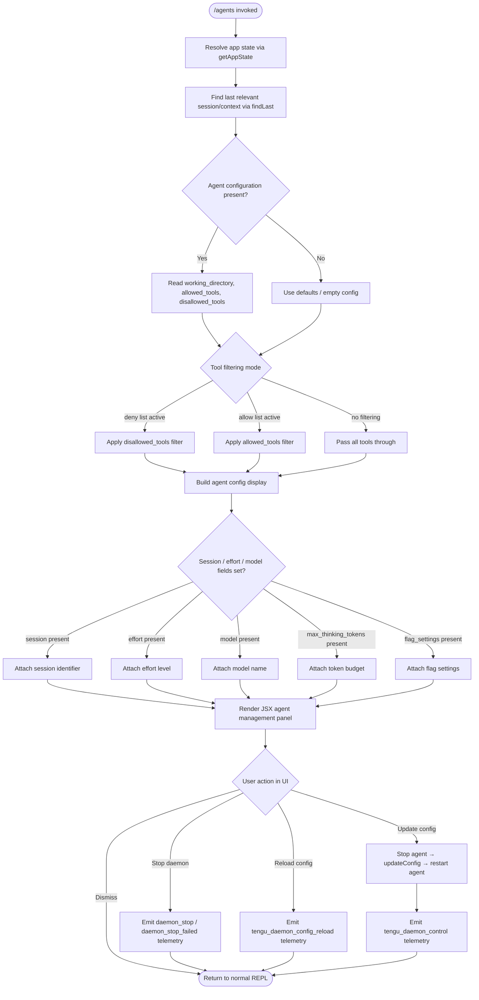

# `/agents`

> Analysis basis: CC v2.1.160 bundle.js (AST extraction + Claude interpretation)
> Minimum version: v2.1.160

---

## Overview

The `/agents` command provides a management interface for agent configurations in Claude Code. It allows users to inspect, configure, and control agent instances — including their working directories, tool allowlists/denylists, model settings, and session parameters. The command renders a JSX-based UI component and coordinates with the daemon layer to apply or reload configurations.

---

## Registration

| Field | Value |
|---|---|
| type | `local-jsx` |
| name | `agents` |
| description | `Manage agent configurations` |
| loc_byte | `12405686` |
| loc_byte_end | `12405811` |
| loc_line | `8739` |
| module_id | `aa1` |
| load_inline | `true` |
| arbor_handler.name | `uTf` |
| arbor_handler.fqn | `claude-2.1.160::uTf` |
| arbor_handler.kind | `AsyncFunction` |
| arbor_handler.resolution_path | `module_id` |
| arbor_handler.n_hits | `0` |

Analysis basis: CC v2.1.160 bundle.js:+12405686

---

## Input Branching

The command involves more than three distinct execution paths across agent configuration lookup, tool filtering, daemon lifecycle management, and session/model settings. A Mermaid flowchart is used.



Analysis basis: CC v2.1.160 bundle.js:+12405537 (handler entry `uTf`), +10792430 (`getAppState`), +10792510 (`findLast`), +10792590 (tool fields), +15861626 (`updateConfig`), +15862022 (reload telemetry)

---

## Behavioral Spec

### 1. Handler Entry Point

The primary handler is the async function `uTf` (Arbor-resolved, `resolution_path: module_id`). On invocation it:

1. Calls the agent-context resolver (`N_`) to obtain the current session context and app state.
2. Calls the JSX renderer (`Rv`) to build the management panel.
3. Calls `$AA.createElement` to mount the component into the CLI render tree.

```
async function agentsCommandHandler(context):
    sessionContext = resolveAgentContext(context)        // N_
    panelElement  = buildAgentManagementPanel(context)   // Rv
    return createElement(panelElement)                   // $AA.createElement
```

Analysis basis: CC v2.1.160 bundle.js:+12405537, +12405545, +12405558

---

### 2. Agent Context Resolution (`N_`)

Retrieves the active app state and searches the session list for the most recent matching entry.

```
function resolveAgentContext(context):
    appState = H.getAppState()                          // +10792430
    lastSession = appState.sessions.findLast(           // +10792510
        s => s matches current context
    )

    config = {}
    if lastSession has "working_directory":
        config.workingDirectory = lastSession["working_directory"]   // +10792535
    if lastSession has "allowed_tools":
        config.allowedTools = lastSession["allowed_tools"]           // +10792590
    if lastSession has "disallowed_tools":
        config.disallowedTools = lastSession["disallowed_tools"]     // +10792645
    if lastSession has "avoid_prompts":
        config.avoidPrompts = lastSession["avoid_prompts"]           // +10792706
    if lastSession has "session":
        config.session = lastSession["session"]                      // +10793005
    if lastSession has "effort":
        config.effort = lastSession["effort"]                        // +10793030
    if lastSession has "model":
        config.model = lastSession["model"]                          // +10793043
    if lastSession has "max_thinking_tokens":
        config.maxThinkingTokens = lastSession["max_thinking_tokens"] // +10793055
    if lastSession has "flag_settings":
        config.flagSettings = lastSession["flag_settings"]           // +10793081

    agentListFetch = fetchAgentBootstrap(appState)      // Ov8 / zv8 → eA
    return { config, agentListFetch }
```

Analysis basis: CC v2.1.160 bundle.js:+10792430, +10792510, +10792608, +10792666

---

### 3. Bootstrap / Agent List Fetch (`Ov8`, `zv8`)

Two related fetch helpers (`Ov8` and `zv8`) both delegate to a shared fetch executor (`eA`). These retrieve the remote agent list or status during panel initialization. The bootstrap fetch uses:

- HTTP header `Content-Type: application/json` (bundle.js:+15451900)
- HTTP header `User-Agent` (bundle.js:+15451919)
- Log prefix `"[Bootstrap] Fetching"` on start (bundle.js:+15451800)
- Log prefix `"[Bootstrap] Fetch ok"` on success (bundle.js:+15452164)
- A 5000 ms timeout constant (bundle.js:+15451991)
- Telemetry event `api_bootstrap_fetch` with a `parse_failed` sub-status on parse error (bundle.js:+15452112, +15452134)

```
async function fetchAgentBootstrap(appState):
    log("[Bootstrap] Fetching")
    response = await httpGet(agentsEndpoint, {
        headers: {
            "Content-Type": "application/json",
            "User-Agent": buildUserAgent()
        },
        timeout: 5000
    })
    if parse fails:
        emit telemetry("api_bootstrap_fetch", { status: "parse_failed" })
        return null
    log("[Bootstrap] Fetch ok")
    return response.data
```

Analysis basis: CC v2.1.160 bundle.js:+15451798, +15451885, +15451900, +15451919, +15451991, +15452112, +15452134, +15452164

---

### 4. Agent Management Panel Renderer (`Rv`)

Builds the full JSX panel. It:

1. Collects the active tool set and determines feature flags.
2. Checks whether the `allow_workflows` feature is enabled (bundle.js:+4147754).
3. Checks `allow_product_feedback` flag (bundle.js:+4146460).
4. Applies environment/platform guards — e.g., `windows` platform check (bundle.js:+4871648).
5. Assembles sub-components: header, config table, action buttons.
6. Registers keyboard / event handlers via `lc_` and `nc_` for navigation and submission.

```
function buildAgentManagementPanel(props):
    appState = getAppState()
    toolList = collectTools(props)               // rAH, _v6

    featureFlags = {
        workflowsEnabled: checkFeature("allow_workflows"),   // Xq9 → G9
        feedbackEnabled:  checkFeature("allow_product_feedback"),
        isWindows:        platform == "windows"
    }

    components = []
    components.push(renderHeader(props))         // Q0, FH, E1
    components.push(renderConfigTable(props))    // Z_K, jWH
    components.push(renderActionButtons(props, featureFlags))  // W4, nc_, Cs

    registerKeyHandlers(components)              // lc_, G_
    registerNavigationHandlers(components)       // nc_, EH6

    return createElement("agents-panel", components)
```

Analysis basis: CC v2.1.160 bundle.js:+9719858, +9719897, +9719984, +9719998, +9720020, +9720035, +9720047, +9720107, +9720207

---

### 5. Tool Filtering Logic (`N` / `lmK`)

Tool names are normalised (uppercased at +204349, trimmed at +204372) before matching. The `lmK` helper applies include/exclude logic:

- Index starts at `1` for valid tool entries (literal `1` at +202870).
- The `debug` label is applied during inspection mode (literal `"debug"` at +204223).
- Blocked tools are tracked under the key `"blocked"` (bundle.js:+9719260).
- Tool source types `"cliArg"` and `"toolsNarrowing"` are distinguished (bundle.js:+10502269, +10502290).
- Denied tools carry a `"deny"` marker (bundle.js:+10501683).

```
function filterTools(toolList, config):
    result = []
    for tool in toolList:
        normalized = tool.name.toUpperCase().trim()
        if config.disallowedTools.includes(normalized):
            tool.status = "blocked"
            continue
        if config.allowedTools is non-empty AND NOT allowedTools.includes(normalized):
            tool.status = "deny"
            continue
        result.push({ ...tool, index: result.length + 1 })
    return result
```

Analysis basis: CC v2.1.160 bundle.js:+204223, +204247, +204265, +204287, +204305, +204349, +204372, +204388

---

### 6. Daemon Lifecycle Actions (`D` — supervisor component)

When the user selects a lifecycle action in the panel:

- **Stop**: calls `Z.stop()` (bundle.js:+15861617); on success emits `tengu_daemon_control`; on failure emits `daemon_stop_failed` string (bundle.js:+15883509).
- **UpdateConfig**: calls `Z.updateConfig()` (bundle.js:+15861626).
- **Start**: calls `Z.start()` or `V.start()` (bundle.js:+15861644, +15861802).
- **Reload**: triggers `ekK` heartbeat path (bundle.js:+15861746) and emits `tengu_daemon_config_reload` (bundle.js:+15862022).
- Column widths in the config table are padded to `40` characters (literal `40` at bundle.js:+15873361) with two-space separators (`"  "` at +15871390).
- `ENOENT` errors during file reads are silently swallowed (bundle.js:+12749416).

```
async function supervisorActionHandler(action, agentId, newConfig):
    match action:
        case "stop":
            await daemonProcess.stop()
            agentRegistry.delete(agentId)
            emit("daemon_stop")
            emit("tengu_daemon_control")

        case "update_config":
            daemonProcess.stop()
            daemonProcess.updateConfig(newConfig)
            daemonProcess.start()
            emit("tengu_daemon_config_reload")

        case "start":
            daemonProcess.start()
            agentRegistry.set(agentId, daemonProcess)

        case "restart":
            // stop → updateConfig → start sequence
            await supervisorActionHandler("update_config", agentId, newConfig)
```

Analysis basis: CC v2.1.160 bundle.js:+15861617, +15861626, +15861644, +15861746, +15861791, +15861802, +15862020, +15862022, +15883472, +15883509

---

### 7. Model / Tier Resolution (`gq`, `K1`)

Model names are normalized via `K1` (lowercase + trim + alias expansion):

- Known tier aliases resolved: `"opusplan"` (bundle.js:+2233773), `"[1m]"` (bundle.js:+2233799), `"sonnet"` (bundle.js:+2233814), `"haiku"` (bundle.js:+2233853), `"opus"` (bundle.js:+2233892), `"best"` (bundle.js:+2233929).

```
function resolveModelName(rawName):
    normalized = rawName.trim().toLowerCase()
    aliasMap = {
        "opusplan": <internal-plan-model>,
        "[1m]":     <internal-1m-model>,
        "sonnet":   <sonnet-model-id>,
        "haiku":    <haiku-model-id>,
        "opus":     <opus-model-id>,
        "best":     <best-available-model>
    }
    return aliasMap[normalized] ?? normalized
```

Analysis basis: CC v2.1.160 bundle.js:+2233677, +2233688, +2233773, +2233799, +2233814, +2233853, +2233892, +2233929

---

### 8. Agent Teams / SDK Type Routing (`Cs` / `p9`)

The `--agent-teams` CLI flag (bundle.js:+5435494) gates a separate routing path. SDK connection types distinguished:

- `"sdk-ts"` (bundle.js:+5308246)
- `"sdk-py"` (bundle.js:+5308260)
- `"sdk-cli"` (bundle.js:+5308274)
- `"local-agent"` (bundle.js:+5308289)

Workflow types include `"standard"` (bundle.js:+10091089), `"tst"` (bundle.js:+10091168), and `"tst-auto"` (bundle.js:+10091218).

```
function routeAgentConnection(sdkType, workflowType):
    if sdkType in ["sdk-ts", "sdk-py", "sdk-cli"]:
        return connectRemoteSDK(sdkType)
    if sdkType == "local-agent":
        return connectLocalAgent(workflowType)
    // workflowType selects: "standard" | "tst" | "tst-auto"
```

Analysis basis: CC v2.1.160 bundle.js:+5308174, +5308246, +5308260, +5308274, +5308289, +5435494, +10091089, +10091168, +10091218

---

### 9. Daemon Status File

A status file `"daemon.status.json"` (bundle.js:+12564713) is read during panel load. Its content is serialized via `JSON.stringify` (bundle.js:+183798) for display. The path is constructed by joining a directory path array (`oHK.join`, bundle.js:+12564699) and reading via `n8` (bundle.js:+12564708). The timestamp is captured with `Date.now` (bundle.js:+12564825).

```
function readDaemonStatus(basePath):
    statusPath = path.join(basePath, "daemon.status.json")
    raw = readFile(statusPath)
    if raw is null:
        return {}
    return JSON.parse(raw)
```

Analysis basis: CC v2.1.160 bundle.js:+12564699, +12564708, +12564713, +12564825

---

### 10. Process Shutdown Path (`_p`)

A graceful shutdown sequence is reachable from the panel's stop action:

- Uses `Promise.race` (bundle.js:+15878559) and `Promise.all` (bundle.js:+15878573).
- Calls `O4H.shutdown` on the MCP server (bundle.js:+3217609).
- Timeout of `500` ms before forced `process.exit` (bundle.js:+15878601, +15878640).
- `clearTimeout` called on cleanup (bundle.js:+3254436).
- AbortController uses `"aborted"` / `"abort"` status strings (bundle.js:+2283078, +2283156).

```
async function gracefulShutdown():
    await Promise.race([
        Promise.all([mcpServer.shutdown(), ...cleanupTasks]),
        delay(500)                    // forced timeout
    ])
    clearTimeout(activeTimer)
    process.exit(0)
```

Analysis basis: CC v2.1.160 bundle.js:+15878559, +15878573, +15878586, +15878591, +15878598, +15878601, +15878640

---

## State & Side Effects

| Item | Detail |
|---|---|
| Telemetry: `tengu_feature_ok` | Emitted on successful feature gate check (bundle.js:+966123) |
| Telemetry: `tengu_feature_bad` | Emitted on feature gate failure (bundle.js:+966181) |
| Telemetry: `tengu_feature_sad` | Emitted on unexpected feature gate error (bundle.js:+966258) |
| Telemetry: `tengu_slate_harbor` | Emitted during agent connection routing (bundle.js:+4752888) |
| Telemetry: `tengu_daemon_config_reload` | Emitted when daemon config is reloaded/restarted (bundle.js:+15862022) |
| Telemetry: `tengu_workflows_enabled` | Emitted when `allow_workflows` feature flag is active (bundle.js:+4147955) |
| Telemetry: `tengu_cobalt_ridge` | Emitted on Windows-platform agent path (bundle.js:+4871742) |
| Telemetry: `tengu_daemon_control` | Emitted after daemon stop/start control actions (bundle.js:+15883547) |
| Telemetry: `tengu_amber_flint` | Emitted during agent-teams routing (bundle.js:+5435606) |
| Daemon status file | Reads `daemon.status.json` from the configured base path |
| App state mutation | `getAppState()` read; daemon registry (`f.set`, `f.delete`, `f.get`) mutated on start/stop |
| JSX render | Mounts a `local-jsx` component into the CLI render tree via `$AA.createElement` |
| Heartbeat | A heartbeat timer (`"heartbeat"` at +15860450) is managed by `ekK` / `W6H` during panel lifetime |
| Temp file cleanup | `ykK.unlinkSync` called during session close (bundle.js:+15825505) |
| UUID generation | `zY_.randomUUID` used for new agent session IDs (bundle.js:+3217763) |
| Sound | <!-- TODO: not found in depth-2 traversal; needs --depth 4 --> |

---

## Version History

| Version | Change |
|---|---|
| v2.1.160 | Initial analysis |

---

## Common Mistakes

1. **Assuming `/agents` is a prompt command.** It is registered as `local-jsx`, meaning it renders an interactive panel — not a text prompt sent to the model. Configuration changes take effect through daemon lifecycle calls, not model inference.

2. **Ignoring tool-name normalization.** Tool names are upper-cased and trimmed before being matched against `allowed_tools` / `disallowed_tools`. Entries with mixed case or leading/trailing whitespace in configuration files may silently fail to match.

3. **Confusing `effort`, `model`, and `max_thinking_tokens` fields.** All three are optional and independent. Setting `model` does not automatically adjust `max_thinking_tokens`; they must be configured separately in the agent configuration.

4. **Expecting immediate effect after config update.** The update sequence is `stop → updateConfig → start`; there is a brief window where the agent is unavailable. Callers should not assume the agent is immediately responsive after sending the update action.

5. **Overlooking the 5000 ms bootstrap fetch timeout.** If the remote agent-list endpoint is unreachable, the panel will still render but the agent list will be empty after the timeout expires. This is not an error state — it is expected fallback behaviour.

6. **Assuming `/agents` works identically on Windows.** The `windows` platform guard triggers a separate code path (`tengu_cobalt_ridge` telemetry), which may omit features available on POSIX platforms.

---

## Appendix — Identifier Mapping

> For bundle debugging only. Identifiers change across versions.

| Identifier | Role |
|---|---|
| `uTf` | Primary async handler for `/agents` command (Arbor-resolved entry point) |
| `N_` | Agent context resolver — reads app state and extracts session config fields |
| `H` | App state / bootstrap fetch host object |
| `N` | Tool name normalizer and filter logic |
| `lmK` | Tool list builder — applies include/exclude rules and assigns indices |
| `SH` | JSON serializer helper (wraps `JSON.stringify`) |
| `x4` | String manipulation utility (replace, slice, lastIndexOf) |
| `PmH` | Prompt/config field extractor (`ZwA` delegate) |
| `rmK` | Agent config file reader — path resolution, byte-length check, async read |
| `o$` | App state sub-accessor |
| `Ce` | Feature-flag set membership checker (`F64.has`) |
| `wj` | String replacement helper |
| `gq` | Model name router — dispatches to normalizer and tier resolver |
| `GHH` | Model resolution coordinator (`DN`, `p9H`, `ZA`, `lQ` delegates) |
| `K1` | Model name normalizer (trim, lowercase, alias expansion) |
| `yP` | Model tier picker (delegates to `K1` and `R0`) |
| `t6` | UI utility / display helper |
| `d` | Base render/display primitive |
| `A` | Session/file record object |
| `f` | File or stream handle |
| `q` | Secondary handle / temp-file manager |
| `L` | Resource lifecycle manager (add/delete/finally) |
| `Ov8` | Bootstrap fetch variant A (delegates to `eA`) |
| `eA` | Shared fetch executor |
| `zv8` | Bootstrap fetch variant B (delegates to `eA`) |
| `Rv` | Agent management panel JSX builder |
| `FH` | Text/label formatter |
| `Q0` | Header sub-component renderer |
| `gQ` | Header graphic/icon element |
| `E1` | String coercion utility |
| `W6` | Feature-flag evaluator with deduplication set |
| `HY6` | Feature flag constant A |
| `_Y6` | Feature flag constant B |
| `px` | Flag evaluation helper |
| `HA8` | Flag cache manager (`jY_` set, `WDH` map) |
| `R6` | Flag record constructor (timestamps, `Date.now`) |
| `D` | Supervisor/daemon management component |
| `jWH` | Config table row renderer |
| `L1` | Async-local store accessor (`vyL.getStore`) |
| `G8` | Config table sub-renderer |
| `P9A` | Table row formatter delegate (`J9A`) |
| `GH` | String coercion for table cells |
| `K` | Column-pad utility (`padEnd` to 40 chars) |
| `Z_K` | Config table layout calculator (`Math.max`, column widths) |
| `E` | Keyboard/event stop-propagation handler |
| `b` | Event object (carries `preventDefault`) |
| `x0` | User-settings accessor (`F_`) |
| `Z` | Daemon process controller (`stop`, `updateConfig`, `start`) |
| `ekK` | Heartbeat manager (`W6H` delegate) |
| `W6H` | Heartbeat tick emitter |
| `V` | Secondary process/agent starter |
| `lc_` | Keyboard handler registrar |
| `G_` | Hook installer (`iC6`, `rC6`, `MhK`, `a$A`) |
| `rC6` | Hook callback binder |
| `UP` | Tool-panel sub-component |
| `gK8` | Tool header renderer (`FH`, `EG`) |
| `EG` | Styled element builder |
| `Xq9` | Workflows feature-gate checker (`G9`) |
| `G9` | Feature flag resolver (`vSL`, `_C`, `n9`, `f4H`, `wj6`) |
| `zW_` | Workflow enablement renderer (`ISL`) |
| `ISL` | Workflow UI component (`FH`, `W6`, `E1`, `z1`) |
| `NSL` | Workflow negative-state renderer (`EG`) |
| `rAH` | Tool list collector (filters and delegates to `_v6`) |
| `_v6` | Tool source resolver (`J5H`, `Go_`, `mV1`) |
| `J5H` | First-party tool lister (`NV8.flatMap`, `o3`) |
| `Go_` | Tool narrowing resolver (`Ks8`, `M56`, `PR`) |
| `mV1` | Tool source merger |
| `nc_` | Navigation handler registrar (`PC`, `EH6`, `G_`) |
| `PC` | Navigation key handler (`r6`, `FH`, `E1`, `T1H`, `W6`) |
| `W4` | Action confirm handler (`r6`, `T1H`) |
| `z` | Agent process list / registry |
| `hH` | Daemon-stop success renderer |
| `RH` | Daemon-stop failure renderer |
| `Qy` | MCP server / agent-process initializer (`mx`, `vVH`, `YY_`) |
| `mx` | MCP server constructor (`BR`) |
| `vVH` | MCP server config helper (`gy`) |
| `YY_` | Agent session creator (`zY_.randomUUID`, `rQH`, `kU`, `H.emit`) |
| `_p` | Graceful shutdown coordinator (`Promise.race`, `process.exit`) |
| `Wd` | MCP shutdown invoker (`O4H.shutdown`) |
| `Zd` | Shutdown cleanup (`clearTimeout`, `FY_`) |
| `d8` | Abort/timeout helper (`setTimeout`, `clearTimeout`, `L.unref`) |
| `Cs` | Full agent panel orchestrator |
| `lP` | Label/prompt component renderer |
| `Sw` | Style wrapper (`E1`) |
| `N66` | Notification/badge component |
| `p9` | SDK-type routing component (`FH`, `FsL`, `W6`) |
| `FsL` | SDK label formatter |
| `ll7` | Lifecycle hook A (`cj1`, `G_`) |
| `nl7` | Lifecycle hook B (`aj1`, `G_`) |
| `xI` | Connection type inspector (`on_`, `N`, `jA`, `C7`) |
| `on_` | Connection standard-type handler (`AVH`, `Y01`, `Ds7`, `FH`, `E1`) |
| `jA` | Provider-specific router (`FH`; bedrock/foundry/vertex/mantle) |
| `C7` | Fallback connection renderer |
| `V4` | View toggle / visibility helper |
| `O` | Feature enable/disable checker (`C8`) |
| `C8` | Background-session status string holder |
| `$` | Agent status aggregator (`aHK`) |
| `aHK` | Status record builder (`$r`, `Date.now`, `L1`, `ny6`, `SH`) |
| `$r` | Status formatter (`JKH`) |
| `ny6` | Status path resolver (`oHK.join`, `n8`) |

---

Note: index built via Arbor fallback; some signals (telemetry, literals) may be missing — see arbor-fallback.js.