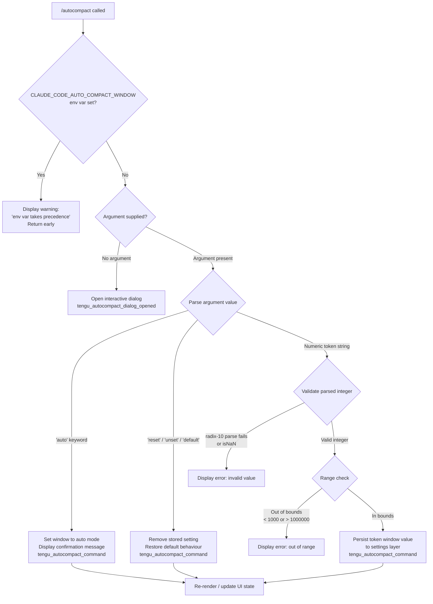

# `/autocompact`

> Analysis basis: CC v2.1.160 bundle.js (AST extraction + Claude interpretation)
> Minimum version: v2.1.160

---

## Overview

`/autocompact` configures the auto-compact window size — the token threshold at which Claude Code automatically compacts the conversation context. It accepts either the keyword `auto` to enable automatic sizing, a numeric token count to set a precise window, or reset/unset keywords to restore defaults. When invoked without arguments it opens an interactive dialog.

---

## Registration

| Field | Value |
|---|---|
| type | `local-jsx` |
| name | `autocompact` |
| description | Configure the auto-compact window size |
| argumentHint | `[auto\|<tokens>]` |
| isHidden | `false` |
| module_id | `Ih1` |
| load_inline | `true` |
| loc_byte | `10909681` |
| loc_byte_end | `10909930` |
| loc_line | `7272` |
| arbor_handler.name | `C4f` |
| arbor_handler.fqn | `claude-2.1.160::C4f` |
| arbor_handler.kind | `AsyncFunction` |
| arbor_handler.resolution_path | `module_id` |
| arbor_handler.n_hits | `1` |

Analysis basis: CC v2.1.160 bundle.js:+10909681

---

## Input Branching

Five distinct input cases plus environment-variable override detection are present, requiring a Mermaid flowchart.



Analysis basis: CC v2.1.160 bundle.js:+10904118, +10904220, +10904249, +10904262, +10904275, +10904937, +10072038, +10072074, +2970446, +2970506, +2970545

---

## Behavioral Spec

### 1. Top-level Handler (`C4f`)

```
async function autocompactHandler(args, context):
    // Check environment variable override first
    if environmentVariableIsSet("CLAUDE_CODE_AUTO_COMPACT_WINDOW"):
        renderWarning("CLAUDE_CODE_AUTO_COMPACT_WINDOW is set and takes precedence. Unset it to change this setting.")
        return

    // No argument → open dialog
    if args is empty or null:
        emit telemetry("tengu_autocompact_dialog_opened")
        openAutocompactDialog(context)   // renders local-jsx component
        return

    // Delegate to argument-processing subroutine
    result = processAutocompactArgument(args.trim(), context)
    return result
```

Analysis basis: CC v2.1.160 bundle.js:+10909383, +10909400, +10909402, +10909455

---

### 2. Argument Processor (`bI6`)

```
function processAutocompactArgument(rawArg, context):
    trimmed = rawArg.trim()

    // Reset aliases
    if trimmed in ["reset", "unset", "default"]:
        removeAutocompactWindowFromSettings(context)
        emit telemetry("tengu_autocompact_command", { action: "unset" })
        renderConfirmation("Auto-compact window reset to default")
        return

    // Parse numeric token count via tokenWindowParser (Un_)
    parsed = parseTokenWindowValue(trimmed)
    // Un_ trims, detects "auto" suffix, applies parseFloat/parseInt,
    // validates Number.isFinite, rounds with Math.round

    if parsed.isAuto:
        persistAutocompactSetting(context, "auto")
        emit telemetry("tengu_autocompact_command", { action: "set", value: "auto" })
        renderConfirmation("Auto-compact window set to auto")
        return

    if parsed.error:
        renderError(parsed.errorMessage)
        return

    // Range validation (performed inside windowValidator / ZV)
    if parsed.value < 1000 or parsed.value > 1000000:
        renderError("Token count out of valid range [1000, 1000000]")
        return

    persistAutocompactSetting(context, parsed.value)
    emit telemetry("tengu_autocompact_command", { action: "set", value: parsed.value })
    renderConfirmation("Auto-compact window set to " + parsed.value)
```

Analysis basis: CC v2.1.160 bundle.js:+10904220, +10904249, +10904262, +10904275, +10904292, +10904460, +10904556, +10904721, +10904777, +10904921, +10904937

---

### 3. Token Window Value Parser (`Un_`)

```
function parseTokenWindowValue(input):
    s = input.trim()

    if s.endsWith("auto") or s === "auto":
        return { isAuto: true }

    // Try fractional parse first, then integer
    floatVal = parseFloat(s)
    if Number.isFinite(floatVal):
        intVal = parseInt(s, 10)   // base-10 only
        rounded = Math.round(floatVal)
        if Number.isFinite(intVal):
            return { isAuto: false, value: rounded }

    return { error: true, errorMessage: "invalid token count" }
```

Analysis basis: CC v2.1.160 bundle.js:+10071903, +10071933, +10071962, +10071980, +10072054, +10072100, +10072147

---

### 4. Window-size Validator and Mode Dispatcher (`ZV`)

```
function windowSizeValidator(rawString):
    // Convert to string defensively (FH helper)
    s = String(rawString)

    attempt = parseInt(s, 10)
    if isNaN(attempt):
        // radix guard: reject non-numeric with base 10 check
        return null

    if attempt < 0 or attempt > 1000000:
        return null

    // Determine routing: auto-mode path (C0), standard set path (OU),
    // explicit-value path (ZHH), or capped numeric path (U68)
    if isAutoMode(attempt):
        return autoModeResult(attempt)           // C0
    else if isSupportedModelFamily(s):
        return standardSetResult(attempt)        // OU
    else if isExplicitValue(attempt):
        return explicitValueResult(attempt)      // ZHH
    else:
        return cappedNumericResult(attempt)      // U68
```

Analysis basis: CC v2.1.160 bundle.js:+2970363, +2970446, +2970498, +2970506, +2970518, +2970532, +2970545, +2970576, +2970596, +2970620

---

### 5. Settings Persistence (`F_` / settings write layer)

```
async function persistAutocompactSetting(context, value):
    // Reads current settings from disk via loadSettingsFromDisk (lp → ms8)
    settings = await loadSettingsFromDisk()

    // Settings priority layers (read-only for policy/flag, writable for user/project/local):
    //   policySettings → flagSettings → userSettings → projectSettings → localSettings
    targetLayer = resolveWritableLayer(settings, context)

    if targetLayer is policy or flag layer:
        emit log("write_ineffective")
        warn user that setting cannot be overridden here
        return

    // Write to ~/.claude/settings.json (userSettings) or project settings.json
    targetLayer["autoCompactEnabled"] = value
    await writeSettingsFile(targetLayer)

    // Invalidate in-memory settings cache (Uz: clears Cb6 and nm8)
    clearSettingsCache()

    // Notify subsystems via event emitter (QUH.emit)
    emitSettingsChangedEvent()

    // Update gitignore rules if applicable (Bg6 → NL4 → git check-ignore)
    maybeUpdateGitignoreRules(targetLayer)
```

Analysis basis: CC v2.1.160 bundle.js:+1229340, +1229362, +1220242, +1220293, +1220315, +1229562, +1229982, +1230147, +1230172, +1230196, +1230249, +1230314, +1230356, +1230393, +1230534, +1230548, +1230558

---

### 6. Environment Variable Pre-check (`p8H`)

```
function getEnvAutocompactWindow():
    raw = process.env["CLAUDE_CODE_AUTO_COMPACT_WINDOW"]
    if raw is undefined or null:
        return { status: "unset" }

    n = parseInt(raw, 10)
    if isNaN(n):
        return { status: "invalid" }

    // Caps check mirrors ZV upper bound
    if n > someMaxTokenLimit:
        return { status: "capped", value: cappedValue }

    return { status: "valid", value: n }
```

Analysis basis: CC v2.1.160 bundle.js:+10072507, +4982731, +4982746, +4982764, +4982806, +4982877, +4982936

---

### 7. Current Effective Window Reader (`ll`)

```
function readEffectiveAutocompactWindow():
    // 1. Environment variable has highest precedence
    envResult = getEnvAutocompactWindow()           // p8H
    if envResult.status in ["valid", "capped"]:
        return { source: "env", value: envResult.value }

    // 2. Stored settings value
    storedValue = getStoredWindowSetting()          // ZV
    if storedValue is not null:
        return { source: "settings", value: storedValue }

    // 3. Experiment / default fallback
    experimentValue = getExperimentDefault()
    if experimentValue:
        return { source: "experiment", value: experimentValue }

    // 4. Hard-coded auto
    return { source: "default", value: "auto" }
```

Analysis basis: CC v2.1.160 bundle.js:+10072430, +10072438, +10072443, +10072503, +10072625, +10072665, +10072699, +10072769, +10072787, +10072856, +10072877

---

## State & Side Effects

| Item | Detail |
|---|---|
| Telemetry: `tengu_autocompact_command` | Fired on every successful argument-driven change (set, unset, auto); carries action and value metadata. Analysis basis: CC v2.1.160 bundle.js:+10904723 |
| Telemetry: `tengu_autocompact_dialog_opened` | Fired when the command is invoked with no arguments and the interactive dialog is rendered. Analysis basis: CC v2.1.160 bundle.js:+10909402 |
| Telemetry: `tengu_amber_redwood2` | Internal feature-flag / experiment gate event reached via the settings-read path. Analysis basis: CC v2.1.160 bundle.js:+10072318 |
| Telemetry: `tengu_feature_ok` / `tengu_feature_sad` / `tengu_feature_bad` | Feature-health markers emitted by shared infrastructure used during settings load/write. Analysis basis: CC v2.1.160 bundle.js:+966123, +966258, +966181 |
| Settings write | Persists `autoCompactEnabled` key to the appropriate settings layer (`~/.claude/settings.json` for user scope, or the project `settings.json`). Analysis basis: CC v2.1.160 bundle.js:+10074109 |
| Settings cache invalidation | In-memory caches (`Cb6`, `nm8`) are cleared after every successful write so the next read reflects the new value. Analysis basis: CC v2.1.160 bundle.js:+26612, +26624 |
| Event emission | A settings-changed event is dispatched via `QUH.emit` so live subsystems (context-window monitor, compactor) react without restart. Analysis basis: CC v2.1.160 bundle.js:+1230558 |
| Gitignore side-effect | The settings-write helper (`Bg6`) checks git-ignore rules and may append entries to avoid committing credentials; runs `git check-ignore` and reads `core.excludesfile`. Analysis basis: CC v2.1.160 bundle.js:+1077107, +1077341, +1077383 |
| Hook registration | None identified in depth-2 traversal. |
| Sound | None identified in depth-2 traversal. |
| appState changes | `autoCompactEnabled` field in the active settings layer is updated; the effective value returned by `ll` (the window-reader) changes accordingly. |

---

## Environment Variable Interaction

`CLAUDE_CODE_AUTO_COMPACT_WINDOW` (string) — when set in the process environment, it overrides any persisted setting. The command detects this at startup and prints:

> "CLAUDE_CODE_AUTO_COMPACT_WINDOW is set and takes precedence. Unset it to change this setting."

and exits without modifying any file. The env var is parsed with `parseInt` base-10; values that parse as `NaN` are treated as `"invalid"`, and values exceeding the upper bound are `"capped"`.

Analysis basis: CC v2.1.160 bundle.js:+10072507, +10904118

---

## Supported Models Detected in Traversal

The call-graph traversal from `aq` → `kP` reaches a list of model-ID string constants used for model-family detection (e.g. determining whether a window size makes sense for a given model generation):

`claude-opus-4-8`, `claude-opus-4-7`, `claude-opus-4-6`, `claude-opus-4-5`, `claude-opus-4-1`, `claude-opus-4-0`, `claude-sonnet-4-6`, `claude-sonnet-4-5`, `claude-sonnet-4-0`, `claude-haiku-4-5`, `claude-3-7-sonnet`, `claude-3-5-sonnet`, `claude-3-5-haiku`, `claude-3-opus`, `claude-3-sonnet`, `claude-3-haiku`

Analysis basis: CC v2.1.160 bundle.js:+2230739 – +2231628

---

## Valid Token Ranges and Keywords

| Input | Behaviour |
|---|---|
| `auto` | Enables automatic window sizing. Confirmation: "Auto-compact window set to auto" |
| `reset` / `unset` / `default` | Removes persisted setting; restores default behaviour |
| Integer in `[1000, 1000000]` | Sets exact token window. Fractional inputs are rounded via `Math.round`. Minimum: **1000** tokens. Maximum: **1,000,000** tokens. |
| Integer outside `[1000, 1000000]` | Rejected with an error message |
| Non-numeric string | Rejected; `parseInt` returns `NaN`, validation fails |
| _(no argument)_ | Opens interactive JSX dialog |

Analysis basis: CC v2.1.160 bundle.js:+10072038, +10072074, +2970498, +2970518, +2970545

---

## Version History

| Version | Change |
|---|---|
| v2.1.160 | Initial analysis |

---

## Common Mistakes

1. **Setting the env var and using the command simultaneously.** If `CLAUDE_CODE_AUTO_COMPACT_WINDOW` is exported in the shell, `/autocompact` will always print the precedence warning and refuse to write settings. Unset the variable first.
2. **Providing a token count below 1 000.** Values below the 1 000-token floor are rejected. Use `auto` for the smallest sensible window.
3. **Providing a token count above 1 000 000.** Values are bounded at 1 000 000 tokens; anything higher is invalid.
4. **Expecting the change to persist across policy-locked environments.** If `autoCompactEnabled` is locked in the policy or flag settings layer, writes to user or project settings are ineffective (a `write_ineffective` event is emitted and the user is warned).
5. **Passing a float without rounding mentally.** The parser does accept `parseFloat` input and applies `Math.round`, so `1500.7` becomes `1501`. This may be surprising when precise sizing is required.

---

## Appendix — Identifier Mapping

> For bundle debugging only. Identifiers change across versions.

| Identifier | Role |
|---|---|
| `C4f` | Top-level async handler for `/autocompact` (Arbor-resolved entry point) |
| `bI6` | Argument processing subroutine; dispatches to reset, auto, or numeric paths |
| `ll` | Effective window-size reader; resolves env → settings → experiment → default |
| `aq` | Model-ID / model-family matcher utility |
| `er6` | Object-entries-based model list iterator |
| `kP` | Model string normaliser (toLowerCase, includes, replace) |
| `H` | Bootstrap fetch helper (API call with 5 000 ms timeout) |
| `rU8` | Inference-profile classifier |
| `wj` | String replacement utility used in model-ID normalisation |
| `ZV` | Window-size validator and mode dispatcher |
| `FH` | Safe String() conversion helper |
| `C0` | Auto-mode result constructor |
| `OU` | Standard-set result constructor (checks model family, includes, vy, WY) |
| `ZHH` | Explicit-value result constructor (writes via wKH, reads aq) |
| `U68` | Capped-numeric result constructor (parseInt + Number.isFinite) |
| `J0` | Settings-source resolver (env vs settings) |
| `p8H` | Environment variable `CLAUDE_CODE_AUTO_COMPACT_WINDOW` reader and validator |
| `N` | Locale/format helper (en-US, compact number formatting) |
| `M01` | Settings-layer merge / effective-value composer |
| `hE` | Settings renderer helper (FH, h4) |
| `x_` | Settings key extractor |
| `W6` | Feature-flag / experiment gate (tengu_amber_redwood2) |
| `Un_` | Token window value parser (trim, endsWith "auto", parseFloat, parseInt, Math.round) |
| `F_` | Settings write orchestrator (full pipeline: load → validate → persist → invalidate → emit) |
| `mO` | Settings file locator (c3H, EQ) |
| `c3H` | Settings path builder (RN.join, .claude, settings.json) |
| `EQ` | Settings object schema validator/builder |
| `d6` | File-existence check utility |
| `us8` | Settings reader from disk (ARA, c3H, TQ, eSA) |
| `ARA` | Settings object key merger |
| `TQ` | User-settings file loader (CzA, GX, Cs8, bzA) |
| `eSA` | SDK inline settings loader (GX, Lx, KW, U3H) |
| `NX` | CLAUDE.md / context-file loader |
| `Ui` | File reader with 4 096-char slice and replaceAll normalisation |
| `V8` | ENOENT-safe file reader (G8 error guard) |
| `G8` | ENOENT error code checker |
| `Ra8` | Settings-cache timestamper (lg6.set, Date.now) |
| `SEH` | Settings entry handler (SQ6, EQ) |
| `SQ6` | Settings path resolver (RN.resolve, RN.dirname, n8) |
| `If6` | Atomic file-write helper (temp file, fchmod, fsync, rename, unlink) |
| `q` | Filesystem module reference (lstat, rename, readlink, etc.) |
| `O` | fs.Stats wrapper (isSymbolicLink) |
| `f` | File-handle wrapper (close, toString) |
| `SH` | JSON.stringify wrapper |
| `Uz` | In-memory settings cache invalidator (clears Cb6 and nm8) |
| `Bg6` | Gitignore-rules updater (git ls-files, git check-ignore, appendFile, writeFile) |
| `S6` | Settings-file path resolver for gitignore context |
| `ja8` | Home-directory path helper |
| `A` | String utility with toLowerCase |
| `Ug6` | git check-ignore runner |
| `NL4` | core.excludesfile resolver (git config --global --get, homedir expansion) |
| `dyA` | git ls-files already-tracked checker |
| `cyA` | Gitignore entry formatter |
| `fx` | Path joiner (RN.join) |
| `Y_` | Event emitter base (zN) |
| `zN` | Core EventEmitter implementation |
| `hH` | Feature-ok telemetry emitter (tengu_feature_ok) |
| `d` | Shared telemetry dispatcher |
| `t6` | Feature-sad telemetry emitter (tengu_feature_sad) |
| `RH` | Feature-bad telemetry emitter (tengu_feature_bad) |
| `lp` | Settings-load orchestrator (EG, h9, ms8, EQ, bb6) |
| `EG` | Pre-load setup helper |
| `h9` | Memory-usage sampler (process.memoryUsage, swA, cF8) |
| `ms8` | Core settings-load-from-disk logic (Date.now, ARA, TQ, eSA, c3H, RN.resolve) |
| `bb6` | Post-load cleanup helper |
| `yH` | Settings-reload watcher (FH, n9, T14, LUH, mi.logError) |
| `d_` | Error-to-string converter |
| `n9` | Essential-traffic network gate |
| `T14` | Reload-queue manager (lF6 shift/push) |
| `l_` | Settings-change listener registration (lp) |
| `LK` | Number formatter (VK, smK) |
| `VK` | Locale-aware number formatter |
| `smK` | Number formatter internals |

---

Note: index built via Arbor fallback; some signals (telemetry, literals) may be missing — see arbor-fallback.js.