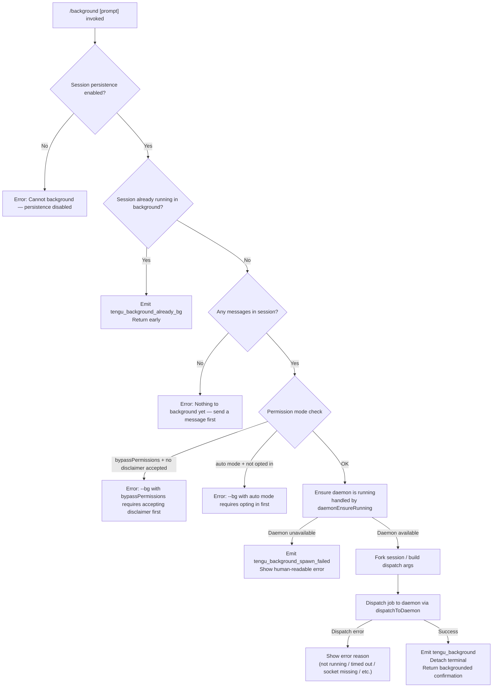

# `/background`

> Analysis basis: CC v2.1.160 bundle.js (AST extraction + Claude interpretation)
> Minimum version: v2.1.160

---

## Overview

`/background` (alias: `/bg`) sends the current interactive Claude Code session to a background daemon process and releases the controlling terminal. The command forks the current conversation into a persistent job managed by the background daemon, dispatching any supplied prompt to that job before detaching. If the daemon is not running, it offers to install or transiently spawn one.

---

## Registration

| Field | Value |
|---|---|
| type | `local-jsx` |
| name | `background` |
| description | `Send this session to the background and free the terminal` |
| aliases | `["bg"]` |
| argumentHint | `[prompt]` |
| immediate | `null` |
| module_id | `BqK` |
| load_inline | `true` |
| loc_byte | `12902725` |
| loc_byte_end | `12902965` |
| loc_line | `9532` |
| arbor_handler.name | `Gyf` |
| arbor_handler.fqn | `claude-2.1.160::Gyf` |
| arbor_handler.kind | `AsyncFunction` |
| arbor_handler.resolution_path | `module_id` |
| arbor_handler.n_hits | `0` |

Analysis basis: CC v2.1.160 bundle.js:+12902725

---

## Input Branching

The command has 5+ distinct branches (session-persistence guard, already-backgrounded guard, no-message guard, permission-mode guard, daemon-availability path), so a Mermaid flowchart is used.



Analysis basis: CC v2.1.160 bundle.js:+12902066 (handler `Gyf`), +12895318 (permission/mode checks `Wyf`), +12878377 (fork/dispatch path `vn`), +12878552 (arg-build path `$yf`), +12899038 (`tengu_background_spawn_failed`), +12899101 (`tengu_background`)

---

## Behavioral Spec

### 1. Handler Entry — `Gyf` (asyncFunction)

The Arbor-resolved handler `Gyf` is the primary async entry point.

```
async function backgroundCommandHandler(args, context):
    sessionTitle  = getSessionTitle(context)          # N9 / OzH
    appState      = context.appState                  # H

    # Guard: persistence must be enabled
    if not isPersistenceEnabled(context):             # V5H check
        return renderError(
          "Cannot background — session persistence is disabled, …")
        # literal: bundle.js:+12902147

    # Guard: already running in background
    if isAlreadyBackgrounded(appState):
        emit("tengu_background_already_bg")           # bundle.js:+12902080
        return

    # Render JSX output via wMH.createElement              # bundle.js:+12902393
    return renderBackgroundJSX(args, context, appState)
```

Analysis basis: CC v2.1.160 bundle.js:+12902066

---

### 2. Permission & Mode Validation — `Wyf` (sessionArgValidator)

Called early in the fork-preparation path to reject unsafe combinations.

```
function validatePermissionsForBackground(permissionMode, flags):
    permArgs = parsePermissionArgs(flags)              # H.indexOf "--"

    if permArgs includes "--permission-mode" AND value == "bypassPermissions":
        if not dangerouslySkipPermissionsAccepted():
            return error(
              "--bg with bypassPermissions requires accepting the disclaimer first…")
              # literal: bundle.js:+12895561

    if permArgs includes "--dangerously-skip-permissions"
       OR "--allow-dangerously-skip-permissions":
        # same disclaimer check applies

    if permMode == "auto":
        if not autoModeOptedIn():
            return error(
              "--bg with auto mode requires opting in first…")
              # literal: bundle.js:+12895723
              # literal "auto": bundle.js:+12895703

    return OK
```

Analysis basis: CC v2.1.160 bundle.js:+12895318

---

### 3. Session Fork & Arg Assembly — `vn` + `$yf`

Once validation passes, the session is forked and CLI arguments are assembled for the daemon worker.

```
function forkSessionAndBuildArgs(session, prompt, options):
    uuid      = crypto.randomUUID().slice(0, 8)       # vn: bundle.js:+12878442
    tmpDir    = path.join(configDir, "tmp")           # bundle.js:+12878523
    jobsDir   = nK / WE path.join("jobs")             # literal: bundle.js:+4126639
    mkdir(tmpDir, {recursive: true})                  # oqH.mkdir: bundle.js:+12878502

    args = []
    args += ["--agent"]                               # literal: bundle.js:+12878941
    if sessionName:
        args += ["--name", sessionName]               # literals: bundle.js:+12878968,+12878984

    # Resume args ($yf sub-path xqK):
    if options includes "--resume=" or "-r=":
        args += [resumeArg]                           # bundle.js:+12894545, +12894600

    # Fork-session flag:
    if options includes "--fork-session":
        args += ["--fork-session"]                    # literal: bundle.js:+12879182
        args += ["--session-id=", currentSessionId]  # literal: bundle.js:+12894899

    # Continue flags (-c / --continue):
    if options includes "-c" or "--continue":
        # bundle.js:+12879071, +12879081
        args += [continueFlag]

    # Propagate environment overrides (uqK):
    for envVar in [CLAUDE_CONFIG_DIR, CLAUDE_INTERNAL_FC_OVERRIDES,
                   AWS_REGION, AWS_DEFAULT_REGION, AWS_PROFILE,
                   GOOGLE_APPLICATION_CREDENTIALS,
                   GOOGLE_CLOUD_PROJECT, GCLOUD_PROJECT]:
        # literals: bundle.js:+12896339 – +12896494
        if process.env[envVar]:
            args += [envVar + "=" + value]

    # Append user prompt if provided
    if prompt:
        args += [prompt]                              # "prompt" literal: bundle.js:+12881012

    # Append --reply-on-resume flag for the daemon worker
    args += ["--reply-on-resume"]                    # literal: bundle.js:+12898477

    # Tool allow/disallow, model, effort pass-through:
    args += flatMap(allowedTools,    "--allowed-tools")   # bundle.js:+12898564
    args += flatMap(disallowedTools, "--disallowed-tools") # bundle.js:+12898605
    if model:  args += ["--model", model]             # bundle.js:+12898636
    if effort: args += ["--effort", effort]           # bundle.js:+12898658

    # Additional directories:
    args += flatMap(addDirs, "--add-dir")             # bundle.js:+12898529

    return {uuid, args, tmpDir}
```

Analysis basis: CC v2.1.160 bundle.js:+12878377, +12878552, +12879007, +12879262, +12896070

---

### 4. Daemon Ensure-Running — `sF` (daemonEnsureRunning)

Before dispatch, the command guarantees the daemon is alive.

```
async function daemonEnsureRunning(options):
    status = checkDaemonStatus()                       # "up" literal: bundle.js:+12837100
    emit("tengu_daemon_ensure_running")                # bundle.js:+12837115

    if status == "up":
        return OK

    if serviceExecPathIsStale():
        log("daemon service exec path is stale … falling back to transient spawn")
        # literal: bundle.js:+12837233
        emit("tengu_bg_daemon_service_stale_exec")     # bundle.js:+12837190

    platform = getPlatform()                           # "macos"/"linux": bundle.js:+12837693,+12837723

    if daemonInstallMode == "ask":                     # literal: bundle.js:+12838080
        # Present interactive prompt (Gh6):
        answer = prompt("Install as a service now? [y/N/never, or 'once' just for now] ")
        # literal: bundle.js:+12844659
        emit("tengu_bg_daemon_cold_start_ask")         # bundle.js:+12838138
        emit("tengu_bg_daemon_cold_start_ask_answer")  # bundle.js:+12844734

        if answer in ["yes","y","once"]:
            installService()
            # If daemon not reachable within 5 s:
            #   "service installed but the daemon did not become reachable within 5s…"
            #   literal: bundle.js:+12845218
        elif answer == "never":
            persistNeverAnswer()

    if mode == "no" / never configured:
        log("No background daemon is running…")        # literal: bundle.js:+12838203
        return UNAVAILABLE

    # Transient spawn fallback:
    spawnTransient(["run", "--origin", "transient",
                    "--spawned-by", …])               # literals: bundle.js:+12838529–+12838558
    # Poll up to 30 000 ms / 60 000 ms:               # bundle.js:+12838888, +12838910
    if not reachable:
        emit("tengu_bg_daemon_spawn_failed")           # bundle.js:+12838657
        return SPAWN_FAILED
    return OK
```

Analysis basis: CC v2.1.160 bundle.js:+12837052, +12838095

---

### 5. Dispatch to Daemon — `O1A` (dispatchToDaemon / cli-bg-dispatch)

Sends the assembled job to the daemon over a Unix socket with protocol handshake.

```
async function dispatchToDaemon(jobArgs, uuid, options):
    socketPath = buildSocketPath(kqK.join(…))          # bundle.js:+12874183
    nonce      = IqK.randomBytes(…)                    # bundle.js:+12874242

    # Write dispatch file (ECH / TCH):
    writeDispatchFile(path.join(g3, "dispatch"))       # bundle.js:+11347958
    # "cli-bg-dispatch" label:                          # literal: bundle.js:+12874146

    # Connect with timeout 6000 ms:                    # literal: bundle.js:+12874387
    conn = await connectSocket(socketPath, Hz)

    if conn.error == "EALIVE":                         # literal: bundle.js:+12874489
        # session ID collision with prior job
        return error("id collision with a prior job")  # literal: bundle.js:+12885361

    if conn.error == "ESTALE":                         # literal: bundle.js:+12874619
        return handleStaleSession()

    # Wait for ack ("await-ack" phase):                # literal: bundle.js:+12875042
    # Timeout 200 ms:                                  # literal: bundle.js:+12875169
    if not ack within timeout:
        return error("no ack")                         # literal: bundle.js:+12874231

    if ack.code == "ESTARTING":                        # literal: bundle.js:+12875138
        return error("service still starting")         # literal: bundle.js:+12885312

    emit("tengu_bg_dispatch")                          # bundle.js:+12876000

    if rescuePath needed:
        emit("tengu_bg_dispatch_rescued")              # bundle.js:+12881871

    return SUCCESS
```

Analysis basis: CC v2.1.160 bundle.js:+12873896, +12874142, +12874316, +12875812

---

### 6. Dispatch Error Mapping — `M1A` (dispatchErrorMapper)

Maps low-level error codes to human-readable strings shown after `/background` fails.

| Internal code | User-visible string | Bundle location |
|---|---|---|
| `daemon-unreachable` | "not running" | bundle.js:+12876595, +12885145 |
| `ack-timeout` | "timed out" | bundle.js:+12876639, +12885183 |
| `dispatch-write` | "couldn't write dispatch file" | bundle.js:+12876670, +12885222 |
| `enoconn` | "socket missing" | bundle.js:+12876706, +12885273 |
| `estarting` | "service still starting" | bundle.js:+12876737, +12885312 |
| `short_alive` | "Previous session is still shutting down — try again in a moment" | bundle.js:+12882732, +12882794 |
| `stale_short` | (stale session) | bundle.js:+12882872 |
| (collision) | "id collision with a prior job" | bundle.js:+12885361 |

Analysis basis: CC v2.1.160 bundle.js:+12876345

---

### 7. Flush & Detach — `th8` (backgroundFlushAndDetach)

After a successful dispatch acknowledgement the active REPL session is flushed and the terminal is released.

```
async function flushAndDetach(sessions, options):
    # Collect all active sessions:
    activeSessions = Array.from(K.values())            # bundle.js:+12898096–+12898111
    # Filter to "session" type:                        # "session" literal: bundle.js:+12898146

    # Flush each session with 2000 ms timeout:
    await Promise.race([
        flushSession(session),                         # Hf: bundle.js:+12898349
        timeout(2000, "flush timeout")                 # literals: bundle.js:+12898357, +12898362
    ])
    emit("tengu_background")                           # bundle.js:+12899101
    emit("(backgrounded)")                             # literal: bundle.js:+12899785

    # Build spawn args and hand off to daemonWorker:
    spawnArgs += ["--reply-on-resume"]                 # bundle.js:+12898477
    spawnArgs += flatMap(Y,  "--allowed-tools")        # bundle.js:+12898513
    spawnArgs += flatMap(P,  …)                        # bundle.js:+12898548
    spawnArgs += flatMap(X,  "--disallowed-tools")     # bundle.js:+12898589
    spawnArgs += ["--model", model]                    # bundle.js:+12898636
    spawnArgs += ["--effort", effort]                  # bundle.js:+12898658
    spawnArgs += ["--add-dir", …]                      # bundle.js:+12898529

    # AbortSignal timeout 120 s for the overall operation:
    AbortSignal.timeout(120 * 1000)                    # literal: bundle.js:+12899555, bundle.js:+12899223

    # Register with hook system (O9 / HDA.register):
    registerCommandHook("command", …)                  # "command" literal: bundle.js:+12899306
    # bundle.js:+12899316

    if spawn fails:
        emit("tengu_background_spawn_failed")          # bundle.js:+12899038

    process detaches (Y_ → zN)                        # bundle.js:+12898760
```

Analysis basis: CC v2.1.160 bundle.js:+12898062, +12898297, +12898337, +12898349, +12898504

---

### 8. Daemon Spare-Worker Management — `w` (daemonSpareWorker)

The daemon pre-warms a spare worker to reduce latency on the next `/background` invocation.

```
function manageSpareWorker(state):
    emit("tengu_bg_spare_enable")              # bundle.js:+15848808

    if spareWorker available:
        emit("tengu_bg_spare_claim")           # bundle.js:+15848929
    else:
        emit("tengu_bg_spare_claim_fail")      # bundle.js:+15849192

    # Memory pressure guard (1024 MB threshold):
    freeMemMB = os.freemem() / (1024 * 1024)  # bundle.js:+15847943, +15848007
    if freeMemMB < threshold:
        emit("tengu_bg_dispatch_low_mem")      # bundle.js:+15848113

    # SIGKILL escalation for zombie processes:
    emit("tengu_bg_dispatch_sigkill_escalate") # bundle.js:+15847534
    # Kills after 30 s / 15 s windows:        # literals: bundle.js:+15847489, +15847500

    # Spawn new worker process via Hg.spawn:
    spawnWorker()                              # bundle.js:+15849251
    emit("tengu_bg_session_create")            # "daemon_bg_session_create" literal: bundle.js:+15847844
```

Analysis basis: CC v2.1.160 bundle.js:+15847416, +15848862

---

### 9. Attach / Re-attach — `k85` (daemonAttachWorker)

When a backgrounded session is later resumed the supervisor attaches the terminal.

```
async function attachToBackgroundSession(jobId, ptyHandle):
    emit("tengu_bg_attach")                            # bundle.js:+15839582

    phase = ptyHandle.getPhase()
    if phase in ["starting", "resuming", "adopted"]:
        showMessage("Session is starting — it will appear once ready…")
        # literal: bundle.js:+15840124

    if stallDetected:
        emit("tengu_bg_attach_stall_ms")               # bundle.js:+15831370
        if exceededLimit:
            emit("tengu_bg_attach_stall_gave_up")      # bundle.js:+15840494
        else:
            emit("tengu_bg_attach_stall_respawn")      # bundle.js:+15840763
            showMessage("Session not responding — restarting it…")
            # literal: bundle.js:+15840808

    if kicked (EKICKED):
        showMessage("EKICKED: Session opened in another window")
        # literal: bundle.js:+15841857

    emit("tengu_bg_attach_kick")                       # bundle.js:+15841717

    # Legacy auto-respawn path:
    emit("tengu_bg_attach_legacy_autorespawn")         # bundle.js:+15839164

    # Resize PTY for repaint:
    ptyHandle.resizeForRepaint()                       # bundle.js:+15841015
    ptyHandle.repaint()                                # bundle.js:+15838264
```

Analysis basis: CC v2.1.160 bundle.js:+15839483

---

## State & Side Effects

| Item | Detail |
|---|---|
| Telemetry — command | `tengu_background` (bundle.js:+12899101), `tengu_background_spawn_failed` (bundle.js:+12899038), `tengu_background_already_bg` (bundle.js:+12902080) |
| Telemetry — daemon lifecycle | `tengu_bg_daemon_cold_start_ask` (+12838138), `tengu_bg_daemon_cold_start_ask_answer` (+12844734), `tengu_bg_daemon_service_stale_exec` (+12837190), `tengu_bg_daemon_install` (+12837573), `tengu_bg_daemon_spawn_failed` (+12838657), `tengu_bg_daemon_service_poll_fallthrough` (+12837814), `tengu_daemon_ensure_running` (+12837115) |
| Telemetry — dispatch | `tengu_bg_dispatch` (+12876000), `tengu_bg_dispatch_fallback` (+12876526), `tengu_bg_dispatch_rescued` (+12881871), `tengu_bg_dispatch_sigkill_escalate` (+15847534), `tengu_bg_dispatch_low_mem` (+15848113), `tengu_bg_dispatch_stale_drop` (+15837027) |
| Telemetry — spare worker | `tengu_bg_spare_enable` (+15848808), `tengu_bg_spare_claim` (+15848929), `tengu_bg_spare_claim_fail` (+15849192), `tengu_bg_session_create` (+15847844) |
| Telemetry — attach | `tengu_bg_attach` (+15839582), `tengu_bg_attach_stall_ms` (+15831370), `tengu_bg_attach_stall_gave_up` (+15840494), `tengu_bg_attach_stall_respawn` (+15840763), `tengu_bg_attach_kick` (+15841717), `tengu_bg_attach_legacy_autorespawn` (+15839164), `tengu_bg_proto_mismatch` (+15835788) |
| Telemetry — daemon control | `tengu_daemon_control` (+15883547), `tengu_daemon_idle_exit` (+15867271), `tengu_daemon_config_reload` (+15862022) |
| Telemetry — other | `tengu_rename_full_session_fork` (+11859638), `tengu_amber_anchor` (+3239159), `tengu_bg_state_read_transient` (+4127971) |
| Hook registration | Registers a `"command"` hook via `HDA.register` / `O9` (bundle.js:+59048, +12899316) |
| appState changes | `H.setAppState` called during agent-turn path `aT8` (bundle.js:+10788067); session is marked `"(backgrounded)"` in UI (bundle.js:+12899785) |
| Filesystem side-effects | Creates tmp directory under config dir (bundle.js:+12878523); writes `daemon.status.json` (bundle.js:+12564713); writes dispatch file in jobs dir (bundle.js:+11347958); may create/rename/unlink files via atomic-write helper `t3` (bundle.js:+2273578) |
| Socket communication | Connects to Unix domain socket; uses `ENOCONN`, `ETIMEOUT`, `EALIVE`, `ESTALE`, `ESTARTING` error codes (bundle.js:+11349793, +11349950, +12874489, +12874619, +12875138) |
| PTY / process | Spawns daemon worker via `Hg.spawn` (bundle.js:+15849251); may send `SIGKILL` to zombie (bundle.js:+15847582); AbortSignal timeout of 120 s on the overall background operation (bundle.js:+12899555) |
| Sound | None found in depth-2 traversal |

---

## Version History

| Version | Change |
|---|---|
| v2.1.160 | Initial analysis |

---

## Common Mistakes

1. **Invoking `/background` before sending any message** — the guard at `Gyf` returns "Nothing to background yet — send a message first." (bundle.js:+12902323). Always ensure at least one exchange exists.
2. **Using `/bg` with `--dangerously-skip-permissions` without prior interactive acceptance** — `Wyf` blocks the dispatch with a clear error requiring a one-time interactive run of `claude --dangerously-skip-permissions` (bundle.js:+12895561).
3. **Using `/bg` with `--permission-mode auto` without prior opt-in** — similarly blocked; run `claude --permission-mode auto` once interactively first (bundle.js:+12895723).
4. **Daemon not installed / unreachable** — if no persistent daemon is configured and the transient spawn fails, the command errors with `tengu_background_spawn_failed`. Run `claude daemon install` to set up a persistent service.
5. **Retrying immediately after a short-lived prior session** — if the previous backgrounded session is still shutting down, the dispatch returns `short_alive` / "Previous session is still shutting down — try again in a moment" (bundle.js:+12882794).
6. **Session persistence disabled** — in environments where persistence is turned off (e.g. certain API-only configs), `/background` will always fail with the persistence-disabled error (bundle.js:+12902147).

---

## Appendix — Identifier Mapping

> For bundle debugging only. Identifiers change across versions.

| Identifier | Role |
|---|---|
| `Gyf` | Primary async handler for `/background` command (Arbor-resolved) |
| `th8` | Flush-and-detach coordinator; assembles spawn args and releases terminal |
| `vn` | Session fork initiator; generates UUID, creates tmp dir, builds job directory |
| `$yf` | CLI argument assembler for background dispatch |
| `Wyf` | Permission-mode validator (bypassPermissions / auto-mode guards) |
| `sF` | Daemon ensure-running orchestrator |
| `O1A` | Background dispatch driver (`cli-bg-dispatch`); socket connect + ack wait |
| `M1A` | Dispatch error-code to human-string mapper |
| `Gh6` | Daemon cold-start service-installation dialog |
| `w` | Daemon spare-worker lifecycle manager |
| `k85` | Daemon attach/re-attach worker (PTY attach loop) |
| `N85` | Attach stall detector |
| `I85` | Attach cleanup / kill-and-retry helper |
| `Hz` | Low-level Unix socket client (connect, write, read framing) |
| `NN8` | Socket lease/subscribe manager |
| `ECH` | Dispatch file writer |
| `NqK` | Dispatch acknowledgement waiter |
| `aHK` | Daemon status file writer (`daemon.status.json`) |
| `ny6` | Status file path builder |
| `nK` | Jobs directory path resolver |
| `WE` | Jobs directory base-path helper |
| `DN` | Session collection enumerator |
| `Hf` | Flush-with-timeout helper (2000 ms flush timeout) |
| `iE` | Session close/detach signal sender |
| `W1A` | Hook-registration coordinator |
| `n4` | Hook registration engine |
| `O9` | Low-level hook register (`HDA.register`) |
| `a_6` | Agent fork dispatcher (session rename + new agent context) |
| `Nwf` | Agent fork context builder |
| `a0` | Agent turn runner |
| `aT8` | App-state mutation during agent turn |
| `Zm` | Subagent exit handler |
| `jWH` | Agent state serializer |
| `Z_K` | Agent status display formatter |
| `D` | Supervisor process manager (start / stop / updateConfig) |
| `ekK` | Supervisor heartbeat emitter |
| `E` | Remote-control event handler |
| `Y` | Process exit / abort coordinator |
| `_p` | Graceful shutdown sequencer |
| `Wd` | Shutdown trigger |
| `Zd` | Shutdown cleanup (clearTimeout + FY_) |
| `z` | Daemon stop handler |
| `hH` | Daemon stop telemetry helper |
| `RH` | Daemon stop failure telemetry helper |
| `Qy` | First-party event emitter |
| `YY_` | Event UUID + emit helper |
| `P` | IPC framing / buffer reader |
| `k85` | (see above — attach worker) |
| `bkK` | Backpressure / rate-limit helper inside attach |
| `YC6` | Attach write-stream wrapper |
| `X` | MCP supervisor repaint coordinator |
| `yH` | Render/repaint driver |
| `d_` | Error-to-string utility |
| `pe` | Working-directory scanner |
| `dz` | Real-path resolver |
| `Hx` | Directory-entry helper |
| `dT` | Recursive readdir helper |
| `AK4` | File grep / line scanner |
| `W6` | Amber-anchor / config-snapshot writer |
| `TDH` | Amber-anchor inner writer |
| `T6H` | Config snapshot helper |
| `Y4H` | Config snapshot writer |
| `I` | Away-summary scheduler |
| `XT8` | Away-summary state reader |
| `iaf` | Away-summary cache checker |
| `pM8` | Away-summary API caller |
| `gv1` | UUID generator wrapper |
| `g` | Output throttle / debounce timer |
| `o` | Toggle-silence timeout handler (voice) |
| `a` | Focus-silence timeout handler (voice) |
| `Q` | Voice read / silence detector |
| `t` | Voice session main loop |
| `l` | Voice session filter / start helper |
| `Dh` | Full-session fork (rename path) |
| `JZ8` | Conversation serializer / file writer |
| `jZ8` | Conversation record constructor |
| `yE` | Message normalizer |
| `Zs7` | Message list normalizer |
| `J01` | File-based conversation loader |
| `AbH` | Agent message builder |
| `tn_` | Agent message record constructor |
| `D4K` | Main query/API call loop |
| `gX` | API client factory |
| `jA` | Auth-key formatter |
| `A4_` | Auth-key type detector |
| `_gH` | API client config helper |
| `IK` | Tool-list filter |
| `YO` | Compact-boundary detector |
| `xV8` | Compact-boundary marker |
| `VYH` | Fleet / job-state reader |
| `eh8` | Background render JSX component |
| `kB` | Argument array-check helper |
| `hV8` | Some-tools predicate |
| `Ch` | Tool-list renderer |
| `Ql` | Tool-list array normalizer |
| `jqH` | Slash-command prefix checker |
| `p$` | Permission resolver (inner) |
| `vF` | Permission resolver (outer) |
| `y6` | Permission gate checker |
| `zN` | Core permission evaluator |
| `V5H` | Session-persistence / detach-request checker |
| `Hh1` | Session task/type checker |
| `ls` | Detach-request writer (`cs.write`) |
| `XWH` | Environment detector (production / test) |
| `c9K` | Test-environment helper |
| `ub` | Test-environment fallback |
| `N9` | Session title getter |
| `OzH` | Title extraction utility |
| `SH` | JSON serializer wrapper |
| `GH` | String coercion helper |
| `m6` | JSON parser wrapper |
| `G8` | Generic logger/debug emitter |
| `FH` | String constructor wrapper |
| `V8` | Validation/check utility |
| `v5` | Secondary validation utility |
| `d` | General logging sink |
| `ra_` | Rename telemetry helper |
| `C16` | Rename config helper |
| `rS` | Post-background UI renderer |
| `M26` | Background status display helper |
| `dIH` | Background status icon helper |
| `pg` | Background job list renderer |
| `zyf` | Background status label mapper |
| `mqK` | Environment variable propagation helper |
| `Eyf` | Tool-set inclusion checker |
| `xqK` | Resume-arg parser |
| `Pyf` | Session-ID arg parser |
| `uqK` | Environment-override arg parser |
| `VqK` | Job list formatter |
| `Myf` | Platform-specific shell builder (cmd.exe / /bin/sh) |
| `qg6` | Windows Git Bash checker |
| `Xyf` | `--add-dir` arg extractor |
| `Nn` | Daemon-flag prefix parser |
| `np` | Settings loader (userSettings / localSettings / flagSettings / policySettings) |
| `b8` | Settings file reader |
| `R6` | Config file accessor |
| `ZDH` | Config file read/write/backup utility |
| `ojL` | Config file watch manager |
| `Z_K` | (see agent status formatter above) |
| `S6` | Async-storage context accessor |
| `sF6` | Async-storage store getter |
| `Y_` | Async-storage runner |
| `_1` | Job state file reader |
| `z5` | Job state file writer |
| `t3` | Atomic file writer (randomBytes + writeFile + rename) |
| `Nj` | Job state cache invalidator |
| `q8H` | Working/active state resolver |
| `x4` | Path sanitizer / redactor |