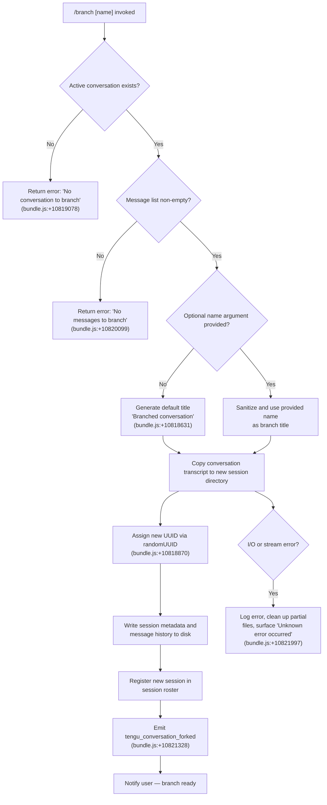

# `/branch`

> Analysis basis: CC v2.1.160 bundle.js (AST extraction + Claude interpretation)
> Minimum version: v2.1.160

---

## Overview

`/branch` (also invocable as `/fork`) creates a divergent copy of the current conversation at its present point, preserving the full message history up to that moment so the user can explore an alternative direction without modifying the original session. Internally, the handler resolves the active conversation, copies its transcript to a new session directory, registers the new session with a fresh UUID, and emits a `tengu_conversation_forked` telemetry event on success.

---

## Registration

| Field | Value |
|---|---|
| type | `local-jsx` |
| name | `branch` |
| description | `Create a branch of the current conversation at this point` |
| argumentHint | `[name]` |
| aliases | `["fork"]` |
| module_id | `qs_` |
| load_inline | `true` |
| loc_byte | `12319649` |
| loc_byte_end | `12319843` |
| loc_line | `8626` |
| arbor_handler.name | `AKf` |
| arbor_handler.fqn | `claude-2.1.160::AKf` |
| arbor_handler.kind | `AsyncFunction` |
| arbor_handler.resolution_path | `module_id` |
| arbor_handler.n_hits | `0` |

Analysis basis: CC v2.1.160 bundle.js:+12319649

---

## Input Branching

The command involves four distinct paths: no active conversation, no messages present, normal fork with an optional custom name, and an error fallback. A Mermaid flowchart is used accordingly.



---

## Behavioral Spec

### Top-level Handler — `AKf`

`AKf` is the async handler resolved by Arbor via `module_id` path from the `qs_` module.
Analysis basis: CC v2.1.160 bundle.js:+10822113

```
async function branchCommandHandler(context):
    result = await prepareBranchSession(context)
    return result
```

### Session Preparation — `pk1`

Called directly by `AKf`. Orchestrates the full branching flow.
Analysis basis: CC v2.1.160 bundle.js:+10821132

```
async function prepareBranchSession(context):
    conversationState = getConversationState(context)   // resolves via y6
    
    if conversationState is null or undefined:
        raise UserFacingError("No conversation to branch")  // bundle.js:+10819078
    
    messages = conversationState.messages
    if messages is empty:
        raise UserFacingError("No messages to branch")      // bundle.js:+10820099
    
    title = extractCustomTitle(context.args)                // via uk1 + A.replace
    if title is absent or blank:
        title = "Branched conversation"                     // bundle.js:+10818631
    
    newSessionId = crypto.randomUUID()                      // via Ck1.randomUUID, bundle.js:+10818870
    newSessionDir = buildSessionPath(newSessionId)          // via $M / path-join helpers
    
    await filesystem.mkdir(newSessionDir, recursive=true)   // via Jv8.mkdir, bundle.js:+10818932
    
    readStream = filesystem.createReadStream(sourceFile, {
        encoding: "utf8",                                   // bundle.js:+10819014
        highWaterMark: 448                                  // bundle.js:+10818963
    })
    writeStream = filesystem.createWriteStream(destFile)    // via jv8.createWriteStream, bundle.js:+10819127
    
    // Stream conversation transcript to new location
    await pipeWithErrorHandling(readStream, writeStream)
    
    // Parse and re-encode session messages
    for each line in readStream via readline interface:     // via bk1.createInterface, bundle.js:+10819221
        parsed = JSON.parse(line)                           // via m6, bundle.js:+10819525
        mutate content type = "text"                        // bundle.js:+10818704
        writeStream.write(serialized)                       // via SH serialization
    
    // Register new session
    await registerSession({
        id: newSessionId,
        title: title,
        parentId: conversationState.id,
        type: "fork"                                        // bundle.js:+10821849
    })
    
    emitTelemetry("tengu_conversation_forked")             // bundle.js:+10821328
    
    return newSessionId
```

### Argument / Title Extraction — `uk1`

Parses the optional `[name]` argument from the slash command input.
Analysis basis: CC v2.1.160 bundle.js:+10818683

```
function extractCustomTitle(args):
    match = args.find(namePattern)          // via _.find
    if match:
        return args.replace(namePattern, sanitizedTitle)   // via A.replace
    return null
```

### File Copy Stream — `mk1`

Low-level async function that handles reading the source conversation file and writing to the new branch path. Handles progress events and cleans up on failure.
Analysis basis: CC v2.1.160 bundle.js:+10818870

```
async function copyConversationFile(sourcePath, destPath, options):
    open source as readStream (highWaterMark=448, encoding="utf8")  // bundle.js:+10818963, +10819014
    open destination as writeStream                                  // bundle.js:+10819127
    
    lineReader = readline.createInterface(readStream)                // bundle.js:+10819221
    
    outputBuffer = []
    lineCount = 0
    
    for each line from lineReader:
        parsed = parseJSONLine(line)                    // via m6
        if parsed is valid:
            outputBuffer.push(transformedLine)          // bundle.js:+10819598
            reportProgress(lineCount, 100)              // progress literal, bundle.js:+10818798; event string bundle.js:+10820017
    
    writeStream.write(serialize(outputBuffer))          // via SH
    await stream.finished(writeStream)                  // via xk1.finished, bundle.js:+10820509
    
    on error:
        readStream.destroy()                            // bundle.js:+10819323
        filesystem.unlink(destPath)                     // via Jv8.unlink, bundle.js:+10819341
        raise error
```

### Error Formatting — `errorFormatter` (`d_`) and `formatHandler` (`FH`)

Used when surfacing errors back to the user.
Analysis basis: CC v2.1.160 bundle.js:+10819207

```
function formatError(err):
    if err is Error instance:
        return String(err.message)      // via String, bundle.js:+173730
    return String(err)

function handleError(value):
    return String(value)               // via FH, bundle.js:+26899
```

### Session Registration Helpers — `y6`, `Y_`, `$M`, `Bv`

These helpers assemble the directory path and persist the new session's metadata JSON.
Analysis basis: CC v2.1.160 bundle.js:+10818889, +10818899, +10818907, +10818921

```
function getSessionStorePath():
    return zN(...)   // resolves base storage directory

function buildRelativePath(id):
    return zN(id)    // variant path builder

function buildSessionMeta(sessionId, title, messages):
    base = getSessionStorePath()            // y6 → zN
    formatted = formatMessage(messages)     // jk
    pathParts = buildMessagePath(base)      // $M → iS/nO/Y_/sjH.join/y6
    joined = pathParts.join(separator)      // via sjH.join, bundle.js:+6681902
    return { id: sessionId, title, path: joined }

function buildFullSession(sessionId, title, messages):
    meta = buildSessionMeta(sessionId, title, messages)   // $M, bundle.js:+10818921
    pathComponents = [meta.path, ...additionalParts]
    return pathComponents.join(sep)         // via cY.join, bundle.js:+12995594
```

### Worktree Detection — `cCH` (called via `Kn` → `_Kf`)

The branch operation is aware of git worktrees. It queries the git worktree list using `--porcelain` format (bundle.js:+12020052) and parses output lines that start with the `"worktree "` prefix (bundle.js:+12020253, offset 9 into that string at bundle.js:+12020287). This allows the new branch session to be associated with the correct working directory context.
Analysis basis: CC v2.1.160 bundle.js:+13031122

```
async function detectWorktrees(workingDir):
    result = await runGitCommand(["worktree", "list", "--porcelain"], workingDir)
    emitTelemetry("tengu_worktree_detection")      // bundle.js:+12020134
    
    lines = result.split(newline)
    worktrees = []
    
    for each line in lines:
        if line.startsWith("worktree "):
            path = line.slice(9)                   // bundle.js:+12020287
            worktrees.push(path)
    
    return worktrees
```

### Session Title / Custom-Name Event — `wS`, `E5H`

After the branch is created, if the user provided a name argument, the custom title is persisted and a rename event is emitted. Similarly, an agent-name attribute may be applied.
Analysis basis: CC v2.1.160 bundle.js:+10821295, +10821313

```
async function persistCustomTitle(sessionId, title):
    buildTitleEntry(title)                      // Bv path
    writeMetadataSync(sessionId, {
        type: "custom-title",                   // bundle.js:+13024617
        value: title
    })                                          // via JMH
    emitTelemetry("tengu_session_renamed")      // bundle.js:+13024709
    emitEvent(dh6.emit, sessionId)

async function persistAgentName(sessionId, agentName):
    buildAgentEntry(agentName)                  // Bv path
    writeMetadataSync(sessionId, {
        type: "agent-name",                     // bundle.js:+13027639
        value: agentName
    })                                          // via JMH
    emitTelemetry("tengu_agent_name_set")       // bundle.js:+13027737
    emitEvent(r1A.emit, sessionId)
```

---

## State & Side Effects

| Item | Detail |
|---|---|
| Telemetry — primary | `tengu_conversation_forked` (bundle.js:+10821328) — emitted on every successful branch |
| Telemetry — worktree | `tengu_worktree_detection` (bundle.js:+12020134) — emitted during git context resolution |
| Telemetry — rename | `tengu_session_renamed` (bundle.js:+13024709) — emitted when a custom title is supplied |
| Telemetry — agent name | `tengu_agent_name_set` (bundle.js:+13027737) — emitted when an agent-name attribute is written |
| Telemetry — feature lifecycle | `tengu_feature_ok` / `tengu_feature_bad` / `tengu_feature_sad` (bundle.js:+966123, +966181, +966258) — emitted by surrounding feature telemetry wrapper |
| Filesystem — read | Source conversation file opened as a read stream (`highWaterMark=448`, `encoding="utf8"`) |
| Filesystem — write | New branch directory created via `mkdir`; conversation written as newline-delimited JSON |
| Filesystem — cleanup | On failure, destination file is unlinked (bundle.js:+10819341) |
| Session registry | New session registered with a fresh UUID; parent session ID retained for lineage |
| Message content type | All message content blocks are tagged as `"text"` (bundle.js:+10818704) in the branch copy |
| Default title | `"Branched conversation"` (bundle.js:+10818631) when no name argument is provided |
| Hook registration | `O9` registers a hook via `HDA.register` (bundle.js:+59048); exact hook type not fully resolved within depth-2 traversal |
| appState changes | New session entry added to session roster; existing session unmodified |
| Sound | <!-- TODO: not found in depth-2 traversal; needs --depth 4 --> |

---

## Version History

| Version | Change |
|---|---|
| v2.1.160 | Initial analysis |

---

## Common Mistakes

1. **Running `/branch` in an empty session** — If no messages have been exchanged yet, the command exits with `"No messages to branch"` (bundle.js:+10820099). Start a conversation first.
2. **Running `/branch` with no active conversation context** — If the session state cannot be resolved, the command fails with `"No conversation to branch"` (bundle.js:+10819078). This can happen if the session file is missing or corrupt.
3. **Expecting the original session to be modified** — `/branch` only creates a new divergent copy; the source session is left intact and unchanged.
4. **Confusing `/branch` and `/fork`** — Both names invoke the identical handler; `fork` is registered as an alias (bundle.js:+12319649) with no behavioral difference.
5. **Assuming branch names are mandatory** — The `[name]` argument is optional. Omitting it produces a branch titled `"Branched conversation"` automatically.
6. **Assuming git is required** — The worktree detection (`tengu_worktree_detection`) runs opportunistically and does not block branching if git is unavailable or the directory is not a git repository.

---

## Appendix — Identifier Mapping

> For bundle debugging only. Identifiers change across versions.

| Identifier | Role |
|---|---|
| `AKf` | Top-level async branch command handler (arbor_handler) |
| `pk1` | Branch session preparation orchestrator |
| `mk1` | Low-level conversation file copy / stream pipeline |
| `uk1` | Custom title / argument extraction from command args |
| `_Kf` | Post-copy branch finalizer; sets title, line counters, triggers registration |
| `wS` | Custom-title persistence writer |
| `E5H` | Agent-name attribute persistence writer |
| `Kn` | Worktree + completion-context builder (calls `cCH`, `_1K`, `VbH`) |
| `cCH` | Git worktree list parser (`--porcelain` output) |
| `_1K` | Directory listing / file enumeration for session context |
| `VbH` | Binary buffer builder for session data encoding |
| `y6` | Session storage base-path resolver |
| `Y_` | Relative session path builder |
| `$M` | Session metadata path assembler |
| `Bv` | Full session path constructor (combines `y6`, `jk`, `$M`) |
| `iS` | Sub-path formatter used by `$M` |
| `jk` | Message formatter helper |
| `nO` | Path normalizer used in session path assembly |
| `zN` | Base storage directory resolver |
| `d_` | Error-to-string converter |
| `FH` | Generic value-to-string formatter |
| `yH` | Error handler / logger with telemetry integration |
| `n9` | Telemetry traffic classification helper |
| `KNA` | Telemetry formatter (calls `FH`) |
| `T14` | Rolling log buffer manager (shift/push) |
| `V8` | Error type discriminator (ENOENT / EISDIR checks) |
| `G8` | Filesystem error code extractor |
| `m6` | Safe JSON parser |
| `SH` | JSON serializer (`JSON.stringify` wrapper) |
| `oq` | String slice/index utility for argument parsing |
| `JN` | Regex-escape helper for replacement strings |
| `JMH` | Synchronous metadata file writer (appendFileSync / mkdirSync) |
| `n4` | Hook registration coordinator |
| `O9` | Hook registrar (calls `HDA.register`) |
| `p$` | Session state accessor |
| `rQ` | Conversation state persistence helper |
| `o$6` | Session file read/write coordinator |
| `d6` | Path utility used in metadata writing |
| `d` | Core logging / diagnostic sink |
| `GH` | String coercion wrapper |
| `v5` | Filesystem error handler used in session writing |

---

Note: index built via Arbor fallback; some signals (telemetry, literals) may be missing — see arbor-fallback.js.