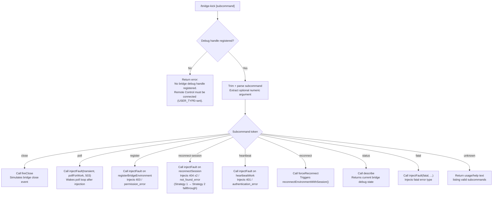

# `/bridge-kick`

> Analysis basis: CC v2.1.160 bundle.js (AST extraction + Claude interpretation)
> Minimum version: v2.1.160

---

## Overview

`/bridge-kick` is a developer/testing command that injects synthetic bridge failure states into the running Claude Code process, enabling manual verification of recovery and reconnection logic without requiring real network faults. It targets the bridge polling, registration, reconnect, and heartbeat subsystems and dispatches the appropriate failure simulation based on a subcommand string supplied by the user. This command is restricted to sessions where a bridge debug handle is registered (i.e. `USER_TYPE=ant` Remote Control sessions).

---

## Registration

| Field | Value |
|---|---|
| type | `local` |
| name | `bridge-kick` |
| description | Inject bridge failure states for manual recovery testing |
| loc_byte | `12429592` |
| loc_byte_end | `12429776` |
| loc_line | `8759` |
| supportsNonInteractive | `false` |
| load_inline | `true` |
| load_ident | `fEf` |
| arbor_handler.name | `fEf` |
| arbor_handler.kind | `AsyncFunction` |
| arbor_handler.fqn | `claude-2.1.160::fEf` |
| arbor_handler.resolution_path | `load_ident` |
| arbor_handler.n_hits | `0` |

Analysis basis: CC v2.1.160 bundle.js:+12429592

---

## Input Branching

The handler resolves a trimmed, lowercased subcommand string to one of seven distinct fault-injection branches (plus a guard branch for missing debug handle and a default/unknown branch). This is 3+ distinct paths — Mermaid flowchart is used.



Analysis basis: CC v2.1.160 bundle.js:+12427351 (handler entry `fEf`), +12427640 (fireClose), +12427788 (injectFault), +12427862 (wakePollLoop), +12429367 (forceReconnect), +12429505 (describe)

---

## Behavioral Spec

### Guard: Debug Handle Availability Check

Before any fault injection is attempted, the handler checks whether the bridge debug handle (`debugHandle`) has been registered in the current session.

```
async function bridgeKickHandler(context):
    debugHandle = lookupBridgeDebugHandle(context)   // Rs1 at +12427351
    if debugHandle is null or undefined:
        return errorResult(
            type = "text",
            message = "No bridge debug handle registered. Remote Control must be connected (USER_TYPE=ant)."
        )
    rawInput = context.userInput
    subcommand = rawInput.trim()                     // H.trim at +12427487
    proceed to subcommand dispatch
```

Error literal: `"No bridge debug handle registered. Remote Control must be connected (USER_TYPE=ant)."` (bundle.js:+12427388)
Return type literal: `"text"` (bundle.js:+12427375)

Analysis basis: CC v2.1.160 bundle.js:+12427351, +12427375, +12427388

---

### Subcommand Parsing

The raw user input is trimmed and then split to extract the primary subcommand token. An optional trailing numeric argument is parsed with `Number()` and validated with `Number.isFinite()`, allowing fault injections to accept optional counts or codes.

```
function parseSubcommand(rawInput):
    trimmed = rawInput.trim()
    parts   = trimmed.split(whitespace)
    token   = parts[0].toLowerCase()
    argRaw  = parts[1] if parts.length > 1 else undefined
    argNum  = Number(argRaw)
    numericArg = Number.isFinite(argNum) ? argNum : undefined
    return { token, numericArg }
```

Analysis basis: CC v2.1.160 bundle.js:+12427487 (trim), +12427538 (Number), +12427552 (Number.isFinite)

---

### Subcommand: `close`

Fires a synthetic bridge close event via `fireClose` on the debug handle. This simulates an unexpected connection drop to test the reconnect path.

```
case "close":                                  // literal at +12427523
    debugHandle.fireClose()                    // fEf → _.fireClose at +12427640
    return successMessage("close event fired")
```

Analysis basis: CC v2.1.160 bundle.js:+12427523, +12427640

---

### Subcommand: `poll`

Injects a transient fault into the `pollForWork` call path. The poll loop is woken immediately after injection so the fault is exercised on the next cycle without waiting for the normal polling interval. The injected HTTP-level code is `503`.

```
case "poll":                                   // literal at +12427754
    debugHandle.injectFault(                   // +12427788
        type      = "transient",               // literal at +12427769
        target    = "pollForWork",             // literal at +12427810
        httpCode  = 503                        // literal at +12427848
    )
    debugHandle.wakePollLoop()                 // +12427862
    return successMessage(
        "Next poll will throw a transient (axios rejection). Poll loop woken."
    )                                          // literal at +12427898
```

Analysis basis: CC v2.1.160 bundle.js:+12427754, +12427769, +12427788, +12427810, +12427848, +12427862, +12427898

---

### Subcommand: `register`

Injects a `403 permission_error` into the next `registerBridgeEnvironment` call. The user must manually trigger a close/reconnect cycle to exercise the injected fault.

```
case "register":                               // literal at +12428342
    debugHandle.injectFault(
        target    = "registerBridgeEnvironment",  // literal at +12428398
        httpCode  = 403,                          // literal at +12428446
        errorType = "permission_error"            // literal at +12428460
    )
    return successMessage(
        "Next registerBridgeEnvironment will 403. Trigger with close/reconnect."
    )                                            // literal at +12428508
```

Analysis basis: CC v2.1.160 bundle.js:+12428342, +12428398, +12428446, +12428460, +12428508

---

### Subcommand: `reconnect-session`

Injects a `404 not_found_error` into the next two `POST /bridge/reconnect` calls, causing reconnect Strategy 1 to exhaust and fall through to Strategy 2. Count of injected faults is hardcoded to 2.

```
case "reconnect-session":                       // literal at +12428817
    debugHandle.injectFault(
        target    = "reconnectSession",          // literal at +12428866
        httpCode  = 404,                         // literal at +12428098
        errorType = "not_found_error",           // literal at +12428102
        count     = 2
    )
    return successMessage(
        "Next 2 POST /bridge/reconnect calls will 404. doReconnect Strategy 1 falls through to Strategy 2."
    )                                            // literal at +12428966
```

Analysis basis: CC v2.1.160 bundle.js:+12428817, +12428866, +12428098, +12428102, +12428966

---

### Subcommand: `heartbeat`

Injects a `401 authentication_error` into the next `heartbeatWork` call, simulating an expired or invalid session token during heartbeat.

```
case "heartbeat":                               // literal at +12429071
    debugHandle.injectFault(
        target    = "heartbeatWork",            // literal at +12429134
        httpCode  = 401,                        // literal at +12429101
        errorType = "authentication_error"      // literal at +12428120
    )
    return successMessage("heartbeat fault injected")
```

Analysis basis: CC v2.1.160 bundle.js:+12429071, +12429101, +12429134, +12428120

---

### Subcommand: `fatal`

Injects a fault of type `"fatal"` into the bridge. Unlike transient faults, a fatal injection is expected to trigger non-retrying shutdown logic in the bridge layer.

```
case "fatal":                                   // literal at +12428192
    debugHandle.injectFault(
        type      = "fatal"
    )
    return successMessage("fatal fault injected")
```

Analysis basis: CC v2.1.160 bundle.js:+12428192

---

### Subcommand: `reconnect`

Forces an immediate reconnect by calling `forceReconnect` on the debug handle, which internally invokes `reconnectEnvironmentWithSession()`. The user is directed to observe `debug.log` for the outcome.

```
case "reconnect":                               // literal at +12429348
    debugHandle.forceReconnect()               // +12429367
    return successMessage(
        "Called reconnectEnvironmentWithSession(). Watch debug.log."
    )                                          // literal at +12429405
```

Analysis basis: CC v2.1.160 bundle.js:+12429348, +12429367, +12429405

---

### Subcommand: `status`

Calls `describe` on the debug handle and returns the current bridge debug state as text output.

```
case "status":                                 // literal at +12429471
    stateDescription = debugHandle.describe()  // +12429505
    return textResult(stateDescription)
```

Analysis basis: CC v2.1.160 bundle.js:+12429471, +12429505

---

### Default / Unknown Subcommand

When the parsed token does not match any known subcommand, the handler returns a usage summary listing the valid subcommand tokens: `close`, `poll`, `register`, `reconnect-session`, `heartbeat`, `fatal`, `reconnect`, `status`.

```
default:
    return textResult(buildUsageHelp([
        "close", "poll", "register", "reconnect-session",
        "heartbeat", "fatal", "reconnect", "status"
    ]))
```

Analysis basis: CC v2.1.160 bundle.js:+12427351 (handler scope)

---

## State & Side Effects

| Item | Detail |
|---|---|
| Telemetry | `tengu_feature_sad` (bundle.js:+966258) — fired from the shared feature-use telemetry sink (`d` at +966256) |
| Bridge debug handle | Read-only lookup via `Rs1` (+12427351); the handle itself is registered externally (requires `USER_TYPE=ant`) |
| Poll loop wakeup | `wakePollLoop()` is called as a side effect of the `poll` subcommand (+12427862) to immediately exercise the injected fault |
| `injectFault` state | Writes one-shot fault descriptors into the bridge subsystem; each descriptor is consumed on the next matching call |
| `forceReconnect` | Triggers `reconnectEnvironmentWithSession()` as an immediate side effect (+12429367) |
| `fireClose` | Fires a close event on the bridge connection object (+12427640) |
| File I/O (indirect) | `rmK`/`imK`/`FwA` call chains include `Hy.appendFile`, `Hy.mkdir`, `Hy.rename`, `Hy.unlink` — these belong to the shared logging/rolling-file infrastructure reached transitively, not directly by the command |
| Hook registration | `O9` → `HDA.register` (+59048) — transitive hook registration in shared infrastructure |
| Sound | None observed in depth-2 traversal |
| appState changes | <!-- TODO: not found in depth-2 traversal; needs --depth 4 --> |

---

## Version History

| Version | Change |
|---|---|
| v2.1.160 | Initial analysis |

---

## Common Mistakes

1. **Running outside a Remote Control / `USER_TYPE=ant` session** — The command silently returns the error `"No bridge debug handle registered…"` if no debug handle is active. Ensure the session was started with the correct user type before invoking `/bridge-kick`.
2. **Omitting the subcommand** — Invoking `/bridge-kick` with no argument (or an unrecognized token) falls through to the usage-help path and performs no injection. Always specify one of: `close`, `poll`, `register`, `reconnect-session`, `heartbeat`, `fatal`, `reconnect`, `status`.
3. **Expecting persistent faults** — `injectFault` descriptors are one-shot (consumed on the next matching bridge call). If you want to re-inject a fault you must re-run the command.
4. **Not triggering the registered fault** — For `register`, the injected `403` is only exercised when a close/reconnect cycle occurs. Use `/bridge-kick close` afterward to trigger it.
5. **Conflating `reconnect` and `reconnect-session`** — `reconnect` calls `forceReconnect` immediately; `reconnect-session` only pre-stages a fault for the next `POST /bridge/reconnect` calls without forcing one now.
6. **Numeric argument parsing edge cases** — A trailing non-numeric argument is silently ignored (coerces to `NaN`, rejected by `Number.isFinite`). Only finite numeric values are accepted as optional arguments.

---

## Appendix — Identifier Mapping

> For bundle debugging only. Identifiers change across versions.

| Identifier | Role |
|---|---|
| `fEf` | Main async handler for `/bridge-kick` (arbor_handler, load_ident) |
| `Rs1` | Bridge debug handle lookup function |
| `H` | Context / input object (also appears as bootstrap fetch helper in other scopes) |
| `N` | Log-write / output helper (calls `H.includes`, `_.toUpperCase`, `PmH`, `rmK`) |
| `lmK` | Log-level routing helper |
| `ADA` | Log-sink dispatcher |
| `SH` | JSON serialisation helper for log records |
| `x4` | Path/string sanitisation utility |
| `xwA` | String-map builder (calls `BmK.map`) |
| `q` | File-descriptor or sync-unlink helper |
| `A` | Filename/path normalisation helper |
| `PmH` | Buffered write helper (calls `ZwA`) |
| `ZwA` | Raw write wrapper (calls `H.write`) |
| `rmK` | Rolling log-file manager |
| `QuH` | Debounced flush / timer coordinator (clearTimeout / setTimeout / setImmediate) |
| `R$H` | Log record formatter |
| `d6` | Log-file path resolver |
| `A46` | EISDIR guard helper |
| `gwA` | Log path join helper |
| `FwA` | Log file rotation helper (stat / rename / unlink) |
| `imK` | Log file append/mkdir helper |
| `O9` | Hook registration dispatcher |
| `o$` | Secondary context accessor |
| `Ce` | Feature-flag / set membership checker |
| `wj` | String replace helper |
| `gq` | Model/provider resolution entry point |
| `GHH` | Provider-config aggregator |
| `DN` | Default provider builder |
| `p9H` | Provider preference helper |
| `lQ` | Model-list parser |
| `K1` | Model-string normaliser |
| `C0` | Model-alias lookup |
| `DKH` | Provider inclusion checker |
| `dN` | Model-type dispatcher (firstParty / aws / gateway) |
| `_gH` | Secondary model-type dispatcher |
| `tT` | Model-type resolver (calls `xM`, `Jf`, `jA`) |
| `XDq` | Model resolution wrapper |
| `xM` | Provider-type resolver |
| `xa6` | Model-set inclusion check |
| `AgH` | Model feature-flag accessor |
| `yP` | Model-resolution entry (calls `K1`, `R0`) |
| `R0` | Full provider-config builder |
| `t6` | Bootstrap telemetry emitter |
| `d` | Shared telemetry sink (fires `tengu_feature_sad`) |
| `_` | Current bridge debug handle / active object reference (context-dependent) |

---

Note: index built via Arbor fallback; some signals (telemetry, literals) may be missing — see arbor-fallback.js.