# `/btw`

> Analysis basis: CC v2.1.160 bundle.js (AST extraction + Claude interpretation)
> Minimum version: v2.1.160

---

## Overview

`/btw` ("by the way") lets users pose a quick side question to the agent without derailing the main conversation thread. It is an immediate, local-jsx command that dispatches its question via the `control-request` thin-client channel, keeping the aside isolated from the primary dialogue context. The handler is an async function that validates the argument, builds a system-framed message, and renders the result as a JSX element.

---

## Registration

| Field | Value |
|---|---|
| type | `local-jsx` |
| name | `btw` |
| description | Ask a quick side question without interrupting the main conversation |
| argumentHint | `<question>` |
| immediate | `true` |
| thinClientDispatch | `control-request` |
| module_id | `Fk1` |
| load_inline | `true` |
| loc_byte | `10827909` |
| loc_byte_end | `10828148` |
| loc_line | `7121` |
| arbor_handler.name | `DKf` |
| arbor_handler.fqn | `claude-2.1.160::DKf` |
| arbor_handler.kind | `AsyncFunction` |
| arbor_handler.resolution_path | `module_id` |
| arbor_handler.n_hits | `0` |

Analysis basis: CC v2.1.160 bundle.js:+10827909

---

## Input Branching

Three distinct input paths exist: missing argument, malformed/empty argument after trimming, and valid question text. A Mermaid flowchart is used.

```mermaid
flowchart TD
    A["/btw <input>"] --> B{Argument provided?}
    B -- No --> C["Display usage hint\n'Usage: /btw <your question>'\nReturn early"]
    B -- Yes --> D{Argument non-empty\nafter trim?}
    D -- No --> C
    D -- Yes --> E["Frame as 'system' role message\nDispatch via control-request channel"]
    E --> F["Bootstrap fetch to agent\n(H → N pipeline)"]
    F --> G["Build conversation context\nvia gq / K1 normalisation"]
    G --> H["Render result as JSX element\nvia C4.createElement"]
    H --> I["Return rendered component\nto terminal UI"]
```



Analysis basis: CC v2.1.160 bundle.js:+10827504 (handler entry `DKf`), +10827506 (usage string), +10827545 (role literal `"system"`)

---

## Behavioral Spec

### 1. Argument Validation and Usage Guard

When the user invokes `/btw` without a `<question>` argument, or the argument reduces to an empty string after whitespace trimming, the handler emits the static usage hint and returns immediately without dispatching any request.

```
async function btwCommandHandler(argumentText):
    if argumentText is absent or argumentText.trim() is empty:
        display "Usage: /btw <your question>"
        return null

    proceed to dispatchSideQuestion(argumentText.trim())
```

Analysis basis: CC v2.1.160 bundle.js:+10827506 (usage string literal), +10827504 (`DKf` entry)

---

### 2. Message Framing as System Role

The validated question is wrapped in a message object whose role is set to `"system"`. This framing instructs the agent to treat the aside as out-of-band context rather than a user turn, preserving the main conversation flow.

```
function frameSideQuestion(questionText):
    return {
        role: "system",
        content: questionText
    }
```

Analysis basis: CC v2.1.160 bundle.js:+10827545 (string literal `"system"`)

---

### 3. Control-Request Dispatch (bootstrapFetch pipeline)

The framed message is dispatched through the `control-request` thin-client channel. Internally, the async `bootstrapFetch` helper (`H`) is called, which logs `"[Bootstrap] Fetching"`, attaches `Content-Type: application/json` and `User-Agent` headers, enforces a 5 000 ms timeout, and emits a `api_bootstrap_fetch` telemetry span. On success it logs `"[Bootstrap] Fetch ok"`; on JSON parse failure it records `parse_failed`.

```
async function bootstrapFetch(url, options):
    log "[Bootstrap] Fetching"
    set headers:
        "Content-Type": "application/json"
        "User-Agent": <cc-user-agent>
    set timeout: 5000 ms
    response = await fetch(url, options)
    if response ok:
        log "[Bootstrap] Fetch ok"
        return parsed JSON
    else:
        record telemetry "parse_failed"
        throw error
```

Analysis basis: CC v2.1.160 bundle.js:+15451800 (`"[Bootstrap] Fetching"`), +15451885 (`"Content-Type"`), +15451900 (`"application/json"`), +15451919 (`"User-Agent"`), +15451991 (5000 ms), +15452112 (`"api_bootstrap_fetch"`), +15452134 (`"parse_failed"`), +15452164 (`"[Bootstrap] Fetch ok"`)

---

### 4. Message Normalisation Pipeline (gq / K1)

After the fetch resolves, the response passes through the conversation-context normaliser (`gq`), which delegates per-message normalisation to the token-role classifier (`K1`). `K1` trims whitespace, lower-cases role tokens, strips the `[1m]` marker, maps short aliases (`opusplan`, `sonnet`, `haiku`, `opus`, `best`) to canonical model identifiers, and rewrites provider tags (`anthropic.`, `anthropicAws`, `gateway`, `mantle`, `firstParty`) to internal routing constants. Unrecognised model strings fall through unchanged.

```
function normaliseMessage(rawMessage):
    role = rawMessage.role.trim().toLowerCase()
    content = stripMarker(rawMessage.content, "[1m]")
    modelTag = mapModelAlias(content)
    providerTag = mapProviderAlias(modelTag)
    return { role, content: providerTag }

function mapModelAlias(text):
    for alias in ["opusplan", "sonnet", "haiku", "opus", "best"]:
        if text contains alias: return canonicalFor(alias)
    return text

function mapProviderAlias(text):
    for tag in ["anthropic.", "anthropicAws", "gateway", "mantle", "firstParty"]:
        if text contains tag: return routingConstantFor(tag)
    return text
```

Analysis basis: CC v2.1.160 bundle.js:+2229757 (`GHH` / `gq` entry), +2233677 (`K1` trim), +2233688 (toLowerCase), +2233799 (`"[1m]"`), +2233773 (`"opusplan"`), +2233814 (`"sonnet"`), +2233853 (`"haiku"`), +2233892 (`"opus"`), +2233929 (`"best"`), +2229981 (`"firstParty"`), +2048530 (`"anthropicAws"`), +2048550 (`"gateway"`), +2230622 (`"mantle"`), +2227735 (`"anthropic."`)

---

### 5. Config Access and Lock Management (W8 / xY_ pipeline)

The handler calls into the config-management subsystem (`W8` → `xY_`) to read or update user configuration under a file lock. Lock acquisition is expected to complete within 60 000 ms; contention beyond that threshold is logged as a warning (`"Lock acquisition took longer than expected — another Claude instance may be running"`). The subsystem backs up the config file (up to 5 rotating backups with a `.backup.` infix), guards against auth-token loss (GH #3117 sentinel), and performs atomic rename to prevent partial writes. File permissions are restored to mode `384` (octal 0o600) on the temp file before final rename.

```
async function readOrUpdateConfig(configPath):
    acquireLock(configPath, timeout=60000)
    if lockTookTooLong:
        warn "Lock acquisition took longer than expected..."
        emit telemetry "tengu_config_lock_contention"
    raw = fs.readFileSync(configPath, "utf-8")
    parsed = JSON.parse(raw)
    if cachedAuth present and parsed missing auth:
        warn "saveConfigWithLock: re-read config missing auth..."
        emit telemetry "tengu_config_auth_loss_prevented"
        return
    rotateBackups(configPath, maxBackups=5, infix=".backup.")
    writeAtomic(configPath, newContent, mode=384)
```

Analysis basis: CC v2.1.160 bundle.js:+3245682 (lock-contention warning), +3246452 (60 000 ms), +3247798 (`"utf-8"`), +3247283 (`"backups"`), +3246568 (`".backup."`), +3246701 (5 backups), +3246983 (mode 384), +3246098 (GH #3117 auth-loss guard), +3242911 (global-config auth-loss guard)

---

### 6. JSX Rendering

The handler's final step calls `C4.createElement` to produce a JSX node representing the agent's reply, which is then returned to the terminal UI renderer.

```
function renderBtwResult(agentReply):
    return C4.createElement(BtwResultComponent, { reply: agentReply })
```

Analysis basis: CC v2.1.160 bundle.js:+10827614 (`DKf` → `C4.createElement`)

---

## State & Side Effects

| Item | Detail |
|---|---|
| Telemetry — feature sad | `tengu_feature_sad` fired on certain error paths (bundle.js:+966258) |
| Telemetry — config lock contention | `tengu_config_lock_contention` when lock exceeds 60 000 ms (bundle.js:+3245771) |
| Telemetry — stale config write | `tengu_config_stale_write` when a stale config write is detected (bundle.js:+3245907) |
| Telemetry — config parse error | `tengu_config_parse_error` on JSON parse failure of config file (bundle.js:+3248346) |
| Telemetry — SIGKILL escalation | `tengu_bg_dispatch_sigkill_escalate` on background session kill escalation (bundle.js:+15847534) |
| Telemetry — low memory | `tengu_bg_dispatch_low_mem` when background session detects low memory (bundle.js:+15848113) |
| Telemetry — spare session enable | `tengu_bg_spare_enable` when a spare background session is enabled (bundle.js:+15848808) |
| Telemetry — spare session claim | `tengu_bg_spare_claim` on successful spare session claim (bundle.js:+15848929) |
| Telemetry — spare claim fail | `tengu_bg_spare_claim_fail` when spare session claim fails (bundle.js:+15849192) |
| Telemetry — auth loss prevented | `tengu_config_auth_loss_prevented` when GH #3117 guard fires (bundle.js:+3246250) |
| Telemetry — bootstrap fetch span | `api_bootstrap_fetch` event emitted per dispatch call (bundle.js:+15452112) |
| thinClientDispatch | `control-request` — the aside is sent over the control channel, not the main message stream |
| Config side effects | May rotate up to 5 backup copies of the config file; performs atomic rename write |
| Hook registration | `HDA.register` called via `O9` path (bundle.js:+59048) — registers a cleanup or event hook |
| Stream write | `ZwA` / `H.write` path (bundle.js:+191795) — writes to an output stream during response delivery |
| Timeout management | `clearTimeout` / `setTimeout` / `setImmediate` used in `QuH` for batched output flushing (bundle.js:+58462, +58626, +58719) |
| Sound | <!-- TODO: not found in depth-2 traversal; needs --depth 4 --> |
| appState changes | <!-- TODO: not found in depth-2 traversal; needs --depth 4 --> |

---

## Version History

| Version | Change |
|---|---|
| v2.1.160 | Initial analysis |

---

## Common Mistakes

1. **Omitting the question argument** — `/btw` with no text after it displays the usage hint (`Usage: /btw <your question>`) and does nothing. Always supply a non-empty question string.
2. **Expecting the aside to appear in the main conversation history** — `/btw` dispatches via the `control-request` channel with a `"system"` role frame, so the reply is delivered out-of-band and does not become part of the regular user/assistant turn history.
3. **Confusing `/btw` with a blocking question** — because `immediate: true` is set and the dispatch is non-blocking relative to the main thread, the main conversation can continue to accept input while the aside is in flight.
4. **Running concurrently with another Claude instance sharing the same config directory** — the config lock subsystem will warn and may delay if a second instance holds the lock; avoid parallel invocations against the same config path.
5. **Assuming model aliases work verbatim** — input routed through the normalisation pipeline maps short aliases (`haiku`, `sonnet`, `opus`, `best`, `opusplan`) to internal identifiers before dispatch; passing non-standard strings falls through unchanged and may cause routing failures.

---

## Appendix — Identifier Mapping

> For bundle debugging only. Identifiers change across versions.

| Identifier | Role |
|---|---|
| `DKf` | `btw` command async handler (arbor_handler; module `Fk1`) |
| `H` | Bootstrap fetch helper / general HTTP utility |
| `N` | Message dispatch / conversation pipeline entry |
| `lmK` | Output formatting / message batching helper |
| `ADA` | Sub-formatter within lmK pipeline |
| `SH` | JSON serialisation wrapper (`JSON.stringify`) |
| `x4` | Path / content extraction utility |
| `xwA` | Map-over-messages helper inside x4 |
| `PmH` | Stream write coordinator |
| `ZwA` | Low-level stream write wrapper (`H.write`) |
| `rmK` | File-logging / transcript writer |
| `QuH` | Batched output flusher (clearTimeout / setTimeout / setImmediate) |
| `R$H` | Transcript path resolver |
| `A46` | Sub-path helper in transcript pipeline |
| `gwA` | Directory-join helper for transcript paths |
| `FwA` | File stat / rename / unlink helper |
| `imK` | Transcript append-file writer (mkdir + appendFile) |
| `O9` | Hook registration caller (`HDA.register`) |
| `o$` | Secondary option reader inside bootstrapFetch |
| `Ce` | Feature-flag set checker (`F64.has`) |
| `wj` | String replacement utility (regex replace) |
| `gq` | Conversation-context normaliser (delegates to `K1`) |
| `GHH` | Top-level message normaliser inside gq |
| `DN` | Sub-normaliser step A inside GHH |
| `p9H` | Sub-normaliser step B inside GHH |
| `lQ` | Line-by-line content parser / prefix stripper |
| `K1` | Per-message role + model alias normaliser |
| `C0` | Model-string canonical resolver (`wKH`) |
| `DKH` | Provider-tag inclusion checker (`zKH.includes`) |
| `dN` | Token classifier step (xM + Jf) |
| `_gH` | Alternate token classifier step (Jf) |
| `tT` | Token type dispatcher (xM + Jf + jA) |
| `XDq` | Extended token dispatcher (delegates to tT) |
| `xM` | Token builder (jA) |
| `xa6` | Inclusion list checker (`Ss4.includes`) |
| `AgH` | Formatter helper (FH) |
| `yP` | Parallel normaliser path (K1 + R0) |
| `R0` | Full message-object reconstructor |
| `t6` | Telemetry span emitter (`d`) |
| `d` | Low-level telemetry event recorder |
| `W8` | Config read/write orchestrator |
| `xY_` | Config file lock + backup + atomic-write implementation |
| `L` | File-system abstraction (mkdirSync, statSync, etc.) |
| `f` | Resource cleanup / close helper |
| `qYq` | Config object merger (`R4_` + `Object.assign`) |
| `R4_` | Base config factory (`AYq`) |
| `G8` | Error type classifier |
| `ZDH` | Config file reader (readFileSync + JSON.parse + backup logic) |
| `m6` | JSON parse wrapper |
| `Ax` | String prefix stripper (`H.startsWith` + `H.slice`) |
| `nQq` | Backup directory enumerator (readdirStringSync) |
| `uY_` | Path join + normalise utility |
| `w` | Background session / daemon process manager |
| `fY6` | Config field extractor |
| `V` | Filename prefix checker (`.startsWith`) |
| `X` | Background transport / SDK connection manager |
| `Yu8` | SDK session initialiser |
| `yH` | Connection result handler (d\_ + FH + T14) |
| `d_` | Error string constructor (Error + String) |
| `Z` | Rolling buffer / slice manager |
| `If6` | Atomic safe-write implementation (temp file + rename + fsync) |
| `O` | Symbolic-link stat checker (`C8`) |
| `V8` | EISDIR / directory-error handler (`G8`) |
| `SdH` | Config schema validator |
| `lQq` | Config entry enumerator (`Object.entries`) |
| `RdH` | Timestamp recorder (`Date.now`) |
| `bY_` | Config file path builder (VY.dirname + If6) |

---

Note: index built via Arbor fallback; some signals (telemetry, literals) may be missing — see arbor-fallback.js.