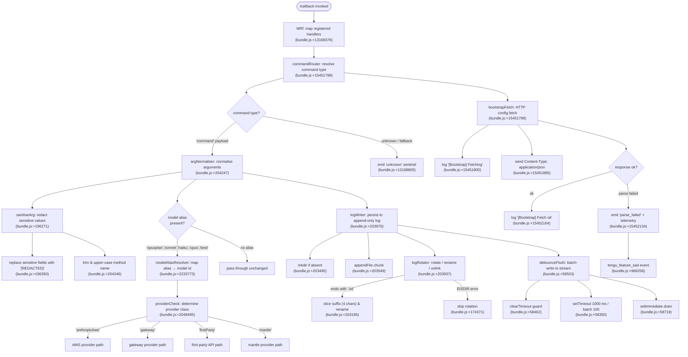

# `/callback`

> Analysis basis: CC v2.1.160 bundle.js (AST extraction + Claude interpretation)
> Minimum version: v2.1.160

---

## Overview

The `/callback` command is an internal, non-user-facing slash command of type `callback`. It acts as a programmatic re-entry point — rather than accepting textual user input, it receives a structured payload (identified by the string constant `"command"` at the registration site) and dispatches it through a pipeline that covers command routing, argument normalisation, model-alias resolution, log persistence, and a bootstrap fetch sequence. It is one of six command types (`prompt`, `agent`, `http`, `mcp_tool`, `callback`, `unknown`) enumerated in the bundle.

---

## Registration

| Field | Value |
|---|---|
| type | `callback` |
| name | `callback` |
| description | `null` |
| loc_byte | `13168763` |
| loc_byte_end | `13168796` |
| loc_line | `10529` |
| arbor_handler.name | `MRf` |
| arbor_handler.fqn | `claude-2.1.160::MRf` |
| arbor_handler.kind | `Function` |
| arbor_handler.resolution_path | `direct` |
| arbor_handler.n_hits | `1` |

Analysis basis: CC v2.1.160 bundle.js:+13168763

---

## Input Branching

The call graph from `MRf` fans out into more than three distinct paths (command-type dispatch, model-alias resolution, log-rotation/persistence, bootstrap fetch, and error/telemetry handling), so a Mermaid flowchart is used.



---

## Behavioral Spec

### 1. Handler Entry — `handlerMain` (`MRf`)

`MRf` is the sole directly resolved handler for `/callback` (Arbor resolution path: `direct`, n_hits: 1).

```
function handlerMain(registeredHandlers, payload):
    mapped = registeredHandlers.map(entry => dispatchEntry(entry, payload))
    result = resolveSubHandler(mapped, payload)
    return result
```

Analysis basis: CC v2.1.160 bundle.js:+13168376, +13168447

---

### 2. Command Router — `commandRouter` (`H` → `N`)

Receives the raw payload from `handlerMain`. Logs `[Bootstrap] Fetching` before initiating any network call. Sets HTTP headers `Content-Type: application/json` and `User-Agent`. Times out after **5000 ms** (bundle.js:+15451991).

```
function commandRouter(payload):
    log("[Bootstrap] Fetching")
    response = fetch(endpoint, {
        headers: {
            "Content-Type": "application/json",
            "User-Agent": userAgentString
        },
        timeout: 5000
    })
    if response.parseOk:
        log("[Bootstrap] Fetch ok")
        return dispatchPayload(payload)
    else:
        emitEvent("api_bootstrap_fetch", status="parse_failed")
        emitTelemetry("tengu_feature_sad")
```

Analysis basis: CC v2.1.160 bundle.js:+15451798, +15451800, +15451885, +15451900, +15451919, +15451991, +15452112, +15452134, +15452164

---

### 3. Argument Normaliser — `argNormaliser` (`N`)

Dispatches based on the `"command"` key in the payload. Calls sanitisation, model-alias resolution, and log-writing in sequence.

```
function argNormaliser(payload):
    type = payload.type   // one of: prompt, agent, http, mcp_tool, callback, unknown

    args     = sanitiseArg(payload.args)            // redact, trim, upper-case
    method   = payload.method.toUpperCase().trim()  // normalise HTTP verb
    modelId  = modelAliasResolver(payload.model)    // may be no-op
    logEntry = buildLogEntry(args, method, modelId)

    writeLog(logEntry)
    return { args, method, modelId }
```

The string `"debug"` appears as a log-level constant within this function (bundle.js:+204223).

Analysis basis: CC v2.1.160 bundle.js:+204247, +204265, +204287, +204305, +204349, +204369, +204372, +204388, +204394, +204408

---

### 4. Argument Sanitiser — `sanitiseArg` (`x4`)

Replaces sensitive field values with the literal string `"[REDACTED]"`. Uses `lastIndexOf` to locate a boundary within the argument string, slices at that boundary, and optionally replaces further with a secondary pattern. Truncates display output to **40 characters** (bundle.js:+15873361). The constant `2` governs a secondary slice offset (bundle.js:+196379).

```
function sanitiseArg(rawArg):
    mapped  = buildPrefixMap(rawArg)    // xwA: iterate BmK entries
    cleaned = rawArg.replace(sensitivePattern, "[REDACTED]")
    boundary = cleaned.lastIndexOf(delimiter)
    if boundary >= 0:
        result = cleaned.slice(0, boundary)
        if result.length > 40:
            result = result.slice(0, 40)
    tail = rawArg.at(-2)                // offset constant 2
    return { result, tail }
```

Analysis basis: CC v2.1.160 bundle.js:+196271, +196298, +196350, +196379, +196408, +196434, +196460, +15873361

---

### 5. Model Alias Resolver — `modelAliasResolver` (`K1` via `gq` → `GHH` → `K1`)

Maps human-readable alias strings to canonical model identifiers. Known aliases extracted from literals:

| Alias string | Notes |
|---|---|
| `opusplan` | bundle.js:+2233773 |
| `sonnet` | bundle.js:+2233814 |
| `haiku` | bundle.js:+2233853 |
| `opus` | bundle.js:+2233892 |
| `best` | bundle.js:+2233929 |
| `[1m]` | shorthand token, bundle.js:+2233799 |

```
function modelAliasResolver(alias):
    trimmed = alias.trim().toLowerCase()
    if isDenyListed(trimmed):             // DKH: check zKH inclusion list
        return null
    canonical = canonicalModelMap[trimmed]
    if canonical is null:
        canonical = providerFallback(trimmed)
    return canonical
```

Provider classes checked (bundle.js:+2048495, +2048530, +2048550, +2230622):
- `firstParty` — direct Anthropic API
- `anthropicAws` — AWS Bedrock
- `gateway` — API gateway
- `mantle` — mantle provider

Analysis basis: CC v2.1.160 bundle.js:+2233677, +2233688, +2233706, +2233716, +2233752, +2233791, +2233868, +2233906, +2233943, +2233961, +2233975, +2234019

---

### 6. Log Writer / Rotator — `logPersistence` (`rmK`)

Appends structured log entries to a file under a resolved directory. Rotation logic runs synchronously before each append.

```
function logPersistence(entry, dirPath):
    targetDir = path.dirname(dirPath)
    ensureDir(targetDir)                 // imK: mkdir recursive

    byteLen = Buffer.byteLength(entry)
    currentFile = resolveLogFile(dirPath)   // gwA: join + y6 stat

    if shouldRotate(currentFile):           // FwA
        if currentFile.endsWith(".txt"):
            renamed = currentFile.slice(0, -4)  // strip 4 chars
            fs.rename(currentFile, renamed)
        else:
            fs.unlink(currentFile)

    fs.appendFile(currentFile, entry)
    debounceFlush(entry)                 // rmK → QuH

    if O9_condition:
        registerHook()                   // O9 → HDA.register
```

EISDIR errors during rotation are silently swallowed (bundle.js:+174371).
`Buffer.byteLength` is called both in `rmK` (bundle.js:+203943) and in `imK` (bundle.js:+203642).

Analysis basis: CC v2.1.160 bundle.js:+203736, +203761, +203769, +203798, +203813, +203888, +203905, +203937, +203943, +203976, +203993, +204002, +204098, +203490, +203549

---

### 7. Debounced Flush — `debounceFlush` (`QuH`)

Batches write operations using a combination of `setTimeout`, `clearTimeout`, and `setImmediate`.

```
function debounceFlush(chunk):
    clearTimeout(pendingTimer)
    pendingQueue.push(chunk)

    if pendingQueue.length >= 100:       // flush threshold
        immediate = setImmediate(drainQueue)
    else:
        pendingTimer = setTimeout(drainQueue, 1000)  // 1000 ms delay

function drainQueue():
    lines = pendingQueue.join(lineSep)
    overflow = overflowQueue.join(sep2)
    writeStream(lines + overflow)
```

Flush threshold: **100** items (bundle.js:+58371).
Flush delay: **1000 ms** (bundle.js:+58350).

Analysis basis: CC v2.1.160 bundle.js:+58350, +58371, +58462, +58503, +58534, +58536, +58580, +58601, +58626, +58661, +58719, +58759, +58810, +58832, +58854, +58877

---

### 8. Stream Writer — `streamWriter` (`PmH` → `ZwA`)

Writes the final joined string to the output stream.

```
function streamWriter(content):
    joinedOutput = buildOutput(content)   // ZwA
    stream.write(joinedOutput)
```

Analysis basis: CC v2.1.160 bundle.js:+191795, +191859

---

## State & Side Effects

| Item | Detail |
|---|---|
| Telemetry | `tengu_feature_sad` emitted on bootstrap fetch parse failure (bundle.js:+966258) |
| Telemetry event label | `api_bootstrap_fetch` with sub-status `parse_failed` (bundle.js:+15452112, +15452134) |
| Hook registration | `O9` calls `HDA.register` when a post-write condition is met (bundle.js:+59048) |
| File system — append | `fs.appendFile` writes log chunks to the active log file (bundle.js:+203549) |
| File system — rotate | `fs.rename` / `fs.unlink` on log rotation; EISDIR silently ignored (bundle.js:+203247, +203287, +174371) |
| File system — mkdir | `fs.mkdir` (recursive) ensures log directory exists (bundle.js:+203490) |
| Stream write | `stream.write` called via `ZwA` for flush output (bundle.js:+191795) |
| Timer state | `clearTimeout` / `setTimeout` (1000 ms) / `setImmediate` manage flush cadence (bundle.js:+58462, +58626, +58719) |
| Sensitive data | Argument values matching a sensitive pattern are replaced with `"[REDACTED]"` before logging (bundle.js:+196350) |
| appState changes | <!-- TODO: not found in depth-2 traversal; needs --depth 4 --> |
| Sound | <!-- TODO: not found in depth-2 traversal; needs --depth 4 --> |

---

## Version History

| Version | Change |
|---|---|
| v2.1.160 | Initial analysis |

---

## Common Mistakes

1. **Treating `/callback` as a user command.** It has no `description` and is not intended to be typed directly by users — it is a programmatic re-entry hook. Invoking it without a well-formed structured payload produces the `"unknown"` sentinel (bundle.js:+13168809).
2. **Assuming model alias strings are case-sensitive.** The resolver calls `.toLowerCase()` before any lookup (bundle.js:+2233688); passing `"Sonnet"` or `"HAIKU"` will still resolve correctly.
3. **Ignoring the 5000 ms bootstrap fetch timeout.** Network slowness exceeding this threshold will abort the bootstrap phase, preventing payload dispatch.
4. **Expecting synchronous log writes.** Writes are batched via `debounceFlush` and may be delayed up to 1000 ms or until 100 chunks accumulate (bundle.js:+58350, +58371).
5. **Assuming `.txt` files are the only rotated log format.** The rotator checks the `.txt` suffix specifically; files without it are deleted with `fs.unlink` rather than renamed (bundle.js:+203195, +203247, +203287).
6. **Missing the sensitive-field redaction.** Log consumers should not expect raw argument values — any field matching the sensitive pattern will appear as `"[REDACTED]"` (bundle.js:+196350).

---

## Appendix — Identifier Mapping

> For bundle debugging only. Identifiers change across versions.

| Identifier | Role |
|---|---|
| `MRf` | Handler entry point for `/callback` (handlerMain) |
| `H` | Command router / bootstrap fetch orchestrator |
| `N` | Argument normaliser and type dispatcher |
| `lmK` | Argument pre-processor (calls sanitiseArg and friends) |
| `ADA` | Sub-processor within argument pipeline |
| `SH` | JSON stringifier helper |
| `x4` | Argument sanitiser (sanitiseArg) |
| `xwA` | Prefix-map builder (iterates BmK entries) |
| `q` | File unlink helper (calls ykK.unlinkSync) |
| `A` | Filename/path lowercase helper |
| `PmH` | Stream write coordinator |
| `ZwA` | Low-level stream writer |
| `rmK` | Log persistence orchestrator |
| `QuH` | Debounced flush manager |
| `R$H` | Log entry builder (joins je paths, calls n8/y6) |
| `d6` | Log path resolver |
| `A46` | EISDIR error guard (G8 helper) |
| `gwA` | Log file stat / path join helper |
| `FwA` | Log rotation decision handler |
| `imK` | mkdir + appendFile + rotate sub-handler (bound in rmK) |
| `O9` | Post-write hook registrar (calls HDA.register) |
| `o$` | Secondary router branch in H |
| `Ce` | Feature-flag check (F64.has) |
| `wj` | String replacement helper in H |
| `gq` | Model alias resolution entry (calls GHH, K1, yP) |
| `GHH` | Alias pipeline orchestrator (DN, p9H, ZA, lQ) |
| `DN` | Model descriptor builder |
| `p9H` | Alias pre-filter |
| `lQ` | Alias string parser (trim, startsWith, includes) |
| `K1` | Core model alias resolver |
| `C0` | Model config lookup (calls wKH) |
| `DKH` | Deny-list checker (zKH.includes) |
| `dN` | Provider resolver: xM + Jf |
| `_gH` | Provider resolver variant (Jf only) |
| `tT` | Provider token builder (xM, Jf, jA) |
| `XDq` | Provider token wrapper (calls tT) |
| `xM` | Provider base resolver (calls jA) |
| `xa6` | Provider inclusion checker (Ss4.includes) |
| `AgH` | Provider finaliser (FH helper) |
| `yP` | Alias resolution post-processor (K1, R0) |
| `R0` | Full provider resolution (EA, IHH, MzH, qgH, tT, FX, xM, jA, Jf, dN) |
| `t6` | Telemetry dispatcher (calls d; emits tengu_feature_sad) |
| `d` | Low-level telemetry emitter |
| `s5H` | Secondary helper called from MRf |

---

Note: index built via Arbor fallback; some signals (telemetry, literals) may be missing — see arbor-fallback.js.