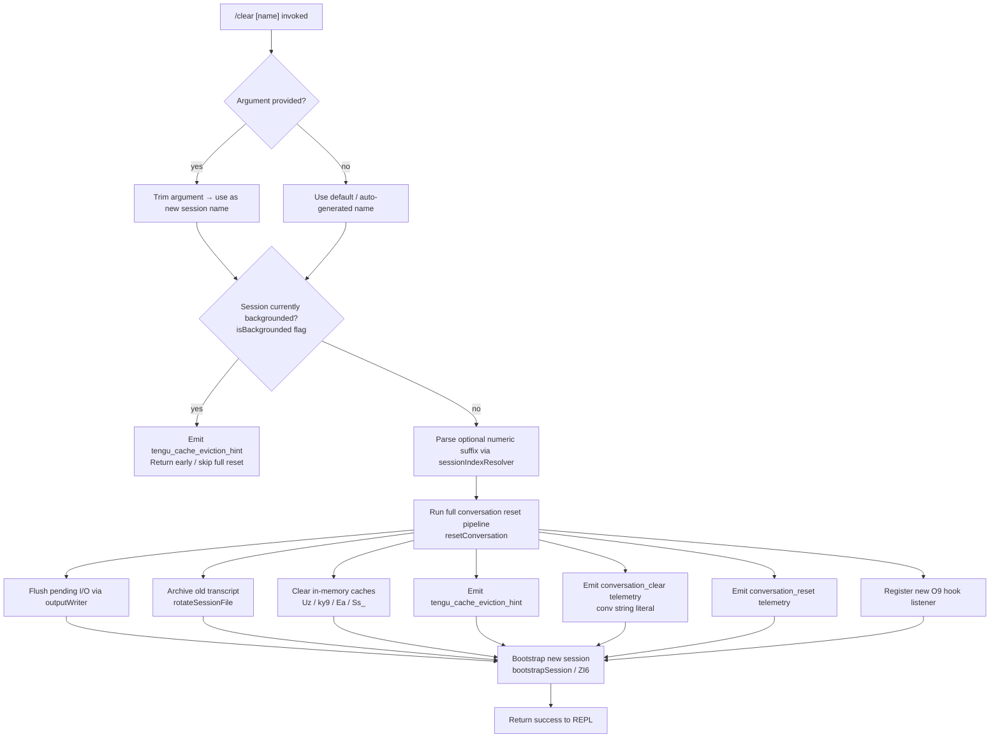

# `/clear`

> Analysis basis: CC v2.1.160 bundle.js (AST extraction + Claude interpretation)
> Minimum version: v2.1.160

---

## Overview

`/clear` starts a brand-new conversation session with an empty context window, while preserving the previous session on disk so it can be resumed later via `/resume`. It is a `local`-type command registered under three names (`clear`, `reset`, `new`) and supports non-interactive invocation. Internally it resets in-memory conversation state, archives the old session transcript, emits cache-eviction and conversation-reset telemetry events, and then bootstraps a fresh session.

---

## Registration

| Field | Value |
|---|---|
| type | `local` |
| name | `clear` |
| aliases | `reset`, `new` |
| description | Start a new session with empty context; previous session stays on disk (resumable with /resume) |
| argumentHint | `[name]` |
| supportsNonInteractive | `true` |
| thinClientDispatch | `post-text` |
| module_id | `Ny1` |
| load_inline | `true` |
| loc_byte | 10869521 |
| loc_byte_end | 10869812 |
| arbor_handler.name | `oKf` |
| arbor_handler.kind | `AsyncFunction` |
| arbor_handler.fqn | `claude-2.1.160::oKf` |
| arbor_handler.resolution_path | `module_id` |
| arbor_handler.n_hits | 0 |

Analysis basis: CC v2.1.160 bundle.js:+10869521

---

## Input Branching

Four distinct branches exist: optional session name argument, backgrounded-session guard, the main reset pipeline, and the non-interactive path. A Mermaid flowchart is used.



Analysis basis: CC v2.1.160 bundle.js:+10869347 (handler entry), +10867442 (`"clear"` literal), +10867565 (`"conversation_clear"` literal), +10868648 (`"conversation_reset"` literal), +10867633 (`"isBackgrounded"` literal), +10867530 (cache-eviction telemetry)

---

## Behavioral Spec

### 1. Handler Entry — `clearCommandHandler` (oKf)

```
async function clearCommandHandler(args, context):
    rawArg = args.trim()                          // H.trim at +10869347
    sessionName = rawArg if rawArg != "" else null

    sessionIndex = resolveSessionIndex(sessionName)  // ZI6 at +10869383
    await runNewSessionPipeline(sessionIndex, context)
```

Analysis basis: CC v2.1.160 bundle.js:+10869347, +10869383

### 2. Session Index Resolution — `resolveSessionIndex` (ZI6 → vI6)

```
function resolveSessionIndex(name):
    if name is not null:
        parsed = parseInt(name, 10)               // vI6 at +13120315
        if Number.isFinite(parsed):
            return clamp(parsed, Math.max, Math.min)  // +13120533, +13120546
    return defaultSessionIndex()                  // vY at +13120380
```

The resolver validates that the provided name token is a finite integer and clamps it to acceptable bounds. Non-numeric strings fall through to a default index.

Analysis basis: CC v2.1.160 bundle.js:+10867426, +13120315, +13120337, +13120533

### 3. Backgrounded-Session Guard (ZI6)

Before beginning any destructive state change, the handler checks the `isBackgrounded` flag (string literal at +10867633). If the current session is backgrounded, the command emits `tengu_cache_eviction_hint` and returns early without performing the full reset, preserving the running background session.

Analysis basis: CC v2.1.160 bundle.js:+10867633, +10867530

### 4. Full Conversation Reset Pipeline — `resetConversation` (N)

```
async function resetConversation(sessionIndex, context):
    // Step 1 – resolve session configuration
    sessionConfig = resolveSessionConfig(sessionIndex)     // Y46 at +204247
    sessionStore  = getSessionStore(sessionIndex)          // lmK at +204265

    // Step 2 – determine debug verbosity
    isDebug = sessionConfig.includes("debug")             // H.includes at +204287
    // "debug" literal at +204223

    // Step 3 – normalise session name for logging
    displayName = sessionName.toUpperCase()               // _.toUpperCase at +204349

    // Step 4 – compute file path components
    filePath = computeFilePath(sessionName)               // x4 at +204369

    // Step 5 – flush any buffered output
    flushOutput(context)                                  // PmH → ZwA at +204394

    // Step 6 – archive / rotate existing transcript file
    rotateSessionFile(filePath, context)                  // rmK at +204408

    // Step 7 – clear in-memory state
    clearAllCaches()

    // Step 8 – register session hook
    registerSessionHook()                                 // O9 at +204408 area
```

Analysis basis: CC v2.1.160 bundle.js:+204247, +204265, +204287, +204349, +204369, +204394, +204408

### 5. File Path Computation — `computeFilePath` (x4)

```
function computeFilePath(rawName):
    // Redact sensitive tokens before building the path
    sanitised = rawName.replace(sensitivePattern, "[REDACTED]")  // "[REDACTED]" literal +196350
    // Split on separator index 2                                // literal 2 at +196379
    parts = splitPath(sanitised)                                // xwA → BmK.map at +195986
    ext   = parts.at(-1)                                        // q.at at +196408
    base  = parts.lastIndexOf(separator)                        // A.lastIndexOf at +196434
    return parts.slice(0, base)                                 // A.slice at +196460
```

The path builder sanitises the raw session name, maps over path components (via `BmK.map`), and returns the safe file-system path. The `"[REDACTED]"` substitution (bundle.js:+196350) ensures secrets in session names do not leak to disk.

Analysis basis: CC v2.1.160 bundle.js:+196271, +196298, +196350, +196379, +196408, +196434, +196460

### 6. Output Flush — `flushOutput` (PmH → ZwA)

```
function flushOutput(context):
    writer = getOutputWriter(context)     // ZwA at +191859
    writer.write(pendingBuffer)           // H.write at +191795
```

Ensures any buffered text is emitted to the terminal before the session state is torn down.

Analysis basis: CC v2.1.160 bundle.js:+191795, +191859

### 7. Session File Rotation — `rotateSessionFile` (rmK)

```
async function rotateSessionFile(filePath, context):
    // 1. Flush pending async writes via outputQueue
    flushOutputQueue(context)                        // QuH at +203736
    // QuH clears setTimeout, rebuilds join arrays, uses setImmediate

    // 2. Build new file reference
    newRef = buildFileReference(filePath)            // R$H at +203761

    // 3. Compute parent directory
    parentDir = path.dirname(filePath)               // je.dirname at +203769

    // 4. Check current file state
    stat = fileStatHelper(filePath)                  // FwA → Hy.stat at +203091

    // 5. Rename .txt → archive name if present
    if filePath.endsWith(".txt"):                    // ".txt" literal +203195
        archiveName = filePath.slice(0, -4) + suffix // H.endsWith +203184, H.slice +203206
        fs.rename(filePath, archiveName)             // Hy.rename at +203247

    // 6. Remove stale file if rename fails or file is outdated
    fs.unlink(oldPath)                               // Hy.unlink at +203287

    // 7. Compute byte length of transcript for telemetry
    byteLen = Buffer.byteLength(transcript)          // +203943

    // 8. Bind write-append callback and execute
    appendCallback = appendToSession.bind(context)   // imK.bind at +204002
    await pendingWritePromise.then(appendCallback)   // vu6.then at +203993

    // 9. Register session-end hook
    registerSessionEndHook(context)                  // O9 at +204098
```

The literal `".txt"` (bundle.js:+203195) and the byte-offset slice of length 4 (number `4` at +203217) indicate the archived file has its `.txt` extension stripped before a new suffix is appended.

Analysis basis: CC v2.1.160 bundle.js:+203736, +203761, +203769, +203091, +203184, +203195, +203206, +203247, +203287, +203943, +204002, +204098

### 8. In-Memory Cache Clearance (Ss_)

`/clear` clears a large number of in-memory caches to ensure the new session starts with a completely clean state. The cache-clearance pipeline (`Ss_`, bundle.js:+10866391) calls into, among others:

- `ky9` → `NB.clear` (bundle.js:+6667023) — clears the skill-index cache
- `Ea` → `EP6`, `z_H`, `e$8`, `Ah9` — clears session/subagent state caches (`XV1.clear` at +10482985, `n26.clear` at +6703795, `Ky_.clear` at +6703807)
- `Wa` → `PG8.clear` (bundle.js:+9821367)
- `dL1` → `ahH.clear`, `xF_.clear` (bundle.js:+8887746, +8887758)
- `cH1` → `atH.clear`, `sE6.clear` (bundle.js:+8190273, +8190285)
- `Oa8` → `ZUH.clear` (bundle.js:+1063453)
- `Dy9` → `y$8.clear` (bundle.js:+6655551)
- `to8` → `GUH.clear` (bundle.js:+1056233)
- `u81` → `As.clear`, `yPH.clear` (bundle.js:+8256863, +8256874)
- `Uz` → `Cb6.clear`, `nm8.clear` (bundle.js:+26612, +26624) — clears policy-settings and hooks caches
- `du` → `H.clearSkillIndexCache` (bundle.js:+12984313)
- `Aj` → resets autonomous-loop counters via `Object.values` (+43134)

Additionally, `y47.resetAutonomousLoopDelivered` (bundle.js:+6715558) is explicitly called to reset autonomous-loop delivery tracking.

Analysis basis: CC v2.1.160 bundle.js:+10866391–+10866754 (full Ss_ body range)

### 9. New Session Bootstrap — `bootstrapSession` (ZI6)

After teardown, `ZI6` (bundle.js:+10867517) re-initialises the session:

```
async function bootstrapSession(sessionIndex, context):
    // Resolve working directory
    workDir = resolveWorkingDirectory(sessionIndex)   // xY at +10867837

    // Clear abort-signal set
    abortSet.clear()                                  // _.clear at +10867846

    // Enumerate modules to (re-)load
    moduleKeys = Object.keys(modules)                 // +10867871

    // Register new abort controller
    abortController = newAbortController()            // "abortController" literal +10868182

    // Spawn sub-system (MCP, hooks, logging)
    await startSubsystems(context)                    // sSH at +10868938

    // Emit conversation_clear event
    emit("conversation_clear")                        // +10867565

    // Emit conversation_reset event
    emit("conversation_reset")                        // +10868648

    // Generate new session UUID
    sessionUUID = Zy1.randomUUID()                    // +10868687

    // Emit session-start event
    emitSessionStart(sessionUUID)                     // sm8 at +10868705

    // Start log writer and coordinator
    startCoordinator(context)                         // "coordinator" literal +10869040

    // Start event loop
    startEventLoop(context)                           // "normal" mode literal +10869054
```

Analysis basis: CC v2.1.160 bundle.js:+10867517, +10867565, +10867696, +10867742, +10867837, +10867846, +10867871, +10868182, +10868648, +10868687, +10868705, +10869040, +10869054

---

## State & Side Effects

| Item | Detail |
|---|---|
| Telemetry | `tengu_cache_eviction_hint` (bundle.js:+10867530) — emitted on every clear, including early-exit for backgrounded sessions |
| Telemetry | `tengu_feature_ok` / `tengu_feature_bad` / `tengu_feature_sad` (bundle.js:+966123, +966181, +966258) — outcome tracking for the feature invocation path |
| Telemetry | `tengu_run_hook` (bundle.js:+13159635) — emitted when session-end hooks run |
| Telemetry | `tengu_repl_hook_finished` (bundle.js:+13143522) — emitted after REPL hook execution finishes |
| Telemetry | `tengu_hook_plugin_metrics` (bundle.js:+13138073) — hook-plugin metrics on session teardown |
| Telemetry | `tengu_session_renamed` (bundle.js:+13024709) — if the session name changes during the clear |
| Telemetry | `tengu_shell_set_cwd` (bundle.js:+8243000) — working-directory update after bootstrap |
| Event emission | `"conversation_clear"` string event emitted on successful clear (bundle.js:+10867565) |
| Event emission | `"conversation_reset"` string event emitted after bootstrap (bundle.js:+10868648) |
| File I/O | Old transcript file renamed (`.txt` → archive name) then existing path unlinked via `Hy.rename` / `Hy.unlink` (bundle.js:+203247, +203287) |
| File I/O | New session directory created with `Hy.mkdir`, content appended with `Hy.appendFile` (bundle.js:+203490, +203549) |
| Cache clearance | Clears at least 12 distinct in-memory caches (see §8 above) |
| Hook registration | `O9` → `HDA.register` (bundle.js:+59048) — registers session-end hook after reset |
| AbortController | Previous abort signals cleared (`_.clear` at +10867846); new `AbortSignal.timeout` created (bundle.js:+10867486) |
| Session UUID | New UUID generated via `Zy1.randomUUID` (bundle.js:+10868687) |
| appState changes | Session index updated; `isBackgrounded` checked and respected |
| Sound | None detected in depth-2 traversal |

---

## Version History

| Version | Change |
|---|---|
| v2.1.160 | Initial analysis |

---

## Common Mistakes

1. **Expecting `/clear` to delete session history** — The command archives (renames) the old transcript; it does not delete it. Use `/resume` to reload a cleared session.
2. **Using `/clear` in a backgrounded session and expecting a full reset** — When `isBackgrounded` is true, the command performs only the cache-eviction hint and returns early. A full reset requires the session to be in the foreground.
3. **Treating `/reset` and `/new` as separate commands** — Both are aliases for `/clear` and share identical behaviour.
4. **Passing a non-integer argument as session name** — The session-index resolver (`vI6`) calls `parseInt` and `Number.isFinite`; non-numeric strings silently fall back to the default session index rather than raising an error.
5. **Assuming the command is synchronous in non-interactive mode** — `supportsNonInteractive: true` means the command can run headlessly, but the handler is `async` and performs file I/O; callers must await completion before inspecting session state.

---

## Appendix — Identifier Mapping

> For bundle debugging only. Identifiers change across versions.

| Identifier | Role |
|---|---|
| `oKf` | `clearCommandHandler` — async entry-point for `/clear` (arbor_handler) |
| `ZI6` | `bootstrapSession` — initialises the new session after teardown |
| `vI6` | `sessionIndexResolver` — parses and clamps the optional numeric name argument |
| `vY` | `defaultSessionIndex` — returns the default session index when none is supplied |
| `N` | `resetConversation` — orchestrates the full conversation reset pipeline |
| `lmK` | `getSessionStore` — retrieves per-session store object |
| `ADA` | `initSessionState` — initialises session state entries |
| `SH` | `jsonStringifyHelper` — JSON serialisation utility |
| `x4` | `computeFilePath` — builds safe file-system path for session transcript |
| `xwA` | `mapPathComponents` — maps over file-path parts via `BmK.map` |
| `PmH` | `flushOutput` — flushes buffered terminal output |
| `ZwA` | `outputWriter` — low-level terminal write wrapper |
| `rmK` | `rotateSessionFile` — renames old transcript and sets up new file |
| `QuH` | `outputQueueFlusher` — drains the async output queue using `setTimeout`/`setImmediate` |
| `R$H` | `buildFileReference` — constructs the new file reference object |
| `d6` | `filePathResolver` — resolves relative to absolute file paths |
| `A46` | `fileStatCached` — cached file-stat wrapper |
| `gwA` | `getSessionFilePath` — joins path components to session file path |
| `FwA` | `fileRotationHelper` — stat → rename → unlink logic for transcript rotation |
| `imK` | `appendToSession` — appends content to the new session file |
| `O9` | `registerSessionEndHook` — registers session-end hook via `HDA.register` |
| `Ss_` | `clearAllCaches` — orchestrates clearance of all in-memory caches |
| `Ea` | `clearSessionCaches` — clears session/subagent state caches |
| `ky9` | `clearSkillCache` — clears the skill-index cache via `NB.clear` |
| `Wa` | `clearPolicyGraphCache` — clears `PG8` |
| `dL1` | `clearFileWatcherCaches` — clears `ahH` and `xF_` |
| `cH1` | `clearSettingsCaches` — clears `atH` and `sE6` |
| `Oa8` | `clearZUHCache` — clears `ZUH` |
| `Dy9` | `clearY$8Cache` — clears `y$8` |
| `to8` | `clearGUHCache` — clears `GUH` |
| `u81` | `clearConversationCaches` — clears `As` and `yPH` |
| `Uz` | `clearPolicyHooksCache` — clears `Cb6` and `nm8` |
| `du` | `clearSkillIndexCache` — calls `H.clearSkillIndexCache` |
| `Aj` | `resetAutonomousLoopCounters` — resets via `Object.values` |
| `xY` | `resolveWorkingDirectory` — resolves CWD for new session |
| `sm8` | `emitSessionStartEvent` — generates UUID and emits session-start via `Bb6.emit` |
| `sSH` | `startSubsystems` — starts MCP, hooks, and logging sub-systems |
| `xC` | `reloadSkillIndex` — reloads skill index after reset |
| `ACH` | `sessionOrchestrator` — top-level orchestrator called by `bootstrapSession` |
| `GL` | `sessionGraphLoader` — loads session graph nodes |
| `K0` | `mainSessionLoop` — primary REPL/session processing loop |
| `HX` | `nonInteractiveSessionLoop` — session loop for non-interactive dispatch path |
| `Q26` | `thinClientDispatcher` — handles `post-text` thin-client dispatch |
| `IB` | `pluginHookLoader` — loads plugin hooks on session start |
| `wS` | `sessionLogWriter` — writes session log entries |
| `JMH` | `appendFileLogger` — appends log entries to file via `appendFileSync`/`mkdirSync` |
| `GZ` | `subagentPathBuilder` — builds subagent directory paths |
| `p$` | `sessionContextBuilder` — builds context object passed to session loop |
| `n4` | `sessionEventEmitter` — core event emitter for session lifecycle events |
| `$M` | `sessionPathJoiner` — joins session directory path components |
| `km` | `worktreeStateEmitter` — emits worktree-state events |
| `XqH` | `isolationLatchHandler` — manages `isolation-latch` state |
| `G_` | `remoteControlInitialiser` — initialises remote-control adapter at startup |
| `W` | `coordinatorStarter` — starts coordinator mode |
| `E` | `eventLoopDriver` — drives the main event loop |
| `F_` | `settingsLoader` — loads flag/user/project/local settings |
| `H` | `bootstrapFetcher` — performs API bootstrap fetch (`[Bootstrap] Fetching` literal) |
| `gq` | `modelResolver` — resolves model identifier from config |
| `K1` | `modelNameNormaliser` — trims and lower-cases model name strings |
| `yP` | `providerSelector` — selects API provider |
| `R0` | `providerRouteBuilder` — builds provider routing object |
| `vq` | `sessionUUIDGenerator` — generates per-session UUIDs via `eP1.randomUUID` |