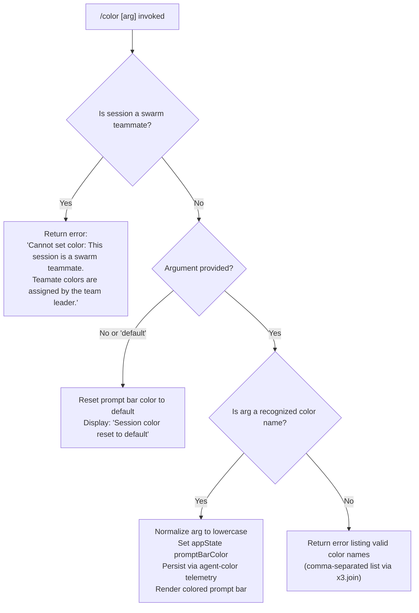

# `/color`

> Analysis basis: CC v2.1.160 bundle.js (AST extraction + Claude interpretation)
> Minimum version: v2.1.160

---

## Overview

The `/color` command sets the prompt bar color for the current Claude Code session. It accepts an optional color name argument; when invoked without an argument (or with `"default"`), it resets the prompt bar to its default color. The command is blocked in swarm teammate sessions, where colors are managed exclusively by the team leader.

---

## Registration

| Field | Value |
|---|---|
| type | `local-jsx` |
| name | `color` |
| description | `Set the prompt bar color for this session` |
| argumentHint | `null` |
| immediate | `true` |
| module_id | `hy1` |
| load_inline | `true` |
| loc_byte | `10871408` |
| loc_byte_end | `10871625` |
| loc_line | `7142` |
| arbor_handler.name | `tKf` |
| arbor_handler.fqn | `claude-2.1.160::tKf` |
| arbor_handler.kind | `AsyncFunction` |
| arbor_handler.resolution_path | `module_id` |
| arbor_handler.n_hits | `0` |

Analysis basis: CC v2.1.160 bundle.js:+10871408

The handler is resolved via `module_id` → `hy1` → exported async function `tKf`. The `immediate: true` flag means the command executes without requiring a confirmation step.

---

## Input Branching

Four distinct branches exist based on swarm context, argument presence, and argument validity, so a Mermaid flowchart is used.



Analysis basis: CC v2.1.160 bundle.js:+10870172 (handler entry `tKf`), +10870252 (swarm block), +10870442 (color validation), +10870488 (valid-colors list), +10870847 (reset message)

---

## Behavioral Spec

### Top-Level Handler (`tKf`)

The Arbor-resolved handler `tKf` is the async entry point for this command. It immediately delegates to the core implementation function (`kv8`), passing the parsed command argument.

```
async function colorCommandHandler(commandInput):
    return await colorCommandCore(commandInput)
```

Analysis basis: CC v2.1.160 bundle.js:+10870172, +10870180

---

### Swarm Teammate Guard (`kv8` → `AM` / `b0`)

Before any color logic runs, the handler checks whether the current session is operating as a swarm teammate (i.e., a sub-agent spawned by a team leader). If so, it immediately returns a user-visible error and takes no further action.

```
function checkSwarmContext(sessionStore):
    store = getAsyncLocalStore()        // AM → b0 → O4_.getStore
    if store indicates swarm-teammate mode:
        return errorResult(
            "Cannot set color: This session is a swarm teammate. " +
            "Teammate colors are assigned by the team leader."
        )
    return null   // proceed
```

Error string confirmed verbatim at Analysis basis: CC v2.1.160 bundle.js:+10870252

---

### Argument Normalization and Validation (`kv8` core logic)

After the swarm guard passes, the command normalizes the input argument and validates it against the known color set.

```
function normalizeAndValidate(rawArg, validColorSet):
    normalized = rawArg.toLowerCase()          // A.toLowerCase at +10870424

    if validColorSet.includes(normalized):     // sKf.includes at +10870442
        return { valid: true, color: normalized }

    if normalized equals "default" or rawArg is absent:
        return { valid: true, color: "default" }

    // arg not recognized
    validList = validColorSet.join(", ")       // x3.join at +10870488, literal ", " at +10870496
    return { valid: false, errorMessage: "Valid colors: " + validList }
```

Analysis basis: CC v2.1.160 bundle.js:+10870387 (`Math.floor`/`Math.random` used during color list selection or random-color fallback), +10870424, +10870442, +10870466, +10870488

> Note: `Math.floor` (+10870387) and `Math.random` (+10870398) are present in `kv8`, suggesting a random-color selection path (e.g., when no argument is given and a random color is chosen as a default, or for a "random" keyword). The exact trigger condition requires deeper traversal. <!-- TODO: not found in depth-2 traversal; needs --depth 4 -->

---

### Applying the Color (`kv8` → `_.setAppState`)

When a valid color is confirmed, the handler updates the application state to persist the chosen color for the current session's prompt bar.

```
function applyColor(color):
    if color equals "default":
        resetColor = DEFAULT_COLOR           // literal "default" at +10870586
        appState.promptBarColor = resetColor
        displayMessage("Session color reset to default")   // literal at +10870847
    else:
        appState.promptBarColor = color
    setAppState(appState)                    // _.setAppState at +10870628
```

Analysis basis: CC v2.1.160 bundle.js:+10870570, +10870577, +10870586, +10870628, +10870847

---

### Valid Color Enumeration (`Nv8`)

A helper function enumerates all recognized color names by inspecting the keys of a color-map object.

```
function getValidColorNames(colorMap):
    return Object.keys(colorMap)    // Object.keys at +10869945
```

Analysis basis: CC v2.1.160 bundle.js:+10870647 (`_.getAppState`), +10869945

---

### Telemetry Persistence (`NI6` → `JMH` / agent-color log)

After the color is applied to app state, a telemetry/persistence path is triggered. This writes an `"agent-color"` record to the log backend and fires the `tengu_agent_color_set` event.

```
async function persistAgentColor(colorValue):
    logEntry = buildLogEntry(colorValue)         // Bv at +13027807
    await writeAgentLog("agent-color", logEntry) // JMH at +13027816, literal at +13027828
    emitTelemetry("tengu_agent_color_set")       // +13027912
    notifyStateChange()                          // y6 at +13027873, n4 at +13027878
```

Analysis basis: CC v2.1.160 bundle.js:+10870617 (call to `NI6`), +13027807, +13027816, +13027828, +13027912

---

### JSX Result Renderer (`eKf`)

After state is updated, a JSX result object is constructed and returned to the CLI rendering layer. This includes either the success UI component or the reset confirmation message.

```
function buildColorResult(colorApplied, resetOccurred):
    if resetOccurred:
        return textResult("Session color reset to default")   // literal at +10870847
    else:
        component = renderColorSwatch(colorApplied)  // FE at +10870931
        return jsxResult(component)                  // H2H at +10871007
```

Analysis basis: CC v2.1.160 bundle.js:+10870838, +10870931, +10870972, +10870977, +10871007, +10871059, +10871077

---

### Background State Persistence (`pK8`)

The color choice is also persisted to background/transient session state storage, involving the job-queue subsystem and file I/O helpers.

```
async function persistToBackgroundState(colorValue):
    jobPath = buildJobPath("jobs")       // nK at +4130027, literal "jobs" at +4126639
    await writeStateFile(jobPath, { order: ..., stateOrder: ... })   // _1 at +4130041
    emitTelemetry("tengu_bg_state_read_transient")   // at +4127971
    // additional cache invalidation and re-read
    await invalidateAndReload(jobPath)   // Nj at +4130086, z5 at +4130144
```

Analysis basis: CC v2.1.160 bundle.js:+10870776, +4130027, +4130041, +4130086, +4130144, +4127971

---

## State & Side Effects

| Item | Detail |
|---|---|
| Telemetry | `tengu_agent_color_set` (bundle.js:+13027912) — fired after color is persisted to the agent log |
| Telemetry | `tengu_bg_state_read_transient` (bundle.js:+4127971) — fired during background state read/write for color persistence |
| appState changes | `_.setAppState` called at +10870628 to update the session's `promptBarColor` field |
| appState read | `_.getAppState` called at +10870671 to retrieve current state before modification |
| File I/O | `JMH` writes an `"agent-color"` log entry via `appendFileSync`/`mkdirSync` (bundle.js:+13023664, +13023703) |
| File I/O | Background state file written and renamed atomically via `hHH.writeFile`/`hHH.rename` (bundle.js:+2273578, +2273632) |
| Hook registration | `O9` → `HDA.register` at +59048 (event/hook registration during log persistence path) |
| Swarm guard | Blocks execution entirely for swarm teammate sessions (bundle.js:+10870252) |
| JSX output | Returns a JSX component (`eKf`) for prompt bar rendering (bundle.js:+10870838–10871077) |
| Sound | <!-- TODO: not found in depth-2 traversal; needs --depth 4 --> |

---

## Version History

| Version | Change |
|---|---|
| v2.1.160 | Initial analysis |

---

## Common Mistakes

1. **Using `/color` in a swarm teammate session** — The command is unconditionally blocked in swarm sub-agents. The team leader must set colors for all teammates; attempting to override this from within a teammate session returns the error at bundle.js:+10870252.
2. **Passing an unrecognized color name** — The argument is validated against a fixed set of color keys (`sKf`/`x3`). Unrecognized names return a formatted list of valid options rather than silently applying a default.
3. **Expecting persistence across sessions** — The color is stored in session-scoped app state and background transient state. It does not necessarily carry over to a new session unless the background state is reloaded.
4. **Case sensitivity** — The argument is normalized to lowercase before validation (`A.toLowerCase` at +10870424), so `"Red"` and `"RED"` are treated identically to `"red"`. However, passing an empty string is treated the same as the `"default"` keyword.
5. **Omitting the argument expecting a color picker** — There is no interactive color picker; omitting the argument (or passing `"default"`) resets the color to the default rather than prompting for selection.

---

## Appendix — Identifier Mapping

> For bundle debugging only. Identifiers change across versions.

| Identifier | Role |
|---|---|
| `tKf` | Top-level async handler for `/color` command (Arbor-resolved entry point) |
| `kv8` | Core color command implementation function (main logic, called by `tKf`) |
| `AM` | Async-context/session store accessor helper |
| `b0` | Inner store retrieval function (called by `AM`) |
| `eKf` | JSX result builder — constructs the rendered output for the color command |
| `NI6` | Agent-color log persistence orchestrator |
| `Bv` | Log entry builder for agent-color records |
| `JMH` | File-based log writer (appendFileSync / mkdirSync wrapper) |
| `n4` | State change notifier / hook trigger after log write |
| `O9` | Event/hook registration helper |
| `Nv8` | Valid color names enumerator (Object.keys over color map) |
| `pK8` | Background/transient state persistence coordinator for color |
| `nK` | Job path builder helper |
| `WE` | Job directory path helper |
| `_1` | Background state file read/write handler |
| `V8` | Generic async helper (used in state and file paths) |
| `G8` | Low-level utility (used by `V8`, `v5`, `t3`) |
| `N` | File content processor / state entry parser |
| `lmK` | File metadata helper |
| `H` | Bootstrap fetch / HTTP request helper |
| `x4` | String manipulation / path formatting utility |
| `PmH` | Redaction/sanitization helper |
| `rmK` | File read + byte-length measurement helper |
| `v5` | Async file utility wrapper |
| `m6` | JSON.parse wrapper |
| `Nj` | Cache-entry deletion helper (OLH.delete) |
| `z5` | State serialization and write helper |
| `t3` | Atomic file write helper (randomBytes + writeFile + rename) |
| `yH` | Error handling / logging queue helper |
| `d_` | Error object constructor wrapper |
| `FH` | String coercion utility |
| `n9` | Named error handler |
| `KNA` | Error classification helper |
| `T14` | FIFO log-entry rotation helper (shift/push) |
| `Ij` | File basename + message formatter |
| `krH` | Auxiliary rendering helper (role unclear at depth-2) |
| `FE` | Color swatch / UI component renderer |
| `ys` | Result wrapper utility |
| `iAH` | JSX element factory helper |
| `$M` | System message / notification formatter |
| `iS` | Notification sub-formatter |
| `Y_` | Notification sub-formatter (variant) |
| `y6` | State change notification dispatcher |
| `zN` | Core notification/event emitter |
| `SH` | JSON.stringify wrapper |
| `d6` | Log directory resolver |
| `d` | Generic async dispatcher / finalizer |
| `_` | App state accessor namespace (setAppState / getAppState) |
| `jk` | Log entry type helper |
| `H2H` | JSX wrapper for command result |
| `q` | Internal stream/resource handle (context-dependent) |
| `L` | Resource lifecycle manager (add/finally/delete) |
| `f` | File handle / stream object |
| `A` | String or module context variable (toLowerCase, close) |

---

Note: index built via Arbor fallback; some signals (telemetry, literals) may be missing — see arbor-fallback.js.