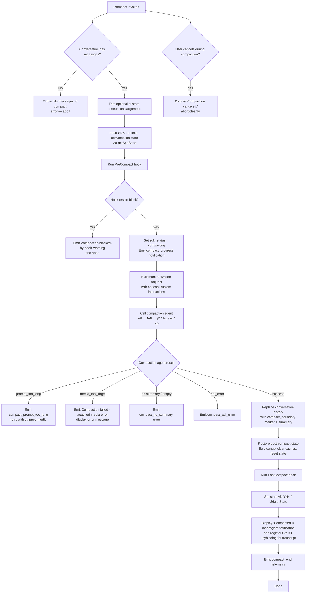

# `/compact`

> Analysis basis: CC v2.1.160 bundle.js (AST extraction + Claude interpretation)
> Minimum version: v2.1.160

---

## Overview

The `/compact` command frees up context window space by summarizing the current conversation and replacing the full message history with a compact summary. It supports an optional argument for custom summarization instructions, triggers `PreCompact` and `PostCompact` hooks, and can operate in both interactive and non-interactive (`--no-input`) modes.

---

## Registration

| Field | Value |
|---|---|
| type | `local` |
| name | `compact` |
| description | `Free up context by summarizing the conversation so far` |
| argumentHint | `<optional custom summarization instructions>` |
| supportsNonInteractive | `true` |
| thinClientDispatch | `post-text` |
| module_id | `Gh1` |
| load_inline | `true` |
| loc_byte | `10902812` |
| loc_byte_end | `10903125` |
| loc_line | `7271` |
| arbor_handler.name | `v4f` |
| arbor_handler.fqn | `claude-2.1.160::v4f` |
| arbor_handler.kind | `AsyncFunction` |
| arbor_handler.resolution_path | `module_id` |
| arbor_handler.n_hits | `0` |

Analysis basis: CC v2.1.160 bundle.js:+10902812

---

## Input Branching

The command has more than 3 distinct branches depending on message availability, hook results, compaction outcome, and cancellation. A flowchart is used.



---

## Behavioral Spec

### Entry Point — Handler `v4f`

The Arbor-resolved handler is `v4f` (AsyncFunction, resolved via `module_id` path).

```
async function compactCommandHandler(context):
    messages = getConversationMessages(context)
    if messages is empty:
        throw Error("No messages to compact")

    customInstructions = trim(context.args ?? "")
    appState = context.getAppState()

    // Run PreCompact hook
    hookResult = await runPreCompactHook(context)
    if hookResult.block == true:
        emitWarning("compaction-blocked-by-hook",
                    "compaction blocked by PreCompact hook")
        return

    setSdkStatus("compacting")
    emitProgress("compact_progress", phase="pre_compact")

    // Invoke main compaction logic
    result = await performCompaction(appState, customInstructions)

    if result.canceled:
        display("Compaction canceled.")
        return

    if result.error:
        handleCompactionError(result.error)
        return

    // Replace history with summary
    replaceHistoryWithSummary(result.summary, marker="compact_boundary")

    // Post-compact cleanup
    cleanupAfterCompaction()      // Ea: clear caches, reset autonomous loop, etc.
    setNewConversationState()     // YkH → l26.setState

    // Run PostCompact hook
    runPostCompactHook(context)

    // Display result
    displayCompactionResult(result.messageCount)
    registerTranscriptKeybinding("ctrl+o")

    emitTelemetry("tengu_compact")
    emitProgress("compact_end")
```

Analysis basis: CC v2.1.160 bundle.js:+10901843

---

### Compaction Orchestration — `N4f`

`N4f` is the main compaction orchestrator. It coordinates pre-compact hook execution, summary API call, result validation, and error classification.

```
async function compactionOrchestrator(appState, customInstructions):
    startTime = performance.now()

    // Phase 1: load system prompt and conversation context
    systemPromptParts = await buildSystemPrompt(appState)  // Eh1
    conversationMessages = await collectMessages(appState) // rc → K0

    // Phase 2: invoke summarization agent
    emitProgress("compact_start")
    setStreamMode("requesting")

    summaryResult = await invokeSummarizationAgent(
        messages         = conversationMessages,
        systemPrompt     = systemPromptParts,
        customInstructions = customInstructions
    )  // jZ → Ai_

    // Phase 3: validate result
    if summaryResult is missing text:
        recordMiss("miss_not_ready")
        return { error: "compact_no_summary" }

    if summaryResult is empty string:
        return { error: "no_summary" }

    // Phase 4: optional retry if prompt-too-long
    if summaryResult.error == "prompt_too_long":
        emitTelemetry("tengu_compact_ptl_retry")
        summaryResult = await retryWithStrippedMedia(...)

    // Phase 5: record timing
    elapsed = performance.now() - startTime
    emitTelemetry("tengu_compact", { duration: elapsed })

    return { summary: summaryResult.text, messageCount: ... }
```

Analysis basis: CC v2.1.160 bundle.js:+10897926

---

### Summarization Agent Invocation — `jZ` → `Ai_`

`Ai_` (called through `jZ` → `ks7`) is the core function that builds the summarization turn and dispatches the API call to the compaction agent.

```
async function buildAndInvokeSummarizationTurn(messages, systemPrompt, customInstructions):
    // Merge system and conversation messages
    normalizedMessages = normalizeMessagesForSummary(messages)
    // Attach custom instructions if provided
    if customInstructions is not empty:
        injectCustomInstructions(normalizedMessages, customInstructions)

    // Tool use is prohibited during compaction
    toolPolicy = { allow: false, reason: "Tool use is not allowed during compaction" }

    // Build compaction agent prompt (instructs model to produce text-only summary)
    agentSystemPrompt = "You are a helpful AI assistant tasked with summarizing conversations."

    // Dispatch via standard API query path
    response = await queryAPI({
        messages:     normalizedMessages,
        systemPrompt: agentSystemPrompt,
        tools:        [],
        streamMode:   "manual"
    })

    // Validate: only text blocks are accepted
    if response has tool_use blocks:
        recordError("compaction agent should only produce text summary")
        return { error: "other" }

    if response has no text:
        return { error: "no_text_response" }

    return { text: extractText(response) }
```

Analysis basis: CC v2.1.160 bundle.js:+10103631, +10587561

---

### Message Collection and Boundary Marking — `YO` / `xV8`

Before summarization, the existing message list is sliced at `compact_boundary` system messages. The slice positions are computed using literal indices `1` and `0`.

```
function collectMessagesToCompact(allMessages):
    // Find last compact_boundary marker
    boundaryIndex = findLastIndex(allMessages,
        msg => msg.role == "system" and msg.type == "compact_boundary")

    if boundaryIndex found:
        messagesForSummary = allMessages.slice(boundaryIndex + 1)
    else:
        messagesForSummary = allMessages.slice(0)

    return messagesForSummary
```

Literal `"compact_boundary"` at bundle.js:+10603726; `"system"` role at +10603704; slice indices `1` / `0` at +10603780 / +10603785.

Analysis basis: CC v2.1.160 bundle.js:+10603856

---

### Post-Compaction Cleanup — `Ea`

After the summary is obtained, `Ea` resets in-memory state to reflect the fresh conversation.

```
function postCompactCleanup(context):
    finalizeActiveRequest()      // s$8: drain pending request state
    clearUnclosedSpans()         // EP6 → wZ
    clearStreamingState()        // z_H: QU8, sU8
    clearAttachmentCache()       // e$8: XV1.clear
    clearMemoryCaches()          // Ah9: n26.clear, Ky_.clear
    resetActiveSession()         // ty9, tjH
    resetAutonomousLoopDelivered()  // y47.resetAutonomousLoopDelivered
    resetOutputTokenMetrics()    // Aj: NuH, Object.values
    emitProgress("post_compact_cleanup")
```

Analysis basis: CC v2.1.160 bundle.js:+10899270

---

### Reactive Compaction Path — `jy_` / `l$8`

In addition to the user-triggered path, the runtime has an automatic reactive compaction path (not user-invoked, but exercised within the same call graph).

```
async function reactiveCompaction(appState):
    emitTelemetry("tengu_reactive_compact_attempt")

    groups = groupConversationIntoChunks(appState)
    if groups.length < 2:
        logDebug("Reactive compact: fewer than 2 groups, nothing to compact")
        recordOutcome("too_few_groups")
        return

    assistantMessages = filterAssistantMessages(groups)
    if assistantMessages is empty:
        logDebug("Reactive compact: no assistant messages in summarize set, bailing")
        recordOutcome("exhausted")
        return

    result = await summarizeGroups(groups)

    if result.error == "media_too_large":
        logDebug("Reactive compact: summarize hit media-size error, retrying stripped")
        result = await summarizeGroupsStripped(groups)
        if result.error:
            recordOutcome("media_unstrippable")
            return

    if result.summary is empty:
        logDebug("Reactive compact: empty summary text in summarization response")
        recordOutcome("summarization produced empty response")
        return

    applyReactiveSummary(result)
    emitTelemetry("tengu_reactive_compact_succeeded")
```

Analysis basis: CC v2.1.160 bundle.js:+6718928, +6700186

---

### System Prompt Construction — `Eh1` / `BE`

Before the compaction API call, a full system prompt is assembled from multiple sources.

```
async function buildCompactionSystemPrompt(appState):
    parts = []

    // Core agent identity
    parts.push(buildBaseSystemPrompt())           // BE → CKA

    // Memory: user memory, team memory if enabled
    memoryBlock = await buildMemoryPrompt(appState)  // GY6 → _PL.buildCombinedMemoryPrompt
    if memoryBlock:
        parts.push(memoryBlock)

    // Environment info (cwd, git worktree status, etc.)
    parts.push(buildEnvInfo(appState))            // mRf, pRf, TF

    // Task continuity, context management settings
    parts.push(buildTaskContinuity())             // Ys6
    parts.push(buildContextManagementBlock())     // lRf

    // Collect last assistant-turn snapshot for continuity
    lastTurnSnapshot = findLastCompactState(appState)  // N_

    return assembleSystemPrompt(parts, lastTurnSnapshot)
```

Analysis basis: CC v2.1.160 bundle.js:+10901330, +13217299

---

### Hook Integration — `rc` / `K0`

The command invokes `PreCompact` and `PostCompact` lifecycle hooks via the hook runner.

```
async function runCompactHooks(phase, context):
    // phase: "PreCompact" | "PostCompact"
    matchingHooks = filterHooksByEvent(loadedHooks, phase)

    for hook in matchingHooks:
        hookResult = await executeHook(hook, context)  // K0 → lS8

        if phase == "PreCompact" and hookResult.block:
            return { blocked: true }

        if hookResult.error:
            recordTelemetry("tengu_run_hook", { outcome: "error" })

    return { blocked: false }
```

Literal `"PreCompact"` at bundle.js:+13106032; `"PostCompact"` at +13139230.

Analysis basis: CC v2.1.160 bundle.js:+13106005

---

## State & Side Effects

| Item | Detail |
|---|---|
| Telemetry: `tengu_compact` | Fired on successful completion (bundle.js:+10056636) |
| Telemetry: `tengu_compact_failed` | Fired when compaction fails (bundle.js:+10067783) |
| Telemetry: `tengu_compact_ptl_retry` | Fired when prompt-too-long retry is triggered (bundle.js:+10054703) |
| Telemetry: `tengu_compact_cache_prefix` | Cache prefix telemetry (bundle.js:+10054231) |
| Telemetry: `tengu_compact_cache_sharing_success` | Cache sharing succeeded (bundle.js:+10065062) |
| Telemetry: `tengu_compact_cache_sharing_fallback` | Cache sharing fell back (bundle.js:+10065692) |
| Telemetry: `tengu_reactive_compact_attempt` | Auto-compact attempt (bundle.js:+6700984) |
| Telemetry: `tengu_reactive_compact_succeeded` | Auto-compact success (bundle.js:+6721575) |
| Telemetry: `tengu_reactive_compact_failed` | Auto-compact failure (bundle.js:+6719194) |
| Telemetry: `tengu_precomputed_compact_consumed` | Pre-computed summary used (bundle.js:+6714252) |
| Telemetry: `tengu_precomputed_compact_discarded` | Pre-computed summary discarded (bundle.js:+6714871) |
| Telemetry: `tengu_post_compact_file_restore_success` | Post-compact file restore succeeded (bundle.js:+10068265) |
| Telemetry: `tengu_post_compact_file_restore_error` | Post-compact file restore failed (bundle.js:+10068307) |
| appState changes | Conversation message history replaced with summary + `compact_boundary` marker; `sdk_status` set to `"compacting"` then cleared; `l26.setState` called to commit new state |
| Hook registration | `PreCompact` hook fired before compaction; `PostCompact` hook fired after. Either can block or modify behavior |
| Cache resets | `XV1.clear`, `n26.clear`, `Ky_.clear` executed in post-compact cleanup |
| Autonomous loop reset | `y47.resetAutonomousLoopDelivered` called in cleanup |
| Keybinding | `Ctrl+O` (`app:toggleTranscript`) registered after successful compaction (bundle.js:+10901167) |
| Sound | None detected in depth-2 traversal |

---

## Version History

| Version | Change |
|---|---|
| v2.1.160 | Initial analysis |

---

## Common Mistakes

1. **Invoking `/compact` on an empty conversation** — The handler throws immediately with the message `"No messages to compact"` (bundle.js:+10901874). There must be at least one message in the conversation.
2. **Expecting tool results to survive compaction** — All tool use history is summarized into plain text. Any in-flight tool state is lost after compaction.
3. **Using `/compact` when a `PreCompact` hook blocks it** — If a configured `PreCompact` hook returns `block: true`, compaction silently aborts with a `"compaction-blocked-by-hook"` warning. Check hook configuration if compaction unexpectedly does nothing.
4. **Assuming custom instructions override safety behavior** — The optional argument is appended as summarization guidance, not a system override. The agent still refuses tool calls during compaction regardless of custom instructions (literal: `"Tool use is not allowed during compaction"`, bundle.js:+10064185).
5. **Confusing reactive compaction with manual compaction** — The runtime triggers reactive compaction automatically when context usage is high. Manual `/compact` and reactive compaction share the same core summarization path but differ in triggering conditions and group-selection logic.

---

## Appendix — Identifier Mapping

> For bundle debugging only. Identifiers change across versions.

| Identifier | Role |
|---|---|
| `v4f` | Main command handler (AsyncFunction); entry point resolved by Arbor via module_id `Gh1` |
| `YO` | Conversation message slicer / collector; separates messages at compact_boundary |
| `xV8` | Message slice helper (depth-1 callee of YO) |
| `pj` | Low-level message preparation helper |
| `N` | General-purpose message normalization / formatting utility |
| `lmK` | Message list processor (calls `_y`, `cmK`, `ADA`) |
| `SH` | JSON.stringify wrapper / serialization helper |
| `x4` | String processing helper (replace, lastIndexOf, slice) |
| `PmH` | Prompt-building helper (calls `ZwA`) |
| `rmK` | Resource / file reference builder for messages |
| `H` | Conversation state object / message array (high-level) |
| `Ce` | Feature-flag membership checker (F64.has) |
| `wj` | String replacement utility |
| `gq` | Model-name normalization entry point |
| `GHH` | Model alias resolution (DN, p9H, ZA, lQ) |
| `K1` | Full model-name normalization (trim, toLower, replace, DKH, dN) |
| `yP` | Secondary model normalization path |
| `t6` | General debug logger |
| `ic` | Context / capability loader (calls x_, W6) |
| `W6` | Agent-context bootstrap / capability registry |
| `HA8` | Agent identity cache handler (jY_.has, WDH.get, jY_.add, wY_) |
| `wY_` | Agent record builder (mx, vVH, kU, rQH, randomUUID, SH, TjL, Ur.emit) |
| `WY_` | Agent registration finalizer (dSq, l_, CQq, Ce) |
| `R6` | File-system operation dispatcher (d6, y0, hY_, ZDH) |
| `ZDH` | Config/file read-write utility (readFileSync, statSync, mkdirSync, etc.) |
| `ojL` | File watcher (watchFile, unwatchFile) |
| `N4f` | Compaction orchestrator (performance.now, jZ, rc, Eh1, KZ8, I4f, _38, jy_, yH) |
| `jZ` | Summarization turn dispatcher (calls ks7) |
| `ks7` | Summarization pipeline setup (WwH, Ai_) |
| `Ai_` | Core summarization API caller; builds payload, handles content types, dispatches |
| `rc` | Hook runner coordinator (GL, K0, K.filter, f.push, M.map) |
| `GL` | Hook loader / context builder (y6, sS, EW, QV, Bv, S6) |
| `K0` | Hook execution engine (FH, CU, N, PMH, H, TKA, lS8, jKA, cS8, eAH, wKA, wKK) |
| `lS8` | Shell/process hook spawn handler |
| `Eh1` | System-prompt assembler for compaction (getAppState, BE, N_, Vm, Promise.all, QD, QJ) |
| `BE` | Full system-prompt builder (many sub-builders: CKA, EG8, GY6, mKA, SRf, etc.) |
| `GY6` | Memory-prompt builder (pVH.isTeamMemoryEnabled, pVH.getTeamMemPath, _PL.buildCombinedMemoryPrompt) |
| `mKA` | Compact-mode system-prompt segment builder |
| `N_` | Last-assistant-turn state finder (getAppState, A.findLast, Ov8, zv8) |
| `Vm` | Agent memory loader (bK, WC, eV, G_, M, RY, H.getSystemPrompt) |
| `KZ8` | Context-window check / token estimator |
| `I4f` | Inner compaction loop (performance.now, Oy_, voH, zy_, a$8, jZ) |
| `Oy_` | SDK-turn request waiter (Promise.race, addEventListener) |
| `voH` | Pre-computed compact consumer (r$8, d, FD, Math.round) |
| `zy_` | Boundary UUID locator (H.findIndex, H.slice) |
| `a$8` | Post-compaction timing recorder (d, Math.round, performance.now, FD, N) |
| `_38` | Full reactive-compaction runner (FNH, Rj, WP6, cc, p26, yuH, IoH, S47, qJH, Jy_, jZ, T7H, b$8, C$8, TE, U$) |
| `jy_` | Reactive-compaction orchestrator (Rj, performance.now, l$8, TE, U$, _38) |
| `l$8` | Reactive-compaction group processor (YO, EoH, N, K.map, jZ, cy9, T47, E47) |
| `S47` | Tool/state snapshot collector (q38, M38, K38, f38, L38, W7H, JkH, PkH, IB) |
| `T47` | Reactive-summarization single-group invoker |
| `IB` | Plugin hook loader (eK, vY, X4H, N, EUH, sS, Q26, lc.emit) |
| `qJH` | Post-compact history replacer (GL, K0, L.push, L.join) |
| `C$8` | Token-counting / message-grouping utility |
| `yE` | Message content type normalizer (handles file, image, notebook, pdf, tool_use, etc.) |
| `Ea` | Post-compact cleanup coordinator (s$8, EP6, z_H, e$8, Ah9, ty9, tjH, y47.resetAutonomousLoopDelivered, Aj) |
| `YkH` | State-commit helper (l26.setState) |
| `Th1` | Post-compact UI notifier (AaH, mP, j6.dim, K.join) |
| `vH6` | Auto-compact path (compact_auto / compact_manual dispatcher; mirrors v4f for background sessions) |
| `eW1` | Compaction API turn runner (W6, YP1, setInterval, a0, Ay_, EZ, d$8, K_, yE, D4K, YO, etc.) |
| `D4K` | Main API query loop / streaming handler |
| `BwH` | Token usage recorder (v4, String, Math.round) |
| `Qn_` | Post-compact status display helper (FH) |
| `cc` | Credentials / auth header builder (FH, Wy9) |
| `bu` | Path/URL sanitizer for display (XsL, JsL, DsL, OsL, TsL, WsL) |
| `OI` | Prefix check utility (H.startsWith) |
| `FD` | Span/trace finalizer |
| `GkH` | Status-bar updater (H.setStatus) |
| `tW1` | Compaction result presenter (Oi, GH, oV) |
| `Jy_` | Message-filter for post-compact restore (A.map, WRH, L.at) |
| `WRH` | Tool-use filter for restore (H.filter, DS8, ZS8, fSf) |

---

Note: index built via Arbor fallback; some signals (telemetry, literals) may be missing — see arbor-fallback.js.