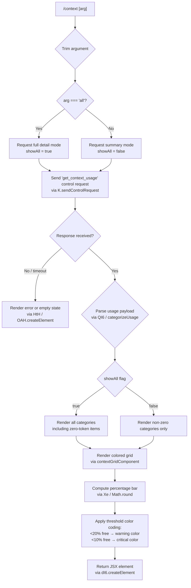

# `/context`

> Analysis basis: CC v2.1.160 bundle.js (AST extraction + Claude interpretation)
> Minimum version: v2.1.160

---

## Overview

`/context` visualizes the current context window usage as a colored, categorized grid rendered inline in the terminal. It sends a `get_context_usage` control request to the active session, receives a structured usage report, and renders a JSX component that breaks token usage down by category (system prompt, tools, memory files, messages, etc.) with color-coded cells indicating fill level.

---

## Registration

| Field | Value |
|---|---|
| type | `local-jsx` |
| name | `context` |
| description | `Visualize current context usage as a colored grid` |
| argumentHint | `[all]` |
| thinClientDispatch | `control-request` |
| module_id | `HC1` |
| load_inline | `true` |
| loc_byte | `11303318` |
| loc_byte_end | `11303544` |
| loc_line | `7324` |
| arbor_handler.name | `y5f` |
| arbor_handler.fqn | `claude-2.1.160::y5f` |
| arbor_handler.kind | `AsyncFunction` |
| arbor_handler.resolution_path | `module_id` |
| arbor_handler.n_hits | `0` |

Analysis basis: CC v2.1.160 bundle.js:+11303318

---

## Input Branching

The handler has 3+ distinct paths depending on the argument string and the response received from the control request.



Analysis basis: CC v2.1.160 bundle.js:+11302043, +11302078, +11302248, +11300151, +210096, +210138

---

## Behavioral Spec

### Handler Entry — `contextCommandHandler` (`y5f`)

The async handler is the resolved entry point for this command.

```
async function contextCommandHandler(args, context):
    rawArg = args.trim()                         // A.trim @+11302018
    showAll = (rawArg === "all")                 // literal "all" @+11302043
    
    // resolve display label for each slot via labelLookup (b$)
    labelMap = buildSlotLabelMap()               // b$ → d0H @+11302051

    // dispatch control request to running session
    response = await context.sendControlRequest("get_context_usage")
                                                 // @+11302108, +11302078
    if response is null or error:
        return renderEmptyState()                // HtH path @+11302138

    // build the JSX tree
    usageData = parseContextUsage(response)      // QI6 @+11302248
    gridEl    = buildContextGrid(usageData, showAll)  // k5f @+11302421
    headerEl  = buildHeader(usageData)           // GH @+11302332
    systemEl  = buildSystemSection(response, context) // H @+11302212, literal "system" @+11302225

    // clamp display to 80 columns                // literal 80 @+11302454
    return createElement(rootContainer, {maxWidth: 80},
                         headerEl, systemEl, gridEl)
```

Analysis basis: CC v2.1.160 bundle.js:+11302012–+11302471

---

### Control Request Dispatch

The command uses the `thinClientDispatch: "control-request"` path. Internally the handler calls `K.sendControlRequest` with the event name `"get_context_usage"`.

Analysis basis: CC v2.1.160 bundle.js:+11302078; literal `"get_context_usage"` at +11302108

On the other side, the bridge REPL handler validates that `onGetContextUsage` callback is registered before serving the request; if absent, it responds with the error string `"get_context_usage is not supported in this context (onGetContextUsage callback not registered)"` (bundle.js:+12496370).

---

### Usage Parsing — `parseContextUsage` (`QI6`)

```
function parseContextUsage(rawResponse, showAll):
    // obtain token budget from model config (LK → VK → smK)
    tokenBudget = getModelTokenBudget()          // LK @+11300075

    // filter categories to display
    categories = rawResponse.filter(...)         // A.filter @+11300116
    if not showAll:
        categories = categories.filter(c => c.tokens > 0)

    // find "free space" and "autocompact buffer" special slots
    freeSlot   = categories.find(c => c.label === "Free space")
                                                 // literal @+11300151
    compactSlot = categories.find(c => c.label === "Autocompact buffer")
                                                 // literal @+11300174

    // resolve human-readable labels for known source types:
    // "projectSettings" → "Project"  @+11301100/+11301120
    // "userSettings"    → "User"     @+11301140/+11301157
    // "localSettings"   → "Local"    @+11301174/+11301192
    // "plugin"          → "Plugin"   @+11301282/+11301293
    // "built-in"        → "Built-in" @+11301312/+11301325
    // "mcp"             → "MCP"      @+11299450/+11301462

    return {categories, freeSlot, compactSlot, tokenBudget}
```

Analysis basis: CC v2.1.160 bundle.js:+11300075–+11301352

---

### Percentage / Color Computation — `computeFillPercent` (`Xe`)

```
function computeFillPercent(usedTokens, budgetTokens):
    raw = usedTokens / budgetTokens * 100
    return Math.round(raw)                       // Math.round @+210125

function chooseColor(freePercent):
    if freePercent < 10:                         // threshold @+210138
        return criticalColor                     // label "< 20" covers ≤20 band
    if freePercent < 20:                         // threshold @+210096
        return warningColor
    return normalColor

function formatPercentage(value):
    // locale "en-US", style "compact"           // @+212075, @+212093
    // appends ".0" suffix for whole numbers     // literal ".0" @+210067
    return value.toLocaleString("en-US") + "%"
```

Analysis basis: CC v2.1.160 bundle.js:+210053–+210138

---

### Grid Rendering — `buildContextGrid` (`k5f`) and `contextGridRow` (`YO`)

```
function buildContextGrid(usageData, showAll):
    rows = []
    for category in usageData.categories:
        rows.push(contextGridRow(category))      // YO @+11301974

    // attach compact boundary marker if present  // literal "compact_boundary" @+10603726
    compactBoundary = findCompactBoundary(usageData)  // xV8 → pj @+10603809
    if compactBoundary:
        rows.push(compactBoundaryRow(compactBoundary))
        // slice remaining rows after boundary    // H.slice @+10603879

    return gridContainer(rows)

function contextGridRow(category):
    colorCell = applyColor(chooseColor(category.freePercent))
    return renderRow(colorCell, category.label, category.tokenCount)
```

Analysis basis: CC v2.1.160 bundle.js:+11301974–+11302421, +10603726–+10603879

---

### Fallback / Empty-State Rendering — `renderEmptyState` (`HtH`)

```
function renderEmptyState(eventEmitter, responseStr):
    // listen for 'data' event on emitter        // K.on @+7882737, literal "data" @+7882742
    text = responseStr.toString()               // f.toString @+7882774
    // construct plain-text JSX element          // nU → _X_ → Weq.createElement @+3810687
    return OAH.createElement(plainTextComponent, {text}) // @+7882804
```

Analysis basis: CC v2.1.160 bundle.js:+7882737–+7882804

---

### Category Color Labels (from literals)

| Category | Color key (literal) |
|---|---|
| System prompt | `"promptBorder"` (+10085956) |
| System tools | `"inactive"` (+10086034) |
| MCP tools | `"cyan_FOR_SUBAGENTS_ONLY"` (+10086095) |
| MCP tools (deferred) | `"MCP tools (deferred)"` (+10086144) |
| System tools (deferred) | `"System tools (deferred)"` (+10086230) |
| Custom agents | `"permission"` (+10086350) |
| Memory files | `"claude"` (+10086416) |
| Skills | `"warning"` (+10086448) |
| Messages | `"purple_FOR_SUBAGENTS_ONLY"` (+10086976) |

Analysis basis: CC v2.1.160 bundle.js:+10085925–+10086976

---

## State & Side Effects

| Item | Detail |
|---|---|
| Telemetry | None specific to `/context` found in depth-2 traversal; the broader `get_context_usage` bridge path emits `tengu_bridge_message_received` (+12492472) when the control-response is received |
| Control request | Emits `"get_context_usage"` control request on the active session bridge (+11302108) |
| Hook registration | None registered by this command directly |
| appState changes | None — read-only display command |
| Sound | None |
| Column width | Output clamped to 80 columns (literal `80` at +11302454) |
| `showAll` mode | Activated when user passes `all` argument (+11302043); shows zero-token categories |

---

## Version History

| Version | Change |
|---|---|
| v2.1.160 | Initial analysis |

---

## Common Mistakes

1. **Running without an active session**: `/context` sends a control request to the running session; invoking it before a session is attached results in the empty-state renderer being shown instead of usage data.
2. **Expecting zero-token rows by default**: Categories with zero tokens are filtered out unless you use `/context all`.
3. **Misreading the color thresholds**: The warning band begins below 20 % free space (+210096), and the critical band begins below 10 % free space (+210138) — not at usage levels.
4. **Thin-client dispatch assumption**: The `thinClientDispatch: "control-request"` field means this command travels through the bridge RPC layer, not the normal prompt pipeline; it will not work in environments that have not registered the `onGetContextUsage` callback.
5. **Compact-boundary row**: When auto-compaction is configured, a special divider row (`"compact_boundary"`) appears in the grid; it is informational and not a separate category entry.

---

## Appendix — Identifier Mapping

> For bundle debugging only. Identifiers change across versions.

| Identifier | Role |
|---|---|
| `y5f` | Main async handler for `/context` command (`contextCommandHandler`) |
| `Lq` | Fullscreen / terminal environment detection wrapper |
| `Ce` | Feature-flag lookup (checks `F64` set) |
| `Hj_` | Terminal color-support probe |
| `E1` | Color mode resolver (reads `no`/`off` env vars) |
| `FH` | Color output formatter / theme helper |
| `sr` | Terminal type detector |
| `SXL` | iTerm2 / tmux control-mode detector |
| `hXL` | Terminal `$TERM` prefix checker |
| `N` | Bootstrap config fetcher / settings loader |
| `lmK` | Settings load orchestrator |
| `ADA` | Disk settings reader |
| `H` | Global app config / session state object |
| `o$` | Config getter helper |
| `wj` | String replacement utility |
| `gq` | Token / model capacity resolver |
| `t6` | Logging helper |
| `SH` | JSON serializer wrapper |
| `x4` | Path / filename utilities |
| `xwA` | Token map builder |
| `PmH` | Write-to-stdout helper |
| `ZwA` | Raw stream writer |
| `rmK` | Session log manager |
| `QuH` | Debounce / flush queue |
| `R$H` | Log file rotator |
| `A46` | File size checker |
| `gwA` | Log path builder |
| `FwA` | Log file rename / cleanup |
| `imK` | Log append worker |
| `O9` | Hook registrar (`HDA.register`) |
| `ew_` | Fullscreen-disabled flag resolver |
| `l_` | Settings-from-disk loader |
| `lp` | Settings load pipeline |
| `EG` | Policy settings reader |
| `h9` | In-flight request deduplicator |
| `ms8` | Settings file parser |
| `EQ` | Flag settings collector |
| `bb6` | Settings merge helper |
| `RXL` | Fullscreen / render controller |
| `W6` | Model / API capability map |
| `HY6` | API endpoint builder |
| `_Y6` | Credential resolver |
| `px` | Request formatter |
| `HA8` | Request dedup tracker |
| `R6` | API call executor |
| `b$` | Slot label map builder |
| `d0H` | Slot label definitions |
| `K` | Session / transport handle |
| `L` | Active request set |
| `f` | Stream / socket object |
| `HtH` | Empty-state / fallback renderer |
| `nU` | Plain-text JSX factory |
| `_X_` | Inline JSX element creator |
| `Wo` | Grid container component |
| `rcH` | Grid row component |
| `QI6` | Usage data parser / categorizer |
| `LK` | Model token-budget resolver |
| `VK` | Budget lookup table |
| `smK` | Budget constants map |
| `SUH` | Source-type label resolver |
| `Xe` | Percentage calculator |
| `GH` | Header string formatter |
| `k5f` | Grid builder orchestrator |
| `YO` | Individual grid-row renderer |
| `xV8` | Compact-boundary detector |
| `pj` | Compact boundary marker |
| `MZ8` | Full system-prompt assembly pipeline |
| `BG` | Prompt section composer |
| `GHH` | Message formatter |
| `DN` | Text block builder |
| `p9H` | Prompt part serializer |
| `lQ` | Model display-name resolver |
| `tT` | Provider type mapper |
| `xM` | Provider category classifier |
| `Jf` | API provider details |
| `jA` | Provider formatter |
| `dN` | Alternate provider formatter |
| `hE` | Auto-compact settings reader |
| `h4` | Legacy global config reader |
| `zV` | Config merge helper |
| `b8` | Settings event subscriber |
| `ll` | Context-window size resolver |
| `aq` | Model string normalizer |
| `er6` | Model entry formatter |
| `kP` | Model string classifier |
| `ZV` | Context window size table |
| `C0` | Window size lower-bound selector |
| `OU` | claude-3 window-size resolver |
| `ZHH` | claude-3 variant resolver |
| `U68` | Numeric window size finalizer |
| `J0` | <!-- TODO: not found in depth-2 traversal; needs --depth 4 --> |
| `p8H` | Max-output-token validator |
| `M01` | Auto-compact window config resolver |
| `x_` | Config value getter |
| `Un_` | Auto-compact window size parser |
| `BE` | System prompt section builder |
| `CKA` | Core system-prompt string |
| `S6` | AsyncLocalStorage store getter |
| `sF6` | Store access wrapper |
| `Y_` | Promise-based nil guard |
| `EG8` | Environment-info section builder |
| `Yv` | <!-- TODO: not found in depth-2 traversal; needs --depth 4 --> |
| `XRf` | Code-style instruction section |
| `WRf` | Task-continuity instruction section |
| `Ys6` | <!-- TODO: not found in depth-2 traversal; needs --depth 4 --> |
| `TRf` | <!-- TODO: not found in depth-2 traversal; needs --depth 4 --> |
| `mKA` | Additive-instruction section builder |
| `nRf` | Additive-instruction wrapper |
| `SRf` | SDK-mode instruction section |
| `mg` | MCP tools-available checker |
| `lP` | SDK-type resolver |
| `hRf` | <!-- TODO: not found in depth-2 traversal; needs --depth 4 --> |
| `AN_` | <!-- TODO: not found in depth-2 traversal; needs --depth 4 --> |
| `YZ` | Feature flag checker (IM9) |
| `j7` | <!-- TODO: not found in depth-2 traversal; needs --depth 4 --> |
| `QF` | Routine/schedule section |
| `TF` | Tool-list flattener |
| `GY6` | Memory-file prompt builder |
| `D4` | Memory file reader |
| `N4H` | Memory directory creator |
| `Qr` | Memory file stat helper |
| `hH` | File-read helper |
| `vw` | Memory path helper |
| `mdq` | Team memory path builder |
| `udq` | User memory loader |
| `xdq` | Project memory loader |
| `zw_` | Combined memory formatter |
| `d` | General async file I/O utility |
| `pRf` | Language / model display-name section |
| `Yj` | Model display-name lookup |
| `bKA` | Model capability annotator |
| `mRf` | Environment info section builder |
| `uKA` | OS info collector |
| `fM` | <!-- TODO: not found in depth-2 traversal; needs --depth 4 --> |
| `xKA` | Shell / working-dir info builder |
| `ZRf` | <!-- TODO: not found in depth-2 traversal; needs --depth 4 --> |
| `VRf` | <!-- TODO: not found in depth-2 traversal; needs --depth 4 --> |
| `BRf` | Worktree / output-style section |
| `rp_` | Worktree detector |
| `FRf` | Scratchpad / temp dir section |
| `eqH` | Scratchpad path builder |
| `GWH` | Temp-dir path builder |
| `QRf` | Brief-mode checker |
| `lRf` | Focus instruction section |
| `bRf` | Base prompt router |
| `GRf` | heron_brook experiment section |
| `ny9` | Relevant memories section |
| `P$H` | Memory compute helper |
| `gU8` | <!-- TODO: not found in depth-2 traversal; needs --depth 4 --> |
| `CRf` | <!-- TODO: not found in depth-2 traversal; needs --depth 4 --> |
| `vRf` | <!-- TODO: not found in depth-2 traversal; needs --depth 4 --> |
| `NRf` | Context-management instruction section |
| `ERf` | <!-- TODO: not found in depth-2 traversal; needs --depth 4 --> |
| `IRf` | Tool-use instruction section |
| `kRf` | Additional MCP instruction wrapper |
| `yRf` | Using-tools instruction section |
| `Q0` | CLI/remote context detector |
| `RRf` | Tone-and-style section |
| `ldq` | Memory-disabled section |
| `cdq` | Memory-load helper (disabled path) |
| `MDH` | Model-display section |
| `VV` | Display value builder |
| `C7` | <!-- TODO: not found in depth-2 traversal; needs --depth 4 --> |
| `Vm` | Main-thread system-prompt assembler |
| `bK` | <!-- TODO: not found in depth-2 traversal; needs --depth 4 --> |
| `WC` | Module resolver |
| `VG` | <!-- TODO: not found in depth-2 traversal; needs --depth 4 --> |
| `r_` | <!-- TODO: not found in depth-2 traversal; needs --depth 4 --> |
| `G_` | Module bootstrap / global init |
| `M` | File cleanup utility |
| `qC6` | Plugin path validator |
| `RY` | <!-- TODO: not found in depth-2 traversal; needs --depth 4 --> |
| `Hs7` | Tool-definition collector |
| `ea7` | Tool description parser |
| `OZ8` | System prompt + memory aggregator |
| `URf` | Deferred-tool section builder |
| `ndq` | Memory section aggregator |
| `hKK` | Tool-definition slicer |
| `_86` | Built-in tool analyzer |
| `ERH` | Token-count tool entry builder |
| `yH` | Error logger |
| `z01` | Tool usage counter |
| `_s7` | Prompt-section filter |
| `GP6` | Prompt filter helper |
| `As7` | Agent message processor |
| `gXH` | Parallel tool-execution collector |
| `zZ8` | Tool-call entry serializer |
| `z` | Background session manager |
| `RH` | Background task helper |
| `Qy` | Session queue manager |
| `_p` | Process race / exit handler |
| `T` | Token-set tracker |
| `P` | Request multiplexer |
| `J` | Request buffer |
| `w` | Worker process manager |
| `i5` | Stream end helper |
| `k85` | IPC message dispatcher |
| `Ls7` | MCP tool section builder |
| `U5` | Numeric rounder |
| `O` | Background-session container |
| `Y` | Exit / abort handler |
| `fs7` | Sub-agent tool analyzer |
| `qs7` | System tool list builder |
| `ON_` | MCP check helper |
| `__H` | Tool-filter helper |
| `O01` | Config value resolver |
| `vK` | Runtime config getter |
| `zs7` | Token-bucket tracker |
| `Ms7` | Token category serializer |
| `$s7` | Token sub-category serializer |
| `Os7` | Token summary serializer |
| `yE` | Message normalization pipeline |
| `EAf` | Content block extractor |
| `IAf` | Attachment type checker |
| `NAf` | Media content block builder |
| `kAf` | Tool-use block validator |
| `hV8` | Thinking block checker |
| `BAf` | UUID generator wrapper |
| `I8` | Message ID assigner |
| `nE` | <!-- TODO: not found in depth-2 traversal; needs --depth 4 --> |
| `Zd_` | <!-- TODO: not found in depth-2 traversal; needs --depth 4 --> |
| `SV8` | Message splice helper |
| `xI` | Standard message normalizer |
| `no_` | Tool-reference remover (tool search disabled) |
| `GAf` | Tool-reference remover (tools unavailable) |
| `Z` | Token usage accumulator |
| `V` | <!-- TODO: not found in depth-2 traversal; needs --depth 4 --> |
| `ZAf` | Thinking-block validator |
| `UAf` | MCP tool-call normalizer |
| `V4` | <!-- TODO: not found in depth-2 traversal; needs --depth 4 --> |
| `av1` | <!-- TODO: not found in depth-2 traversal; needs --depth 4 --> |
| `hAf` | Message content filter |
| `Rv1` | Tool-result block builder |
| `Ai_` | Full message normalization driver |
| `FAf` | Tool-call formatter |
| `E` | UI event dispatcher |
| `yAf` | Message splice / reorder helper |
| `hZ6` | Thinking block deduplicator |
| `rAf` | Trailing-thinking-block filter |
| `yZ6` | Whitespace-only assistant filter |
| `oAf` | Empty assistant-content fixer |
| `SAf` | Content splice helper |
| `Sv1` | Message reorder optimizer |
| `Cv1` | Content push helper |
| `vAf` | Content join helper |
| `Ks7` | Prompt-section display builder |
| `zN_` | MCP availability check |
| `eT` | Prompt section formatter |
| `K1` | Model string canonicalizer |
| `Qv6` | Prompt section size estimator |
| `Gn_` | <!-- TODO: not found in depth-2 traversal; needs --depth 4 --> |
| `d_` | Error string builder |
| `tAH` | Context window usage summarizer |
| `X7H` | Max-output token + window resolver |
| `LDH` | Context window size selector |
| `HH` | UI component array |
| `Q` | Async read queue |
| `g` | Write-loop / render scheduler |
| `i` | Input stream wrapper |
| `c` | Console output driver |
| `i78` | Elicitation tracker |
| `U8H` | Elicitation set checker |
| `ic` | Usage summary renderer |
| `nH` | Bridge connection handler |
| `LH` | MCP transport layer |
| `AH` | Active-request tracker |
| `w8` | MCP debug logger |
| `fN6` | MCP protocol frame builder |
| `hIK` | Elicitation queue |
| `MN6` | MCP notification dispatcher |
| `vl` | MCP notification sender |
| `y` | Notification enqueuer |
| `y6` | Promise null guard |
| `D8` | File logger |
| `t44` | Log timestamp formatter |
| `F` | <!-- TODO: not found in depth-2 traversal; needs --depth 4 --> |
| `F6` | MCP batch write scheduler |
| `V6` | MCP server state tracker |
| `Q6` | MCP call executor |
| `xH` | MCP in-flight request handler |
| `Y6` | MCP write-batch dispatcher |
| `zH` | <!-- TODO: not found in depth-2 traversal; needs --depth 4 --> |
| `_H` | MCP tools/list-changed handler |
| `Ke1` | Bridge REPL incoming message handler |
| `N$8` | <!-- TODO: not found in depth-2 traversal; needs --depth 4 --> |
| `m6` | JSON parse helper |
| `kGf` | <!-- TODO: not found in depth-2 traversal; needs --depth 4 --> |
| `yGf` | <!-- TODO: not found in depth-2 traversal; needs --depth 4 --> |
| `cAA` | <!-- TODO: not found in depth-2 traversal; needs --depth 4 --> |
| `Le1` | Bridge REPL outgoing message handler |
| `D` | Daemon IPC write driver |
| `j` | Worker kill helper |
| `I` | Away-summary rate-limit guard |
| `U6` | Plugin dispatcher |
| `xq` | Plugin registry |
| `U1` | Plugin route resolver |
| `lq` | Plugin channel writer (code 93) |
| `w9` | Plugin channel writer (code 62) |
| `FA` | CLI fatal error handler |
| `JH` | Session list |
| `jH` | Tool list builder |
| `ml` | Tool capability sorter |
| `Rv` | Tool eligibility checker |
| `rAH` | Tool filter |
| `_bH` | Coordinator tool sorter |
| `Co1` | Coordinator tool set builder |
| `sS` | <!-- TODO: not found in depth-2 traversal; needs --depth 4 --> |
| `zN` | Null guard / no-op |
| `ZH` | Active session finder |
| `p$` | Session path helper |
| `WH` | Session state checker |
| `Ia` | Tool availability aggregator |
| `Jh_` | Tool permission filter |
| `o3` | Tool info formatter |
| `C` | Terminal renderer |
| `W` | <!-- TODO: not found in depth-2 traversal; needs --depth 4 --> |
| `X` | Remote connection manager |
| `pH` | File search component |
| `iH` | MCP tool-state manager |
| `K8` | Abort controller wrapper |
| `YH` | MCP server sync handler |
| `uH` | Elicitation UI component |
| `fx6` | <!-- TODO: not found in depth-2 traversal; needs --depth 4 --> |
| `cnH` | Tool schema validator |
| `mUL` | AJV schema compiler |
| `NH` | Token-category list |
| `BH` | Tool-state map |
| `dH` | Tool source resolver |
| `G6` | MCP server entry builder |
| `fH` | MCP server collection |
| `e` | Notification emitter |
| `OH` | Notification queue |
| `P6` | Active tool-state manager |
| `py_` | <!-- TODO: not found in depth-2 traversal; needs --depth 4 --> |
| `gIK` | Tool-state diff applier |
| `H8` | Read-only tool-set |
| `eA` | <!-- TODO: not found in depth-2 traversal; needs --depth 4 --> |
| `x6` | Main conversation loop / session controller |
| `Kx` | Path normalizer |
| `J_H` | Path filter |
| `_4` | Path string cleaner |
| `dhH` | Harbor telemetry helper |
| `$F_` | Harbor ledger helper |
| `QA` | Harbor string splitter |
| `ZW8` | Harbor ledger builder |

---

Note: index built via Arbor fallback; some signals (telemetry, literals) may be missing — see arbor-fallback.js.