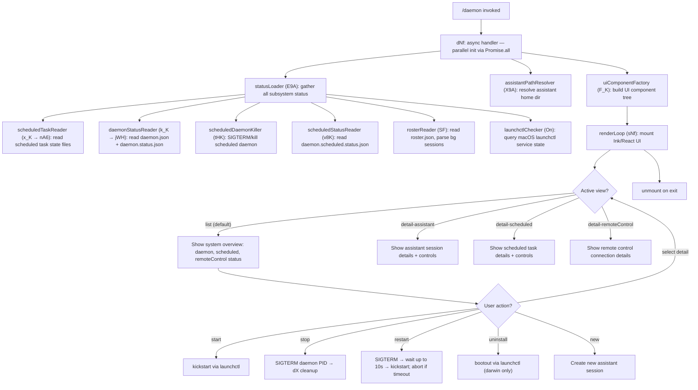

# `/daemon`

> Analysis basis: CC v2.1.160 bundle.js (AST extraction + Claude interpretation)
> Minimum version: v2.1.160

---

## Overview

`/daemon` is a local-jsx command that provides a full interactive management interface for Claude Code's background service infrastructure, covering three distinct subsystems: **assistant background sessions**, **scheduled tasks**, and **remote control** connections. It renders a React-based terminal UI that aggregates live status from multiple on-disk state files and exposes lifecycle controls (start, stop, restart, uninstall, and detail views) for each subsystem.

---

## Registration

| Field | Value |
|---|---|
| type | `local-jsx` |
| name | `daemon` |
| description | `Manage background services: assistants, scheduled tasks, and remote control` |
| loc_byte | `12778362` |
| loc_byte_end | `12778566` |
| loc_line | `9299` |
| immediate | `true` |
| module_id | `Z9A` |
| load_inline | `true` |
| arbor_handler.name | `dNf` |
| arbor_handler.fqn | `claude-2.1.160::dNf` |
| arbor_handler.kind | `AsyncFunction` |
| arbor_handler.resolution_path | `module_id` |
| arbor_handler.n_hits | `0` |

Analysis basis: CC v2.1.160 bundle.js:+12778362

---

## Input Branching

The command supports five or more distinct navigation branches (list view, detail-scheduled, detail-assistant, detail-remoteControl, and sub-actions such as start/stop/restart/uninstall/new), so a flowchart is used.



---

## Behavioral Spec

### 1. Entry point — async handler (dNf)

`dNf` is the Arbor-resolved handler (AsyncFunction, `claude-2.1.160::dNf`, resolution via `module_id → Z9A`).

```
async function daemonHandler(context):
    [statusData, assistantPath, uiComponent] = await Promise.all([
        gatherAllSubsystemStatus(),   // E9A
        resolveAssistantPath(),       // X9A
        buildUIComponentFactory()     // F_K
    ])
    mountRenderLoop(statusData, assistantPath, uiComponent)
```

Analysis basis: CC v2.1.160 bundle.js:+12767112

---

### 2. Status aggregator (E9A)

Collects status from all three subsystems in parallel. Uses `Promise.all` over six sub-loaders. Returns a composite status object keyed by subsystem.

```
async function gatherAllSubsystemStatus():
    [scheduledTasks, daemonStatus, scheduledKillResult,
     scheduledStatusFile, roster, launchctlState] = await Promise.all([
        readScheduledTaskState(),      // x_K → nA6
        readDaemonStatusFiles(),       // k_K → jWH
        killScheduledDaemonIfNeeded(), // tHK
        readScheduledStatusFile(),     // v8K
        readRosterFile(),              // SF
        queryLaunchctl()               // On
    ])
    iterateObjectKeys(combined)        // Object.keys at +12766904
    return combinedStatus
```

Analysis basis: CC v2.1.160 bundle.js:+12766633

---

### 3. Scheduled task state reader (x_K → nA6 → NqA)

Reads per-task state files from disk, parses JSON, validates array structure.

```
async function readScheduledTaskState():
    results = await Promise.all(taskPaths.map(readSingleTaskFile))
    return results.filter(isScheduledType)   // literal "scheduled" at +12656270

async function readSingleTaskFile(path):
    raw = await fs.readFile(path, "utf8")    // encoding literal at +12565509
    trimmed = raw.trim()
    parsed = JSON.parse(trimmed)
    if not Array.isArray(parsed):
        throw Error
    return parsed                            // Ax validation applied
```

Stale lock files are removed via `ykK.unlinkSync`. Analysis basis: CC v2.1.160 bundle.js:+12761335, +12565494

---

### 4. Daemon status file reader (k_K → jWH → Kb)

Reads `daemon.json` and `daemon.status.json` from the Claude data directory. PID validation uses `ENOENT` guard.

```
async function readDaemonStatusFiles():
    daemonJsonPath = path.join(dataDir, "daemon.json")     // literal at +11342023
    statusJsonPath = path.join(dataDir, "daemon.status.json") // literal at +12564713
    pidRecord = parseJsonFile(daemonJsonPath)
    statusRecord = parseJsonFile(statusJsonPath)
    if error.code == "ENOENT":                              // +12749416
        return null
    sessionMap = buildSessionMap(pidRecord, statusRecord)  // jWH
    Object.keys(sessionMap).padEnd padded display          // literal "  " at +15871390
    return sessionMap
```

Same-dir lookup mode is also supported (literal `"same-dir"` at +12755016).
Analysis basis: CC v2.1.160 bundle.js:+12754849

---

### 5. Scheduled daemon status reader (v8K → V8K)

Reads `daemon.scheduled.status.json`.

```
async function readScheduledStatusFile():
    filePath = path.join(dataDir, "daemon.scheduled.status.json") // +12654765
    raw = await fs.readFile(filePath)
    parsed = parseAndValidate(raw)          // V8, R9
    if read fails:
        send SIGTERM to scheduled daemon PID  // process.kill at +12655171
        invoke cleanup (dX)
    return parsed
```

Analysis basis: CC v2.1.160 bundle.js:+12654972

---

### 6. Roster reader (SF → h5H → TCH)

Reads `roster.json`, which tracks all background sessions.

```
async function readRosterFile():
    rosterPath = path.join(dataDir, "roster.json")  // literal at +11348079
    raw = await fs.readFile(rosterPath)
    if parse fails:
        emit telemetry "tengu_bg_roster_parse_failed"  // +11351742
        return empty
    timestamp = Ke_(Date.now)                          // freshness check
    sessions = yH(raw)                                 // session list parser
    if needsRotation(sessions):
        rotate via Lb1 (fs.rename + Date.now)          // +11352283
    validate schema via bMf (Array.isArray, Object.keys)
    if Z5H regex test fails:                           // +11352155
        throw Error
    return sessions
```

Analysis basis: CC v2.1.160 bundle.js:+11351652

---

### 7. macOS launchctl checker (On → h8 → WN8 → oC1)

Queries the macOS `launchctl print` command to determine service state. Runs `launchctl` with a 5000 ms timeout.

```
async function queryLaunchctl():
    uid = process.getuid()                           // oC1 at +11342407
    serviceLabel = buildLaunchctlLabel(uid)          // WN8 at +11345574
    result = spawnProcess("launchctl", ["print", serviceLabel])
                                                     // literals at +11345553, +11345566
    await withTimeout(result, 5000)                  // +11345600
    parseOutput(result)                              // h8 → v_ → S6
    return serviceState
```

Applicable only on `"darwin"` (literal at +11345122).
Analysis basis: CC v2.1.160 bundle.js:+11345550

---

### 8. Assistant path resolver (X9A)

Resolves the home directory path for assistant sessions.

```
async function resolveAssistantPath():
    homeDir = os.homedir()                           // V_K.homedir at +12750999
    assistantDir = path.join(homeDir, ..., "assistant")  // literal at +12751020
    stat = await fs.stat(assistantDir)               // Oh6.stat at +12751043
    if stat fails (V8 error handler):
        return null
    return assistantDir
```

Delegates to `jg6` for path normalization and `Y_`/`zN` for directory resolution.
Analysis basis: CC v2.1.160 bundle.js:+12750960

---

### 9. UI component factory and render loop (F_K → __6 → ILf / sNf)

Constructs the full interactive terminal UI using Ink/React. The `__6` function assembles the component tree from a large set of model-selector and view sub-components (`ILf` and its dependents). `sNf` is the render driver that mounts the component and unmounts on exit.

```
function buildUIComponentFactory():
    components = assembleComponents(__6)   // iterates ILf sub-components
    return components

function renderLoop(statusData, assistantPath, uiFactory):
    inkInstance = M.render(uiFactory)     // Ink render at +12777735
    registerCleanup($)                    // +12777937
    await inkInstance.unmount()           // +12777949 on exit
```

`G9A` is the root React component (uses `W1.useState`, `W1.useRef`, `Date.now`, etc.). It manages view state transitions between `"list"`, `"detail-scheduled"` (+12767943), `"detail-assistant"` (+12768101), and `"detail-remoteControl"` (+12768222).

Analysis basis: CC v2.1.160 bundle.js:+12766995, +12777735

---

### 10. Daemon lifecycle controls (tHK, v8K, tI6, w_6)

**Stop (tHK):**
```
async function stopDaemon(pidFile):
    context = L1()                        // store lookup
    pidPath = path.join(dir, "daemon.status.json")  // +12564713
    pid = R9(readPidFile(pidPath))
    process.kill(pid, SIGTERM)
    await cleanup(dX)
```

**Restart (tt_):**
```
async function restartDaemon():
    WN8: build service label
    h8: query current state
    poll up to 200 times × 50 ms = 10s total    // literals at +11344628, +11344767
    if timeout:
        log "daemon did not exit within 10s of SIGTERM; restart aborted before kickstart"
                                                 // +11344796
    else:
        launchctl kickstart                      // literal at +11344474
```

**Uninstall (w_6):**
```
async function uninstallDaemon():
    st_ = buildLaunchAgentsPath()                // "Library/LaunchAgents" +11342338, +11342348
    h8: check current state
    WN8: label
    launchctl bootout                            // literal at +11344111
    IqH.unlink(plistPath)                        // remove plist file
    if platform != "darwin":
        throw "service uninstall not available on darwin"  // +11344243
```

Analysis basis: CC v2.1.160 bundle.js:+12565196, +11344083, +11344357

---

### 11. Background session supervisor (w → T$A → w$A)

The session supervisor loop (identifier `w`) manages the lifecycle of background worker sessions. It runs inside the daemon process and is surfaced read-only through `/daemon`.

```
function supervisorLoop():
    every 30s/15s tick:                          // literals at +15847489, +15847500
        checkFreeMem()                           // E$A.freemem
        if freemem < threshold:
            emit "tengu_bg_dispatch_low_mem"     // +15848113
        for each session in sessions.values():
            session.retireIfSettled()
        spawnSpareIfNeeded()                     // w$A → Hg.claim

    on SIGKILL escalation:
        emit "tengu_bg_dispatch_sigkill_escalate"  // +15847534
        process.kill(pid, "SIGKILL")

async function spawnBackgroundSession(entry):
    Hg.claim(entry)                              // claim roster slot
    writeSessionDir(H9H.mkdir, H9H.writeFile, perms 448/384)  // +13312553/+13312600
    connect via Unix socket (Zu8.connect)        // +15828327
    sendClaimFrame(VF)                           // binary frame encoding
    on ECONNREFUSED:
        emit "tengu_bg_sendclaim_failed"         // +15828180
    on timeout:
        emit "send-claim timeout" warning        // +15828657
```

Session states observed: `"spare"`, `"exec"`, `"done"`, `"killed"`, `"failed"`, `"active"`, `"crashed"`, `"blocked"`, `"working"`, `"bg"`, `"idle"`, `"windows"`, `"resuming"`.
Idle session timeout: 300 000 ms (5 minutes) at +15854298.

Analysis basis: CC v2.1.160 bundle.js:+15847416, +15852595, +15828024

---

### 12. Skill/plugin file watcher

Background sessions monitor skill files for changes.

```
function watchSkillFiles(dir):
    watcher = chokidar.watch(dir)               // literal "chokidar" at +13974759
    watcher.on("change", (path) =>
        emit "tengu_skill_file_changed"         // +13974724
        reloadSkill(path)
    )
```

Analysis basis: CC v2.1.160 bundle.js:+13974689

---

## State & Side Effects

| Item | Detail |
|---|---|
| Telemetry — `tengu_bg_roster_parse_failed` | Fired when `roster.json` cannot be parsed (bundle.js:+11351742) |
| Telemetry — `tengu_feature_sad` | Generic feature failure signal (bundle.js:+966258) |
| Telemetry — `tengu_feature_ok` | Generic feature success signal (bundle.js:+966123) |
| Telemetry — `tengu_feature_bad` | Feature bad-state signal (bundle.js:+966181) |
| Telemetry — `tengu_config_parse_error` | Config JSON parse failure (bundle.js:+3248346) |
| Telemetry — `tengu_daemon_control` | Fired on daemon control actions stop/start/restart (bundle.js:+15883547) |
| Telemetry — `tengu_bg_dispatch_sigkill_escalate` | SIGKILL sent to a background session (bundle.js:+15847534) |
| Telemetry — `tengu_daemon_config_reload` | Daemon config reloaded at runtime (bundle.js:+15862022) |
| Telemetry — `tengu_daemon_yield` | Daemon yielded to foreground/service daemon (bundle.js:+15866241) |
| Telemetry — `tengu_bg_low_mem_mb` | Low memory threshold crossed on macOS (bundle.js:+12846064) |
| Telemetry — `tengu_bg_dispatch_low_mem` | Low-memory dispatch decision (bundle.js:+15848113) |
| Telemetry — `tengu_bg_spare_enable` | Spare session pool enabled (bundle.js:+15848808) |
| Telemetry — `tengu_bg_sendclaim_failed` | Claim frame send to socket failed (bundle.js:+15828180) |
| Telemetry — `tengu_bg_state_read_transient` | Transient state read during session startup (bundle.js:+4127971) |
| Telemetry — `tengu_bg_spare_claim` | Spare session claimed successfully (bundle.js:+15848929) |
| Telemetry — `tengu_bg_spare_claim_fail` | Spare session claim failed (bundle.js:+15849192) |
| Telemetry — `tengu_skill_file_changed` | A skill/plugin file was changed on disk (bundle.js:+13974724) |
| Hook registration | `O9` → `HDA.register` at +59048; file-watch via `DA8.watchFile`/`DA8.unwatchFile` |
| File I/O — reads | `daemon.json`, `daemon.status.json`, `daemon.scheduled.status.json`, `roster.json`, `gateway-models.json`, `pins.json`, settings files |
| File I/O — writes | `roster.json` (rotation via `fs.rename`); session directory creation via `H9H.mkdir`/`H9H.writeFile` |
| File I/O — deletes | Stale lock files via `ykK.unlinkSync`; plist unlink on uninstall via `IqH.unlink` |
| Process signals sent | `SIGTERM` (stop/restart); `SIGKILL` (escalation); `process.kill` used directly |
| macOS launchctl | `launchctl print`, `launchctl kickstart`, `launchctl bootout` (darwin only) |
| appState changes | View state machine transitions: `list` ↔ `detail-assistant` ↔ `detail-scheduled` ↔ `detail-remoteControl` |
| Ink UI lifecycle | Mounted via `M.render`; unmounted on exit via `M.unmount` |
| Socket connection | Unix domain socket via `Zu8.connect` for background session claim; binary framing via `VF` (`Buffer.allocUnsafe`, `writeUInt32BE`, `writeUInt8`) |
| Sound | <!-- TODO: not found in depth-2 traversal; needs --depth 4 --> |

---

## Version History

| Version | Change |
|---|---|
| v2.1.160 | Initial analysis |

---

## Common Mistakes

1. **Running `/daemon` uninstall on non-macOS**: The `uninstall` action calls `launchctl bootout` and is explicitly guarded for darwin only. On other platforms, the operation throws `"service uninstall not available on darwin"` (bundle.js:+11344243). Use process-level management on Linux.

2. **Expecting instant restart**: The restart path polls up to 200 × 50 ms (10 seconds total) for the old process to exit before calling `kickstart`. If the daemon is hung, the restart is aborted with an explicit log message rather than force-killing, to avoid data corruption.

3. **Stale `daemon.status.json` after crashes**: The status file is only removed by explicit stop/restart flows. A crashed daemon leaves the file on disk; `/daemon` will show the last-known PID. Manual cleanup may be needed before a fresh start.

4. **Confusing the three subsystems**: The UI presents `system` (the main daemon), `scheduled` (scheduled task daemon), and `remoteControl` as separate entities with separate state files. Controls for one do not affect the others.

5. **Low-memory behavior**: On macOS, free memory below an internal threshold triggers `tengu_bg_dispatch_low_mem` and may cause background sessions to be retired or denied. This is automatic and is not user-configurable from `/daemon`.

---

## Appendix — Identifier Mapping

> For bundle debugging only. Identifiers change across versions.

| Identifier | Role |
|---|---|
| `dNf` | Arbor-resolved async main handler for `/daemon` (entry point) |
| `sNf` | Ink render loop driver; mounts and unmounts the terminal UI |
| `G9A` | Root React component for the daemon management UI |
| `E9A` | Status aggregator — fans out to all subsystem readers via Promise.all |
| `x_K` | Scheduled task state parallel reader |
| `nA6` | Single scheduled task file reader/validator |
| `NqA` | Low-level file read + JSON.parse + Array.isArray validator |
| `tqA` | Array validation helper for scheduled task entries |
| `k_K` | Daemon status file reader (daemon.json + daemon.status.json) |
| `jWH` | Session map builder from PID + status records |
| `tHK` | Scheduled daemon SIGTERM sender + status path resolver |
| `v8K` | Scheduled status file reader (daemon.scheduled.status.json) |
| `V8K` | Scheduled status file path builder |
| `SF` | Roster file reader and rotation handler |
| `h5H` | Roster file path builder |
| `TCH` | Roster base path resolver |
| `Ke_` | Roster freshness timestamp checker (Date.now wrapper) |
| `Lb1` | Roster rotation handler (fs.rename + new timestamp) |
| `bMf` | Roster schema validator (Array.isArray + Object.keys) |
| `On` | macOS launchctl state query orchestrator |
| `WN8` | launchctl service label builder (uses process.getuid) |
| `oC1` | UID fetcher (process.getuid wrapper) |
| `h8` | launchctl process spawner |
| `v_` | Process spawn wrapper with timeout and output parsing |
| `S6` | Spawn helper with output buffering |
| `X9A` | Assistant home directory path resolver |
| `jg6` | Path normalization helper |
| `F_K` | UI component factory assembler |
| `__6` | Component tree builder; coordinates ILf and sub-components |
| `ILf` | Model selector / plan component tree root |
| `EA` | Plan tier component (first-party) |
| `IHH` | Max plan component |
| `MzH` | Team plan component |
| `qgH` | Enterprise plan component |
| `gv8` | Default/recommended model selector component |
| `FX` | First-party model option component |
| `ya` | Gateway model option component |
| `_t_` | ZHH + tT composite component |
| `fS1` | Sonnet (1M context) model option |
| `p7H` | Gateway Sonnet option component |
| `LS1` | Sonnet option component |
| `zS1` | Opus (1M context) model option |
| `OS1` | Opus model option component |
| `xM` | Base model option wrapper |
| `_S1` | Kt_ + C0 option component |
| `qS1` | Opus 4.8/Jf option component |
| `eh1` | Kt_ + C0 sub-option component |
| `HS1` | Sonnet 4.6 / Jf option |
| `AS1` | Opus legacy / Jf option |
| `KS1` | Haiku / Kt_ option |
| `$S1` | Haiku 4.5 / yR option |
| `PLf` | Jf-based plan option |
| `TLf` | Opus 4.7 / YKH option |
| `ZHH` | Claude Opus 4.7 legacy component (mantle-plan) |
| `Jf` | Model option renderer (RuH + km4 + i4q + tr6 + jA) |
| `WLf` | xM + Jf sub-option |
| `GLf` | xM + Jf sub-option (alt) |
| `XLf` | xM + Jf sub-option (alt2) |
| `ELf` | xM + Jf + YKH sub-option |
| `VLf` | _gH + Jf + $S1 + ZLf compound option |
| `kLf` | Custom/gateway model resolver and renderer |
| `Yj` | Model key lowercaser and aq caller |
| `aq` | Model string matcher / application-inference-profile checker |
| `dN` | xM + Jf fallback option |
| `_gH` | Jf wrapper helper |
| `R6` | Config backup/snapshot writer |
| `ZDH` | Config file reader with directory creation and copy (readFileSync, mkdirSync, copyFileSync) |
| `ojL` | File watcher setup (DA8.watchFile/unwatchFile, O9 hook) |
| `sh1` | Gateway models file loader |
| `rh1` | Gateway model record parser |
| `ah1` | Gateway model path builder (es_.join + oh1) |
| `GHH` | Command input parser (DN + p9H + ZA + lQ) |
| `lQ` | Token/argument parser for model command lines |
| `H_6` | Filtered command argument processor |
| `tT` | xM + Jf + jA composite renderer |
| `jA` | FH-based string renderer |
| `NLf` | Named component slot placeholder |
| `NK` | Timeout/store hook (Go.useRef + Go.useContext + Go.useMemo + Go.useSyncExternalStore) |
| `z` | hH + RH + Qy + _p composite signal/event manager |
| `hH` | d-wrapper (stop signal) |
| `RH` | d-wrapper (alt stop signal) |
| `Qy` | Event queue manager (mx + Xd.push + vVH + YY_) |
| `mx` | BR-based queue initializer |
| `vVH` | gy-based queue handler |
| `YY_` | Event emitter (randomUUID + rQH + kU + H.emit) |
| `_p` | Process shutdown coordinator (Promise.race + Promise.all + Wd + Zd + d8 + process.exit) |
| `Wd` | O4H.shutdown caller |
| `Zd` | clearTimeout + FY_ cleanup |
| `d8` | Timeout/abort error handler (K + Error + q + setTimeout + O + clearTimeout + L.unref) |
| `w` | Background session supervisor loop |
| `D` | Session write/config manager (jWH + q.write + Z_K + f.get + E.stop + f.delete + Z.stop/updateConfig/start + ekK + f.set + V.start + d) |
| `S` | Session kill handler (D.write + d) |
| `T$A` | Background worker task manager (spawn, retire, roster tracking) |
| `w$A` | Spare session claimer (Hg.claim + rKA + W85 + X85 + Zu8.connect + VF frame) |
| `rKA` | Session directory creator (H9H.mkdir + H9H.writeFile + JSON.stringify, perms 448/384) |
| `W85` | Claim timeout manager (Date.now + Error + T85 + G8 + d8) |
| `X85` | Hg.buildClaimFrame caller |
| `VF` | Binary claim frame encoder (Buffer.from/allocUnsafe + writeUInt32BE + writeUInt8 + _.copy) |
| `_1` | Session stat/state file reader (f2.join + L2.stat + OLH/GYH map management) |
| `UD` | gV-based active session tracker |
| `z5` | t3 + SH session state serializer |
| `X_6` | Scheduled task executor (SF + Date.now + xMf) |
| `S5H` | g3.join + GCH path helper |
| `aE` | g3.join + GCH + H.split path helper |
| `hF` | r6 + He_ + g3.join + J_6 path helper |
| `eI6` | g3.join + qe_ roster entry writer |
| `Y` | Forced-shutdown handler (LJ + process.exit + z.abort) |
| `LJ` | Shutdown label/reason builder |
| `R` | Wn1 + y.enqueue + KJ.randomUUID + y6 rate-limit event handler |
| `y` | N + d + S chokidar event queue |
| `X` | Connection state machine (Yu8 + MS + $k + Promise.all + DqH + Pc + yH + d_) |
| `w_6` | Daemon uninstall handler (st_ + h8 + WN8 + IqH.unlink + V8 + GH) |
| `st_` | LaunchAgents plist path builder (aI6.join + ot_.homedir) |
| `tI6` | Daemon restart handler (tt_) |
| `tt_` | Restart poll loop (WN8 + h8 + rC1.setTimeout, 200×50ms) |
| `gh8` | macOS memory threshold checker (r6 + W6; threshold 1024 MB literal at +12846086) |
| `W6` | Memory-based routing (HY6 + _Y6 + px + WDH.has + HA8 + tD6.add + SU.has/get + R6) |
| `fj6` | Pins file reader (L2.readFile + o2_ + m6 + Array.isArray + _.filter + wSL) |
| `wSL` | Session directory scanner (L2.readdir + WE + Promise.all + L2.readFile + Aq9) |
| `nK` | Session path builder (f2.join + WE) |
| `T` | kN6 + Yu8 helper component |
| `J` | w-loop starter |
| `O` | C8-based state accessor |
| `F` | Session retire-if-settled checker |
| `tA` | ClockProvider context consumer (ttq.useContext + Error guard) |
| `NK` | Debounced store subscriber hook |
| `lmK` | _y + cmK + ADA environment resolver |
| `ADA` | lbK + nbK platform detector |
| `N` | Full environment/model resolution pipeline (Y46 + lmK + H.includes + SH + x4 + AR + PmH + rmK) |
| `SH` | JSON.stringify wrapper |
| `x4` | xwA + H.replace + q.at + A.lastIndexOf + A.slice path formatter |
| `xwA` | BmK.map path mapper |
| `PmH` | ZwA (H.write) output writer |
| `rmK` | Log file writer with rotation (QuH + R$H + je.dirname + _y + d6 + A46 + gwA + FwA + Buffer.byteLength + dwA + imK + O9) |
| `QuH` | Log flush queue (clearTimeout + setTimeout + setImmediate + $.join + L.join + O + $.push + L.push + Y + w + D) |
| `R$H` | Log destination path builder (Iu6 + je.join + n8 + y6) |
| `gwA` | Log file path helper (je.join + y6) |
| `FwA` | Log file rotator (Hy.stat + H.endsWith(".txt") + H.slice + Hy.rename + V8 + Hy.unlink) |
| `imK` | Log append writer (Hy.mkdir + Hy.appendFile + A46 + gwA + FwA + Buffer.byteLength + dwA) |
| `O9` | HDA.register hook caller |
| `M` | Ink renderer instance (qC6 + f.has + M0.rm) |
| `qC6` | Plugin path resolver (H.replace + _.toLowerCase + Error + KC6 + Uk.join/relative/isAbsolute + L.startsWith) |
| `KC6` | Plugin synced path builder (Uk.join + n8) |
| `L1` | Async store getter (vyL.getStore) |
| `G8` | Generic error/ok state wrapper |
| `V8` | Error boundary handler |
| `Kb` | Data directory path builder (rt_.join + n8) |
| `ny6` | Status path builder (oHK.join + n8) |
| `d_` | Error + String coercer |
| `FH` | String coercer |
| `n9` | KNA network quality monitor |
| `T14` | lF6 shift/push rolling buffer |
| `dX` | hy cleanup dispatcher |
| `P9A` | J9A plan-type detector |
| `GH` | String coercer (alt) |
| `Y_` | zN module resolver |
| `yH` | d_ + FH + n9 + T14 + LUH.push + mi.logError session parser |
| `d` | Base state/context record |
| `v5` | G8 ok-state builder |
| `Ce` | F64.has feature-flag checker |
| `wj` | H.replace string sanitizer |
| `gq` | GHH + K1 + yP command tokenizer |
| `t6` | d-based context accessor |
| `A46` | G8 aggregate wrapper |
| `aHK` | $r + Date.now + L1 + ny6 + SH scheduled heartbeat writer |
| `DN` | Command string splitter |
| `p9H` | Argument prefix handler |
| `F_` | Settings load/write orchestrator (mO + d6 + hEH.dirname + us8 + EQ + NX + V8 + R9 + N + Error + pi + Array.isArray + Ra8 + SEH + If6 + SH + Uz + Bg6 + fx + Y_ + hH + t6 + RH + lp + yH + QUH.emit) |
| `mO` | c3H + EQ settings file opener |
| `us8` | ARA + c3H + TQ + eSA + pi settings applicator |
| `EQ` | Full settings loader (Y_ + a16 + LU8 + n16 + u0H + m0H + t16 + F3H + g3H + ys8 + pSA + ci + j56) |
| `NX` | Ui settings validator |
| `Ra8` | lg6.set + Date.now settings cache writer |
| `SEH` | SQ6 + EQ settings error handler |
| `If6` | Atomic file writer (readlinkSync + lstatSync + randomBytes + writeFileSync + fchmodSync + fsyncSync + renameSync + unlinkSync) |
| `Uz` | Cb6.clear + nm8.clear cache invalidator |
| `Bg6` | Git-ignore tracking helper (S6 + ja8 + H.replaceAll + A.endsWith + Ug6 + NL4 + V1H.dirname + k3H.mkdir/readFile/appendFile/writeFile) |
| `fx` | RN.join settings base path resolver |
| `lp` | EG + h9 + ms8 + EQ + bb6 disk settings loader |
| `Wn1` | Rate-limit event enqueuer |
| `y6` | zN log path builder |
| `o2_` | f2.join + WE pins path builder |
| `rKA` | Session dir creator (H9H.mkdir + H9H.writeFile) |
| `ZwA` | H.write output stream writer |
| `A` | f.toLowerCase model key normalizer |
| `$` | aHK heartbeat scheduler |
| `Z` | Session config updater (Z.stop + Z.updateConfig + Z.start) |
| `Qy` | Event dispatch queue |
| `hF` | Roster path helper (r6 + He_ + g3.join + J_6) |