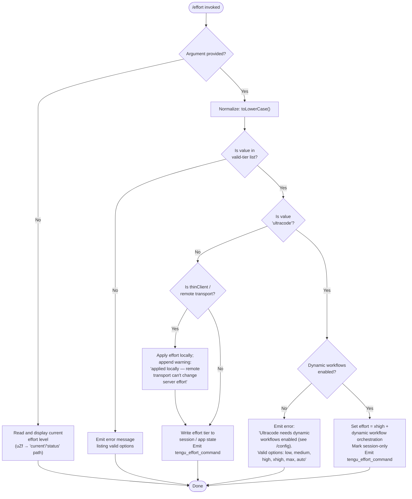

# `/effort`

> Analysis basis: CC v2.1.160 bundle.js (AST extraction + Claude interpretation)
> Minimum version: v2.1.160

---

## Overview

The `/effort` command allows users to set or inspect the inference effort level that Claude Code uses for model interactions within the current session. It accepts a named tier from a fixed vocabulary (`low`, `medium`, `high`, `xhigh`, `max`, `ultracode`, `auto`) and applies it immediately, with the special `ultracode` tier additionally requiring dynamic workflow orchestration to be enabled. When called without an argument it reports the current effort level.

---

## Registration

| Field | Value |
|---|---|
| type | `local-jsx` |
| name | `effort` |
| description | Set effort level for model usage |
| argumentHint | `[low\|medium\|high\|xhigh\|max\|ultracode\|auto] \| [low\|medium\|high\|xhigh\|max\|auto]` |
| immediate | `null` |
| thinClientDispatch | `control-request` |
| module_id | `JHK` |
| load_inline | `true` |
| loc_byte | `12547066` |
| loc_byte_end | `12547397` |
| loc_line | `8786` |
| arbor_handler.name | `uZf` |
| arbor_handler.fqn | `claude-2.1.160::uZf` |
| arbor_handler.kind | `AsyncFunction` |
| arbor_handler.resolution_path | `module_id` |
| arbor_handler.n_hits | `2` |

Analysis basis: CC v2.1.160 bundle.js:+12547066

---

## Input Branching

The command has more than three distinct branches depending on whether an argument is provided, which tier is requested, and whether `ultracode` prerequisites are satisfied, so a Mermaid flowchart is used.



Analysis basis: CC v2.1.160 bundle.js:+12534460, +12536140, +12535301, +12535321, +12534916

---

## Behavioral Spec

### 1. Entry Point — Handler Dispatch (`uZf`)

The Arbor-resolved handler `uZf` (an `AsyncFunction`) is the primary entry point reached via `module_id → JHK`.

```
async function handleEffortCommand(args, appState):
    inputArg = args[0]  // may be undefined

    if inputArg is undefined or empty:
        return renderCurrentEffortStatus(appState)  // "current" / "status" path

    normalizedArg = inputArg.toLowerCase()

    if normalizedArg not in VALID_TIERS:
        return renderError("Valid options are: low, medium, high, xhigh, max, auto")

    if normalizedArg == "ultracode":
        return handleUltracodeRequest(appState)
    else:
        return applyEffortTier(normalizedArg, appState)
```

Analysis basis: CC v2.1.160 bundle.js:+12545264, +12545281, +12545283, +12545304, +12545319, +12545335

---

### 2. Valid Tier Lookup (`avH`)

The function `avH` tests whether a normalized string is a member of the canonical tier set.

```
function isValidEffortTier(value):
    VALID_TIERS = ["low", "medium", "high", "xhigh", "max", "auto"]
    return VALID_TIERS.includes(value)
```

The variant shown in `argumentHint` additionally includes `ultracode` for the first bracket group (non-thinClient path) and omits it for the second (thinClient / remote path).

Analysis basis: CC v2.1.160 bundle.js:+4149558, +4149628, +4149670

---

### 3. Effort Tier Descriptions (`YLH`)

Each tier carries a human-readable description rendered in the UI:

| Tier | Description |
|---|---|
| `low` | Quick, straightforward implementation with minimal overhead |
| `medium` | Balanced approach with standard implementation and testing |
| `high` | Comprehensive implementation with extensive testing and documentation |
| `xhigh` | <!-- TODO: not found in depth-2 traversal; needs --depth 4 --> |
| `max` | Maximum capability with deepest reasoning |
| `auto` | Use the default effort level for your model |
| `ultracode` | xhigh + dynamic workflow orchestration; this session only |

Analysis basis: CC v2.1.160 bundle.js:+4151797, +4151809, +4151875, +4151890, +4151968, +4152132, +4151738, +12534485

---

### 4. Ultracode Request Handling (`jZf`)

When the user requests `ultracode`, the handler first checks whether dynamic workflows are enabled before proceeding.

```
async function handleUltracodeRequest(appState):
    workflowsEnabled = checkWorkflowsEnabled(appState)  // queries allow_workflows flag

    if not workflowsEnabled:
        return renderError(
            "Ultracode needs dynamic workflows enabled (see /config). " +
            "Valid options are: low, medium, high, xhigh, max, auto"
        )

    // Apply xhigh effort + workflow orchestration flag, session scope only
    setEffortTier("xhigh", appState, sessionOnly = true)
    enableDynamicWorkflows(appState, sessionOnly = true)
    emitTelemetry("tengu_effort_command")
    return renderSuccess(
        "Current effort level: ultracode " +
        "(xhigh + dynamic workflow orchestration; this session only)"
    )
```

Analysis basis: CC v2.1.160 bundle.js:+12535301, +12535321, +12534312, +12534485, +4147754

---

### 5. Standard Tier Application (`YZf` / `wZf`)

For all non-ultracode tiers the handler writes the new tier to session state and optionally renders a remote-transport warning.

```
async function applyStandardEffortTier(tier, appState):
    isRemote = isRemoteTransport(appState)   // checks thinClientDispatch / ccr flag

    applyFlagSettings(appState, "effort", tier)  // writes to session settings
    emitTelemetry("tengu_effort_command")

    message = buildSuccessMessage(tier)

    if isRemote:
        message += " (applied locally — this remote transport can't change server effort)"

    return renderResult(message)
```

The `apply_flag_settings` event string is used internally when persisting the new value.

Analysis basis: CC v2.1.160 bundle.js:+12534598, +12534606, +12534739, +12534962, +12534974, +12533351, +12533474, +4144800

---

### 6. Current Status Query (`iy8`)

When no argument is supplied, the handler reads the current effort state and renders it.

```
function renderCurrentEffortStatus(appState):
    currentTier  = getCurrentEffortTier(appState)   // calls qu → UP
    modelContext = getModelContext(appState)          // calls gq

    return createElement("effort-status", {
        mode: "current",
        tier: currentTier,
        ...modelContext
    })
```

Analysis basis: CC v2.1.160 bundle.js:+12532610, +12532613, +12545283, +12545304, +12545319

---

### 7. Effort-Aware Model Compatibility Check (`EW` / `Jj6` / `dlH`)

Several sub-routines inspect the active model string to decide which effort options are legal. The model list against which inclusion is tested:

- `claude-3-*` (prefix check)
- `claude-opus-4-0`, `claude-opus-4-1`, `claude-opus-4-5`, `claude-opus-4-6`, `claude-opus-4-7`, `claude-opus-4-8`
- `claude-sonnet-4-0`, `claude-sonnet-4-5`, `claude-sonnet-4-6`
- `claude-haiku-4-5`

`max_effort` capability is mapped to the `max` tier; `xhigh_effort` is mapped to the `xhigh` tier.

Special model-suffix aliases `opus-4-7` and `opus-4-8` are also recognized in tier-gating logic.

```
function isModelEffortCapable(modelId, tier):
    normalizedModel = modelId.toLowerCase()

    if tier == "max":
        return MAX_CAPABLE_MODELS.includes(normalizedModel)
    if tier == "xhigh":
        return XHIGH_CAPABLE_MODELS.includes(normalizedModel)
    return true  // low / medium / high / auto are universally accepted
```

Analysis basis: CC v2.1.160 bundle.js:+4148283, +4148327, +4148336, +4148347, +4148365, +4148388, +4148411, +4148436, +4148461, +4148557, +4148580, +4148603, +4148626, +4148699, +4149076, +4150495, +4150557

---

### 8. Provider / API-Key Awareness (`aq`)

The effort system queries the API provider type before adjusting behavior. Recognized provider values: `firstParty`, `anthropicAws`, `foundry`, `mantle`. The `application-inference-profile` model-ID prefix is specially handled within provider resolution.

Analysis basis: CC v2.1.160 bundle.js:+2231721, +2231744, +2231753, +2231764, +2231804, +2231808, +2048591, +2048609, +2048629, +2048644

---

### 9. Ultracode UI Animation (`zHK` / `fHK` / `rF`)

The `ultracode` tier activates a distinct UI rendering path that includes animated particle/ripple effects:

- Animation label: `violet-ripple` (CC v2.1.160 bundle.js:+12538035)
- Frame constants used: `3`, `17` segments (CC v2.1.160 bundle.js:+12537975, +12537979); `8.5` amplitude factor (CC v2.1.160 bundle.js:+12538154); floor divisor `4` (CC v2.1.160 bundle.js:+12538068)
- Math primitives involved: `Math.floor`, `Math.cos`, `Math.sqrt`, `Math.min`, `Math.round`
- Particle counts rendered at frame indices `5`, `7`, `9` (CC v2.1.160 bundle.js:+12540107, +12540127, +12540386)

```
function renderUltracodeAnimation(frameIndex):
    particles = computeParticlePositions(frameIndex, amplitude=8.5, segments=17)
    rippleColor = "violet-ripple"
    return createElement("ultracode-animation", {
        particles: particles.map(p => clampParticle(p)),
        color: rippleColor
    })
```

Analysis basis: CC v2.1.160 bundle.js:+12537958, +12538057, +12538172, +12539575, +12539676, +12539712, +12539734, +12539785, +12539940, +12539944, +12540146, +12540170

---

### 10. Settings Persistence (`wW_`)

Effort level changes that are not session-only are persisted via the layered settings system:

- Writes to `userSettings`, `projectSettings`, or `localSettings` depending on scope
- Settings file path: `.claude/settings.json` / `.claude/settings.local.json`
- Auth-loss guard is active: if a re-read of the config is missing auth that the cache holds, the write is refused (see literal `saveGlobalConfig fallback` at CC v2.1.160 bundle.js:+3242911)

Analysis basis: CC v2.1.160 bundle.js:+4152223, +4152245, +4152252, +1229986, +1230101, +1230124, +1220496, +1220506, +1220568

---

## State & Side Effects

| Item | Detail |
|---|---|
| Telemetry | `tengu_effort_command` (emitted on every successful tier change, CC v2.1.160 bundle.js:+12534916); `tengu_workflows_enabled` (emitted when workflow flag state is queried/changed, +4147955); `tengu_slate_finch` (emitted during settings persistence path, +4152255); `tengu_feature_ok` (+966123); `tengu_feature_bad` (+966181); `tengu_feature_sad` (+966258); `tengu_config_auth_loss_prevented` (+3243039) |
| Session-only flag | `ultracode` tier is marked session-only; changes are not persisted to disk |
| appState changes | Active effort tier updated; `allow_workflows` flag may be set for `ultracode`; `allow_product_feedback` flag is read (not written) |
| Settings files | May write `.claude/settings.json` or `.claude/settings.local.json` for persistent tier changes |
| Remote-transport warning | When `thinClientDispatch: "control-request"` and the transport is identified as `ccr` remote, a warning suffix is appended to the success message |
| UI rendering | `ultracode` tier triggers `violet-ripple` animated particle component via `OA.createElement` |
| Auth guard | `tengu_config_auth_loss_prevented` fires if a settings write would silently drop auth credentials |

---

## Version History

| Version | Change |
|---|---|
| v2.1.160 | Initial analysis; `ultracode` tier with `violet-ripple` animation; 7-tier vocabulary; remote-transport warning; auth-loss guard on settings write |

---

## Common Mistakes

1. **Attempting `ultracode` without enabling dynamic workflows** — The command will reject the request with an explicit message directing the user to `/config`. The `ultracode` option is not available in the second bracket group of `argumentHint`, confirming it is gated.
2. **Expecting `ultracode` to persist across sessions** — The tier is explicitly marked session-only and is not written to settings files; restarting Claude Code resets it.
3. **Using `ultracode` on a remote/thin-client transport** — The `ultracode` tier requires dynamic workflow orchestration which is a server-side capability; the remote-transport path cannot honor it, and the effort hint is only applied locally.
4. **Providing an unrecognized tier name** — Only the exact strings `low`, `medium`, `high`, `xhigh`, `max`, `ultracode`, `auto` are accepted (case-insensitive after normalization). Any other value triggers an error listing the valid options.
5. **Assuming all models support all tiers** — `max` and `xhigh` tiers are gated to a specific set of `claude-opus-4-*` and `claude-sonnet-4-*` model IDs; older or unsupported models will not receive these effort levels as expected.

---

## Appendix — Identifier Mapping

> For bundle debugging only. Identifiers change across versions.

| Identifier | Role |
|---|---|
| `uZf` | Primary async handler for `/effort` command (Arbor-resolved, `claude-2.1.160::uZf`) |
| `ry8` | Top-level registration/render wrapper for effort command |
| `Ro` | Effort command orchestrator — coordinates sub-feature calls |
| `UP` | Effort validation and application coordinator |
| `gK8` | Model-string normalization helper |
| `FH` | String coercion / formatting utility |
| `EG` | Error/feedback emitter |
| `Xq9` | Effort-value validator |
| `G9` | Flag/feature-gate checker (reads `allow_product_feedback`) |
| `zW_` | Workflow-enabled check and dispatch |
| `ISL` | Workflow state inspector (reads `allow_workflows`) |
| `NSL` | Non-workflow effort application path |
| `So` | Effort tier renderer / JSX tree builder |
| `EW` | Model-compatibility check for effort tiers |
| `aq` | API provider resolver |
| `vy` | Tier-to-UI-label mapper |
| `WY` | Tier display-name and description builder |
| `tvH` | Effort tier gate (opus-4-7 / opus-4-8 alias handling) |
| `R6` | Telemetry event emitter |
| `lK8` | Effort rendering for list/table view |
| `svH` | Session-level effort state accessor |
| `Ku` | Numeric effort value parser (`parseInt` / `isNaN` path) |
| `Jj6` | `max_effort` capability renderer |
| `dlH` | `xhigh_effort` capability renderer |
| `b$` | Settings reader (reads current effort from state) |
| `d0H` | Settings store accessor |
| `QV` | Effort-status display component |
| `YLH` | Tier descriptions table builder |
| `avH` | Valid-tier membership test (`MI.includes`) |
| `K8H` | Tier-to-string serializer |
| `wW_` | Effort settings persistence writer |
| `kSL` | Settings-write pre-check |
| `jKH` | Settings-write dispatcher |
| `z1` | Settings file writer |
| `bD` | API key / auth config reader |
| `W6` | Settings persistence layer (file I/O coordinator) |
| `px` | Settings file path resolver |
| `mx` | Settings JSON serializer |
| `HA8` | Deduplication guard for settings writes |
| `wY_` | Growthbook experiment event emitter |
| `WY_` | Settings cache updater |
| `jHK` | Ultracode animation cosine/min/round math helper |
| `wHK` | Ultracode animation sqrt math helper |
| `zHK` | Ultracode animation frame controller |
| `fHK` | Ultracode particle map builder |
| `qu` | Current effort reader (calls `UP` and `dlH`) |
| `iy8` | No-argument (status display) path entry |
| `oy8` | Top-level argument-dispatch function |
| `wZf` | Remote-transport effort application path |
| `YqA` | Remote-transport setting writer |
| `zh` | Remote-transport state reader |
| `Xj6` | Effort-change confirmation renderer |
| `yYH` | Confirmation message formatter |
| `F_` | Full settings-load-and-apply pipeline |
| `mO` | Settings parse/validate step |
| `us8` | Settings file reader |
| `EQ` | Settings object constructor |
| `NX` | Settings schema validator |
| `V8` | ENOENT / file-not-found handler |
| `Ra8` | Settings load timestamp recorder |
| `SEH` | Settings save helper |
| `If6` | Atomic file write (temp + rename) utility |
| `Uz` | Cache clear utility |
| `Bg6` | gitignore / project-settings loader |
| `fx` | `.claude` directory path builder |
| `Y_` | Async settings writer |
| `hH` | Feature-ok telemetry emitter |
| `RH` | Feature-bad telemetry emitter |
| `lp` | Settings load orchestrator |
| `yH` | Settings error logger |
| `AC` | Effort-confirmation JSX component |
| `W8` | Global config save function (auth-loss guard active) |
| `jZf` | Ultracode-specific request handler |
| `clH` | Argument trimmer and tier validator |
| `YZf` | Standard (non-ultracode) tier application handler |
| `rF` | Ultracode animation component renderer |
| `O` | Animation frame array |
| `C8` | Background-session state checker |
| `GHH` | Model-name parser |
| `K1` | Model-alias normalizer |
| `yP` | Model-alias lookup |
| `N` | HTTP bootstrap / API fetcher |
| `SH` | JSON stringify wrapper |
| `gq` | Model-context resolver |
| `t6` | Feature telemetry dispatcher |
| `d` | Core telemetry emitter |