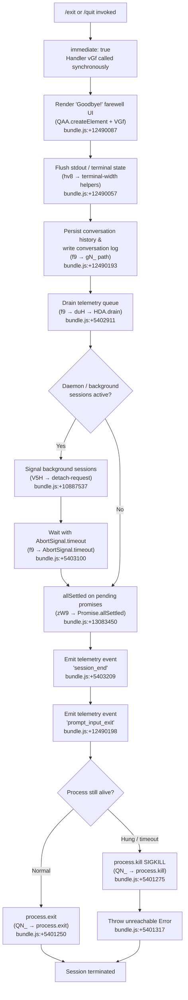

# `/exit`

> Analysis basis: CC v2.1.160 bundle.js (AST extraction + Claude interpretation)
> Minimum version: v2.1.160

---

## Overview

`/exit` (aliased as `/quit`) terminates the current Claude Code CLI session. When invoked, the command initiates an orderly shutdown sequence: it displays a "Goodbye!" farewell message, drains pending telemetry, flushes any in-progress output, and ultimately calls `process.exit`. The shutdown pipeline coordinates daemon/background-session teardown, conversation-history persistence, and terminal-state restoration before the process terminates.

---

## Registration

| Field | Value |
|---|---|
| type | `local-jsx` |
| name | `exit` |
| description | `null` |
| aliases | `["quit"]` |
| loc_byte | `12490761` |
| loc_byte_end | `12490957` |
| loc_line | `8773` |
| immediate | `true` |
| module_id | `st1` |
| load_inline | `true` |
| arbor_handler.name | `vGf` |
| arbor_handler.fqn | `claude-2.1.160::vGf` |
| arbor_handler.kind | `AsyncFunction` |
| arbor_handler.resolution_path | `module_id` |
| arbor_handler.n_hits | `1` |

Analysis basis: CC v2.1.160 bundle.js:+12490761

---

## Input Branching

The exit handler involves more than three distinct execution branches (immediate flag handling, UI teardown, daemon teardown, history persistence, graceful vs. forced process termination), so a Mermaid flowchart is used.



---

## Behavioral Spec

### 1. Entry Point — Handler `vGf` (AsyncFunction)

The command's handler is the async function resolved by Arbor as `vGf` (module `st1`, `module_id` resolution path).

```
async function exitCommandHandler(context):
    # 1. Initiate background / daemon pre-teardown
    initiateBootstrapFetch(context)          # N9 → OzH
    triggerConversationSaveAndAppState(context)  # H (large coordinator)

    # 2. Render farewell JSX element
    farewellComponent = createElement(GoodbyeComponent)   # QAA.createElement @ +12490087
    mountFarewellView(farewellComponent)                   # VGf → v2 @ +12490180

    # 3. Schedule graceful shutdown pipeline
    scheduleShutdownPipeline()               # f9 @ +12490193
```

Analysis basis: CC v2.1.160 bundle.js:+12490010–12490193

---

### 2. Farewell Display

The literal string `"Goodbye!"` (bundle.js:+12489974) is rendered through the JSX component path (`VGf → v2`). Terminal-width calculation helpers (`hv8 → w4f → sV`) ensure the farewell message fits the current terminal column width.

```
function renderFarewellUI():
    message = "Goodbye!"          # literal @ +12489974
    component = createJSXNode(GoodbyeBanner, { text: message })
    mountToTerminal(component)
    flushTerminalOutput()
```

Analysis basis: CC v2.1.160 bundle.js:+12489974, +12490087, +12490180

---

### 3. Shutdown Pipeline — `f9`

`f9` is the central shutdown coordinator. It orchestrates UI unmounting, history persistence, telemetry draining, and process termination.

```
async function shutdownPipeline():
    # Step 1: Unmount Ink/React UI
    unmountUI()                              # nIH → H.unmount @ +5400663
    restoreTerminalState()                   # nIH → U98 (writes ESC-8 restore sequence)

    # Step 2: Write goodbye output to stdout
    writeSync(stdout, farewellOutput)        # nIH → hjH.writeSync @ +5400585

    # Step 3: Persist conversation and session data
    persistConversationHistory()             # gN_ (writes to disk via z26 → q.statSync)

    # Step 4: Emit startup perf report if profiling was enabled (no-op if not)
    flushStartupPerfReport()                 # E46 → dF8 → MjA

    # Step 5: Drain telemetry
    drainTelemetryQueue()                    # duH → HDA.drain @ +59091

    # Step 6: Wait up to 2000 ms for remaining work
    await Promise.race([
        allSettledPendingWork(),             # SM8 → zW9 @ +5402935
        timeout(2000)                        # literal @ +5403000
    ])

    # Step 7: Emit session_end telemetry event
    emit("session_end")                      # literal @ +5403209

    # Step 8: Terminate process
    terminateProcess()                       # QN_
```

Analysis basis: CC v2.1.160 bundle.js:+5402718–5403278

---

### 4. Terminal State Restoration — `U98`

Before the process exits, the terminal is restored to a clean state. This involves:

- Writing ESC-7 (save cursor) and ESC-8 (restore cursor) ANSI sequences (literals `\x1b7` @ +3753544, `\x1b8` @ +3753555).
- Terminal-emulator-specific handling for **ghostty** (≥ 1.2.0, +3483889 / +3483919) and **iTerm.app** (≥ 3.6.6, +3483958 / +3483990).
- tmux / screen multiplexer escaping: double-ESC prefix (`\x1b\x1b`, +3406342) when `$TERM` contains `"tmux"` (+3406296) or `"screen"` (+3406369).

```
function restoreTerminal():
    write(stdout, ESC8_RESTORE_SEQUENCE)
    if terminalIs("ghostty") and version >= "1.2.0":
        applyGhosttyRestoration()
    elif terminalIs("iTerm.app") and version >= "3.6.6":
        applyITermRestoration()
    if multiplexer in ["tmux", "screen"]:
        escapeSequencesForMultiplexer()
```

Analysis basis: CC v2.1.160 bundle.js:+3753390–3753614, +3483595–3483990, +3406283–3406369

---

### 5. Conversation History Persistence — `gN_`

```
function persistConversationHistory():
    resolvedPaths = buildConversationPaths()        # z26 → cY.join @ +12997064
    checkPathExists(paths, q.statSync)              # z26 → q.statSync @ +12997106
    if exists:
        registerShutdownHook(n4 → O9 → HDA.register)  # +12998122
    escapeSpecialChars(output)                     # gN_ → _.replaceAll @ +5400943
    escapeBackslashes()                            # literal "\\\\" @ +5400961
    escapeDoubleQuotes()                           # literal "\\\"" @ +5400984
    applyDimStyling()                              # gN_ → j6.dim @ +5401058
    writeSync(stdout, formattedHistory)            # gN_ → hjH.writeSync @ +5401042
```

Analysis basis: CC v2.1.160 bundle.js:+5400873–5401058

---

### 6. Process Termination — `QN_`

```
function terminateProcess():
    clearTimeout(shutdownTimer)                    # QN_ → clearTimeout @ +5401169
    instance = getActiveInstance()                 # QN_ → ML.get @ +5401202
    try:
        process.exit(0)                            # QN_ → process.exit @ +5401250
    catch:
        # Last-resort: SIGKILL the process group
        process.kill(process.pid, "SIGKILL")       # QN_ → process.kill @ +5401275
        throw new Error("unreachable")             # literal @ +5401317 / +5401323
```

Analysis basis: CC v2.1.160 bundle.js:+5401169–5401323

---

### 7. Daemon / Background Session Teardown — `V5H`

When background daemon sessions are running, `V5H` sends a `"detach-request"` signal before the process exits.

```
function daemonPreShutdown(sessionContext):
    sendDetachRequest(sessionContext)        # V5H → ls → "detach-request" literal @ +10887537
    waitForAck(Hh1 → A2H, C8)
    emitToStream(ls → cs.write)             # +10713208
    checkTaskType("task")                   # literal @ +10882096
```

Analysis basis: CC v2.1.160 bundle.js:+10887503–10887583

---

### 8. Application-State Coordinator — `H`

`H` is a large coordinator function called early in `vGf` that handles conversation-save, model-metadata fetch, and config persistence before the UI tears down.

Key sub-steps (depth-2 summary):

| Sub-step | Function | Location |
|---|---|---|
| Bootstrap fetch | `N` | +204247 |
| Command resolution / model alias | `gq → K1` | +2229757 |
| Redact sensitive tokens | `N → x4` literal `[REDACTED]` | +196350 |
| Persist settings | `H → t6 → d` | +15452109 |
| Remote control at startup flag | `H → Ce` | +15451962 |

Analysis basis: CC v2.1.160 bundle.js:+15451798–15452109

---

## State & Side Effects

| Item | Detail |
|---|---|
| Telemetry — `session_end` | Fired at end of shutdown pipeline (literal @ +5403209) |
| Telemetry — `prompt_input_exit` | Fired immediately on command invocation (literal @ +12490198) |
| Telemetry — `tengu_scroll_summary` | May fire during UI teardown (@ +5402118) |
| Telemetry — `tengu_cache_eviction_hint` | May fire during shutdown state flush (@ +5403174) |
| Telemetry — `tengu_startup_perf` | Fired if startup profiling was active (@ +215246) |
| Telemetry — `tengu_amber_creek` / `tengu_pewter_brook` | Fullscreen/flicker-detection events during terminal restore (@ +3414834 / +3414742) |
| Telemetry — `tengu_daemon_config_reload` | May fire if daemon config changed during the session (@ +15862022) |
| Telemetry — `tengu_feature_sad` | Degraded-feature tracking, may fire on error paths (@ +966258) |
| Telemetry drain | `duH → HDA.drain` ensures events are flushed before exit (@ +59091) |
| Hook registration | `O9 → HDA.register` — shutdown hooks registered for history persistence (@ +59048) |
| History write | `gN_` writes conversation log to disk (via `imK → Hy.appendFile`, @ +203549) |
| Terminal state | ESC-8 cursor restore written to stdout; tmux/screen double-ESC applied |
| Process exit | `process.exit(0)` primary path; `process.kill(pid, "SIGKILL")` fallback |
| Timeout guard | `AbortSignal.timeout` + `Promise.race` with 2000 ms cap (@ +5403100 / +5403000) |
| Sound | `<!-- TODO: not found in depth-2 traversal; needs --depth 4 -->` |
| appState changes | Session marked ended; supervisor (`Z.stop`, `Z.updateConfig`) called during app-state coordinator (@ +15861617 / +15861626) |

---

## Version History

| Version | Change |
|---|---|
| v2.1.160 | Initial analysis |

---

## Common Mistakes

1. **Using `/exit` mid-task expecting instant termination** — because `immediate: true` causes the command to fire synchronously, but the shutdown *pipeline* (`f9`) is asynchronous with up to a 2000 ms timeout, the terminal may appear briefly active while telemetry and history are flushed.
2. **Expecting `/quit` to behave differently from `/exit`** — `/quit` is a registered alias; both names invoke identical handler `vGf` with no behavioral difference.
3. **Killing the process externally before the drain completes** — bypassing the orderly shutdown via `SIGKILL` from outside skips `HDA.drain`, which may cause loss of the final telemetry batch and incomplete conversation-history writes.
4. **Assuming background daemon sessions are immediately stopped** — `/exit` sends a `"detach-request"` to background sessions and waits for `allSettled`; daemon workers may continue briefly if they do not acknowledge the detach in time.
5. **Running `/exit` inside a tmux or screen multiplexer without setting `CLAUDE_CODE_NO_FLICKER=1`** — the terminal-restore logic applies special escaping for multiplexers, and if detection misfires the cursor state may be left inconsistent (see fullscreen-disabled warning literals @ +3414317 / +3414503).

---

## Appendix — Identifier Mapping

> For bundle debugging only. Identifiers change across versions.

| Identifier | Role |
|---|---|
| `vGf` | Exit command main handler (AsyncFunction, Arbor-resolved) |
| `N9` | Bootstrap fetch initiator |
| `OzH` | Bootstrap fetch implementation |
| `H` | Application-state coordinator (save, model, config) |
| `N` | Conversation-level fetch / command dispatcher |
| `lmK` | Log / level helper |
| `ADA` | Log formatter |
| `SH` | JSON serialisation helper |
| `x4` | Token/credential redaction helper |
| `xwA` | Redaction pattern mapper |
| `q` | Filesystem unlink / temp-file utility |
| `A` | Lowercase / path utility |
| `PmH` | Output write helper |
| `ZwA` | Stdout write wrapper |
| `rmK` | Conversation-history persistence coordinator |
| `QuH` | Timeout/flush sequencer |
| `R$H` | Path join / filename utility |
| `d6` | Directory creation helper |
| `A46` | EISDIR-safe file utility |
| `gwA` | Path join + stat helper |
| `FwA` | File rename / unlink helper |
| `imK` | Append-file writer (mkdir + appendFile) |
| `O9` | Shutdown hook registrar |
| `o$` | App-state getter |
| `Ce` | Feature-flag checker |
| `wj` | String replace utility |
| `gq` | Model/command resolver |
| `GHH` | Command parsing dispatcher |
| `DN` | Command token parser |
| `p9H` | Command prefix handler |
| `lQ` | Command-line tokeniser |
| `K1` | Model alias resolver |
| `C0` | Model name normaliser |
| `DKH` | Domain inclusion checker |
| `dN` | Model capability probe |
| `_gH` | Model fallback resolver |
| `tT` | Model token-limit lookup |
| `XDq` | Token-limit dispatcher |
| `xM` | Provider type mapper |
| `xa6` | Supported-model set checker |
| `AgH` | Format string helper |
| `yP` | Command context builder |
| `R0` | Request-options assembler |
| `t6` | Settings persistence writer |
| `d` | Low-level file/config writer |
| `V5H` | Daemon pre-shutdown / detach-request sender |
| `na6` | Daemon session lookup |
| `Hh1` | Daemon ack handler |
| `A2H` | Daemon task descriptor |
| `C8` | Background-session type checker |
| `ls` | Stream writer to daemon socket |
| `TqH` | Detach completion handler |
| `fM` | Pre-exit misc cleanup |
| `hv8` | Terminal-width / column calculator entry |
| `uT` | AsyncLocalStorage context getter |
| `zN` | AsyncLocalStorage store |
| `w4f` | Scheduled-task / cron parser |
| `sV` | Cron expression parser |
| `K` | Column pad / process-table helper |
| `w` | Background-session process manager |
| `L` | Promise tracker (add/delete) |
| `j` | Process kill utility |
| `Y` | Forced-shutdown / `process.exit` wrapper |
| `$` | Event emitter / signal router |
| `J` | Date/time utility |
| `GI` | Cron field parser |
| `nBL` | Cron range/step parser |
| `MiH` | Cron next-run calculator |
| `O` | Background-session state object |
| `f` | Server close / connection manager |
| `_9` | Duration formatter |
| `u9` | String substring/index helper |
| `q8` | String visual-width calculator |
| `Yq` | Unicode grapheme segmenter |
| `ND` | Grapheme fallback handler |
| `VGf` | Farewell JSX component renderer |
| `f9` | Shutdown pipeline coordinator |
| `nIH` | UI unmount + stdout flush |
| `lR` | Post-unmount cleanup |
| `U98` | Terminal state restorer (ESC sequences) |
| `$vH` | Terminal emulator detector |
| `AvH` | Post-restore output writer |
| `JW` | Multiplexer escape handler (tmux/screen) |
| `gN_` | Conversation history formatter + writer |
| `VG` | Conversation view getter |
| `ub` | History entry formatter |
| `y6` | Async logger / zN wrapper |
| `z26` | Conversation path resolver + stat checker |
| `iS` | Path component builder |
| `Y_` | Path suffix builder |
| `p$` | Shutdown hook chain |
| `n4` | Hook registration wrapper |
| `LW9` | History summary line builder |
| `QN_` | Process exit / SIGKILL executor |
| `duH` | Telemetry drain caller |
| `D` | Supervisor / renderer lifecycle manager |
| `jWH` | Renderer state writer |
| `L1` | AsyncLocalStorage store reader |
| `G8` | Config getter |
| `P9A` | Renderer config builder |
| `GH` | String coercion helper |
| `Z_K` | Column-width layout calculator |
| `E` | Input handler / keypress stopper |
| `b` | Event object (preventDefault) |
| `x0` | User settings accessor |
| `Z` | Renderer lifecycle (stop/start/updateConfig) |
| `ekK` | Heartbeat emitter |
| `W6H` | Heartbeat interval handler |
| `V` | Secondary renderer start |
| `zW9` | `Promise.allSettled` wrapper for pending work |
| `E46` | Startup perf report emitter |
| `dF8` | Perf data collector |
| `MjA` | Perf mark recorder |
| `AjA` | Perf report formatter |
| `LjA` | Perf path builder |
| `y$H` | Sync file writer (openSync/writeFileSync/fsyncSync/closeSync) |
| `twA` | Perf checkpoint serialiser |
| `Bb` | `require("perf_hooks")` wrapper |
| `fjA` | Perf output path builder |
| `hM8` | Scroll/session summary builder |
| `KW9` | Scroll stats formatter |
| `qW9` | Session timing calculator |
| `_W9` | Session timing sub-calculator |
| `Lq` | Local-agent environment checker |
| `Hj_` | Flicker-detection sub-checker |
| `FH` | String coercion / truthy helper |
| `sr` | SXL platform helper |
| `ew_` | Windows SSH detection |
| `l_` | Fullscreen mode resolver |
| `RXL` | Fullscreen override handler |
| `W6` | Fullscreen/HY6 renderer controller |
| `R16` | Renderer registration helper |
| `SM8` | Parallel promise runner |
| `d8` | Timeout-with-abort helper |

---

Note: index built via Arbor fallback; some signals (telemetry, literals) may be missing — see arbor-fallback.js.