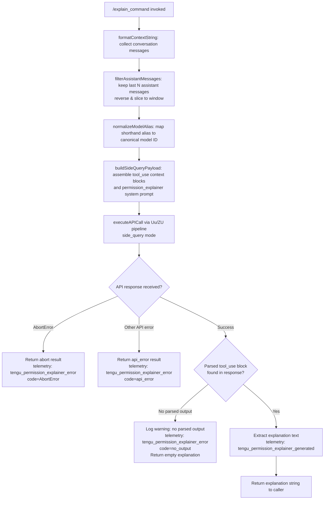

# `/explain_command`

> Analysis basis: CC v2.1.160 bundle.js (AST extraction + Claude interpretation)
> Minimum version: v2.1.160

---

## Overview

`/explain_command` is an internal tool-type slash command that invokes a dedicated **permission explainer** sub-agent to describe what a given tool call or slash command does and why it requires the permissions it requests. The handler (`mYK`) collects recent conversation history, builds a structured context payload including tool-use blocks, sends it via a side-query API call, and returns a human-readable explanation string or an error result.

---

## Registration

| Field | Value |
|---|---|
| type | `tool` |
| name | `explain_command` |
| description | `null` (not set in registration object) |
| loc_byte | `14033388` |
| loc_byte_end | `14033424` |
| loc_line | `11116` |
| arbor_handler.name | `mYK` |
| arbor_handler.fqn | `claude-2.1.160::mYK` |
| arbor_handler.kind | `AsyncFunction` |
| arbor_handler.resolution_path | `direct` |
| arbor_handler.n_hits | `1` |

Analysis basis: CC v2.1.160 bundle.js:+14033388

---

## Input Branching

The handler has four or more distinct execution paths (successful explanation, no parsed output, AbortError, generic API error), so a flowchart is used.



---

## Behavioral Spec

### Handler Entry — `permissionExplainerHandler` (`mYK`)

Analysis basis: CC v2.1.160 bundle.js:+14033083

```
async function permissionExplainerHandler(input):
    startTime = Date.now()                          // +14033107

    contextString = formatContextString(input)      // Cdf, +14033128
    filteredMessages = filterAssistantMessages(input) // bdf, +14033146

    normalizedAlias = normalizeModelAlias(input)    // gq, +14033293

    apiResult = await executePermissionExplainerQuery(  // Uu, +14033306
        contextString,
        filteredMessages,
        normalizedAlias
    )

    if apiResult has tool_use block:                // +14033601
        explanationText = extractExplanation(apiResult)
        emit telemetry("tengu_permission_explainer_generated") // +14033871
        return success(explanationText)

    if no parsed output in response:               // +14034218
        emit telemetry("tengu_permission_explainer_error")
        return empty/fallback explanation

    if error.name == "AbortError":                 // +14034541
        emit telemetry("tengu_permission_explainer_error", code="AbortError")
        return abort result

    emit telemetry("tengu_permission_explainer_error", code="api_error") // +14034612
    return error result
```

### Context Formatting — `formatContextString` (`Cdf`)

Analysis basis: CC v2.1.160 bundle.js:+14032593

```
function formatContextString(input):
    // Serializes relevant input fields using JSON.stringify (via SH)
    // Converts numeric or object values to String as needed
    // Truncation factor: 2 (literal at +14032603)
    // Time window constant: 1000 ms (literal at +14032647)
    return formattedString
```

### Message Filtering — `filterAssistantMessages` (`bdf`)

Analysis basis: CC v2.1.160 bundle.js:+14032659

```
function filterAssistantMessages(messages):
    // 1. Filter to "assistant" role messages only  (+14032682)
    // 2. Keep up to last 3 messages (literal 3 at +14032702)
    // 3. Reverse the array                         (+14032727)
    // 4. Slice to window size                      (+14032870)
    // 5. Prepend separator "..." (literal at +14032883) via unshift (+14032891)
    // 6. Join into single string                   (+14032924)
    //    - text content blocks extracted           (+14032785)
    return joinedMessageString
```

### Model Alias Normalization — `normalizeModelAlias` (`gq` / `K1`)

Analysis basis: CC v2.1.160 bundle.js:+2229757

```
function normalizeModelAlias(aliasString):
    // Trims whitespace, lowercases
    // Maps shorthand tokens to canonical model IDs:
    //   "opusplan" → opus plan variant  (+2233773)
    //   "sonnet"   → claude-sonnet-*    (+2233814)
    //   "haiku"    → claude-haiku-*     (+2233853)
    //   "opus"     → claude-opus-*      (+2233892)
    //   "best"     → best-available     (+2233929)
    //   "[1m]"     → 1M-context model   (+2233799)
    // Falls back to direct model string if no alias matches
    return canonicalModelId
```

### Side-Query API Execution — `executePermissionExplainerQuery` (`Uu` / `ZU`)

Analysis basis: CC v2.1.160 bundle.js:+13283543

```
async function executePermissionExplainerQuery(context, messages, model):
    // Identified as "side_query" execution mode  (+13283575)
    // Builds request headers:
    //   x-app: "cli"                             (+2957917)
    //   X-Claude-Code-Session-Id                 (+2957941)
    //   x-client-app                             (+2958065)
    // Resolves auth via OAuth token pipeline (QO_, bD, e3)
    // Constructs system prompt tagged "permission_explainer" (+14033446)
    // Sends request to Anthropic API endpoint
    // Applies byte-stream watchdog with:
    //   idle timeout: 15000 ms                   (+2964530)
    //   hard timeout: 120000 ms                  (+2964548)
    // Streams response and collects tool_use blocks
    // Returns parsed response object
```

### Config/Filesystem Access — `configReader` (`ZDH`)

Analysis basis: CC v2.1.160 bundle.js:+3247709

```
function configReader(configPath):
    // Guards: throws if config accessed before allowed
    //   Error message: "Config accessed before allowed." (+3247715)
    // Reads file as "utf-8"                          (+3247798)
    // Parses JSON via JSON.parse (m6)                (+3247818)
    // Strips prefix using Ax (startsWith/slice)      (+3247821)
    // On ENOENT: returns default config              (+3247945)
    // Creates backup directory "backups"             (+3247283)
    // Copies file with Date.now() timestamp          (+3248836)
    // On error code "error": emits telemetry         (+3248266)
    //   tengu_config_parse_error                     (+3248346)
```

### Tool-Call Type Detection — `mcpToolTypeCheck` (`r9`)

Analysis basis: CC v2.1.160 bundle.js:+3197454

```
function mcpToolTypeCheck(toolName):
    // Object.hasOwn check                (+3197454)
    // Checks if toolName starts with "mcp__"  (+3197519)
    // If so, classifies as "mcp_tool"         (+3197534)
    // Otherwise classifies as regular tool
    return toolType
```

---

## State & Side Effects

| Item | Detail |
|---|---|
| Telemetry: `tengu_permission_explainer_generated` | Emitted on successful explanation generation (bundle.js:+14033871) |
| Telemetry: `tengu_permission_explainer_error` | Emitted on failure; carries error code (`AbortError`, `api_error`, or no-output case) (bundle.js:+14034083) |
| Telemetry: `tengu_config_parse_error` | Emitted when config JSON parsing fails (bundle.js:+3248346) |
| Telemetry: `tengu_api_success` | Emitted by the shared API pipeline on successful HTTP response (bundle.js:+13285028) |
| Telemetry: `tengu_prompt_cache_1h_config` | Emitted when 1-hour prompt cache is configured (bundle.js:+13244382) |
| Hook registration | `O9` calls `HDA.register` (bundle.js:+59048); file-watch via `DA8.watchFile`/`DA8.unwatchFile` in `ojL` |
| appState changes | No direct appState mutation observed in depth-2 traversal |
| Config backup | `ZDH` creates a timestamped backup copy via `q.copyFileSync` before writing (bundle.js:+3248854) |
| Sound | <!-- TODO: not found in depth-2 traversal; needs --depth 4 --> |

---

## Version History

| Version | Change |
|---|---|
| v2.1.160 | Initial analysis |

---

## Common Mistakes

1. **Invoking `/explain_command` outside a tool-use context**: The command is designed to explain tool calls. Calling it without a prior tool-use block in the conversation may result in the "no parsed output in response" branch and an empty explanation.
2. **Expecting a description field**: The `description` field is `null` in the registration object. Integrations that rely on `description` for display purposes will find it absent and must handle the `null` case.
3. **Assuming synchronous execution**: `mYK` is an `AsyncFunction`. Callers must `await` the result; the side-query involves network I/O with a hard timeout of 120 000 ms (bundle.js:+2964548).
4. **Confusing model alias shortcuts**: Short tokens like `"sonnet"` or `"opus"` are normalized internally. Passing a partial alias string that does not match any known token will fall through to a direct model-string lookup and may produce unexpected model selection.
5. **Relying on MCP tool classification without the `mcp__` prefix**: `mcpToolTypeCheck` uses `startsWith("mcp__")` (bundle.js:+3197519). Tool names that omit this prefix will not be classified as `mcp_tool` regardless of their origin.

---

## Appendix — Identifier Mapping

> For bundle debugging only. Identifiers change across versions.

| Identifier | Role |
|---|---|
| `mYK` | Main async handler for `/explain_command` (permissionExplainerHandler) |
| `LfA` | Intermediate dispatch wrapper calling config reader and message pipeline |
| `R6` | Config read/write coordinator (reads, backs up, writes config files) |
| `d6` | Logger / debug output utility |
| `hY_` | Config path resolver |
| `ZDH` | Config file reader with backup and error handling |
| `m6` | JSON parse wrapper |
| `Ax` | String prefix stripper (startsWith + slice) |
| `nQq` | Directory listing / backup file finder |
| `N` | Log-level normalizer / structured logger |
| `uY_` | Path join helper for backup directories |
| `w` | Background daemon session manager |
| `ojL` | File-watch registration handler |
| `Br` | File change event broadcaster |
| `O9` | Hook registration (wraps `HDA.register`) |
| `Cdf` | Context string formatter (serializes input for explainer prompt) |
| `SH` | JSON.stringify wrapper |
| `bdf` | Assistant message filter and window builder |
| `H` | Bootstrap fetch / model-context HTTP helper |
| `o$` | HTTP response body extractor |
| `Ce` | Content-type set membership check |
| `wj` | String replacement utility |
| `gq` | Model alias normalization entry point |
| `GHH` | Model string decomposer (splits model name tokens) |
| `K1` | Canonical model ID resolver from alias tokens |
| `yP` | Model alias lookup with fallback |
| `t6` | Error reporter / feature-sad emitter |
| `A` | Case-normalizer (toLowerCase on model strings) |
| `f` | Stream/socket close manager |
| `L` | Promise set tracker (add/delete on finally) |
| `Uu` | Top-level side-query API executor |
| `ZU` | Core API request builder and dispatcher |
| `Tw` | AsyncLocalStorage context getter (TDq.getStore) |
| `d$L` | Header value splitter and trimmer |
| `N9` | OAuth header injector |
| `OzH` | OAuth store accessor |
| `Rr` | Session-ID header injector |
| `ua6` | ZDq store accessor for session context |
| `y6` | Remote container ID header setter |
| `zN` | Environment variable reader |
| `K4_` | URL-encoding helper for header values |
| `FH` | Generic string coercion / formatter |
| `E3` | OAuth token check and refresh orchestrator |
| `QO_` | OAuth token refresh lock manager |
| `VDq` | Boolean coercion wrapper |
| `bD` | Auth profile resolver (selects provider/key strategy) |
| `eK` | Auth credential extractor |
| `hJ` | OAuth profile handler |
| `bM` | Provider factory (jA-based) |
| `jP` | API key validator |
| `e3` | Primary auth resolver (API key / OAuth / helper) |
| `AD6` | Auth descriptor builder |
| `cQH` | Auth header formatter |
| `n3` | Noop / stub placeholder |
| `g$L` | Gateway token refresh scheduler |
| `BQH` | Token refresh timer utility |
| `x_` | Feature-flag accessor |
| `sl6` | Proxy auth helper executor |
| `_GH` | Proxy auth header formatter |
| `uaA` | Proxy auth cache checker |
| `xG4` | Integer timeout parser |
| `Vy` | Proxy auth result validator |
| `kX` | Proxy auth error logger |
| `o$L` | HTTP request dispatcher with streaming |
| `jA` | Provider base constructor |
| `C7` | Request body serializer |
| `M` | Request deduplication map manager |
| `huH` | Request ID generator helper |
| `uYq` | Config accessor for request pipeline |
| `a$L` | Authorization header sanitizer (redacts `<opaque>`) |
| `r$L` | Response error classifier |
| `n$L` | Token budget calculator (min/max clamping) |
| `i$L` | Byte-stream watchdog (idle + hard timeout) |
| `WY` | Provider type classifier |
| `q$6` | First-party provider detector |
| `Nm4` | Header prefix checker |
| `sr6` | Content-type case normalizer |
| `nz` | Proxy URL resolver |
| `mQ` | Proxy environment variable parser |
| `iUH` | Proxy credential loader |
| `maA` | Proxy bypass checker |
| `i8_` | IP address proxy bypass evaluator |
| `a8_` | Proxy bypass list parser |
| `Q$L` | Endpoint URL builder |
| `u68` | Model-to-path mapper |
| `YN` | URL path segment joiner |
| `nuH` | API version string provider |
| `l0H` | Bedrock endpoint finder |
| `kq` | OAuth endpoint validator |
| `wzH` | Gateway JWT refresh executor |
| `YU8` | Gateway refresh URL builder |
| `Nt4` | Gateway token POST handler |
| `qx6` | Gateway refresh state checker |
| `DU8` | Timestamp helper (Date.now wrapper) |
| `lz6` | Header key lowercaser |
| `KDH` | SDK error/warn logger |
| `S` | Daemon supervisor write router |
| `D` | PTY/terminal write manager |
| `h` | Background attach throttle controller |
| `kd` | Attach rate-limit state |
| `I` | Away-summary generator |
| `V` | Rate-limit state accessor |
| `ATK` | Away-summary cache writer |
| `Z` | Stream controller (enqueue/close) |
| `$W` | Auth-change side-effect handler |
| `JzH` | WIF token exchange coordinator |
| `JgH` | WIF credential resolver |
| `hH` | Feature-ok telemetry emitter |
| `RH` | Feature-bad telemetry emitter |
| `xt4` | WIF error classifier |
| `E` | Remote-control event router |
| `b` | Daemon idle-exit timer |
| `x0` | User settings accessor |
| `P` | IPC framing / socket reader |
| `J` | Daemon process registry |
| `i5` | Socket end/flush helper |
| `k85` | IPC message dispatcher (core daemon message handler) |
| `y85` | IPC write helper |
| `$` | PTY stream handle |
| `K` | Column formatter (padEnd) |
| `Dz` | Daemon config reload handler |
| `P$A` | IPC peer state accessor |
| `bkK` | IPC receive-rate limiter |
| `d8` | Async abort/timeout helper |
| `X` | Terminal repaint scheduler |
| `_1` | Background job state file reader |
| `nK` | Job working-directory resolver |
| `pe` | Project-link scanner |
| `N85` | Stall detection window calculator |
| `p` | PTY write + clear-timeout helper |
| `TqH` | Terminal resize forwarder |
| `I85` | Job lifecycle cleanup handler |
| `o` | Voice toggle-silence timer |
| `x` | Interval clear helper |
| `a` | Voice focus-silence timer |
| `W` | History push helper |
| `F` | Daemon file descriptor tracker |
| `g` | Daemon idle-exit writer |
| `l` | Phase filter helper |
| `i` | PTY input pipe |
| `c` | PTY session controller |
| `YC6` | PTY write-with-destroy helper |
| `T` | Terminal session connector |
| `GH` | String coercion wrapper |
| `qVH` | Model-family classifier |
| `aq` | Request content formatter |
| `er6` | Object-entries header builder |
| `kP` | Model string sanitizer |
| `rU8` | Request body encoder |
| `vy` | Provider instance factory |
| `kCf` | Tool-call finder (find in message arrays) |
| `UKA` | SHA-256 hash builder |
| `pa6` | Auth context assembler |
| `E1` | String utility (coerce to string) |
| `XA8` | Provider capability checker |
| `NkH` | Main-thread conversation context builder |
| `EA` | Auth+model context merger |
| `IR` | Array-type+includes validator |
| `cU8` | Context window size calculator |
| `W6` | Prompt-cache config writer |
| `HY6` | Cache-control header builder (first slot) |
| `_Y6` | Cache-control header builder (second slot) |
| `px` | Cache policy formatter |
| `HA8` | Cache-hit tracker |
| `lU8` | Token limit selector |
| `VV` | HIPAA flag checker |
| `bO_` | HIPAA provider constructor |
| `AVH` | HIPAA header injector |
| `nK_` | Restricted-model list checker |
| `Y4K` | Tool input schema serializer |
| `n68` | Temperature/sampling param builder |
| `UX` | Tool definition mapper |
| `RYH` | Full API call wrapper with response normalization |
| `kU` | Random request-ID generator |
| `W8` | Config read/write with auth-loss guard |
| `fL` | Streaming response handler |
| `Y$H` | Token usage accumulator |
| `uP6` | Agent context selector |
| `d39` | Agent-type resolver |
| `tQL` | Built-in agent set checker |
| `yH` | Tool-use event emitter with error logging |
| `piH` | Agent hash builder |
| `xP6` | Custom agent context builder |
| `Pf8` | Agent fingerprint hash (createHash) |
| `vc` | Agent identifier parser |
| `sQL` | Agent path normalizer |
| `Xf8` | Agent path prefix stripper |
| `fG_` | Path index splitter |
| `h8H` | Agent path prefix checker |
| `b16` | Prompt cache control appender |
| `r9` | MCP tool-type classifier (mcp__ prefix check) |

---

Note: index built via Arbor fallback; some signals (telemetry, literals) may be missing — see arbor-fallback.js.