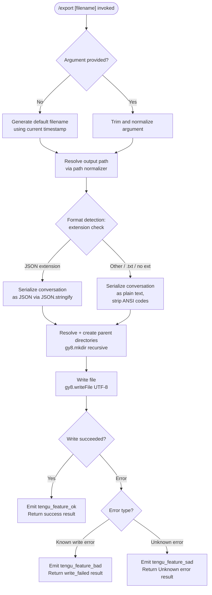

# `/export`

> Analysis basis: CC v2.1.160 bundle.js (AST extraction + Claude interpretation)
> Minimum version: v2.1.160

---

## Overview

`/export` saves the current conversation transcript to a file on disk (or clipboard). The command accepts an optional filename argument, resolves the output path (applying safety checks and directory creation as needed), serializes the conversation into the chosen format, and writes the result — emitting telemetry events for success, failure, and unexpected errors.

---

## Registration

| Field | Value |
|---|---|
| type | `local-jsx` |
| name | `export` |
| description | Export the current conversation to a file or clipboard |
| argumentHint | `[filename]` |
| module_id | `Je1` |
| load_inline | `true` |
| loc_byte | `12507090` |
| loc_byte_end | `12507286` |
| loc_line | `8776` |
| arbor_handler.name | `BGf` |
| arbor_handler.fqn | `claude-2.1.160::BGf` |
| arbor_handler.kind | `AsyncFunction` |
| arbor_handler.resolution_path | `module_id` |
| arbor_handler.n_hits | `0` |

Analysis basis: CC v2.1.160 bundle.js:+12507090

---

## Input Branching

Five distinct paths are possible depending on the provided argument and runtime conditions. A Mermaid flowchart is used.



Analysis basis: CC v2.1.160 bundle.js:+12506522, +12506562, +12506571, +12506634

---

## Behavioral Spec

### 1. Entry Point — Main Handler (`BGf`)

The Arbor-resolved handler is `BGf` (AsyncFunction). It orchestrates all sub-steps below.

```
async function exportCommandHandler(commandInput, appContext):
    rawContent = buildConversationText(commandInput)
    trimmedArg  = commandInput.arg.trim()           // bundle.js:+12506531

    outputPath = resolveOutputPath(trimmedArg)       // dy8 / CGf / wq

    writeResult = await writeExportFile(outputPath, rawContent)

    if writeResult.ok:
        reportFeatureOk(context)                     // tengu_feature_ok
        return successResult(outputPath)
    elif writeResult.errorKind == "write_failed":
        reportFeatureBad(context)                    // tengu_feature_bad
        return errorResult("write_failed")
    else:
        reportFeatureSad(context)                    // tengu_feature_sad
        return errorResult("Unknown error")
```

Analysis basis: CC v2.1.160 bundle.js:+12506522, +12506531, +12506562, +12506571, +12506634, +12506732

---

### 2. Conversation Serialization (`UGf` → `cy8` → `mGf`)

`mGf` collects the conversation messages and produces a list of text lines. It iterates over message entries, filters to specific roles (`"assistant"`, `"user"`), and for each turn applies ANSI stripping (`S4` → `Bun.stripANSI`) and content-type checks (`"text"`, `"message"`). The helper `uGf` handles array vs. non-array content normalization.

```
function buildConversationText(context):
    lines = []
    for each message in conversationHistory:
        if message.role in ["user", "assistant"]:    // bundle.js:+12506025, +12504654
            content = normalizeContent(message.content)  // uGf: Array.isArray check
            for each block in content:
                if block.type == "text":             // bundle.js:+12506182
                    lines.push(stripAnsi(block.text))    // S4 → Bun.stripANSI
    return lines.join("\n")
```

Message truncation: the most recent 50 turns are considered; substring is taken at offset 49 (0-indexed), meaning up to 50 user turns are included.
Analysis basis: CC v2.1.160 bundle.js:+12506243, +12506262

---

### 3. Output Path Resolution (`dy8` → `CGf` + `wq`)

`CGf` examines the file extension via `Qy8.extname` to determine the export format (JSON vs. plain text). `wq` performs full path normalization.

```
function resolveOutputPath(rawArg):
    if rawArg is empty:
        rawArg = generateDefaultFilename()           // pGf: date/time stamp

    ext = path.extname(rawArg)                       // Qy8.extname, bundle.js:+12501917

    normalizedPath = normalizePath(rawArg)           // wq, bundle.js:+12501957

    return { path: normalizedPath, ext: ext }
```

Path normalization (`wq`) performs:
- Null-byte rejection — throws `Error("Path contains null bytes")` (bundle.js:+1008395)
- NFC Unicode normalization (bundle.js:+176361)
- Home-directory expansion: `~/` prefix replaced with `os.homedir()` (bundle.js:+1008523)
- Windows drive-letter path handling (bundle.js:+1008592)
- Absolute-path resolution via `path.resolve` (bundle.js:+1008706)

Analysis basis: CC v2.1.160 bundle.js:+12501917, +12501957, +1008142, +1008395, +1008523, +1008706

---

### 4. Default Filename Generation (`pGf`)

When no argument is supplied, a timestamped default filename is constructed from the current local date and time. Each component (year, month, day, hours, minutes, seconds) is obtained from a `Date` object and zero-padded using `String`.

```
function generateDefaultFilename():
    now = new Date()
    year    = String(now.getFullYear())          // bundle.js:+12505748
    month   = zeroPad(now.getMonth() + 1)        // bundle.js:+12505755
    day     = zeroPad(now.getDate())             // bundle.js:+12505796
    hours   = zeroPad(now.getHours())            // bundle.js:+12505834
    minutes = zeroPad(now.getMinutes())          // bundle.js:+12505873
    seconds = zeroPad(now.getSeconds())          // bundle.js:+12505914
    return "claude-export-{year}{month}{day}-{hours}{minutes}{seconds}.txt"
```

Analysis basis: CC v2.1.160 bundle.js:+12506787, +12505730

---

### 5. File Write (`dy8`)

The write logic creates all necessary parent directories recursively before writing the file content with UTF-8 encoding.

```
async function writeExportFile(resolvedPath, content):
    parentDir = path.dirname(resolvedPath)           // Qy8.dirname, bundle.js:+12502023
    await fs.mkdir(parentDir, { recursive: true })   // gy8.mkdir, bundle.js:+12502013
    await fs.writeFile(resolvedPath, content, "utf-8")  // gy8.writeFile, bundle.js:+12502060, +12502088
```

Analysis basis: CC v2.1.160 bundle.js:+12502013, +12502023, +12502060

---

### 6. Incremental / Chunked Write Path (`rmK`, `imK`, `FwA`, `gwA`)

A secondary write path exists for larger or streaming writes, using `appendFile` with chunk management. This path:
- Calls `Hy.mkdir` for directory creation (bundle.js:+203490)
- Appends content chunks via `Hy.appendFile` (bundle.js:+203549)
- Checks `Buffer.byteLength` for size tracking (bundle.js:+203943)
- Rotates/renames files using `Hy.rename` when a `.txt` suffix rollover is needed (bundle.js:+203247)
- Cleans up via `Hy.unlink` on error (bundle.js:+203287)
- Uses a debounced flush mechanism (`QuH`) with `clearTimeout` / `setTimeout` / `setImmediate` and a 1000 ms delay (bundle.js:+58350) and a batch size of 100 (bundle.js:+58371)
- Registers a cleanup hook via `HDA.register` (`O9`, bundle.js:+59048)

```
function chunkedWriteManager(filePath, data):
    ensureDir(path.dirname(filePath))
    buffer.push(data)
    scheduleFlush(debounceMs=1000, batchSize=100)

function flush():
    chunk = buffer.join("")
    currentSize = Buffer.byteLength(chunk)
    if currentSize threshold exceeded:
        rotateTo(filePath + suffix)          // Hy.rename
    else:
        fs.appendFile(filePath, chunk)
```

Analysis basis: CC v2.1.160 bundle.js:+203490, +203549, +203943, +203247, +58350, +58371

---

### 7. JSON Serialization Path (`SH`)

When a `.json` extension is detected, conversation data is serialized via `JSON.stringify`.

```
function serializeAsJson(conversationData):
    return JSON.stringify(conversationData)    // bundle.js:+183798
```

Analysis basis: CC v2.1.160 bundle.js:+183798, +12501917

---

### 8. Argument Pre-processing (`je1` / `we1`)

Before path resolution, the raw argument string is pre-processed:
- Converted to lowercase for comparison purposes (`H.toLowerCase`, bundle.js:+12506307)
- Whitespace trimmed (`A.trim`, bundle.js:+12506120)
- Message history is searched for the most recent user message (`H.find`, bundle.js:+12506004)
- Content extracted via substring at offset 49 with length 50 (bundle.js:+12506243, +12506262)

Analysis basis: CC v2.1.160 bundle.js:+12506004, +12506120, +12506307

---

## State & Side Effects

| Item | Detail |
|---|---|
| Telemetry: `tengu_feature_ok` | Fired on successful file write (bundle.js:+966123) |
| Telemetry: `tengu_feature_bad` | Fired on known write failure (`write_failed`) (bundle.js:+966181) |
| Telemetry: `tengu_feature_sad` | Fired on unexpected/unknown error (bundle.js:+966258) |
| File system: directory creation | `fs.mkdir` with `recursive: true` on parent directory before write |
| File system: file write | `fs.writeFile` UTF-8 at resolved path; chunked path uses `fs.appendFile` |
| File system: file rotation | `Hy.rename` + `Hy.unlink` in chunked write path for size-based rotation |
| Cleanup hook | `HDA.register` (O9) registers a finalizer to clean up open file handles (bundle.js:+59048) |
| ANSI stripping | `Bun.stripANSI` called on each text block before writing (bundle.js:+3809078) |
| Path normalization | NFC Unicode, tilde expansion, null-byte rejection applied to all paths |
| appState changes | No direct appState mutation observed in depth-2 traversal |
| Sound | <!-- TODO: not found in depth-2 traversal; needs --depth 4 --> |

---

## Version History

| Version | Change |
|---|---|
| v2.1.160 | Initial analysis |

---

## Common Mistakes

1. **Omitting the extension**: If no extension is provided, the command defaults to plain-text format. To export as JSON, the filename argument must end in `.json`.
2. **Relative paths without context**: Relative paths are resolved against the process working directory; passing a bare filename may result in the file landing in an unexpected location. Use an absolute path or `~/` prefix for predictable placement.
3. **Null bytes in filename**: Any filename argument containing a null byte will throw an error immediately during path normalization and will not write anything (bundle.js:+1008395).
4. **Assuming clipboard output**: Despite the description mentioning "clipboard", the primary observed write path goes to a file. Clipboard behaviour is <!-- TODO: not found in depth-2 traversal; needs --depth 4 -->.
5. **Expecting the full history**: Only the most recent 50 conversation turns (indexed at offset 49) are included in the export; earlier messages are silently truncated (bundle.js:+12506243, +12506262).

---

## Appendix — Identifier Mapping

> For bundle debugging only. Identifiers change across versions.

| Identifier | Role |
|---|---|
| `BGf` | Main export command handler (AsyncFunction, Arbor-resolved) |
| `UGf` | Conversation serialization entry wrapper |
| `cy8` | Text-line accumulator and joiner |
| `mGf` | Message iterator / conversation collector |
| `xGf` | Conversation data accessor (called by mGf) |
| `uGf` | Content block normalizer (Array.isArray branch) |
| `gc` | Session/context resolver (plan mode, teammate checks) |
| `HtH` | Event listener setup for streaming data |
| `S4` | ANSI strip utility wrapper (→ Bun.stripANSI) |
| `dy8` | File write orchestrator (mkdir + writeFile) |
| `CGf` | Extension detector and format selector |
| `wq` | Path normalizer (NFC, tilde, null-byte, absolute resolution) |
| `S6` | Path sub-utility used by wq |
| `RO` | Path NFC normalize helper |
| `pGf` | Default filename generator (timestamp builder) |
| `we1` | Argument pre-processor / message history searcher |
| `je1` | Argument lowercasing pre-handler |
| `O7` | Content extraction utility |
| `oq` | String slice/index helper |
| `hH` | Success result builder |
| `RH` | Error result builder |
| `N` | Export format dispatch function |
| `lmK` | Conversation text serializer (plain text path) |
| `ADA` | Text assembly helper |
| `lbK` | Text block formatter (called by ADA) |
| `nbK` | Text block formatter variant (called by ADA) |
| `SH` | JSON serializer (→ JSON.stringify) |
| `x4` | File extension / path suffix utility |
| `xwA` | Map-based content transformer |
| `PmH` | Write-to-stream wrapper |
| `ZwA` | Stream write helper (→ H.write) |
| `rmK` | Chunked write manager |
| `QuH` | Debounced flush scheduler |
| `R$H` | Chunk path join / write helper |
| `gwA` | Chunk file path builder |
| `FwA` | File rotation handler (stat / rename / unlink) |
| `imK` | Append-file chunk writer |
| `A46` | Directory error handler (EISDIR check) |
| `dwA` | Write completion callback |
| `O9` | Cleanup hook registrar (→ HDA.register) |
| `d6` | File descriptor / path state holder |
| `Ce` | Feature-flag / set membership checker |
| `wj` | String replacement utility |
| `gq` | Model resolution entry (used in context setup) |
| `GHH` | Model name dispatcher |
| `lQ` | Model name parser |
| `K1` | Model identifier normalizer |
| `C0` | Model config lookup |
| `DKH` | Model family classifier |
| `dN` | Model context builder |
| `_gH` | Model context variant builder |
| `tT` | Model type selector |
| `XDq` | Model type wrapper |
| `xM` | Provider resolver |
| `xa6` | Provider inclusion checker |
| `AgH` | Provider fallback handler |
| `yP` | Model resolution pipeline |
| `R0` | Model resolution combiner |
| `t6` | Bootstrap fetch initiator |
| `d` | Telemetry event emitter (tengu_feature_ok / bad / sad) |
| `o$` | Context state accessor |
| `O` | Session state checker (→ "stopped", "background session") |

---

Note: index built via Arbor fallback; some signals (telemetry, literals) may be missing — see arbor-fallback.js.