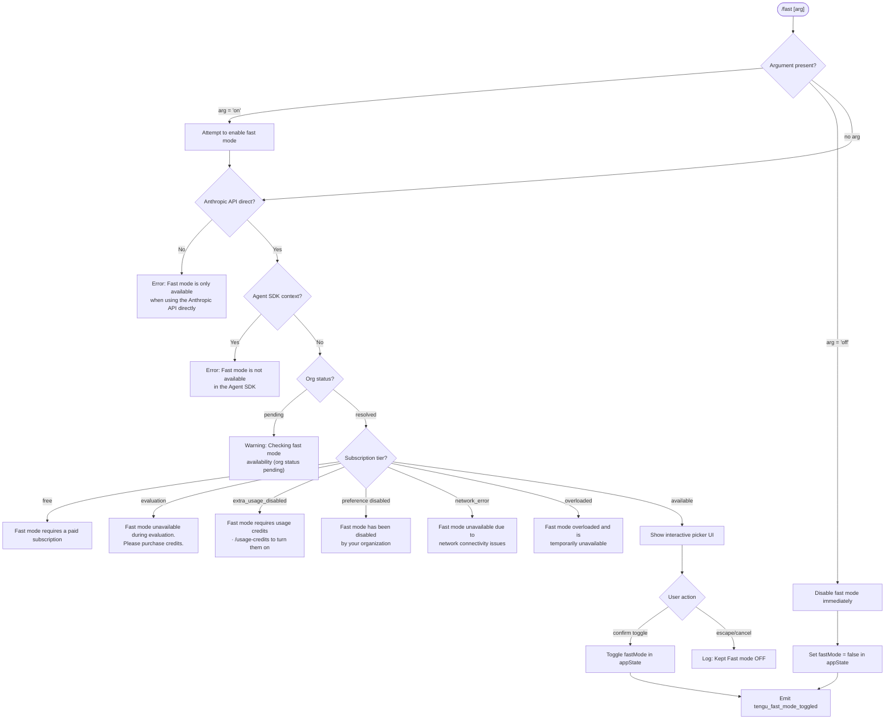

# `/fast`

> Analysis basis: CC v2.1.160 bundle.js (AST extraction + Claude interpretation)
> Minimum version: v2.1.160

---

## Overview

`/fast` toggles **Fast mode** (research preview) on or off for the current Claude Code session. When invoked, it checks availability against the Anthropic API, user subscription tier, and organizational policy, then either switches fast mode state or presents an interactive picker UI. An explicit `on` or `off` argument bypasses the picker and directly sets the desired state.

---

## Registration

| Field | Value |
|---|---|
| type | `local-jsx` |
| name | `fast` |
| description | `Toggle fast mode ( ... )` |
| argumentHint | `[on\|off]` |
| loc_byte | 12262952 |
| loc_byte_end | 12263224 |
| loc_line | 8528 |
| immediate | `null` |
| thinClientDispatch | `control-request` |
| isHidden | `null` |
| module_id | `Vr1` |
| load_inline | `true` |
| arbor_handler.name | `A0f` |
| arbor_handler.fqn | `claude-2.1.160::A0f` |
| arbor_handler.kind | `AsyncFunction` |
| arbor_handler.resolution_path | `module_id` |
| arbor_handler.n_hits | 3 |

Analysis basis: CC v2.1.160 bundle.js:+12262952

---

## Input Branching

The command has 5+ distinct execution paths depending on argument value, API availability, subscription tier, org policy, and Agent SDK context.



---

## Behavioral Spec

### Handler Entry Point (`A0f`)

The primary handler is an `AsyncFunction` resolved via `module_id` (`Vr1`).

```
async function handleFastCommand(args, context):
    arg = normalize(args.trim().toLowerCase())   // "on", "off", or ""

    if NOT isAnthropicApiDirect(context):
        return errorMessage("Fast mode is only available when using the Anthropic API directly")

    if isAgentSdkContext(context):
        return errorMessage("Fast mode is not available in the Agent SDK")

    prefetchFastModeAvailability(context)        // background; deduped if in-flight

    availability = await checkFastModeAvailability(context)

    if arg == "off":
        setFastMode(false)
        emitTelemetry("tengu_fast_mode_toggled", {value: false})
        return statusMessage("Fast mode OFF")

    if canEnable(availability):
        if arg == "on":
            setFastMode(true)
            emitTelemetry("tengu_fast_mode_toggled", {value: true})
        else:
            showFastModePickerUI(availability)   // JSX component Yy8
            emitTelemetry("tengu_fast_mode_picker_shown")
    else:
        return renderUnavailableReason(availability)
```

Analysis basis: CC v2.1.160 bundle.js:+12261986

---

### Availability Check (`checkAvailabilityHandler`)

```
function checkFastModeAvailability(context):
    // Calls fastModeOrgCheck (cK) then orgStatusResolver (H)
    apiProvider = getApiProvider(context)

    // Provider checks (jA -> FH path)
    if provider in ["bedrock", "foundry", "anthropicAws", "mantle", "vertex", "firstParty"]:
        if provider != "firstParty":
            return {available: false, reason: "api_provider_unsupported"}

    orgStatus = fetchOrgStatus(context)   // H -> N chain

    if orgStatus.status == "pending":
        return {available: false, reason: "pending"}

    tier = orgStatus.subscriptionTier
    if tier == "free":
        return {available: false, reason: "free"}
    if tier == "evaluation":
        return {available: false, reason: "evaluation"}
    if orgPolicy == "extra_usage_disabled":
        return {available: false, reason: "extra_usage_disabled"}
    if orgPolicy == "preference" and fastModeDisabledByOrg:
        return {available: false, reason: "org_disabled"}
    if networkError:
        return {available: false, reason: "network_error"}
    if overloaded:
        return {available: false, reason: "overloaded"}

    return {available: true}
```

Analysis basis: CC v2.1.160 bundle.js:+12261998 (H call), +2219061 (error string)

---

### Prefetch Deduplication (`prefetchHandler`)

```
function prefetchFastModeAvailability(context):
    if inFlightPromise != null:
        log("Fast mode prefetch in progress, returning in-flight promise")
        return inFlightPromise

    lastFetchTime = getCachedFetchTime()
    if (Date.now() - lastFetchTime) < RECENT_THRESHOLD:
        log("Skipping fast mode prefetch, fetched recently")
        return

    // XHH calls: cK, jA, W6 (context builder), b8 (auth reader), N (org check)
    inFlightPromise = doFetch(context).then(cacheResult)
    return inFlightPromise
```

Analysis basis: CC v2.1.160 bundle.js:+12262000 (XHH call), +2222775 (dedup log string)

---

### Fast Mode Toggle / Cooldown (`cooldownManager`)

The `oK_` function manages a cooldown re-enable path:

```
function manageFastModeCooldown():
    now = Date.now()
    if cooldownExpired(now):
        log("Fast mode cooldown expired, re-enabling fast mode")
        setFastMode(true, context)
        emit("KDqEvent", {action: "cooldown_cleared"})
```

Analysis basis: CC v2.1.160 bundle.js:+2220285 (Date.now), +2220326 (log string "Fast mode cooldown expired, re-enabling fast mode")

---

### Picker UI Component (`Yy8`)

`Yy8` is the JSX component rendered when no explicit argument is provided and fast mode is available.

```
function FastModePickerUI(props):
    [state, setState] = useState(initialPickerState)
    fastModeState = useAppStore(selectFastMode)  // J6 -> LX_

    // Title: " Fast mode (research preview)"
    // Shows toggle control with current ON/OFF status
    // Keyboard bindings:
    //   escape / cancel  → dismiss without change; log "Kept Fast mode OFF"
    //   tab              → toggle selection
    //   enter            → confirm selection

    if fastModeState.status == "overloaded":
        showWarning("Fast mode overloaded and is temporarily unavailable")

    if fastModeState.limitHit:
        showWarning("You've hit your fast limit · resets in <countdown>")
        // countdown uses _9: floor/round for d/h/m/s display
        // 86400000ms = 1 day, 3600000ms = 1 hour, 60 = 1 minute

    showLink("https://code.claude.com/docs/en/fast-mode")

    // On confirm:
    if selectedValue != currentFastMode:
        setFastMode(selectedValue)
        emitTelemetry("tengu_fast_mode_toggled")
    else:
        log("Kept Fast mode OFF")
```

Analysis basis: CC v2.1.160 bundle.js:+12258850 (useState), +12260247 (title string), +12261195 (overloaded string), +12261249 (limit string), +12261469 (docs URL), +12259642 (kept-off string)

---

### Org Status Fetch (`orgStatusFetch` → `N`)

```
function fetchOrgStatus(context):
    // Calls: Y46, lmK, SH (JSON.stringify), x4 (URL builder), AR, PmH (writer), rmK (logger)
    // Provider guard: H.includes check against known provider list
    // Normalizes to uppercase for header construction

    request = buildApiRequest(context)
    response = await httpFetch(request, timeout=5000)  // bootstrap fetch path

    if parse fails:
        emitTelemetry("tengu_org_penguin_mode_fetch_failed")
        return {status: "network_error"}

    return parseOrgStatus(response)
```

Analysis basis: CC v2.1.160 bundle.js:+204247 (Y46 call), +204287 (H.includes), +2224194 (tengu_org_penguin_mode_fetch_failed)

---

### Availability Status Display (`renderUnavailableReason`)

```
function renderUnavailableReason(availability):
    switch availability.reason:
        case "free":
            return "Fast mode requires a paid subscription"
        case "evaluation":
            return "Fast mode unavailable during evaluation. Please purchase credits."
        case "extra_usage_disabled":
            return "Fast mode requires usage credits · /usage-credits to turn them on"
        case "preference":          // org-disabled
            return "Fast mode has been disabled by your organization"
        case "network_error":
            return "Fast mode unavailable due to network connectivity issues"
        case "overloaded":
            return "Fast mode overloaded and is temporarily unavailable"
        default:
            return "Fast mode is currently unavailable"
```

Analysis basis: CC v2.1.160 bundle.js:+2218580, +2218621, +2218796, +2218712, +2218893, +12261195, +2218972

---

## State & Side Effects

| Item | Detail |
|---|---|
| Telemetry: `tengu_fast_mode_toggled` | Fired when fast mode state changes (on or off). CC v2.1.160 bundle.js:+12258395 |
| Telemetry: `tengu_fast_mode_picker_shown` | Fired when the interactive picker UI is rendered. CC v2.1.160 bundle.js:+12262211 |
| Telemetry: `tengu_org_penguin_mode_fetch_failed` | Fired when the org-status API fetch fails. CC v2.1.160 bundle.js:+2224194 |
| Telemetry: `tengu_penguins_off` | Fired when fast mode is confirmed as unavailable for the session. CC v2.1.160 bundle.js:+2219167 |
| Telemetry: `tengu_feature_ok` / `tengu_feature_bad` / `tengu_feature_sad` | General feature health events emitted by the appState machinery during provider checks. CC v2.1.160 bundle.js:+966123, +966181, +966258 |
| Telemetry: `tengu_config_lock_contention` | Emitted if config save lock takes longer than expected. CC v2.1.160 bundle.js:+3245771 |
| Telemetry: `tengu_config_auth_loss_prevented` | Emitted when a stale config write that would erase auth is blocked. CC v2.1.160 bundle.js:+3246250 |
| Telemetry: OAuth recovery events | `tengu_oauth_401_sdk_callback_refreshed`, `tengu_oauth_401_recovered_from_disk`, `tengu_oauth_401_recovered_from_keychain` — emitted during auth refresh within the fetch path |
| appState changes | `fastMode` boolean toggled; emitted via `KDq` event emitter; cooldown timer may schedule re-enable |
| Hook registration | `wA` component registers a keyboard handler via `K.registerHandler` for picker keyboard navigation |
| Prefetch cache | Result is cached with `Date.now()` timestamp; re-fetches skipped if within recency threshold |
| Config write | If fast mode state is persisted, `saveConfigWithLock` (`xY_`/`W8`) is called with auth-loss guard |
| Sound | `<!-- TODO: not found in depth-2 traversal; needs --depth 4 -->` |
| thinClientDispatch | `control-request` — routed as a control-plane request in thin-client mode |

---

## Version History

| Version | Change |
|---|---|
| v2.1.160 | Initial analysis |

---

## Common Mistakes

1. **Using `/fast` on non-Anthropic API providers** — Fast mode is only available when using the Anthropic API directly (`firstParty`). Bedrock, Vertex, Foundry, and other provider configurations will receive an explicit error message. CC v2.1.160 bundle.js:+2219061
2. **Using `/fast` inside Agent SDK** — The Agent SDK context triggers a hard block with the message "Fast mode is not available in the Agent SDK". This is checked before any availability fetch. CC v2.1.160 bundle.js:+2219396
3. **Expecting immediate toggle without a paid subscription** — Free-tier and evaluation-tier users will see a subscription requirement error; no picker UI is shown. CC v2.1.160 bundle.js:+2218580, +2218621
4. **Passing unrecognized arguments** — Only `on`, `off`, or no argument are interpreted. The literal check for `"yes"` / `"on"` at CC v2.1.160 bundle.js:+26948, +26954 suggests the parser also accepts `yes` as truthy, but the public argument hint only documents `[on|off]`.
5. **Assuming fast mode persists across sessions** — The cooldown mechanism can automatically disable fast mode mid-session if rate limits are hit, and the state is re-evaluated on each new session via the prefetch path.
6. **Triggering `/fast` during an org-status pending state** — The command will surface a "Checking fast mode availability" warning rather than enabling fast mode; the org status must resolve first.

---

## Appendix — Identifier Mapping

> For bundle debugging only. Identifiers change across versions.

| Identifier | Role |
|---|---|
| `A0f` | Main `/fast` command handler (AsyncFunction; arbor_handler) |
| `cK` | API provider resolver / context builder |
| `jA` | Provider type classifier |
| `FH` | String formatting / output helper |
| `H` | Org status fetcher / bootstrap fetch dispatcher |
| `N` | Org status parser and API request builder |
| `lmK` | Request initializer (headers, method) |
| `ADA` | Header assembly helper |
| `SH` | JSON serializer wrapper |
| `x4` | URL path builder |
| `xwA` | Path segment mapper |
| `PmH` | Response writer |
| `ZwA` | Stream writer |
| `rmK` | Structured logger / file appender |
| `QuH` | Debounced log flusher (uses setTimeout/setImmediate) |
| `R$H` | Log entry formatter |
| `d6` | Error handler / error formatter |
| `A46` | Log rotation helper |
| `gwA` | Log path resolver |
| `FwA` | Log file manager (stat/rename/unlink) |
| `imK` | Log file appender with mkdir |
| `O9` | Hook registrar (HDA.register) |
| `o$` | App context accessor |
| `Ce` | Feature-flag set checker |
| `wj` | String replace utility |
| `gq` | Model name/alias resolver |
| `GHH` | Model dispatch router |
| `DN` | Model default selector |
| `p9H` | Model preference reader |
| `lQ` | Model alias parser |
| `K1` | Model identifier normalizer |
| `C0` | Model config writer |
| `DKH` | Model name validator |
| `dN` | Model name tokenizer |
| `_gH` | Model name formatter |
| `tT` | Model string builder |
| `XDq` | Model string wrapper |
| `xM` | Message formatter |
| `xa6` | Allowed-model-list checker |
| `AgH` | Model alias output formatter |
| `yP` | Model selection pipeline |
| `R0` | Model resolution chain |
| `t6` | App state dimension helper |
| `d` | React/Ink render helper |
| `XHH` | Fast mode availability prefetch coordinator |
| `W6` | Session/workspace context reader |
| `HY6` | Session ID reader |
| `_Y6` | Workspace path resolver |
| `px` | Context formatter |
| `mx` | Context merger |
| `HA8` | Dedup gate (jY_ set + WDH map) |
| `wY_` | Growthbook experiment emitter |
| `WY_` | Permission / CE checker |
| `R6` | File-based config loader (ZDH path) |
| `hY_` | Config path resolver |
| `ZDH` | Config file reader with backup |
| `ojL` | File watcher / config hot-reload |
| `b8` | Auth reader composite |
| `RQ6` | Auth cache reader (yzA path) |
| `yzA` | Auth cache get (Cb6 map) |
| `us8` | Auth builder |
| `hzA` | Auth cache setter |
| `EQ` | Credentials assembler |
| `Y_` | Token validator |
| `a16` | API key reader |
| `LU8` | Auth token type selector |
| `n16` | OAuth token reader |
| `u0H` | Auth header builder |
| `m0H` | Auth method selector |
| `t16` | Token scope checker |
| `F3H` | Auth formatter |
| `g3H` | Credential normalizer |
| `ys8` | Auth presence tester |
| `pSA` | Auth profile selector |
| `ci` | Auth context injector |
| `j56` | Platform detector (WSL, etc.) |
| `x_` | VS Code extension context checker |
| `uuH` | Client identity tester |
| `bb` | Binary/bundle mode flag |
| `Sa6` | Status message renderer |
| `Js4` | UI status bar updater |
| `eFH` | Fast mode fetch-and-apply pipeline |
| `sK_` | Fast mode state setter (cK + Sa6 + R6) |
| `n9` | Network request executor (KNA path) |
| `KNA` | HTTP response formatter |
| `$W` | Session runner / agent loop entry |
| `e3` | Agent turn executor |
| `eK` | Turn output renderer |
| `sN` | Turn streamer |
| `HD6` | Turn header builder |
| `jP` | Turn payload assembler |
| `w$6` | FD-based OAuth token reader |
| `hJ` | Agent inner loop handler |
| `kR` | Response slice trimmer |
| `TV` | Tool call validator |
| `Ws4` | Auth context builder with cache.get |
| `kq` | Auth URL builder |
| `aVA` | OAuth endpoint selector |
| `z94` | Custom OAuth URL validator |
| `$U` | OAuth 401 recovery handler (UO_ map) |
| `k3L` | Token refresh pipeline |
| `$DH` | Refresh precondition checker |
| `m16` | Refresh token reader |
| `hH` | Refresh error logger |
| `RH` | Refresh result logger |
| `Kr` | Token expiry checker |
| `z4` | Token payload parser |
| `Me` | Token metadata extractor |
| `r16` | Refresh result writer |
| `yH` | Error reporter with logError |
| `E3` | Post-refresh state updater |
| `F_` | Settings loader from disk |
| `mO` | Settings composite builder |
| `c3H` | Settings path resolver |
| `NX` | Settings file reader |
| `Ui` | Raw settings file parser |
| `V8` | EISDIR/error guard |
| `G8` | Filesystem error classifier |
| `Ra8` | Settings load timestamp recorder |
| `SEH` | Settings schema validator |
| `SQ6` | Settings path normalizer |
| `If6` | Atomic file writer (temp+rename) |
| `O` | Symlink status checker |
| `f` | File descriptor handle |
| `Uz` | Auth cache clearer |
| `Bg6` | Gitignore rule manager |
| `S6` | Git binary locator |
| `ja8` | Git command runner |
| `Ug6` | Git check-ignore invoker |
| `NL4` | Global gitignore path resolver |
| `dyA` | Gitignore entry builder |
| `cyA` | Gitignore append helper |
| `fx` | Settings path joiner |
| `lp` | Settings load pipeline |
| `EG` | Settings merge helper |
| `h9` | Memory usage sampler |
| `ms8` | Settings loader with telemetry |
| `bb6` | Settings load finalizer |
| `W8` | Global config saver (fallback path) |
| `xY_` | Config saver with lock |
| `L` | Locked operation helper |
| `qYq` | Config diff/merge helper |
| `fY6` | Config field extractor |
| `uY_` | Backup path builder |
| `V` | Config version checker |
| `X` | SDK session manager |
| `Z` | Backup list trimmer |
| `SdH` | Config sanitizer |
| `lQq` | Config entry iterator |
| `RdH` | Config write timestamp recorder |
| `bY_` | Config write helper (If6 path) |
| `K` | Column/row layout renderer |
| `Dy8` | Fast mode UI orchestrator (main JSX entry) |
| `zy8` | Fast mode state applier (flag settings) |
| `KzH` | Flag settings reader |
| `zh` | CCR (Cloud Code Remote) context checker |
| `b$` | CCR mode getter |
| `tFH` | Token FX renderer |
| `FX` | Formatted text output |
| `e2H` | Fast mode config field deserializer |
| `a3` | Model+availability context combiner |
| `t2H` | Fast mode toggle bar renderer |
| `Bx` | Theme/color context reader |
| `SY6` | Theme name resolver |
| `Kq8` | Theme variant checker |
| `kDH` | Color prefix stripper |
| `zlq` | Color fallback helper |
| `h4` | Session/history context reader |
| `zV` | Usage-credit set manager |
| `JA` | Inline color renderer |
| `xDH` | ANSI/hex/rgb color mapper |
| `Id` | Color identity resolver |
| `MU` | Model usage display formatter |
| `aq` | Model capability qualifier |
| `er6` | Capability entry iterator |
| `l_` | Settings loader trigger |
| `kP` | Model capability filter |
| `rU8` | Capability cache reader |
| `yR` | Token count formatter |
| `jDq` | Numeric precision formatter |
| `VGH` | Context/availability combiner (cK + aq) |
| `Yy8` | Fast mode picker JSX component (main UI) |
| `J6` | App store selector (useSyncExternalStore) |
| `LX_` | AppState context hook |
| `fA` | Secondary AppState accessor |
| `oK_` | Fast mode cooldown manager |
| `$` | Telemetry/analytics emitter |
| `aHK` | Telemetry event builder |
| `$r` | Event payload formatter |
| `JKH` | Event name validator |
| `L1` | AsyncLocalStorage store reader |
| `ny6` | Daemon status path builder |
| `wA` | Keyboard handler registrar (useEffect) |
| `Zj` | Ink/JSX context reader |
| `M` | Plugin/file handler |
| `qC6` | Plugin path validator |
| `KC6` | Plugin directory resolver |
| `_9` | Time duration formatter (ms → human-readable) |

---

Note: index built via Arbor fallback; some signals (telemetry, literals) may be missing — see arbor-fallback.js.