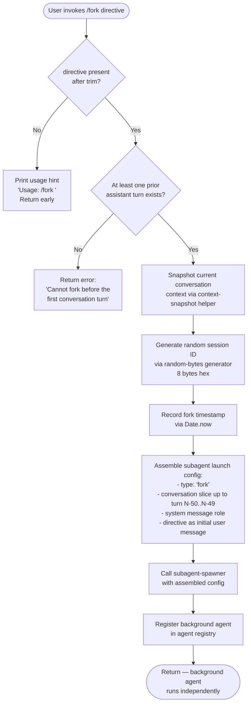

# `/fork`

> Analysis basis: CC v2.1.160 bundle.js (AST extraction + Claude interpretation)
> Minimum version: v2.1.160

---

## Overview

`/fork` spawns a background subagent that inherits the full conversation history of the current session. The user provides a `<directive>` argument that guides the forked agent's independent task. The command validates that at least one conversation turn has already occurred before proceeding, then launches an asynchronous background agent seeded with the parent conversation context.

---

## Registration

| Field | Value |
|---|---|
| type | `local-jsx` |
| name | `fork` |
| description | `Spawn a background agent that inherits the full conversation` |
| argumentHint | `<directive>` |
| module_id | `rqK` |
| load_inline | `true` |
| loc_byte | `12904763` |
| loc_byte_end | `12904959` |
| loc_line | `9532` |
| arbor_handler.name | `Uyf` |
| arbor_handler.fqn | `claude-2.1.160::Uyf` |
| arbor_handler.kind | `AsyncFunction` |
| arbor_handler.resolution_path | `module_id` |
| arbor_handler.n_hits | `0` |

Analysis basis: CC v2.1.160 bundle.js:+12904763

---

## Input Branching

The command has 3 distinct branches: missing directive, no prior turn guard, and successful fork launch.



---

## Behavioral Spec

### Handler Entry Point — `forkCommandHandler` (`Uyf`)

```
async function forkCommandHandler(input, context):
    directive = input.trim()                          // +12904367

    if directive is empty:
        printUsageHint("Usage: /fork <directive>")    // +12904391
        return

    conversationSnapshot = buildConversationContext(context)  // calls contextBuilder +12904389
    subagentConfig = buildSubagentConfig(
        type       = "fork",                          // +10816331
        launchMode = "spawn",                         // +10817056
        directive  = directive,
        snapshot   = conversationSnapshot
    )
    launchResult = await subagentSpawner(subagentConfig)  // calls spawnSubagent +12904459
    return launchResult
```

Analysis basis: CC v2.1.160 bundle.js:+12904367, +12904391, +12904459

---

### Prior-Turn Guard — `conversationContextBuilder` (`Hs_`)

The subagent spawner (`Hs_`) validates that at least one prior assistant message exists before proceeding. It calls `getAppState` on the current session and walks the message list with `findLast` to locate the most recent assistant turn.

```
function buildConversationContext(session):
    appState = session.getAppState()                  // +10816244 via HKf
    messages = appState.messages

    lastAssistantIdx = messages.findLast(
        m => m.role === "assistant"
    )                                                 // +10792510

    if lastAssistantIdx is undefined:
        throw Error("Cannot fork before the first conversation turn")
                                                      // +12904500

    // slice conversation to pass to subagent
    // constants: slice upper bound offset 50 (+10816516), 49 (+10816529)
    conversationSlice = messages.slice(0, lastAssistantIdx + 1)

    replContexts = session.getReplContexts()          // +10816371

    sessionId = randomBytesHex(8)                     // +10816546, hex +6803278
    timestamp  = Date.now()                           // +10816573

    return {
        sessionId,
        timestamp,
        conversationSlice,
        replContexts,
        type: "fork"
    }
```

Analysis basis: CC v2.1.160 bundle.js:+10816244, +10792510, +12904500, +10816516, +10816546

---

### Context Building — `systemPromptBuilder` (`BE`)

The full system prompt assembled for the forked agent mirrors the parent's prompt configuration and is constructed by calling a large set of prompt-fragment helpers. Key fragments observed in the call graph include:

- Memory prompt construction via `buildCombinedMemoryPrompt` (+3336120)
- Environment info section (`env_info_static` at +13217834, `env_info_simple` at +13217871)
- Language / output style section (`language` at +13217909, `output_style` at +13217944)
- Background-session tag (`bg-session` at +13217974)
- Working-directory note for git-worktree isolation (+13219657)
- Context-management / brief flags (`context_management` at +13218028, `brief` at +13218067)
- Task-continuity hint (`task_continuity` at +13217602)

```
function buildSubagentSystemPrompt(parentConfig, forkDirective):
    fragments = []
    fragments.push(coreAgentPersona())          // +13216209 / +13216304
    fragments.push(memorySection())             // +3336120
    fragments.push(environmentSection())        // +13217834
    fragments.push(outputStyleSection())        // +13217944
    fragments.push(contextManagementSection())  // +13218028
    fragments.push(taskContinuitySection())     // +13217602
    systemPrompt = fragments.join("\n")
    return systemPrompt
```

Analysis basis: CC v2.1.160 bundle.js:+13216209, +3336120, +13217834, +13217974, +13217602

---

### Subagent Spawner — `subagentLauncher` (`z66` / `soH`)

After context assembly the command delegates to the subagent lifecycle manager. The spawner:

1. Emits telemetry event `subagent_launch` (+10816264).
2. Checks whether a prior-turn directive exists; if not emits `subagent_fork_prompt_missing` (+10816282).
3. Registers the new agent in the agent registry via `K.register` (+10355480).
4. Marks agent state as `running` (+10355214) with type `local_agent` (+10355169) and role `general-purpose` (+10355288).
5. Launches the OS-level subprocess via `Hg.spawn` (+15849251) wrapped by the session file-system setup (`sSH` at +13081917).
6. Tracks the agent in the active-agent set and hooks a `finally` cleanup to remove it on exit (+13079769).

```
async function launchSubagent(config):
    emitTelemetry("subagent_launch")                  // +10816264
    if config.directive is missing:
        emitTelemetry("subagent_fork_prompt_missing") // +10816282
        return

    agentId = registerAgent({
        type    : "local_agent",                      // +10355169
        status  : "running",                          // +10355214
        purpose : "general-purpose"                   // +10355288
    })                                                // +10355480

    sessionDir = prepareSessionDirectory(agentId)     // sSH +13081917
    process    = spawnProcess(config)                 // +15849251

    activeAgents.add(agentId)
    process.finally(() => activeAgents.delete(agentId))

    return agentId
```

Analysis basis: CC v2.1.160 bundle.js:+10816264, +10816282, +10355169, +10355480, +13081917

---

### Conversation Slice Transfer — `replContextForwarder` (`yE8`)

The forked agent receives the parent's conversation history in a normalised form. The forwarder iterates the message array and classifies each entry:

- `assistant` role messages (+9500902)
- `user` role messages (+9500924)
- `tool_use` content blocks (+9500232)
- `tool_result` content blocks (+9500391) with `ok` / `err` status (+9500507, +9500436)

Malformed or unrecognised entries are dropped via `filter`.

```
function normaliseConversationForFork(messages):
    result = []
    for msg of messages:
        if msg.role in ["assistant", "user"]:
            normalised = normaliseContentBlocks(msg.content)
            result.push({ role: msg.role, content: normalised })
    return result
```

Analysis basis: CC v2.1.160 bundle.js:+9500902, +9500924, +9500232, +9500391

---

### Fork-Context Reference — `forkContextRefWriter` (`kd_` / `n4`)

A persistent reference file tagged `fork-context-ref` (+13011682) is written to the subagent's transcript subdirectory. This allows the child agent to locate parent context after restart.

```
function writeForkContextRef(agentDir, parentSessionId):
    refPath = join(agentDir, "fork-context-ref")   // +13011682
    writeFile(refPath, parentSessionId)
```

Analysis basis: CC v2.1.160 bundle.js:+13011682

---

## State & Side Effects

| Item | Detail |
|---|---|
| Telemetry — `subagent_launch` | Emitted when a fork is initiated (+10816264) |
| Telemetry — `subagent_fork_prompt_missing` | Emitted when no directive is supplied to the spawner (+10816282) |
| Telemetry — `tengu_forked_agent_default_turns_exceeded` | Emitted if the forked agent exceeds default turn limit (+10791308) |
| Telemetry — `tengu_async_agent_stall_timeout` | Emitted if the forked background agent stalls (+6893806) |
| Telemetry — `subagent_complete` | Emitted on normal completion (+6894043) |
| Telemetry — `subagent_stall_timeout` | Emitted on stall timeout (+6894063) |
| Telemetry — `tengu_agent_tool_completed` | Emitted when a tool call in the agent completes (+6889905) |
| Telemetry — `tengu_agent_tool_terminated` | Emitted when a tool call is terminated (+6895734) |
| Telemetry — `tengu_auto_mode_decision` | Safety classifier decision on agent output (+6891548) |
| Agent registry | New agent entry added with `local_agent` / `running` / `general-purpose` tags |
| Session directory | New subdirectory created under `subagents/` path (+6682064); symlink created by `Et.symlink` (+13081970) |
| `fork-context-ref` file | Written to subagent transcript dir (+13011682) |
| `agent_metadata` file | Written as `.meta.json` (+12995857, +12995666) |
| AbortController | A new abort controller is created for the forked agent; abort event string `"abort"` (+4755686) |
| Active-agent set | Agent ID added on start; removed in `finally` handler (+13079783) |
| Sound | <!-- TODO: not found in depth-2 traversal; needs --depth 4 --> |
| appState changes | Parent `appState` read-only during fork; child writes its own state via `H.setAppState` (+10788067) |

---

## Version History

| Version | Change |
|---|---|
| v2.1.160 | Initial analysis |

---

## Common Mistakes

1. **Invoking `/fork` before any assistant reply** — the guard at `+12904500` will reject the command with "Cannot fork before the first conversation turn." Send at least one message and receive a reply first.
2. **Omitting the `<directive>` argument** — the handler trims the input and returns the usage hint `"Usage: /fork \<directive\>"` (+12904391) without launching anything.
3. **Expecting synchronous output** — the forked agent runs as a background process. Its results appear in the agent panel, not as an immediate reply in the current conversation.
4. **Assuming the fork inherits tool permissions interactively** — the child agent's permission model is derived from the parent's `appState` at fork time; runtime permission dialogs from the parent session are not forwarded.
5. **Treating `/fork` like `/resume`** — `"resume"` (+10816450) is a distinct launch mode; `/fork` always creates a new branch rather than continuing a previous subagent session.

---

## Appendix — Identifier Mapping

> For bundle debugging only. Identifiers change across versions.

| Identifier | Role |
|---|---|
| `Uyf` | Main async fork command handler (`forkCommandHandler`) |
| `Hs_` | Conversation context builder / subagent spawner coordinator |
| `HKf` | System-prompt and app-state assembler for subagent |
| `N_` | Message walker — finds last assistant turn in conversation |
| `Ov8` | Message classifier helper (working_directory extraction) |
| `zv8` | Message classifier helper (disallowed_tools extraction) |
| `BE` | Full system-prompt builder (assembles all prompt fragments) |
| `z66` | Subagent lifecycle / session launcher |
| `soH` | Background-agent run loop and event dispatcher |
| `ih` | REPL main-thread agent orchestrator |
| `yE8` | Conversation-slice normaliser for fork transfer |
| `Jd7` | Tool-use content block classifier |
| `Pd7` | Tool-result content block classifier |
| `jd7` | Error-result content block classifier |
| `Xd7` | Mixed-content block classifier |
| `Sk1` | Directive trimmer |
| `hh` | Random-bytes session-ID generator |
| `sSH` | Subagent session directory / symlink setup |
| `hS8` | Active-agent set tracker (add/delete) |
| `MKA` | Session directory mkdir helper |
| `B$` | Session path join helper |
| `qH6` | Subagent session directory opener |
| `GZ` | Subagent working-directory resolver |
| `y6` | Path normaliser (zN wrapper) |
| `Y_` | Path normaliser variant |
| `jh` | Abort-controller manager for subagent |
| `F1` | Signal max-listeners setter |
| `BUL` | Abort-controller deref helper (bind) |
| `FUL` | Abort-controller deref helper (bind, variant) |
| `S2` | Subagent pending-state tracker |
| `K` | Subagent column-pad formatter |
| `Va` | Model / provider config resolver for subagent |
| `BG` | Conversation history formatter for agent context |
| `ar6` | ARN/model-path parser |
| `vm4` | ARN startsWith/lastIndexOf/substring helper |
| `WY` | Provider type router |
| `jA` | Provider capability descriptor |
| `sr6` | Provider lowercase comparator |
| `IFH` | Model-path transformer |
| `D9_` | ARN prefix checker |
| `vS9` | Provider inclusion checker |
| `aq` | Model qualifier helper |
| `VS9` | Provider-set resolver |
| `OU` | Model family resolver |
| `FX` | Provider-token descriptor builder |
| `nQ` | AsyncLocalStorage runner (task context) |
| `Tw` | AsyncLocalStorage getter (task context) |
| `iQ` | AsyncLocalStorage getter (store context) |
| `b0` | Store context accessor |
| `XW6` | Subagent turn loop driver |
| `vd_` | Tool-set delta filter |
| `a0` | Turn executor |
| `I8` | Turn-result recorder |
| `Jz1` | Turn-state updater |
| `PW6` | Agent progress event emitter |
| `Nr_` | Progress timestamp recorder |
| `rO` | Session-file flusher |
| `b7H` | Agent speculation aborter |
| `w7` | HTML-entity replacer |
| `aoH` | Active-agent filter |
| `IK` | Text-content filter |
| `ykH` | Observable-tool resolver |
| `vK` | Tool-definition cache walker |
| `EJH` | Tool-execution classifier |
| `yRH` | Tool read/search classifier |
| `TW6` | Turn-count updater |
| `x7H` | Agent watchdog state accessor |
| `WW6` | Watchdog state writer |
| `LO8` | Agent lifecycle orchestrator |
| `coH` | Turn-progress event emitter |
| `qO8` | Tool-result processor and agent-summary writer |
| `EZ` | Last-message finder |
| `MO8` | Agent completion state writer |
| `hH` | Generic debug-log helper |
| `fO8` | Auto-mode classifier runner |
| `hR9` | Classifier status resolver |
| `YW6` | Classifier request executor |
| `Vp` | Classifier output validator |
| `GJH` | Agent completion event emitter |
| `GH` | String converter |
| `m26` | Dead-session cleanup |
| `q7H` | Permission-state writer |
| `W6` | Permission event dispatcher |
| `By9` | Subagent path cache setter |
| `F38` | OTel span recorder for subagent |
| `yS9` | Span-cache get/set |
| `kS9` | Span-delta abs helper |
| `tL7` | Span-queue pusher |
| `ULH` | Session load/dump helper |
| `ZC` | Session-state serialiser |
| `Ia` | Tool-permission reconciler |
| `Jh_` | Permission-set filter |
| `o3` | Tool-name parser |
| `Q0` | Permission decision writer |
| `HC9` | Permission state copier |
| `qQ7` | Subagent system-prompt retriever |
| `NV6` | System-prompt formatter |
| `IV6` | Full agent session bootstrapper |
| `GL` | Session-context loader |
| `HX` | Agent main execution loop (run-to-completion) |
| `Vm` | Agent memory loader |
| `WC` | Memory fragment builder |
| `G_` | Module initialiser |
| `M` | Temp-file cleanup helper |
| `RY` | Reply-content extractor |
| `RH` | Generic renderer helper |
| `kd_` | Fork-context reference writer |
| `n4` | Transcript-path resolver |
| `nAH` | Agent metadata writer |
| `WRH` | Metadata content filter |
| `M66` | Agent metadata file writer |
| `Q9K` | GZ path helper for metadata |
| `N6` | Remote-REPL session connector |
| `LH` | Message-stream writer |
| `r4A` | REPL v2 transport adapter |
| `Kh6` | Session-ID sanitiser |
| `nH` | Remote-REPL connection lifecycle |
| `$6` | SIGINT-aware shutdown scheduler |
| `Y6` | REPL batch writer |
| `tS9` | OTel span initialiser for subagent spawn |
| `yh` | Active-span accessor |
| `ZkH` | Span-type setter |
| `jJH` | Span context setter |
| `Zm` | Agent agentic-loop runner |
| `V1f` | Core query / model-call loop |
| `s$8` | Subagent-exit state cleaner |
| `E7H` | Tool-list merger |
| `pj` | Tool-list deduplicator |
| `R47` | Tool finder |
| `cW` | Skill-progress event emitter |
| `WAf` | Skill-notification initialiser |
| `TAf` | Skill-progress updater |
| `oT8` | Skill-context accessor |
| `L66` | Skill-progress cache manager |
| `Ov6` | Skill-name trimmer |
| `wz1` | Watchdog state reader |
| `_X` | Watchdog delta reader |
| `hRH` | Watchdog heartbeat recorder |
| `sfH` | Agent session full-context builder |
| `hv` | Session context descriptor |
| `s1K` | Tool-type classifier |
| `t1K` | Tool-map builder |
| `BH` | Agent output renderer |
| `dH` | Agent display-item builder |
| `P6` | MCP-tool state tracker |
| `J_H` | Tool-result filter |
| `H8` | Read-only state checker |
| `dhH` | Permission dialog dispatcher |
| `$F_` | Permission audit writer |
| `cc` | Claude-desktop session checker |
| `Wy9` | Desktop session validator |
| `Iy9` | Session-notification remover |
| `OkH` | Desktop notification writer |
| `Nd_` | Pending-grant cleaner |
| `TkH` | OTel span closer |
| `eS9` | Span attribute setter |
| `GkH` | Span status setter |
| `JJH` | Span context restorer |
| `Fy9` | Path-cache deleter |
| `ES9` | Active-MCP-monitor synchroniser |
| `ZZ` | Monitor state serialiser |
| `WkH` | Monitor state updater |
| `LP6` | Session log-path builder |
| `QjH` | Session cleanup scheduler |
| `SH` | JSON stringifier wrapper |
| `GY6` | Memory-prompt assembler |
| `ldq` | Memory-compact helper |
| `MDH` | Model-descriptor builder |