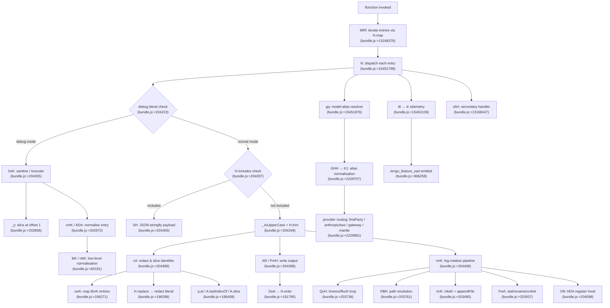

# `/function`

> Analysis basis: CC v2.1.160 bundle.js (AST extraction + Claude interpretation)
> Minimum version: v2.1.160

---

## Overview

The `/function` command is a `"command"`-type slash command whose handler (`MRf`) iterates over a collection via `H.map` and delegates to an interpreter/dispatcher (`N`) that resolves, normalises, and routes each function entry. The command orchestrates model-alias resolution, conversation-log flushing, and file-system persistence, making it a multi-step pipeline rather than a simple one-shot action.

---

## Registration

| Field | Value |
|---|---|
| type | `command` |
| name | `function` |
| description | `null` |
| loc_byte | `13168695` |
| loc_byte_end | `13168728` |
| loc_line | `10529` |
| arbor_handler.name | `MRf` |
| arbor_handler.fqn | `claude-2.1.160::MRf` |
| arbor_handler.kind | `Function` |
| arbor_handler.resolution_path | `direct` |
| arbor_handler.n_hits | `1` |

Analysis basis: CC v2.1.160 bundle.js:+13168695

---

## Input Branching

The call graph reveals 5+ distinct branches inside the dispatcher (`N`) — debug-mode guard, model-alias normalisation path, string-inclusion check, output writer path, and log-rotation path — so a Mermaid flowchart is required.



---

## Behavioral Spec

### 1. Entry-point — Handler (`MRf`)

```
function commandHandler(entries, context):
    // Iterate over the registered function entries
    // Analysis basis: CC v2.1.160 bundle.js:+13168376
    results = entries.map(entry => dispatchEntry(entry, context))
    secondaryHandler(context)          // s5H  bundle.js:+13168447
    return results
```

Analysis basis: CC v2.1.160 bundle.js:+13168376, +13168447

---

### 2. Entry Dispatcher (`N`)

```
function dispatchEntry(entry, context):
    // Bootstrap fetch log  bundle.js:+15451800
    logBootstrapFetch(entry)

    // Sanitise branch
    if entry.mode == "debug":          // literal "debug"  bundle.js:+204223
        sanitised = sanitiseEntry(entry)   // lmK  bundle.js:+204265
    else:
        sanitised = entry

    // Inclusion guard
    if entryList.includes(sanitised):  // bundle.js:+204287
        payload = jsonStringify(sanitised) // SH  bundle.js:+204305
    else:
        key = sanitised.toUpperCase().trim() // bundle.js:+204349
        identifier = redactAndSlice(key)     // x4  bundle.js:+204369
        writeOutput(identifier, context)     // AR + PmH  bundle.js:+204388
        rotateLog(identifier, context)       // rmK  bundle.js:+204408

    // Model alias resolution
    resolvedModel = resolveModelAlias(entry.model, context) // gq  bundle.js:+15451976

    // Telemetry
    emitTelemetry(context)              // t6 → d  bundle.js:+15452109

    return { payload, resolvedModel }
```

Analysis basis: CC v2.1.160 bundle.js:+204223, +204265, +204287, +204305, +204349, +204369, +204388, +204408

---

### 3. Entry Sanitisation (`lmK`)

```
function sanitiseEntry(entry):
    // Slice from offset 1 to remove leading token
    // literal value 1 at bundle.js:+202870
    trimmed = slice(entry, 1)          // _y  bundle.js:+202858
    normalised = normaliseEntry(trimmed)   // cmK  bundle.js:+202972
    further = deepNormalise(normalised)    // ADA  bundle.js:+202985
    return further
```

```
function deepNormalise(value):
    // literal 0 used as floor  bundle.js:+60173
    low  = lowerBoundNormalise(value)  // lbK  bundle.js:+60181
    high = upperBoundNormalise(value)  // nbK  bundle.js:+60195
    return merge(low, high)
```

Analysis basis: CC v2.1.160 bundle.js:+202858, +202870, +202972, +202985, +60173, +60181, +60195

---

### 4. Redact-and-Slice Identifier (`x4`)

```
function redactAndSlice(key):
    // Map over BmK entries to build candidate list
    candidates = mapBmKEntries(key)        // xwA  bundle.js:+196271

    // Replace sensitive segments with "[REDACTED]"
    // literal "[REDACTED]" at bundle.js:+196350
    redacted = key.replace(sensitivePattern, "[REDACTED]")  // bundle.js:+196298

    // Select element at position 2
    // literal 2 at bundle.js:+196379
    selected = candidates.at(2)            // q.at  bundle.js:+196408

    // Find last index and slice remainder
    boundary = redacted.lastIndexOf(marker) // A.lastIndexOf  bundle.js:+196434
    result   = redacted.slice(boundary)     // A.slice  bundle.js:+196460
    return result
```

Truncation limit observed: 40 characters (bundle.js:+15873361).

Analysis basis: CC v2.1.160 bundle.js:+196271, +196298, +196350, +196379, +196408, +196434, +196460, +15873361

---

### 5. Output Writer (`PmH` / `ZwA`)

```
function writeOutput(data, context):
    // Delegate to buffered writer
    bufferedWrite(data, context)   // ZwA  bundle.js:+191859
    // ZwA calls H.write internally  bundle.js:+191795
```

Analysis basis: CC v2.1.160 bundle.js:+191859, +191795

---

### 6. Log-Rotation Pipeline (`rmK`)

```
function rotateLog(identifier, context):
    // Resolve base directory
    dir = path.dirname(identifier)         // je.dirname  bundle.js:+203769

    // Resolve full path
    fullPath = resolvePath(dir, identifier) // gwA  bundle.js:+203905
    // gwA calls path.join + y6  bundle.js:+203422, +203435

    // Stat, rename, or unlink existing log
    manageLegacyLog(fullPath)              // FwA  bundle.js:+203937
    // FwA: stat  bundle.js:+203091
    //      endsWith ".txt"  bundle.js:+203184 (literal ".txt"  bundle.js:+203195)
    //      slice offset 4   bundle.js:+203206 (literal 4  bundle.js:+203217)
    //      rename           bundle.js:+203247
    //      unlink           bundle.js:+203287

    // Measure byte length of content
    size = Buffer.byteLength(content)      // bundle.js:+203943

    // Flush deferred operations
    flushDeferred(context)                 // dwA  bundle.js:+203976

    // Append new log entry after pending promise resolves
    pendingPromise.then(
        appendLogEntry.bind(context)       // imK  bundle.js:+204002
    )

    // imK internals:
    //   mkdir (recursive)    bundle.js:+203490
    //   appendFile           bundle.js:+203549
    //   resolvePath (A46)    bundle.js:+203581
    //   managePath (gwA)     bundle.js:+203598
    //   manageLegacyLog(FwA) bundle.js:+203636
    //   Buffer.byteLength    bundle.js:+203642
    //   flushDeferred (dwA)  bundle.js:+203675

    // Register completion hook
    registerHook(context)                  // O9  bundle.js:+204098
    // O9 calls HDA.register  bundle.js:+59048
```

Timeout constants used in flush loop (`QuH`):
- Minimum flush delay: 1000 ms (bundle.js:+58350)
- Batch size limit: 100 entries (bundle.js:+58371)

Analysis basis: CC v2.1.160 bundle.js:+203736, +203761, +203769, +203798, +203813, +203888, +203905, +203937, +203943, +203976, +204002, +204098, +58350, +58371, +59048

---

### 7. Model-Alias Resolution (`gq` → `GHH` → `K1`)

```
function resolveModelAlias(modelString, context):
    // Parse raw model string via GHH
    parsed = parseModelString(modelString)     // GHH  bundle.js:+2229757

    // Normalise alias
    normalised = normaliseAlias(parsed)        // K1  bundle.js:+2229794

    // Apply provider suffix
    withProvider = applyProviderRouting(normalised, context) // yP  bundle.js:+2229807

    return withProvider
```

```
function normaliseAlias(raw):
    trimmed = raw.trim().toLowerCase()         // bundle.js:+2233677, +2233688
    if trimmed == "opusplan":                  // literal bundle.js:+2233773
        return resolveOpusPlan(trimmed)
    if trimmed contains "[1m]":                // literal bundle.js:+2233799
        return resolveSonnetVariant(trimmed)   // "sonnet" bundle.js:+2233814
    if trimmed contains "haiku":               // literal bundle.js:+2233853
        return resolveHaikuVariant(trimmed)
    if trimmed contains "opus":                // literal bundle.js:+2233892
        return resolveOpusVariant(trimmed)
    if trimmed == "best":                      // literal bundle.js:+2233929
        return resolveBestAlias(trimmed)
    return applyReplacement(trimmed)           // _.replace  bundle.js:+2234019
```

```
function applyProviderRouting(model, context):
    switch context.provider:
        case "firstParty":    // literal bundle.js:+2229981
            return buildFirstPartyModel(model)    // tT  bundle.js:+2230548
        case "anthropicAws":  // literal bundle.js:+2048530
            return buildAwsModel(model)           // xM  bundle.js:+2230578
        case "gateway":       // literal bundle.js:+2048550
            return buildGatewayModel(model)       // jA  bundle.js:+2230615
        case "mantle":        // literal bundle.js:+2230622
            return buildMantleModel(model)        // Jf  bundle.js:+2230638
        default:
            return buildDefaultModel(model)       // dN  bundle.js:+2230657
```

Analysis basis: CC v2.1.160 bundle.js:+2229757, +2229794, +2229807, +2233677, +2233688, +2233773, +2233799, +2233814, +2233853, +2233892, +2233929, +2234019, +2229981, +2048530, +2048550, +2230622, +2230638, +2230657

---

### 8. Bootstrap Fetch Sub-routine (`H` / `N`)

```
function bootstrapFetch(url):
    log("[Bootstrap] Fetching", url)   // literal bundle.js:+15451800
    response = fetch(url, {
        headers: {
            "Content-Type": "application/json",  // bundle.js:+15451885, +15451900
            "User-Agent": userAgentString         // bundle.js:+15451919
        },
        timeout: 5000                             // literal bundle.js:+15451991
    })
    if response is not ok:
        emit("api_bootstrap_fetch", { status: "parse_failed" })  // bundle.js:+15452112, +15452134
        return null
    log("[Bootstrap] Fetch ok")        // literal bundle.js:+15452164
    return response.json()
```

Known package identity resolved from literals: `@anthropic-ai/claude-code` v`2.1.160`, built `2026-06-01T15:37:30Z`, commit `de93a1b1a590fe446df917b81bab02a21fed62b6`.

Analysis basis: CC v2.1.160 bundle.js:+15451800, +15451885, +15451900, +15451919, +15451991, +15452112, +15452134, +15452164

---

### 9. Conversation / REPL Command-Type Routing

The literal set at bytes ~12279674–12279817 shows the universe of command types the broader REPL recognises:

| Literal | Byte offset |
|---|---|
| `"prompt"` | +12279674 |
| `"agent"` | +12279703 |
| `"http"` | +12279731 |
| `"mcp_tool"` | +12279755 |
| `"callback"` | +12279817 |
| `"command"` | +13168407 |
| `"unknown"` | +13168809 |

The `/function` registration carries type `"command"`. The `"unknown"` fallback is defined at +13168809 and is used as a safe default when no type can be matched.

Analysis basis: CC v2.1.160 bundle.js:+12279674, +13168407, +13168809

---

## State & Side Effects

| Item | Detail |
|---|---|
| Telemetry | `tengu_feature_sad` (bundle.js:+966258) emitted via `d` called from `t6` |
| Hook registration | `O9` calls `HDA.register` (bundle.js:+59048) after log-rotation completes |
| File-system writes | `imK` calls `fs.mkdir` (bundle.js:+203490) and `fs.appendFile` (bundle.js:+203549) |
| File-system management | `FwA` calls `fs.stat`, `fs.rename`, `fs.unlink` on `.txt`-suffixed paths (bundle.js:+203091, +203247, +203287) |
| Output write | `ZwA` calls `H.write` (bundle.js:+191795) |
| Timer management | `QuH` issues `clearTimeout`, `setTimeout`, `setImmediate` for batched flushing; delay 1000 ms, batch 100 (bundle.js:+58350, +58371) |
| Unlinking temp files | `q` calls `ykK.unlinkSync` (bundle.js:+15825505) |
| appState changes | <!-- TODO: not found in depth-2 traversal; needs --depth 4 --> |
| Sound | <!-- TODO: not found in depth-2 traversal; needs --depth 4 --> |

---

## Version History

| Version | Change |
|---|---|
| v2.1.160 | Initial analysis |

---

## Common Mistakes

1. **Expecting a description in the UI** — the registration `description` field is `null`, so the command will not display any help text in the command palette without an explicit override.
2. **Assuming a single synchronous action** — the log-rotation path (`rmK`) is promise-based; side effects (mkdir, appendFile, HDA.register) run asynchronously after `vu6.then(...)`.
3. **Mis-identifying the handler** — the Arbor-resolved handler is `MRf` (direct resolution); the BFS synthetic entry `__handler_function` is bookkeeping only and does not correspond to a real bundle symbol.
4. **Ignoring the redaction step** — sensitive identifier segments are replaced with the literal `"[REDACTED]"` before path operations; downstream tooling must not reconstruct the original string.
5. **Hardcoding model aliases** — the normaliser recognises `opusplan`, `[1m]`, `haiku`, `opus`, and `best` as special tokens; any change to these strings across versions will silently fall through to the generic `.replace()` path.
6. **Ignoring provider routing** — model resolution is gated on the `provider` context value (`firstParty`, `anthropicAws`, `gateway`, `mantle`); passing an unknown provider falls to the default branch and may produce an unexpected model identifier.

---

## Appendix — Identifier Mapping

> For bundle debugging only. Identifiers change across versions.

| Identifier | Role |
|---|---|
| `MRf` | Main handler for `/function` command; iterates entries and delegates to dispatcher |
| `H` | Bootstrap fetch orchestrator / general iterable host |
| `N` | Entry dispatcher; branches on debug mode, inclusion, and output type |
| `lmK` | Entry sanitiser; slices leading token and applies normalisation chain |
| `ADA` | Deep normaliser; calls lower/upper bound helpers |
| `SH` | JSON serialiser wrapper; calls `JSON.stringify` |
| `x4` | Redact-and-slice identifier builder |
| `xwA` | Maps `BmK` entries to candidate list |
| `q` | Temp-file unlinker; calls `ykK.unlinkSync` |
| `A` | String helper with `toLowerCase` / `lastIndexOf` / `slice` |
| `PmH` | Output writer coordinator; delegates to `ZwA` |
| `ZwA` | Buffered writer; calls `H.write` |
| `rmK` | Log-rotation pipeline orchestrator |
| `QuH` | Timeout/flush loop manager; uses `clearTimeout`, `setTimeout`, `setImmediate` |
| `R$H` | Path resolution helper inside log-rotation |
| `d6` | Sub-helper within log-rotation (role not fully resolved at depth 2) |
| `A46` | Path resolver called from `rmK` and `imK`; wraps `G8` |
| `gwA` | Path join helper; calls `je.join` and `y6` |
| `FwA` | Legacy-log manager; calls `fs.stat`, `fs.rename`, `fs.unlink` |
| `imK` | Log-append writer; calls `fs.mkdir`, `fs.appendFile`, `A46`, `gwA`, `FwA` |
| `O9` | Hook registrar; calls `HDA.register` |
| `o$` | Sub-helper called from bootstrap dispatcher (role not fully resolved at depth 2) |
| `Ce` | Set-membership checker; calls `F64.has` |
| `wj` | String replacer helper; calls `H.replace` |
| `gq` | Model-alias resolver; delegates to `GHH` and `K1` |
| `GHH` | Model-string parser; routes to `DN`, `p9H`, `ZA`, `lQ` |
| `DN` | Sub-parser within `GHH` (role not fully resolved at depth 2) |
| `p9H` | Sub-parser within `GHH` (role not fully resolved at depth 2) |
| `lQ` | Token-list normaliser; checks prefixes, maps, trims |
| `K1` | Alias normaliser; maps alias strings to canonical model identifiers |
| `C0` | Alias sub-resolver; calls `wKH` |
| `DKH` | Inclusion checker; calls `zKH.includes` |
| `dN` | Default provider model builder; calls `xM` and `Jf` |
| `_gH` | Provider model helper; calls `Jf` |
| `tT` | First-party model builder; calls `xM`, `Jf`, `jA` |
| `XDq` | Alias resolver wrapper; calls `tT` |
| `xM` | AWS model builder; calls `jA` |
| `xa6` | Inclusion guard using `Ss4.includes` |
| `AgH` | Alias helper; calls `FH` |
| `yP` | Provider-routing dispatcher; calls `K1` and `R0` |
| `R0` | Full provider-routing switch; calls `EA`, `IHH`, `MzH`, `qgH`, `tT`, `FX`, `xM`, `jA`, `Jf`, `dN` |
| `t6` | Telemetry emitter coordinator; calls `d` |
| `d` | Core telemetry emit function; fires `tengu_feature_sad` |
| `s5H` | Secondary handler called after main map loop in `MRf` |

---

Note: index built via Arbor fallback; some signals (telemetry, literals) may be missing — see arbor-fallback.js.