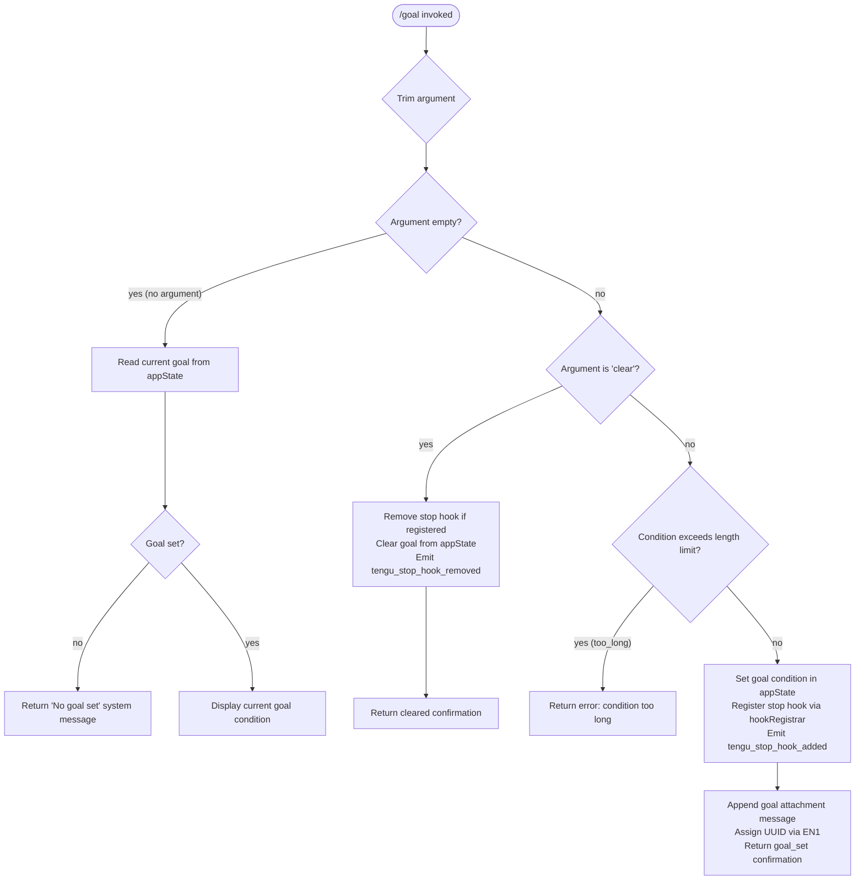

# `/goal`

> Analysis basis: CC v2.1.160 bundle.js (AST extraction + Claude interpretation)
> Minimum version: v2.1.160

---

## Overview

The `/goal` command sets a persistent, session-scoped objective that Claude Code will pursue across multiple turns until a user-specified condition is satisfied. When invoked with a condition string, it registers a stop hook that evaluates at the end of each agent turn whether the goal has been met; when invoked with `clear` (or with no argument), it clears the active goal. The command is marked `immediate`, meaning it processes synchronously before the next agent loop iteration begins.

---

## Registration

| Field | Value |
|---|---|
| type | `local-jsx` |
| name | `goal` |
| description | `Set a goal — keep working until the condition is met` |
| argumentHint | `[<condition> \| clear]` |
| immediate | `true` |
| module_id | `zAK` |
| load_inline | `true` |
| loc_byte | `12797113` |
| loc_byte_end | `12797316` |
| loc_line | `9311` |
| arbor_handler.name | `uIf` |
| arbor_handler.fqn | `claude-2.1.160::uIf` |
| arbor_handler.kind | `AsyncFunction` |
| arbor_handler.resolution_path | `module_id` |
| arbor_handler.n_hits | `0` |

Analysis basis: CC v2.1.160 bundle.js:+12797113

---

## Input Branching

The handler has four distinct input branches (no argument / empty, `clear`, a condition that is too long, and a valid condition string), making a Mermaid flowchart the appropriate representation.



Analysis basis: CC v2.1.160 bundle.js:+12795708 — +12796189

---

## Behavioral Spec

### 1. Entry Point — Argument Normalisation (`uIf`)

The Arbor-resolved handler (`uIf`) is an `AsyncFunction` reached via `module_id` resolution of module `zAK`.

```
async function goalCommandHandler(rawArg, context):
    trimmedArg = rawArg.trim()                        // A.trim  @+12795708
    lowerArg   = trimmedArg.toLowerCase()             // gV8 helper @+12795828

    if lowerArg is in skip-set:                       // gV8 / pqf.has @+10651549
        return early (no-op)

    if trimmedArg is empty:
        return displayCurrentGoal(context)            // branch: no argument

    if lowerArg == "clear":
        return clearGoal(context)                     // branch: clear

    return setGoal(trimmedArg, context)               // branch: new condition
```

Analysis basis: CC v2.1.160 bundle.js:+12795708, +12795814, +12795828, +12795842

---

### 2. Display Current Goal (no-argument path)

```
function displayCurrentGoal(context):
    state = context.getAppState()
    goalCondition = state.goal                        // key "goal" @+10653035

    if goalCondition is absent or null:
        return systemMessage("No goal set")           // @+12795867

    return systemMessage(currentGoalCondition)
```

Analysis basis: CC v2.1.160 bundle.js:+12795867, +12795911, +10653035

---

### 3. Clear Goal (`clear` path)

```
function clearGoal(context):
    removeStopHookIfPresent(context)                  // U86 / hook deregistration
    context.setAppState({ goal: null, goal_status: null })
    emit telemetry("tengu_stop_hook_removed")         // @+10653004
    return systemMessage("goal cleared")
```

Analysis basis: CC v2.1.160 bundle.js:+10653004, +10652878

---

### 4. Set Goal (valid condition path, `p86` / `U86` sub-chain)

```
async function setGoal(condition, context):
    // Gate checks
    applyHooksGate(context)                           // "hooks_gate" @+10652146
    applyTrustGate(context)                           // "trust_gate" @+10652200

    // Persistence
    context.setAppState({
        goal:        condition,                       // "goal"        @+10653035
        goal_status: null                             // "goal_status" @+10653163
    })

    // Stop-hook registration
    hookId = generateUUID()                           // EN1 / XN1.randomUUID @+10653094
    registerStopHook(hookId, goalEvaluator)           // O9 / HDA.register @+59048
    emit telemetry("tengu_stop_hook_added")           // @+10652636

    // Message injection
    attachGoalMessage(context, condition)             // applyMessageOp "append" @+10652970
    messageType = "attachment"                        // @+10653076
    return systemMessage("goal_set")                  // @+12795953
```

Analysis basis: CC v2.1.160 bundle.js:+10652146, +10652200, +10653035, +10653094, +10652636, +10652970, +10653076, +12795953

---

### 5. Stop-Hook Evaluator (`p86` loop body)

At the end of every agent turn the registered stop hook runs:

```
async function goalStopHookEvaluator(turnOutput, context):
    state = context.getAppState()                     // p86 / _.getAppState @+10652335
    condition = state.goal
    timestamp = Date.now()                            // @+10652499

    meetsCriteria = evaluateCondition(condition, turnOutput)  // Da_ / CU sub-chain
    if meetsCriteria:
        context.setAppState({ goal_status: "met" })   // _.setAppState @+10652537
        context.applyMessageOp("append", result)      // _.applyMessageOp @+10652579
        emit telemetry("tengu_feature_ok")            // @+966123
        emitCompletion(context)                       // hH / d @+10652634
    else:
        emit telemetry("tengu_feature_sad")           // @+966258
        continueLoop()
```

Analysis basis: CC v2.1.160 bundle.js:+10652335, +10652499, +10652537, +10652579, +966123, +966258

---

### 6. Bootstrap / API Fetch Sub-chain (`H` → `N`)

During handler initialisation, an API bootstrap fetch may fire to validate session state:

```
function bootstrapFetch(endpoint):
    log("[Bootstrap] Fetching", endpoint)             // @+15451800
    headers = {
        "Content-Type": "application/json",           // @+15451885, +15451900
        "User-Agent":   <agent-string>                // @+15451919
    }
    timeout = 5000 ms                                 // @+15451991
    response = fetch(endpoint, { headers, timeout })
    if parse fails:
        record("api_bootstrap_fetch", "parse_failed") // @+15452112, +15452134
    else:
        log("[Bootstrap] Fetch ok")                   // @+15452164
```

Analysis basis: CC v2.1.160 bundle.js:+15451800, +15451991, +15452112

---

### 7. File-log Sub-chain (`rmK` / `imK`)

Turn output is also streamed to a per-session transcript file:

```
function writeTranscriptEntry(entry, filePath):
    dir = path.dirname(filePath)                      // rmK / je.dirname @+203769
    fs.mkdir(dir, { recursive: true })                // imK / Hy.mkdir  @+203490
    fs.appendFile(filePath, serialisedEntry)          // imK / Hy.appendFile @+203549
    if filePath.endsWith(".txt"):                     // FwA / H.endsWith @+203184
        rotateLogs(filePath)                          // FwA / Hy.rename  @+203247
    byteLen = Buffer.byteLength(entry)                // rmK @+203943
```

File extension used for text rotation: `.txt` (bundle.js:+203195).
Rotation byte-boundary alignment: 4 (bundle.js:+203217).

Analysis basis: CC v2.1.160 bundle.js:+203769, +203490, +203549, +203184, +203943

---

### 8. Output Formatting Helper (`K`)

When printing goal status in the TUI, column widths are padded to **40 characters** with a two-space separator:

```
function formatGoalRow(label, value):
    paddedLabel = label.padEnd(40)                    // K / f.padEnd  @+15871369, literal 40 @+15873361
    return paddedLabel + "  " + value                 // "  " @+15871390
```

Analysis basis: CC v2.1.160 bundle.js:+15871369, +15873361

---

## State & Side Effects

| Item | Detail |
|---|---|
| Telemetry: `tengu_stop_hook_added` | Fired when a new goal condition is successfully registered (bundle.js:+10652636) |
| Telemetry: `tengu_stop_hook_removed` | Fired when `/goal clear` removes the hook (bundle.js:+10653004) |
| Telemetry: `tengu_feature_ok` | Fired when the goal evaluator determines the condition is met (bundle.js:+966123) |
| Telemetry: `tengu_feature_sad` | Fired when the goal evaluator determines the condition is **not** yet met (bundle.js:+966258) |
| Hook registration | `HDA.register` (`O9` → `O9.register`, bundle.js:+59048) — adds a stop hook identified by a freshly generated UUID |
| appState key `goal` | Written with the condition string on set; set to `null` on clear (bundle.js:+10653035) |
| appState key `goal_status` | Written with `"met"` when condition satisfied; `null` otherwise (bundle.js:+10653163) |
| Message injection | `applyMessageOp("append", ...)` appends an `"attachment"`-typed message to the conversation on goal set (bundle.js:+10652970, +10653076) |
| Transcript file I/O | Session output is appended to a `.txt` log file; log rotation runs via `Hy.rename` / `Hy.unlink` (bundle.js:+203247, +203287) |
| Sound | <!-- TODO: not found in depth-2 traversal; needs --depth 4 --> |
| `policySettings` gate | Policy settings object is read during hook registration (bundle.js:+3271552) |
| `hooks_gate` check | Evaluated before hook is registered (bundle.js:+10652146) |
| `trust_gate` check | Evaluated before hook is registered (bundle.js:+10652200) |
| UUID generation | `crypto.randomUUID()` via `XN1.randomUUID` — one UUID per goal-set invocation (bundle.js:+10653094) |

---

## Version History

| Version | Change |
|---|---|
| v2.1.160 | Initial analysis |

---

## Common Mistakes

1. **Passing a multi-word condition without quotes** — the CLI argument parser receives the full remainder of the line as the condition; no quoting is needed, but leading/trailing whitespace is stripped automatically (`A.trim`, bundle.js:+12795708).
2. **Expecting `/goal` to stop the current turn immediately** — the stop hook is evaluated at the *end* of each turn, not mid-stream. Claude will finish its current response before the evaluator runs.
3. **Using `/goal clear` when no goal is set** — the command is a no-op in this case and emits `tengu_stop_hook_removed` regardless; this is safe but may produce a confusing confirmation message.
4. **Setting an excessively long condition** — conditions that exceed the internal length threshold are rejected with a `too_long` error code (bundle.js:+12795964) before any state is mutated.
5. **Assuming goal persistence across sessions** — `goal` and `goal_status` live in in-memory `appState`; they are not persisted to disk and are lost when the CLI process exits.
6. **Confusing `/goal` with `/stop`** — `/goal` registers a *conditional* stop; the agent continues working until the condition is met. A plain `/stop` interrupts immediately without condition evaluation.

---

## Appendix — Identifier Mapping

> For bundle debugging only. Identifiers change across versions.

| Identifier | Role |
|---|---|
| `uIf` | Main goal command handler (AsyncFunction; Arbor-resolved entry point) |
| `A` | Trimmed argument variable / generic array/string operand in sub-routines |
| `f` | File handle / stream object in transcript-write sub-chain |
| `q` | Secondary file handle / Set used for active-stream tracking |
| `L` | Stream lifecycle manager (add/delete/finally operations) |
| `H` | Bootstrap fetch orchestrator / primary context/config object |
| `N` | Bootstrap fetch inner executor |
| `lmK` | Fetch helper — constructs request parameters |
| `ADA` | Sub-helper for fetch parameter assembly |
| `SH` | JSON serialiser wrapper (`JSON.stringify`) |
| `x4` | User-agent string builder |
| `xwA` | Model-list mapper used in user-agent construction |
| `PmH` | Response writer wrapper |
| `ZwA` | Low-level write dispatcher (`H.write`) |
| `rmK` | Transcript file writer / log manager |
| `QuH` | Buffered write queue with `setTimeout`/`setImmediate` scheduling |
| `R$H` | Log-entry formatter |
| `d6` | Transcript directory resolver |
| `A46` | EISDIR error handler for log paths |
| `gwA` | Log file path builder (`path.join`) |
| `FwA` | Log rotation controller (`Hy.stat`, `Hy.rename`, `Hy.unlink`) |
| `imK` | Append-and-rotate writer (`Hy.mkdir`, `Hy.appendFile`) |
| `O9` | Stop-hook registrar wrapper (`HDA.register`) |
| `o$` | Context accessor helper |
| `Ce` | Feature-flag checker (`F64.has`) |
| `wj` | String sanitiser (`H.replace`) |
| `gq` | Conversation-context builder |
| `GHH` | Message-context assembler |
| `DN` | Context field extractor |
| `p9H` | Context field extractor (secondary) |
| `lQ` | Message-list processor / filter |
| `K1` | Model selection / resolution function |
| `C0` | Model config lookup (`wKH`) |
| `DKH` | Model inclusion-list checker (`zKH.includes`) |
| `dN` | Model capability resolver |
| `_gH` | Fallback model resolver |
| `tT` | Primary model selector |
| `XDq` | Model selector wrapper |
| `xM` | Provider type resolver (returns `firstParty`, `anthropicAws`, `gateway`, etc.) |
| `xa6` | Model alias inclusion checker (`Ss4.includes`) |
| `AgH` | Model alias formatter (`FH`) |
| `yP` | Conversation turn assembler |
| `R0` | Turn object constructor |
| `t6` | Render / display helper |
| `d` | Low-level render primitive |
| `gV8` | Argument normaliser — lowercases and checks against skip-set |
| `U86` | Goal-set executor (sets appState, registers hook, appends message) |
| `y6` | Path join utility |
| `zN` | Path resolve utility |
| `m86` | Stop-signal injector / prompt builder |
| `oPH` | Prompt-set dispatcher (`K.set`) |
| `K` | Column-padding formatter (`padEnd`) |
| `yL1` | Message map transformer |
| `EN1` | UUID generator wrapper (`XN1.randomUUID`) |
| `p86` | Stop-hook evaluator (runs at end of each turn) |
| `Da_` | Goal-condition evaluator orchestrator |
| `CU` | Condition evaluation entry point |
| `b8` | Policy / permission gate (`RQ6`, `EQ`) |
| `vY` | ZA-based condition branch resolver |
| `x_` | Evaluation context builder |
| `m7` | Evaluation executor (`cjL`) |
| `cjL` | Core condition evaluator (calls `FH`, `puH`, `N9`, `R6`, `bdH`, `wQ`, `S6`) |
| `Aj` | Output-token accumulator (`Object.values`, `NuH`) |
| `hH` | Completion emitter wrapper |
| `QV8` | Post-set UI refresh / notification dispatcher |

---

Note: index built via Arbor fallback; some signals (telemetry, literals) may be missing — see arbor-fallback.js.