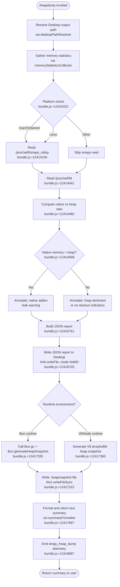

# `/heapdump`

> Analysis basis: CC v2.1.160 bundle.js (AST extraction + Claude interpretation)
> Minimum version: v2.1.160

---

## Overview

`/heapdump` is a hidden developer-diagnostic command that captures a snapshot of the JavaScript heap and a rich memory-statistics report, then writes both to `~/Desktop`. It is intended for detecting memory leaks in the Claude Code process itself and produces output that can be loaded directly into Chrome DevTools for deep inspection.

---

## Registration

| Field | Value |
|---|---|
| type | `local` |
| name | `heapdump` |
| description | `Dump the JS heap to ~/Desktop` |
| supportsNonInteractive | `true` |
| isHidden | `true` |
| module_id | `Gs1` |
| load_inline | `true` |
| loc_byte | `12418766` |
| loc_byte_end | `12419194` |
| loc_line | `8748` |
| arbor_handler.name | `HEf` |
| arbor_handler.fqn | `claude-2.1.160::HEf` |
| arbor_handler.kind | `AsyncFunction` |
| arbor_handler.resolution_path | `module_id` |
| arbor_handler.n_hits | `0` |

Analysis basis: CC v2.1.160 bundle.js:+12418766

---

## Input Branching

The command follows a linear pre-flight → gather → write → report flow with several internal diagnostic branches depending on platform, memory ratios, and runtime environment. Four or more distinct branch paths are present (platform check, memory ratio check, native-leak warning, and Bun vs. V8 heap snapshot path), so a Mermaid flowchart is used.



---

## Behavioral Spec

### Top-Level Handler (`HEf`)

The Arbor-resolved handler `HEf` is an `AsyncFunction` reached via `module_id → Gs1`. It orchestrates two sub-steps: invoking the core dump worker (`wAA`) and then building the human-readable summary lines (`_Ef`).

```
async function heapdumpHandler(context):
    lines = []
    dumpResult = await coreDumpWorker(context)
    summaryLines = buildSummary(dumpResult)
    lines.push(...summaryLines)
    return lines.join("\n")
```

Analysis basis: CC v2.1.160 bundle.js:+12417635, +12417754, +12417781, +12417903

---

### Core Dump Worker (`wAA`)

This is the main async body. It resolves the Desktop path, collects memory stats, writes the JSON report, generates the heap snapshot, and fires telemetry.

```
async function coreDumpWorker(context):
    // 1. Resolve output directory
    desktopPath = resolveDesktopPath()          // qIA: uses os.homedir + "Desktop"
    outputDir   = path.join(desktopPath, ...)   // YAA.join, bundle.js:+12416702

    // 2. Collect memory statistics (slow gather)
    stats = await memoryStatisticsCollector()   // Ts1, bundle.js:+12416310

    // 3. Write JSON report (file mode 0o600 = 384 decimal)
    reportPath = path.join(outputDir, <timestamp>.json)
    await hA6.writeFile(reportPath, JSON.stringify(stats), { mode: 384 })
    //   mode 384 = 0o600  (bundle.js:+12416780)

    // 4. Fire telemetry
    emit("tengu_heap_dump")                     // bundle.js:+12416887

    // 5. Generate heap snapshot
    snapshotResult = await heapSnapshotGenerator()  // eTf, bundle.js:+12416836

    // 6. Handle errors / finalise
    if error:
        formatError(error)                      // d_, bundle.js:+12417056
    emit output lines via SO                    // bundle.js:+12417065
    run subprocess output collector yH          // bundle.js:+12417143
    return aggregated result
```

Analysis basis: CC v2.1.160 bundle.js:+12416273, +12416284, +12416593, +12416702, +12416745, +12416761, +12416780, +12416836, +12416885, +12416953

---

### Memory Statistics Collector (`Ts1`)

Gathers all available memory metrics from the Node/Bun process and (on Linux) from `/proc`.

```
async function memoryStatisticsCollector():
    report = {}

    // Node/Bun built-ins
    report.memoryUsage    = process.memoryUsage()           // bundle.js:+12413798
    report.heapStatistics = v8.getHeapStatistics()          // ky8, bundle.js:+12413822
    report.resourceUsage  = process.resourceUsage()         // bundle.js:+12413848
    report.uptime         = process.uptime()                // bundle.js:+12413874
    report.heapSpaces     = v8.getHeapSpaceStatistics()     // ky8, bundle.js:+12413899
    report.activeHandles  = process._getActiveHandles().length  // bundle.js:+12413941
    report.activeRequests = process._getActiveRequests().length // bundle.js:+12413978

    // Linux /proc virtual filesystem
    try:
        fdList   = await fs.readdir("/proc/self/fd")        // bundle.js:+12414029, +12414041
        smaps    = await fs.readFile(                       // bundle.js:+12414091, +12414104
                       "/proc/self/smaps_rollup", "utf8")   // bundle.js:+12414130
        report.openFdCount = fdList.length
        report.smapsRollup = parseSmaps(smaps)              // T, bundle.js:+12414202
    except:
        // Non-Linux: skip silently

    // Bun JSC heap (if available)
    // module: "bun:jsc"                                    // bundle.js:+12414189
    if bunJscAvailable:
        report.jscHeap = jsc.getHeapStatistics()

    // Age of open file descriptors (up to 3600s / 1048576 entries cap)
    // limits:  3600 (bundle.js:+12414330), 1048576 (bundle.js:+12414335)
    report.fdAges = gatherFdAges(fdList, limit=3600, cap=1048576)

    // Native vs. heap ratio threshold: 100 %
    // bundle.js:+12414482
    nativeBytes = report.resourceUsage.maxRSS - report.memoryUsage.heapTotal
    heapBytes   = report.memoryUsage.heapTotal
    if nativeBytes > heapBytes * (100 / 100):
        // warn: "Native memory > heap - leak may be in native addons (node-pty, sharp, etc.)"
        // bundle.js:+12414568
        report.leakWarning = "native_addon_suspected"
    else:
        report.leakWarning = null

    report.rssFormatted = (rss / 1048576).toFixed(...)     // P.toFixed, bundle.js:+12414691

    return report
```

Analysis basis: CC v2.1.160 bundle.js:+12413798–12414691, +12415415

---

### Desktop Path Resolver (`qIA`)

Determines the correct Desktop directory path, including WSL/Windows cross-mount detection.

```
function resolveDesktopPath():
    home = os.homedir()                         // $o8.homedir, bundle.js:+1016352
    candidates = [
        path.join(home, "Desktop"),             // bundle.js:+1016388, "Desktop" literal +1016398
    ]

    // WSL Windows user profile detection
    // "/mnt/c/Users" prefix, bundle.js:+1016620
    // Excludes: "Public", "Default", "Default User", "All Users"
    // bundle.js:+1016664, +1016683, +1016703, +1016728
    if isWSL():
        windowsUsers = listWindowsUsers("/mnt/c/Users", exclude=systemAccounts)
        for user in windowsUsers:
            candidates.append("/mnt/c/Users/{user}/Desktop")

    // Replace tilde expansions
    resolved = candidates[0].replace(...)       // q.replace, bundle.js:+1016528

    // Ensure directory exists
    await ensureDir(resolved)                   // d6, bundle.js:+1016565

    return resolved
```

Analysis basis: CC v2.1.160 bundle.js:+1016345, +1016352, +1016388, +1016528, +1016565, +1016837

---

### Heap Snapshot Generator (`eTf`)

Writes the `.heapsnapshot` file using either the Bun or the V8 API.

```
async function heapSnapshotGenerator():
    snapshotPath = path.join(outputDir, <timestamp>.heapsnapshot)

    if isBunRuntime():
        // Force GC before snapshot for cleaner data
        Bun.gc(true)                            // bundle.js:+12417392
        snapshot = Bun.generateHeapSnapshot()   // bundle.js:+12417335
        // snapshot format: "v8" / "arraybuffer" literals bundle.js:+12417360, +12417365
        fs.writeFileSync(snapshotPath, snapshot) // Ws1.writeFileSync, bundle.js:+12417315
    else:
        // V8 writeableStream approach
        stream = v8.writeHeapSnapshot(snapshotPath)
        await stream completion

    return snapshotPath
```

Analysis basis: CC v2.1.160 bundle.js:+12417315, +12417335, +12417360, +12417365, +12417392

---

### Summary Formatter (`_Ef`)

Builds the human-readable lines returned to the CLI user.

```
function buildSummary(dumpResult):
    lines = []

    // Guidance line always present
    lines.push(
      "Open the .heapsnapshot in Chrome DevTools → Memory → Load to inspect retainers."
      // bundle.js:+12417791
    )

    // Memory breakdown hint
    heapFraction = heapBytes / totalRSS
    if heapFraction >= threshold:              // Math.max, bundle.js:+12418010
        lines.push("— most memory is JS heap (inspect the .heapsnapshot)")
        // bundle.js:+12418078
    else:
        lines.push("— most memory is native (NOT in the .heapsnapshot)")
        // bundle.js:+12418138

    // Native-leak indicator
    if noObviousLeakIndicators:
        lines.push("  (no obvious leak indicators)")  // bundle.js:+12418275

    // SA6: additional formatting / file path reporting
    lines.push(...formatFilePaths(dumpResult, SA6))  // bundle.js:+12418322

    // Upper bound for report line count: 8 items
    // bundle.js:+12418410

    return lines
```

Analysis basis: CC v2.1.160 bundle.js:+12417791, +12418010, +12418078, +12418138, +12418275, +12418322, +12418410

---

### Memory Threshold: 1 GiB Marker

A constant `1073741824` (1 GiB = 1024³ bytes) is present in the implementation near the summary logic and is used as a reference point when classifying memory usage categories.

Memory size reference constant: 1,073,741,824 bytes (1 GiB) — bundle.js:+12418684

---

## State & Side Effects

| Item | Detail |
|---|---|
| Telemetry | `tengu_heap_dump` (bundle.js:+12416887) — fired once per invocation after the JSON report is written |
| Telemetry (background, indirect) | `tengu_bg_dispatch_sigkill_escalate`, `tengu_bg_dispatch_low_mem`, `tengu_bg_spare_enable`, `tengu_bg_spare_claim`, `tengu_bg_spare_claim_fail`, `tengu_bg_proto_mismatch`, `tengu_bg_dispatch_stale_drop`, `tengu_bg_attach_legacy_autorespawn`, `tengu_bg_attach`, `tengu_bg_attach_stall_gave_up`, `tengu_bg_attach_stall_respawn`, `tengu_bg_attach_kick`, `tengu_feature_sad` — all from the background daemon layer reached transitively; not directly fired by `/heapdump` itself |
| Files written | `<Desktop>/<timestamp>.json` (memory stats, mode `0o600`) and `<Desktop>/<timestamp>.heapsnapshot` (V8/Bun heap snapshot) |
| File permissions | JSON report written with mode `384` decimal = `0o600` (owner read/write only) — bundle.js:+12416780 |
| GC side effect | On Bun runtime, `Bun.gc(true)` is called (synchronous full GC) before snapshot generation — bundle.js:+12417392 |
| /proc reads | `/proc/self/fd` (fd listing) and `/proc/self/smaps_rollup` (memory map) are read on Linux — bundle.js:+12414041, +12414104 |
| Hook registration | `O9` calls `HDA.register` — bundle.js:+59048; likely registers a finalization or error handler |
| appState changes | None observed in depth-2 traversal |
| Sound | None observed |

---

## Version History

| Version | Change |
|---|---|
| v2.1.160 | Initial analysis |

---

## Common Mistakes

1. **Running on non-Desktop systems**: The command targets `~/Desktop` by default; if that directory does not exist (e.g., headless servers), the write will fail. The resolver attempts to create the path, but the caller should verify the directory is accessible.
2. **Expecting output in the current working directory**: Both output files are always written to the Desktop (or WSL Windows Desktop), never to the project directory or current working directory.
3. **Using the JSON report for heap inspection**: The JSON report contains process-level memory statistics. The actual heap object graph is in the `.heapsnapshot` file and must be loaded into Chrome DevTools → Memory → Load Profile.
4. **Triggering on a memory-stable process**: The `Bun.gc(true)` call forces a full GC before the snapshot; running the command repeatedly in quick succession may temporarily inflate GC pause times.
5. **Assuming the command is available in production builds**: `isHidden: true` means `/heapdump` does not appear in `/help` output and is not intended for end-user use.
6. **Misinterpreting the native-leak warning**: The warning `"Native memory > heap - leak may be in native addons (node-pty, sharp, etc.)"` (bundle.js:+12414568) fires when native RSS exceeds heap total; this is a heuristic threshold (`100` at bundle.js:+12414482), not a confirmed leak.

---

## Appendix — Identifier Mapping

> For bundle debugging only. Identifiers change across versions.

| Identifier | Role |
|---|---|
| `HEf` | Top-level async handler for `/heapdump` (Arbor-resolved entry point) |
| `wAA` | Core dump worker — orchestrates path resolution, stat collection, file writing, and telemetry |
| `Ts1` | Memory statistics collector — queries process, V8/JSC, and /proc APIs |
| `eTf` | Heap snapshot generator — selects Bun or V8 path and writes `.heapsnapshot` |
| `_Ef` | Summary formatter — builds human-readable result lines |
| `qIA` | Desktop path resolver — handles macOS, Linux, and WSL Windows paths |
| `y6` | Utility — appears in both stat collection and output formatting paths |
| `zN` | Utility called from `y6` |
| `T` | smaps/proc parser — called during /proc file read phase |
| `kN6` | Helper called by proc parser `T` |
| `Yu8` | Helper called by proc parser `T` and connection management |
| `X` | Async task / subprocess wrapper used during stat collection |
| `yH` | Subprocess output / stream collector |
| `d_` | Error formatter |
| `P` | Stream/buffer protocol handler (IPC layer) |
| `J` | Buffer accumulator inside IPC layer |
| `w` | Background daemon supervisor |
| `i5` | Stream end/close helper |
| `k85` | Background daemon message dispatcher |
| `GH` | String coercion helper |
| `N` | Output/notification writer |
| `lmK` | Notification helper called by output writer |
| `ADA` | Sub-helper of notification layer |
| `H` | Bootstrap fetch / HTTP helper |
| `o$` | Sub-helper of bootstrap fetch |
| `Ce` | Feature-flag check inside bootstrap |
| `wj` | String replace helper |
| `gq` | Locale/format helper |
| `t6` | Utility called during output formatting |
| `SH` | JSON.stringify wrapper |
| `x4` | Path/string processing utility |
| `xwA` | Map-over-paths helper inside `x4` |
| `q` | File unlink / path utility |
| `A` | Case-normalisation utility |
| `PmH` | Write-stream wrapper |
| `ZwA` | Low-level write helper |
| `rmK` | File rotation / log writer |
| `QuH` | Timeout-guarded queue flusher |
| `R$H` | Path-join + write helper |
| `d6` | Directory-ensure utility |
| `A46` | Helper used by file rotation and mkdir paths |
| `gwA` | Path-join + stat helper |
| `FwA` | File stat/rename/unlink helper |
| `imK` | mkdir + appendFile helper (log appender) |
| `O9` | Hook/finalizer registrar (`HDA.register`) |
| `K` | Map-with-padding formatter |
| `L` | Async task set (add/delete/finally) |
| `f` | Close handler for task set |
| `SA6` | File-path reporting helper used in summary formatter |
| `SO` | Output emitter used after heap snapshot write |
| `d` | Low-level utility (used in multiple sites) |

---

Note: index built via Arbor fallback; some signals (telemetry, literals) may be missing — see arbor-fallback.js.