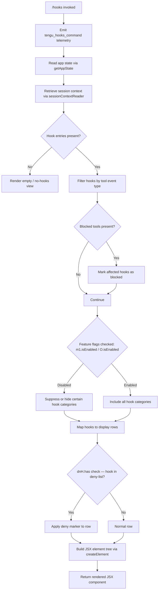

# `/hooks`

> Analysis basis: CC v2.1.160 bundle.js (AST extraction + Claude interpretation)
> Minimum version: v2.1.160

---

## Overview

The `/hooks` command displays the current hook configurations that are registered for tool events in the active Claude Code session. It is a read-only, immediate JSX-rendered command that retrieves application state, formats hook entries, and presents them in the terminal UI without modifying any configuration.

---

## Registration

| Field | Value |
|---|---|
| type | `local-jsx` |
| name | `hooks` |
| description | `View hook configurations for tool events` |
| immediate | `true` |
| module_id | `Oo1` |
| load_inline | `true` |
| loc_byte | `12309909` |
| loc_byte_end | `12310059` |
| loc_line | `8626` |
| arbor_handler.name | `Z0f` |
| arbor_handler.fqn | `claude-2.1.160::Z0f` |
| arbor_handler.kind | `AsyncFunction` |
| arbor_handler.resolution_path | `module_id` |
| arbor_handler.n_hits | `0` |

Analysis basis: CC v2.1.160 bundle.js:+12309909

---

## Input Branching

The command exhibits 4+ distinct branches based on hook configuration state, tool filtering, enabled/disabled flags, and blocked tool lists. A Mermaid flowchart is used.



Analysis basis: CC v2.1.160 bundle.js:+12309707 (handler entry), +12309749 (render pipeline), +9720225 (has-check), +9720352 (filter), +9720367 (deny-list check)

---

## Behavioral Spec

### Top-level Handler — `hooksCommandHandler`

The Arbor-resolved handler (`Z0f`) is an `AsyncFunction` reached via the `module_id` resolution path through module `Oo1`.

```
async function hooksCommandHandler(context):
    emit telemetry("tengu_hooks_command")
    appState = readAppState(context)           // via getAppState
    sessionCtx = getSessionContext(appState)   // via sessionContextReader

    hookEntries = buildHookEntryList(appState, sessionCtx)
    renderData  = buildRenderPayload(hookEntries)

    element = createElement(renderData)
    return element
```

Analysis basis: CC v2.1.160 bundle.js:+12309709 (telemetry), +12309707 (`d` call), +12309741 (`N_` call), +12309749 (`Rv` call), +12309779 (`createElement` call)

---

### Sub-feature: App State Reader — `sessionContextReader`

Retrieves the current app state and locates the most recent session entry using `findLast`, then inspects three key fields.

```
function sessionContextReader(stateManager):
    state = stateManager.getAppState()
    session = state.findLast(entry => entry.type == "session")

    workingDirectory = session["working_directory"]   // literal: "working_directory"
    allowedTools     = session["allowed_tools"]       // literal: "allowed_tools"
    disallowedTools  = session["disallowed_tools"]    // literal: "disallowed_tools"
    avoidPrompts     = session["avoid_prompts"]       // literal: "avoid_prompts"

    return { workingDirectory, allowedTools, disallowedTools, avoidPrompts, session }
```

Analysis basis: CC v2.1.160 bundle.js:+10792430 (`getAppState`), +10792510 (`findLast`), +10792535 ("working_directory"), +10792590 ("allowed_tools"), +10792645 ("disallowed_tools"), +10792706 ("avoid_prompts")

---

### Sub-feature: Session Metadata Fields

Additional session-level metadata fields accessed during rendering:

| Literal | Purpose |
|---|---|
| `"session"` | Session entry type discriminator |
| `"effort"` | Effort-level setting in session |
| `"model"` | Model identifier in session |
| `"max_thinking_tokens"` | Extended thinking token limit |
| `"flag_settings"` | Feature flag overrides |

Analysis basis: CC v2.1.160 bundle.js:+10793005, +10793030, +10793043, +10793055, +10793081

---

### Sub-feature: Hook Entry Builder — `buildHookEntryList`

Constructs the list of hook entries to display by walking allowed/disallowed tool lists.

```
function buildHookEntryList(appState, sessionCtx):
    rawHooks = collectAllHooks(appState)         // via rAH + _v6 + J5H + Go_
    filtered = rawHooks.filter(h => !isBlocked(h))

    result = []
    for hook in filtered:
        source = resolveToolSource(hook)         // "cliArg" or "toolsNarrowing" or "deny"
        entry  = {
            hook:   hook,
            source: source,
            blocked: blockedToolsSet.has(hook.tool)   // via dnH.has
        }
        result.push(entry)
    return result
```

Analysis basis: CC v2.1.160 bundle.js:+9720020 (`rAH`), +9719214 (`_v6`), +10501606 (`flatMap` over hooks), +9720367 (`dnH.has`), +10502269 ("cliArg"), +10502290 ("toolsNarrowing"), +10501683 ("deny")

---

### Sub-feature: Hook Source Resolver — `resolveToolSource`

Determines the provenance of each tool permission entry.

```
function resolveToolSource(hook):
    if hook comes from CLI arguments:
        return "cliArg"
    if hook comes from tools-narrowing:
        return "toolsNarrowing"
    if hook is denied:
        return "deny"
    return null
```

Analysis basis: CC v2.1.160 bundle.js:+10502269, +10502290, +10501683

---

### Sub-feature: Render Payload Builder — `buildRenderPayload`

Assembles display data rows, applying feature-flag gating and string formatting.

```
function buildRenderPayload(hookEntries):
    rows = []

    for entry in hookEntries:
        if featureFlagWorkflowsEnabled():       // O.isEnabled check
            include workflow-type hooks
        if featureFlagM1Enabled():              // m1.isEnabled check
            include extended hook categories

        row = formatHookRow(entry)
        rows.push(row)

    return rows

function formatHookRow(entry):
    label = entry.hook.tool.toUpperCase()      // _.toUpperCase call
    label = label.trim()                       // H.trim call
    if entry.blocked:
        label = label + " [blocked]"           // literal: "blocked"
    return { label, source: entry.source, blocked: entry.blocked }
```

Analysis basis: CC v2.1.160 bundle.js:+9720276 (`m1.isEnabled`), +9720406 (`O.isEnabled`), +9720253 (`K.some`), +9720395 (`K.map`), +204349 (`toUpperCase`), +204372 (`trim`), +9719260 ("blocked")

---

### Sub-feature: Debug Logging — `debugLogger`

A debug-level string literal `"debug"` is present in the traversal path through the hook entry formatter, suggesting conditional debug output is emitted during hook resolution.

```
function debugLogger(message, data):
    if logLevel == "debug":
        log("[hooks]", message, JSON.stringify(data))   // SH -> JSON.stringify
```

Analysis basis: CC v2.1.160 bundle.js:+204223 ("debug"), +183798 (`JSON.stringify`)

---

### Sub-feature: Numeric Limits Observed

| Constant | Value | Likely Role |
|---|---|---|
| Truncation/slice offset | `0` | Start of string slice in path formatter |
| Redaction marker index | `2` | Index position in path-segment array |
| Bootstrap timeout | `5000` | ms — network fetch timeout (bootstrap path) |
| Pad width | `40` | Column padding for display rows |
| Row display limit | `1000` | Maximum entries before truncation |
| Batch size | `100` | Chunk size in batch processing |

Analysis basis: CC v2.1.160 bundle.js:+196276, +196379, +15451991, +15873361, +204054, +204073

---

## State & Side Effects

| Item | Detail |
|---|---|
| Telemetry | `tengu_hooks_command` (primary, emitted on invocation at +12309709); `tengu_feature_ok` (+966123); `tengu_feature_bad` (+966181); `tengu_feature_sad` (+966258); `tengu_daemon_control` (+15883547); `tengu_daemon_config_reload` (+15862022); `tengu_slate_harbor` (+4752888); `tengu_workflows_enabled` (+4147955); `tengu_cobalt_ridge` (+4871742); `tengu_amber_flint` (+5435606) |
| App state changes | None — the command is read-only; it calls `getAppState` but does not call any setter or mutation on app state |
| Hook registration | `immediate: true` — the command executes synchronously on invocation without requiring an agent turn |
| JSX rendering | Calls `l_A.createElement` (+12309779) to produce an inline JSX component rendered directly in the terminal UI |
| Session fields read | `working_directory`, `allowed_tools`, `disallowed_tools`, `avoid_prompts`, `session`, `effort`, `model`, `max_thinking_tokens`, `flag_settings` |
| Feature flags checked | `m1.isEnabled` (+9720276), `O.isEnabled` (+9720406) |
| Deny-list check | `dnH.has` (+9720367) — cross-references tool names against a runtime deny-list |
| Sound | None detected |

---

## Version History

| Version | Change |
|---|---|
| v2.1.160 | Initial analysis |

---

## Common Mistakes

1. **Expecting configuration mutation** — `/hooks` is a viewer, not an editor. It does not modify hook configurations; users who want to add or remove hooks must edit their settings files directly.
2. **Confusing "blocked" with "disallowed"** — A hook entry may appear as `blocked` (in the `dnH` deny-list) independently of whether its tool appears in the `disallowed_tools` session list; both checks exist and have distinct meanings.
3. **Assuming output when no hooks are configured** — If no hooks are registered for any tool event, the command renders an empty view rather than an error. This is expected behavior.
4. **Expecting all hook categories to be visible regardless of plan** — Certain hook categories are gated behind `m1.isEnabled` and `O.isEnabled` feature flags; users on plans that do not enable workflows may see a reduced set of hooks displayed.
5. **Running in non-interactive mode** — Because the command type is `local-jsx`, it renders a JSX component directly. It is not designed for `--print` or non-TTY pipeline use and may produce no useful output in those contexts.

---

## Appendix — Identifier Mapping

> For bundle debugging only. Identifiers change across versions.

| Identifier | Role |
|---|---|
| `Z0f` | Top-level hooks command handler (AsyncFunction, Arbor-resolved) |
| `d` | Generic utility / logger called at command entry |
| `N_` | Session context reader (wraps `getAppState` + `findLast`) |
| `H` | App state / HTTP fetch utility (context-dependent) |
| `N` | Hook entry formatter / display string builder |
| `lmK` | Sub-formatter for hook label construction |
| `SH` | JSON serializer wrapper (calls `JSON.stringify`) |
| `_` | String utility target (`.toUpperCase`, `.toLowerCase`, `.replace`) |
| `x4` | Path segment formatter (uses `replace`, `at`, `lastIndexOf`, `slice`) |
| `PmH` | Auxiliary prompt/hook helper (calls `ZwA`) |
| `rmK` | Hook file reader / resolver (calls `dirname`, `Buffer.byteLength`) |
| `o$` | App state sub-accessor |
| `Ce` | Feature flag set checker (`F64.has`) |
| `wj` | String replacement helper |
| `gq` | Model name resolver / query processor |
| `GHH` | Model name parser (sub-components: `DN`, `p9H`, `ZA`, `lQ`) |
| `K1` | Model string normalizer (`trim`, `toLowerCase`, `replace`) |
| `yP` | Model resolution wrapper (calls `K1`, `R0`) |
| `t6` | Telemetry helper / logger bridge |
| `A` | Array or string target in various call sites |
| `f` | File handle / stream reference |
| `q` | File/stream secondary handle (unlinkSync, close) |
| `L` | Set-based resource tracker (`add`, `delete`, `finally`) |
| `Ov8` | Hook state reader variant A (calls `eA`) |
| `eA` | Core hook state accessor |
| `zv8` | Hook state reader variant B (calls `eA`) |
| `Rv` | Render payload builder / primary UI assembly function |
| `FH` | String coercion / formatting helper (calls `String`) |
| `Q0` | Context/client resolver |
| `gQ` | Client getter sub-utility |
| `E1` | Boolean / string coercer (calls `String`) |
| `W6` | React hook registration / subscription manager |
| `HY6` | Hook subscription sub-handler A |
| `_Y6` | Hook subscription sub-handler B |
| `px` | Hook update emitter (calls `FH`, `mx`) |
| `HA8` | Dedup/cache manager for hook subscriptions (`jY_.has/add`, `WDH.get`) |
| `R6` | Timer-based hook scheduler (`Date.now`, `ojL`) |
| `D` | Daemon / subprocess manager (supervisor, heartbeat) |
| `jWH` | Process message writer / IPC handler |
| `L1` | Async-local-storage reader (`vyL.getStore`) |
| `G8` | IPC message builder |
| `P9A` | Message payload formatter (calls `J9A`) |
| `GH` | String coercer in IPC context (calls `String`) |
| `K` | Column-padded display formatter (`map`, `padEnd`) |
| `Z_K` | Table layout calculator (`Object.keys`, `Math.max`, `YY`) |
| `E` | Event handler with `preventDefault` |
| `b` | Event object target |
| `x0` | User settings mutator (`F_`) |
| `Z` | Daemon process controller (`stop`, `updateConfig`, `start`) |
| `ekK` | Heartbeat emitter (calls `W6H`) |
| `V` | Secondary process controller (`start`) |
| `lc_` | React-like hook executor (calls `zJ1`, `G_`) |
| `G_` | Module initializer / ESM bootstrap (`__esModule`, `iC6.call`, `rC6.bind`) |
| `rC6` | Module factory binding target |
| `UP` | Permission/feature-gate resolver |
| `gK8` | Permission checker sub-utility (calls `FH`, `EG`) |
| `EG` | Effective permission evaluator |
| `Xq9` | Workflow feature checker (calls `G9`) |
| `G9` | Feature flag gate for workflows/product-feedback |
| `zW_` | Workflow permission resolver (calls `ISL`) |
| `ISL` | Inline subscription/permission loader (calls `FH`, `W6`, `E1`, `z1`) |
| `NSL` | Negative subscription loader (calls `EG`) |
| `rAH` | Hook list filter (calls `_v6`) |
| `_v6` | Hook source resolver (calls `J5H`, `Go_`, `mV1`) |
| `J5H` | Flat-map hook expander (`NV8.flatMap`, `o3`) |
| `Go_` | Hook-source matcher (`Ks8`, `M56`, `PR`) |
| `mV1` | Hook merge utility |
| `nc_` | Platform/OS check sub-utility (calls `PC`, `EH6`, `G_`) |
| `PC` | Windows platform checker (literal: `"windows"`) |
| `W4` | Platform utility wrapper (calls `r6`, `T1H`) |
| `z` | Daemon lifecycle array builder |
| `hH` | Daemon stop event emitter (literal: `"daemon_stop"`) |
| `RH` | Daemon stop-failed event emitter (literal: `"daemon_stop_failed"`) |
| `Qy` | First-party daemon controller (`mx`, `vVH`, `YY_`) |
| `mx` | MCP/daemon client connector (calls `BR`) |
| `vVH` | Daemon connection verifier (calls `gy`) |
| `YY_` | Session UUID generator (`zY_.randomUUID`, `rQH`, `kU`) |
| `_p` | Graceful shutdown orchestrator (`Promise.race`, `Promise.all`, `process.exit`) |
| `Wd` | Shutdown signal sender (`O4H.shutdown`) |
| `Zd` | Timeout canceller (`clearTimeout`, `FY_`) |
| `d8` | Abort/timeout manager (`setTimeout`, `clearTimeout`, `L.unref`) |
| `Cs` | Full hooks UI component / main render controller |
| `lP` | Label/prompt formatter (calls `FH`) |
| `Sw` | Switcher/selector component (calls `E1`) |
| `N66` | Numeric display formatter |
| `p9` | Agent-teams flag handler (literal: `"--agent-teams"`) |
| `FsL` | Feature string loader |
| `ll7` | Left-side hook lifecycle handler (calls `cj1`, `G_`) |
| `nl7` | Right-side hook lifecycle handler (calls `aj1`, `G_`) |
| `xI` | Context/environment inspector (calls `on_`, `N`, `jA`, `C7`) |
| `on_` | Standard/tst mode detector (literals: `"standard"`, `"tst"`, `"tst-auto"`) |
| `jA` | API provider detector (literals: `"bedrock"`, `"foundry"`, `"vertex"`) |
| `C7` | Additional context checker |
| `V4` | Version/variant accessor |
| `O` | Feature-flag object with `isEnabled` method |
| `C8` | Feature flag backing store |
| `$` | Session timestamp/log writer (calls `aHK`) |
| `aHK` | Log record builder (`Date.now`, `L1`, `ny6`, `SH`) |
| `$r` | JSON key helper (calls `JKH`) |
| `ny6` | Status file path builder (literal: `"daemon.status.json"`) |

---

Note: index built via Arbor fallback; some signals (telemetry, literals) may be missing — see arbor-fallback.js.